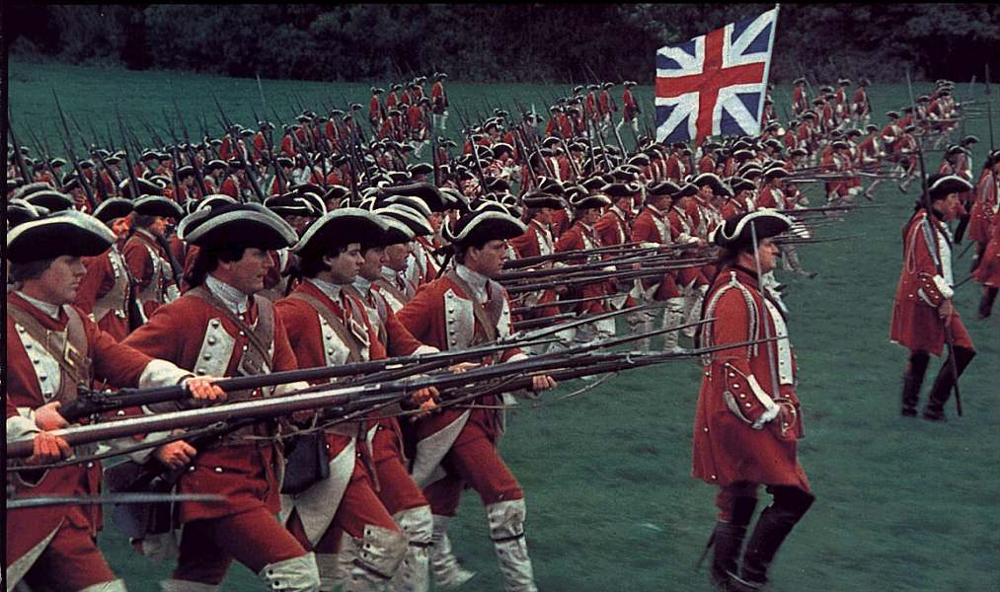

# 대형 SI 프로젝트

창, 검, 활 같은 냉병기를 사용하던 시대의 군주들은 군대를 가지려면 신하들과 계약을 하고 영지를 나눠주고, 그 영지에서 말과 군사를 기르며, 꼬꼬마때부터 전쟁 기술을 배우도록 해야 했다. 또한 신하들도 무력을 가지고 있었기 때문에 적절히 권력을 배분하고, 결혼을 통해 관계를 유지해야 했다.

올림픽 태권도 선수의 양성처럼, 1명의 기사를 양성하려면, 수십년의 시간과 시종, 말, 갑옷, 장구, 등의 비용으로 현재 시세로 몇십억 이상이 들었고, 검이나 창으로 무장한 보병을 양성하려면 수억원이 들었다. 많은 비용으로 장기간 양성을 해야 했기때문에, 전투에서 지휘체계가 무너지는 정도로 패하면 십수년 내에 전투력의 회복은 불가능하였다.

<iframe width="560" height="315" src="https://www.youtube.com/embed/_KzsTKqTq1M" frameborder="0" allow="accelerometer; autoplay; encrypted-media; gyroscope; picture-in-picture" allowfullscreen></iframe>

*[영화: 기사 윌리엄]*

초기의 총은 머스킷 종류였고, 몇분에 한발 밖에 쏠 수 없었는데, 차츰 전쟁터를 휘어 잡게 되고, 군주들이 선호하는 무기가 된다. 총의 가격은 천만원정도로 비쌌지만, 농부의 자식이나 도망자, 떠돌이, 범죄자들을 모아서 2~3일 동안 제식과 사격 자세를 가르치고, 2~5발의 실사격을 거친 후 전쟁터에 데려 갈 수 있었다. 이들에게 멋진 재킷을 입힌 이유도, 멋지게 보여서 이제 세상에 나온 순진한 뜨내기들을 꼬드겨서 전쟁터에 데려가기 위해서였다.

![![Viggo Mortensen in Alatriste]](https://www.brego.net/wp-content/uploads/2006/07/viggo-mortensen-alatriste-soldiers-02.jpg)

*[영화 알라트리스테: 냉병기에서 화기로 넘어가는 과정이다. 전문 군인들의 일사분란한 제식을 볼 수 있다. 당시 냉병기 그중에서 검을 잘 사용할 수 있으면 전문 군인이라고 할 수 있었다.]*

이 뜨내기들은 군대가 아니면 평생 입어볼 기회도 없는 고급 재킷을 입고, 평생 반경 4km를 벗어날 수 없는 농부의 운명을 벗어나 수백 수천 킬로 거리를 여행 할 수 있었다.

기사 한명 양성할 자금으로 50명 이상의 머스킷티어를 고용하고 무장할 수 있었다. 꼬꼬마때 부터 무술을 연마한 올림픽 금메달급 기사가 레벨이 높다고 하여도, 50명의 다굴에는 당할 수 없었고, 뜨내기로 구성된 군대가 전쟁터를 휘어잡게 된 것이다.

뜨내기들을 모아서 구성한 군대는 치명적인 약점이 있었다. 전문 군인들은 연대장급의 지휘에도 일사분란하게 움직일 수 있었는데, 뜨내기들은 절대적인 훈련의 부족으로 쉽게 전열이 무너지거나, 전열 보병의 전투력의 핵심인 제식을 제대로 이행하지 못하며, 적재적소로 빠르게 움직이지 못한다는 점이있다.

이 문제를 해결하기 위해, 뜨내기들 중 살아 남은 고참병들을 선발하여 부사관으로 임명하여, 전투 현장에서 직접 뜨내기들을 지휘하도록 하였다. 전열 보병이 등장하는 영화(예를 들면 늪속의 여우나 배리 린든)를 보면, 앞이나 측면에서 검을 들고 호령을 하는 이들이 이 부사관들이다.

*[영화: 배리 린든. 프랑스군을 향해 전진하는 레드코트]*

<iframe width="560" height="315" src="https://www.youtube.com/embed/m7wEUlpaYjY" frameborder="0" allow="accelerometer; autoplay; encrypted-media; gyroscope; picture-in-picture" allowfullscreen></iframe>

*[영화: 배리 린든, 전장으로 떠나는 퍼레이드]*

장교들은 뒤쪽의 안전한 장소에 있었으며, 심지어 장교들끼리 서로 죽이지 말자거나 사격을 금지하는 계약도 있었다.

이 전열 보병중에는 수많은 전투에서 살아 남은 백전 노장도 있을 수 있는데, 그들의 역할도 뜨내기 신병들과 동일 했다. 명령대로 전진하다가 장전하고 쏘고, 장전하고 쏘다가 탄약이 바닥나거나 총열에 탄매가 끼어서 사격이 불가능하면 총검으로 닥돌하는 식이었다.

왜 이런 오래된 이야기를 하느냐 하면, 머스킷으로 무장한 수백년전 전열 보병으로 구성된 군대가 21세기 대형 SI 프로젝트와 유사하기 때문이다.

대부분의 기업들은 고정비를 좋아하지 않는다. 가능한 고정비를 줄이고 싶어 한다. 그러다가 달려야 할 상황이 되면, 저렴하게 한꺼번에 풀려고 한다. 이 과정은 마치 머스킷이 등장하던 시기의 군주들처럼 보인다.

ㅇ이라고 불리는 모병관들을 통해 전쟁터를 떠도는 개발자들을 모으는데 대부분이 이제 세상에 나온 뜨내기들이다. 이 뜨내기들은 서로 특기와 실력을 알기도 어렵고 호흡을 맞출 시간도 없다. 서로를 알아가기에도 부대의 규모가 비대하다. 그래서 소수의 장교들이 설계를 하고 일선의 부사관들이 지휘를 하게 한다. 보도방의 모병관이 끌어온 뜨내기 개발자들에게 시키는데로 전진하다가 총을 쏘게만 한다. 이들 중에는 수많은 대형 SI 프로젝트를 뛰며 잔뼈가 굵은 고참 개발자도 있을 것이다. 하지만, 고참 개발자들의 역할도 설계와 지시에 따라 전진하다가 장전하고 쏘고, 장전하고 쏘고, 더 이상 쏠 수 없으면 닥돌하는 역할이라 특별한 대우는 없다.

오늘도 머스킷티어들은 장교와 부사관들의 지휘에 따라 돌격하며 서로 총을 쏘다가 갈려 나간다.

<!--stackedit_data:
eyJoaXN0b3J5IjpbLTUzMzU4NDM2MV19
-->