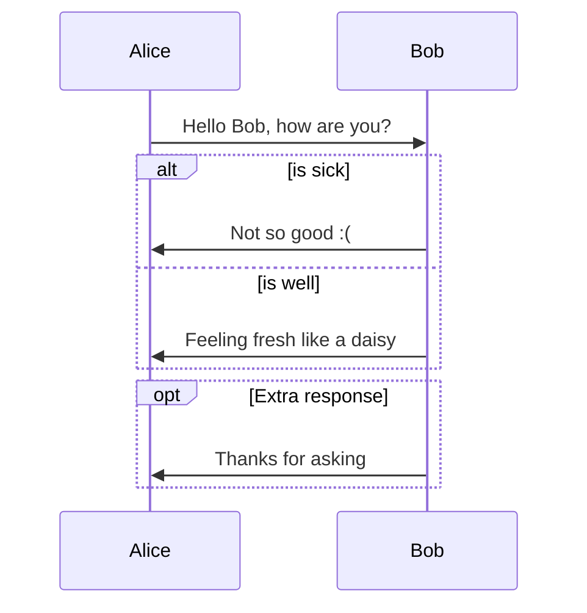
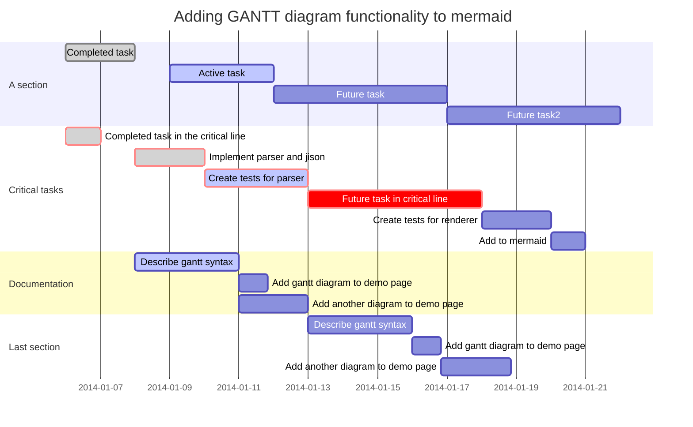
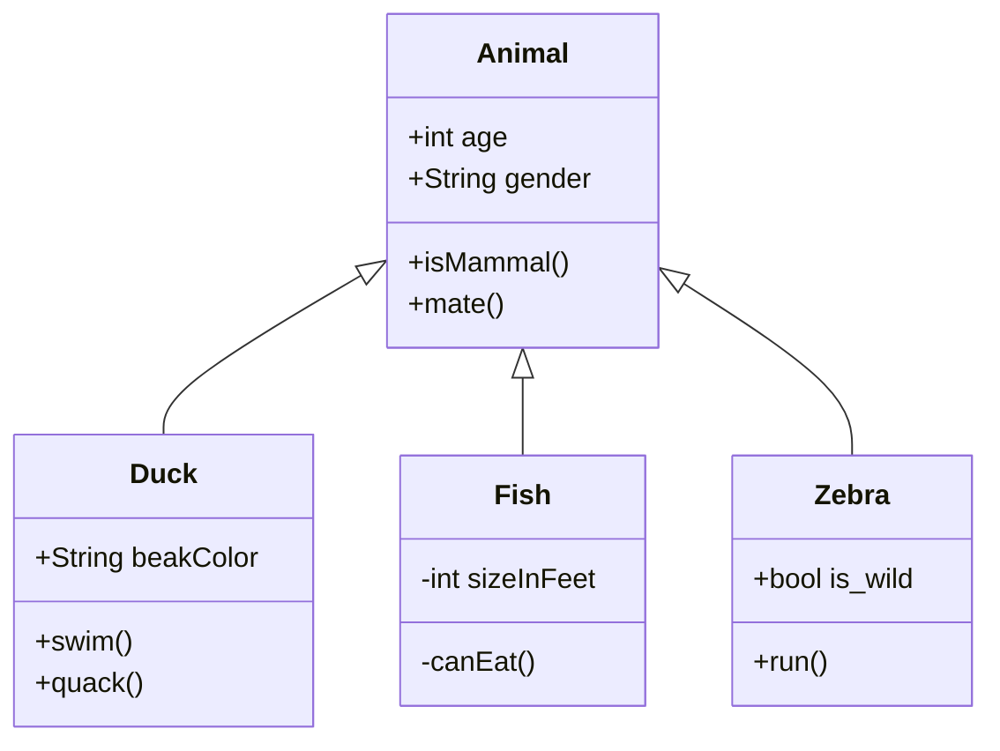

## Contents

#### 최신 글

- Pytorch: [libtorch 와 예제](technical_articles/pytorch/libtorch_and example.md)
- Pytorch: [Ubuntu에 Pytorch 설치](technical_articles/pytorch/installation_of_pytorch_on_ubuntu.md)
- Python: [Ubuntu에 Pyenv 설치](technical_articles/python/pyenv.md)
- Linux: [Ubuntu에 CUDA 툴킷 설치](technical_articles/linux/installation_on_cuda_toolkit_on_ubuntu.md)
- Linux: [Ubuntu에 nvidia 드라이버 설치](technical_articles/linux/installation_of_nvidia_on_ubuntu.md)
- Ubuntu: [우분투 16.04 LTS에서 마우스 휠 스크롤 간격 설정](technical_articles/linux/ubuntu_imwheel.md)
- 번역: Git: [A successful Git branching model](technical_articles/git/a_successful_git_branching_model.md)
- ROS: [kenetic에서 OpenManipulator 튜토리얼](technical_articles/robotics/ros/ros_kinetic_open_manipulator.md)
- ROS: [kenetic에서 Turtlebot3와 네비게이션](technical_articles/robotics/ros/ros_kinetic_turtlebot3_navigation.md)
- ROS: [kenetic에서 Turtlebot3와 SLAM](technical_articles/robotics/ros/ros_kinetic_turtlebot3_slam.md)
- ROS: [kinetic에서 Turtlebot3](technical_articles/robotics/ros/ros_kinetic_turtlebot3.md)
- ROS: [kinetic에서 UVC 카메라 캘리브레이션](technical_articles/robotics/ros/ros_kinetic_uvc_camera_calibration.md)
- ROS: [kinetic에서 UVC 카메라 보기](technical_articles/robotics/ros/ros_kinetic_uvc_camera.md)
- ROS: [RealSense 설치](technical_articles/robotics/ros/ros_kinetic_realsense.md)
- ROS: [Ubuntu에 ROS 설치](technical_articles/robotics/ros/installation_of_ros_on_ubuntu.md)
- OpenCV: [우분투에서 Opencv 자동 빌드 및 설치](technical_articles/computer_vision/build_opencv_on_ubuntu_cli_with_script_ko.md)
- Python: [자주 사용되는 보일러플레이트: Python에서 numpy array를 gzip에 저장](./technical_articles/python/python_gzip_bytes.md)
- Python: [자주 사용되는 보일러플레이트: MNIST처럼 IDX1이나 IDX3파일 만들기](./technical_articles/python/python_idx.md)
- 윈도우 10: [필드 엔지니어를 위한: 주기적으로 재부팅하기](./technical_articles/windows/periodical_reboots_on_windows.md)
- Flutter 번역: [Flutter 1.9의 새로운 점](./technical_articles/flutter/what_is_new_in_flutter_1_9.md)
- Flutter: [Flutter: Using BoxIcons in Flutter](./technical_articles/flutter/using_boxicons_in_flutter.md)
- .NET: [.NET SQLite dll failure](./technical_articles/dotnet/donet_sqlite_dll_failure.md)
- PowerShell: [필드 엔지니어를 위한: 파워셸 스크립트를 윈도우에서 백그라운드로 구동하기](./technical_articles/windows/poweshell_script_signing_tutorials.md)
- TMAXOS: [티맥스 OS 데스크탑을 설치해 봤습니다](technical_articles/linux/tmaxos/installation_of_tmaxos_desktop.md)
- Network: [필드 엔지니어를 위한: 네트워크 교육 자료](technical_articles/networks/communication_basics.md)
- Flutter: [Ubuntu에서 재빠르게 VSCode와 Flutter 개발 환경 구성하기](technical_articles/flutter/ubuntu_flutter_vscode_quick.md)
- Flutter: [플러터에서 유닛 테스트](technical_articles/flutter/unit_test/flutter_unit_test.md)
- Flutter: [통합 테스트](technical_articles/flutter/unit_test/integrated_test.md)
- 번역: [Aqueduct](technical_articles/dart/aqueduct/index.md)
- Dart: [커스텀 패키지](./technical_articles/dart/custom_package.md)
- 번역: [LinkedIn 확장의 간략한 역사](./technical_articles/software_architecture/a_brief_history_of_scaling_linkedin.md)
- Flutter for Web: [번역: 허밍버드: Flutter for the Web를 개발하기 까지](technical_articles/flutter/hummingboard_building_flutter_for_the_web.md)
- Dart: 번역: [pubspec 파일 사용법](technical_articles/dart/pubspec_yaml.md)
- Dart: [번역: Dart2에서 조건부 임포트 변경점](technical_articles/dart/dart2_conditional_import_update.md)
- Dart: [번역: API Reference](technical_articles/dart/api_reference/index.md)
- Dart: [번역: A tour of the core libraries](technical_articles/dart/core_libraries_tour/index.md)
- Flutter: [번역: Flutter Bloc](technical_articles/flutter/bloc/index.md)
- Flutter: [번역: Flutter Pub: BLOC 패턴을 사용한 Flutter 프로젝트 아키텍쳐 설계](technical_articles/flutter/state_management/architecture_your_flutter_project_using_bloc_pattern.md)
- Flutter: [번역: 상태 관리](technical_articles/flutter/state_management/index.md)
- Flutter for Web: [번역: 웹을 위한 플러터: 웹사이트를 밑바닥부터 만들고 배포하기](technical_articles/flutter/flutter_for_web_create_and_deploy_a_website_from_scratch.md)
- Flutter: [번역: 우분투에 플러터 설치하기](technical_articles/flutter/installation_of_flutter_on_ubuntu.md)
- Dart: [번역: A tour to the Dart language](./technical_articles/dart/index.md)
- Image processing: [Convert photos to Sketches](./technical_articles/image_processing/convert_photos_to_sketches.md)
- Machine Learning: [머신러닝 인퍼런스를 위한 RabbitMQ 데모](technical_articles/machine_learning/rabbitmq_demo_for_machine_learning_inference.md)
- Linux: [Ubuntu 18.04 LTS에서 GUI와 CLI를 전환](technical_articles/linux/switch_gui_and_cli.md)
- C/C++: [GUI Libraries](./technical_articles/c_language/cpp_gui_libraries.md)
- Datasets: [Dump CIFAR10 in Pytorch](technical_articles/datasets/cifar10.md)
- Deep Learning: [Conditional Deep Convolution GAN is morphable without morph training](technical_articles/deep_learning/cdcgan_is_mophable_without_training.md)
- Life: [Youtube Best](./life/youtube_best.md)
- Autopilot: [Public Testing with Autonomous Taxi Service](technical_articles/autopilot/public_testing_with_autonomous_taxi_service.md)
- Computer Vision: [Face Datasets](technical_articles/computer_vision/face_datasets.md)
- Pytorch: [Onehot Encoding](technical_articles/pytorch/onehot_encoding.md)
- Pytorch: [Conv2dClassifier](technical_articles/pytorch/conv2d_classifier.md)
- Pytorch: [Parameter List in Module](technical_articles/pytorch/parameter_list_in_module.md)
- CUDA: [aptitude로 Ubuntu 18.04 LTS에 CUDA 설치](./technical_articles/cuda/aptitude_cuda.md)
- Coding: [디버깅 가능한 코드 (Debuggable code)](./technical_articles/coding/debuggable_code.md)
- Python: [numpy.place()](technical_articles/python/python_krorea_numpy_place.md)
- C/C++: [VSCode로 CMake 빌드 하고 디버깅 하기](technical_articles/c_language/build_cmake_in_vscode_on_linux.md)
- OpenCV: [CMake로 OpenCV 빌드 및 설치](technical_articles/computer_vision/build_opencv_with_cmake.md)
- OpenCV: [Contours hierarchy 구조](technical_articles/computer_vision/contours_hierarchy.md)
- C/C++: [CMake 간단한 소개서](technical_articles/c_language/simple_cmake_introduction.md)
- C/C++: [Ubuntu 18.04에서 VSCode로 CMake로 빌드 하고 디버깅 하기](technical_articles/c_language/build_cmake_in_vscode_on_linux.md)
- 3D Vision: [Build librealsense on Ubuntun 18.04 LTS](technical_articles/computer_vision/build_librealsense_on_ubuntu_1604.md)
- eCommerce: [온라인 쇼핑몰 키워드 검색과 옵션 비교](technical_articles/product_managements/ecommerce_search.md)
- Coding: [첫 프로그래밍 언어?](./technical_articles/learning_programming_languages/which_programming_language_do_you_want_to_learn.md)
- Linux: [Installation of FTP, FTPS, SFPT on Ubuntu 16.04](./technical_articles/linux/ubuntu_ftp.md)
- Linux: [Installation of 한국어 입력기 fcitx on Ubuntu 16.04](./technical_articles/linux/ubuntu_korean_fcitx_installation.md)

#### 페이지

- [Technical notes](./technical_articles/index.md)
- [vi shortcuts](./technical_articles/editors/vi.md)
- [Movies](movies/index.md)
- [Study notes](study_notes/index.md)
- [Book reviews](book_reviews/index.md)
- [Paper revies](./reviews/index.md)
- [Open source projects](./opensource_projects/index.md)
- [Unity C# Script Book](technical_articles/unity_csharp_script_book/index.md)
- [Dev Portal](dev_portal/index.md)
- [Machine Learning Notes](./machine_learning_notes/index.md)
- [콩트](conte/index.md)

## Sequence Diagrams

```
​```sequence
Alice->Bob: Hello Bob, how are you?
Note right of Bob: Thinks
Bob->Alice: I amd good thanks!
​```
```


```sequence
Alice->Bob: Hello Bob, how are you?
Note right of Bob: Thinks
Bob->Alice: I amd good thanks!
```

## Flowcharts

```
​```flow
st=>start: Start
op=>operation: Your Operation
cond=>condition: Yes or No?
e=>end

st->op->cond
cond(yes)->e
cond(no)->op
​```
```


```flow
st=>start: Start
op=>operation: Your Operation
cond=>condition: Yes or No?
e=>end

st->op->cond
cond(yes)->e
cond(no)->op
```

## Mermaid



## Gantt Chart

```
​```mermaid
%% Example with selection of syntaxes
        gantt
        dateFormat  YYYY-MM-DD
        title Adding GANTT diagram functionality to mermaid

        section A section
        Completed task            :done,    des1, 2014-01-06,2014-01-08
        Active task               :active,  des2, 2014-01-09, 3d
        Future task               :         des3, after des2, 5d
        Future task2               :         des4, after des3, 5d

        section Critical tasks
        Completed task in the critical line :crit, done, 2014-01-06,24h
        Implement parser and jison          :crit, done, after des1, 2d
        Create tests for parser             :crit, active, 3d
        Future task in critical line        :crit, 5d
        Create tests for renderer           :2d
        Add to mermaid                      :1d

        section Documentation
        Describe gantt syntax               :active, a1, after des1, 3d
        Add gantt diagram to demo page      :after a1  , 20h
        Add another diagram to demo page    :doc1, after a1  , 48h

        section Last section
        Describe gantt syntax               :after doc1, 3d
        Add gantt diagram to demo page      : 20h
        Add another diagram to demo page    : 48h
​```
```



## Class Diagram

```
​```mermaid
classDiagram
      Animal <|-- Duck
      Animal <|-- Fish
      Animal <|-- Zebra
      Animal : +int age
      Animal : +String gender
      Animal: +isMammal()
      Animal: +mate()
      class Duck{
          +String beakColor
          +swim()
          +quack()
      }
      class Fish{
          -int sizeInFeet
          -canEat()
      }
      class Zebra{
          +bool is_wild
          +run()
      }
​```
```



