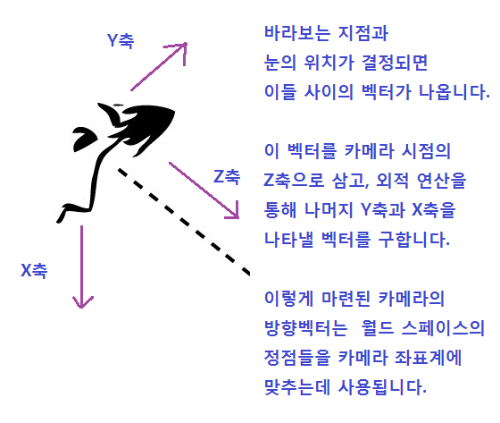
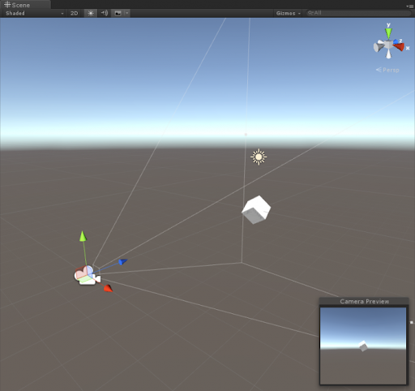

# 컴퓨터 그래픽 모음

## 래스터, 복셀, 벡터 그래픽스

### [raster graphics](https://ko.wikipedia.org/wiki/%EB%9E%98%EC%8A%A4%ED%84%B0_%EA%B7%B8%EB%9E%98%ED%94%BD%EC%8A%A4)


### [voxel graphics](https://en.wikipedia.org/wiki/Voxel)


- 3차원 래스터 그래픽스
- 복셀이란 '3차원 픽셀'

#### 의료영상 복셀 예시

<iframe width="560" height="315" src="https://www.youtube.com/embed/ZK1yLBJ2MHM" title="YouTube video player" frameborder="0" allow="accelerometer; autoplay; clipboard-write; encrypted-media; gyroscope; picture-in-picture" allowfullscreen></iframe>

### [vector graphics](https://ko.wikipedia.org/wiki/%EB%B2%A1%ED%84%B0_%EA%B7%B8%EB%9E%98%ED%94%BD%EC%8A%A4)


래스터 그래픽 디자인 도구

- [어도비 포토샵](https://www.adobe.com/kr/products/photoshop/landpa.html?gclid=Cj0KCQjw4PKTBhD8ARIsAHChzRK0qIaCzbpHb68buulFE2J_Myy46aH7jNXKFHw-lKs38vSYQfnOwmoaAlcWEALw_wcB&sdid=TBJRLR9V&mv=search&ef_id=Cj0KCQjw4PKTBhD8ARIsAHChzRK0qIaCzbpHb68buulFE2J_Myy46aH7jNXKFHw-lKs38vSYQfnOwmoaAlcWEALw_wcB:G:s&s_kwcid=AL!3085!3!460585117877!e!!g!!%ED%8F%AC%ED%86%A0%EC%83%B5!97967719!4837432399)
- 윈도우 페인터
- [GIMP](https://www.gimp.org/)

복셀 그래픽 도구

- [QUBICLE](https://www.minddesk.com/)

벡터 그래픽 도구

- [어도비 일러스트레이터](https://www.adobe.com/kr/products/illustrator.html)
- [코렐 드로우](https://www.coreldraw.com/en/)
- 윈도우용 트루타입 폰트

### 3차원 그래픽

#### 와이어 프레임 - 셰이딩 - 텍스처 매핑


### 3D 모델링


### 텍스쳐 및 매핑


### 3D  모델링 도구

- [Autodesk 3D MAX](https://www.autodesk.co.kr/products/3ds-max/overview?mktvar002=5160842|SEM|13032940050|120689483503|kwd-3005349321&panel=buy&ef_id=Cj0KCQjwmuiTBhDoARIsAPiv6L9-HwHYBUpOXlJfUgLPp3rzsHMYXMRYX6CVwYWkkhzMulHjw229mpoaAk4iEALw_wcB:G:s&s_kwcid=AL!11172!3!520372896706!e!!g!!autodesk%203d%20max!13032940050!120689483503&mkwid=s|pcrid|520372896706|pkw|autodesk%203d%20max|pmt|e|pdv|c|slid||pgrid|120689483503|ptaid|kwd-3005349321|pid|&utm_medium=cpc&utm_source=google&utm_campaign&utm_term=autodesk%203d%20max&utm_content=s|pcrid|520372896706|pkw|autodesk%203d%20max|pmt|e|pdv|c|slid||pgrid|120689483503|ptaid|kwd-3005349321|&gclid=Cj0KCQjwmuiTBhDoARIsAPiv6L9-HwHYBUpOXlJfUgLPp3rzsHMYXMRYX6CVwYWkkhzMulHjw229mpoaAk4iEALw_wcB&term=1-YEAR&tab=subscription&plc=3DSMAX)
- [Blender](https://www.blender.org/)
- [Rhino](https://www.rhino3d.com/)
- [Maya](https://www.autodesk.co.kr/products/maya/overview?panel=buy&AID=13084954&PID=8206971&SID=jkp_CjwKCAjwkYGVBhArEiwA4sZLuOx8ejiyh2F4o7MIWjxsYXM5x48qPDReT7qls09zMp24CXVFkPS4-BoCdcEQAvD_BwE&cjevent=a3c4bb55e6fc11ec830801770a18050f&mktvar002=afc_kr_deeplink&affname=8206971_13084954&cjdata=MXxOfDB8WXww&term=1-YEAR&tab=subscription&plc=MAYA)

## 색공간

### RGB 색공간

Red, Green, Blue


시시시시시

### HSV 색공간

- Hue (색상)
- Saturation (채도)
- Volume (명도)


### 배경이 무슨 색인가?


### RGBA 컬러모델

- Red
- Green
- Blue
- Alpha (투명도)


## 그래픽 라이브러리

|          | 개발사              | 표준화        | 링크                                                   |             |
| -------- | ------------------- | ------------- | ------------------------------------------------------ | ----------- |
| OpenGL   | 실리콘 그래픽스 SGI | 크로노스 그룹 | https://www.opengl.org/                                | C           |
| OpenGLES |                     | 크로노스 그룹 | https://www.opengl.org/                                | C           |
| Mesa     |                     |               |                                                        | C           |
| Vulkan   |                     | 크로노스 그룹 | https://www.opengl.org/                                | C++         |
| DirectX  | Microsoft           |               | https://docs.microsoft.com/ko-kr/windows/win32/directx | C++         |
| Metal    | Apple               |               | https://developer.apple.com/kr/metal/                  | Objective-C |

### OpenGL/ES/DirectX/Vulkan/Metal 등의 기반 위에서 동작하는 개발 도구

- Qt : https://www.qt.io/
- Flutter : https://flutter.dev/
  - Skia : https://skia.org/
- 설계 및 디자인 도구
  - Autodesk : https://www.autodesk.co.kr/
  - 3D Max : https://www.autodesk.co.kr/products/3ds-max/overview
  - Blender : https://www.blender.org/
  - CLO : https://www.clo3d.com/en/
  - Solid Works : https://www.solidworks.com/ko
  - Maya : https://www.autodesk.co.kr/products/maya/overview
  - 목록 : https://www.g2.com/categories/3d-rendering
- 게임/시뮬레이션 그래픽 엔진
  - Godot Engine : https://godotengine.org/
  - Unity : https://unity.com/kr
  - Unreal : https://www.unrealengine.com/ko/
  - 목록 : 

- 산업용 그래픽 엔진
  - https://evergine.com/


## 용어

- [정점(vertex) / 폴리곤(polygon) / 변(edge) / 메시(mesh)](https://hellowoori.tistory.com/30)


### 정점(vertex)이란?

공간상에서의 위치(position)를 나타내는 것으로, 일반적으로 여러 개가 모여서 특정 형태의 오브젝트를 구성하는 요소를 정점 이라고 한다.

### 변(edge)란?

폴리곤에서 정점과 정점을 연결하는 직선을 변 또는 모서리라고 한다.

### 폴리곤(polygon)이란?

최소 3개의 정점이 모이면 하나의 면(face)을 만들 수 있다. 이렇게 3개의 정점으로 만들어진 삼각형을 폴리곤이라고 한다. 삼각형은 3D 물체의 기본 구성 요소이다.

### 메시(mesh)란?

니오넬 메시?


폴리곤이 모여서 하나의 3차원 물체를 만들게 되는데 이것을 메시라고 한다. 즉, 메시는 폴리곤이 모여서 만들어진 3차원 공간상의 객체(object)이다.

메시의 삼각형은 우리가 모델링하는 물체의 기본적인 구성 성분이 되며, 메시 삼각형을 폴리곤(polygon) 혹은 기본형(primitive) 이라고도 부른다. 

폴리곤에서 두 개의 변이 만나는 지점을 정점(vertex) 이라고 한다.

하나의 삼각형을 만들기 위해서는 삼각형의 세 정점에 해당하는 세 개의 포인트 위치를 저장해야하며, 이 삼각형을 지정하여 물체를 묘사한다.

### Vertices - edges - faces - polygons - surfaces


### [고급 과정 - Polygon mesh](https://en.wikipedia.org/wiki/Polygon_mesh)

- 그래픽 소프트웨어에서 메시 데이터는 정점 목록과 정점 목록에 대한 인덱스로 구성.

#### OpenGL Primitives

https://blog.naver.com/gomdev/220106219575

http://www.dgp.toronto.edu/~ah/csc418/fall_2001/tut/ogl_draw.html

실제에서는 사용되지 않는다. OpenGL 프리미티브는 한줄로 그리기 같은 퍼즐. 실제 모델들은 복잡하기 때문이다.

Unity Mesh 클래스 : https://docs.unity3d.com/ScriptReference/Mesh.html

## 공간 또는 좌표계

공간이 바뀌며 좌표가 변환 된다.


### 모델 공간 (Model space 또는 Local space), 모델 좌표계

(3D) 모델 또는 객체가 자체적인 좌표 공간을 가진다.

예를 들자면 병이 있다. 병 바닥 중심에 원점이 있고, 이 원점을 기준으로 정점(Vertex)들이 위치한다.


### 월드 공간 (World space), 월드 좌표계

세계를 하나의 통일된 절대적인 좌표계로 표현, 모든 객체를 동일한 하나의 좌표계에 배치한다. 객체들의 위치와 방향을 표현하기 위한 좌표계다. 모델 좌표계로 표현된 모델(객체)들은 월드 좌표계에서 그 방향과 위치가 표현되어야 하는데, 이때 모델 좌표계로 표현된 매시는 월드 좌표계로 변환되어야 한다. 이때 월드 변환 행렬이 적용된다.


### 뷰포트 좌표계 (NDC; Normalized Device Coordinates)

- 투영 변환의 결과My Programming Box: Screen Transform (화면 변환)
- 중앙이 (0, 0)
- 좌측 하단이 (-1, -1)
- 우측 상단이 (+1, +1)


예를 들어 월드 공간에 위치한 특정 정점이 카메라 공간 안으로 연산이 되면 정규 장치 좌표계 (뷰포트 좌표계)로 변환 된다.

### 스크린 공간 (screen space)

- 좌측 상단이 (0, 0)
- 2차원 공간


뷰포트 좌표계는 장치(화면)에 중립적인 좌표계를 가지고 있다. 최종적으로 화면에 그려지기 위해서는 화면 공간으로 변환되어야 한다.

### 공간 변환 과정

로컬 공간의 특정 정점은 - 월드 공간 - 카메라 공간 (뷰포트) - 스크린 공간을 거쳐서 변환 된다.

화면상의 특정 위치는 스크린 공간 - 카메라 공간 (뷰포트) - 월드 공간 - 로컬 공간을 거쳐서 변환 된다.

#### 어느 경우에?

- 오버워치


- 블랜더 (3D 그래픽 디자인 도구)


### 참조

- [로컬 공간 | 월드 변환 | 뷰변환](https://m.blog.naver.com/m_jackson_ko/221362082753)

## 렌더링 파이프 라인

- https://lalyns.tistory.com/28

- 렌더링 패스는 다양 : https://docs.unity3d.com/Manual/RenderingPaths.html

### 왼손 좌표계, 오른손 좌표계


#### 왼손 좌표계

스크린에서 비롯되었다. 화면 위가 Y이고, 앞이 Z로 추가 되었다고 보면 이해 하기 쉽다. 주로 게임들이 사용하는 좌표계.

#### 오른손 좌표계

책상에 놓은 종에 위에서 비롯 되었다. 종이 위에서 도면을 그린다. 종이 위쪽에 Y 종이 오른쪽이 X. 종이 위로 Z축이 추가 되었다. 주로 설계 소프트웨어들이 사용. 

미국 항공 설계 분야는 종이 좌측 기수가 X, 종이 위쪽 (오른쪽 날개)이 Y, 바퀴 쪽이 Z축이다.

러시아는 다르다고 하는데 러시아어를 몰라서 검색 할 수 없었다. 영어로 검색해도 나오지 않는다.

### 삼각 함수


간단히 표현 하자면:

각도 $\theta$ 와 반지름이 1인 원지 주어질때 y의 길이는 $\sin$  x의 길이는 $\cos$.


## 벡터 (Vector)

$$
\begin{bmatrix}
x \\
y \\
\end{bmatrix}
$$

$$
\begin{bmatrix}
x \\
y \\
z \\
\end{bmatrix}
$$

3D 그래픽에서 벡터는 $U, V, W$ 로 표기

#### 3D 그래픽에서 위치와 벡터는 구분하지 않고 둘다 벡터를 사용

위치도 원점으로부터의 벡터로 간주 - 식과 코드가 단순해지는 효과가 있음.

### 동차좌표계 (homogenious)

$$
\begin{bmatrix}
x \\
y \\
z \\
w \\
\end{bmatrix}
$$


요약하면 - 특정 좌표가 여러가지(무한대) 좌표로 나타낼 수 있다.

컴퓨터 그래픽에서 여러가지 이유로 동차좌표계를 사용

- 컴퓨터 그래픽에서 $w$가 0이면 벡터
- 0이 아니면 동차 좌표.

동차좌표 (1, 1, 1, 1), (2, 2, 2, 2), (0.5, 0.5, 0.5, 0.5) 는 모두 같은 좌표를 나타낸다.

$w$가 1이 되도록 $w$로 나누면 비교 가능.

왜 동차 좌표계를 사용하느냐?

- 이동 변환이 아핀 변환이기 때문이다.
-  투영 변환이 아핀 변환이기 때문이다.
- 정점이 다른 공간으로 변환 할때 동차 좌표계가 사용된다.

**참조**

- [딱딱한 동차좌표](https://ko.wikipedia.org/wiki/%EB%8F%99%EC%B0%A8%EC%A2%8C%ED%91%9C)
- [동차 좌표계와 투영 행렬](https://jw910911.tistory.com/20?category=665481)

## 행렬 (Matrix)

3차원 그래픽에서 4x4 행렬을 사용.

4x4 단위 행렬
$$
\begin{bmatrix}
1 & 0 & 0 & 0 \\
0 & 1 & 0 & 0 \\
0 & 0 & 1 & 0 \\
0 & 0 & 0 & 1 \\
\end{bmatrix}
$$

그래픽에서 행렬은  $L, M, N$ 사용.

## 참조

인공지능에서

벡터는 볼드 소문자 사용
$$
\mathbf v, \mathbf w, \mathbf x
$$
행렬은 볼드 대문자 사용
$$
\mathbf M, \mathbf N, \mathbf L
$$
2차원 그래픽도 해야 하는데...?

- 교재등은 2차원 그래픽을 거친 뒤 3차원 그래픽을 안내
- 실무에서는 2차원 그래픽은 별도로 하지 않으며 3차원에서 한개 차원을 위치를 0으로 사용.

$$
\begin{bmatrix}
x & y & z
\end{bmatrix} ^ \top
$$


### 행렬과 벡터의 곱 (Product)

곱 할 수 있는가?
$$
\begin{bmatrix}
1 & 0 & 0 & 0 \\
0 & 1 & 0 & 0 \\
0 & 0 & 1 & 0 \\
0 & 0 & 0 & 1 \\
\end{bmatrix}
\times
\begin{bmatrix}
x \\
y \\
z \\
\end{bmatrix}
$$

Nop
$$
\begin{bmatrix}
1 & 0 & 0 & 0 \\
0 & 1 & 0 & 0 \\
0 & 0 & 1 & 0 \\
0 & 0 & 0 & 1 \\
\end{bmatrix}
\times
\begin{bmatrix}
x \\
y \\
z \\
w \\
\end{bmatrix}
$$

#### 프로그래밍에서 벡터도 행렬로 간주

- 벡터는 n개의 요소를 가지는 열행렬 - 코드가 단순해지는 효과가 있음.

```c++
class Matrix {
    float *m;
}

class Matrix4x4 : public Matrix {
    Matrix4x4() {
        m = new float[4*4];
    }
}

class Vector4 : public Matrix {
    Vector4() {
        m = new float[4];않음
    }
}

void main() {
    Matrix4x4 m;
    Vector4 v;
    Matrix n = v * m;
}
```


### 의외로 3차원 공간/좌표계와 변환을 사용하는 (프레임워크) 라이브러리

#### iOS

`CALayer` 를 통해 실제 UI 객체들이 3차원 공간에서 표현 된다.

- 예시 플립 애니메이션 영상 보기 : https://lawrey.medium.com/creating-a-flip-card-animation-with-uicollectionviewcell-swift-3-0-98bc96317fee

- https://developer.apple.com/documentation/quartzcore/calayer
  - https://developer.apple.com/documentation/quartzcore/calayer/1410836-transform
  - https://developer.apple.com/documentation/quartzcore/calayer/1410888-sublayertransform
  - https://developer.apple.com/documentation/quartzcore/calayer/1410882-affinetransform
  - https://developer.apple.com/documentation/quartzcore/calayer/1410868-setaffinetransform

#### Android

- 예시 플립 애니메이션 영상 보기 : 15분 20초 - https://www.youtube.com/watch?v=DnXWcGmLHHs 
- https://developer.android.com/reference/android/graphics/Matrix

#### Qt

- 예시 회전 애니메이션 영상 보기 : 16분 40초 - https://www.youtube.com/watch?v=tTOFZtHJCyQ
- https://doc.qt.io/qt-5/qtransform.html

#### Flutter

- 예시 회전 애니메이션 영상 보기 : 4분 30초 - https://www.youtube.com/watch?v=SUwtLVOVAfI
- https://www.youtube.com/watch?v=SUwtLVOVAfI

## 오일러 각

3차원 공간에서 회전을 표현하는 방법 - 인간에게 친숙 하다. But...
$$
\begin{bmatrix}
r_x \\
r_y \\
r_z \\
\end{bmatrix}
$$


### 짐벌락 (2분 30초)

- [위키백과](https://en.wikipedia.org/wiki/Gimbal_lock)


- [짐벌락과 사원수](https://cutemoomin.tistory.com/entry/%EC%A7%90%EB%B2%8C%EB%9D%BDgimbal-lock%EA%B3%BC-%EC%82%AC%EC%9B%90%EC%88%98%EC%BF%BC%ED%84%B0%EB%8B%88%EC%96%B8-quaternion)

## 사원수 (Quaternion)

- 벡터와 행렬의 발명 그 이전에는 2차원 문제에서 복소 평면 사용.
- 3차원 문제에서 복소수를 활용할 수 있는가? 이 물음에 대한 답이 해밀턴이 발명한 사원수.
- 8년동안 연구 끝에 발명한 것이니 이해 못한다고 낙담 말자.
- 이미 만들어진 함수를 사용하는 방법은 쉽다. [조금은 느리게 살자](https://ghebook.blogspot.com/2010/07/quaternion.html)

*참고 : 영상이나 음성 같은 신호 처리시 코사인이 사용되는데 복소 평면과 코사인은 단짝이다.*

3D 그래픽에서 회전을 표현하는 방법에는 3가지가 있다.

1. 오일러 각 - 짐벌락 문제가 있다.
2. 사원수
3. 회전 행렬 - 4x4로 덩치가 크다.

 복소수:
$$
a + bi
$$
사원수:
$$
a + bi +cj +dk
$$
실수부 1개, 허수부 1개.

그래픽 라이브러리들은 사원수 관련 클래스들이 정의 되어 있고, 오픈소스들도 활용할 수 있다. 이해는 나중에 해도 된다.

- [Unity Quaternion](https://docs.unity3d.com/ScriptReference/Quaternion.html)
- Ogre 3D 사원수
  - 헤더 파일: [OgreQuaternion.h](https://github.com/OGRECave/ogre/blob/master/OgreMain/include/OgreQuaternion.h)
  - 소스파일: [OgreQuaternion.cpp](https://github.com/OGRECave/ogre/blob/master/OgreMain/src/OgreQuaternion.cpp)
  - 오일러 각을 사원수로 변경
  - 사원수를 오일러각으로 변경
  - 특정 사원수에서 다른 사원수 사이를 보간 하기
  - 길이를 정규화 하기
  - 내적 구하기 등
  

이런게 있다고 알고 넘어가도  개발 가능하다.

## 다시 벡터

### 정규 벡터

길이가 1인 벡터.

### 내적 (dot product)

두 벡터의 내적을 구하는 식이나 코드는 검색해 보면 많다. 벡터의 내적을 어떨 경우에 사용하는가?

두 벡터의 내적은 두 벡터가 어느 정도 다른 방향을 가리키는지 알 수 있게 한다.

벡터의 내적은 두벡터 방향의 코사인 값이다.

방향이 같으면 1, 방향이 수직이면 0, 방향이 전혀 다르면 -1이다. 

코사인 값은 $\arccos \theta$ 로 호도법(라다인)을 구할 수 있고, 다시 라디안은 사람에게 친숙한 육십분법으로 변환 할 수 있다.


벡터의 사영(프로젝션) 크기를 알 수 있다. [설군의 연구소](https://m.blog.naver.com/seolgoons/221389075503)


벡터 A를 B에 프로젝션한 길이를 알 수 있다.

### 법선벡터 (Normal Vector)

어떤 평면이 있을때 평면에 수직인 벡터.

법선벡터는 항상 정규벡터다.


3D 그래픽에서 평면은 법선벡터로 표현 한다.

### 삼각형을 그리는 순서

-  반시계 방향 `GL_CCW`
- 시계 방향 `GL_CW`


### 벡터의 외적 (cross product) 

두 벡터의 외적을 구하는 식이나 코드는 검색해 보면 많다. 벡터의 외적을 언제 사용하는가?


두 벡터의 외적은 두 벡터에 수직인 단위 벡터를 얻는다. 이처럼 평면 등에 수직인 벡터를 법선벡터(Normal Vector) 이라고 한다. 평면의 방향을 기술 할때는 법선벡터로 표현 한다. [FINDMEAN](http://www.findmean.com/%EC%88%98%ED%95%99/%EB%B2%A1%ED%84%B0/%EB%B2%A1%ED%84%B0%EC%9D%98-%EC%99%B8%EC%A0%81/)


이 법선벡터와 다른 벡터를 dot를 하면 평면의 방향을 알 수 있다.

예를 들어 카메라가 특정 면을 보고 있을때, 그면의 법선벡터와 카메라와의 방향 베터를 비교하면 그 면을 그릴지 말지를 결정 할 수 있다.


- [UE4 언리얼 카메라 벡터, 버텍스 노멀 (Fresnel의 원리)](https://lenorefx.blogspot.com/2019/06/ue4_6.html)


----


#### [Direct3D : 카메라 (Camera) 1 - 뷰행렬 (View Matrix)](http://egloos.zum.com/EireneHue/v/984622)





위 그림에서 카메라의 Z축을 View Vector라고도 한다.

## 카메라



#### FOV (Field Of View) 시야각


카메라의 이미지 평면


카메라의 절두체 (Frustum), Near clipping plane, Far clipping plane


(주의: 이 카메라의 좌표는 다른 라이브러리와 반대로 표현 되어 있음)

#### 직교 투영 (Orthographical Projection)


#### 원근 투영 (Perspective Projection)


- 참조: [Viewing, 단국대학교 박경신](https://dis.dankook.ac.kr/lectures/cg18/wp-content/uploads/sites/64/2018/11/lecture11-ch5.pdf)

### 컬링 (Culling)

그래픽 라이브러리에서 해주므로 나중에 이해 해도 된다.

- View frustum culling
- Back face Culling
- Occlusion Culling

- [컬링](https://blog.naver.com/aiden_ksm/221411019635)

- [Unity Occlusion Culling](https://docs.unity3d.com/kr/2020.3/Manual/OcclusionCulling.html)

  

### 후면제거

그래픽 라이브러리에서 해주므로 나중에 이해 해도 된다.

- [후면제거](https://huiyu.tistory.com/entry/%EC%BB%B4%ED%93%A8%ED%84%B0-%EA%B7%B8%EB%9E%98%ED%94%BD%EC%8A%A4-%EC%9D%B4%EB%A1%A0-%EC%A0%95%EB%A6%AC-%ED%9B%84%EB%A9%B4%EC%A0%9C%EA%B1%B0-%ED%91%9C%EB%A9%B4%EA%B3%BC-%EC%9D%B4%EB%A9%B4)

후면제거를 할 것인가 말것인가?

```c++
void glEnable(GL_CULL_FACE);
void glCullFace(GLenum mode);
void glDisable(GL_CULL_FACE);
```

### 은면제거, 은선제거

- https://catchknowledge.tistory.com/46
- https://wjdgh283.tistory.com/entry/OpenGL%EB%A1%9C-%EB%B0%B0%EC%9A%B0%EB%8A%94-%EC%BB%B4%ED%93%A8%ED%84%B0-%EA%B7%B8%EB%9E%98%ED%94%BD%EC%8A%A4-Chapter-08-%EA%B0%80%EC%8B%9C%EC%84%B1-%ED%8C%90%EB%8B%A8-Visibility-Detection
- https://jeongmorecord.tistory.com/142

### 깊이 버퍼 (Depth buffer, Z-Buffer)

그래픽 라이브러리에서 해주므로 나중에 이해 해도 된다.

- https://jebae.github.io/z-buffer

### 가시성 판단

- https://m.blog.naver.com/PostView.naver?isHttpsRedirect=true&blogId=dnjsgk0206&logNo=198824100

## 다시 벡터

벡터의 내적

벡터의 외적

사영 벡터 :  설군의 연구소 https://m.blog.naver.com/seolgoons/221389075503

## 다시 행렬

그래픽에서는 왜 4x4를 사용하는가?

- 동차좌표계를 사용하기 때문.

왜 동차좌표계를 사용하는가?

- 로컬, 월드, 뷰포트, 스크린 등의 공간을 넘나들기 때문.
- 이동을 해야 하기 때문. 이동은 선형 변환이 아니라 아핀 변환이다.

- [참조: 게임프로그래밍](https://m.blog.naver.com/PostView.naver?isHttpsRedirect=true&blogId=znfgkro1&logNo=80174113848)

- [참조: 선형변환과 아핀변환](https://codingfarm.tistory.com/377)

### 행렬의 곱 (product)

A의 열의 갯수와 B의 행의 갯수가 같아야 한다.

결과는 A의 행 갯수 x B의 열 갯수
$$
M = A \times B
$$


![행렬 곱셈 - 위키백과, 우리 모두의 백과사전](data:image/png;base64,iVBORw0KGgoAAAANSUhEUgAAASsAAACoCAMAAACPKThEAAAAzFBMVEX///+qzP+v6a//qqqu0f//rq6z7rOsz/8AAACo4KjT0c5WaIJmepmjxPVpjGl9msSNXl6CVlbT0NOnb2/unp6BsoGBfYFWZXp3iHeXyZeGsoaCnMOTsNx1f49ecY1tg6SgYmKUWlrm5uZhgWFwlnBZd1mMgYHHx8ey1v+1tbWsrKyLi4tAQEBnZ2eZmZlRUVF1dXUmJiYvLy89RlRhaXdgZ2BiNjZCT2NVOTk1PEY1Rl9HHx9OaE5icWJEZER4pnhBVHBEW0RCKSk2SDYxxDEDAAAFeUlEQVR4nO2dDVfbNhSGnTQF4YSsDDbawpIioMbxVxJWaDe2ju3//6dKTuIEXSPLwbJj9j7nwAn3KDJ+bMnKTXLtOAAAAAAAAIDXjOe4QcwdZxL4Tf8r1eK6Ve8TZ1MWMcZZkrBplR03TjQPxT5FFfbIWSh+M+Y5Tswq7Ld5psyX+8Sr65HLHp1kJn65zK2u3+aZykPPq9ynRWdRUnW/zTOVAwaujIArc+DKHFuuEtnvK5vbI3m94vICDwAArwH3522p8AXBS3ArRbupv34h/P2dhK6GtNmvNcko4I+fCDmh0ZjG/qGh37Wber9HGB6Q0IePtNmOuDq92Ve46ZNQ7+y8p4YOB7TZb9pNvd/rKghXaqgrXJFmu+Kq11Ho9Ulo/+x8X40dDugz4QqulsDVCl54tYWrlPk0YKzohSdcpYQscPh8pm8EVymh1OQXZMHhKiWUbxZ5cGUCXJkDV+bAlTlz+UYwXBnhy/w3j/WN4MocuDJn11zttd1VrxpX3QOF7lCNHBx8+Eib7YqrzqFCp09DZ+ckdjigzfSuvlwRHockdHlNm2ld/fmJkBO6uyChizvaTPtZr9sxISfUH9HYPQ01kkN+95aQEzo+IaGTY9rss25LOTnk0bY55JtG5vajt28UhCsSOj5RQ2+EK9JM72rH5na4giu4giu4giu4giu4giu4giu4giu4giu4qtgVzfV125Xr6yncjGjo7FwN9Tpj2qwgh3xN+I+GHh5pLNB1++8R4atRKC+mzSF/6xNyQvenNHZLQ/pv8f6Pz6tB2fMK8xXmdriCK7iCq0ZdcZaRrVha6Io//Ri6pfPK5RntdeVvHGmLrnJon6tEDAu4MnMVs6dVfiy58rIvkLZ4DDre0+pRmNs1rhQwBuEKruAKrhp1hVyfcQ75kvBIQ9cPNKbPIb8jfM0JHZHQUU4zfQ55RPg2IKH7Pm12S0PlP4eM8+o5V5ivMLfDFVzBFVzBFVzBFVy12FXkxjJTyUMWunCld8VmiRezgE28kMFVgStZIjmSlapWNYXh6llXst7E4rYKzIcrvasJXMEVXG3tqoJcH3X1KnN9X66GKo8kMrx8oLGNHHIoL35+kj2UtSwuFD7lhO7UiOCONLvQfjr4djxQGNPQ4HREQoN72qwgh5xXI0WNdXNqpOxMPRl1IHU6fTLeZI0UOgbpM1F7p7LaO6jpBFdwRYErc+DKnDpcBYtMU3tdBYuPQdbhKl1rt9jVKvsDV8XAlTlwZQ5cmQNX5sCVOXBlDlyZ04grmkNuxb3PMlc13PuMLWrIG95T73Ln7qm3cnVb3z31cK9G83s1AgAAAAAAAAAAAIDdglvM59ScL/LiOPZsboCxgnuVbk9WnSmsQRePlhvTFnp4ER5TCstViHA1EQTzwvvNvxxX7EfscTeePa39ViUJC6x1zlc9R+n3nmwiNpUsH8Y2dydklgZ55sq1d6yXJGyePbY1ZcUsSn+sUJ8rsSWrk3rKTGyD25rdM1dBNkDMnkXq9RURWz9xVwc8YQW3os6al5uixV6LFYPnR+UOBqe1WIuwPyE6zjQ9dN7GYNcxKXnJXK8ZbL/NmNiaRjZYHnDDa7pai7UI4coXTMR55Re3fgk1uPKXp25gtoBTa7EWkc1XfqlB6GUYPykpMyFuR8iSOBBEhueLV+5ik7kSlxDzwbvN3G5vjbhi47+yMkjWriLLx92z90JtSSCG1OJyE1vZl7Wr0PZ8UnJ22GYDqzFlZ4mVuRIPDFcl2+KvRwa3sXzwNga58RKrDNKVPG39ktfPbRAz1lQebm5nWbp5oZ3Y2MJ6PrS+wEr3gLGZrak3CNzNP6rfHR4siOvJ9k2iMAyn9l8XAgAAAAAAAAAAADzDD7js4wQyCqpFAAAAAElFTkSuQmCC)

## 변환 (Transform)

OpenGL에서 모델 공간을 변환

```
glMatrixMode(GL_MODELVIEW);
glLoadIdentity();
```

### 비례 변환 (Scale 확대축소)

그냥 곱해도 되지만,
$$
q_x = s_x * p_x \\
q_y = s_y * p_y \\
q_z = s_z * p_z \\
$$
행렬을 사용하는데, 3x3 행렬로도 충분하지만
$$
S = \begin{bmatrix}
	s_x & 0 & 0 \\
	0 & s_y & 0 \\
	0 & 0 & s_z
\end{bmatrix}
$$
실제는 4x4 행렬 사용.
$$
S = \begin{bmatrix}
	s_x & 0 & 0 & 0\\
	0 & s_y & 0 & 0\\
	0 & 0 & s_z & 0\\
	0 & 0 & 0 & 1
\end{bmatrix}
$$
벡터 $V$를 스케일 하려면
$$
U = S \cdot V
$$

### 회전 변환 (Rotation transform)

회전 변환 행렬도 3x3으로 충분하지만, 4x4 행렬을 사용한다.
$$
R_x =  \begin{bmatrix}
	1 & 0 & 0 & 0 \\
	0 & \cos \theta & \sin \theta & 0  \\
	0 & - \sin \theta  & \cos \theta & 0 \\
	0 & 0 & 0 & 1
\end{bmatrix}
$$
$$
R_y = \begin{bmatrix}
	\cos \theta & 0 & - \sin \theta & 0 \\
	0 & 1 & 0 & 0 \\
	\sin \theta & 0 & \cos \theta & 0
	\\  0 & 0 & 0 & 1
\end{bmatrix}
$$

$$
R_z = \begin{bmatrix}
	\cos \theta & \sin \theta & 0 & 0 \\
	-\sin \theta & \cos \theta & 0 & 0 \\
	0 & 0 & 1 & 0 \\  0 & 0 & 0 & 1
\end{bmatrix}
$$

벡터 $V$를 회전하고 싶다면
$$
R = R_x \cdot R_y \cdot R_z
\\
U = R \cdot V
$$

### 이동 변환 (Translation transform)

이동 변환 행렬은 4x4 행렬이다.
$$
T =  \begin{bmatrix}
	1 & 0 & 0 & 0 \\
	0 & 1 & 0 & 0 \\
	0 & 0 & 1 & 0 \\
	t_x & t_y & t_z & 1
\end{bmatrix}
$$
벡터 V를 이동하려면
$$
U = T \cdot V
$$
위 이동행렬의 전치 행렬
$$
T^\top =  \begin{bmatrix}
	1 & 0 & 0 & t_x \\
	0 & 1 & 0 & t_y \\
	0 & 0 & 1 & t_z \\
	0 & 0 & 0 & 1
\end{bmatrix}
$$
## 투영

- n차원의 좌표를 식에 의해 n-1 차원으로 줄이는 것
- 3차원 공간의 좌표들을 2차원 평면에 투영하는 것을 렌더링이라고 함
- 2차원 벡터를 다른 2차원 벡터에 투영하면 가장 가까운 점

OpenGL에서 투영 행렬을 조작시

```
glMatrixMode(GL_PROJECTION);
glLoadIdentity();
```

### 직교 투영 행렬


- 참조: [Viewing, 단국 대학교 박경신](https://dis.dankook.ac.kr/lectures/cg18/wp-content/uploads/sites/64/2018/11/lecture11-ch5.pdf)

### 원근 투영 행렬


- 참조: [Viewing, 단국 대학교 박경신](https://dis.dankook.ac.kr/lectures/cg18/wp-content/uploads/sites/64/2018/11/lecture11-ch5.pdf)

- 참조: [Projection Matrix란?](https://jw910911.tistory.com/19)
- 참조: [동차좌표계란?](https://jw910911.tistory.com/7?category=665481)

### 행렬의 전치

$$
\begin{bmatrix}
0 & 1 \\
2 & 3 \\
4 & 5 \\
\end{bmatrix} ^ \top
$$

$$
\begin{bmatrix}
0 & 2 & 4 \\
1 & 3 & 5 \\

\end{bmatrix}
$$


### 변환행렬의 전치 관계

자료에 따라 회전행렬, 이동행렬이 전치되어 다를 수 있다.
$$
T =  \begin{bmatrix}
	1 & 0 & 0 & t_x \\
	0 & 1 & 0 & t_y \\
	0 & 0 & 1 & t_z \\
	0 & 0 & 0 & 1
\end{bmatrix}
$$
$$
T =  \begin{bmatrix}
	1 & 0 & 0 & 0 \\
	0 & 1 & 0 & 0 \\
	0 & 0 & 1 & 0 \\
	t_x & t_y & t_z & 1
\end{bmatrix}
$$

이 차이는 

- 왼손 좌표계냐
- 오른손 좌표계냐

다르다.

### 왜 행렬을 사용하는가?

병렬 컴퓨팅을 사용할 수 있다.

- 하나의 명령으로 여러개의 데이터를 계산 가능
- SIMD에 대한 집중 탐구 : https://m.blog.naver.com/fs0608/221650925743

- GPU 병렬 컴퓨팅에 대한 설명 : https://blog.unifiedh.com/how-gpus-ate-up-the-world-%EB%B3%91%EB%A0%AC-%EC%BB%B4%ED%93%A8%ED%8C%85%EA%B3%BC-%EB%94%A5%EB%9F%AC%EB%8B%9D%EC%9D%98-%EA%B8%89%EB%B6%80%EC%83%81%EC%97%90-%EB%8C%80%ED%95%9C-%EB%8B%A8%EC%83%81-287ddb5f7af2

### OpenGL 에서 행렬

glLoadMatrix : https://www.khronos.org/registry/OpenGL-Refpages/gl2.1/xhtml/glLoadMatrix.xml

glMatrixMode : https://www.khronos.org/registry/OpenGL-Refpages/gl2.1/xhtml/glMatrixMode.xml

glLoadIdentity, glPushMatrix, glPopMatrix : 실제 거의 사용하지 않음.

...

## 텍스처

https://extra-ordinary.tv/2021/01/19/tiling-for-expressions-with-vroid-characters/

### 3D 그래픽 처리 단계

https://gameqa.tistory.com/60 - 설명 좋은 문서


### 셰이더 프로그래밍

- 국내 유일한 셰이더 서적 : http://www.yes24.com/Product/Goods/7366949 김포프
- 정점 셰이더, 래스터라이저, 픽셀 셰이더 : https://nickname.tistory.com/37
- 셰이더란  무엇일까 : https://icechou.tistory.com/298

대부분의 많은 셰이더 소스코드가 공개 되어 있다

- 셰이더를 개발하는 직업 : 테크니컬 아티스트 https://namu.wiki/w/%ED%85%8C%ED%81%AC%EB%8B%88%EC%BB%AC%20%EC%95%84%ED%8B%B0%EC%8A%A4%ED%8A%B8
  - 프로그래밍과 아트에 대한 감각을 함께 가지고 있어야 한다.

- OpenGL 계열 셰이더 프로그래밍 언어 : GLSL - https://opentutorials.org/module/3659/22194
- DirectX  계열 셰이더 프로그래밍 언어 : HLSL -  https://docs.microsoft.com/ko-kr/windows/win32/direct3dhlsl/dx-graphics-hlsl

- Unity 는 HLSL/GLSL 계열 언어에 Unity 포맷을 가짐 : https://docs.unity3d.com/kr/2021.1/Manual/shader-writing.html
- GLSL이나 HLSL은 C 언어에 기반

대표적인 데이터 구조

| 타입                    | 설명                     |      |
| ----------------------- | ------------------------ | ---- |
| float, vec2, vec3, vec4 | 2차원, 3차원, 4차원 벡터 |      |
| mat2, mat3, mat4        | 2x2, 3x3, 4x4 행렬       |      |

함수: https://www.khronos.org/registry/OpenGL-Refpages/gl4/index.php

abs : 절대값

atan : 아크탄젠트

clamp : 범위 제약

dot : 내적

...

#### 커스텀 셰이더

- https://www.shadertoy.com/

https://docs.unity3d.com/kr/2021.1/Manual/SL-VertexFragmentShaderExamples.html

## 물리엔진

유니티 물리엔진 예시

<iframe width="560" height="630" src="https://www.youtube.com/embed/pTz3LMQpvfA" title="YouTube video player" frameborder="0" allow="accelerometer; autoplay; clipboard-write; encrypted-media; gyroscope; picture-in-picture" allowfullscreen></iframe>

- 물리 엔진 원리 : https://3dev.tistory.com/53

### 물리엔진의 종류 https://www.tapirgames.com/blog/open-source-physics-engines

유명 물리 엔진

- PhysX : https://ko.wikipedia.org/wiki/PhysX (엔비디아)
- Bullet  : www.bulletphysics.org (오픈소스)
- ODE : http://www.ode.org/ (오픈소스)
- Havok : https://www.havok.com/ (상용소스)
- Box2D : https://github.com/erincatto/box2d (오픈소스)

## Octree

- https://ko.wikipedia.org/wiki/%ED%8C%94%EC%A7%84%ED%8A%B8%EB%A6%AC

### Octomap

- https://octomap.github.io/스

### 충돌 검사

- ODE 소스 코드 : https://github.com/thomasmarsh/ODE/tree/master/ode/src

## 참조

- [화면 변환](https://mycom333.blogspot.com/2013/03/screen-transform.html?m=0) 
- [Homogeneous Coordinates and Computer Graphics, Tom Davis](http://www.geometer.org/mathcircles/cghomogen.pdf)
- [3D Viewing: the Pinhole Camera Model, 빠짐 없이 잘 설명 되어 있지만, 영어이고 내용이 많음](https://www.scratchapixel.com/lessons/3d-basic-rendering/3d-viewing-pinhole-camera/implementing-virtual-pinhole-camera)
- 추천: [Viewing 단국대학교 박경신](https://dis.dankook.ac.kr/lectures/cg18/wp-content/uploads/sites/64/2018/11/lecture11-ch5.pdf)