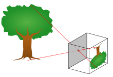
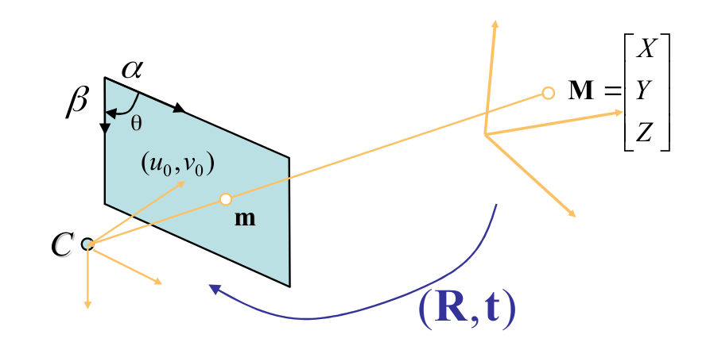

# 핀홀 카메라 모델 Pinhole camera model

핀홀 카메라 모델은 아래 그림과 같이 하나의 바늘구멍(pinhole)을 통해 외부의 상이 이미지로 투영된다는 모델입니다. 이 때, 이 바늘구멍(pinhole)이 렌즈 중심에 해당되며 이곳에서 뒷면의 상이 맺히는 곳까지의 거리가 카메라 초점거리입니다  (광학적으로 렌즈의 중심을 투과하는 빛은 굴절되지 않고 그대로 직선으로 투과한다고 합니다).

영상처리 분야에서 영상에 대한 모든 기하학적 해석은 이 핀홀 카메라 모델을 바탕으로 이루어집니다. 하지만, 사실 핀홀 카메라  모델은 매우 이상적인 카메라 모델이며 실제로는 렌즈계의 특성에 따른 영상 왜곡 등도 같이 고려되어야 합니다. 

핀홀 카메라 모델 (위키백과)

2D 공간의 점:
$$
\mathbf m = \begin{bmatrix} u \\ v\end{bmatrix}
$$
3D 공간의 점:
$$
\mathbf M = \begin{bmatrix} X \\ Y \\ Z\end{bmatrix}
$$
Add a element 1:
$$
\widetilde {\mathbf m} = \begin{bmatrix} u \\ v \\ 1 \end{bmatrix}
$$
Add a element 1:
$$
\widetilde{\mathbf M} = \begin{bmatrix} X \\ Y \\ Z \\ 1 \end{bmatrix}
$$

#### 카메라 내부 파라미터 (camera intrinsic 파라미터)

카메라의 내부 파리미터로는 다음과 같은 것들이 있습니다.

##### 촛점 거리 (focal length)

$$
fx, fy
$$

촛점거리는 이미지센서와 렌즈의 중심과의 거리입니다. 디지털 카메라에서 촛점거리는 mm 단위로 표현하지만, 카메라 모델에서는 픽셀단위로 표현합니다. 예를 들어 이미지 센서에서 셀이 차지하는 크기가 0.01mm이고, 촛점거리가 1000이면, 카메라 렌즈에서 이미지 센서까지의 거리는 10mm입니다. 카메라 모델에서 촛점거리를 실제 거리를 사용하지 않고, 픽셀단위를 사용하면 영상에서 기하학적 해석이 쉽다는 장점이 있습니다.

카메라 모델에서 촛점 거리를 단일 $f$로 표현하지 않고, $fx$, $fy$로 두개를 사용하는 이유는 이미지 센서에서 셀의 크기가 가로 세로의 크기가 다를 수 있고 이 상황을 모델링 하기 위해서입니다.

$fx$는 촛점거리가 가로방향 셀 크기의 몇배인지를 나타내고, $fy$는 촛점거리가 세로 방향 셀 크기의 몇배인지를 나타냅니다. 일반적으로 $f = fx = fy$인 경우가 많습니다.

동일한 카메라로 캘리브레이션을 할지라도, 이미지 해상도를 $\frac{1}{2}$로 낮추면 캘리브레이션 결과의 초점거리도 $\frac{1}{2}$이 됩니다. 실제 물리적 초점거리가 변하는 것은 아니지만 카메라 모델에서의 초점거리는 상대적인 개념이기 때문에 해상도를 바꾸면 한 픽셀에 대응하는 물리적인 크기가 변하고 따라서 초점거리도 변하게 됩니다. 예컨데, 이미지 해상도를 $\frac{1}{2}$로 낮추면 이미지 센서의 $2 \times 2 $셀들이 합쳐서 하나의 이미지 픽셀이 되기 때문에 한 픽셀에 대응하는 물리크기가 2배가 됩니다.  따라서 초점거리는 $\frac{1}{2}$이 되어야 합니다.

카메라 모델의 렌즈중심(초점)은 핀홀 카메라 모델에서 핀홀(pinhole)에 해당됩니다. 핀홀 카메라 모델은 모든 빛은 한 점(초점)을 직선으로 통과하여 이미지  평면(센서)에 투영된다는 모델입니다. 이러한 핀홀 모델은 3D 공간과 2D 이미지 평면 사이의 기하학적 투영(projection) 관계를 매우 단순화시켜 줍니다.

초점으로부터 거리가 1(unit distance)인 평면을  normalized image plane이라고 부르며 이 평면상의 좌표를 보통 normalized image  coordinate라고 부릅니다. 물론 이것은 실제는 존재하지 않는 가상의(상상의) 이미지 평면입니다. 카메라 좌표계 상의 한 점 $(Xc, Yc, Zc)$를 영상좌표계로 변환할 때 먼저 $Xc, Yc$를 $Zc$(카메라 초점에서의 거리)로 나누는 것은 이  normalized image plane 상의 좌표로 변환하는 것이며, 여기에 다시 초점거리 $f$를 곱하면 우리가 원하는 이미지  평면에서의 영상좌표(pixel)가 나옵니다. 그런데, 이미지에서 픽셀좌표는 이미지의 중심이 아닌 이미지의 좌상단 모서리를 기준(원점)으로 하기 때문에 실제 최종적인 영상좌표는 여기에 $(cx, cy)$를 더한 값이 됩니다. 즉, 
$$
\begin{aligned}
x &= \frac{fxX}{Z}+cx \\
y &= \frac{fyY}{Z}+cy \\
\end{aligned}
$$

#### 주점 (principal point)

$$
cx, cy
$$

주점 $cx$, $cy$는 카메라 렌즈의 중심 즉, 핀홀에서 이미지 센서에 내린 수선의 발의 영상좌표(단위는 픽셀)로서 일반적으로  말하는 영상 중심점(image center)과는 다른 의미입니다. 예를 들어서, 카메라 조립과정에서 오차로 인해 렌즈와 이미지  센서가 수평이 어긋나면 주점과 영상 중심은 다른 값을 가질 것입니다.

영상기하학에서는 단순한 이미지 센터보다는 principal point가 훨씬 중요하며  영상의 모든 기하학적 해석은 이 주점을 이용하여 이루어집니다.

##### 비대칭 계수 (skew coefficient)

$$
\tan \alpha
$$

비대칭 계수는 이미지 센서의 cell array의 $y$축이 기울어진 정도를 나타냅니다. 요즘의 카메라는 skew 에러가 거의 없기 떄문에 카메라 모델에서 보통 비대칭 계수까지는 고려하지 않는다고 합니다.

---

카메라 내부 파라미터는 하나의 행렬에 담을 수 있는데 아래와 같습니다.
$$
\mathbf A
= \begin{bmatrix}
\alpha & \gamma & u_0 \\
0 & \beta & v_0 \\
0 & 0 & 1 \\
\end{bmatrix}
$$

#### 카메라 외부 파라미터 (camera extrinsic parameters)

카메라 외부 파라미터는 카메라 좌표계와 월드 좌표계 사이의 변환 관계를 설명하는 파라미터로서, 두 좌표계 사이의 회전(rotation) 및 평행이동(translation) 변환으로 표현됩니다.

카메라 외부 파라미터는 카메라 고유의 파라미터가 아니기 때문에 카메라를 어떤 위치에 어떤 방향으로 설치했는지에 따라 달라지고 또한 월드 좌표계를 어떻게 정의했느냐에 따라서 달라집니다.

카메라 외부 파라미터를 구하기 위해서는 먼저 캘리브레이션 툴 등을 이용하여 카메라 고유의 내부 파라미터들을 구합니다. 다음으로는 미리  알고 있는 또는 샘플로 뽑은 3D 월드좌표 – 2D 영상 좌표 매칭 쌍들을 이용하여 식(1)에서 변환행렬을 구하면 됩니다. OpenCV에  있는 solvePnP함수를 이용하면 이러한 계산을 손쉽게 할 수 있습니다.
$$
\mathbf R
= \begin{bmatrix}
0 & 0 & 0 \\
0 & 0 & 0 \\
0 & 0 & 0 \\
\end{bmatrix}
$$

Translation vector:
$$
\mathbf t = \begin{bmatrix} x \\ y \\ x\end{bmatrix}
$$

Camera projection matrix:
$$
\mathbf P
= \begin{bmatrix}
0 & 0 & 0 \\
0 & 0 & 0 \\
0 & 0 & 0 \\
0 & 0 & 0 \\
\end{bmatrix}
$$
Rotation matrix:
$$
\mathbf R= \begin{bmatrix}0 & 0 & 0 \\0 & 0 & 0 \\0 & 0 & 0 \\\end{bmatrix}
$$

## 참조

- [카메라 캘리브레이션: 다크프로그래머](https://darkpgmr.tistory.com/32)