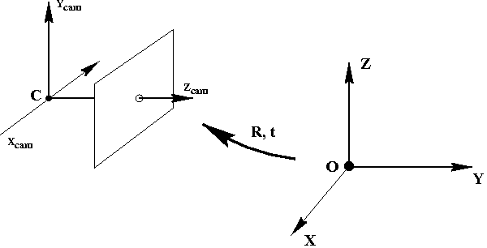

번역

# Single camera calibration

## 소개

컴퓨터 비전에서 카메라를 캘리브레이션을 해야 합니다.

## 카메라 캘리브레이션이란?

이 튜토리얼에서는 가장 일반적으로 사용되는 핀홀 모델을 가정합니다. 모델은 아래 두 이미지로 설명됩니다.




카메라 캘리브레이션은 3D 공간의 객체와 시각적 정보(이미지)를 통해 카메라가 관찰한 2D 이미지 간의 변환 매개변수를 결정하는 것입니다.

3차원 공간에 점의 좌표 $\mathbf X
= (X, Y, Z, 1)^\intercal$ 일때, 카메라 프레임 $\mathbf X_\text{cam}$에서 동일한 점의 3D 좌표는 다음과 같이 변환 됩니다.
$$
\mathbf X_\mathbb{cam}
= \begin{bmatrix}
\mathbf R & \mathbf t
\end{bmatrix}
\mathbf X
$$
여기서, $\mathbf R$은 회전(rotation) 행렬이고, $\mathbf t$는 이동(translation) 행렬입니다.

이제 $\mathbf x = (x, y, 1)^\intercal$를 해당 3D 점의 이미지 좌표로 설정하면 3D에서 2D 로의 매핑이 됩니다:
$$
\mathbf x
= \mathbf K \begin{bmatrix}
\mathbf R & \mathbf t
\end{bmatrix} \mathbf X
$$
여기서,  $\mathbf K$는 카메라의 고유 매개변수(intrinsic parameters)를 포함하는 $3 \times 3$ 행렬 입니다.
$$
\mathbf K
= \begin{bmatrix}
f_x & 0 & c_x \\
0 & f_y & c_y \\
0 & 0 & 1 \\
\end{bmatrix}
$$
$f_x$ 및 $f_y$는 각각 $x$ 축 및 $y$ 축에서 카메라의 초점 거리(focal length)로 픽셀의 단위입니다. $(c_x, c_y)$는 이미지의 주요 좌표로 일반적으로 중앙 위치입니다.

- 고유 매개변수(intrinsic parameters): $\mathbf K$ 행렬은  카메라의 모든 고유 매개변수로 구성됩니다.
- 외부 매개변수(extrinsic parameters): $\mathbf R$ 및 $\mathbf t$ 행렬은 카메라의 외부 파라미터를 구성합니다.

이러한 알 수 없는 매개변수를 찾는 것을 카메라 캘리브레이션이라고 합니다. 우리는 이러한 매개변수를 찾는 복잡한 선형대수를 탐구하지 않습니다. 다음은 캘리브레이션을 위해 수행 할 작업의 요점입니다. 정사각형 크기의 체스보드(chessboard)를 여러개 가져와 각 이미지의 모든 코너 포인트를 찾습니다. 이미지의 이 코너 포인트는 월드의 일부 3D 포인트에 해당합니다 (체스보드에는 매우 잘 정의된 형상이 있으므로 계산하기 쉽습니다). 이 point-to-point 대응점을 저장하고 OpenCV가 비선형 알고리즘을 사용하여 캘리브레이션 매개변수를 제공합니다.

## 의존성과 데이터셋


코드를 실행하려면 `OpenCV 2.4.8` 이상과 `libpopt` (명령 줄 인수)가 있어야합니다.

C++ 환경에서 개발한다면 OpenCV 소스코드를 다운로드하여 빌드해야 하며, `libpopt`는 빌드하거나 바이너리를 설치할 수 있습니다.

우분투에서 `libpopt`는 아래와 같이 설치합니다.

```
sudo apt install libpopt-dev
```

또한 고정 된 이미지 해상도에 앞서 보정 이미지의 데이터 세트가 있어야 합니다. 다음은 바둑판의 두 가지 샘플 이미지입니다.

올바른 보정 결과를 얻으려면 모든 가능한 바둑판 방향으로 바둑판 이미지를 30 개 이상 가져 오는 것이 좋습니다.

참고 :이 예에서는 표준 9x6 보정 보드가 사용됩니다. 사각형의 크기는 `24.23 mm`입니다.

## 코드 설명

나는 코드의 중요한 부분만을 설명 할 것이며 여기에서 전체 소스를 찾을 수 있습니다: https://github.com/sourishg/stereo-calibration/blob/master/calib_intrinsic.cpp

```C++
vector< vector< Point3f > > object_points;
vector< vector< Point2f > > image_points;
vector< Point2f > corners;
```

e이미지 포인트와 객체 포인트를 저장하는 데 필요한 모든 벡터를 선언하십시오. 이미지 포인트는 이미지의 체스보드 코너 좌표이며 객체 포인트는 해당 체스보드 포인트의 실제 3D 좌표입니다.

```C++
void setup_calibration(int board_width, int board_height, int num_imgs,
                       float square_size, char* imgs_directory, char* imgs_filename,
                       char* extension) {
	Size board_size = Size(board_width, board_height);
	int board_n = board_width * board_height;
```

`setup_calibration`이라는 함수를 만들어 각 이미지의 모든 코너 포인트와 해당 3D 월드 포인트를 찾고 `object_points` 및 `image_points` 벡터를 준비합니다. `board_n`은 바둑판의 총 코너 포인트 수 입니다. 이 예에서는 $9 \times 6 = 54$입니다. 우리는 또한 많은 인수를 취하지만 변수 이름은 자명하기를 바랍니다.

```C++
	for (int k = 1; k <= num_imgs; k++) {
		char img_file[100];
		sprintf(img_file, "%s%s%d.%s", imgs_directory, imgs_filename, k, extension);
		img = imread(img_file, CV_LOAD_IMAGE_COLOR);
		cv::cvtColor(img, gray, CV_BGR2GRAY);
```

디렉토리의 모든 이미지를 반복하고 `cv::cvtColor` 함수를 사용하여 이미지를 회색조 이미지로 변환합니다.

```C++
 		bool found = false;
    	found = cv::findChessboardCorners(img, board_size, corners,
                                      	CV_CALIB_CB_ADAPTIVE_THRESH | CV_CALIB_CB_FILTER_QUADS);
		if (found)
    	{
      		cornerSubPix(gray, corners, cv::Size(5, 5), cv::Size(-1, -1),
					TermCriteria(CV_TERMCRIT_EPS | CV_TERMCRIT_ITER, 30, 0.1));
			drawChessboardCorners(gray, board_size, corners, found);
		}
```

다음으로 `findChessboardCorners` 함수를 사용하여 모든 체스보드 코너를 찾습니다. 이 함수의 인수에 대한 자세한 내용은 `OpenCV` 설명서를 참조하십시오. 코너가 발견되면 `found`가 `true`로 설정되고 `cornerSubPix` 함수에 의해 코너가 더 세분화됩니다. `drawChessboardCorners` 함수는 선택 사항이며 발견 된 바둑판 모서리를 시각화하는 데 도움이됩니다.

```C++
        vector< Point3f > obj;
    	for (int i = 0; i < board_height; i++)
      		for (int j = 0; j < board_width; j++)
        		obj.push_back(Point3f((float)j * square_size, (float)i * square_size, 0));
    	if (found) {
      		cout << k << ". Found corners!" << endl;
      		image_points.push_back(corners);
      		object_points.push_back(obj);
    	}
  	}
}
```

다음으로 객체 포인트를 저장합니다. 이상적으로는 원점을 카메라 중앙에 유지하고 체스보드 코너의 3D 점을 수동으로 측정해야하지만 얼마나 어려운지를 이미지로 만들 수 있습니다. 작지만 아름다운 핵심을 소개합니다. 월드 원점을 왼쪽 상단으로 유지합니다. 수학적으로 이것은 아무것도 바뀌지 않습니다 (어떻게 생각하는지). 이제 바둑판의 형상은 코너의 다른 3D 좌표를 매우 쉽게 찾을 수 있도록 도와줍니다. 모든 점이 평면에 있기 때문에 $Z$좌표는 항상 $0$입니다. 이 예제의 정사각형 크기는 `24.23mm` (단위는 중요합니다!)이므로 다른 점은 $(24.23,0,0)$, $(48.46,0,0)$ 등이 됩니다.

```C++
int main(int argc, char const **argv)
{
	int board_width, board_height, num_imgs;
	float square_size;
	char* imgs_directory;
	char* imgs_filename;
	char* out_file;
	char* extension;

	static struct poptOption options[] = {
		{ "board_width",'w',POPT_ARG_INT,&board_width,0,"Checkerboard width","NUM" },
		{ "board_height",'h',POPT_ARG_INT,&board_height,0,"Checkerboard height","NUM" },
		{ "num_imgs",'n',POPT_ARG_INT,&num_imgs,0,"Number of checkerboard images","NUM" },
		{ "square_size",'s',POPT_ARG_FLOAT,&square_size,0,"Size of checkerboard square","NUM" },
		{ "imgs_directory",'d',POPT_ARG_STRING,&imgs_directory,0,"Directory containing images","STR" },
		{ "imgs_filename",'i',POPT_ARG_STRING,&imgs_filename,0,"Image filename","STR" },
		{ "extension",'e',POPT_ARG_STRING,&extension,0,"Image extension","STR" },
		{ "out_file",'o',POPT_ARG_STRING,&out_file,0,"Output calibration filename (YML)","STR" },
		POPT_AUTOHELP
		{ NULL, 0, 0, NULL, 0, NULL, NULL }
	};

	POpt popt(NULL, argc, argv, options, 0);
	int c;
	while((c = popt.getNextOpt()) >= 0) {}

	setup_calibration(board_width, board_height, num_imgs, square_size,
			imgs_directory, imgs_filename, extension);
```

`libpopt`를 사용하여 필요한 모든 사용자 입력을 받고 `setup_calibration` 함수를 호출합니다.

```C++
	Mat K;
	Mat D;
	vector< Mat > rvecs, tvecs;
	int flag = 0;
	flag |= CV_CALIB_FIX_K4;
	flag |= CV_CALIB_FIX_K5;
	calibrateCamera(object_points, image_points, img.size(), K, D, rvecs, tvecs, flag);
```

이제 `calibrateCamera` 기능을 사용하여 실제 보정을 수행합니다. `K`는 전술 한 바와 같이 내장 함수를 포함하는 행렬에 있습니다. `D`는 왜곡 계수(distortion coefficients)를 포함합니다. 왜곡 계수는 이미지에서 모든 종류의 왜곡을 제거하는데 사용됩니다. 왜곡 계수에 대한 자세한 내용은 여기를 참조하십시오. `rvecs` 및 `tvecs`는 회전 및 변환 벡터입니다. 또한 고차 왜곡 계수 `k4` 및 `k5`를 무시하도록 플래그를 설정했습니다.

```C++
	FileStorage fs(out_file, FileStorage::WRITE);
	fs << "K" << K;
	fs << "D" << D;
	fs << "board_width" << board_width;
	fs << "board_height" << board_height;
	fs << "square_size" << square_size;
	printf("Done Calibration\n");
	return 0;
}
```

카메라 행렬 `K`와 왜곡 계수 `D`를 파일에 저장하여 나중에 다시 교정 할 필요 없이 이러한 매개 변수를 다시 사용할 수 있도록하는 것이 좋습니다. `FileStorage`는 `YAML` 파일로 데이터를 씁니다.

# 참조

- [Camera calibration using C++ and OpenCV](https://sourishghosh.com/2016/camera-calibration-cpp-opencv/)

