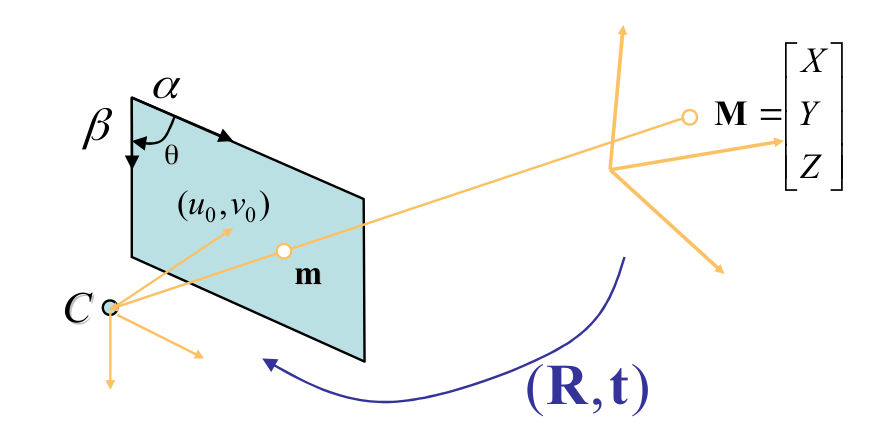

# Pinhole camera model

A 2D point:
$$
\mathbf m = \begin{bmatrix} u \\ v\end{bmatrix}
$$
A 3D point:
$$
\mathbf M = \begin{bmatrix} X \\ Y \\ Z\end{bmatrix}
$$
Add a element 1:
$$
\widetilde {\mathbf m} = \begin{bmatrix} u \\ v \\ 1 \end{bmatrix}
$$
Add a element 1:
$$
\widetilde{\mathbf M} = \begin{bmatrix} X \\ Y \\ Z \\ 1 \end{bmatrix}
$$

Camera intrinsic matrix:
$$
\mathbf A = \begin{bmatrix}
\alpha & \gamma & u_0 \\
0 & \beta & v_0 \\
0 & 0 & 1 \\
\end{bmatrix}
$$
Camera projection matrix:
$$
\mathbf P
= \begin{bmatrix}
0 & 0 & 0 \\
0 & 0 & 0 \\
0 & 0 & 0 \\
0 & 0 & 0 \\
\end{bmatrix}
$$
Rotation matrix:
$$
\mathbf R
= \begin{bmatrix}
0 & 0 & 0 \\
0 & 0 & 0 \\
0 & 0 & 0 \\
\end{bmatrix}
$$
Translation vector:
$$
\mathbf t = \begin{bmatrix} x \\ y \\ x\end{bmatrix}
$$

