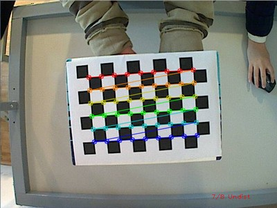
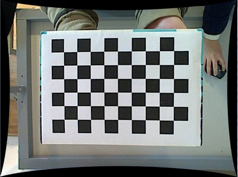
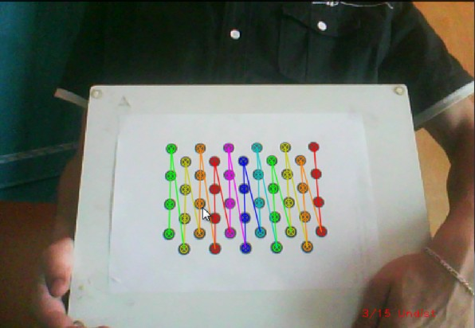

[Up](./index.md)

# Camera calibration using C++ and CV2

카메라는 오랫동안 오랫동안 사용되어 왔습니다. 20 세기 후반에 염가의 핀홀 카메라가 등장하면서 일상 생활에서 흔히 사용할 수 있습니다. 불행하게도 이 염가는 상당한 왜곡(distortion)이 있습니다. 다행히도 이것들은 상수이며, 캘리브레이션(calibration)과 리매핑(remapping)을 통해 이를 수정 할 수 있습니다. 또한 캘리브레이션을 통해 카메라의 자연 단위 (픽셀, nautiral units)와 실제 세계 단위 (예 : 밀리미터, real world units) 사이의 관계를 결정할 수도 있습니다.

## 카메라 캘리브레이션의 원리

왜곡(distortion)에 대해 OpenCV는 radial 및 tangential factor를 고려합니다. radial factor의 경우 다음 공식을 사용합니다.
$$
x'
= x (1 + k_1 r^2 + k_2 r^4 + k_3 r^6)
\\
y'
= y (1 + k_1 r^2 + k_2 r^4 + k_3 r^6)
$$
따라서 입력 이미지의 $(x, y)​$ 좌표에 있는 이전 픽셀 포인트의 경우 보정된 출력 이미지의 위치는 $(x_\text {corrected}, y_\text{corrected})​$가됩니다. radial distoration의 존재는 "barrel"또는 "fish-eye" 효과의 형태로 나타납니다.

tangential distortion은 이미지 촬영 렌즈가 이미징 평면과 완벽하게 평행하지 않기 때문에 발생합니다. 다음 수식을 통해 수정할 수 있습니다.
$$
x'
= x + [2p_1xy + p_2(r^2 + 2x^2)]
\\
y'
= y + [p_1(r^2+2y^2) + 2p_2xy]
$$
그래서 우리는 OpenCV에서 5 개의 열이있는 하나의 행 행렬로 표시되는 5 개의 distortion parameters를 갖습니다.
$$
\text{Distortion}_\text{coeficients}
= \begin{bmatrix}
k_1 & k_2 & k_3 & k_4
\end{bmatrix}
$$
이제 단위 변환을 위해 다음 공식을 사용합니다:
$$
\begin{bmatrix}
x' \\
y' \\
w' \\
\end{bmatrix}
=
\begin{bmatrix}
f_x & 0 & c_x \\
0 & f_y & c_y \\
0 & 0 & 1 \\
\end{bmatrix}
\begin{bmatrix}
x \\
y \\
z \\
\end{bmatrix}
$$
여기서 $w'$의 존재는 동차좌표계 (그리고 $w' =z $)의 사용에 의해 설명 됩니다. 알려지지 않은 매개변수는  $f_x$ 및 $f_y$ (카메라 초점 거리) 및 픽셀 좌표로 표현 된 광학 중심인 ($c_x$, $c_y$)입니다. 두 축 모두 공통 초점 길이가 주어진 종횡비 (일반적으로 1)와 함께 사용되는 경우 $f_y = f_x * a$이고 위 공식에 단일 초점 길이 $f$가 있습니다. 이 네 개의 매개변수를 포함하는 행렬을 **카메라 행렬**이라고합니다. 왜곡계수(distortion coefficients)는 사용 된 카메라 해상도와 상관없이 동일하지만 캘리브레이션 해상도(calibrated resolution)의 현재 해상도와 함께 조정해야합니다.

이 두 행렬을 결정하는 과정이 캘리브레이션(calibration)입니다. 이러한 매개변수의 계산은 기본 기하학적 방정식을 통해 수행됩니다. 사용된 공식은 선택한 캘리브레이션 대상에 따라 다릅니다. 현재 OpenCV는 캘리브레이션을 위한 세 가지 유형의 객체를 지원합니다.

- Classical black-white chessboard
- Symmetrical circle pattern
- Asymmetrical circle pattern

기본적으로 카메라로 이 패턴의 스냅 샷을 찍고 OpenCV에서 찾도록 해야 합니다. 각각의 발견 된 패턴은 새로운 방정식을 유도합니다. 이 방정식을 풀려면 잘 정해진 방정식 시스템을 형성하기 위해 미리 정해진 수의 패턴 스냅 샷이 필요합니다. 이 숫자는 체스 판 패턴의 경우 높고, 원의 경우는 적습니다. 예를 들어, 이론상 체스판 패턴에는 적어도 두 개의 스냅 샷이 필요합니다. 그러나 실제로는 입력 이미지에 많은 양의 노이즈가 있으므로 좋은 결과를 얻으려면 입력 패턴을 다른 위치에 적어도 10 개 이상 스냅 샷으로 저장해야합니다.

## 목표

이 예제 응용 프로그램은

- 왜곡 행렬(distortion matrix)을 결정
- 카메라 행렬 결정
- 카메라, 비디오 및 이미지 파일 목록에서 입력 받기
- XML / YAML 파일에서 configuration을 읽기
- XML / YAML 파일에 결과를 저장
- 재투영 오차(re-projection error)를 계산

합니다.

## 소스코드

소스 코드는 OpenCV 소스 라이브러리의 `samples/cpp/tutorial_code/calib3d/camera_calibration/ `폴더에서 찾을 수도 있고 [여기에서 다운로드](https://docs.opencv.org/2.4/_downloads/camera_calibration.cpp) 할 수도 있습니다. 이 프로그램은 하나의 인자를 가집니다 : 설정 파일의 이름. 아무 것도 지정되지 않으면 `default.xml`이라는 파일을 열려고 시도합니다. [이것](https://docs.opencv.org/2.4/_downloads/in_VID5.xml)은 XML 형식의 샘플 구성 파일입니다. 구성 파일에서 카메라를 입력, 비디오 파일 또는 이미지 목록으로 사용할 수 있습니다. 마지막 이미지를 선택하는 경우 사용할 이미지를 열거하는 구성 파일을 만들어야합니다. [여기](https://docs.opencv.org/2.4/_downloads/VID5.xml)에 그 예가 있습니다. 기억해야 할 중요한 점은 응용 프로그램의 작업 디렉토리에서 절대 경로 또는 상대 경로를 사용하여 이미지를 지정해야 한다는 것입니다. 위에서 언급한 샘플 디렉토리에서이 모든 것을 찾을 수 있습니다.

응용 프로그램은 구성 파일에서 설정을 읽는 중 시작됩니다. 이것이 중요한 부분이지만이 튜토리얼의 주제 인 카메라 보정과는 아무런 관련이 없습니다. 따라서 여기에 해당 부분에 대한 코드를 게시하지 않기로 선택했습니다. 이 작업을 수행하는 방법에 대한 기술적인 배경은 [XML 및 YAML 파일을 사용하여 파일 입력 및 출력 자습서](https://docs.opencv.org/2.4/doc/tutorials/core/file_input_output_with_xml_yml/file_input_output_with_xml_yml.html#fileinputoutputxmlyaml)에서 찾을 수 있습니다.

## 설명

### 1. 읽기와 설정

```c++
Settings s;
const string inputSettingsFile = argc > 1 ? argv[1] : "default.xml";
FileStorage fs(inputSettingsFile, FileStorage::READ); // Read the settings
if (!fs.isOpened())
{
	cout << "Could not open the configuration file: \"" << inputSettingsFile << "\"" << endl;
	return -1;
}
fs["Settings"] >> s;
fs.release();                                         // close Settings file

if (!s.goodInput)
{
	cout << "Invalid input detected. Application stopping. " << endl;
	return -1;
}
```

이를 위해 간단한 OpenCV 클래스 입력 작업을 사용했습니다. 파일을 읽은 후 입력의 유효성을 검사하는 추가 사후 처리 기능(addtional postprocessing function)이 있습니다. 모든 입력이 양호한 경우에만 `goodInput` 변수가 `true`가 됩니다.

### 2. 다음 입력을 받으십시오. 실패하거나 충분하다면 보정하십시오.

이 후 우리는 다음 작업을 수행하는 큰 루프를 가지고 있습니다 : 이미지 목록, 카메라 또는 비디오 파일에서 다음 이미지를 가져옵니다. 이것이 실패하거나 이미지가 충분하다면 캘리브레이션 프로세스를 실행합니다. 이미지의 경우 루프에서 빠져 나옵니다. 그렇지 않으면 나머지 프레임은 DETECTION mode에서 CALIBRATED mode로 변경을 통해 (옵션이 설정된 경우) 왜곡되지 않습니다.

```c++
for(int i = 0;;++i)
{
  Mat view;
  bool blinkOutput = false;

  view = s.nextImage();

  //-----  If no more image, or got enough, then stop calibration and show result -------------
  if( mode == CAPTURING && imagePoints.size() >= (unsigned)s.nrFrames )
  {
        if( runCalibrationAndSave(s, imageSize,  cameraMatrix, distCoeffs, imagePoints))
              mode = CALIBRATED;
        else
              mode = DETECTION;
  }
  if(view.empty())          // If no more images then run calibration, save and stop loop.
  {
            if( imagePoints.size() > 0 )
                  runCalibrationAndSave(s, imageSize,  cameraMatrix, distCoeffs, imagePoints);
            break;
  imageSize = view.size();  // Format input image.
  if( s.flipVertical )    flip( view, view, 0 );
  }
```

일부 카메라의 경우 입력 이미지를 뒤집을 필요가 있습니다. 여기 우리도이 작업을 수행합니다.

### 3. 현재 입력에서 패턴을 찾습니다.

위에서 언급한 공식의 형태는 입력에서 주요 패턴을 찾는 것을 목표로합니다. 체스판의 경우 사각형의 모서리와 원과 원, 원 자체에 대한 것입니다. 이들의 위치는 `pointBuf` 벡터에 기록 될 결과를 형성합니다.

```c++
vector<Point2f> pointBuf;

bool found;
switch( s.calibrationPattern ) // Find feature points on the input format
{
case Settings::CHESSBOARD:
	found = findChessboardCorners( view, s.boardSize, pointBuf, CV_CALIB_CB_ADAPTIVE_THRESH | CV_CALIB_CB_FAST_CHECK | CV_CALIB_CB_NORMALIZE_IMAGE);
	break;
case Settings::CIRCLES_GRID:
	found = findCirclesGrid( view, s.boardSize, pointBuf );
	break;
case Settings::ASYMMETRIC_CIRCLES_GRID:
	found = findCirclesGrid( view, s.boardSize, pointBuf, CALIB_CB_ASYMMETRIC_GRID );
	break;
}
```

입력 패턴의 유형에 따라 [`findChessboardCorners`](https://docs.opencv.org/2.4/modules/calib3d/doc/camera_calibration_and_3d_reconstruction.html#findchessboardcorners) 또는 [`findCirclesGrid`](https://docs.opencv.org/2.4/modules/calib3d/doc/camera_calibration_and_3d_reconstruction.html#findcirclesgrid) 함수를 사용합니다. 두 경우 모두 보드의 현재 이미지와 크기를 전달하면 패턴의 위치가 결정됩니다. 또한, 그들은 패턴이 입력에서 발견되면 상태를 나타내는 불리언 변수를 반환합니다 (우리는이 이미지가 참인 경우에만 해당 이미지를 고려해야합니다!).

다시 카메라의 경우 입력 지연 시간이 지나면 카메라 이미지만 가져옵니다. 이것은 사용자가 체스판을 움직이고 다른 이미지를 얻을 수 있도록하기 위해 수행됩니다. 유사한 이미지가 비슷한 방정식을 초래하고 보정 단계에서 유사한 방정식이 부적절한 문제를 일으키므로 보정이 실패합니다. 사각형 이미지의 경우 모서리의 위치는 근사치입니다. [`cornerSubPix`](https://docs.opencv.org/2.4/modules/imgproc/doc/feature_detection.html#cornersubpix) 함수를 호출하여이를 향상시킬 수 있습니다. 더 나은 캘리브레이션 결과를 얻을 수 있습니다. 그런 다음 유효한 입력 결과를 `imagePoints` 벡터에 추가하여 모든 공식을 단일 컨테이너로 수집합니다. 마지막으로 시각화 피드백을 위해 [`findChessboardCorners`](https://docs.opencv.org/2.4/modules/calib3d/doc/camera_calibration_and_3d_reconstruction.html#drawchessboardcorners) 함수를 사용하여 입력 이미지에 발견된 점을 그립니다.

```c++
if (found)                // If done with success,
{
    // improve the found corners' coordinate accuracy for chessboard
    if( s.calibrationPattern == Settings::CHESSBOARD)
    {
        Mat viewGray;
        cvtColor(view, viewGray, CV_BGR2GRAY);
        cornerSubPix( viewGray, pointBuf, Size(11,11),
    	    Size(-1,-1), TermCriteria( CV_TERMCRIT_EPS+CV_TERMCRIT_ITER, 30, 0.1 ));
    }

    if( mode == CAPTURING &&  // For camera only take new samples after delay time
        (!s.inputCapture.isOpened() || clock() - prevTimestamp > s.delay*1e-3*CLOCKS_PER_SEC) )
    {
        imagePoints.push_back(pointBuf);
        prevTimestamp = clock();
        blinkOutput = s.inputCapture.isOpened();
    }

    // Draw the corners.
    drawChessboardCorners( view, s.boardSize, Mat(pointBuf), found );
}
```

### 4. 상태와 결과를 사용자에게 표시하고 응용 프로그램의 명령 줄 컨트롤을 표시합니다.

이 부분은 이미지의 텍스트 출력을 보여줍니다.

```c++
//----------------------------- Output Text ------------------------------------------------
string msg = (mode == CAPTURING) ? "100/100" : mode == CALIBRATED ? "Calibrated" : "Press 'g' to start";
int baseLine = 0;
Size textSize = getTextSize(msg, 1, 1, 1, &baseLine);
Point textOrigin(view.cols - 2*textSize.width - 10, view.rows - 2*baseLine - 10);

if( mode == CAPTURING )
{
	if(s.showUndistorsed)
		msg = format( "%d/%d Undist", (int)imagePoints.size(), s.nrFrames );
	else
		msg = format( "%d/%d", (int)imagePoints.size(), s.nrFrames );
}

putText( view, msg, textOrigin, 1, 1, mode == CALIBRATED ?  GREEN : RED);

if( blinkOutput )
	bitwise_not(view, view);
```

캘리브레이션을 실행하고 왜곡계수(distortion coefficients)가있는 카메라의 행렬을 얻은 경우 [`undistort`](https://docs.opencv.org/2.4/modules/imgproc/doc/geometric_transformations.html#undistort) 함수를 사용하여 이미지를 보정하려고 할 수 있습니다.

```c++
//------------------------- Video capture  output  undistorted ------------------------------
if( mode == CALIBRATED && s.showUndistorsed )
{
	Mat temp = view.clone();
	undistort(temp, view, cameraMatrix, distCoeffs);
}
//------------------------------ Show image and check for input commands -------------------
imshow("Image View", view);
```

그런 다음 입력 키를 기다렸다가 왜곡 제거를 토글합니다. `g`이면 다시 검색 프로세스를 시작하고 마지막으로 `ESC` 키를 눌러 응용 프로그램을 종료합니다.

```c++
char key =  waitKey(s.inputCapture.isOpened() ? 50 : s.delay);
if( key  == ESC_KEY )
	break;

if( key == 'u' && mode == CALIBRATED )
	s.showUndistorsed = !s.showUndistorsed;

if( s.inputCapture.isOpened() && key == 'g' )
{
	mode = CAPTURING;
	imagePoints.clear();
}
```

### 이미지에 대한 왜곡제거(distortion removal)를 표시합니다.

이미지 목록으로 작업 할 때 루프 내부의 왜곡을 제거 할 수 없습니다. 따라서 루프 이후에 이 작업을 수행해야합니다. 이제 이것을 활용하여 [`undistort`](https://docs.opencv.org/2.4/modules/imgproc/doc/geometric_transformations.html#undistort) 함수를 확장합니다. 실제로 변환행렬을 찾기 위해 [`initUndistortRectifyMap`](https://docs.opencv.org/2.4/doc/tutorials/calib3d/camera_calibration/camera_calibration.html)을 먼저 호출 한 다음 다시 [`remap`](https://docs.opencv.org/2.4/modules/imgproc/doc/geometric_transformations.html#remap) 함수를 사용하여 변형을 수행합니다. 성공적인 캘리브레이션 맵 계산을 한 번만 수행해야하는 경우, 이 확장 폼을 사용하여 애플리케이션 속도를 향상시킬 수 있습니다.

```c++
if( s.inputType == Settings::IMAGE_LIST && s.showUndistorsed )
{
	Mat view, rview, map1, map2;
	initUndistortRectifyMap(cameraMatrix, distCoeffs, Mat(),    getOptimalNewCameraMatrix(cameraMatrix, distCoeffs, imageSize, 1, imageSize, 0), imageSize, CV_16SC2, map1, map2);

    for(int i = 0; i < (int)s.imageList.size(); i++ )
 	{
    	view = imread(s.imageList[i], 1);
      	if(view.empty())
        	continue;
      	remap(view, rview, map1, map2, INTER_LINEAR);
      	imshow("Image View", rview);
      	char c = waitKey();
      	if( c  == ESC_KEY || c == 'q' || c == 'Q' )
        	break;
  	}
}
```

## 캘리브레이션과 저장

캘리브레이션은 카메라 당 한 번만 수행하면되므로 캘리브레이션을 완료 한 후에 보정을 저장하는 것이 좋습니다. 이렇게 하면 나중에 프로그램에 이러한 값을 로드 할 수 있습니다. 이때문에 우리는 먼저 캘리브레이션을 하고, 성공하면 설정 파일에 지정한 확장에 따라 결과를 OpenCV 스타일의 XML 또는 YAML 파일에 저장합니다.

그러므로 첫 번째 기능에서는 이 두 프로세스를 분리했습니다. 많은 캘리브레이션 변수를 저장하기를 원하기 때문에이 변수들을 여기서 생성하고 둘 모두를 캘리브레이션과 저장 기능에 전달합니다. 다시 말하면 캘리브레이션과 거의 관련이없는 저장 부분을 보여주지 않겠습니다. 방법과 내용을 찾으려면 소스 파일을 탐색하십시오.

```c++
bool runCalibrationAndSave(Settings& s, Size imageSize, Mat&  cameraMatrix, Mat& distCoeffs,vector<vector<Point2f> > imagePoints )
{
	vector<Mat> rvecs, tvecs;
	vector<float> reprojErrs;
	double totalAvgErr = 0;

	bool ok = runCalibration(s,imageSize, cameraMatrix, distCoeffs, imagePoints, rvecs, tvecs, reprojErrs, totalAvgErr);
	cout << (ok ? "Calibration succeeded" : "Calibration failed") << ". avg re projection error = "  << totalAvgErr ;

	if( ok )   // save only if the calibration was done with success
    	saveCameraParams( s, imageSize, cameraMatrix, distCoeffs, rvecs,tvecs, reprojErrs, imagePoints, totalAvgErr);
	return ok;
}
```

우리는 ['calibrateCamera'](https://docs.opencv.org/2.4/modules/calib3d/doc/camera_calibration_and_3d_reconstruction.html#calibratecamera) 함수를 사용하여 캘리브레이션을 수행합니다. 다음 매개변수가 있습니다.

### object points.

이것은 각 입력 이미지에 대해 패턴을 어떻게 표시해야 하는지를 설명하는 `Point3f` 벡터의 벡터입니다. 체스 판과 같은 평면 패턴이 있다면 모든 z좌표를 단순히 0으로 설정할 수 있습니다. 이 중요한 포인트가 있는 점 모음(colletion of the points)입니다. 왜냐하면 모든 입력 이미지에 대해 단일 패턴을 사용하기 때문에 이것을 한 번 계산하고 다른 모든 입력 뷰에 대해 곱할 수 있습니다. 다음과 같이 `calcBoardCornerPositions` 함수로 코너 포인트를 계산합니다.

```c++
void calcBoardCornerPositions(Size boardSize, float squareSize, vector<Point3f>& corners, Settings::Pattern patternType /*= Settings::CHESSBOARD*/)
{
	corners.clear();

	switch(patternType)
	{
	case Settings::CHESSBOARD:
	case Settings::CIRCLES_GRID:
  		for( int i = 0; i < boardSize.height; ++i )
		    for( int j = 0; j < boardSize.width; ++j )
        		corners.push_back(Point3f(float( j*squareSize ), float( i*squareSize ), 0));
  		break;

	case Settings::ASYMMETRIC_CIRCLES_GRID:
  		for( int i = 0; i < boardSize.height; i++ )
     		for( int j = 0; j < boardSize.width; j++ )
        		corners.push_back(Point3f(float((2*j + i % 2)*squareSize), float(i*squareSize), 0));
  		break;
	}
}
```

그리고 다음과 같이 곱하십시오.

```c++
vector<vector<Point3f> > objectPoints(1);
calcBoardCornerPositions(s.boardSize, s.squareSize, objectPoints[0], s.calibrationPattern);
objectPoints.resize(imagePoints.size(),objectPoints[0]);
```

- image points

이것은 각 입력 이미지에 대해 중요한 포인트 좌표 (체스판의 경우 모서리 및 원 패턴의 경우 원의 중심)를 포함하는 `Point2f` 벡터의 벡터입니다. 우리는 이미 [`findChessboardCorners`](https://docs.opencv.org/2.4/modules/calib3d/doc/camera_calibration_and_3d_reconstruction.html#findchessboardcorners) 또는 [`findCirclesGrid`](https://docs.opencv.org/2.4/modules/calib3d/doc/camera_calibration_and_3d_reconstruction.html#findcirclesgrid) 함수에서 이것을 수집했습니다. 우리는 단지 그것을 전달할 필요가 있습니다.

- 카메라, 비디오 파일 또는 이미지에서 가져온 이미지의 크기.

- Camera matrix. 고정 된 종횡비 옵션을 사용한 경우 $f_x​$를 0으로 설정해야합니다.

```c++
cameraMatrix = Mat::eye(3, 3, CV_64F);
if( s.flag & CV_CALIB_FIX_ASPECT_RATIO )
     cameraMatrix.at<double>(0,0) = 1.0;
```

- Distortion coefficient matrix. 0으로 초기화 됩니다.

```c++
distCoeffs = Mat::zeros(8, 1, CV_64F);
```

- 모든 뷰에 대해 함수는 객체 좌표 (모델 좌표 공간에서 주어진)를 이미지 좌표 (세계 좌표 공간에서 주어진 좌표)로 변환하는 회전 및 변환 벡터를 계산합니다. 7 번째 및 8 번째 매개 변수는 i 번째 위치에 i 번째 객체 점에 대한 회전 및 병진 벡터를 포함하는 행렬의 출력 벡터입니다.
- 마지막 인수는 플래그입니다. 초점 길이의 종횡비를 고정하거나 접선 왜곡이 0이라고 가정하거나 주점을 고정하는 것과 같은 옵션을 지정해야합니다.

```C++
double rms = calibrateCamera(objectPoints, imagePoints, imageSize, cameraMatrix, distCoeffs, rvecs, tvecs, s.flag|CV_CALIB_FIX_K4|CV_CALIB_FIX_K5);
```

- 이 함수는 average re-proejction error를 반환합니다. 이 수치는 발견된 매개변수의 정밀도를 잘 예측합니다. 가능한 한 0에 가까워야합니다. 고유(intrinsic), 왜곡, 회전 및 이동(translation)행렬이 주어지면 [`projectPoints`](https://docs.opencv.org/2.4/modules/calib3d/doc/camera_calibration_and_3d_reconstruction.html#projectpoints)를 사용하여 객체 포인트를 이미지 포인트로 먼저 변환(transform)하여 한 뷰에서 오류를 계산할 수 있습니다. 그런 다음 변환을 통해 얻은 것과 코너 / 원 찾기 알고리즘 사이의 절대 표준을 계산합니다. 평균 오차를 찾기 위해 모든 캘리브레이션 영상에 대해 계산 된 오차의 산술 평균을 계산합니다.

```c++
double computeReprojectionErrors( const vector<vector<Point3f> >& objectPoints,
                          const vector<vector<Point2f> >& imagePoints,
                          const vector<Mat>& rvecs, const vector<Mat>& tvecs,
                          const Mat& cameraMatrix , const Mat& distCoeffs,
                          vector<float>& perViewErrors)
{
vector<Point2f> imagePoints2;
int i, totalPoints = 0;
double totalErr = 0, err;
perViewErrors.resize(objectPoints.size());

for( i = 0; i < (int)objectPoints.size(); ++i )
{
  projectPoints( Mat(objectPoints[i]), rvecs[i], tvecs[i], cameraMatrix,  // project
                                       distCoeffs, imagePoints2);
  err = norm(Mat(imagePoints[i]), Mat(imagePoints2), CV_L2);              // difference

  int n = (int)objectPoints[i].size();
  perViewErrors[i] = (float) std::sqrt(err*err/n);                        // save for this view
  totalErr        += err*err;                                             // sum it up
  totalPoints     += n;
}

return std::sqrt(totalErr/totalPoints);              // calculate the arithmetical mean
}
```

## 결과

이 입력 [체스보드 패턴](https://docs.opencv.org/2.4/_downloads/pattern.png)은 9 X 6 크기입니다. 저는 AXIS IP 카메라를 사용하여 보드의 스냅 샷을 만들어 VID5 디렉토리에 저장했습니다. 이 파일을 내 작업 디렉토리의 `images/CameraCalibration` 폴더에 넣고 사용할 이미지를 설명하는 다음 VID5.XML 파일을 만들었습니다.



왜곡 제거를 적용한 후에 우리는 다음을 얻습니다.




입력 길이 4로 설정하고 높이를 11로 설정하여 이 비대칭 원형 패턴에도 동일하게 적용됩니다. 이번에는 입력에 ID ( "1")를 지정하여 라이브 카메라 피드를 사용했습니다. 다음은 탐지된 패턴의 모양입니다.



많은 렌즈 모델이 있지만이 이 글에서는 가장 일반적으로 사용되는 핀홀 모델을 사용합니다. 핀홀 모델은 아래의 두 이미지로 설명됩니다. 

두 경우 모두 지정된 출력 XML / YAML 파일에서 카메라 및 왜곡 계수 행렬을 찾을 수 있습니다.

```xml
<Camera_Matrix type_id="opencv-matrix">
<rows>3</rows>
<cols>3</cols>
<dt>d</dt>
<data>
 6.5746697944293521e+002 0. 3.1950000000000000e+002 0.
 6.5746697944293521e+002 2.3950000000000000e+002 0. 0. 1.</data></Camera_Matrix>
<Distortion_Coefficients type_id="opencv-matrix">
<rows>5</rows>
<cols>1</cols>
<dt>d</dt>
<data>
 -4.1802327176423804e-001 5.0715244063187526e-001 0. 0.
 -5.7843597214487474e-001</data></Distortion_Coefficients>
```

이 값을 상수로 프로그램에 추가하고 [`initUndistortRectifyMap`](https://docs.opencv.org/2.4/modules/imgproc/doc/geometric_transformations.html#initundistortrectifymap) 및 [`remap`](https://docs.opencv.org/2.4/modules/imgproc/doc/geometric_transformations.html#remap) 함수를 호출하여 왜곡을 제거하고 저가 및 저품질 카메라의 왜곡없는 입력을 즐기십시오.

[여기](https://youtu.be/ViPN810E0SU)에 YouTube의 런타임 인스턴스가 있습니다.

<iframe width="560" height="315" src="https://www.youtube.com/embed/ViPN810E0SU" frameborder="0" allow="accelerometer; autoplay; encrypted-media; gyroscope; picture-in-picture" allowfullscreen></iframe>

## 참조

- [Camera calibration With OpenCV](https://docs.opencv.org/2.4/doc/tutorials/calib3d/camera_calibration/camera_calibration.html)
- [Camera calibration using C++ and OpenCV](https://sourishghosh.com/2016/camera-calibration-cpp-opencv/)

## 저작권

이 글은 아래 표기한 저작권에 해당되지 않으며 OpenCV의 문서의 번역으로 OpenCV의 라이센스를 따릅니다.