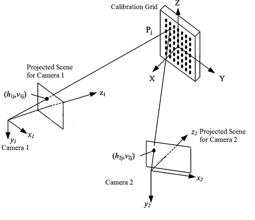
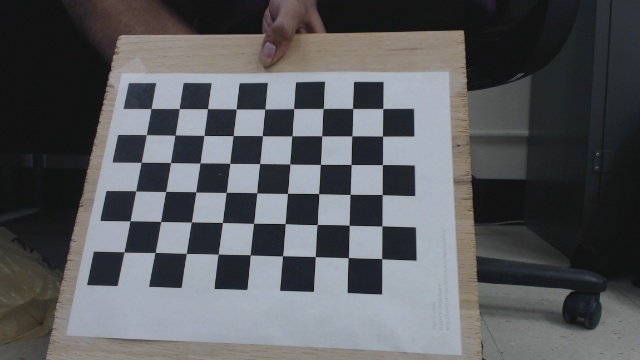

# Stereo Camera Calibration for Python

## 소개

이 양안 카메라 캘리브레이션 안내서를 보기 전에 먼저 일안 카메라를 캘리브레이션하는 방법과 카메라에 있어 캘리브레이션이 무엇을 의미하는지 알고 있어야 합니다. 이에 대한 튜토리얼은 이곳에서 볼 수 있습니다.

소스코드는 [이곳](https://sourishghosh.com/2016/stereo-calibration-cpp-opencv/?fbclid=IwAR2yHSK_sczNhphkY-4YQWXLtqCf2PABW4g6ZfQ-fTqI4UNeo-BrNJR1T5g)에서 얻을 수 있습니다.

## 양안 카메라 설정하기

다음 두개의 그림은 양안 카메라를 설명합니다.




우리는 캘리브레이션을 위해 체스보드 방법을 사용할 것입니다. 각 카메라의 내장 매개변수를 미리 알고 있어야합니다. 카메라 매트릭스 $\mathbf K$를 소환해 보겠습니다.
$$
\mathbf K
= \begin{bmatrix}
f_x & 0 & c_x \\
0 & f_y & c_y \\
0 & 0 & 1 \\
\end{bmatrix}
$$
여기서 $f_x$와 $f_y$는 각각 $x$ 축과 $y$ 축에서 카메라의 초점 거리(focal length)입니다. $(c_x, c_y)$는 주요 점의 좌표입니다. 따라서 스테레오 캘리브레이션으로 진행하기 전에 두 카메라 모두 $\mathbf K_1$과 $\mathbf K_2$ 를 알아야 합니다.

스테레오 캘리브레이션은 본질적으로 회전 $\mathbf R$을 찾습니다 카메라와 카메라 사이의 이동 $\mathbf t$는 왼쪽 및 오른쪽 이미지 평면에서 점 대응을 찾는 데 도움이 됩니다.

$x$와 $x '$를 각각 왼쪽 이미지와 오른쪽 이미지의 점이라고 하면, 대응 관계는 기본 행렬 $\mathbf F$에 의해 다음과 같이 정의됩니다.
$$
\mathbf x'^\intercal \mathbf F \mathbf x = 0
$$
$\mathbf K1$, $\mathbf K2$, $\mathbf R$ 및 $\mathbf t$가 주어지면 $\mathbf F$를 계산하는 [튜터리얼]([http://sourishghosh.com/2016/fundamental-matrix-from-camera-matrices/](https://sourishghosh.com/2016/fundamental-matrix-from-camera-matrices/))을 찾을 수 있습니다.

스테레오 비전의 이론을 이해하지 못하는 경우, 진행 상황과 이러한 기호나 변수가 무엇을 의미하는지 이해하기 위해 진행하기 전에 약간의 읽기를 수행하는 것이 좋습니다. 스테레오 비전의 수학은 주로 투영 기하학과 행렬 대수입니다.

## 의존성과 데이터셋

코드를 실행하려면 `OpenCV 2.4.8` 이상과 `libpopt` (명령 줄 인수)가 있어야합니다. 또한 고정 된 이미지 해상도에 앞서 보정 왼쪽/오른쪽 이미지 쌍의 데이터 세트가 있어야합니다. 다음은 샘플 왼쪽/오른쪽 이미지 쌍입니다.




나는 [여기](https://github.com/sourishg/stereo-calibration/tree/master/calib_imgs)에 두 개의 내 이미지 세트를 만들었습니다.

올바른 보정 결과를 얻으려면 바둑판의 가능한 모든 방향으로 바둑판의 이미지 쌍을 30 개 이상 가져 오는 것이 좋습니다.

참고 :이 예에서는 표준 $9 \times 6$ 보정 보드가 사용됩니다. 사각형의 크기는 `24.23 mm`입니다.

## 스테레오 캘리브레이션

코드는 [여기](https://sourishghosh.com/2016/camera-calibration-cpp-opencv/)에 설명 된 코드와 거의 비슷합니다. 코드의 중요한 부분 만 설명하고 [여기](https://github.com/sourishg/stereo-calibration/blob/master/calib_stereo.cpp)에서 전체 소스를 찾을 수 있습니다.

```C++
vector< vector< Point3f > > object_points;
vector< vector< Point2f > > imagePoints1, imagePoints2;
vector< Point2f > corners1, corners2;
vector< vector< Point2f > > left_img_points, right_img_points;
```

이미지 포인트와 오브젝트 포인트를 저장하는 데 필요한 모든 벡터를 선언하십시오. 이미지 포인트는 이미지의 체스보드 코너 좌표이며 객체 포인트는 해당 체스보드 포인트의 실제 3D 좌표입니다.

```C++
void load_image_points(int board_width, int board_height, int num_imgs,
                       float square_size, char* leftimg_dir, char* rightimg_dir,
                       char* leftimg_filename, char* rightimg_filename) {
	
    Size board_size = Size(board_width, board_height);
	int board_n = board_width * board_height;
```

`load_image_points`라는 함수를 만들어 각 이미지의 모든 코너 포인트와 해당 3D 월드 포인트를 찾아 `object_points`, `left_img_points` 및 `right_img_points` 벡터를 준비합니다. `board_n`은 바둑판의 총 코너 포인트 수입니다. 이 예에서는 $9 \times 6 = 54$입니다. 우리는 또한 많은 인수를 취하지만 변수 이름은 자명하기를 바랍니다. 또한 왼쪽과 오른쪽 이미지의 오브젝트 포인트는 동일합니다.

```C++
	for (int i = 1; i <= num_imgs; i++) {
    	char left_img[100], right_img[100];
    	sprintf(left_img, "%s%s%d.jpg", leftimg_dir, leftimg_filename, i);
    	sprintf(right_img, "%s%s%d.jpg", rightimg_dir, rightimg_filename, i);
    	img1 = imread(left_img, CV_LOAD_IMAGE_COLOR);
    	img2 = imread(right_img, CV_LOAD_IMAGE_COLOR);
    	cvtColor(img1, gray1, CV_BGR2GRAY);
    	cvtColor(img2, gray2, CV_BGR2GRAY);
```

디렉토리의 모든 이미지를 반복하고 `cv::cvtColor` 함수를 사용하여 이미지를 회색조 이미지로 변환합니다. `leftimg_dir`은 왼쪽 이미지를 포함하는 디렉토리이고 `leftimg_filename`은 각 이미지 파일 이름의 접두사입니다. 오른쪽 이미지에 대해서도 유사한 개념입니다.

```C++
 		bool found1 = false, found2 = false;

    	found1 = cv::findChessboardCorners(img1, board_size, corners1,
    			CV_CALIB_CB_ADAPTIVE_THRESH | CV_CALIB_CB_FILTER_QUADS);
    	found2 = cv::findChessboardCorners(img2, board_size, corners2,
    			CV_CALIB_CB_ADAPTIVE_THRESH | CV_CALIB_CB_FILTER_QUADS);

    	if (found1)
    	{
      		cv::cornerSubPix(gray1, corners1, cv::Size(5, 5), cv::Size(-1, -1),
    		cv::TermCriteria(CV_TERMCRIT_EPS | CV_TERMCRIT_ITER, 30, 0.1));
      		cv::drawChessboardCorners(gray1, board_size, corners1, found1);
    	}
    	if (found2)
    	{
      		cv::cornerSubPix(gray2, corners2, cv::Size(5, 5), cv::Size(-1, -1),
    		cv::TermCriteria(CV_TERMCRIT_EPS | CV_TERMCRIT_ITER, 30, 0.1));
      		cv::drawChessboardCorners(gray2, board_size, corners2, found2);
    	}
```

다음으로 `findChessboardCorners` 함수를 사용하여 모든 체스보드 코너를 찾습니다. 이 함수의 인수에 대한 자세한 내용은 `OpenCV` 설명서를 참조하십시오. 코너가 발견되면 `found`가 `true`로 설정되고 `cornerSubPix` 함수에 의해 코너가 더 세분화됩니다. `drawChessboardCorners` 함수는 선택 사항이며 발견 된 체스보드 코너를 시각화하는 데 도움이 됩니다.

```C++
    	vector< Point3f > obj;
    	for (int i = 0; i < board_height; i++)
      		for (int j = 0; j < board_width; j++)
        		obj.push_back(Point3f((float)j * square_size, (float)i * square_size, 0));

    	if (found1 && found2) {
      		cout << i << ". Found corners!" << endl;
      		imagePoints1.push_back(corners1);
      		imagePoints2.push_back(corners2);
      		object_points.push_back(obj);
    	}
  	}
}
```

다음으로 오브직트 포인트를 저장합니다. 이상적으로는 원점을 카메라 중앙에 유지하고 체스보드 코너의 3D 점을 수동으로 측정해야하지만 얼마나 어려운지를 이미지로 만들 수 있습니다. 작지만 아름다운 핵심을 소개합니다. 월드 원점을 왼쪽 상단으로 유지합니다. 수학적으로 이것은 아무것도 바뀌지 않습니다 (어떻게 생각하는지). 이제 바둑판의 형상은 모서리의 다른 3D 좌표를 매우 쉽게 찾을 수 있도록 도와줍니다. 모든 점이 평면에 있기 때문에 $Z$ 좌표는 항상 0입니다. 이 예제의 정사각형 크기는 `24.23mm` (단위는 중요합니다!)이므로 다른 점은 $(24.23,0,0)$, $(48.46,0,0)$ 등이됩니다.

왼쪽 및 오른쪽 이미지에 대해 코너가 발견되면 점만 저장되고, 그렇지 않으면 해당 이미지 쌍이 무시됩니다.

```C++
int main(int argc, char const *argv[])
{
  	char* leftcalib_file;
  	char* rightcalib_file;
  	char* leftimg_dir;
  	char* rightimg_dir;
  	char* leftimg_filename;
  	char* rightimg_filename;
  	char* out_file;
  	int num_imgs;

  	static struct poptOption options[] = {
    	{ "num_imgs",'n',POPT_ARG_INT,&num_imgs,0,"Number of checkerboard images","NUM" },
    	{ "leftcalib_file",'u',POPT_ARG_STRING,&leftcalib_file,0,"Left camera calibration","STR" },
    	{ "rightcalib_file",'v',POPT_ARG_STRING,&rightcalib_file,0,"Right camera calibration","STR" },
    	{ "leftimg_dir",'L',POPT_ARG_STRING,&leftimg_dir,0,"Directory containing left images","STR" },
    	{ "rightimg_dir",'R',POPT_ARG_STRING,&rightimg_dir,0,"Directory containing right images","STR" },
    	{ "leftimg_filename",'l',POPT_ARG_STRING,&leftimg_filename,0,"Left image prefix","STR" },
    	{ "rightimg_filename",'r',POPT_ARG_STRING,&rightimg_filename,0,"Right image prefix","STR" },
    	{ "out_file",'o',POPT_ARG_STRING,&out_file,0,"Output calibration filename (YML)","STR" },
    	POPT_AUTOHELP
    	{ NULL, 0, 0, NULL, 0, NULL, NULL }
  	};

  	POpt popt(NULL, argc, argv, options, 0);
  	int c;
  	while((c = popt.getNextOpt()) >= 0) {}

  	FileStorage fsl(leftcalib_file, FileStorage::READ);
  	FileStorage fsr(rightcalib_file, FileStorage::READ);

  	load_image_points(fsl["board_width"], fsl["board_height"], num_imgs, fsl["square_size"], leftimg_dir, rightimg_dir, leftimg_filename, rightimg_filename);
```

`libpopt`를 사용하여 필요한 모든 사용자 입력을 얻고 `load_image_points` 함수를 호출합니다. 또한 객체 `fsl` 및 `fsr`을 사용하여 개별 카메라 행렬에 입력합니다.

```C++
	Mat K1, K2, R, F, E;
  	Vec3d T;
  	Mat D1, D2;
  	fsl["K"] >> K1;
  	fsr["K"] >> K2;
  	fsl["D"] >> D1;
  	fsr["D"] >> D2;
  	int flag = 0;
  	flag |= CV_CALIB_FIX_INTRINSIC;
  	cout << "Read intrinsics" << endl;
  	stereoCalibrate(object_points, left_img_points, right_img_points, K1, D1, K2, D2, img1.size(), R, T, E, F);
```

다음으로 각 카메라의 내장 매개변수와 왜곡 계수를 읽고 이를 `Mat` 타입으로 저장합니다. 플래그를 `CV_CALIB_FIX_INTRINSIC`으로 설정하여 `stereoCalibrate` 함수에 각 카메라의 개별 내장 함수를 추측하지 않도록 지시합니다. `F`는 기본 행렬을 저장하고, `E`는 필수 행렬을 저장하고, `R`은 왼쪽에서 오른쪽 카메라로 회전을 저장하고, `T`는 왼쪽에서 오른쪽 카메라로 변환을 저장합니다.

다음으로 동일한 설정을 사용하는 경우 다시 교정 할 필요가 없도록 모든 교정 데이터를 YAML 파일에 저장합니다.

참고: 한 대의 카메라를 약간 돌리거나 움직여서 스테레오 설정을 방해하는 경우 다시 캘리브레이션을 해야 합니다.

## Stereo Rectification

스테레오 rectification는 결과 에피폴라 라인이 가로 스캔 라인이 되도록 두 이미지 평면에 투영 변환을 적용하는 작업입니다. [여기](http://www.sci.utah.edu/~gerig/CS6320-S2013/Materials/CS6320-CV-F2012-Rectification.pdf)서 이론을 읽을 수 있습니다.

```C++
	cv::Mat R1, R2, P1, P2, Q;
	stereoRectify(K1, D1, K2, D2, img1.size(), R, T, R1, R2, P1, P2, Q);
    fs1 << "R1" << R1;
	fs1 << "R2" << R2;
	fs1 << "P1" << P1;
	fs1 << "P2" << P2;
	fs1 << "Q" << Q;
```

`R1`은 왼쪽 카메라의 정류 변환(Rectification transform)이고 오른쪽 카메라는 `R2`입니다. `P1`은 왼쪽 카메라의 새로운 정류 좌표계(recified coordinate system), 오른쪽 카메라의 `P2`의 프로젝션 매트릭스입니다. `Q`는 디스 패리티-심도 매핑 행렬(disparity-to-depth mapping matrix)로 알려져 있습니다. `Q`는 매우 중요한 매트릭스이며 3D 재구성 중에는 엄청나게 사용됩니다.

## 참조

- [Stereo calibration using C++ and OpenCV](https://sourishghosh.com/2016/stereo-calibration-cpp-opencv/?fbclid=IwAR2yHSK_sczNhphkY-4YQWXLtqCf2PABW4g6ZfQ-fTqI4UNeo-BrNJR1T5g)