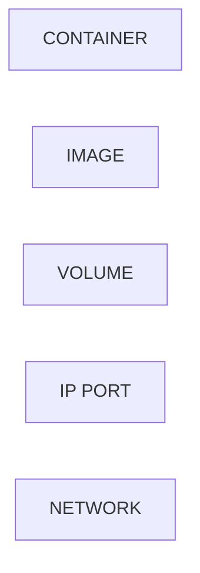

# 야매 도커 

## 도커란?

FreeBSD 및 리눅스에서 **컨테이너** 기술을 실현하는 도구

**리눅스 컨테이너란?**

- 컨테이너 기술에 대한 개념은 1990년대에 시도되었으나 사용상의 높은 난이도로 인해 잊혀짐.

- 2000년에 FreeBSD를 여러 하위 시스템으로 분리할 수 있는 기술로 구현.

- 2001년에 리눅스에 LXC 구현. 즉 운영체제 자체에서 지원.

- **가상화 기술**로 분류하기도 하지만 **격리**라고 인식하면 더 이해하기 쉽다.

**가상머신과의 차이점**

참조: [레드헷](https://www.redhat.com/ko/topics/containers/whats-a-linux-container) - 컨테이너 기술에 대한 이해

