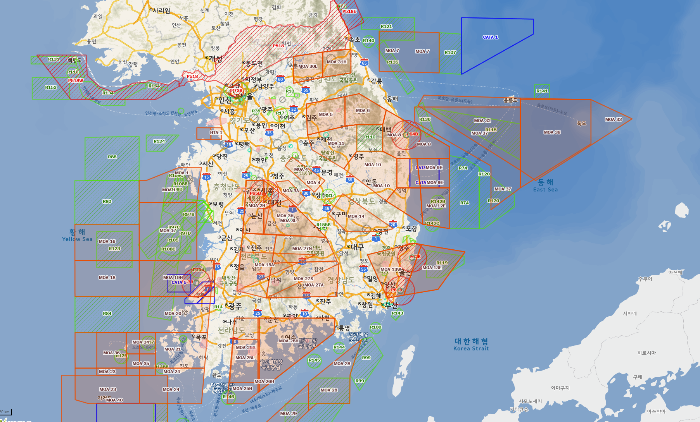

# 드론에 대한 법률

## 타인의 토지의 공역에 대한 침해

공동생활에서 어느 정도의 방해 또는 침해는 불가피 하다. 따라서, 이웃 토지의 거주자는 사회통념상 통상 인내할 것이 요구되는 한도 내에서 이러한 방해 또는 침해를 '수인(용인)할 의무'를 부담 한다. 드론을 날리는 행위가 위법하려면 타인이 감수해야할 불편함의 정도를 넘어선 것이어야 한다. 수인 한도는 사안마다 달리 판단해야 한다.

적법하게 드론을 날리기 위해서는

- 항공법의 규정에 따라 드론을 운행해야 하며,
- 드론의 비행으로 인한 침해가 토지 소유자의 수인 한도 내의 것이어야 한다.

## 비행금지구역과 비행제한구역

### 항공법

항공법에 따라 비행금지구역과 비행제한구역이 있다.

비행금지구역

- 비행이 금지된 구역
- 허가를 받아야 한다
- 대전

비행제한구역

- 장치의 무게가 12kg이상이면 허가를 받아야 한다.
- 비행고도가 150m 이상일 경우 허가를 받아야 한다.

- 즉, 비행제한구역에서 12kg 미만의 기체를 150m이하의 고도에서는 자유롭게 날릴 수 있다.

### 서울

- 서울은 비행제한구역이 R-75 코드이며, 군사적 목적에서 설정된 공역이다.

- 비행제한구역에서도 수방사의 승인을 받아야 한다.
- 국방부 지침이 항공법보다 우선 한다.

### 전국 지도

출처: [공간정보 오픈플랫폼 데이터 정보](http://www.vworld.kr/data/v4dc_svcdata_s002.do?pageIndex=1&datIde=DAT_0000000000000183&ctmCde=&searchCondition=&searchKeyword=)