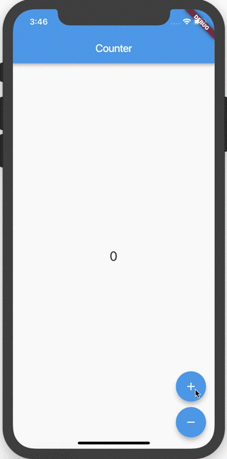
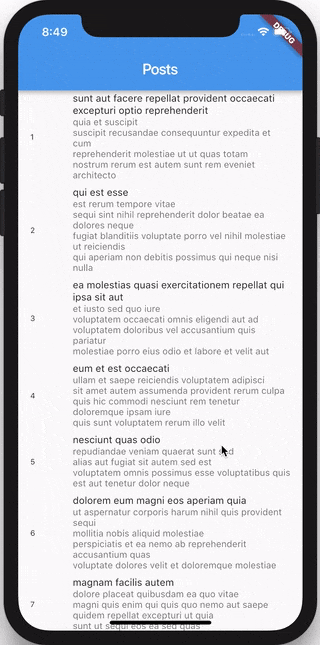
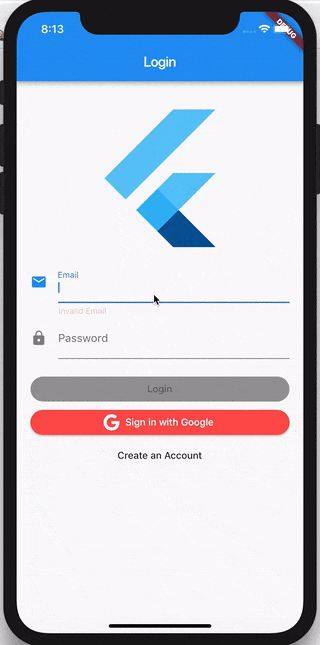
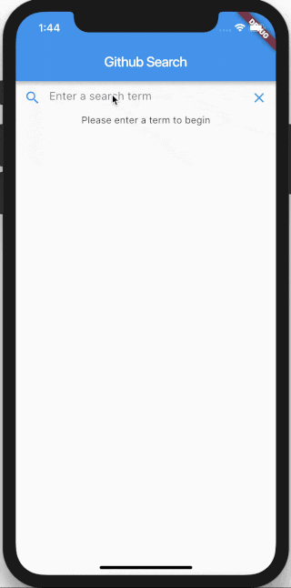
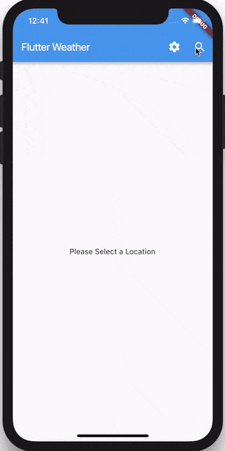
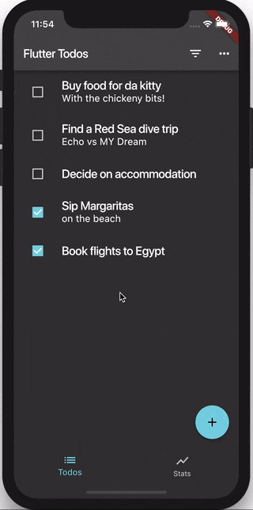

# Bloc 2.0.0

A Flutter package that helps implement the [BLoC pattern](https://www.didierboelens.com/2018/08/reactive-programming---streams---bloc).

This package is built to work with [bloc](https://pub.dartlang.org/packages/bloc).

## Bloc Widgets [#](https://pub.dev/packages/flutter_bloc#bloc-widgets)

**BlocBuilder**는 `Bloc`과 `builder` 함수를 필요로하는 Flutter 위젯입니다. `BlocBuilder`는 새로운 상태에 대한 응답으로 위젯을 구현합니다. `BlocBuilder`는 `StreamBuilder`와 매우 비슷하지만 필요한 보일러 판 코드의 양을 줄이기위한 더 간단한 API를 가지고 있습니다. `builder` 함수는 잠재적으로 여러 번 호출 될 것이고 상태에 대한 응답으로 위젯을 리턴하는 [pure function](https://en.wikipedia.org/wiki/Pure_function)이어야 합니다.

탐색, 대화 상자 표시 등과 같은 상태 변경에 대한 응답으로 무엇이든 "수행"하려면 `BlocListener`를 참조하십시오.

bloc 매개 변수를 생략하면 `BlocBuilder`는 `BlocProvider`와 현재 `BuildContext`를 사용하여 자동으로 룩업을 수행합니다.

```dart
BlocBuilder<BlocA, BlocAState>(
  builder: (context, state) {
    // return widget here based on BlocA's state
  }
)
```

`BlocProvider`와 현재 `BuildContext`를 통해 접근 할 수 없는 Bloc을 제공하고자 할 때만 Bloc을 지정하십시오.

```dart
BlocBuilder<BlocA, BlocAState>(
  bloc: blocA,
  builder: (context, state) {
    // return widget here based on BlocA's state
  }
)
```

빌더 함수가 호출 될 때 세밀하게 제어하고 싶다면 `condition`을 `BlocBuilder`에 제공 할 수 있습니다. `condition`은 이전의 블록 상태와 현재의 블록 상태를 취해서 부울을 반환합니다. `condition`이 true를 반환하면 `builder`가 `currentState`와 함께 호출되고 위젯이 다시 빌드됩니다. `condition`이 false를 반환하면 `builder`는 `currentState`로 호출되지 않고 다시 빌드되지 않습니다.

```dart
BlocBuilder<BlocA, BlocAState>(
  condition: (previousState, currentState) {
    // return true/false to determine whether or not
    // to rebuild the widget with currentState
  },
  builder: (context, state) {
    // return widget here based on BlocA's state
  }
)
```

**BlocProvider**는 `BlocProvider.of<T>(context)`를 통해 그 Bloc을 제공하는 Flutter 위젯입니다. 종속성 삽입 (DI) 위젯으로 사용되어 Bloc의 단일 인스턴스가 서브 트리 내의 여러 위젯에 제공 될 수 있습니다.

대부분의 경우, `BlocProvider`는 나머지 서브 트리에서 사용할 새로운`blocs`을 만드는 데 사용해야 합니다. 이 경우, `BlocProvider`가 블록을 작성하는 책임이 있기 때문에, Bloc을 자동으로 처리합니다.

```dart
BlocProvider(
  builder: (BuildContext context) => BlocA(),
  child: ChildA(),
);
```

경우에 따라 `BlocProvider`를 사용하여 기존 Bloc을 위젯 트리의 새 부분에 제공 할 수 있습니다. 이것은 기존의 `Bloc`을 새로운 경로에 사용할 수 있어야 할 때 가장 일반적으로 사용됩니다. 이 경우 `BlocProvider`는 블록을 생성하지 않았기 때문에 블록을 자동으로 처리하지 않습니다.

```dart
BlocProvider.value(
  value: BlocProvider.of<BlocA>(context),
  child: ScreenA(),
);
```

`ChildS` 나 `ScreenS`에서 우리는 `Bloc`를 다음과 같이 검색 할 수 있습니다:

```dart
BlocProvider.of<BlocA>(context)
```

**MultiBlocProvider** 는 여러 개의 `BlocProvider` 위젯을 하나로 합친 Flutter 위젯입니다. `MultiBlocProvider`는 가독성을 높이고 여러 개의 `BlocProviders`를 중첩 할 필요가 없습니다. `MultiBlocProvider`를 사용함으로써 우리는 다음과 같이 할 수 있습니다 :

```dart
BlocProvider<BlocA>(
  builder: (BuildContext context) => BlocA(),
  child: BlocProvider<BlocB>(
    builder: (BuildContext context) => BlocB(),
    child: BlocProvider<BlocC>(
      builder: (BuildContext context) => BlocC(),
      child: ChildA(),
    )
  )
)
```

to:

```dart
MultiBlocProvider(
  providers: [
    BlocProvider<BlocA>(
      builder: (BuildContext context) => BlocA(),
    ),
    BlocProvider<BlocB>(
      builder: (BuildContext context) => BlocB(),
    ),
    BlocProvider<BlocC>(
      builder: (BuildContext context) => BlocC(),
    ),
  ],
  child: ChildA(),
)
```

**BlocListener** 는 `BlocWidgetListener`와 선택적인 `Bloc`을 취하고 블록의 상태 변화에 대한 응답으로 `listener`를 호출하는 Flutter 위젯입니다. 네비게이션, `SnackBar` 표시, `Dialog` 표시 등과 같은 상태 변경마다 한 번씩 발생해야하는 기능에 사용해야 합니다.

`listener`는 `BlocBuilder`에서 `builder`와는 달리 상태 변경마다 한 번만 호출되며 `void` 함수입니다. (`initialState`를 포함하지 않음.)

bloc 매개 변수가 생략되면, `BlocListener`는 `BlocProvider`와 현재 `BuildContext`를 사용하여 자동으로 룩업을 수행합니다.

```dart
BlocListener<BlocA, BlocAState>(
  listener: (context, state) {
    // do stuff here based on BlocA's state
  },
  child: Container(),
)
```

`BlocProvider`와 현재 `BuildContext`를 통해 접근 할 수 없는 블록을 제공하고자 할 때만 Bloc을 지정하십시오.

```dart
BlocListener<BlocA, BlocAState>(
  bloc: blocA,
  listener: (context, state) {
    // do stuff here based on BlocA's state
  }
)
```

`listener` 함수가 호출 될 때 세밀한 제어를 원하면`condition`을 `BlocListener`에 제공 할 수 있습니다. `condition`은 이전의 블록 상태와 현재의 블록 상태를 취해서 부울을 반환합니다. `condition`이 `true`를 반환하면 `listener`는`currentState`로 호출됩니다. `condition`이 false를 반환하면``listener`는`currentState`와 함께 호출되지 않습니다.

```dart
BlocListener<BlocA, BlocAState>(
  condition: (previousState, currentState) {
    // return true/false to determine whether or not
    // to call listener with currentState
  },
  listener: (context, state) {
    // do stuff here based on BlocA's state
  }
  child: Container(),
)
```

**MultiBlocListener** 는 여러 개의 `BlocListener` 위젯을 하나로 합치는 Flutter 위젯입니다. `MultiBlocListener`는 가독성을 높이고 여러 개의 `BlocListeners`를 중첩 할 필요가 없습니다. `MultiBlocListener`를 사용함으로써 우리는 다음과 같이 할 수 있습니다 :

```dart
BlocListener<BlocA, BlocAState>(
  listener: (context, state) {},
  child: BlocListener<BlocB, BlocBState>(
    listener: (context, state) {},
    child: BlocListener<BlocC, BlocCState>(
      listener: (context, state) {},
      child: ChildA(),
    ),
  ),
)
```

to:

```dart
MultiBlocListener(
  listeners: [
    BlocListener<BlocA, BlocAState>(
      listener: (context, state) {},
    ),
    BlocListener<BlocB, BlocBState>(
      listener: (context, state) {},
    ),
    BlocListener<BlocC, BlocCState>(
      listener: (context, state) {},
    ),
  ],
  child: ChildA(),
)
```

**RepositoryProvider** `RepositoryProvider.of<T>(context)`를 통해 그 자식에게 저장소를 제공하는 Flutter 위젯입니다. Dependency Injection (DI) 위젯으로 사용되어 저장소의 단일 인스턴스가 하위 트리 내의 여러 위젯에 제공 될 수 있습니다. `RepositoryProvider`는 리포지토리에만 사용해야하는 반면 `BlocProvider`는 블럭을 제공하는 데 사용해야합니다.

```dart
RepositoryProvider(
  builder: (context) => RepositoryA(),
  child: ChildA(),
);
```

`ChildA`에서 우리는`Repository` 인스턴스를 다음과 같이 검색 할 수 있습니다 :

```dart
RepositoryProvider.of<RepositoryA>(context)
```

**MultiRepositoryProvider** 는 다수의 `RepositoryProvider` 위젯을 하나로 합친 Flutter 위젯입니다. `MultiRepositoryProvider`는 가독성을 높이고 여러 `RepositoryProvider`를 중첩 할 필요가 없습니다. `MultiRepositoryProvider`를 사용함으로써 우리는 다음과 같이 할 수 있습니다 :

```dart
RepositoryProvider<RepositoryA>(
  builder: (context) => RepositoryA(),
  child: RepositoryProvider<RepositoryB>(
    builder: (context) => RepositoryB(),
    child: RepositoryProvider<RepositoryC>(
      builder: (context) => RepositoryC(),
      child: ChildA(),
    )
  )
)
```

to:

```dart
MultiRepositoryProvider(
  providers: [
    RepositoryProvider<RepositoryA>(
      builder: (context) => RepositoryA(),
    ),
    RepositoryProvider<RepositoryB>(
      builder: (context) => RepositoryB(),
    ),
    RepositoryProvider<RepositoryC>(
      builder: (context) => RepositoryC(),
    ),
  ],
  child: ChildA(),
)
```

## Usage [#](https://pub.dev/packages/flutter_bloc#usage)

Lets take a look at how to use `BlocBuilder` to hook up a `CounterPage` widget to a `CounterBloc`.

### counter_bloc.dart [#](https://pub.dev/packages/flutter_bloc#counter_blocdart)

```dart
enum CounterEvent { increment, decrement }

class CounterBloc extends Bloc<CounterEvent, int> {
  @override
  int get initialState => 0;

  @override
  Stream<int> mapEventToState(CounterEvent event) async* {
    switch (event) {
      case CounterEvent.decrement:
        yield currentState - 1;
        break;
      case CounterEvent.increment:
        yield currentState + 1;
        break;
    }
  }
}
```

### counter_page.dart [#](https://pub.dev/packages/flutter_bloc#counter_pagedart)

```dart
class CounterPage extends StatelessWidget {
  @override
  Widget build(BuildContext context) {
    final CounterBloc counterBloc = BlocProvider.of<CounterBloc>(context);

    return Scaffold(
      appBar: AppBar(title: Text('Counter')),
      body: BlocBuilder<CounterBloc, int>(
        builder: (context, count) {
          return Center(
            child: Text(
              '$count',
              style: TextStyle(fontSize: 24.0),
            ),
          );
        },
      ),
      floatingActionButton: Column(
        crossAxisAlignment: CrossAxisAlignment.end,
        mainAxisAlignment: MainAxisAlignment.end,
        children: <Widget>[
          Padding(
            padding: EdgeInsets.symmetric(vertical: 5.0),
            child: FloatingActionButton(
              child: Icon(Icons.add),
              onPressed: () {
                counterBloc.dispatch(CounterEvent.increment);
              },
            ),
          ),
          Padding(
            padding: EdgeInsets.symmetric(vertical: 5.0),
            child: FloatingActionButton(
              child: Icon(Icons.remove),
              onPressed: () {
                counterBloc.dispatch(CounterEvent.decrement);
              },
            ),
          ),
        ],
      ),
    );
  }
}
```

At this point we have successfully separated our presentational layer from our business logic layer. Notice that the `CounterPage` widget knows nothing about what happens when a user taps the buttons. The widget simply tells the `CounterBloc` that the user has pressed either the increment or decrement button.

## Gallery [#](https://pub.dev/packages/flutter_bloc#gallery)

| [                                      ](https://felangel.github.io/bloc/#/fluttercountertutorial) | [                                      ](https://felangel.github.io/bloc/#/flutterinfinitelisttutorial) | [                                      ](https://felangel.github.io/bloc/#/flutterfirebaselogintutorial) |
| ------------------------------------------------------------ | ------------------------------------------------------------ | ------------------------------------------------------------ |
| [                                      ](https://felangel.github.io/bloc/#/flutterangulargithubsearch) | [                                      ](https://felangel.github.io/bloc/#/flutterweathertutorial) | [                                      ](https://felangel.github.io/bloc/#/fluttertodostutorial) |

## Examples [#](https://pub.dev/packages/flutter_bloc#examples)

- [Counter](https://felangel.github.io/bloc/#/fluttercountertutorial) - an example of how to create a `CounterBloc` to implement the classic Flutter Counter app.
- [Form Validation](https://github.com/felangel/bloc/tree/master/examples/flutter_form_validation) - an example of how to use the `bloc` and `flutter_bloc` packages to implement form validation.
- [Bloc with Stream](https://github.com/felangel/bloc/tree/master/examples/flutter_bloc_with_stream) - an example of how to hook up a `bloc` to a `Stream` and update the UI in response to data from the `Stream`.
- [Infinite List](https://felangel.github.io/bloc/#/flutterinfinitelisttutorial) - an example of how to use the `bloc` and `flutter_bloc` packages to implement an infinite scrolling list.
- [Login Flow](https://felangel.github.io/bloc/#/flutterlogintutorial) - an example of how to use the `bloc` and `flutter_bloc` packages to implement a Login Flow.
- [Firebase Login](https://felangel.github.io/bloc/#/flutterfirebaselogintutorial) - an example of how to use the `bloc` and `flutter_bloc` packages to implement login via Firebase.
- [Github Search](https://felangel.github.io/bloc/#/flutterangulargithubsearch) - an example of how to create a Github Search Application using the `bloc` and `flutter_bloc` packages.
- [Weather](https://felangel.github.io/bloc/#/flutterweathertutorial) - an example of how to create a Weather Application using the `bloc` and `flutter_bloc` packages. The app uses a `RefreshIndicator` to implement "pull-to-refresh" as well as dynamic theming.
- [Todos](https://felangel.github.io/bloc/#/fluttertodostutorial) - an example of how to create a Todos Application using the `bloc` and `flutter_bloc` packages.
- [Timer](https://felangel.github.io/bloc/#/fluttertimertutorial) - an example of how to create a Timer using the `bloc` and `flutter_bloc` packages.

## 