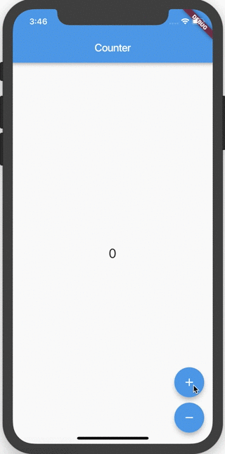

[Up](./index.md)

# [Flutter Counter Tutorial](https://felangel.github.io/bloc/#/fluttercountertutorial?id=flutter-counter-tutorial)

원문: [Bloc / Tutorials / Flutter / Counter](https://felangel.github.io/bloc/#/fluttercountertutorial)


> 이 튜토리얼에서는 Bloc 라이브러리를 사용하여 Flutter로 카운터를 만들 것입니다.



<p id="setup"/>

## 준비 (Setup)

우리는 새 이름으로 Flutter 프로젝트를 만드는 것으로 시작합니다.

```bash
flutter create flutter_counter
```

다음, 우리는 `pubspec.yaml`의 내용을 다음과 같이 변경 할 수 있습니다.

```yaml
name: flutter_counter
description: A new Flutter project.
version: 1.0.0+1

environment:
  sdk: ">=2.0.0-dev.68.0 <3.0.0"

dependencies:
  flutter:
    sdk: flutter
  flutter_bloc: ^0.13.0
  meta: ^1.1.6

dev_dependencies:
  flutter_test:
    sdk: flutter

flutter:
  uses-material-design: true
```

그리고, 모든 의존 패키지를 설치 합니다.

```bash
flutter packages get
```

카운터 애플리케이션은 카운터 값을 증가/감소시키는 두 개의 버튼과 현재 값을 표시하는 `Text` 위젯을 가질 것입니다. `CounterEvent`를 디자인 하겠습니다.

<p id="counterevent"/>

## CounterEvent

```dart
enum CounterEvent { increment, decrement }
```

<p id = "counter-states"/>

## 카운터 상태 (Counter States)

카운터의 상태는 `int`로 나타낼 수 있으므로 사용자 정의 클래스를 만들 필요가 없습니다!

<p id="counterbloc"/>

## CounterBloc

```dart
class CounterBloc extends Bloc<CounterEvent, int> {
  @override
  int get initialState => 0;

  @override
  Stream<int> mapEventToState(CounterEvent event) async* {
    switch (event) {
      case CounterEvent.decrement:
        yield currentState - 1;
        break;
      case CounterEvent.increment:
        yield currentState + 1;
        break;
    }
  }
}
```

**Note**: 클래스 선언에서 `CounterBloc`은 `CounterEvent`를 입력으로 사용하고 `int`를 출력 한다고 말할 수 있습니다.

<p id="counter-app"/>

## 카운터 앱 (Counter App)

이제 `CounterBloc`을 완전히 구현 했으므로 Flutter 애플리케이션을 만들 수 있습니다.

```dart
void main() => runApp(MyApp());

class MyApp extends StatefulWidget {
  @override
  State<StatefulWidget> createState() => MyAppState();
}

class MyAppState extends State<MyApp> {
  final CounterBloc _counterBloc = CounterBloc();

  @override
  Widget build(BuildContext context) {
    return MaterialApp(
      title: 'Flutter Demo',
      home: BlocProvider<CounterBloc>(
        bloc: _counterBloc,
        child: CounterPage(),
      ),
    );
  }

  @override
  void dispose() {
    _counterBloc.dispose();
    super.dispose();
  }
}
```

**Note**: 우리의 `MyApp` 위젯은 `StatefulWidget`이므로 `CounterBloc`의 생성과 삭제를 관리 할 수 있습니다.

**Note**: 우리는 `CounterBloc` 인스턴스를 전체 서브트리(`CounterPage`)에서 사용 가능하게 하기 위해 `flutter_bloc`에서 `BlocProvider ` 위젯을 사용하고 있습니다.

<p id = "counterpage"/>

## CounterPage

마지막으로 남은 것은 카운터 페이지를 만드는 것입니다.

```dart
class CounterPage extends StatelessWidget {
  @override
  Widget build(BuildContext context) {
    final CounterBloc _counterBloc = BlocProvider.of<CounterBloc>(context);

    return Scaffold(
      appBar: AppBar(title: Text('Counter')),
      body: BlocBuilder<CounterEvent, int>(
        bloc: _counterBloc,
        builder: (BuildContext context, int count) {
          return Center(
            child: Text(
              '$count',
              style: TextStyle(fontSize: 24.0),
            ),
          );
        },
      ),
      floatingActionButton: Column(
        crossAxisAlignment: CrossAxisAlignment.end,
        mainAxisAlignment: MainAxisAlignment.end,
        children: <Widget>[
          Padding(
            padding: EdgeInsets.symmetric(vertical: 5.0),
            child: FloatingActionButton(
              child: Icon(Icons.add),
              onPressed: () {
                _counterBloc.dispatch(CounterEvent.increment);
              },
            ),
          ),
          Padding(
            padding: EdgeInsets.symmetric(vertical: 5.0),
            child: FloatingActionButton(
              child: Icon(Icons.remove),
              onPressed: () {
                _counterBloc.dispatch(CounterEvent.decrement);
              },
            ),
          ),
        ],
      ),
    );
  }
}
```

**Note**: `BlocProvider.of<CounterBloc>(context)`를 사용하여 `CounterBloc` 인스턴스에 접근 할 수 있습니다. 왜냐하면 우리는 `CounterPage`를`BlocProvider`에 래핑했기 때문입니다.

**Note**: 우리는 상태 변경(카운터 값의 변경)에 대한 응답으로 UI를 다시 빌드하기 위해 `flutter_bloc`에서`BlocBuilder` 위젯을 사용하고 있습니다.

그게 전부입니다! 우리는 프리젠테이션 레이어와 비즈니스 로직 레이어를 분리했습니다. 우리의 `CounterPage`는 사용자가 버튼을 눌렀을 때 어떤 일이 일어나는지 전혀 모릅니다. `CounterBloc`에 알리기 위한 이벤트를 전달할 뿐입니다. 또한, 우리의 `CounterBloc`은 상태 (카운터 값)에 어떤 일이 일어나고 있는지 전혀 알지 못합니다. 단순히 `CounterEvents`를 `int`로 변환하는 것입니다.

우리는 `flutter run`으로 앱을 구동 할 수 있으며, 디바이스나 시뮬레이터/에뮬레이터에서 볼 수 있습니다.

이 예제의 전체 소스는 [여기](https://github.com/felangel/Bloc/tree/master/packages/flutter_bloc/example)에서 볼 수 있습니다.

---

이전: [테스트 (Testing)](introduction_testing.md)

다음: [무한 리스트 (Infinite List)](tutorials_flutter_infinite_list.md)

