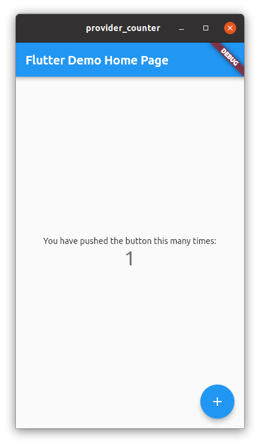

# Provider

## ChangeNotifierProvider example



```dart
import 'package:flutter/material.dart';
import 'package:provider/provider.dart';

void main() {
  runApp(
    ChangeNotifierProvider(
      create: (context) => Counter(),
      child: MyApp(),
    ),
  );
}

class Counter with ChangeNotifier {
  int value = 0;

  void increment() {
    value += 1;
    notifyListeners();
  }
}

class MyApp extends StatelessWidget {
  @override
  Widget build(BuildContext context) {
    return MaterialApp(
      title: 'Flutter Demo',
      theme: ThemeData(
        primarySwatch: Colors.blue,
      ),
      home: MyHomePage(),
    );
  }
}

class MyHomePage extends StatelessWidget {
  @override
  Widget build(BuildContext context) {
    return Scaffold(
      appBar: AppBar(
        title: const Text('Flutter Demo Home Page'),
      ),
      body: Center(
        child: Column(
          mainAxisAlignment: MainAxisAlignment.center,
          children: <Widget>[
            const Text('You have pushed the button this many times:'),
            Consumer<Counter>(
              builder: (context, counter, child) => Text(
                '${counter.value}',
                style: Theme.of(context).textTheme.headline4,
              ),
            ),
          ],
        ),
      ),
      floatingActionButton: FloatingActionButton(
        onPressed: () {
          var counter = context.read<Counter>();
          counter.increment();
        },
        tooltip: 'Increment',
        child: const Icon(Icons.add),
      ),
    );
  }
}

```

참조: https://github.com/flutter/samples
