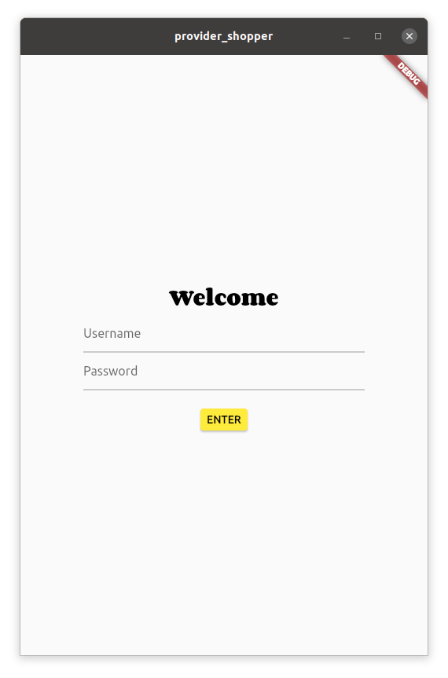
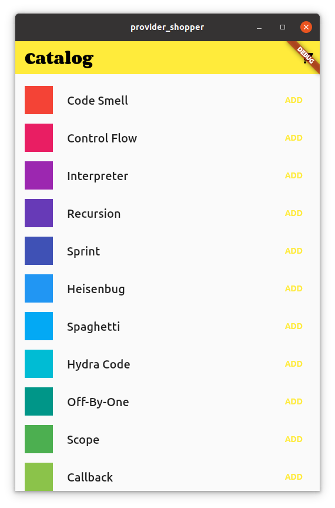
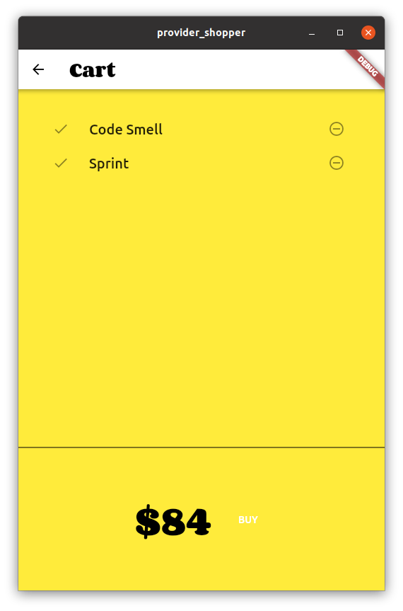

# Provider Shopper Example

## `main.dart`:

```dart
import 'package:flutter/material.dart';
import 'package:provider/provider.dart';
import 'package:provider_shopper/common/theme.dart';
import 'package:provider_shopper/models/cart.dart';
import 'package:provider_shopper/models/catalog.dart';
import 'package:provider_shopper/screens/cart.dart';
import 'package:provider_shopper/screens/catalog.dart';
import 'package:provider_shopper/screens/login.dart';

void main() {
  runApp(MyApp());
}

class MyApp extends StatelessWidget {
  @override
  Widget build(BuildContext context) {
    return MultiProvider(
      providers: [
        Provider(
          create: (context) => CatalogModel(),
        ),
        ChangeNotifierProxyProvider<CatalogModel, CartModel>(
          create: (context) => CartModel(),
          update: (context, catalog, cart) {
            if (cart == null) throw ArgumentError.notNull('cart');
            cart.catalog = catalog;
            return cart;
          },
        ),
      ],
      child: MaterialApp(
        title: 'Provider Demo',
        theme: appTheme,
        initialRoute: '/',
        routes: {
          '/': (context) => MyLogin(),
          '/catalog': (context) => MyCatalog(),
          '/cart': (context) => MyCart(),
        },
      ),
    );
  }
}
```

---

## `screens/login.dart`:



```dart
// Copyright 2020 The Flutter team. All rights reserved.
// Use of this source code is governed by a BSD-style license that can be
// found in the LICENSE file.

import 'package:flutter/material.dart';

class MyLogin extends StatelessWidget {
  @override
  Widget build(BuildContext context) {
    return Scaffold(
      body: Center(
        child: Container(
          padding: const EdgeInsets.all(80.0),
          child: Column(
            mainAxisAlignment: MainAxisAlignment.center,
            children: [
              Text(
                'Welcome',
                style: Theme.of(context).textTheme.headline1,
              ),
              TextFormField(
                decoration: const InputDecoration(
                  hintText: 'Username',
                ),
              ),
              TextFormField(
                decoration: const InputDecoration(
                  hintText: 'Password',
                ),
                obscureText: true,
              ),
              const SizedBox(
                height: 24,
              ),
              ElevatedButton(
                child: const Text('ENTER'),
                onPressed: () {
                  Navigator.pushReplacementNamed(context, '/catalog');
                },
                style: ElevatedButton.styleFrom(
                  primary: Colors.yellow,
                ),
              )
            ],
          ),
        ),
      ),
    );
  }
}
```

---

## `screens/catalog.dart`



```dart
import 'package:flutter/material.dart';
import 'package:provider/provider.dart';
import 'package:provider_shopper/models/cart.dart';
import 'package:provider_shopper/models/catalog.dart';

class MyCatalog extends StatelessWidget {
  @override
  Widget build(BuildContext context) {
    return Scaffold(
      body: CustomScrollView(
        slivers: [
          _MyAppBar(),
          const SliverToBoxAdapter(child: SizedBox(height: 12)),
          SliverList(
            delegate: SliverChildBuilderDelegate(
                (context, index) => _MyListItem(index)),
          ),
        ],
      ),
    );
  }
}

class _AddButton extends StatelessWidget {
  final Item item;

  const _AddButton({required this.item, Key? key}) : super(key: key);

  @override
  Widget build(BuildContext context) {
    var isInCart = context.select<CartModel, bool>(
      (cart) => cart.items.contains(item),
    );

    return TextButton(
      onPressed: isInCart
          ? null
          : () {
              var cart = context.read<CartModel>();
              cart.add(item);
            },
      style: ButtonStyle(
        overlayColor: MaterialStateProperty.resolveWith<Color?>((states) {
          if (states.contains(MaterialState.pressed)) {
            return Theme.of(context).primaryColor;
          }
          return null; // Defer to the widget's default.
        }),
      ),
      child: isInCart
          ? const Icon(Icons.check, semanticLabel: 'ADDED')
          : const Text('ADD'),
    );
  }
}

class _MyAppBar extends StatelessWidget {
  @override
  Widget build(BuildContext context) {
    return SliverAppBar(
      title: Text('Catalog', style: Theme.of(context).textTheme.headline1),
      floating: true,
      actions: [
        IconButton(
          icon: const Icon(Icons.shopping_cart),
          onPressed: () => Navigator.pushNamed(context, '/cart'),
        ),
      ],
    );
  }
}

class _MyListItem extends StatelessWidget {
  final int index;

  const _MyListItem(this.index, {Key? key}) : super(key: key);

  @override
  Widget build(BuildContext context) {
    var item = context.select<CatalogModel, Item>(
      // Here, we are only interested in the item at [index]. We don't care
      // about any other change.
      (catalog) => catalog.getByPosition(index),
    );
    var textTheme = Theme.of(context).textTheme.headline6;

    return Padding(
      padding: const EdgeInsets.symmetric(horizontal: 16, vertical: 8),
      child: LimitedBox(
        maxHeight: 48,
        child: Row(
          children: [
            AspectRatio(
              aspectRatio: 1,
              child: Container(
                color: item.color,
              ),
            ),
            const SizedBox(width: 24),
            Expanded(
              child: Text(item.name, style: textTheme),
            ),
            const SizedBox(width: 24),
            _AddButton(item: item),
          ],
        ),
      ),
    );
  }
}

```

## `screens/cart.dart`



```dart
import 'package:flutter/material.dart';
import 'package:provider/provider.dart';
import 'package:provider_shopper/models/cart.dart';

class MyCart extends StatelessWidget {
  @override
  Widget build(BuildContext context) {
    return Scaffold(
      appBar: AppBar(
        title: Text('Cart', style: Theme.of(context).textTheme.headline1),
        backgroundColor: Colors.white,
      ),
      body: Container(
        color: Colors.yellow,
        child: Column(
          children: [
            Expanded(
              child: Padding(
                padding: const EdgeInsets.all(32),
                child: _CartList(),
              ),
            ),
            const Divider(height: 4, color: Colors.black),
            _CartTotal()
          ],
        ),
      ),
    );
  }
}

class _CartList extends StatelessWidget {
  @override
  Widget build(BuildContext context) {
    var itemNameStyle = Theme.of(context).textTheme.headline6;
    var cart = context.watch<CartModel>();

    return ListView.builder(
      itemCount: cart.items.length,
      itemBuilder: (context, index) => ListTile(
        leading: const Icon(Icons.done),
        trailing: IconButton(
          icon: const Icon(Icons.remove_circle_outline),
          onPressed: () {
            cart.remove(cart.items[index]);
          },
        ),
        title: Text(
          cart.items[index].name,
          style: itemNameStyle,
        ),
      ),
    );
  }
}

class _CartTotal extends StatelessWidget {
  @override
  Widget build(BuildContext context) {
    var hugeStyle =
        Theme.of(context).textTheme.headline1!.copyWith(fontSize: 48);

    return SizedBox(
      height: 200,
      child: Center(
        child: Row(
          mainAxisAlignment: MainAxisAlignment.center,
          children: [
            Consumer<CartModel>(
                builder: (context, cart, child) =>
                    Text('\$${cart.totalPrice}', style: hugeStyle)),
            const SizedBox(width: 24),
            TextButton(
              onPressed: () {
                ScaffoldMessenger.of(context).showSnackBar(
                    const SnackBar(content: Text('Buying not supported yet.')));
              },
              style: TextButton.styleFrom(primary: Colors.white),
              child: const Text('BUY'),
            ),
          ],
        ),
      ),
    );
  }
}
```

