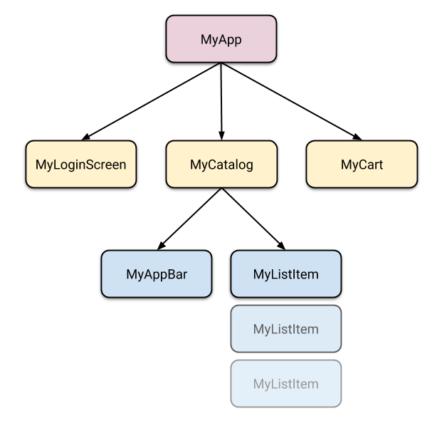

# 간단한 앱 상태 관리; Simple app state management

원문: [Flutter: Docs/Development/Data & backend/State management/Simple app sate management](https://flutter.dev/docs/development/data-and-backend/state-mgmt/simple)

## Contents

- [우리의 예제 (Out example)](#our_example)
- [상태를 위쪽으로 들어 올리기 (Lifting state up)](#lifting_state_up)
- [상태에 접근하기 (Accessing the state)](#accessing_the_state)
- [Model](#model)
- [ScopedModel](#scopedmodel)
- ScopedModelDescendant
  - [ScopedModel.of](#scopedmodelof)
- [함께 모아 놓기 (Putting it all together)](#putting-it-all-together)

이제 [선언적 UI 프로그래밍](https://flutter.dev/docs/development/data-and-backend/state-mgmt/declarative)과 [이페머럴 및 앱 상태](https : // flutter.dev/docs/development/data-and-backend/state-mgmt/ephemeral-vs-app)에 대해 배워으니 있으니, 간단한 앱 상태 관리에 대해 배울 준비가 되었습니다.

이 페이지에서 우리는 `scoped_model` 패키지를 사용할 것입니다. Flutter를 처음 사용하고 다른 접근 방식 (Redux, Rx, hooks 등)을 선택해야 하는 강력한 이유가 없는 경우 이 방법을 사용하는 것이 좋습니다. `scoped_model`은 이해하기 쉽고 많은 코드를 사용하지 않습니다. 또한 모든 다른 접근 방식에 적용 할 수 있는 개념을 사용합니다.

즉, 다른 React 프레임워크에서 상태 관리에 대한 배경 지식이 있는 경우 [다음 페이지](https://flutter.dev/docs/development/data-and-backend/state-mgmt/options)에 나열된 패키지 및 자습서를 찾을 수 있습니다.

<p id="out_example"/>


##  우리의 예제

 

예를 들어, 다음과 같은 간단한 응용 프로그램을 생각해 보겠습니다.

이 앱에는 로그인 프롬프트, 카탈로그 및 카트 (각각 `MyLoginScreen`, `MyCatalog` 및 `MyCart` 위젯으로 표시됨)의 세 가지 화면이 있습니다. 쇼핑 앱 일 수도 있지만 단순한 소셜 네트워킹 앱에서 동일한 구조를 상상할 수 있습니다 ('벽'에 대해 카탈로그 교체 및 '즐겨 찾기'에 대해 카트 교체; replace catalog for “wall” and cart for “favorites”; 에...?).

카탈로그 화면은 커스텀 앱 바(`MyAppBar`)와 많은 리스트 아이템 (`MyListItems`)의 스크롤링 뷰를 포함합니다.

위젯 트리로 시각화 된 앱은 다음과 같습니다.



그래서 우리는 `Wiget`이라는 하위 클래스가 적어도 6 개 있습니다. 그들 중 많은 것이 다른 곳에 "속해 있다"고 해야 할 것입니다. 예를 들어, 각 `MyListItem`은 카트에 추가 할 수 있기를 원할 것입니다. 또한 표시되는 항목이 이미 카트에 있는지 확인할 수도 있습니다.

이것은 우리에게 첫 질문을 줍니다: 우리는 카트의 현재 상태를 어디에 두어야 하는가?

<p id="lifting_state_up"/>


## 상태를 위쪽으로 들어 올리기 (Lifting state up)

Flutter에서는 상태를 사용하는 위젯 위에 상태를 유지하는 것이 좋습니다.

왜 그래야 할까요? Flutter와 같은 선언적 프레임워크에서 UI를 변경하려면 다시 작성해야합니다. `MyCart.updateWith(somethingNew)`를 사용하는 쉬운 방법은 없습니다. 다시 말해, 밖에서 메소드를 호출하여 위젯을 바꿔야 한다는 것은 어렵습니다. 당신이 이 작업을 할 수 있다고 해도, 프레임워크가 당신을 도와주지 못하고 프레임워크와 싸우게 할 것입니다.

```dart
// 나쁨: 이렇게 하지 마세요.
void myTapHandler() {
  var cartWidget = somehowGetMyCartWidget();
  cartWidget.updateWith(item);
}
```

위의 코드가 작동하더라도 다음 `MyCart` 위젯에서 다음을 처리해야 합니다.  

```dart
// 나쁨: 이렇게 하지 마세요.
Widget build(BuildContext context) {
  return SomeWidget(
    // 카트의 초기 상태입니다.
  );
}

void updateWith(Item item) {
  // 어쨌든 여기에서 UI를 변경해야합니다.
}
```

UI의 현재 상태를 고려하여 새 데이터를 적용해야합니다. 이런 식으로 버그를 피하기는 어렵습니다.

Flutter에서는 내용이 변경 될 때마다 새 위젯을 구성합니다. `MyCart.updateWith(somethingNew)`(메소드 호출) 대신 `MyCart(contents)`(생성자)를 사용합니다. 부모의 빌드 메소드에서만 새 위젯을 만들 수 있기 때문에 `contents`를 변경하려면 `MyCart`의 상위 또는 상위에 있어야 합니다.

```dart
// 좋음
void myTapHandler(BuildContext context) {
  var cartModel = somehowGetMyCartModel(context);
  cartModel.add(item);
}
```

이제 `MyCart`에는 UI의 모든 버전을 빌드하기 위한 코드 경로가 하나만 있습니다.

```dart
// 좋음
Widget build(BuildContext context) {
  var cartModel = somehowGetMyCartModel(context);
  return SomeWidget(
    // 카트의 현재 상태를 사용하여 UI를 한 번만 구성 합니다.
    // ···
  );
}
```

예를 들어, `contents`은 `MyApp`에 있어야 합니다. 변경 될 때마다 위에서부터 `MyCart`를 다시 만듭니다 (자세한 내용은 나중에 설명). 이 때문에 `MyCart`는 라이프 사이클에 대해 걱정할 필요가 없습니다. 단지 주어진 `content`에 대해 무엇을 보여줄지 선언 할뿐입니다. 변경되면 이전의 `MyCart` 위젯이 사라지고 완전히 새로운 것으로 교체됩니다.


위젯이 변경되지 않는다고 말하는 것은 이것을 의미합니다. **변경되지 않고 교체됩니다.**

이제 카트 상태를 어디에 두는 지 알았으므로 여기에 액세스하는 방법을 살펴 보겠습니다.

<p id = "accessing_the_state"/>

## 상태 접근 (Accessing the state)

사용자가 카탈로그의 항목 중 하나를 클릭하면 카트에 추가됩니다. 하지만 카트가 `MyListItem`위에 유지 되고 있는데 어떻게 해야 할까요?

간단한 옵션은 `MyListItem`이 클릭 할 때 호출 할 수 있는 콜백을 제공하는 것입니다. 다트의 함수는 일급 클래스 객체(First-class object)이므로 원하는 방식으로 전달할 수 있습니다. 그래서, `MyCatalog` 안에 다음과 같은 것을 넣을 수 있습니다:

```dart
@override
Widget build(BuildContext context) {
  return SomeWidget(
    // 위 메소드에 대한 참조를 전달하여 위젯을 구성합니다.
    MyListItem(myTapCallback),
  );
}

void myTapCallback(Item item) {
  print('user tapped on $item');
}
```

간단한 옵션은 `MyListItem`이 클릭 할 때 호출 할 수 있는 콜백을 제공하는 것입니다. Dart의 함수는 퍼스트 클래스 객체이므로 원하는 방식으로 전달할 수 있습니다. 그래서, `MyCatalog` 안에 다음과 같은 것을 넣을 수 있습니다.

다행스럽게도 Flutter에는 자손 위젯(즉, 자식들뿐만 아니라 아래에 있는 위젯)에 데이터 및 서비스를 제공하는 위젯 메커니즘이 있습니다. *모든 것은 위젯이다* 인 Flutter에서 기대할 수 있는 것처럼, 이 메커니즘은 단지 특별한 종류의 위젯들 (`InheritedWidget`, `InheritedNotifier`, `InheritedModel` 등) 일뿐입니다. 우리는 우리가 하려고 하는 것에 대해 약간 낮은 수준이기 때문에 여기에 포함시키지 않을 것입니다.

대신, 우리는 저수준 위젯과 함께 작동하지만 사용하기 쉬운 패키지를 사용할 것입니다. 그것은 `scoped_model`이라고합니다.

`scoped_model`을 사용하면 콜백이나`InheritedWidgets`에 대해 걱정할 필요가 없습니다. 하지만 3 가지 개념을 이해해야 합니다.

- `Model``
- ``ScopedModel`
- `ScopedModelDescendant`

<p id = "model"/>

##  Model

`scoped_model`에서 `Model`은 여러분의 앱 상태를 캡슐화합니다. 매우 간단한 응용 프로그램의 경우 하나의 모델만 있으면 됩니다. 복잡한 모델에는 여러 모델이 있습니다.

쇼핑 애플리케이션 예제에서, 우리는 `Model`에서 카트의 상태를 관리하려고 합니다. 모델을 확장하는 새로운 클래스를 만듭니다. 다음처럼:  

```dart
class CartModel extends Model {
  /// 카트의 Internal, private 상태
  final List<Item> _items = [];

  /// 카트에 있는 아이템의 수정 불가능한 뷰
  UnmodifiableListView<Item> get items => UnmodifiableListView(_items);

  /// 모든 항목의 현재 총 가격입니다 (모든 항목의 비용이 $1이라고 가정).
  int get totalPrice => _items.length;

  /// [item]을 카트에 추가합니다. 이것은 외부에서 카트를 수정할 수 있는 유일한 방법입니다.
  void add(Item item) {
    _items.add(item);
    // 이 호출은 Model에 의존하는 위젯을 재구성 해야 한다고 [Model]에게 알립니다.
    notifyListeners();
  }
}
```

`Model`에만 해당하는 유일한 코드는`notifyListeners()`를 호출 한 것입니다. `Model`이 앱의 UI를 변경할 수 있는 방식으로 변경 될 때마다 이 메소드를 호출합니다. `CartModel`의 다른 모든 것들은 `Model` 그 자체와 비즈니스 로직입니다.

 `Model`은 Flutter의 고수준 클래스에 의존하지 않으므로 쉽게 테스트 할 수 있습니다 ([위젯 테스팅](https://flutter.dev/docs/testing#widget-testing)을 사용 할 필요 조차 없습니다 ). 예를 들어 `CartModel`의 간단한 단위 테스트는 다음과 같습니다.

```dart
test('adding item increases total cost', () {
  final cart = CartModel();
  final startingPrice = cart.totalPrice;
  cart.addListener(() {
    expect(cart.totalPrice, greaterThan(startingPrice));
  });
  cart.add(Item('Dash'));
});
```

그러나 `Model`은 `scoped_model` 패키지의 나머지 부분과 함께 사용될 때 실제로 의미를 갖기 시작합니다.

<p id = "scopedmodel"/>


## ScopedModel

`ScopedModel`은 자손에게 `Model`의 인스턴스를 제공하는 위젯입니다.

우리는 그것을 어디에 두어야하는지 이미 알고 있습니다: 우리가 액세스할 위젯 위에 두어야 합니다. `CartModel`의 경우, 그것은 `MyCart`와 `MyCatalog` 둘다의 어딘가를 의미합니다.

`ScopedModel`을 필요 이상으로 높게 올려 놓고 싶지는 않습니다 (스코프를 오염시키고 싶지 않기 때문입니다). 그러나 우리의 경우, `MyCart`와 `MyCatalog` 모두 위에 있는 유일한 위젯은 `MyApp`입니다.

```dart
void main() {
  final cart = CartModel();

  // 선택적으로 여기 [cart]를 데이터베이스와 연결할 수 있습니다.

  runApp(
    ScopedModel<CartModel>(
      model: cart,
      child: MyApp(),
    ),
  );
}
```

`ScopedModel<CartModel>`( `ScopedModel` of `CartModel`로 읽음)을 생성하고 있음을 주목하세요. `scoped_model` 패키지는 올바른 모델을 찾기 위해 타입에 의존하며, `<CartModel>` 부분은 우리가 여기서 어떤 타입을 제공하고 있는지 명확히 합니다.

둘 이상의 모델을 제공하려면 `ScopedModels`를 중첩해야합니다.

```dart
ScopedModel<SomeOtherModel>(
  model: myOtherModel,
  child: ScopedModel<CartModel>(
    model: cart,
    child: MyApp(),
  ),
)
```

<p id = "scopedmodeldescendant"/>


##  ScopedModelDescendant

`CartModel`이 상단의 `ScopedModel<CartModel>`선언을 통해 우리의 app에 있는 위젯에 제공되었으므로 그것을 사용할 수 있습니다.

이것은 `ScopedModelDescendant` 위젯을 통해 이루어집니다.

```dart
return ScopedModelDescendant<CartModel>(
  builder: (context, child, cart) {
    return Text("Total price: ${cart.totalPrice}");
  },
);
```

우리는 액세스하고자 하는 모델의 타입을 지정해야 합니다. 이 경우, 우리는 `CartModel`을 원하기 때문에 `ScopedModelDescendant<CartModel>`을 사용할 것입니다. 당신이 제너릭 (`<CartModel>`)을 지정하지 않으면, `scoped_model` 패키지가 당신을 도울 수 없습니다. 위에서 언급했듯이, `scoped_model`은 타입을 기반으로하며 타입이 없으면 당신이 원하는 것을 알지 못합니다.

`ScopedModelDescendant` 위젯의 유일한 필수 인수는 빌더입니다. 빌더는 모델이 변경 될 때마다 호출되는 함수입니다. (즉, 모델에서 `notifyListeners()`를 호출하면 해당하는 모든 `ScopedModelDescendant` 위젯의 모든 빌더 메소드가 호출됩니다.)

빌더는 세 가지 속성으로 호출됩니다. 첫 번째 것은`context`이며 모든 빌드 메소드에도 포함됩니다.

두 번째 속성은 `child`이며, 최적화를 위해 존재합니다. 모델 변경시 *변경되지 않는* `ScopedModelDescendant` 아래에 큰 위젯 하위 트리가 있는 경우, 한 번 작성하여 빌더를 통해 가져올 수 있습니다.

```dart
return ScopedModelDescendant<CartModel>(
  builder: (context, child, cart) => Stack(
        children: [
          // 매번 다시 빌드하지 않고 여기에 SomeExpensiveWidget을 사용하십시오.
          child,
          Text("Total price: ${cart.totalPrice}"),
        ],
      ),
  // Build the expensive widget here.
  child: SomeExpensiveWidget(),
);
```

빌더 함수의 세 번째 인수는 모델입니다. 그것이 우리가 처음에 요구했던 것입니다. 모델의 데이터를 사용하여 주어진 시점에서 UI가 어떻게 표시되는지 정의 할 수 있습니다.

`ScopedModelDescendant` 위젯을 가능한 트리 깊숙한 곳에 두는 것이 가장 좋은 방법입니다. 어딘가의 세부 표현이 변경 되었기 때문에 UI의 상당 부분을 다시 빌드하고 싶지는 않을것 입니다.

```dart
// 이렇게 하지 마세요.
return ScopedModelDescendant<CartModel>(
  builder: (context, child, cart) {
    return HumongousWidget(
      // ...
      child: AnotherMonstrousWidget(
        // ...
        child: Text('Total price: ${cart.totalPrice}'),
      ),
    );
  },
);
```

대신에:  

```dart
// 이렇게 하세요
return HumongousWidget(
  // ...
  child: AnotherMonstrousWidget(
    // ...
    child: ScopedModelDescendant<CartModel>(
      builder: (context, child, cart) {
        return Text('Total price: ${cart.totalPrice}');
      },
    ),
  ),
);
```

<p id = "scopedmodelof)"/>


###  ScopedModel.of

때로는 UI를 변경하기 위해 모델에 *데이터*가 실제로 필요하지 않지만 여전히 액세스해야 합니다. 예를 들어, `ClearCart`버튼은 사용자가 장바구니에서 모든 것을 제거 할 수 있게 하려고 합니다. 장바구니의 내용을 표시 할 필요가 없으므로`clear()`메소드를 호출하면 됩니다.

우리는 `ScopedModelDescendant<CartModel>`을 사용할 수는 있지만 낭비가됩니다. 프레임워크에 다시 빌드 할 필요가 없는 위젯을 다시 빌드하도록 요청할 것입니다.

이 사용 사례의 경우 `ScopedModel.of`를 사용할 수 있습니다.

```dart
ScopedModel.of<CartModel>(context).add(item);
```

`notifyListeners`가 호출 될 때 빌드 메소드에서 위의 행을 사용하면 이 위젯이 다시 빌드되지 않습니다.

Note: `ScopedModelDescendant <CartModel>(builder: myBuilder, rebuildOnChange: false)` 를 사용할 수도 있지만, 길기 때문에 빌더 함수를 정의해야합니다.

<p id = "putting-it-all-together)"/>
##  함께 모아 놓기 (Putting it all together)

이 글에서 다루는 [chack out the example](https://github.com/filiph/samples/tree/scoped-model-shopper/model_shopper)가 가능합니다. 좀 더 간단한 것을 원한다면 [build with scoped model](https://github.com/flutter/samples/tree/master/scoped_model_counter)와 같은 간단한 카운터 앱의 모습을 볼 수 있습니다.

`scoped_model`을 가지고 실행할 준비가 되면, 먼저 `pubspec.yaml`에 의존성을 추가하는 것을 잊지 마십시오.

```yaml
name: my_name
description: Blah blah blah.

# ...

dependencies:
  flutter:
    sdk: flutter

  scoped_model: ^1.0.0

dev_dependencies:
  # ...
```

이제 당신은 `import 'package:scoped_model/scoped_model.dart';`를 하고 빌드할 수 있습니다.

- [이전: Differentiate between ephemeral state and app state](ephemeral_vs_app_state.md)

- [다음: List of state management approaches](https://flutter.dev/docs/development/data-and-backend/state-mgmt/options)

