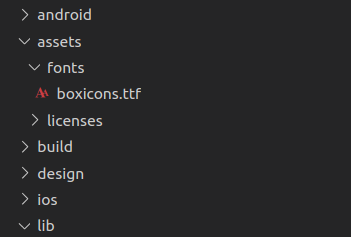

# Using boxicons in flutter

2019년 9월 3일 BoxIcons 버전 2.0.3

Flutter는 기본적으로 Material Icons을 제공합니다. Material Icon 내용은 [이곳](https://api.flutter.dev/flutter/material/Icons-class.html)에서 볼 수 있습니다.

그런데 Material Icons 만으로는 부족합니다. 아이콘을 새로 제작할 수 있지만 공개된 아이콘을 활용 할 수도 있습니다. CC 4.0와 MIT 라이센스로 제공되는 [BoxIcons](https://boxicons.com/)이 있습니다. 이 글은 Flutter에서 [BoxIcons](https://boxicons.com/)을 사용하는 방법을 안내 합니다.

먼저 [BoxIcons](https://boxicons.com/)에서 `boxicons.ttf` 파일을 다운로드 하고 Flutter 프로젝터의 `assets/fonts/boxicons.ttf`나 적당한 폴더에 넣습니다.

아래처럼 넣을 수도 있습니다.



그리고 `pubspec.yaml`을 편집하여 아래를  `boxicons.ttf`를 애셋에 포함합니다.

```yaml
# The following section is specific to Flutter.
flutter:

  fonts:
    - family: Boxicons
      fonts:
        - asset: assets/fonts/boxicons.ttf
          weight: 400
```

여기서 `- asset: `의 경로는 `boxicons.ttf` 파일의 경로와 일치해야 합니다. 

여기까지 하였으면 이제 Dart 코드에서 폰트들을 아이콘으로 가져 와야 합니다. 그런데, 유니코드를 사람이 기억하고 입력하기란 어렵습니다. 이것을 심볼화 해야 하는데요. [BoxIcons](https://boxicons.com/) 제작자들이 유니코드마다 이름을 주고 웹에서 사용할 수 있도록 [CSS 파일](https://github.com/atisawd/boxicons/blob/master/css/boxicons.css)에 넣어 놨습니다. 그런데, Flutter는 지원하지 않습니다.

그래서 CSS 파일을 파이썬으로 파싱하여 Dart 파일로 변환하는 작업을 하였습니다. 아래가 그 결과물입니다. 아래 소스 코드를 긁어가서 `boxicons.dart` 정도로 사용하시면 될 것입니다.

```dart
import 'package:flutter/material.dart';

class BoxIcons {
  static IconData adobe = const IconData(0xe900, fontFamily: 'Boxicons');
  static IconData algolia = const IconData(0xe901, fontFamily: 'Boxicons');
  static IconData audible = const IconData(0xe902, fontFamily: 'Boxicons');
  static IconData figma = const IconData(0xe903, fontFamily: 'Boxicons');
  static IconData redbubble = const IconData(0xe904, fontFamily: 'Boxicons');
  static IconData etsy = const IconData(0xe905, fontFamily: 'Boxicons');
  static IconData gitlab = const IconData(0xe906, fontFamily: 'Boxicons');
  static IconData patreon = const IconData(0xe907, fontFamily: 'Boxicons');
  static IconData facebook_circle = const IconData(0xe908, fontFamily: 'Boxicons');
  static IconData imdb = const IconData(0xe909, fontFamily: 'Boxicons');
  static IconData jquery = const IconData(0xe90a, fontFamily: 'Boxicons');
  static IconData pinterest_alt = const IconData(0xe90b, fontFamily: 'Boxicons');
  static IconData _500px = const IconData(0xe90c, fontFamily: 'Boxicons');
  static IconData airbnb = const IconData(0xe90d, fontFamily: 'Boxicons');
  static IconData amazon = const IconData(0xe90e, fontFamily: 'Boxicons');
  static IconData android = const IconData(0xe90f, fontFamily: 'Boxicons');
  static IconData angular = const IconData(0xe910, fontFamily: 'Boxicons');
  static IconData apple = const IconData(0xe911, fontFamily: 'Boxicons');
  static IconData baidu = const IconData(0xe912, fontFamily: 'Boxicons');
  static IconData behance = const IconData(0xe913, fontFamily: 'Boxicons');
  static IconData bing = const IconData(0xe914, fontFamily: 'Boxicons');
  static IconData bitcoin = const IconData(0xe915, fontFamily: 'Boxicons');
  static IconData blogger = const IconData(0xe916, fontFamily: 'Boxicons');
  static IconData bootstrap = const IconData(0xe917, fontFamily: 'Boxicons');
  static IconData chrome = const IconData(0xe918, fontFamily: 'Boxicons');
  static IconData codepen = const IconData(0xe919, fontFamily: 'Boxicons');
  static IconData creative_commons = const IconData(0xe91a, fontFamily: 'Boxicons');
  static IconData css3 = const IconData(0xe91b, fontFamily: 'Boxicons');
  static IconData dailymotion = const IconData(0xe91c, fontFamily: 'Boxicons');
  static IconData deviantart = const IconData(0xe91d, fontFamily: 'Boxicons');
  static IconData digg = const IconData(0xe91e, fontFamily: 'Boxicons');
  static IconData digitalocean = const IconData(0xe91f, fontFamily: 'Boxicons');
  static IconData discord = const IconData(0xe920, fontFamily: 'Boxicons');
  static IconData discourse = const IconData(0xe921, fontFamily: 'Boxicons');
  static IconData dribbble = const IconData(0xe922, fontFamily: 'Boxicons');
  static IconData dropbox = const IconData(0xe923, fontFamily: 'Boxicons');
  static IconData drupal = const IconData(0xe924, fontFamily: 'Boxicons');
  static IconData ebay = const IconData(0xe925, fontFamily: 'Boxicons');
  static IconData edge = const IconData(0xe926, fontFamily: 'Boxicons');
  static IconData facebook = const IconData(0xe927, fontFamily: 'Boxicons');
  static IconData facebook_square = const IconData(0xe928, fontFamily: 'Boxicons');
  static IconData firefox = const IconData(0xe929, fontFamily: 'Boxicons');
  static IconData flickr = const IconData(0xe92a, fontFamily: 'Boxicons');
  static IconData flickr_square = const IconData(0xe92b, fontFamily: 'Boxicons');
  static IconData foursquare = const IconData(0xe92c, fontFamily: 'Boxicons');
  static IconData git = const IconData(0xe92d, fontFamily: 'Boxicons');
  static IconData github = const IconData(0xe92e, fontFamily: 'Boxicons');
  static IconData google = const IconData(0xe92f, fontFamily: 'Boxicons');
  static IconData google_plus = const IconData(0xe930, fontFamily: 'Boxicons');
  static IconData google_plus_circle = const IconData(0xe931, fontFamily: 'Boxicons');
  static IconData html5 = const IconData(0xe932, fontFamily: 'Boxicons');
  static IconData instagram = const IconData(0xe933, fontFamily: 'Boxicons');
  static IconData instagram_alt = const IconData(0xe934, fontFamily: 'Boxicons');
  static IconData internet_explorer = const IconData(0xe935, fontFamily: 'Boxicons');
  static IconData invision = const IconData(0xe936, fontFamily: 'Boxicons');
  static IconData javascript = const IconData(0xe937, fontFamily: 'Boxicons');
  static IconData joomla = const IconData(0xe938, fontFamily: 'Boxicons');
  static IconData jsfiddle = const IconData(0xe939, fontFamily: 'Boxicons');
  static IconData kickstarter = const IconData(0xe93a, fontFamily: 'Boxicons');
  static IconData less = const IconData(0xe93b, fontFamily: 'Boxicons');
  static IconData linkedin = const IconData(0xe93c, fontFamily: 'Boxicons');
  static IconData linkedin_square = const IconData(0xe93d, fontFamily: 'Boxicons');
  static IconData magento = const IconData(0xe93e, fontFamily: 'Boxicons');
  static IconData mailchimp = const IconData(0xe93f, fontFamily: 'Boxicons');
  static IconData mastercard = const IconData(0xe940, fontFamily: 'Boxicons');
  static IconData medium = const IconData(0xe941, fontFamily: 'Boxicons');
  static IconData medium_old = const IconData(0xe942, fontFamily: 'Boxicons');
  static IconData medium_square = const IconData(0xe943, fontFamily: 'Boxicons');
  static IconData messenger = const IconData(0xe944, fontFamily: 'Boxicons');
  static IconData microsoft = const IconData(0xe945, fontFamily: 'Boxicons');
  static IconData nodejs = const IconData(0xe946, fontFamily: 'Boxicons');
  static IconData opera = const IconData(0xe947, fontFamily: 'Boxicons');
  static IconData paypal = const IconData(0xe948, fontFamily: 'Boxicons');
  static IconData periscope = const IconData(0xe949, fontFamily: 'Boxicons');
  static IconData pinterest = const IconData(0xe94a, fontFamily: 'Boxicons');
  static IconData play_store = const IconData(0xe94b, fontFamily: 'Boxicons');
  static IconData pocket = const IconData(0xe94c, fontFamily: 'Boxicons');
  static IconData product_hunt = const IconData(0xe94d, fontFamily: 'Boxicons');
  static IconData quora = const IconData(0xe94e, fontFamily: 'Boxicons');
  static IconData react = const IconData(0xe94f, fontFamily: 'Boxicons');
  static IconData reddit = const IconData(0xe950, fontFamily: 'Boxicons');
  static IconData redux = const IconData(0xe951, fontFamily: 'Boxicons');
  static IconData sass = const IconData(0xe952, fontFamily: 'Boxicons');
  static IconData shopify = const IconData(0xe953, fontFamily: 'Boxicons');
  static IconData skype = const IconData(0xe954, fontFamily: 'Boxicons');
  static IconData slack = const IconData(0xe955, fontFamily: 'Boxicons');
  static IconData slack_old = const IconData(0xe956, fontFamily: 'Boxicons');
  static IconData snapchat = const IconData(0xe957, fontFamily: 'Boxicons');
  static IconData soundcloud = const IconData(0xe958, fontFamily: 'Boxicons');
  static IconData spotify = const IconData(0xe959, fontFamily: 'Boxicons');
  static IconData squarespace = const IconData(0xe95a, fontFamily: 'Boxicons');
  static IconData stack_overflow = const IconData(0xe95b, fontFamily: 'Boxicons');
  static IconData stripe = const IconData(0xe95c, fontFamily: 'Boxicons');
  static IconData telegram = const IconData(0xe95d, fontFamily: 'Boxicons');
  static IconData trello = const IconData(0xe95e, fontFamily: 'Boxicons');
  static IconData tumblr = const IconData(0xe95f, fontFamily: 'Boxicons');
  static IconData twitch = const IconData(0xe960, fontFamily: 'Boxicons');
  static IconData twitter = const IconData(0xe961, fontFamily: 'Boxicons');
  static IconData unsplash = const IconData(0xe962, fontFamily: 'Boxicons');
  static IconData vimeo = const IconData(0xe963, fontFamily: 'Boxicons');
  static IconData visa = const IconData(0xe964, fontFamily: 'Boxicons');
  static IconData vk = const IconData(0xe965, fontFamily: 'Boxicons');
  static IconData vuejs = const IconData(0xe966, fontFamily: 'Boxicons');
  static IconData whatsapp = const IconData(0xe967, fontFamily: 'Boxicons');
  static IconData whatsapp_square = const IconData(0xe968, fontFamily: 'Boxicons');
  static IconData wikipedia = const IconData(0xe969, fontFamily: 'Boxicons');
  static IconData windows = const IconData(0xe96a, fontFamily: 'Boxicons');
  static IconData wix = const IconData(0xe96b, fontFamily: 'Boxicons');
  static IconData wordpress = const IconData(0xe96c, fontFamily: 'Boxicons');
  static IconData yahoo = const IconData(0xe96d, fontFamily: 'Boxicons');
  static IconData yelp = const IconData(0xe96e, fontFamily: 'Boxicons');
  static IconData youtube = const IconData(0xe96f, fontFamily: 'Boxicons');
  static IconData bx_accessibility = const IconData(0xe970, fontFamily: 'Boxicons');
  static IconData bx_add_to_queue = const IconData(0xe971, fontFamily: 'Boxicons');
  static IconData bx_adjust = const IconData(0xe972, fontFamily: 'Boxicons');
  static IconData bx_alarm = const IconData(0xe973, fontFamily: 'Boxicons');
  static IconData bx_alarm_add = const IconData(0xe974, fontFamily: 'Boxicons');
  static IconData bx_alarm_off = const IconData(0xe975, fontFamily: 'Boxicons');
  static IconData bx_album = const IconData(0xe976, fontFamily: 'Boxicons');
  static IconData bx_align_justify = const IconData(0xe977, fontFamily: 'Boxicons');
  static IconData bx_align_left = const IconData(0xe978, fontFamily: 'Boxicons');
  static IconData bx_align_middle = const IconData(0xe979, fontFamily: 'Boxicons');
  static IconData bx_align_right = const IconData(0xe97a, fontFamily: 'Boxicons');
  static IconData bx_analyse = const IconData(0xe97b, fontFamily: 'Boxicons');
  static IconData bx_anchor = const IconData(0xe97c, fontFamily: 'Boxicons');
  static IconData bx_angry = const IconData(0xe97d, fontFamily: 'Boxicons');
  static IconData bx_aperture = const IconData(0xe97e, fontFamily: 'Boxicons');
  static IconData bx_archive = const IconData(0xe97f, fontFamily: 'Boxicons');
  static IconData bx_archive_in = const IconData(0xe980, fontFamily: 'Boxicons');
  static IconData bx_archive_out = const IconData(0xe981, fontFamily: 'Boxicons');
  static IconData bx_area = const IconData(0xe982, fontFamily: 'Boxicons');
  static IconData bx_arrow_back = const IconData(0xe983, fontFamily: 'Boxicons');
  static IconData bx_at = const IconData(0xe984, fontFamily: 'Boxicons');
  static IconData bx_award = const IconData(0xe985, fontFamily: 'Boxicons');
  static IconData bx_badge = const IconData(0xe986, fontFamily: 'Boxicons');
  static IconData bx_badge_check = const IconData(0xe987, fontFamily: 'Boxicons');
  static IconData bx_ball = const IconData(0xe988, fontFamily: 'Boxicons');
  static IconData bx_band_aid = const IconData(0xe989, fontFamily: 'Boxicons');
  static IconData bx_bar_chart = const IconData(0xe98a, fontFamily: 'Boxicons');
  static IconData bx_bar_chart_alt = const IconData(0xe98b, fontFamily: 'Boxicons');
  static IconData bx_bar_chart_alt_2 = const IconData(0xe98c, fontFamily: 'Boxicons');
  static IconData bx_bar_chart_square = const IconData(0xe98d, fontFamily: 'Boxicons');
  static IconData bx_barcode = const IconData(0xe98e, fontFamily: 'Boxicons');
  static IconData bx_basket = const IconData(0xe98f, fontFamily: 'Boxicons');
  static IconData bx_basketball = const IconData(0xe990, fontFamily: 'Boxicons');
  static IconData bx_bath = const IconData(0xe991, fontFamily: 'Boxicons');
  static IconData bx_battery = const IconData(0xe992, fontFamily: 'Boxicons');
  static IconData bx_bed = const IconData(0xe993, fontFamily: 'Boxicons');
  static IconData bx_bell = const IconData(0xe994, fontFamily: 'Boxicons');
  static IconData bx_bell_minus = const IconData(0xe995, fontFamily: 'Boxicons');
  static IconData bx_bell_off = const IconData(0xe996, fontFamily: 'Boxicons');
  static IconData bx_bell_plus = const IconData(0xe997, fontFamily: 'Boxicons');
  static IconData bx_bitcoin = const IconData(0xe998, fontFamily: 'Boxicons');
  static IconData bx_block = const IconData(0xe999, fontFamily: 'Boxicons');
  static IconData bx_bluetooth = const IconData(0xe99a, fontFamily: 'Boxicons');
  static IconData bx_body = const IconData(0xe99b, fontFamily: 'Boxicons');
  static IconData bx_bold = const IconData(0xe99c, fontFamily: 'Boxicons');
  static IconData bx_bolt_circle = const IconData(0xe99d, fontFamily: 'Boxicons');
  static IconData bx_book = const IconData(0xe99e, fontFamily: 'Boxicons');
  static IconData bx_book_bookmark = const IconData(0xe99f, fontFamily: 'Boxicons');
  static IconData bx_book_content = const IconData(0xe9a0, fontFamily: 'Boxicons');
  static IconData bx_bookmark = const IconData(0xe9a1, fontFamily: 'Boxicons');
  static IconData bx_bookmark_minus = const IconData(0xe9a2, fontFamily: 'Boxicons');
  static IconData bx_bookmark_plus = const IconData(0xe9a3, fontFamily: 'Boxicons');
  static IconData bx_bookmarks = const IconData(0xe9a4, fontFamily: 'Boxicons');
  static IconData bx_book_open = const IconData(0xe9a5, fontFamily: 'Boxicons');
  static IconData bx_border_all = const IconData(0xe9a6, fontFamily: 'Boxicons');
  static IconData bx_border_bottom = const IconData(0xe9a7, fontFamily: 'Boxicons');
  static IconData bx_border_left = const IconData(0xe9a8, fontFamily: 'Boxicons');
  static IconData bx_border_radius = const IconData(0xe9a9, fontFamily: 'Boxicons');
  static IconData bx_border_right = const IconData(0xe9aa, fontFamily: 'Boxicons');
  static IconData bx_border_top = const IconData(0xe9ab, fontFamily: 'Boxicons');
  static IconData bx_bot = const IconData(0xe9ac, fontFamily: 'Boxicons');
  static IconData bx_bowling_ball = const IconData(0xe9ad, fontFamily: 'Boxicons');
  static IconData bx_box = const IconData(0xe9ae, fontFamily: 'Boxicons');
  static IconData bx_briefcase = const IconData(0xe9af, fontFamily: 'Boxicons');
  static IconData bx_briefcase_alt = const IconData(0xe9b0, fontFamily: 'Boxicons');
  static IconData bx_briefcase_alt_2 = const IconData(0xe9b1, fontFamily: 'Boxicons');
  static IconData bx_brightness = const IconData(0xe9b2, fontFamily: 'Boxicons');
  static IconData bx_brightness_half = const IconData(0xe9b3, fontFamily: 'Boxicons');
  static IconData bx_broadcast = const IconData(0xe9b4, fontFamily: 'Boxicons');
  static IconData bx_brush = const IconData(0xe9b5, fontFamily: 'Boxicons');
  static IconData bx_brush_alt = const IconData(0xe9b6, fontFamily: 'Boxicons');
  static IconData bx_bug = const IconData(0xe9b7, fontFamily: 'Boxicons');
  static IconData bx_bug_alt = const IconData(0xe9b8, fontFamily: 'Boxicons');
  static IconData bx_building = const IconData(0xe9b9, fontFamily: 'Boxicons');
  static IconData bx_building_house = const IconData(0xe9ba, fontFamily: 'Boxicons');
  static IconData bx_buildings = const IconData(0xe9bb, fontFamily: 'Boxicons');
  static IconData bx_bulb = const IconData(0xe9bc, fontFamily: 'Boxicons');
  static IconData bx_bullseye = const IconData(0xe9bd, fontFamily: 'Boxicons');
  static IconData bx_buoy = const IconData(0xe9be, fontFamily: 'Boxicons');
  static IconData bx_bus = const IconData(0xe9bf, fontFamily: 'Boxicons');
  static IconData bx_cake = const IconData(0xe9c0, fontFamily: 'Boxicons');
  static IconData bx_calculator = const IconData(0xe9c1, fontFamily: 'Boxicons');
  static IconData bx_calendar = const IconData(0xe9c2, fontFamily: 'Boxicons');
  static IconData bx_calendar_alt = const IconData(0xe9c3, fontFamily: 'Boxicons');
  static IconData bx_calendar_check = const IconData(0xe9c4, fontFamily: 'Boxicons');
  static IconData bx_calendar_event = const IconData(0xe9c5, fontFamily: 'Boxicons');
  static IconData bx_calendar_minus = const IconData(0xe9c6, fontFamily: 'Boxicons');
  static IconData bx_calendar_plus = const IconData(0xe9c7, fontFamily: 'Boxicons');
  static IconData bx_calendar_x = const IconData(0xe9c8, fontFamily: 'Boxicons');
  static IconData bx_camera = const IconData(0xe9c9, fontFamily: 'Boxicons');
  static IconData bx_camera_off = const IconData(0xe9ca, fontFamily: 'Boxicons');
  static IconData bx_captions = const IconData(0xe9cb, fontFamily: 'Boxicons');
  static IconData bx_car = const IconData(0xe9cc, fontFamily: 'Boxicons');
  static IconData bx_card = const IconData(0xe9cd, fontFamily: 'Boxicons');
  static IconData bx_caret_down = const IconData(0xe9ce, fontFamily: 'Boxicons');
  static IconData bx_caret_left = const IconData(0xe9cf, fontFamily: 'Boxicons');
  static IconData bx_caret_right = const IconData(0xe9d0, fontFamily: 'Boxicons');
  static IconData bx_caret_up = const IconData(0xe9d1, fontFamily: 'Boxicons');
  static IconData bx_carousel = const IconData(0xe9d2, fontFamily: 'Boxicons');
  static IconData bx_cart = const IconData(0xe9d3, fontFamily: 'Boxicons');
  static IconData bx_cart_alt = const IconData(0xe9d4, fontFamily: 'Boxicons');
  static IconData bx_cast = const IconData(0xe9d5, fontFamily: 'Boxicons');
  static IconData bx_certification = const IconData(0xe9d6, fontFamily: 'Boxicons');
  static IconData bx_chalkboard = const IconData(0xe9d7, fontFamily: 'Boxicons');
  static IconData bx_chart = const IconData(0xe9d8, fontFamily: 'Boxicons');
  static IconData bx_chat = const IconData(0xe9d9, fontFamily: 'Boxicons');
  static IconData bx_check = const IconData(0xe9da, fontFamily: 'Boxicons');
  static IconData bx_checkbox = const IconData(0xe9db, fontFamily: 'Boxicons');
  static IconData bx_checkbox_checked = const IconData(0xe9dc, fontFamily: 'Boxicons');
  static IconData bx_checkbox_square = const IconData(0xe9dd, fontFamily: 'Boxicons');
  static IconData bx_check_circle = const IconData(0xe9de, fontFamily: 'Boxicons');
  static IconData bx_check_double = const IconData(0xe9df, fontFamily: 'Boxicons');
  static IconData bx_check_shield = const IconData(0xe9e0, fontFamily: 'Boxicons');
  static IconData bx_check_square = const IconData(0xe9e1, fontFamily: 'Boxicons');
  static IconData bx_chevron_down = const IconData(0xe9e2, fontFamily: 'Boxicons');
  static IconData bx_chevron_left = const IconData(0xe9e3, fontFamily: 'Boxicons');
  static IconData bx_chevron_right = const IconData(0xe9e4, fontFamily: 'Boxicons');
  static IconData bx_chevrons_down = const IconData(0xe9e5, fontFamily: 'Boxicons');
  static IconData bx_chevrons_left = const IconData(0xe9e6, fontFamily: 'Boxicons');
  static IconData bx_chevrons_right = const IconData(0xe9e7, fontFamily: 'Boxicons');
  static IconData bx_chevrons_up = const IconData(0xe9e8, fontFamily: 'Boxicons');
  static IconData bx_chevron_up = const IconData(0xe9e9, fontFamily: 'Boxicons');
  static IconData bx_chip = const IconData(0xe9ea, fontFamily: 'Boxicons');
  static IconData bx_circle = const IconData(0xe9eb, fontFamily: 'Boxicons');
  static IconData bx_clinic = const IconData(0xe9ec, fontFamily: 'Boxicons');
  static IconData bx_clipboard = const IconData(0xe9ed, fontFamily: 'Boxicons');
  static IconData bx_closet = const IconData(0xe9ee, fontFamily: 'Boxicons');
  static IconData bx_cloud = const IconData(0xe9ef, fontFamily: 'Boxicons');
  static IconData bx_cloud_download = const IconData(0xe9f0, fontFamily: 'Boxicons');
  static IconData bx_cloud_drizzle = const IconData(0xe9f1, fontFamily: 'Boxicons');
  static IconData bx_cloud_lightning = const IconData(0xe9f2, fontFamily: 'Boxicons');
  static IconData bx_cloud_light_rain = const IconData(0xe9f3, fontFamily: 'Boxicons');
  static IconData bx_cloud_rain = const IconData(0xe9f4, fontFamily: 'Boxicons');
  static IconData bx_cloud_snow = const IconData(0xe9f5, fontFamily: 'Boxicons');
  static IconData bx_cloud_upload = const IconData(0xe9f6, fontFamily: 'Boxicons');
  static IconData bx_code = const IconData(0xe9f7, fontFamily: 'Boxicons');
  static IconData bx_code_alt = const IconData(0xe9f8, fontFamily: 'Boxicons');
  static IconData bx_code_block = const IconData(0xe9f9, fontFamily: 'Boxicons');
  static IconData bx_code_curly = const IconData(0xe9fa, fontFamily: 'Boxicons');
  static IconData bx_coffee = const IconData(0xe9fb, fontFamily: 'Boxicons');
  static IconData bx_cog = const IconData(0xe9fc, fontFamily: 'Boxicons');
  static IconData bx_collapse = const IconData(0xe9fd, fontFamily: 'Boxicons');
  static IconData bx_collection = const IconData(0xe9fe, fontFamily: 'Boxicons');
  static IconData bx_columns = const IconData(0xe9ff, fontFamily: 'Boxicons');
  static IconData bx_command = const IconData(0xea00, fontFamily: 'Boxicons');
  static IconData bx_comment = const IconData(0xea01, fontFamily: 'Boxicons');
  static IconData bx_comment_dots = const IconData(0xea02, fontFamily: 'Boxicons');
  static IconData bx_compass = const IconData(0xea03, fontFamily: 'Boxicons');
  static IconData bx_confused = const IconData(0xea04, fontFamily: 'Boxicons');
  static IconData bx_conversation = const IconData(0xea05, fontFamily: 'Boxicons');
  static IconData bx_cool = const IconData(0xea06, fontFamily: 'Boxicons');
  static IconData bx_copy = const IconData(0xea07, fontFamily: 'Boxicons');
  static IconData bx_copy_alt = const IconData(0xea08, fontFamily: 'Boxicons');
  static IconData bx_copyright = const IconData(0xea09, fontFamily: 'Boxicons');
  static IconData bx_credit_card = const IconData(0xea0a, fontFamily: 'Boxicons');
  static IconData bx_credit_card_alt = const IconData(0xea0b, fontFamily: 'Boxicons');
  static IconData bx_crop = const IconData(0xea0c, fontFamily: 'Boxicons');
  static IconData bx_crosshair = const IconData(0xea0d, fontFamily: 'Boxicons');
  static IconData bx_crown = const IconData(0xea0e, fontFamily: 'Boxicons');
  static IconData bx_cube = const IconData(0xea0f, fontFamily: 'Boxicons');
  static IconData bx_cube_alt = const IconData(0xea10, fontFamily: 'Boxicons');
  static IconData bx_cuboid = const IconData(0xea11, fontFamily: 'Boxicons');
  static IconData bx_customize = const IconData(0xea12, fontFamily: 'Boxicons');
  static IconData bx_cut = const IconData(0xea13, fontFamily: 'Boxicons');
  static IconData bx_cycling = const IconData(0xea14, fontFamily: 'Boxicons');
  static IconData bx_cylinder = const IconData(0xea15, fontFamily: 'Boxicons');
  static IconData bx_data = const IconData(0xea16, fontFamily: 'Boxicons');
  static IconData bx_desktop = const IconData(0xea17, fontFamily: 'Boxicons');
  static IconData bx_detail = const IconData(0xea18, fontFamily: 'Boxicons');
  static IconData bx_devices = const IconData(0xea19, fontFamily: 'Boxicons');
  static IconData bx_dialpad = const IconData(0xea1a, fontFamily: 'Boxicons');
  static IconData bx_dialpad_alt = const IconData(0xea1b, fontFamily: 'Boxicons');
  static IconData bx_diamond = const IconData(0xea1c, fontFamily: 'Boxicons');
  static IconData bx_directions = const IconData(0xea1d, fontFamily: 'Boxicons');
  static IconData bx_disc = const IconData(0xea1e, fontFamily: 'Boxicons');
  static IconData bx_dish = const IconData(0xea1f, fontFamily: 'Boxicons');
  static IconData bx_dislike = const IconData(0xea20, fontFamily: 'Boxicons');
  static IconData bx_dizzy = const IconData(0xea21, fontFamily: 'Boxicons');
  static IconData bx_dna = const IconData(0xea22, fontFamily: 'Boxicons');
  static IconData bx_dock_bottom = const IconData(0xea23, fontFamily: 'Boxicons');
  static IconData bx_dock_left = const IconData(0xea24, fontFamily: 'Boxicons');
  static IconData bx_dock_right = const IconData(0xea25, fontFamily: 'Boxicons');
  static IconData bx_dock_top = const IconData(0xea26, fontFamily: 'Boxicons');
  static IconData bx_dollar = const IconData(0xea27, fontFamily: 'Boxicons');
  static IconData bx_dollar_circle = const IconData(0xea28, fontFamily: 'Boxicons');
  static IconData bx_dots_horizontal = const IconData(0xea29, fontFamily: 'Boxicons');
  static IconData bx_dots_horizontal_rounded = const IconData(0xea2a, fontFamily: 'Boxicons');
  static IconData bx_dots_vertical = const IconData(0xea2b, fontFamily: 'Boxicons');
  static IconData bx_dots_vertical_rounded = const IconData(0xea2c, fontFamily: 'Boxicons');
  static IconData bx_doughnut_chart = const IconData(0xea2d, fontFamily: 'Boxicons');
  static IconData bx_down_arrow = const IconData(0xea2e, fontFamily: 'Boxicons');
  static IconData bx_down_arrow_alt = const IconData(0xea2f, fontFamily: 'Boxicons');
  static IconData bx_down_arrow_circle = const IconData(0xea30, fontFamily: 'Boxicons');
  static IconData bx_download = const IconData(0xea31, fontFamily: 'Boxicons');
  static IconData bx_downvote = const IconData(0xea32, fontFamily: 'Boxicons');
  static IconData bx_droplet = const IconData(0xea33, fontFamily: 'Boxicons');
  static IconData bx_dumbbell = const IconData(0xea34, fontFamily: 'Boxicons');
  static IconData bx_duplicate = const IconData(0xea35, fontFamily: 'Boxicons');
  static IconData bx_edit = const IconData(0xea36, fontFamily: 'Boxicons');
  static IconData bx_edit_alt = const IconData(0xea37, fontFamily: 'Boxicons');
  static IconData bx_envelope = const IconData(0xea38, fontFamily: 'Boxicons');
  static IconData bx_equalizer = const IconData(0xea39, fontFamily: 'Boxicons');
  static IconData bx_error = const IconData(0xea3a, fontFamily: 'Boxicons');
  static IconData bx_error_alt = const IconData(0xea3b, fontFamily: 'Boxicons');
  static IconData bx_error_circle = const IconData(0xea3c, fontFamily: 'Boxicons');
  static IconData bx_euro = const IconData(0xea3d, fontFamily: 'Boxicons');
  static IconData bx_exit = const IconData(0xea3e, fontFamily: 'Boxicons');
  static IconData bx_exit_fullscreen = const IconData(0xea3f, fontFamily: 'Boxicons');
  static IconData bx_expand = const IconData(0xea40, fontFamily: 'Boxicons');
  static IconData bx_export = const IconData(0xea41, fontFamily: 'Boxicons');
  static IconData bx_extension = const IconData(0xea42, fontFamily: 'Boxicons');
  static IconData bx_face = const IconData(0xea43, fontFamily: 'Boxicons');
  static IconData bx_fast_forward = const IconData(0xea44, fontFamily: 'Boxicons');
  static IconData bx_fast_forward_circle = const IconData(0xea45, fontFamily: 'Boxicons');
  static IconData bx_female = const IconData(0xea46, fontFamily: 'Boxicons');
  static IconData bx_female_sign = const IconData(0xea47, fontFamily: 'Boxicons');
  static IconData bx_file = const IconData(0xea48, fontFamily: 'Boxicons');
  static IconData bx_file_blank = const IconData(0xea49, fontFamily: 'Boxicons');
  static IconData bx_file_find = const IconData(0xea4a, fontFamily: 'Boxicons');
  static IconData bx_film = const IconData(0xea4b, fontFamily: 'Boxicons');
  static IconData bx_filter = const IconData(0xea4c, fontFamily: 'Boxicons');
  static IconData bx_filter_alt = const IconData(0xea4d, fontFamily: 'Boxicons');
  static IconData bx_fingerprint = const IconData(0xea4e, fontFamily: 'Boxicons');
  static IconData bx_first_aid = const IconData(0xea4f, fontFamily: 'Boxicons');
  static IconData bx_first_page = const IconData(0xea50, fontFamily: 'Boxicons');
  static IconData bx_flag = const IconData(0xea51, fontFamily: 'Boxicons');
  static IconData bx_folder = const IconData(0xea52, fontFamily: 'Boxicons');
  static IconData bx_folder_minus = const IconData(0xea53, fontFamily: 'Boxicons');
  static IconData bx_folder_open = const IconData(0xea54, fontFamily: 'Boxicons');
  static IconData bx_folder_plus = const IconData(0xea55, fontFamily: 'Boxicons');
  static IconData bx_font = const IconData(0xea56, fontFamily: 'Boxicons');
  static IconData bx_font_color = const IconData(0xea57, fontFamily: 'Boxicons');
  static IconData bx_font_family = const IconData(0xea58, fontFamily: 'Boxicons');
  static IconData bx_font_size = const IconData(0xea59, fontFamily: 'Boxicons');
  static IconData bx_food_menu = const IconData(0xea5a, fontFamily: 'Boxicons');
  static IconData bx_food_tag = const IconData(0xea5b, fontFamily: 'Boxicons');
  static IconData bx_football = const IconData(0xea5c, fontFamily: 'Boxicons');
  static IconData bx_fridge = const IconData(0xea5d, fontFamily: 'Boxicons');
  static IconData bx_fullscreen = const IconData(0xea5e, fontFamily: 'Boxicons');
  static IconData bx_gas_pump = const IconData(0xea5f, fontFamily: 'Boxicons');
  static IconData bx_ghost = const IconData(0xea60, fontFamily: 'Boxicons');
  static IconData bx_gift = const IconData(0xea61, fontFamily: 'Boxicons');
  static IconData bx_git_branch = const IconData(0xea62, fontFamily: 'Boxicons');
  static IconData bx_git_commit = const IconData(0xea63, fontFamily: 'Boxicons');
  static IconData bx_git_compare = const IconData(0xea64, fontFamily: 'Boxicons');
  static IconData bx_git_merge = const IconData(0xea65, fontFamily: 'Boxicons');
  static IconData bx_git_pull_request = const IconData(0xea66, fontFamily: 'Boxicons');
  static IconData bx_git_repo_forked = const IconData(0xea67, fontFamily: 'Boxicons');
  static IconData bx_globe = const IconData(0xea68, fontFamily: 'Boxicons');
  static IconData bx_globe_alt = const IconData(0xea69, fontFamily: 'Boxicons');
  static IconData bx_grid = const IconData(0xea6a, fontFamily: 'Boxicons');
  static IconData bx_grid_alt = const IconData(0xea6b, fontFamily: 'Boxicons');
  static IconData bx_grid_horizontal = const IconData(0xea6c, fontFamily: 'Boxicons');
  static IconData bx_grid_small = const IconData(0xea6d, fontFamily: 'Boxicons');
  static IconData bx_grid_vertical = const IconData(0xea6e, fontFamily: 'Boxicons');
  static IconData bx_group = const IconData(0xea6f, fontFamily: 'Boxicons');
  static IconData bx_handicap = const IconData(0xea70, fontFamily: 'Boxicons');
  static IconData bx_happy = const IconData(0xea71, fontFamily: 'Boxicons');
  static IconData bx_happy_alt = const IconData(0xea72, fontFamily: 'Boxicons');
  static IconData bx_happy_beaming = const IconData(0xea73, fontFamily: 'Boxicons');
  static IconData bx_happy_heart_eyes = const IconData(0xea74, fontFamily: 'Boxicons');
  static IconData bx_hash = const IconData(0xea75, fontFamily: 'Boxicons');
  static IconData bx_hdd = const IconData(0xea76, fontFamily: 'Boxicons');
  static IconData bx_heading = const IconData(0xea77, fontFamily: 'Boxicons');
  static IconData bx_headphone = const IconData(0xea78, fontFamily: 'Boxicons');
  static IconData bx_health = const IconData(0xea79, fontFamily: 'Boxicons');
  static IconData bx_heart = const IconData(0xea7a, fontFamily: 'Boxicons');
  static IconData bx_help_circle = const IconData(0xea7b, fontFamily: 'Boxicons');
  static IconData bx_hide = const IconData(0xea7c, fontFamily: 'Boxicons');
  static IconData bx_highlight = const IconData(0xea7d, fontFamily: 'Boxicons');
  static IconData bx_history = const IconData(0xea7e, fontFamily: 'Boxicons');
  static IconData bx_hive = const IconData(0xea7f, fontFamily: 'Boxicons');
  static IconData bx_home = const IconData(0xea80, fontFamily: 'Boxicons');
  static IconData bx_home_alt = const IconData(0xea81, fontFamily: 'Boxicons');
  static IconData bx_home_circle = const IconData(0xea82, fontFamily: 'Boxicons');
  static IconData bx_horizontal_center = const IconData(0xea83, fontFamily: 'Boxicons');
  static IconData bx_hotel = const IconData(0xea84, fontFamily: 'Boxicons');
  static IconData bx_hourglass = const IconData(0xea85, fontFamily: 'Boxicons');
  static IconData bx_id_card = const IconData(0xea86, fontFamily: 'Boxicons');
  static IconData bx_image = const IconData(0xea87, fontFamily: 'Boxicons');
  static IconData bx_image_add = const IconData(0xea88, fontFamily: 'Boxicons');
  static IconData bx_image_alt = const IconData(0xea89, fontFamily: 'Boxicons');
  static IconData bx_images = const IconData(0xea8a, fontFamily: 'Boxicons');
  static IconData bx_import = const IconData(0xea8b, fontFamily: 'Boxicons');
  static IconData bx_infinite = const IconData(0xea8c, fontFamily: 'Boxicons');
  static IconData bx_info_circle = const IconData(0xea8d, fontFamily: 'Boxicons');
  static IconData bx_italic = const IconData(0xea8e, fontFamily: 'Boxicons');
  static IconData bx_joystick = const IconData(0xea8f, fontFamily: 'Boxicons');
  static IconData bx_joystick_alt = const IconData(0xea90, fontFamily: 'Boxicons');
  static IconData bx_joystick_button = const IconData(0xea91, fontFamily: 'Boxicons');
  static IconData bx_key = const IconData(0xea92, fontFamily: 'Boxicons');
  static IconData bx_label = const IconData(0xea93, fontFamily: 'Boxicons');
  static IconData bx_landscape = const IconData(0xea94, fontFamily: 'Boxicons');
  static IconData bx_laptop = const IconData(0xea95, fontFamily: 'Boxicons');
  static IconData bx_last_page = const IconData(0xea96, fontFamily: 'Boxicons');
  static IconData bx_laugh = const IconData(0xea97, fontFamily: 'Boxicons');
  static IconData bx_layer = const IconData(0xea98, fontFamily: 'Boxicons');
  static IconData bx_layout = const IconData(0xea99, fontFamily: 'Boxicons');
  static IconData bx_left_arrow = const IconData(0xea9a, fontFamily: 'Boxicons');
  static IconData bx_left_arrow_alt = const IconData(0xea9b, fontFamily: 'Boxicons');
  static IconData bx_left_arrow_circle = const IconData(0xea9c, fontFamily: 'Boxicons');
  static IconData bx_left_down_arrow_circle = const IconData(0xea9d, fontFamily: 'Boxicons');
  static IconData bx_left_indent = const IconData(0xea9e, fontFamily: 'Boxicons');
  static IconData bx_left_top_arrow_circle = const IconData(0xea9f, fontFamily: 'Boxicons');
  static IconData bx_like = const IconData(0xeaa0, fontFamily: 'Boxicons');
  static IconData bx_line_chart = const IconData(0xeaa1, fontFamily: 'Boxicons');
  static IconData bx_link = const IconData(0xeaa2, fontFamily: 'Boxicons');
  static IconData bx_link_alt = const IconData(0xeaa3, fontFamily: 'Boxicons');
  static IconData bx_link_external = const IconData(0xeaa4, fontFamily: 'Boxicons');
  static IconData bx_lira = const IconData(0xeaa5, fontFamily: 'Boxicons');
  static IconData bx_list_check = const IconData(0xeaa6, fontFamily: 'Boxicons');
  static IconData bx_list_minus = const IconData(0xeaa7, fontFamily: 'Boxicons');
  static IconData bx_list_ol = const IconData(0xeaa8, fontFamily: 'Boxicons');
  static IconData bx_list_plus = const IconData(0xeaa9, fontFamily: 'Boxicons');
  static IconData bx_list_ul = const IconData(0xeaaa, fontFamily: 'Boxicons');
  static IconData bx_loader = const IconData(0xeaab, fontFamily: 'Boxicons');
  static IconData bx_loader_alt = const IconData(0xeaac, fontFamily: 'Boxicons');
  static IconData bx_loader_circle = const IconData(0xeaad, fontFamily: 'Boxicons');
  static IconData bx_lock = const IconData(0xeaae, fontFamily: 'Boxicons');
  static IconData bx_lock_alt = const IconData(0xeaaf, fontFamily: 'Boxicons');
  static IconData bx_lock_open = const IconData(0xeab0, fontFamily: 'Boxicons');
  static IconData bx_lock_open_alt = const IconData(0xeab1, fontFamily: 'Boxicons');
  static IconData bx_log_in = const IconData(0xeab2, fontFamily: 'Boxicons');
  static IconData bx_log_in_circle = const IconData(0xeab3, fontFamily: 'Boxicons');
  static IconData bx_log_out = const IconData(0xeab4, fontFamily: 'Boxicons');
  static IconData bx_log_out_circle = const IconData(0xeab5, fontFamily: 'Boxicons');
  static IconData bx_magnet = const IconData(0xeab6, fontFamily: 'Boxicons');
  static IconData bx_mail_send = const IconData(0xeab7, fontFamily: 'Boxicons');
  static IconData bx_male = const IconData(0xeab8, fontFamily: 'Boxicons');
  static IconData bx_male_sign = const IconData(0xeab9, fontFamily: 'Boxicons');
  static IconData bx_map = const IconData(0xeaba, fontFamily: 'Boxicons');
  static IconData bx_map_alt = const IconData(0xeabb, fontFamily: 'Boxicons');
  static IconData bx_map_pin = const IconData(0xeabc, fontFamily: 'Boxicons');
  static IconData bx_meh = const IconData(0xeabd, fontFamily: 'Boxicons');
  static IconData bx_meh_alt = const IconData(0xeabe, fontFamily: 'Boxicons');
  static IconData bx_meh_blank = const IconData(0xeabf, fontFamily: 'Boxicons');
  static IconData bx_memory_card = const IconData(0xeac0, fontFamily: 'Boxicons');
  static IconData bx_menu = const IconData(0xeac1, fontFamily: 'Boxicons');
  static IconData bx_menu_alt_left = const IconData(0xeac2, fontFamily: 'Boxicons');
  static IconData bx_menu_alt_right = const IconData(0xeac3, fontFamily: 'Boxicons');
  static IconData bx_message = const IconData(0xeac4, fontFamily: 'Boxicons');
  static IconData bx_message_alt = const IconData(0xeac5, fontFamily: 'Boxicons');
  static IconData bx_message_alt_dots = const IconData(0xeac6, fontFamily: 'Boxicons');
  static IconData bx_message_dots = const IconData(0xeac7, fontFamily: 'Boxicons');
  static IconData bx_message_rounded = const IconData(0xeac8, fontFamily: 'Boxicons');
  static IconData bx_message_rounded_dots = const IconData(0xeac9, fontFamily: 'Boxicons');
  static IconData bx_message_square = const IconData(0xeaca, fontFamily: 'Boxicons');
  static IconData bx_message_square_dots = const IconData(0xeacb, fontFamily: 'Boxicons');
  static IconData bx_microphone = const IconData(0xeacc, fontFamily: 'Boxicons');
  static IconData bx_microphone_off = const IconData(0xeacd, fontFamily: 'Boxicons');
  static IconData bx_minus = const IconData(0xeace, fontFamily: 'Boxicons');
  static IconData bx_minus_circle = const IconData(0xeacf, fontFamily: 'Boxicons');
  static IconData bx_mobile = const IconData(0xead0, fontFamily: 'Boxicons');
  static IconData bx_mobile_alt = const IconData(0xead1, fontFamily: 'Boxicons');
  static IconData bx_mobile_landscape = const IconData(0xead2, fontFamily: 'Boxicons');
  static IconData bx_mobile_vibration = const IconData(0xead3, fontFamily: 'Boxicons');
  static IconData bx_money = const IconData(0xead4, fontFamily: 'Boxicons');
  static IconData bx_moon = const IconData(0xead5, fontFamily: 'Boxicons');
  static IconData bx_mouse = const IconData(0xead6, fontFamily: 'Boxicons');
  static IconData bx_mouse_alt = const IconData(0xead7, fontFamily: 'Boxicons');
  static IconData bx_move = const IconData(0xead8, fontFamily: 'Boxicons');
  static IconData bx_move_horizontal = const IconData(0xead9, fontFamily: 'Boxicons');
  static IconData bx_move_vertical = const IconData(0xeada, fontFamily: 'Boxicons');
  static IconData bx_movie = const IconData(0xeadb, fontFamily: 'Boxicons');
  static IconData bx_music = const IconData(0xeadc, fontFamily: 'Boxicons');
  static IconData bx_navigation = const IconData(0xeadd, fontFamily: 'Boxicons');
  static IconData bx_news = const IconData(0xeade, fontFamily: 'Boxicons');
  static IconData bx_no_entry = const IconData(0xeadf, fontFamily: 'Boxicons');
  static IconData bx_note = const IconData(0xeae0, fontFamily: 'Boxicons');
  static IconData bx_notepad = const IconData(0xeae1, fontFamily: 'Boxicons');
  static IconData bx_notification = const IconData(0xeae2, fontFamily: 'Boxicons');
  static IconData bx_notification_off = const IconData(0xeae3, fontFamily: 'Boxicons');
  static IconData bx_package = const IconData(0xeae4, fontFamily: 'Boxicons');
  static IconData bx_paint = const IconData(0xeae5, fontFamily: 'Boxicons');
  static IconData bx_paint_roll = const IconData(0xeae6, fontFamily: 'Boxicons');
  static IconData bx_palette = const IconData(0xeae7, fontFamily: 'Boxicons');
  static IconData bx_paperclip = const IconData(0xeae8, fontFamily: 'Boxicons');
  static IconData bx_paper_plane = const IconData(0xeae9, fontFamily: 'Boxicons');
  static IconData bx_paragraph = const IconData(0xeaea, fontFamily: 'Boxicons');
  static IconData bx_paste = const IconData(0xeaeb, fontFamily: 'Boxicons');
  static IconData bx_pause = const IconData(0xeaec, fontFamily: 'Boxicons');
  static IconData bx_pause_circle = const IconData(0xeaed, fontFamily: 'Boxicons');
  static IconData bx_pen = const IconData(0xeaee, fontFamily: 'Boxicons');
  static IconData bx_pencil = const IconData(0xeaef, fontFamily: 'Boxicons');
  static IconData bx_phone = const IconData(0xeaf0, fontFamily: 'Boxicons');
  static IconData bx_phone_call = const IconData(0xeaf1, fontFamily: 'Boxicons');
  static IconData bx_phone_incoming = const IconData(0xeaf2, fontFamily: 'Boxicons');
  static IconData bx_phone_outgoing = const IconData(0xeaf3, fontFamily: 'Boxicons');
  static IconData bx_photo_album = const IconData(0xeaf4, fontFamily: 'Boxicons');
  static IconData bx_pie_chart = const IconData(0xeaf5, fontFamily: 'Boxicons');
  static IconData bx_pie_chart_alt = const IconData(0xeaf6, fontFamily: 'Boxicons');
  static IconData bx_pie_chart_alt_2 = const IconData(0xeaf7, fontFamily: 'Boxicons');
  static IconData bx_pin = const IconData(0xeaf8, fontFamily: 'Boxicons');
  static IconData bx_planet = const IconData(0xeaf9, fontFamily: 'Boxicons');
  static IconData bx_play = const IconData(0xeafa, fontFamily: 'Boxicons');
  static IconData bx_play_circle = const IconData(0xeafb, fontFamily: 'Boxicons');
  static IconData bx_plug = const IconData(0xeafc, fontFamily: 'Boxicons');
  static IconData bx_plus = const IconData(0xeafd, fontFamily: 'Boxicons');
  static IconData bx_plus_circle = const IconData(0xeafe, fontFamily: 'Boxicons');
  static IconData bx_plus_medical = const IconData(0xeaff, fontFamily: 'Boxicons');
  static IconData bx_poll = const IconData(0xeb00, fontFamily: 'Boxicons');
  static IconData bx_polygon = const IconData(0xeb01, fontFamily: 'Boxicons');
  static IconData bx_pound = const IconData(0xeb02, fontFamily: 'Boxicons');
  static IconData bx_power_off = const IconData(0xeb03, fontFamily: 'Boxicons');
  static IconData bx_printer = const IconData(0xeb04, fontFamily: 'Boxicons');
  static IconData bx_pulse = const IconData(0xeb05, fontFamily: 'Boxicons');
  static IconData bx_purchase_tag = const IconData(0xeb06, fontFamily: 'Boxicons');
  static IconData bx_purchase_tag_alt = const IconData(0xeb07, fontFamily: 'Boxicons');
  static IconData bx_pyramid = const IconData(0xeb08, fontFamily: 'Boxicons');
  static IconData bx_question_mark = const IconData(0xeb09, fontFamily: 'Boxicons');
  static IconData bx_radar = const IconData(0xeb0a, fontFamily: 'Boxicons');
  static IconData bx_radio = const IconData(0xeb0b, fontFamily: 'Boxicons');
  static IconData bx_radio_circle = const IconData(0xeb0c, fontFamily: 'Boxicons');
  static IconData bx_radio_circle_marked = const IconData(0xeb0d, fontFamily: 'Boxicons');
  static IconData bx_receipt = const IconData(0xeb0e, fontFamily: 'Boxicons');
  static IconData bx_rectangle = const IconData(0xeb0f, fontFamily: 'Boxicons');
  static IconData bx_redo = const IconData(0xeb10, fontFamily: 'Boxicons');
  static IconData bx_rename = const IconData(0xeb11, fontFamily: 'Boxicons');
  static IconData bx_repeat = const IconData(0xeb12, fontFamily: 'Boxicons');
  static IconData bx_reply = const IconData(0xeb13, fontFamily: 'Boxicons');
  static IconData bx_reply_all = const IconData(0xeb14, fontFamily: 'Boxicons');
  static IconData bx_repost = const IconData(0xeb15, fontFamily: 'Boxicons');
  static IconData bx_reset = const IconData(0xeb16, fontFamily: 'Boxicons');
  static IconData bx_restaurant = const IconData(0xeb17, fontFamily: 'Boxicons');
  static IconData bx_revision = const IconData(0xeb18, fontFamily: 'Boxicons');
  static IconData bx_rewind = const IconData(0xeb19, fontFamily: 'Boxicons');
  static IconData bx_rewind_circle = const IconData(0xeb1a, fontFamily: 'Boxicons');
  static IconData bx_right_arrow = const IconData(0xeb1b, fontFamily: 'Boxicons');
  static IconData bx_right_arrow_alt = const IconData(0xeb1c, fontFamily: 'Boxicons');
  static IconData bx_right_arrow_circle = const IconData(0xeb1d, fontFamily: 'Boxicons');
  static IconData bx_right_down_arrow_circle = const IconData(0xeb1e, fontFamily: 'Boxicons');
  static IconData bx_right_indent = const IconData(0xeb1f, fontFamily: 'Boxicons');
  static IconData bx_right_top_arrow_circle = const IconData(0xeb20, fontFamily: 'Boxicons');
  static IconData bx_rocket = const IconData(0xeb21, fontFamily: 'Boxicons');
  static IconData bx_rotate_left = const IconData(0xeb22, fontFamily: 'Boxicons');
  static IconData bx_rotate_right = const IconData(0xeb23, fontFamily: 'Boxicons');
  static IconData bx_rss = const IconData(0xeb24, fontFamily: 'Boxicons');
  static IconData bx_ruble = const IconData(0xeb25, fontFamily: 'Boxicons');
  static IconData bx_ruler = const IconData(0xeb26, fontFamily: 'Boxicons');
  static IconData bx_run = const IconData(0xeb27, fontFamily: 'Boxicons');
  static IconData bx_rupee = const IconData(0xeb28, fontFamily: 'Boxicons');
  static IconData bx_sad = const IconData(0xeb29, fontFamily: 'Boxicons');
  static IconData bx_save = const IconData(0xeb2a, fontFamily: 'Boxicons');
  static IconData bx_screenshot = const IconData(0xeb2b, fontFamily: 'Boxicons');
  static IconData bx_search = const IconData(0xeb2c, fontFamily: 'Boxicons');
  static IconData bx_search_alt = const IconData(0xeb2d, fontFamily: 'Boxicons');
  static IconData bx_search_alt_2 = const IconData(0xeb2e, fontFamily: 'Boxicons');
  static IconData bx_selection = const IconData(0xeb2f, fontFamily: 'Boxicons');
  static IconData bx_select_multiple = const IconData(0xeb30, fontFamily: 'Boxicons');
  static IconData bx_send = const IconData(0xeb31, fontFamily: 'Boxicons');
  static IconData bx_server = const IconData(0xeb32, fontFamily: 'Boxicons');
  static IconData bx_shape_circle = const IconData(0xeb33, fontFamily: 'Boxicons');
  static IconData bx_shape_square = const IconData(0xeb34, fontFamily: 'Boxicons');
  static IconData bx_shape_triangle = const IconData(0xeb35, fontFamily: 'Boxicons');
  static IconData bx_share = const IconData(0xeb36, fontFamily: 'Boxicons');
  static IconData bx_share_alt = const IconData(0xeb37, fontFamily: 'Boxicons');
  static IconData bx_shekel = const IconData(0xeb38, fontFamily: 'Boxicons');
  static IconData bx_shield = const IconData(0xeb39, fontFamily: 'Boxicons');
  static IconData bx_shield_alt = const IconData(0xeb3a, fontFamily: 'Boxicons');
  static IconData bx_shield_alt_2 = const IconData(0xeb3b, fontFamily: 'Boxicons');
  static IconData bx_shield_quarter = const IconData(0xeb3c, fontFamily: 'Boxicons');
  static IconData bx_shocked = const IconData(0xeb3d, fontFamily: 'Boxicons');
  static IconData bx_shopping_bag = const IconData(0xeb3e, fontFamily: 'Boxicons');
  static IconData bx_show = const IconData(0xeb3f, fontFamily: 'Boxicons');
  static IconData bx_show_alt = const IconData(0xeb40, fontFamily: 'Boxicons');
  static IconData bx_shuffle = const IconData(0xeb41, fontFamily: 'Boxicons');
  static IconData bx_sidebar = const IconData(0xeb42, fontFamily: 'Boxicons');
  static IconData bx_sitemap = const IconData(0xeb43, fontFamily: 'Boxicons');
  static IconData bx_skip_next = const IconData(0xeb44, fontFamily: 'Boxicons');
  static IconData bx_skip_next_circle = const IconData(0xeb45, fontFamily: 'Boxicons');
  static IconData bx_skip_previous = const IconData(0xeb46, fontFamily: 'Boxicons');
  static IconData bx_skip_previous_circle = const IconData(0xeb47, fontFamily: 'Boxicons');
  static IconData bx_sleepy = const IconData(0xeb48, fontFamily: 'Boxicons');
  static IconData bx_slider = const IconData(0xeb49, fontFamily: 'Boxicons');
  static IconData bx_slider_alt = const IconData(0xeb4a, fontFamily: 'Boxicons');
  static IconData bx_slideshow = const IconData(0xeb4b, fontFamily: 'Boxicons');
  static IconData bx_smile = const IconData(0xeb4c, fontFamily: 'Boxicons');
  static IconData bx_sort = const IconData(0xeb4d, fontFamily: 'Boxicons');
  static IconData bx_sort_a_z = const IconData(0xeb4e, fontFamily: 'Boxicons');
  static IconData bx_sort_down = const IconData(0xeb4f, fontFamily: 'Boxicons');
  static IconData bx_sort_up = const IconData(0xeb50, fontFamily: 'Boxicons');
  static IconData bx_sort_z_a = const IconData(0xeb51, fontFamily: 'Boxicons');
  static IconData bx_spa = const IconData(0xeb52, fontFamily: 'Boxicons');
  static IconData bx_space_bar = const IconData(0xeb53, fontFamily: 'Boxicons');
  static IconData bx_spreadsheet = const IconData(0xeb54, fontFamily: 'Boxicons');
  static IconData bx_square = const IconData(0xeb55, fontFamily: 'Boxicons');
  static IconData bx_square_rounded = const IconData(0xeb56, fontFamily: 'Boxicons');
  static IconData bx_star = const IconData(0xeb57, fontFamily: 'Boxicons');
  static IconData bx_station = const IconData(0xeb58, fontFamily: 'Boxicons');
  static IconData bx_stats = const IconData(0xeb59, fontFamily: 'Boxicons');
  static IconData bx_sticker = const IconData(0xeb5a, fontFamily: 'Boxicons');
  static IconData bx_stop = const IconData(0xeb5b, fontFamily: 'Boxicons');
  static IconData bx_stop_circle = const IconData(0xeb5c, fontFamily: 'Boxicons');
  static IconData bx_stopwatch = const IconData(0xeb5d, fontFamily: 'Boxicons');
  static IconData bx_store = const IconData(0xeb5e, fontFamily: 'Boxicons');
  static IconData bx_store_alt = const IconData(0xeb5f, fontFamily: 'Boxicons');
  static IconData bx_street_view = const IconData(0xeb60, fontFamily: 'Boxicons');
  static IconData bx_strikethrough = const IconData(0xeb61, fontFamily: 'Boxicons');
  static IconData bx_subdirectory_left = const IconData(0xeb62, fontFamily: 'Boxicons');
  static IconData bx_subdirectory_right = const IconData(0xeb63, fontFamily: 'Boxicons');
  static IconData bx_sun = const IconData(0xeb64, fontFamily: 'Boxicons');
  static IconData bx_support = const IconData(0xeb65, fontFamily: 'Boxicons');
  static IconData bx_swim = const IconData(0xeb66, fontFamily: 'Boxicons');
  static IconData bx_sync = const IconData(0xeb67, fontFamily: 'Boxicons');
  static IconData bx_tab = const IconData(0xeb68, fontFamily: 'Boxicons');
  static IconData bx_table = const IconData(0xeb69, fontFamily: 'Boxicons');
  static IconData bx_tag = const IconData(0xeb6a, fontFamily: 'Boxicons');
  static IconData bx_target_lock = const IconData(0xeb6b, fontFamily: 'Boxicons');
  static IconData bx_task = const IconData(0xeb6c, fontFamily: 'Boxicons');
  static IconData bx_taxi = const IconData(0xeb6d, fontFamily: 'Boxicons');
  static IconData bx_tennis_ball = const IconData(0xeb6e, fontFamily: 'Boxicons');
  static IconData bx_terminal = const IconData(0xeb6f, fontFamily: 'Boxicons');
  static IconData bx_test_tube = const IconData(0xeb70, fontFamily: 'Boxicons');
  static IconData bx_text = const IconData(0xeb71, fontFamily: 'Boxicons');
  static IconData bx_time = const IconData(0xeb72, fontFamily: 'Boxicons');
  static IconData bx_time_five = const IconData(0xeb73, fontFamily: 'Boxicons');
  static IconData bx_timer = const IconData(0xeb74, fontFamily: 'Boxicons');
  static IconData bx_tired = const IconData(0xeb75, fontFamily: 'Boxicons');
  static IconData bx_toggle_left = const IconData(0xeb76, fontFamily: 'Boxicons');
  static IconData bx_toggle_right = const IconData(0xeb77, fontFamily: 'Boxicons');
  static IconData bx_tone = const IconData(0xeb78, fontFamily: 'Boxicons');
  static IconData bx_train = const IconData(0xeb79, fontFamily: 'Boxicons');
  static IconData bx_transfer = const IconData(0xeb7a, fontFamily: 'Boxicons');
  static IconData bx_transfer_alt = const IconData(0xeb7b, fontFamily: 'Boxicons');
  static IconData bx_trash = const IconData(0xeb7c, fontFamily: 'Boxicons');
  static IconData bx_trash_alt = const IconData(0xeb7d, fontFamily: 'Boxicons');
  static IconData bx_trending_down = const IconData(0xeb7e, fontFamily: 'Boxicons');
  static IconData bx_trending_up = const IconData(0xeb7f, fontFamily: 'Boxicons');
  static IconData bx_trophy = const IconData(0xeb80, fontFamily: 'Boxicons');
  static IconData bx_tv = const IconData(0xeb81, fontFamily: 'Boxicons');
  static IconData bx_underline = const IconData(0xeb82, fontFamily: 'Boxicons');
  static IconData bx_undo = const IconData(0xeb83, fontFamily: 'Boxicons');
  static IconData bx_unlink = const IconData(0xeb84, fontFamily: 'Boxicons');
  static IconData bx_up_arrow = const IconData(0xeb85, fontFamily: 'Boxicons');
  static IconData bx_up_arrow_alt = const IconData(0xeb86, fontFamily: 'Boxicons');
  static IconData bx_up_arrow_circle = const IconData(0xeb87, fontFamily: 'Boxicons');
  static IconData bx_upload = const IconData(0xeb88, fontFamily: 'Boxicons');
  static IconData bx_upside_down = const IconData(0xeb89, fontFamily: 'Boxicons');
  static IconData bx_upvote = const IconData(0xeb8a, fontFamily: 'Boxicons');
  static IconData bx_usb = const IconData(0xeb8b, fontFamily: 'Boxicons');
  static IconData bx_user = const IconData(0xeb8c, fontFamily: 'Boxicons');
  static IconData bx_user_check = const IconData(0xeb8d, fontFamily: 'Boxicons');
  static IconData bx_user_circle = const IconData(0xeb8e, fontFamily: 'Boxicons');
  static IconData bx_user_minus = const IconData(0xeb8f, fontFamily: 'Boxicons');
  static IconData bx_user_pin = const IconData(0xeb90, fontFamily: 'Boxicons');
  static IconData bx_user_plus = const IconData(0xeb91, fontFamily: 'Boxicons');
  static IconData bx_user_voice = const IconData(0xeb92, fontFamily: 'Boxicons');
  static IconData bx_user_x = const IconData(0xeb93, fontFamily: 'Boxicons');
  static IconData bx_vertical_center = const IconData(0xeb94, fontFamily: 'Boxicons');
  static IconData bx_video = const IconData(0xeb95, fontFamily: 'Boxicons');
  static IconData bx_video_off = const IconData(0xeb96, fontFamily: 'Boxicons');
  static IconData bx_video_plus = const IconData(0xeb97, fontFamily: 'Boxicons');
  static IconData bx_video_recording = const IconData(0xeb98, fontFamily: 'Boxicons');
  static IconData bx_voicemail = const IconData(0xeb99, fontFamily: 'Boxicons');
  static IconData bx_volume = const IconData(0xeb9a, fontFamily: 'Boxicons');
  static IconData bx_volume_full = const IconData(0xeb9b, fontFamily: 'Boxicons');
  static IconData bx_volume_low = const IconData(0xeb9c, fontFamily: 'Boxicons');
  static IconData bx_volume_mute = const IconData(0xeb9d, fontFamily: 'Boxicons');
  static IconData bx_walk = const IconData(0xeb9e, fontFamily: 'Boxicons');
  static IconData bx_wallet = const IconData(0xeb9f, fontFamily: 'Boxicons');
  static IconData bx_wallet_alt = const IconData(0xeba0, fontFamily: 'Boxicons');
  static IconData bx_water = const IconData(0xeba1, fontFamily: 'Boxicons');
  static IconData bx_wifi = const IconData(0xeba2, fontFamily: 'Boxicons');
  static IconData bx_wifi_off = const IconData(0xeba3, fontFamily: 'Boxicons');
  static IconData bx_wind = const IconData(0xeba4, fontFamily: 'Boxicons');
  static IconData bx_window = const IconData(0xeba5, fontFamily: 'Boxicons');
  static IconData bx_window_close = const IconData(0xeba6, fontFamily: 'Boxicons');
  static IconData bx_window_open = const IconData(0xeba7, fontFamily: 'Boxicons');
  static IconData bx_windows = const IconData(0xeba8, fontFamily: 'Boxicons');
  static IconData bx_wink_smile = const IconData(0xeba9, fontFamily: 'Boxicons');
  static IconData bx_wink_tongue = const IconData(0xebaa, fontFamily: 'Boxicons');
  static IconData bx_won = const IconData(0xebab, fontFamily: 'Boxicons');
  static IconData bx_world = const IconData(0xebac, fontFamily: 'Boxicons');
  static IconData bx_wrench = const IconData(0xebad, fontFamily: 'Boxicons');
  static IconData bx_x = const IconData(0xebae, fontFamily: 'Boxicons');
  static IconData bx_x_circle = const IconData(0xebaf, fontFamily: 'Boxicons');
  static IconData bx_yen = const IconData(0xebb0, fontFamily: 'Boxicons');
  static IconData bx_zoom_in = const IconData(0xebb1, fontFamily: 'Boxicons');
  static IconData bx_zoom_out = const IconData(0xebb2, fontFamily: 'Boxicons');
  static IconData bxs_add_to_queue = const IconData(0xebb3, fontFamily: 'Boxicons');
  static IconData bxs_adjust = const IconData(0xebb4, fontFamily: 'Boxicons');
  static IconData bxs_adjust_alt = const IconData(0xebb5, fontFamily: 'Boxicons');
  static IconData bxs_alarm = const IconData(0xebb6, fontFamily: 'Boxicons');
  static IconData bxs_alarm_add = const IconData(0xebb7, fontFamily: 'Boxicons');
  static IconData bxs_alarm_off = const IconData(0xebb8, fontFamily: 'Boxicons');
  static IconData bxs_album = const IconData(0xebb9, fontFamily: 'Boxicons');
  static IconData bxs_ambulance = const IconData(0xebba, fontFamily: 'Boxicons');
  static IconData bxs_analyse = const IconData(0xebbb, fontFamily: 'Boxicons');
  static IconData bxs_angry = const IconData(0xebbc, fontFamily: 'Boxicons');
  static IconData bxs_archive = const IconData(0xebbd, fontFamily: 'Boxicons');
  static IconData bxs_archive_in = const IconData(0xebbe, fontFamily: 'Boxicons');
  static IconData bxs_archive_out = const IconData(0xebbf, fontFamily: 'Boxicons');
  static IconData bxs_area = const IconData(0xebc0, fontFamily: 'Boxicons');
  static IconData bxs_award = const IconData(0xebc1, fontFamily: 'Boxicons');
  static IconData bxs_baby_carriage = const IconData(0xebc2, fontFamily: 'Boxicons');
  static IconData bxs_badge = const IconData(0xebc3, fontFamily: 'Boxicons');
  static IconData bxs_badge_check = const IconData(0xebc4, fontFamily: 'Boxicons');
  static IconData bxs_ball = const IconData(0xebc5, fontFamily: 'Boxicons');
  static IconData bxs_band_aid = const IconData(0xebc6, fontFamily: 'Boxicons');
  static IconData bxs_bank = const IconData(0xebc7, fontFamily: 'Boxicons');
  static IconData bxs_bar_chart_alt_2 = const IconData(0xebc8, fontFamily: 'Boxicons');
  static IconData bxs_bar_chart_square = const IconData(0xebc9, fontFamily: 'Boxicons');
  static IconData bxs_barcode = const IconData(0xebca, fontFamily: 'Boxicons');
  static IconData bxs_basket = const IconData(0xebcb, fontFamily: 'Boxicons');
  static IconData bxs_bath = const IconData(0xebcc, fontFamily: 'Boxicons');
  static IconData bxs_battery = const IconData(0xebcd, fontFamily: 'Boxicons');
  static IconData bxs_battery_charging = const IconData(0xebce, fontFamily: 'Boxicons');
  static IconData bxs_battery_full = const IconData(0xebcf, fontFamily: 'Boxicons');
  static IconData bxs_battery_low = const IconData(0xebd0, fontFamily: 'Boxicons');
  static IconData bxs_bed = const IconData(0xebd1, fontFamily: 'Boxicons');
  static IconData bxs_bell = const IconData(0xebd2, fontFamily: 'Boxicons');
  static IconData bxs_bell_minus = const IconData(0xebd3, fontFamily: 'Boxicons');
  static IconData bxs_bell_off = const IconData(0xebd4, fontFamily: 'Boxicons');
  static IconData bxs_bell_plus = const IconData(0xebd5, fontFamily: 'Boxicons');
  static IconData bxs_bell_ring = const IconData(0xebd6, fontFamily: 'Boxicons');
  static IconData bxs_bolt = const IconData(0xebd7, fontFamily: 'Boxicons');
  static IconData bxs_bolt_circle = const IconData(0xebd8, fontFamily: 'Boxicons');
  static IconData bxs_book = const IconData(0xebd9, fontFamily: 'Boxicons');
  static IconData bxs_book_bookmark = const IconData(0xebda, fontFamily: 'Boxicons');
  static IconData bxs_book_content = const IconData(0xebdb, fontFamily: 'Boxicons');
  static IconData bxs_bookmark = const IconData(0xebdc, fontFamily: 'Boxicons');
  static IconData bxs_bookmark_minus = const IconData(0xebdd, fontFamily: 'Boxicons');
  static IconData bxs_bookmark_plus = const IconData(0xebde, fontFamily: 'Boxicons');
  static IconData bxs_bookmarks = const IconData(0xebdf, fontFamily: 'Boxicons');
  static IconData bxs_bookmark_star = const IconData(0xebe0, fontFamily: 'Boxicons');
  static IconData bxs_book_open = const IconData(0xebe1, fontFamily: 'Boxicons');
  static IconData bxs_bot = const IconData(0xebe2, fontFamily: 'Boxicons');
  static IconData bxs_bowling_ball = const IconData(0xebe3, fontFamily: 'Boxicons');
  static IconData bxs_box = const IconData(0xebe4, fontFamily: 'Boxicons');
  static IconData bxs_briefcase = const IconData(0xebe5, fontFamily: 'Boxicons');
  static IconData bxs_briefcase_alt = const IconData(0xebe6, fontFamily: 'Boxicons');
  static IconData bxs_briefcase_alt_2 = const IconData(0xebe7, fontFamily: 'Boxicons');
  static IconData bxs_brightness = const IconData(0xebe8, fontFamily: 'Boxicons');
  static IconData bxs_brightness_half = const IconData(0xebe9, fontFamily: 'Boxicons');
  static IconData bxs_brush = const IconData(0xebea, fontFamily: 'Boxicons');
  static IconData bxs_brush_alt = const IconData(0xebeb, fontFamily: 'Boxicons');
  static IconData bxs_bug = const IconData(0xebec, fontFamily: 'Boxicons');
  static IconData bxs_bug_alt = const IconData(0xebed, fontFamily: 'Boxicons');
  static IconData bxs_building = const IconData(0xebee, fontFamily: 'Boxicons');
  static IconData bxs_building_house = const IconData(0xebef, fontFamily: 'Boxicons');
  static IconData bxs_buildings = const IconData(0xebf0, fontFamily: 'Boxicons');
  static IconData bxs_bulb = const IconData(0xebf1, fontFamily: 'Boxicons');
  static IconData bxs_buoy = const IconData(0xebf2, fontFamily: 'Boxicons');
  static IconData bxs_bus = const IconData(0xebf3, fontFamily: 'Boxicons');
  static IconData bxs_business = const IconData(0xebf4, fontFamily: 'Boxicons');
  static IconData bxs_cake = const IconData(0xebf5, fontFamily: 'Boxicons');
  static IconData bxs_calculator = const IconData(0xebf6, fontFamily: 'Boxicons');
  static IconData bxs_calendar = const IconData(0xebf7, fontFamily: 'Boxicons');
  static IconData bxs_calendar_alt = const IconData(0xebf8, fontFamily: 'Boxicons');
  static IconData bxs_calendar_check = const IconData(0xebf9, fontFamily: 'Boxicons');
  static IconData bxs_calendar_event = const IconData(0xebfa, fontFamily: 'Boxicons');
  static IconData bxs_calendar_minus = const IconData(0xebfb, fontFamily: 'Boxicons');
  static IconData bxs_calendar_plus = const IconData(0xebfc, fontFamily: 'Boxicons');
  static IconData bxs_calendar_x = const IconData(0xebfd, fontFamily: 'Boxicons');
  static IconData bxs_camera = const IconData(0xebfe, fontFamily: 'Boxicons');
  static IconData bxs_camera_off = const IconData(0xebff, fontFamily: 'Boxicons');
  static IconData bxs_camera_plus = const IconData(0xec00, fontFamily: 'Boxicons');
  static IconData bxs_capsule = const IconData(0xec01, fontFamily: 'Boxicons');
  static IconData bxs_captions = const IconData(0xec02, fontFamily: 'Boxicons');
  static IconData bxs_car = const IconData(0xec03, fontFamily: 'Boxicons');
  static IconData bxs_card = const IconData(0xec04, fontFamily: 'Boxicons');
  static IconData bxs_caret_down_circle = const IconData(0xec05, fontFamily: 'Boxicons');
  static IconData bxs_caret_left_circle = const IconData(0xec06, fontFamily: 'Boxicons');
  static IconData bxs_caret_right_circle = const IconData(0xec07, fontFamily: 'Boxicons');
  static IconData bxs_caret_up_circle = const IconData(0xec08, fontFamily: 'Boxicons');
  static IconData bxs_carousel = const IconData(0xec09, fontFamily: 'Boxicons');
  static IconData bxs_cart = const IconData(0xec0a, fontFamily: 'Boxicons');
  static IconData bxs_cart_alt = const IconData(0xec0b, fontFamily: 'Boxicons');
  static IconData bxs_certification = const IconData(0xec0c, fontFamily: 'Boxicons');
  static IconData bxs_chalkboard = const IconData(0xec0d, fontFamily: 'Boxicons');
  static IconData bxs_chart = const IconData(0xec0e, fontFamily: 'Boxicons');
  static IconData bxs_chat = const IconData(0xec0f, fontFamily: 'Boxicons');
  static IconData bxs_checkbox = const IconData(0xec10, fontFamily: 'Boxicons');
  static IconData bxs_checkbox_checked = const IconData(0xec11, fontFamily: 'Boxicons');
  static IconData bxs_check_circle = const IconData(0xec12, fontFamily: 'Boxicons');
  static IconData bxs_check_shield = const IconData(0xec13, fontFamily: 'Boxicons');
  static IconData bxs_check_square = const IconData(0xec14, fontFamily: 'Boxicons');
  static IconData bxs_chip = const IconData(0xec15, fontFamily: 'Boxicons');
  static IconData bxs_circle = const IconData(0xec16, fontFamily: 'Boxicons');
  static IconData bxs_city = const IconData(0xec17, fontFamily: 'Boxicons');
  static IconData bxs_clinic = const IconData(0xec18, fontFamily: 'Boxicons');
  static IconData bxs_cloud = const IconData(0xec19, fontFamily: 'Boxicons');
  static IconData bxs_cloud_download = const IconData(0xec1a, fontFamily: 'Boxicons');
  static IconData bxs_cloud_lightning = const IconData(0xec1b, fontFamily: 'Boxicons');
  static IconData bxs_cloud_rain = const IconData(0xec1c, fontFamily: 'Boxicons');
  static IconData bxs_cloud_upload = const IconData(0xec1d, fontFamily: 'Boxicons');
  static IconData bxs_coffee = const IconData(0xec1e, fontFamily: 'Boxicons');
  static IconData bxs_coffee_alt = const IconData(0xec1f, fontFamily: 'Boxicons');
  static IconData bxs_cog = const IconData(0xec20, fontFamily: 'Boxicons');
  static IconData bxs_collection = const IconData(0xec21, fontFamily: 'Boxicons');
  static IconData bxs_color_fill = const IconData(0xec22, fontFamily: 'Boxicons');
  static IconData bxs_comment = const IconData(0xec23, fontFamily: 'Boxicons');
  static IconData bxs_comment_add = const IconData(0xec24, fontFamily: 'Boxicons');
  static IconData bxs_comment_detail = const IconData(0xec25, fontFamily: 'Boxicons');
  static IconData bxs_comment_dots = const IconData(0xec26, fontFamily: 'Boxicons');
  static IconData bxs_comment_error = const IconData(0xec27, fontFamily: 'Boxicons');
  static IconData bxs_compass = const IconData(0xec28, fontFamily: 'Boxicons');
  static IconData bxs_component = const IconData(0xec29, fontFamily: 'Boxicons');
  static IconData bxs_confused = const IconData(0xec2a, fontFamily: 'Boxicons');
  static IconData bxs_contact = const IconData(0xec2b, fontFamily: 'Boxicons');
  static IconData bxs_conversation = const IconData(0xec2c, fontFamily: 'Boxicons');
  static IconData bxs_cool = const IconData(0xec2d, fontFamily: 'Boxicons');
  static IconData bxs_copy = const IconData(0xec2e, fontFamily: 'Boxicons');
  static IconData bxs_copy_alt = const IconData(0xec2f, fontFamily: 'Boxicons');
  static IconData bxs_coupon = const IconData(0xec30, fontFamily: 'Boxicons');
  static IconData bxs_credit_card = const IconData(0xec31, fontFamily: 'Boxicons');
  static IconData bxs_credit_card_alt = const IconData(0xec32, fontFamily: 'Boxicons');
  static IconData bxs_crown = const IconData(0xec33, fontFamily: 'Boxicons');
  static IconData bxs_cube = const IconData(0xec34, fontFamily: 'Boxicons');
  static IconData bxs_cube_alt = const IconData(0xec35, fontFamily: 'Boxicons');
  static IconData bxs_cuboid = const IconData(0xec36, fontFamily: 'Boxicons');
  static IconData bxs_customize = const IconData(0xec37, fontFamily: 'Boxicons');
  static IconData bxs_cylinder = const IconData(0xec38, fontFamily: 'Boxicons');
  static IconData bxs_dashboard = const IconData(0xec39, fontFamily: 'Boxicons');
  static IconData bxs_data = const IconData(0xec3a, fontFamily: 'Boxicons');
  static IconData bxs_detail = const IconData(0xec3b, fontFamily: 'Boxicons');
  static IconData bxs_devices = const IconData(0xec3c, fontFamily: 'Boxicons');
  static IconData bxs_direction_left = const IconData(0xec3d, fontFamily: 'Boxicons');
  static IconData bxs_direction_right = const IconData(0xec3e, fontFamily: 'Boxicons');
  static IconData bxs_directions = const IconData(0xec3f, fontFamily: 'Boxicons');
  static IconData bxs_disc = const IconData(0xec40, fontFamily: 'Boxicons');
  static IconData bxs_discount = const IconData(0xec41, fontFamily: 'Boxicons');
  static IconData bxs_dish = const IconData(0xec42, fontFamily: 'Boxicons');
  static IconData bxs_dislike = const IconData(0xec43, fontFamily: 'Boxicons');
  static IconData bxs_dizzy = const IconData(0xec44, fontFamily: 'Boxicons');
  static IconData bxs_dock_bottom = const IconData(0xec45, fontFamily: 'Boxicons');
  static IconData bxs_dock_left = const IconData(0xec46, fontFamily: 'Boxicons');
  static IconData bxs_dock_right = const IconData(0xec47, fontFamily: 'Boxicons');
  static IconData bxs_dock_top = const IconData(0xec48, fontFamily: 'Boxicons');
  static IconData bxs_dollar_circle = const IconData(0xec49, fontFamily: 'Boxicons');
  static IconData bxs_doughnut_chart = const IconData(0xec4a, fontFamily: 'Boxicons');
  static IconData bxs_down_arrow = const IconData(0xec4b, fontFamily: 'Boxicons');
  static IconData bxs_down_arrow_circle = const IconData(0xec4c, fontFamily: 'Boxicons');
  static IconData bxs_down_arrow_square = const IconData(0xec4d, fontFamily: 'Boxicons');
  static IconData bxs_download = const IconData(0xec4e, fontFamily: 'Boxicons');
  static IconData bxs_downvote = const IconData(0xec4f, fontFamily: 'Boxicons');
  static IconData bxs_drink = const IconData(0xec50, fontFamily: 'Boxicons');
  static IconData bxs_droplet = const IconData(0xec51, fontFamily: 'Boxicons');
  static IconData bxs_droplet_half = const IconData(0xec52, fontFamily: 'Boxicons');
  static IconData bxs_duplicate = const IconData(0xec53, fontFamily: 'Boxicons');
  static IconData bxs_edit = const IconData(0xec54, fontFamily: 'Boxicons');
  static IconData bxs_edit_alt = const IconData(0xec55, fontFamily: 'Boxicons');
  static IconData bxs_eject = const IconData(0xec56, fontFamily: 'Boxicons');
  static IconData bxs_envelope = const IconData(0xec57, fontFamily: 'Boxicons');
  static IconData bxs_eraser = const IconData(0xec58, fontFamily: 'Boxicons');
  static IconData bxs_error = const IconData(0xec59, fontFamily: 'Boxicons');
  static IconData bxs_error_alt = const IconData(0xec5a, fontFamily: 'Boxicons');
  static IconData bxs_error_circle = const IconData(0xec5b, fontFamily: 'Boxicons');
  static IconData bxs_exit = const IconData(0xec5c, fontFamily: 'Boxicons');
  static IconData bxs_extension = const IconData(0xec5d, fontFamily: 'Boxicons');
  static IconData bxs_eyedropper = const IconData(0xec5e, fontFamily: 'Boxicons');
  static IconData bxs_face = const IconData(0xec5f, fontFamily: 'Boxicons');
  static IconData bxs_factory = const IconData(0xec60, fontFamily: 'Boxicons');
  static IconData bxs_fast_forward_circle = const IconData(0xec61, fontFamily: 'Boxicons');
  static IconData bxs_file = const IconData(0xec62, fontFamily: 'Boxicons');
  static IconData bxs_file_blank = const IconData(0xec63, fontFamily: 'Boxicons');
  static IconData bxs_file_css = const IconData(0xec64, fontFamily: 'Boxicons');
  static IconData bxs_file_doc = const IconData(0xec65, fontFamily: 'Boxicons');
  static IconData bxs_file_find = const IconData(0xec66, fontFamily: 'Boxicons');
  static IconData bxs_file_gif = const IconData(0xec67, fontFamily: 'Boxicons');
  static IconData bxs_file_html = const IconData(0xec68, fontFamily: 'Boxicons');
  static IconData bxs_file_image = const IconData(0xec69, fontFamily: 'Boxicons');
  static IconData bxs_file_jpg = const IconData(0xec6a, fontFamily: 'Boxicons');
  static IconData bxs_file_js = const IconData(0xec6b, fontFamily: 'Boxicons');
  static IconData bxs_file_json = const IconData(0xec6c, fontFamily: 'Boxicons');
  static IconData bxs_file_md = const IconData(0xec6d, fontFamily: 'Boxicons');
  static IconData bxs_file_pdf = const IconData(0xec6e, fontFamily: 'Boxicons');
  static IconData bxs_file_plus = const IconData(0xec6f, fontFamily: 'Boxicons');
  static IconData bxs_file_png = const IconData(0xec70, fontFamily: 'Boxicons');
  static IconData bxs_file_txt = const IconData(0xec71, fontFamily: 'Boxicons');
  static IconData bxs_film = const IconData(0xec72, fontFamily: 'Boxicons');
  static IconData bxs_filter_alt = const IconData(0xec73, fontFamily: 'Boxicons');
  static IconData bxs_first_aid = const IconData(0xec74, fontFamily: 'Boxicons');
  static IconData bxs_flag = const IconData(0xec75, fontFamily: 'Boxicons');
  static IconData bxs_flag_alt = const IconData(0xec76, fontFamily: 'Boxicons');
  static IconData bxs_flame = const IconData(0xec77, fontFamily: 'Boxicons');
  static IconData bxs_flask = const IconData(0xec78, fontFamily: 'Boxicons');
  static IconData bxs_folder = const IconData(0xec79, fontFamily: 'Boxicons');
  static IconData bxs_folder_minus = const IconData(0xec7a, fontFamily: 'Boxicons');
  static IconData bxs_folder_open = const IconData(0xec7b, fontFamily: 'Boxicons');
  static IconData bxs_folder_plus = const IconData(0xec7c, fontFamily: 'Boxicons');
  static IconData bxs_food_menu = const IconData(0xec7d, fontFamily: 'Boxicons');
  static IconData bxs_fridge = const IconData(0xec7e, fontFamily: 'Boxicons');
  static IconData bxs_gas_pump = const IconData(0xec7f, fontFamily: 'Boxicons');
  static IconData bxs_ghost = const IconData(0xec80, fontFamily: 'Boxicons');
  static IconData bxs_gift = const IconData(0xec81, fontFamily: 'Boxicons');
  static IconData bxs_graduation = const IconData(0xec82, fontFamily: 'Boxicons');
  static IconData bxs_grid = const IconData(0xec83, fontFamily: 'Boxicons');
  static IconData bxs_grid_alt = const IconData(0xec84, fontFamily: 'Boxicons');
  static IconData bxs_group = const IconData(0xec85, fontFamily: 'Boxicons');
  static IconData bxs_hand_down = const IconData(0xec86, fontFamily: 'Boxicons');
  static IconData bxs_hand_left = const IconData(0xec87, fontFamily: 'Boxicons');
  static IconData bxs_hand_right = const IconData(0xec88, fontFamily: 'Boxicons');
  static IconData bxs_hand_up = const IconData(0xec89, fontFamily: 'Boxicons');
  static IconData bxs_happy = const IconData(0xec8a, fontFamily: 'Boxicons');
  static IconData bxs_happy_alt = const IconData(0xec8b, fontFamily: 'Boxicons');
  static IconData bxs_happy_beaming = const IconData(0xec8c, fontFamily: 'Boxicons');
  static IconData bxs_happy_heart_eyes = const IconData(0xec8d, fontFamily: 'Boxicons');
  static IconData bxs_hdd = const IconData(0xec8e, fontFamily: 'Boxicons');
  static IconData bxs_heart = const IconData(0xec8f, fontFamily: 'Boxicons');
  static IconData bxs_help_circle = const IconData(0xec90, fontFamily: 'Boxicons');
  static IconData bxs_hide = const IconData(0xec91, fontFamily: 'Boxicons');
  static IconData bxs_home = const IconData(0xec92, fontFamily: 'Boxicons');
  static IconData bxs_home_circle = const IconData(0xec93, fontFamily: 'Boxicons');
  static IconData bxs_hot = const IconData(0xec94, fontFamily: 'Boxicons');
  static IconData bxs_hotel = const IconData(0xec95, fontFamily: 'Boxicons');
  static IconData bxs_hourglass = const IconData(0xec96, fontFamily: 'Boxicons');
  static IconData bxs_hourglass_bottom = const IconData(0xec97, fontFamily: 'Boxicons');
  static IconData bxs_hourglass_top = const IconData(0xec98, fontFamily: 'Boxicons');
  static IconData bxs_id_card = const IconData(0xec99, fontFamily: 'Boxicons');
  static IconData bxs_image = const IconData(0xec9a, fontFamily: 'Boxicons');
  static IconData bxs_image_add = const IconData(0xec9b, fontFamily: 'Boxicons');
  static IconData bxs_image_alt = const IconData(0xec9c, fontFamily: 'Boxicons');
  static IconData bxs_inbox = const IconData(0xec9d, fontFamily: 'Boxicons');
  static IconData bxs_info_circle = const IconData(0xec9e, fontFamily: 'Boxicons');
  static IconData bxs_institution = const IconData(0xec9f, fontFamily: 'Boxicons');
  static IconData bxs_joystick = const IconData(0xeca0, fontFamily: 'Boxicons');
  static IconData bxs_joystick_alt = const IconData(0xeca1, fontFamily: 'Boxicons');
  static IconData bxs_joystick_button = const IconData(0xeca2, fontFamily: 'Boxicons');
  static IconData bxs_key = const IconData(0xeca3, fontFamily: 'Boxicons');
  static IconData bxs_keyboard = const IconData(0xeca4, fontFamily: 'Boxicons');
  static IconData bxs_label = const IconData(0xeca5, fontFamily: 'Boxicons');
  static IconData bxs_landmark = const IconData(0xeca6, fontFamily: 'Boxicons');
  static IconData bxs_landscape = const IconData(0xeca7, fontFamily: 'Boxicons');
  static IconData bxs_laugh = const IconData(0xeca8, fontFamily: 'Boxicons');
  static IconData bxs_layer = const IconData(0xeca9, fontFamily: 'Boxicons');
  static IconData bxs_layout = const IconData(0xecaa, fontFamily: 'Boxicons');
  static IconData bxs_left_arrow = const IconData(0xecab, fontFamily: 'Boxicons');
  static IconData bxs_left_arrow_circle = const IconData(0xecac, fontFamily: 'Boxicons');
  static IconData bxs_left_arrow_square = const IconData(0xecad, fontFamily: 'Boxicons');
  static IconData bxs_left_down_arrow_circle = const IconData(0xecae, fontFamily: 'Boxicons');
  static IconData bxs_left_top_arrow_circle = const IconData(0xecaf, fontFamily: 'Boxicons');
  static IconData bxs_like = const IconData(0xecb0, fontFamily: 'Boxicons');
  static IconData bxs_lock = const IconData(0xecb1, fontFamily: 'Boxicons');
  static IconData bxs_lock_alt = const IconData(0xecb2, fontFamily: 'Boxicons');
  static IconData bxs_lock_open = const IconData(0xecb3, fontFamily: 'Boxicons');
  static IconData bxs_lock_open_alt = const IconData(0xecb4, fontFamily: 'Boxicons');
  static IconData bxs_log_in = const IconData(0xecb5, fontFamily: 'Boxicons');
  static IconData bxs_log_in_circle = const IconData(0xecb6, fontFamily: 'Boxicons');
  static IconData bxs_log_out = const IconData(0xecb7, fontFamily: 'Boxicons');
  static IconData bxs_log_out_circle = const IconData(0xecb8, fontFamily: 'Boxicons');
  static IconData bxs_magic_wand = const IconData(0xecb9, fontFamily: 'Boxicons');
  static IconData bxs_magnet = const IconData(0xecba, fontFamily: 'Boxicons');
  static IconData bxs_map = const IconData(0xecbb, fontFamily: 'Boxicons');
  static IconData bxs_map_alt = const IconData(0xecbc, fontFamily: 'Boxicons');
  static IconData bxs_map_pin = const IconData(0xecbd, fontFamily: 'Boxicons');
  static IconData bxs_megaphone = const IconData(0xecbe, fontFamily: 'Boxicons');
  static IconData bxs_meh = const IconData(0xecbf, fontFamily: 'Boxicons');
  static IconData bxs_meh_alt = const IconData(0xecc0, fontFamily: 'Boxicons');
  static IconData bxs_meh_blank = const IconData(0xecc1, fontFamily: 'Boxicons');
  static IconData bxs_memory_card = const IconData(0xecc2, fontFamily: 'Boxicons');
  static IconData bxs_message = const IconData(0xecc3, fontFamily: 'Boxicons');
  static IconData bxs_message_alt = const IconData(0xecc4, fontFamily: 'Boxicons');
  static IconData bxs_message_alt_dots = const IconData(0xecc5, fontFamily: 'Boxicons');
  static IconData bxs_message_dots = const IconData(0xecc6, fontFamily: 'Boxicons');
  static IconData bxs_message_rounded = const IconData(0xecc7, fontFamily: 'Boxicons');
  static IconData bxs_message_rounded_dots = const IconData(0xecc8, fontFamily: 'Boxicons');
  static IconData bxs_message_square = const IconData(0xecc9, fontFamily: 'Boxicons');
  static IconData bxs_message_square_dots = const IconData(0xecca, fontFamily: 'Boxicons');
  static IconData bxs_microphone = const IconData(0xeccb, fontFamily: 'Boxicons');
  static IconData bxs_microphone_alt = const IconData(0xeccc, fontFamily: 'Boxicons');
  static IconData bxs_microphone_off = const IconData(0xeccd, fontFamily: 'Boxicons');
  static IconData bxs_minus_circle = const IconData(0xecce, fontFamily: 'Boxicons');
  static IconData bxs_minus_square = const IconData(0xeccf, fontFamily: 'Boxicons');
  static IconData bxs_mobile = const IconData(0xecd0, fontFamily: 'Boxicons');
  static IconData bxs_mobile_vibration = const IconData(0xecd1, fontFamily: 'Boxicons');
  static IconData bxs_moon = const IconData(0xecd2, fontFamily: 'Boxicons');
  static IconData bxs_mouse = const IconData(0xecd3, fontFamily: 'Boxicons');
  static IconData bxs_mouse_alt = const IconData(0xecd4, fontFamily: 'Boxicons');
  static IconData bxs_movie = const IconData(0xecd5, fontFamily: 'Boxicons');
  static IconData bxs_music = const IconData(0xecd6, fontFamily: 'Boxicons');
  static IconData bxs_navigation = const IconData(0xecd7, fontFamily: 'Boxicons');
  static IconData bxs_news = const IconData(0xecd8, fontFamily: 'Boxicons');
  static IconData bxs_no_entry = const IconData(0xecd9, fontFamily: 'Boxicons');
  static IconData bxs_note = const IconData(0xecda, fontFamily: 'Boxicons');
  static IconData bxs_notepad = const IconData(0xecdb, fontFamily: 'Boxicons');
  static IconData bxs_notification = const IconData(0xecdc, fontFamily: 'Boxicons');
  static IconData bxs_notification_off = const IconData(0xecdd, fontFamily: 'Boxicons');
  static IconData bxs_offer = const IconData(0xecde, fontFamily: 'Boxicons');
  static IconData bxs_package = const IconData(0xecdf, fontFamily: 'Boxicons');
  static IconData bxs_paint = const IconData(0xece0, fontFamily: 'Boxicons');
  static IconData bxs_paint_roll = const IconData(0xece1, fontFamily: 'Boxicons');
  static IconData bxs_palette = const IconData(0xece2, fontFamily: 'Boxicons');
  static IconData bxs_paper_plane = const IconData(0xece3, fontFamily: 'Boxicons');
  static IconData bxs_parking = const IconData(0xece4, fontFamily: 'Boxicons');
  static IconData bxs_paste = const IconData(0xece5, fontFamily: 'Boxicons');
  static IconData bxs_pen = const IconData(0xece6, fontFamily: 'Boxicons');
  static IconData bxs_pencil = const IconData(0xece7, fontFamily: 'Boxicons');
  static IconData bxs_phone = const IconData(0xece8, fontFamily: 'Boxicons');
  static IconData bxs_phone_call = const IconData(0xece9, fontFamily: 'Boxicons');
  static IconData bxs_phone_incoming = const IconData(0xecea, fontFamily: 'Boxicons');
  static IconData bxs_phone_outgoing = const IconData(0xeceb, fontFamily: 'Boxicons');
  static IconData bxs_photo_album = const IconData(0xecec, fontFamily: 'Boxicons');
  static IconData bxs_pie_chart = const IconData(0xeced, fontFamily: 'Boxicons');
  static IconData bxs_pie_chart_alt = const IconData(0xecee, fontFamily: 'Boxicons');
  static IconData bxs_pie_chart_alt_2 = const IconData(0xecef, fontFamily: 'Boxicons');
  static IconData bxs_pin = const IconData(0xecf0, fontFamily: 'Boxicons');
  static IconData bxs_plane = const IconData(0xecf1, fontFamily: 'Boxicons');
  static IconData bxs_plane_alt = const IconData(0xecf2, fontFamily: 'Boxicons');
  static IconData bxs_plane_land = const IconData(0xecf3, fontFamily: 'Boxicons');
  static IconData bxs_planet = const IconData(0xecf4, fontFamily: 'Boxicons');
  static IconData bxs_plane_take_off = const IconData(0xecf5, fontFamily: 'Boxicons');
  static IconData bxs_playlist = const IconData(0xecf6, fontFamily: 'Boxicons');
  static IconData bxs_plug = const IconData(0xecf7, fontFamily: 'Boxicons');
  static IconData bxs_plus_circle = const IconData(0xecf8, fontFamily: 'Boxicons');
  static IconData bxs_plus_square = const IconData(0xecf9, fontFamily: 'Boxicons');
  static IconData bxs_polygon = const IconData(0xecfa, fontFamily: 'Boxicons');
  static IconData bxs_printer = const IconData(0xecfb, fontFamily: 'Boxicons');
  static IconData bxs_purchase_tag = const IconData(0xecfc, fontFamily: 'Boxicons');
  static IconData bxs_purchase_tag_alt = const IconData(0xecfd, fontFamily: 'Boxicons');
  static IconData bxs_pyramid = const IconData(0xecfe, fontFamily: 'Boxicons');
  static IconData bxs_quote_alt_left = const IconData(0xecff, fontFamily: 'Boxicons');
  static IconData bxs_quote_alt_right = const IconData(0xed00, fontFamily: 'Boxicons');
  static IconData bxs_quote_left = const IconData(0xed01, fontFamily: 'Boxicons');
  static IconData bxs_quote_right = const IconData(0xed02, fontFamily: 'Boxicons');
  static IconData bxs_quote_single_left = const IconData(0xed03, fontFamily: 'Boxicons');
  static IconData bxs_quote_single_right = const IconData(0xed04, fontFamily: 'Boxicons');
  static IconData bxs_radio = const IconData(0xed05, fontFamily: 'Boxicons');
  static IconData bxs_receipt = const IconData(0xed06, fontFamily: 'Boxicons');
  static IconData bxs_rectangle = const IconData(0xed07, fontFamily: 'Boxicons');
  static IconData bxs_rename = const IconData(0xed08, fontFamily: 'Boxicons');
  static IconData bxs_report = const IconData(0xed09, fontFamily: 'Boxicons');
  static IconData bxs_rewind_circle = const IconData(0xed0a, fontFamily: 'Boxicons');
  static IconData bxs_right_arrow = const IconData(0xed0b, fontFamily: 'Boxicons');
  static IconData bxs_right_arrow_circle = const IconData(0xed0c, fontFamily: 'Boxicons');
  static IconData bxs_right_arrow_square = const IconData(0xed0d, fontFamily: 'Boxicons');
  static IconData bxs_right_down_arrow_circle = const IconData(0xed0e, fontFamily: 'Boxicons');
  static IconData bxs_right_top_arrow_circle = const IconData(0xed0f, fontFamily: 'Boxicons');
  static IconData bxs_rocket = const IconData(0xed10, fontFamily: 'Boxicons');
  static IconData bxs_ruler = const IconData(0xed11, fontFamily: 'Boxicons');
  static IconData bxs_sad = const IconData(0xed12, fontFamily: 'Boxicons');
  static IconData bxs_save = const IconData(0xed13, fontFamily: 'Boxicons');
  static IconData bxs_school = const IconData(0xed14, fontFamily: 'Boxicons');
  static IconData bxs_search = const IconData(0xed15, fontFamily: 'Boxicons');
  static IconData bxs_search_alt_2 = const IconData(0xed16, fontFamily: 'Boxicons');
  static IconData bxs_select_multiple = const IconData(0xed17, fontFamily: 'Boxicons');
  static IconData bxs_send = const IconData(0xed18, fontFamily: 'Boxicons');
  static IconData bxs_server = const IconData(0xed19, fontFamily: 'Boxicons');
  static IconData bxs_share = const IconData(0xed1a, fontFamily: 'Boxicons');
  static IconData bxs_share_alt = const IconData(0xed1b, fontFamily: 'Boxicons');
  static IconData bxs_shield = const IconData(0xed1c, fontFamily: 'Boxicons');
  static IconData bxs_shield_alt_2 = const IconData(0xed1d, fontFamily: 'Boxicons');
  static IconData bxs_ship = const IconData(0xed1e, fontFamily: 'Boxicons');
  static IconData bxs_shocked = const IconData(0xed1f, fontFamily: 'Boxicons');
  static IconData bxs_shopping_bag = const IconData(0xed20, fontFamily: 'Boxicons');
  static IconData bxs_shopping_bag_alt = const IconData(0xed21, fontFamily: 'Boxicons');
  static IconData bxs_show = const IconData(0xed22, fontFamily: 'Boxicons');
  static IconData bxs_skip_next_circle = const IconData(0xed23, fontFamily: 'Boxicons');
  static IconData bxs_skip_previous_circle = const IconData(0xed24, fontFamily: 'Boxicons');
  static IconData bxs_skull = const IconData(0xed25, fontFamily: 'Boxicons');
  static IconData bxs_sleepy = const IconData(0xed26, fontFamily: 'Boxicons');
  static IconData bxs_slideshow = const IconData(0xed27, fontFamily: 'Boxicons');
  static IconData bxs_smile = const IconData(0xed28, fontFamily: 'Boxicons');
  static IconData bxs_sort_alt = const IconData(0xed29, fontFamily: 'Boxicons');
  static IconData bxs_spa = const IconData(0xed2a, fontFamily: 'Boxicons');
  static IconData bxs_spreadsheet = const IconData(0xed2b, fontFamily: 'Boxicons');
  static IconData bxs_square = const IconData(0xed2c, fontFamily: 'Boxicons');
  static IconData bxs_square_rounded = const IconData(0xed2d, fontFamily: 'Boxicons');
  static IconData bxs_star = const IconData(0xed2e, fontFamily: 'Boxicons');
  static IconData bxs_star_half = const IconData(0xed2f, fontFamily: 'Boxicons');
  static IconData bxs_stopwatch = const IconData(0xed30, fontFamily: 'Boxicons');
  static IconData bxs_store = const IconData(0xed31, fontFamily: 'Boxicons');
  static IconData bxs_store_alt = const IconData(0xed32, fontFamily: 'Boxicons');
  static IconData bxs_sun = const IconData(0xed33, fontFamily: 'Boxicons');
  static IconData bxs_tag = const IconData(0xed34, fontFamily: 'Boxicons');
  static IconData bxs_tag_x = const IconData(0xed35, fontFamily: 'Boxicons');
  static IconData bxs_taxi = const IconData(0xed36, fontFamily: 'Boxicons');
  static IconData bxs_tennis_ball = const IconData(0xed37, fontFamily: 'Boxicons');
  static IconData bxs_terminal = const IconData(0xed38, fontFamily: 'Boxicons');
  static IconData bxs_time = const IconData(0xed39, fontFamily: 'Boxicons');
  static IconData bxs_time_five = const IconData(0xed3a, fontFamily: 'Boxicons');
  static IconData bxs_timer = const IconData(0xed3b, fontFamily: 'Boxicons');
  static IconData bxs_tired = const IconData(0xed3c, fontFamily: 'Boxicons');
  static IconData bxs_toggle_left = const IconData(0xed3d, fontFamily: 'Boxicons');
  static IconData bxs_toggle_right = const IconData(0xed3e, fontFamily: 'Boxicons');
  static IconData bxs_tone = const IconData(0xed3f, fontFamily: 'Boxicons');
  static IconData bxs_torch = const IconData(0xed40, fontFamily: 'Boxicons');
  static IconData bxs_to_top = const IconData(0xed41, fontFamily: 'Boxicons');
  static IconData bxs_traffic = const IconData(0xed42, fontFamily: 'Boxicons');
  static IconData bxs_traffic_barrier = const IconData(0xed43, fontFamily: 'Boxicons');
  static IconData bxs_train = const IconData(0xed44, fontFamily: 'Boxicons');
  static IconData bxs_trash = const IconData(0xed45, fontFamily: 'Boxicons');
  static IconData bxs_trash_alt = const IconData(0xed46, fontFamily: 'Boxicons');
  static IconData bxs_tree = const IconData(0xed47, fontFamily: 'Boxicons');
  static IconData bxs_trophy = const IconData(0xed48, fontFamily: 'Boxicons');
  static IconData bxs_truck = const IconData(0xed49, fontFamily: 'Boxicons');
  static IconData bxs_t_shirt = const IconData(0xed4a, fontFamily: 'Boxicons');
  static IconData bxs_up_arrow = const IconData(0xed4b, fontFamily: 'Boxicons');
  static IconData bxs_up_arrow_circle = const IconData(0xed4c, fontFamily: 'Boxicons');
  static IconData bxs_up_arrow_square = const IconData(0xed4d, fontFamily: 'Boxicons');
  static IconData bxs_upside_down = const IconData(0xed4e, fontFamily: 'Boxicons');
  static IconData bxs_upvote = const IconData(0xed4f, fontFamily: 'Boxicons');
  static IconData bxs_user = const IconData(0xed50, fontFamily: 'Boxicons');
  static IconData bxs_user_badge = const IconData(0xed51, fontFamily: 'Boxicons');
  static IconData bxs_user_check = const IconData(0xed52, fontFamily: 'Boxicons');
  static IconData bxs_user_circle = const IconData(0xed53, fontFamily: 'Boxicons');
  static IconData bxs_user_detail = const IconData(0xed54, fontFamily: 'Boxicons');
  static IconData bxs_user_minus = const IconData(0xed55, fontFamily: 'Boxicons');
  static IconData bxs_user_pin = const IconData(0xed56, fontFamily: 'Boxicons');
  static IconData bxs_user_plus = const IconData(0xed57, fontFamily: 'Boxicons');
  static IconData bxs_user_rectangle = const IconData(0xed58, fontFamily: 'Boxicons');
  static IconData bxs_user_voice = const IconData(0xed59, fontFamily: 'Boxicons');
  static IconData bxs_user_x = const IconData(0xed5a, fontFamily: 'Boxicons');
  static IconData bxs_vial = const IconData(0xed5b, fontFamily: 'Boxicons');
  static IconData bxs_video = const IconData(0xed5c, fontFamily: 'Boxicons');
  static IconData bxs_video_off = const IconData(0xed5d, fontFamily: 'Boxicons');
  static IconData bxs_video_plus = const IconData(0xed5e, fontFamily: 'Boxicons');
  static IconData bxs_video_recording = const IconData(0xed5f, fontFamily: 'Boxicons');
  static IconData bxs_videos = const IconData(0xed60, fontFamily: 'Boxicons');
  static IconData bxs_volume = const IconData(0xed61, fontFamily: 'Boxicons');
  static IconData bxs_volume_full = const IconData(0xed62, fontFamily: 'Boxicons');
  static IconData bxs_volume_low = const IconData(0xed63, fontFamily: 'Boxicons');
  static IconData bxs_volume_mute = const IconData(0xed64, fontFamily: 'Boxicons');
  static IconData bxs_wallet = const IconData(0xed65, fontFamily: 'Boxicons');
  static IconData bxs_wallet_alt = const IconData(0xed66, fontFamily: 'Boxicons');
  static IconData bxs_watch = const IconData(0xed67, fontFamily: 'Boxicons');
  static IconData bxs_watch_alt = const IconData(0xed68, fontFamily: 'Boxicons');
  static IconData bxs_widget = const IconData(0xed69, fontFamily: 'Boxicons');
  static IconData bxs_wine = const IconData(0xed6a, fontFamily: 'Boxicons');
  static IconData bxs_wink_smile = const IconData(0xed6b, fontFamily: 'Boxicons');
  static IconData bxs_wink_tongue = const IconData(0xed6c, fontFamily: 'Boxicons');
  static IconData bxs_wrench = const IconData(0xed6d, fontFamily: 'Boxicons');
  static IconData bxs_x_circle = const IconData(0xed6e, fontFamily: 'Boxicons');
  static IconData bxs_x_square = const IconData(0xed6f, fontFamily: 'Boxicons');
  static IconData bxs_yin_yang = const IconData(0xed70, fontFamily: 'Boxicons');
  static IconData bxs_zap = const IconData(0xed71, fontFamily: 'Boxicons');
  static IconData bxs_zoom_in = const IconData(0xed72, fontFamily: 'Boxicons');
  static IconData bxs_zoom_out = const IconData(0xed73, fontFamily: 'Boxicons');
}
```

사용 방법은 Material Icons와 유사합니다.

```
      ListTile(
        titleText: "로그아웃",
        tooltip: "로그아웃 합니다.",
        leadingIcon: Icon(BoxIcons.bx_log_out),
      ),
```

CSS 파일의 아이콘 심볼에서  `-`를 `_`로 대체하고, 숫자로 시작하는 심볼은 `_`를 앞에 추가 하였습니다. `bx_` 로 시작하는 아이콘은 외곽선 아이콘이며, `bxs_`로 시작하는 아이콘은 솔리드 아이콘 입니다.

도움 되셨기를 바랍니다.

# 참조

- [BoxIcons](https://boxicons.com/)

