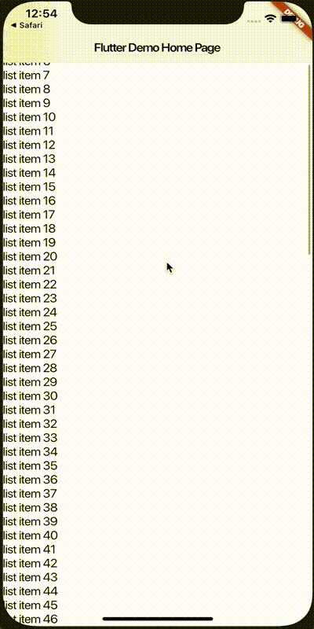
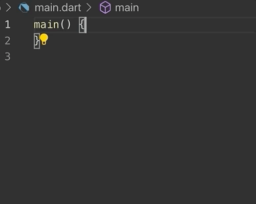
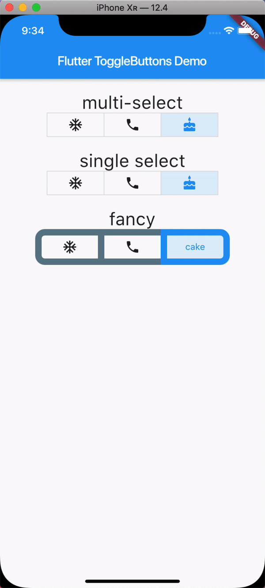
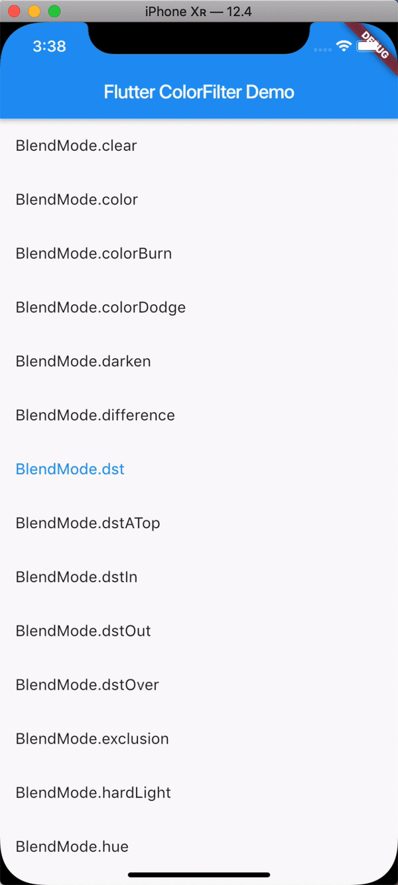
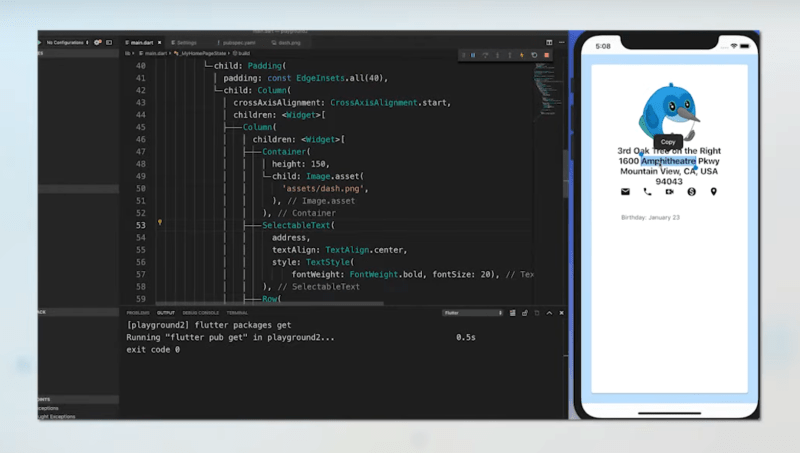
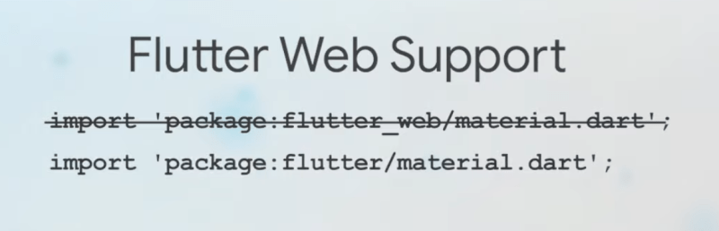
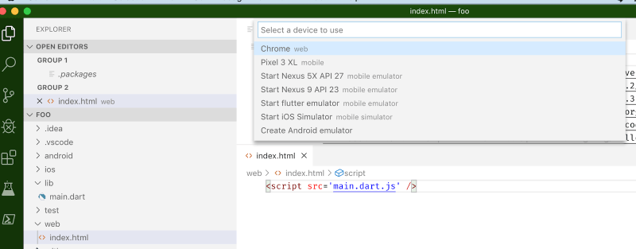

# Flutter 1.9의 새로운 점

### macOS Catalina를 지원합니다.

새로운 Xcode 빌드 시스템 및 Xcode 11에 대한 지원 추가하였습니다.

### iOS 13을 지원합니다.

iOS 13의 draggable scrollbar를 지원합니다.




## Dart 2.5의 새로운 점

Flutter 1.9는 Dart 2.5에서 동작합니다. Flutter를 업그레이드 하려면

```sh
flutter upgrade
```

이렇게 하면 Dart 2.5도 함께 업그레이드 됩니다.

### 머신러닝에 의한 코드 완성



Flutter로 보면


### 다트에서 직접 C 코드를 호출하기위한 dart : ffi (foreign function interface) 지원

개발자는 Dart 코드가 실행되는 운영 체제에서 기존 네이티브 API뿐만 아니라 C로 작성된 기존 크로스 플랫폼 네이티브 라이브러리를 활용할 수 있습니다.

## Flutter 1.9의 새로운 점

### ToggleButtons

ToggleButtons 위젯은 일련의 ToggleButton 위젯을 하나로 묶으며 종종 아이콘 및 텍스트 위젯 세트로 구성되어 버튼 세트를 구성합니다.



### ColorFiltered

ColorFiltered 위젯을 사용하면 하위 위젯 트리를 다시 채색 할 수 있습니다.



### SelectableText

SelectableTextwidget은 단일 스타일의 텍스트 문자열을 표시합니다. 문자열이 여러 줄에서 끊어 지거나 레이아웃 제약 조건에 따라 모두 같은 줄에 표시 될 수 있습니다.



### 언어 지원

24가지 새로운 언어를 지원합니다.


### Flutter 프로젝터의 Default Lanugages

새로운 Flutter 프로젝트는 이제 iOS의 경우 Objective-C 대신 Swift로, Android의 경우 Java 대신 Kotlin으로 기본 설정됩니다. 필요한 경우 언제든지 다시 전환 할 수 있습니다.

### 구조화된 오류 메시지

아래 스크린 샷은 레이아웃 오버플로 오류로 생성 된 메시지에서 파란색 원으로 식별 된 4 가지 개선 사항을 보여줍니다.


VSCode에서는 아래와 같습니다.


### Flutter Web의 새로운 점

## flutter_repository

`Flutter_web_repository` 는 더이상 사용되지 않으며 `flutter repository`에 통합되어 지원 됩니다.



프로젝트를 만들 때 Flutter는 웹 컴파일 된 Flutter 코드를 부트 스트랩하는 최소한의 web/index.html 파일을 통해 웹 러너를 만듭니다.



참고 : Flutter를 사용한 웹 출력 지원은 아직 초기 단계이며 아직 프로덕션 준비가되지 않았습니다.

### 앱이 웹에서 실행 중인지 알려주는 플래그를 포함합니다 (kIsWeb)

## 참조

- [What’s New in Flutter 1.9](https://flatteredwithflutter.com/flutter-1-9/)