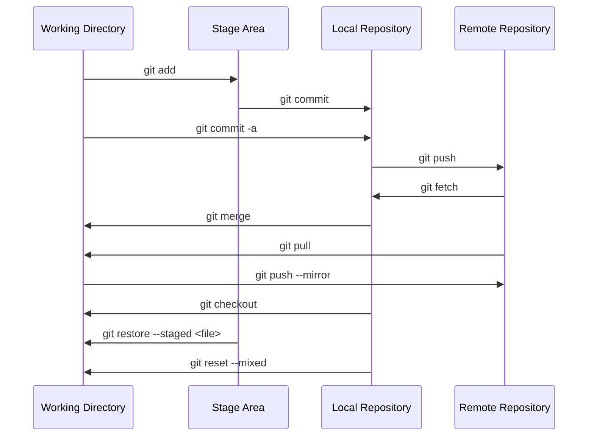

# Git Visualization

```mermaid
sequenceDiagram
participant w as Working Directory
participant s as Stage Area
participant l as Local Repository
participant r as Remote Repository
w ->> s: git add
s ->> l: git commit
w ->> l: git commit -a
l ->> r: git push
r ->> l: git fetch
l ->> w: git merge
r ->> w: git pull
w ->> r: git push --mirror
l ->> w: git checkout
s ->> w: git restore --staged <file>
l ->> w: git reset --mixed

```

