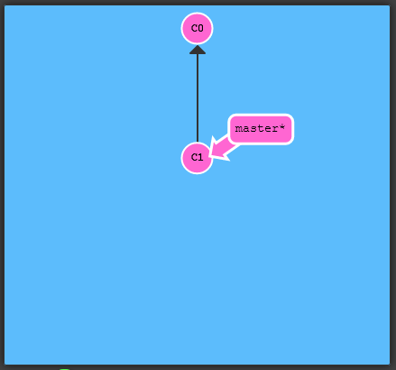
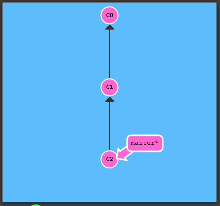
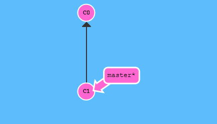
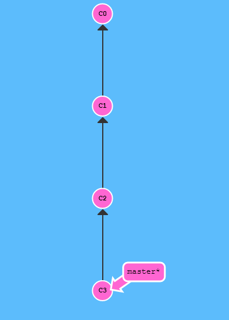
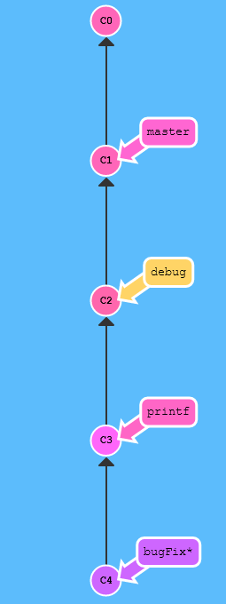
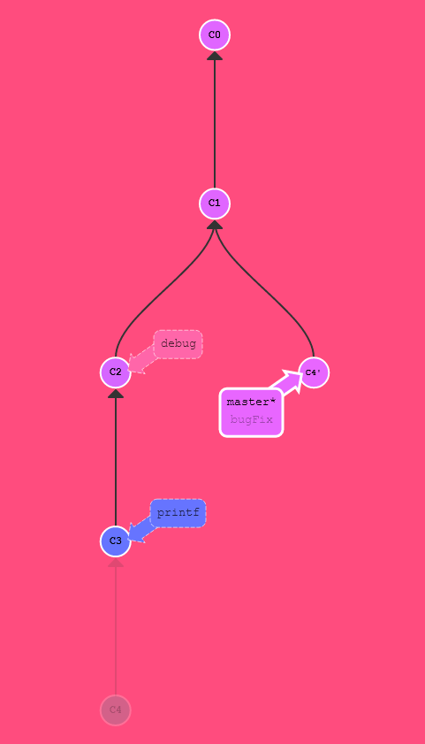
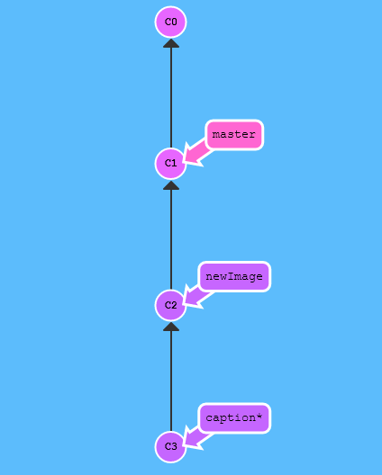
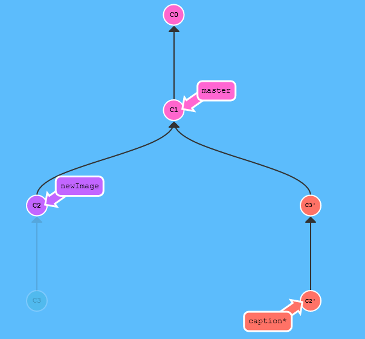
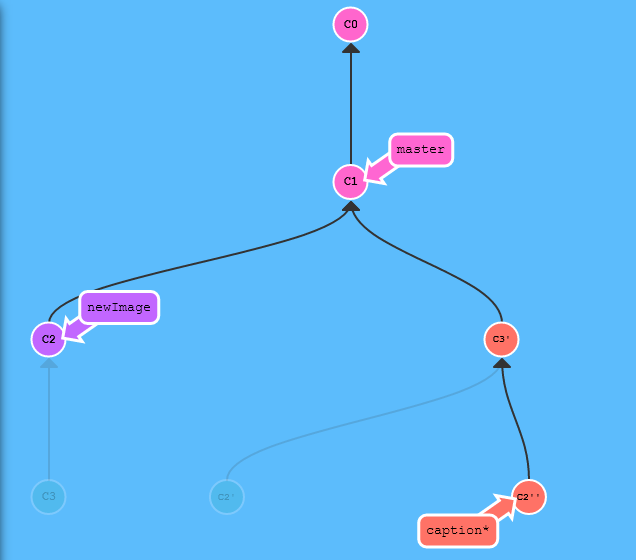
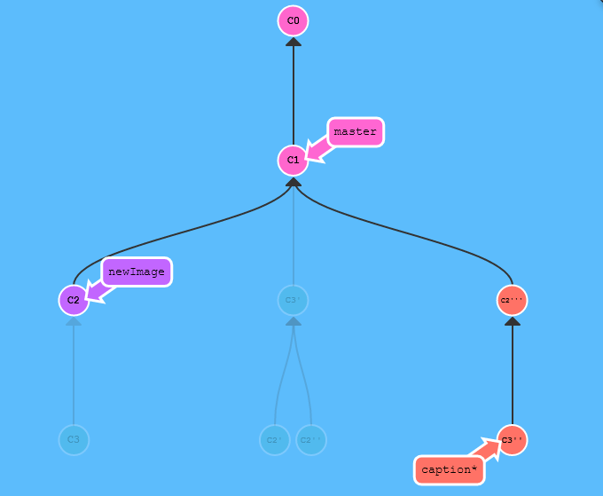

# Learning Git

## Git 커밋

커밋은 Git 저장소에 여러분의 디렉토리에 있는 모든 파일에 대한 스냅샷을 기록하는 것입니다. 디렉토리 전체를 복사하여 붙여넣는것과 유사하지만, 훨씬 유용한 방법입니다!

Git은 가능한 한 커밋을 가볍게 유지하고자 하기때문에, 커밋할 때마다 디렉토리 전체를 복사하진 않습니다. 각 커밋은  저장소의 이전 버전과 다음 버전의 변경내역("delta"라고도 함)을 저장합니다. 그래서 대부분의 커밋이 그 커밋 위의 부모  커밋을 가리킵니다. -- 다음 화면에서 곧 살펴보게 될 것입니다.

저장소를 복제(clone)하려면 모든 변경분(delta)를 풀어내야 하는데, 이 때문에 명령행 결과로 아래 문구를 볼 수 있습니다.

```
resolving deltas
```

알아야 할 것이 꽤 많습니다만, 일단은 커밋을 프로젝트의 스냅샷들로 생각하면 충분합니다. 커밋은 매우 가볍고 커밋 사이의 전환도 매우 빠르다는 것을 기억해주세요!

---

연습할 때 어떻게 보이는지 확인해봅시다.

오른쪽 화면에 git 저장소를 그림으로 표현해 놓았습니다. 현재 두번 커밋한 상태입니다 -- 첫번째 커밋으로 `C0`, 그 다음으로 `C1`이라는 어떤 의미있는 변화가 있는 커밋이 있습니다.



 아래 버튼을 눌러 새로운 커밋을 만들어보세요.    

```shell
git commit
```



 이렇게 보입니다! 멋지죠. 우리는 방금 저장소 내용을 변경해서 하나의 커밋으로 저장했습니다. 방금 만든 커밋은 부모는 `C1`이고, 어떤 커밋을 기반으로 변경된 것인지를 가리킵니다.

---

 계속해서 직접 한번 해보세요! 이 창을 닫고, 커밋을 두 번 하면 다음 레벨로 넘어갑니다. 



```
git commit
git commit
```




## 로컬에 쌓인 커밋들

개발중에 종종 이런 상황이 생깁니다: 잘 띄지 않는 버그를 찾아서 해결하려고, 어떤 부분의 문제인지를 찾기 위해 디버그용 코드와 화면에 정보를 프린트하는 코드 몇 줄 넣습니다. 

디버깅용 코드나 프린트 명령은 그 브랜치에 들어있습니다. 마침내 버그를 찾아서 고쳤고, 원래 작업하는 브랜치에 합치면 됩니다!

이제 `bugFix`브랜치의 내용을 `master`에 합쳐 넣으려 하지만, 한 가지 문제가 있습니다. 그냥 간단히 `master`브랜치를 최신 커밋으로 이동시킨다면(fast-forward) 그 불필요한 디버그용 코드들도 함께 들어가 버린다는 문제죠.

여기에서 Git의 마법이 드러납니다. 이 문제를 해결하는 여러가지 방법이 있습니다만, 가장 간단한 두가지 방법 아래와 같습니다:

- `git rebase -i`
- `git cherry-pick`

대화형 (-i 옵션) 리베이스(rebase)로는 어떤 커밋을 취하거나 버릴지를 선택할 수 있습니다. 또 커밋의 순서를 바꿀 수도 있습니다. 이 커맨드로 어떤 작업의 일부만 골라내기에 유용합니다.

체리픽(cherry-pick)은 개별 커밋을 골라서 `HEAD`위에 떨어뜨릴 수 있습니다.

---

 이번 레벨을 통과하기 위해 어떤 방법을 쓰시든 자유입니다만, `master`브랜치가 `bugFix` 브랜치의 커밋을 일부 가져오게 해주세요. 



```
git checkout master
git cherry-pick C4
```



## 커밋들 갖고 놀기

이번에도 꽤 자주 발생하는 상황입니다. `newImage`와 `caption` 브랜치에 각각의 변경내역이 있고 서로 약간 관련이 있어서, 저장소에 차례로 쌓여있는 상황입니다.

때로는 이전 커밋의 내용을 살짝 바꿔야하는 골치아픈 상황에 빠지게 됩니다. 이번에는 디자인 쪽에서 우리의 작업이력(history)에서는 이미 한참 전의 커밋 내용에 있는 `newImage`의 크기를 살짝 바꿔달라는 요청이 들어왔습니다.

이 문제를 다음과 같이 풀어봅시다:

- `git rebase -i` 명령으로 우리가 바꿀 커밋을 가장 최근 순서로 바꾸어 놓습니다
- `commit --amend` 명령으로 커밋 내용을 정정합니다
- 다시 `git rebase -i` 명령으로 이 전의 커밋 순서대로 되돌려 놓습니다
- 마지막으로, master를 지금 트리가 변경된 부분으로 이동합니다. (편하신 방법으로 하세요)

이 목표를 달성하기 위해서는 많은 방법이 있는데요(체리픽을 고민중이시죠?), 체리픽은 나중에 더 살펴보기로 하고, 우선은 위의 방법으로 해결해보세요.

최종적으로, 목표 결과를 눈여겨 보세요 -- 우리가 커밋을 두 번 옮겼기 때문에, 두 커밋 모두 따옴표 표시가 붙어있습니다. 정정한(amend) 커밋은 따옴표가 추가로 하나 더 붙어있습니다.



```
git rebase -i C1
```

```
C3
C2
```



```
git commit --amend
```



```
git rebase -i
```

```
C2''
C3'
```



```
git rebase caption master
```

