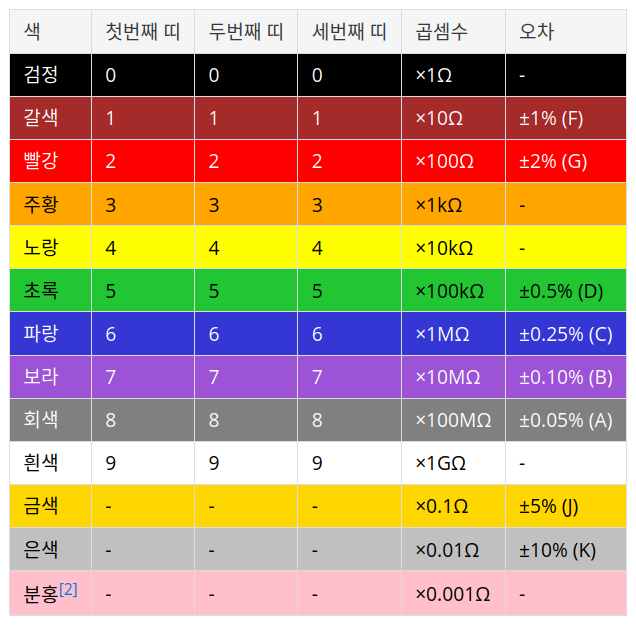
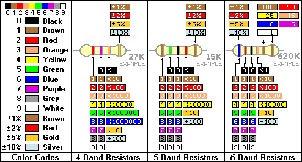
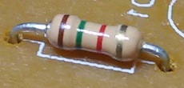
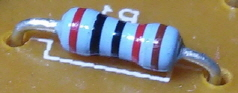
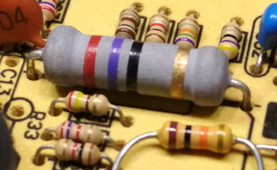
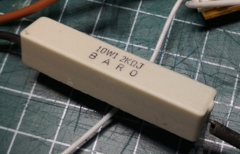
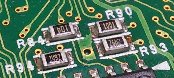

# 저항기

## 색띠 표기법 읽는 법

1. 오차를 표시하는 금/은색 띠를 오른쪽으로 둔다.

| 색띠 수 |    1st     |    2nd    |     3rd      |     4th      | 5th  |   6th    |
| :-----: | :--------: | :-------: | :----------: | :----------: | :--: | :------: |
|  4색띠  | 10의 자리  | 1의 자리  | 곱셈수(배율) |     오차     |  -   |    -     |
|  5색띠  | 100의 자리 | 10의 자리 |   1의 자리   | 곱셈수(배율) | 오차 |          |
|  6색띠  | 100의 자리 | 10의 자리 |   1의 자리   | 곱셈수(배율) | 오차 | 온도계수 |

## 고정형 저항의 종류

### 탄소피막저항

특징:

- 간단한 회로에서 주로 사용 된다.
- 온도나 노화에 따른 저항값 변화가 심하다
- 노이즈가 많아서 정밀한 회로에는 사용되지 않는다.
- 1/4와트 1개의 가격은 1원도 하지 않을 정도로 가격이 저렴하다.
- 보통 연한 살구색이다.

내전압:

|      | 상시 허용 전압 | 순간 허용 전압 |
| :--: | :------------: | :------------: |
| 1/8W |      200V      |      400V      |
| 1/4W |      250V      |      500V      |
| 1/2W |      350V      |      700V      |
| 1~3W |      500V      |     1000V      |

### 금속피막저항

특징:

- 고주파나 정밀함을 요구하는 회로에서 사용
- 탄소피막저항보다 저항값 변화나 노이즈가 적다
- 대량생산에도 적절
- 고가이다.
- 보통 청색을 띄고 있다.
- 고급 오디오 앰프 회로에서 흔히 볼 수 있다.

내전압은 탄소피막저항과 동일하다.

### 권선저항

특징:

- 니크롬(니켈-크로뮴 합금), 백동(구리-니켈 합금)등 저항이 높은 금속 소재를 감아서 제작한다.
- 저항값을 정밀하게 제어할 수 있다.
- 코일의 일종이기 때문에 [인덕턴스](https://namu.wiki/w/인덕터)가 발생한다는 단점이 있다.
- 상용 주파수(50~60Hz)까지는 큰 문제가 없으나, 고주파 교류 전원에서 사용하기에는 적합하지 않다.
- 용량은 1W부터 수십~수백 W 이상도 가능하다.
- 열 방출을 원활하게 하기 위해 알루미늄 틀에 저항기를 집어넣은 형태로  제작되기도 한다.

- 일부 권선 저항은 간혹 [퓨즈](https://namu.wiki/w/퓨즈) 대용으로 사용 가능하도록 제작되는 경우도 있다.
- 과전류가 흐르면 내부의 금속 선이 끊어지는 원리를 응용한 것이다.
- 충전기 등 일부 저용량 [SMPS](https://namu.wiki/w/SMPS)에서 돌입 전류 방지 및 퓨즈 목적으로 사용된다.

- 일부 권선 저항기는 저항값과 오차를 색띠 대신 숫자로 표기하는 경우도 있다. 수십~수백 W급의 대용량 권선 저항기는 숫자로만 표기한다.

### 시멘트 세라믹 저항

특징:

- 시멘트 및 이에 준하는 세라믹스 재질로 패키징한 저항이다.
- 높은 열에 잘 견딘다.
- 대전류를 발전제동 같은 다이나믹 브레이크에서 전기  에너지를 열 에너지로 전환하는데 쓰거나 이상 전류를 우회시켜 제거하는 회로에도 쓰이고 여러 개를 묶어 간단한 전열기로 쓰기도  한다.
- 저항값을 정밀하게 조절하기는 어렵고 온도에 따른 저항값 편차도 큰 편이다.
- 전류를 제한하는 목적보다는 전류를 제거하는 목적 또는 소자에서 발생하는 열 에너지를 활용할 목적으로 더 많이 쓰인다.
- 보통 10W짜리가 많이 쓰인다. 모터 드라이버에서 전력회로 쪽에 저항을 쓸 일이 있다면 거의 이걸 사용한다.
- PCB에 하얗고 네모나게 생긴 큰 블록이 보이면 대부분 이것이다.
- 용량은 보통 3W~20W 정도이며, 이들 중 5W와 10W 시멘트 저항이 가장 흔한 편이다.
- 가격은 같은  저항값과 용량의 권선 저항보다 저렴한 편이다.

시멘트 저항은 저항값과 오차를 색띠 대신 숫자로만 표기한다. 저항값 오른쪽의 알파벳 대문자가 오차값을 의미한다. 

### 칩저항

다른 말로는 SMD저항.

특징:

- 크기가 쌀알의 1/4와 비슷하며 그보다 더 작은 것도 존재할 만큼 작은 회로에 많이 쓰이는 저항기이다.
- 고주파를 무리없이 잘 통과시키기 때문에 스마트폰 안에 이것으로 도배되어 있다.
- 가격이 비싸다.
- 사이즈는 가장 큰  것이 6.3mm*3.2mm이며, 가장 작은 것은 0.4mm*0.2mm의 사이즈를 가지고 있다.
- 저항 소재는 탄소피막을 쓴 것과  금속 분말을 소결해 만든 것 두 종류가 흔히 쓰인다.
- 특이하게 0옴 칩저항이 있는데(표면에 0 또는 000이 써있다) 보통  아날로그 회로와 디지털 회로 사이의 그라운드 분리 같이 전자파 노이즈 제거 또는 배선간의 교차를 위해 쓰인다. 물론 [초전도체](https://namu.wiki/w/초전도체)는 아니므로 완전히 0옴은 아니고 미세한 저항값(보통 20mΩ 미만)을 가진다. 이 0옴 칩저항은 전원에다 그냥 연결하면 [쇼트](https://namu.wiki/w/합선)가 나버린다. [[6\]](https://namu.wiki/w/저항기#fn-6)

- 단점으로는 높은 전압이나 전류를 감당할 수가 없다. 수백V 이상 또는 1W 이상을 감당해야 하는 회로에는 칩 저항이 아닌 스루홀 타입을 쓰거나 여러 개를 직렬(최대 전압 및 용량 증가) 또는 병렬(용량 증가)하여 사용해야 한다.

- 스루홀 저항기와 달리 저항값이 색띠가 아닌 숫자로 표시되어 있으며, 오차는 표시하지 않는다. 보통 3자리수 SMD 저항기는 ±5%,  4자리수는 ±1%의 오차를 가진다. 맨 마지막 자리가 곱셈수를 나타내며, 대문자 R은 소수점을 나타낸다.[[읽는법\]](https://namu.wiki/w/저항기#fn-읽는법) 단, 1005(1.0mm x 0.5mm) 이하 크기의 SMD 저항기는 SMD 적층 세라믹 축전기와 마찬가지로 숫자 표기가  없으므로 저항값을 알고 싶다면 별도의 계측기로 측정해야 한다. 일부 숫자값은 반대로 돌려 읽어도 말이 되는 경우도 있으며,[[8\]](https://namu.wiki/w/저항기#fn-8) 표시된 숫자가 회전대칭이기까지 할 경우 별도의 계측기를 사용해야 한다. 일부 SMD 저항기는 이러한 혼동을 피하기 위해 숫자값 밑에 밑줄을 긋기도 한다.

±1% 오차를 가진 1608 SMD 저항기의 경우 4자리수를 표기하기 어려우므로 EIA-96이라는 별도의 표기 시스템을 사용한다. 앞의 두 자리수는 세자리수 저항값을 코드 형태로 나타낸 것이며, 뒤에 붙는 알파벳은 곱셈수를 의미한다.[[읽는법2\]](https://namu.wiki/w/저항기#fn-읽는법2)

| 코드 |  값  | 코드 |  값  | 코드 |  값  | 코드 |  값  |   코드   | 곱셈수 |
| :--: | :--: | :--: | :--: | :--: | :--: | :--: | :--: | :------: | :----: |
|  01  | 100  |  25  | 178  |  49  | 316  |  73  | 562  |    Z     | 0.001  |
|  02  | 102  |  26  | 182  |  50  | 324  |  74  | 576  | Y 또는 R |  0.01  |
|  03  | 105  |  27  | 187  |  51  | 332  |  75  | 590  | X 또는 S |  0.1   |
|  04  | 107  |  28  | 191  |  52  | 340  |  76  | 604  |    A     |   1    |
|  05  | 110  |  29  | 196  |  53  | 348  |  77  | 619  | B 또는 H |   10   |
|  06  | 113  |  30  | 200  |  54  | 357  |  78  | 634  |    C     |  100   |
|  07  | 115  |  31  | 205  |  55  | 365  |  79  | 649  |    D     |  1000  |
|  08  | 118  |  32  | 210  |  56  | 374  |  80  | 665  |    E     | 10000  |
|  09  | 121  |  33  | 215  |  57  | 383  |  81  | 681  |    F     | 100000 |
|  10  | 124  |  34  | 221  |  58  | 392  |  82  | 698  |          |        |
|  11  | 127  |  35  | 226  |  59  | 402  |  83  | 715  |          |        |
|  12  | 130  |  36  | 232  |  60  | 412  |  84  | 732  |          |        |
|  13  | 133  |  37  | 237  |  61  | 422  |  85  | 750  |          |        |
|  14  | 137  |  38  | 243  |  62  | 432  |  86  | 768  |          |        |
|  15  | 140  |  39  | 249  |  63  | 442  |  87  | 787  |          |        |
|  16  | 143  |  40  | 255  |  64  | 453  |  88  | 806  |          |        |
|  17  | 147  |  41  | 261  |  65  | 464  |  89  | 825  |          |        |
|  18  | 150  |  42  | 267  |  66  | 475  |  90  | 845  |          |        |
|  19  | 154  |  43  | 274  |  67  | 487  |  91  | 866  |          |        |
|  20  | 158  |  44  | 280  |  68  | 499  |  92  | 887  |          |        |
|  21  | 162  |  45  | 287  |  69  | 511  |  93  | 909  |          |        |
|  22  | 165  |  46  | 294  |  70  | 523  |  94  | 931  |          |        |
|  23  | 169  |  47  | 301  |  71  | 536  |  95  | 953  |          |        |
|  24  | 174  |  48  | 309  |  72  | 549  |  96  | 976  |          |        |

SMD 저항 패키지별 크기와 전력 허용량은 다음과 같다. 패키지 코드는 인치 규격 또한 통용된다. 예를 들어 2012 저항기(2.0mm x 1.25mm)는 인치 규격에서는 0805(0.08" x 0.05")이다.

| 패키지 (인치) |      크기      | 전력 허용량 | 상시 허용 전압[[10\]](https://namu.wiki/w/저항기#fn-10) |
| :-----------: | :------------: | :---------: | :-----------------------------------------------------: |
| 0402 (01005)  | 0.4mm x 0.2mm  |    31mW     |                           15V                           |
|  0603 (0201)  | 0.6mm x 0.3mm  |    50mW     |                           25V                           |
|  1005 (0402)  | 1.0mm x 0.5mm  |    63mW     |                           50V                           |
|  1608 (0603)  | 1.6mm x 0.8mm  |    63mW     |                           75V                           |
|  2012 (0805)  | 2.0mm x 1.25mm |    0.1W     |                          150V                           |
|  3216 (1206)  | 3.2mm x 1.6mm  |   0.125W    |                          200V                           |
|  3225 (1210)  | 3.2mm x 2.5mm  |    0.25W    |                          200V                           |
|  4532 (1812)  | 4.5mm x 3.2mm  |    0.33W    |                          200V                           |
|  5025 (2010)  | 5.0mm x 2.5mm  |    0.5W     |                          200V                           |
|  6432 (2512)  | 6.35mm x 3.2mm |     1W      |                          200V                           |

## 참조

- [저항읽는 법 - 저항의 색상 코드 및 SMD 코드 읽기](https://m.blog.naver.com/PostView.naver?isHttpsRedirect=true&blogId=haneham&logNo=221227227144)
- [저항기](https://namu.wiki/w/%EC%A0%80%ED%95%AD%EA%B8%B0)

