# Image processing in Frequency domain

## 푸리에 변환

푸리에 변환(Fourier transform)은 임의의 입력 신호를 다양한 주파수를 갖는 주기함수들의 합으로 분해하여 표현하는 것입니다. 푸리에 변환에서 사용하는 주기함수는 sin, cos 삼각함수이며, 고주파부터 저주파까지 다양한 주파수 대역의 sin, cos 함수들로 원본 신호를 분해합니다.

아래 그림을 보면 맨 앞의 붉은 색 신호는 입력 신호이고 뒤의 파란색 신호들은 푸리에 변환(Fourier  transform)을 통해 얻어진 (원본 신호를 구성하는) 주기함수 성분들입니다. 각각의 주기함수 성분들은 고유의  주파수(frequency)와 강도(amplitude)를 가지고 있으며 이들을 모두 합치면 원본 붉은색 신호가 됩니다.


<그림 (1)>

푸리에 변환(Fourier transform)은 프랑스의 수학자 Joseph Fourier (1768 ~ 1830)가 제안한  방법으로 수식은 다음입니다.
$$
f(x) = \int_{-\infty}^\infty F(u) e^{j2\pi ux} \text{d}u
\tag{1}
$$

$$
F(x) = \int_{-\infty}^\infty f(x) e^{j2\pi ux} \text{d}u
\tag{2}
$$

여기서 $j$는 허수단위 $j=\sqrt{-1}$, f(x)는 원본 입력 신호, $e^{j2\pi ux}$는 주파수 $u$인 주기함수 성분 $F(u)$는 해당 주기 함수 성분의 계수를 나타냅니다. 식 $(1)$은 입력신호 $f(x)$가 $e^{j2\pi ux}$들의 합으로 분해 된다는 표현이다. 식 $(2)$는 $f(x)$를 주기함수 성분으로 분해했을때의 계수(coefficient) $F(u)$가 식 $(2)$ 어진다는 의미이다. 앞서 그림 1과 연관해 보면 $e^{j2\pi ux}$는 $f(x)$를 구성하는 (파란색의 주파수 u인) 주기함수 성분들이고 $F(u)$는 해당 주기함수 성분의 강도(amplitude)를 나타 냅니다.

식 $(2)$를 푸리에 변환이고, 식 $(1)$을 푸리에 역변환(inverse Fourier  transform)입니다. 이다. 그리고 푸리에 역변환을 하면 다시 원래의 함수로 돌아옵니다. 식 자체는 푸리에 변환의 대단함에 비추어 매우 단순합니다.이르 ㄹ이해하기 위해서는  $e^{j2\pi ux}$ 즉 오일러 공식(Euler's formula)이 필요합니다.

오일러 공식(Euler's formula)은 복소지수함수를 삼각함수로 변환할 수 있도록 하는 식입니다.
$$
e^{j\theta} = \cos \theta + j \sin \theta
\tag{3}
$$
오일러 공식을 이용하면 식 $(1)$의 $e^{j2\pi ux}$는 실수부가 $cos(2\pi ux)$, 허수부가 $sin(2\pi ux)$인 주기함수임을 알 수 있습니다.
$$
e^{j2\pi ux}
= \cos 2\pi ux
+ \sin 2\pi ux
\tag{4}
$$
여기서 $\cos 2\pi ux$, $\sin 2\pi ux$ 모두 주기(period)가 $\frac{1}{u}$, 주파수(frequency) $u$인 주기함수이므로 결국 $e^{j2\pi ux}$는 주파수 $u$인 정현파(sinusoidal wave)의 복소지수함수 표현임을 알 수 있습니다.

## 영상에서 푸리에 변환

푸리에 변환(Fourier transform)은 영상처리에서도 매우 중요한 개념으로  다양한 응용을 가지고 있습니다. 영상을 주파수 성분으로 변환하여 다양한 분석 및 처리를 할 수 있고 임의의 필터링 연산을 FFT(Fast Fourier Transform)를 이용하여 고속으로 구현할 수도 있습니다.

## 이산 푸리에 변환

이산 푸리에 변환 (Decrete Fourier Transform, DFT)는 시간 여역의 이산 신호를 주파수 영역의 이산 신호로 변환하는 것을 말하며, 디지털 장치에서 사용하기 위한 푸리에 변환이다.

푸리에 급수나 푸리에 변환 대신에 이산 푸리에 변환이 쓰이는 때와 이유는 다음과 같다.

푸리에 급수와 변환의 가정은 시간 영역의 신호가 연속이어야 한다는 점인데, 컴퓨터 등과 같은 디지털 신호 처리 장치는 모든 자료를 연속적으로 저장할 수 없다. 대신에, 디지털 장치에 입력되는 시간 함수도 이산적이고 변환된 주파수 함수도 이산적으로 저장될 수  밖에 없기 때문에 이산 푸리에 변환이 사용된다.

시간 영역과 주파수 영역 모두에서 신호 함수가 이산적이기 위해서는 시간 영역에서의 신호가 이산성을 가져야 할 뿐만 아니라 주기성도 가져야 한다. 그 이유는, 이산성(discreteness)과 주기성(periodicity)은 시간 영역과 주파수 영역에서 서로  대응하기 때문이다. 즉, 시간 영역에서의 주기성을 가진 함수는 주파수 영역에서 이산성을 갖게 되고 그 반대도 마찬가지로 성립한다.

현실에서 디지털 장치에서 이산 푸리에 변환을 적용하고자 하는 함수가 항상 주기적인 함수가 아니라 비주기적인 함수인 경우가 많다.  이런 경우에도 문제가 없는 것이 디지털 장치는 비주기적인 입력 신호 함수를 T 시간 동안 입력 받아서 저장해 두고는 이것이 마치 T 주기마다 반복되는 주기 함수인것처럼 취급하여 이산 푸리에 변환을 적용할 수 있으며 '표본화 시간'(sampling time)만  충분히 작다면 아무런 문제가 없기 때문이다. 또한, 주파수 영역의 신호 함수를 시간 영역으로 다시 복원을 하면 T의 주기를 갖는  주기 함수가 만들어지지만 T 한 주기만을 출력하면 원래의 신호가 복원되기 때문이다.

'고속 푸리에 변환'(Fast Fourier Transform, FFT)은 이 이산 푸리에 변환의 계산 시간을 줄이기 위한 하나의 알고리즘으로서 N개의 표본 자료를 홀수 번호와 짝수 번호로 나누어 계산함으로써 계산 과정 중의 같은 연산 값들을 재사용함으로써  계산량을 $O(N^2)$에서 $O(N \log N)$으로 줄이며 또한 재귀적 함수 호출을 통해 알고리즘이 간단한 장점을 갖는다.

## 코사인 함수들의 합으로 나타내기

기술적인 이점으로 인해 코사인 함수가 더 자주 사용된다.

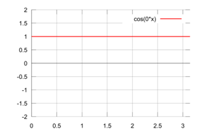 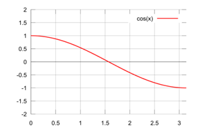

 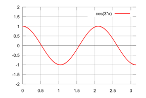

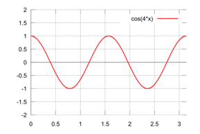 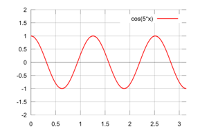

0~5의 $n$에 대해 $\cos nx$ 의 그래프를 그려 보았다.

이 $\cos nx$ 함수들을 합해서 다른 함수를 유도한다면 이 유도된 함수도 코사인 함수의 특성을 그대로 가지고 있을 것이다. 즉  $y$ 축에 대해 대칭이 될 것이고, $2\pi$를 주기로 같은 값이 반복 될 것이다.

$\cos nx$ 들의 합으로 나타낸 함수 $f(x)$가 있는데, $[0, \pi]$에서만 그 값을 알았다고 하자. 이미 $f(x)$가 $y$축에 대해 대칭인 것을 알고 있으므로, $[-π, 0]$에서도 그 값을 알 수 있다. $f(x)$의 값이 $2 \pi $를 주기로 반복된다는 것을 알고, $[-\pi, \pi]$에서  $f(x)$의 값을 알고 있으므로, 모든 $x$에 대해서 $f(x)$의 값을 알 수 있다. 다시 말하면, $\cos nx$ 들의 합으로 나타낸 함수는 $[0, \pi]$에서만 그 값을 알면 나머지 모든 구간에 대한 $f(x)$의 값도 알 수 있다는 것이다. 이를 그림으로 나타내면 아래와 같다.


$[0, \pi]$ 에서만 값을 알고 있는 함수


함수를 $y$축으로 대칭 

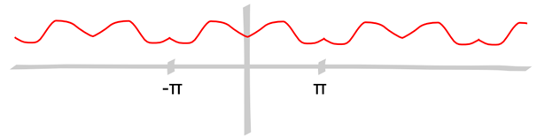

주기가 $2\pi$임을 감안하여 모든 $x$에 대해서 그래프를 완성

$\cos nx$의 합으로 나타낸 함수는 $[0, \pi]$ 구간에서의 정보만 있으면 함수 전체를 알 수 있다는 것을 확인했다. 그렇다면 이건 어떨까? 

$[0, \pi]$에서 정의된 함수는 $\cos nx$들의 합으로 나타낼 수 있다.

불연속점이 유한개인 모든 함수가 $[0, \pi]$ 구간에만 있다면, 이 함수는 $\cos nx$의 합으로 나타낼 수 있다.
$$
f_n(x)
= \frac{1}{2}
+ \frac{2}{\pi} \cos x
- \frac{2}{3\pi} \cos 3x
+ \frac{2}{5\pi} \cos 5x
- \frac{2}{7\pi} \cos 7x
+
\cdots
\pm \frac{2}{n\pi} \cos nx
$$
이 식은 아래와 같이 간단한 함수로 수렴한다.
$$
f(x)
= \begin{cases}
1 & 0 \le x \lt \frac{\pi}{2} \\
0 & \frac{\pi}{2} \lt x \lt \pi \\
\end{cases}
$$


이것을 코사인 함수들로 이루어진 무한급수라는 의미에서 "**코사인 급수**", 또는 처음 만든 사람의 이름을 붙여서 "**푸리에 코사인 급수**"라고 한다.

$[0, \pi]$에서 정의된 어떤 함수가 있었고, 그것을 $\cos nx$ 함수들의 합으로 나타냈다. $\cos$함수에 곱해진 각 계수를 $C_n$으로 나타내면, 지금까지 한 것은 아래의 두 가지 사이의 관계를 구한 것이었다. 
$$
f: [0, \pi] \rightarrow \mathbb R
$$

$$
\sum_{n=0}^\infty C_n \cos nx
$$

지금까지 한 것은 함수 $f$와 무한수열 $C_n$사이의 대응을 구한 것이다.

1. $f$를 알면 $C_n$들을 알 수 있다.
2. $C_n$을 알면 $f$도 알 수 있다.

이처럼 $f$와 $C_n$은 특별한 관계에 있으며 수학에서 이러한 관계를 가진 한 쌍을 변환쌍(transform pair)이라고 하고, 둘중 하나에서 다른 하나를 구하는 것을 변환(transform)이라고 한다.

변환의 개념은 주파수 영역에서의 이미지 프로세싱의 핵심적인 역할을 한다.

---

$0~\pi$ 까지의 구간을 $N$개로 나눈 경우를 생각해 보자. 각각의 나누어진 구간의 크기는 $\frac{\pi}{2}$ 이고, 하나의 샘플은 그 구간의 중앙에 위치하기 때문에,  $n$ 번째 점의 $x$ 좌표는
$$
n\frac{\pi}{N} + \frac{1}{2}\frac{\pi}{N}
= \frac{\pi}{2N} (2n + 1)
$$
로 주어진다.

$N$개의 점에 대한 각각의 $y$ 좌표는 $f_0, f_1, f_2, \dots, f_{N-1}$이라고 하고 유한수열이다. 이 함수도 변환이 가능하다.

- $f_0, f_1, f_2, \dots, f_{N-1}$을 $C_0, C_1, C_2, \dots, C_{N-1}$로 변환 하는 것을 이산 코사인 변환 (DCT; Discrete Cosine Transform)라고 한다.
- $C_0, C_1, C_2, \dots, C_{N-1}$을 $f_0, f_1, f_2, \dots, f_{N-1}$로 변환 하는 것을 역 이산 코산인 변환 (IDCT; Inverse Descrete Cosine Transform)라고 한다.

좌표평면 상의 3개의 점을 지나는 다항식을 찾기 위해서는 항이 3개인 2차식이면 충분하다. 마찬가지로 좌표평면 상에서 $N$개의 점을 지나도록 하기 위해선 $N$개의 $\cos$함수면 충분하다. DCT의 결과가 입력과 똑 같은 길이 $N$의 배열이 되는 것이다. 이것을 염두에 두고, 먼저 DCT의 계산부터  알아보자. 아래와 같이 하면 $f_n$으로부터 $C_n$을 구할 수 있다. 
$$
C_n
= \frac{2}{N}
\sum_{k=0}^{N-1}
f_k \cos \frac{n\pi}{2N} (2k+1)
$$
$C_n$을 이용해서 함수 $f$를 다시 쓸 수 있다 (IDCT).
$$
\begin{align}
f(x)
&= \frac{C_0}{2}
+ \sum_{n=1}^{N-1}
C_n \cos nx \\
&= \frac{C_0}{2}
+ C_1 \cos x
+ C_2 \cos 2x
+ \cdots
+ C_{n-1} \cos (n-1)x
\end{align}
$$
첫 항에만 $\frac{1}{2}$이 들어간 것에 주의 하자. $k$ 번째 점의 $x$좌표는 $\frac{\pi}{2N}(2k+1)$이므로, 이 값을 $x$에 대입하면 $f(x)$의 값은 $f_k$와 같아야 한다. 따라서,
$$
f_k
= \frac{C_0}{2}
+ \sum_{n=1}^{N-1}
C_n \cos \frac{n\pi}{2N} (2k + 1)
$$
DCT와 IDCT의 식을 자세히 보면 둘이 닮은 것 같은 느낌이 들 것이다. $\sum$기호도 그렇고, $\cos$함수 앞에 바꾸기 전 배열의 요소들이 곱해져 있는 것이나 $\cos$함수  안에 들어가 있는 숫자도 비슷하다. 사실 이 둘은 DCT-2, DCT-3 이라고 불리는 여러 DCT들 중 하나이다.

이것을 python으로 구현해 보자.

```python
import math
def DCT(array):
    N=len(array)
    result=[]
    for n in range(N):
        result.append(0)
        for k in range(N):
            result[n]+= 2.0/N*array[k]*math.cos(math.pi/N*(k+0.5)*n)
    return result

def IDCT(array):
    N=len(array)
    result=[]
    for k in range(N):
        result.append(0.5*array[0])
        for n in range(1,N):
            result[k]+= array[n]*math.cos(math.pi/N*n*(k+0.5))
    return result
```

위의 두 함수는 array를 입력으로 받아서 DCT와 IDCT를 한다. 이제 어떤 함수가 주어지더라도 그것들을 $N$개의 점으로 샘플링하여 코사인 함수들의 합으로 나타낼 수 있다.

$C_n$을 알아내기 위해, 위에서 정의한 DCT((1,2,3,4,5)) 를 호출해보자. 

```python
>>> DCT( [ 1, 2, 3, 4, 5 ] ) 
[6.0, -1.992, 0, -0.180, 0]
```

이 Cn들로 다시 fn을 그리면 아래 그래프와 같다.

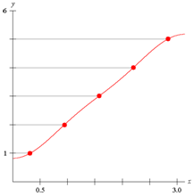

그렇다면, DCT와 라디오가 도대체 무슨 상관이 있는 걸까? 
$$
A \cos \omega t
$$
여기서 

- $A$는 이 수식의 최대 크기를 나타낸다. $\cos$ 함수는 $[-1, +1]$이므로, 이 함수는 $[-A, +A]$이고, 이 A를 진폭(amplitude) 라고 한다.


## 2차원 공간에서 이산 푸리에 변환

2차원 공간의 샘플은 2차원 배열이다. 따라서 2차원 DCT를 적용해야 한다.

1차원에서 정의된 함수를 $f(x)$로 표현 한다.
$$
\begin{matrix}
1 & \cos x & \cos 2x & \cos 3x & \dots
\end{matrix}
$$
2차원에서 정의된 함수는 $f(x, y)$로 표현 한다.
$$
\begin{matrix}
1 & \cos x & \cos 2x & \cos 3x & \dots \\
\cos y & \cos x \cos y & \cos 2x \cos y & \cos 3x \cos y & \dots \\
\cos 2y & \cos x \cos 2y & \cos 2x \cos 2y & \cos 3x \cos 2y & \dots \\
\cos 3y & \cos x \cos 3y & \cos 2x \cos 3y & \cos 3x \cos 3y & \dots \\
\vdots & \vdots & \vdots &\vdots & \ddots \\
\end{matrix}
$$
$x$방향으로 $N$개, $y$방향으로 $M$개의 샘플들이 있다고 하면, 2차원 DCT의 식은 아래와 같다.
$$
C_{n,m}
= \frac{4}{NM}
\sum_{l=0}^{M-1}
\sum_{k=0}^{N-1}
f_{k, l}
\cos \frac{n\pi}{2N}(2k + 1)
\cos \frac{m\pi}{2M}(2l + 1)
\tag{1}
$$
위 식은 연산이 많으므로 더 짧게 줄여 보자. 먼저 $f$에 $x$ 방에 대해서만 DCT를 적용하고 그 결과를 $B_{n,l}$이라고 하자.
$$
B_{n,l}
= \frac{2}{N}
\sum_{k=0}^{N-1}
f_{k, l}
\cos \frac{n\pi}{2N}(2k + 1)
\tag{2}
$$
위 식에 $y$ 방향으로 DCT를 적용해 보자.
$$
\frac{2}{M}
\sum_{l=0}^{M-1} B_{n,l}
\cos \frac{m\pi}{2M}(2l + 1)
$$
$B_{n, l}$에 식 $(2)$를 적용하면
$$
\frac{4}{NM}
\sum_{l=0}^{M-1}
\sum_{k=0}^{N-1}
f_{k, l}
\cos \frac{n\pi}{2N}(2k + 1)
\cos \frac{m\pi}{2M}(2l + 1)
$$
$(1)$과 동일한 식을 얻을 수 있다. $x$좌표에 대한 변환을 한 뒤 $y$좌표에 대한 변환을 하면 2차원 DCT가 완성된다.

IDCT도 동일하게 한 방향을 연산한 결과를 얻고, 다른 방향으로 IDCT를 적용하면 된다.

파이썬의 `numpy` 패키지는 $N \log N$에 비례하는 시간만에 DCT를 수행 할 수 있는 빠른 코사인 변환 (FCT; fast cosine transform)을 제공한다. 사실, `numpy` 에서 제공하는 함수는 복소수를 사용하므로 얻은 결과를 변경 하였

```python
def FCT(array):
    add=array[1:-1]
    add.reverse()
    res=numpy.fft.rfft(array+add)
    return [ num.real/(len(array)-1) for num in res ]

def IFCT(array):
    res=numpy.fft.irfft(array)[0:len(array)]
    return [ num.real*(len(array)-1) for num in res ]
```

이 함수를 이용해서 FCT를 적용해 보자. 

```python
>>> FCT( [ 1, 2, 3, 4, 5 ] ) 
[ 3.0, -1.707, 0.0, -0.293, 0.0 ]
>>> IFCT(_) 
[ 1.0, 2.0, 3.0, 4.0, 5.0 ]
```

DCT의 결과가 조금 다른 것도 보이는데, 이 FCT 함수가 DCT-1이기 때문이다. 흔히 말하는 DCT가 DCT-2이고 IDCT가 DCT-3이라고 했던 것을 기억할  것이다. 결과는 조금 다르지만, 데이터의 각 주파수 성분을 얻어온다는 개념은 동일하다. DCT-1은 $[0, \pi]$ 구간을 $N-1$개로  분할해서 생기는 $N$개의 경계에 점을 찍었을 때를 가정한다. 

`PIL`패키지의 `PixelAccess` 객체 `pix`가 있다고 할 때, 다음의 두 단계로 2차원 DCT를 완료할 수 있다.

```python
m=[FCT([pix[n,m] for n in range(N)]) for m in range(M)]
t=[FCT([mid[m][n] for m in range(M)]) for n in range(N)]
```

 다시 IDCT를 적용하려면 다음과 같다.

```python
m=[IFCT([t[n][m] for n in range(N)]) for m in range(M)]
o=[IFCT([m[m][n] for m in range(M)]) for n in range(N)]
```

##### Low pass filter (저역 통과 필터)

일반적으로 낮은 주파수 영역에는 전체적인 이미지의 윤곽에 대한 정보가 담겨 있고, 높은 주파수 영역에는 이미지의 세밀한 부분에 대한 정보가 담겨 있다.

Low-pass Filter는 말 그대로 낮은(Low) 주파수 영역의 정보만 통과(Pass)시키는 필터이다. 즉, 이미지에 이 필터를 적용하면 이미지의 세밀한 부분에 대한 정보는 지워지고 전체적인 윤곽에  대한 정보만 남게 된다. 결과적으로 이미지는 흐려지게 된다. 

Low-pass Filter는 오디오에서 고음역의 불쾌한 잡음을 제거해 주는 Hiss Filter, 낮은 음역대의 정보를 우퍼(Woofer) 스피커에 전달하는 입체음향 시스템 등에서도 이용된다.

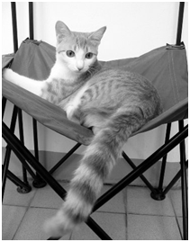

원본 이미지가 있을때 Ideal low pass filter 통과한 이미지는 다음과 같다. (각각 $C=10, 30, 50$ 이다)

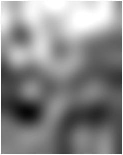  

원본 이미지의 주파수 스펙트럼을 보면 다음과 같다.

 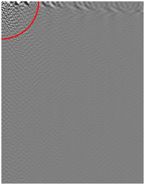

Ideal low pass filter를 통과한 이미지의 주파수 스펙트럼은 다음과 같다. ($C$=100)

 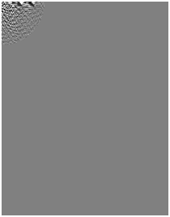

Ideal Low-pass Filter는 주파수별로 주파수 스펙트럼에 아래와 같은 함수를 곱했다고 생각하면 된다. 이것을 필터 함수(Filter Function)이라고 한다.

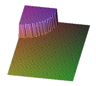 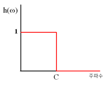

다시, Ideal low pass filter 를 통과한 이미지를 보자.

 

배경을 보면 원본에 없던 줄무늬 들이 보인다. 코사인 급수를 나타낸 그래프를 다시 확인해 보자.

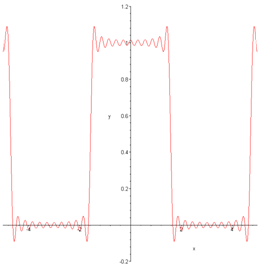

그래프가 직선에 가깝지만 직선 아래위로 계속 오르락내리락하고 있는 모습을 확인할 수 있다. 직선이 되려면 무한 개의 삼각함수를 더해야 하는데, 이 그래프에선 처음 몇 개만 그렸기 때문에 이런 현상이 나타났다. 

마찬가지로 Ideal Low-pass Filter도 "처음 몇 개의 정보만" 반영했기 때문에 울퉁불퉁한 패턴이 나타나게 된다. 이러한 현상을 링잉(Ringing)이라고 하고, 이것을 없애기 위해 고안된 새로운 필터가 있는데, 이것이 바로 Buttorworth Filter이다.

다음은 Buttorworth low pass filter 이다.
$$
h(\omega)
= \frac{1}{1+\left(\frac{\omega}{C}\right)^{2n}}
$$


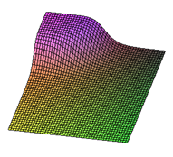 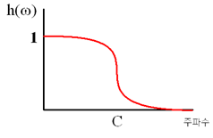

이 필터는 주파수  ω의 정보에 대해, 다음과 같은 필터 함수를 적용시킨다. 여기서 n은 자연수이고, n이 커질수록 점점 Ideal Low-pass  Filter에 가까워진다. 

Ideal low pass filter를 적용한 이미지와 그 이미지에  Buttorworth Filter를 저용한 이미지는 다음과 같다.

 

##### High-pass Filter ( 고역 통과 필터 )

High-pass Filter 역시 말 그대로 높은(High) 주파수 영역의 정보만 통과(Pass)시키는 필터이다. 이 필터에는 이미지의 세밀한 부분에 대한 정보들. 특히 갑자기 색이 많이 바뀌는 곳에  대한 정보가 포함되어 있어서, 경계선 검출 등의 분야에 널리 응용된다. 

또한, 전자기기에서 Low-pass Filter회로와 High-pass  Filter회로를 결합하면 특정 주파수 영역대만 통과시키는 Band-pass Filter를 만들 수 있는데, 이 필터를 이용하는  것이 원하는 주파수의 정보만 뽑아서 받아들이기 위한 핵심 원리이다. 

High-pass Filter를 구현하는  방법은 Low-pass에서와 비슷하다. 다만 Low-pass Filter에서 작은 주파수에 대해 적용하던 것을 높은 주파수에  대해서 적용하면 된다. High-pass Filter에도 Ideal과 Buttorworth가 있으며, 각각의 필터 함수는 1에서  Low-pass의 필터함수를 빼면 된다. 그림으로 나타내면 아래와 같다. 

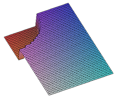 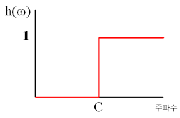


원본 이미지에 Ideal high pass filter를 적용한 이미지는 아래와 같다.

 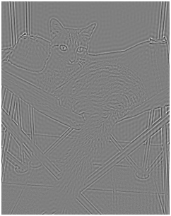


역시나 줄무늬가 보인다. Ideal high pass filter에도 buttorworth filter를 적용해야 할 필요가 있다. 

Buttorworth High-pass Filter의 필터 함수는 다음과 같다.
$$
\begin{align}
h ( \omega )
= \frac{\left(\frac{\omega}{C}\right)^{2_n}}{1+\left(\frac{\omega}{C}\right)^{2_n}}
= \frac{1}{1+\left(\frac{\omega}{C}\right)^{2_n}}
\end{align}
$$


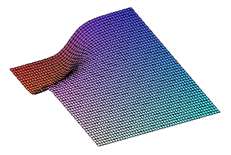 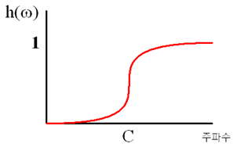

Ideal high pass filter를 적용한 이미지와 Buttorworth high pass filter를 적용한 이미지를 비교해 보자.

 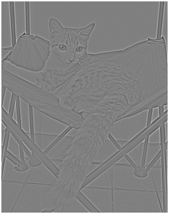

아래는 128을 더하는 대신 절대값을 취한 이미지이다. 두 경우 모두, Buttorworth High-pass Filter가 Ringing이 적어서 경계선을 검출하는데 효과적임을 육안으로 확인할 수 있다. 좌측은 Ideal high pass filter를 적용한 결과이고, 우측은 Butterworth high pass filter를 적용한 결과다.

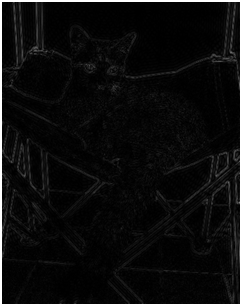 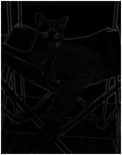

##### Noise Reduction ( 잡음 제거 )

일상생활에서 발생할 수 있는 많은 현상은 주기적이다. 그네의 움직임,  시계추의 움직임, 심장박동 등 많은 현상들이 특정한 메커니즘에 의해 주기적인 성질을 갖게 된다. 정보처리에서 나타날 수 있는  잡음(Noise)도 규칙적인 패턴을 갖고 있는 경우가 많이 있는데, 이런 경우에는 잡음이 갖고 있는 주파수 성분을 제거해 줌으로써 쉽게 잡음을 없앨 수 있다. 

##### 코사인 급수 유도

$[0, \pi]$ 에서 정의된 함수를 코사인 급수로 유도하기 위해서는 다음처럼 코사인 급수의 계수를 구한다.
$$
\begin{align}
f(x)
&= \frac{1}{2}C_0 
+ \sum_{k=1}^\infty C_n \cos nx
\\
C_n
&= \frac{2}{\pi}
\int_0^\pi f(x) \cos nx
\text{d} x
\end{align}
$$
이산 코사인 변환에서 $[0~\pi]$를 N개로 나누고, 나눈 부분마다 사각형을 채워서 아래 영역의 넓이를 근사하는 것이다. $k$번쨰 막대의 노이는 $f(x) \cos nx$에 $x = \frac{\pi}{2N}(2k + 1)$를 대입한 $f_k \cos \frac{n\pi}{2N} (2k+1)$이고 막대의 너비는 일정하다. 이 넓이들의 합을 구하면 아래와 같이 DCT 식을 얻는다.
$$
\begin{align}
C_n
&= \frac{2}{\pi}
\sum_{k=0}^{N-1}
\frac{\pi}{N}
f_k \cos \frac{n\pi}{2N} (2k + 1) \\
&= \frac{2}{N}
\sum_{k=0}^{N-1}
f_k \cos \frac{n\pi}{2N}(2k + 1)
\end{align}
$$
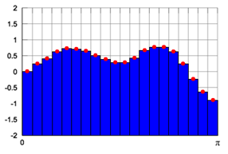

##### 푸리에급수

코사인 급수는 항상 $y$축에 대칭이어야만 한다. 주기가 $2\pi$인 함수들 중에서도 이런 경우는 특수한 경우이기 때문에 제약이 따른다. 일반적인 주기함수를 삼각함수의 합으로 나타내기 위해서는 사인과 코사인 함수를 함께 이용해야 하는데, 이것을 푸리에 급수(Fourier  Series)라고 한다. $[-\pi, +\pi]$에서 정의된 함수 $f(x)$를 푸리에 급수로 나타내는 공식은 아래와 같다. 
$$
f(x) = \frac{1}{2}C_0
+ \sum_{k=1}^\infty C_n \cos nx
+ \sum_{k=1}^\infty D_n \cos nx
$$

$$
\begin{align}
C_n 
&= \frac{1}{\pi}
\int _{-\pi}^\pi f(x) \cos nx \text{d}x \\
D_n
&= \frac{1}{\pi}
\int _{-\pi}^\pi f(x) \sin nx \text{d}x \\
\end{align}
$$

코사인 급수 공식에서 사인함수에 관련된 항 몇 개만 추가되었다. 이 공식을 유도하기 위해서는 몇 가지 미적분학 지식이 필요하다.

- [Fourier Series: Basic Results](http://www.sosmath.com/fourier/fourier1/fourier1.html)

푸리에 급수는 삼각함수들이 가지는 특징들 때문에 편미분방정식을 푸는 데에도 유용하게 사용된다. 대표적인 예로는 열평형 상태에 있는 물체의 온도분포 구하기와 같은 것이 있다.

##### 이산푸리에변환

푸리에 급수는 코사인급수와 달리 $[-\pi, +\pi]$구간에서 정의된 함수를 사용했으며, 코사인과 사인함수를 모두 사용했기 때문에 결과도 $C_n$과 $D_n$의 두 가지였다. 이 두 가지 결과를 $C_n+iD_n$ 과 같이 코사인함수의 계수를 실수부분으로, 사인함수의 계수를 허수부분으로 가지는 복소수로 나타낼 수 있다. 이와 같은 개념으로 이산푸리에변환(DFT, Discrete Fourier Transform)이 정의된다.
$$
C_n
= \sum_{k=0}^{N-1} f_k \cos \frac{2\pi}{N} nk 
- i \sum_{k=0}^{N-1} f_k \sin \frac{2\pi}{N} nk
$$
고양이 사진에 DFT를 적용하면 아래와 같이 된다. 아래 이미지는 DFT 결과로 얻은 복소수의 절대값만 이미지로 나타낸 것이다.

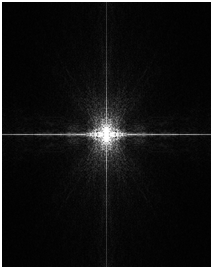

이산코사인변환(DCT)과는 달리 밝은 점이 중앙에 집중되어 있는 것이 보인다. DFT결과 이미지에서, 낮은 주파수 영역은 중앙에 가까이 있는 부분이고, 높은 주파수 영역은 중앙에서 멀리 떨어진 부분이다. 

복소수를 이용하는 것으로, $y$축에 대칭인 형태를 하고 있지 않는 주기함수에  대한 결과가 DFT 의 주파수 스펙트럼에 정확하게 나타날 수 있다. 6장에서 언급만 하고 넘어갔던 노이즈 제거(Noise  Reduction)에서는 DFT를 이용하는 것이 더 바람직한데, 이것은 노이즈가 $y$축에 대칭일지 아닐지는 알 수 없기 때문이다. 

이미지프로세싱에서 DCT가 더  많이 이용되기 때문이기도 하지만, 이퀄라이저와 같은 정보처리에서는 DFT를 더 자주 사용한다.

##### 여러 가지 이산코사인변환

이산코사인변환(DCT)는 크게 4가지가 있다.

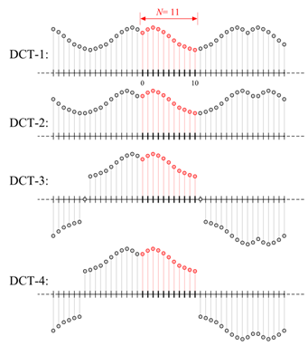

DCT-2가 위에서 언급한 DCT이고, DCT-1은 DCT알고리즘이다. DCT-1의 역은 DCT-1이며, DCT-2의 역은 DCT-3이고, DCT-4의 역은 DCT-4이다. 

이 중 JPEG압축에 사용되는 것은 DCT-2이고, DCT-1을 이용한 것은 Numpy에서 제공하는 FFT함수를 이용하기 위해 불가피했기 때문이다. DCT-1~4의 식은 차례로 아래와 같다. 이 컨텐츠에서 제공했던 식은 $\cos$함수의 계수를 맞추기 위해 앞에 상수($\frac{2}{N}$)가 곱해져 있었다. 
$$
\begin{align}

X_k
&= \frac{1}{2}(2_0 + (-1)^kx_{N-1})
+ \sum_{n=1}^{N-2} x_n \cos
\left[
	\frac{\pi}{N-1}nk
\right]
\qquad k=0, \dots, N-1
\\
X_k
&= \sum_{n=1}^{N-1}
x_n \cos
\left[
	\frac{\pi}{N}
	\left(
		n+\frac{1}{2}
	\right) k
\right]
\qquad k=0, \dots, N-1
\\
X_k
&= \frac{1}{2}x_0
+ \sum_{n=1}^{N-1}
x_n \cos 
\left[
	\frac{\pi}{N}n
	\left(
		k+\frac{1}{2}
	\right)
	k
\right]
\qquad k=0, \dots, N-1
\\
X_k
&= \sum_{n=1}^{N-1}
x_n \cos
\left[
	\frac{\pi}{N}
	\left(
		n+\frac{1}{2}
	\right)
	\left(
		k+\frac{1}{2}
	\right)
	k 
\right]
\qquad k=0, \dots, N-1
\end{align}
$$

##### 푸리에 변환의 네 가지 종류

푸리에 급수는 연속인 함수를 삼각함수들의 합으로 나타내는 것이었고, 이산푸리에변환은 불연속인 함수를 삼각함수들의 합으로 나타내는  것이었다. 그런데, 주파수 영역의 계수들은 모두 불연속적이었던 것을 기억하자. 연속함수 $f(x)$에 몇 개의 점을 찍어서 $f_n$을 만들었다. 반대로 주파수 스펙트럼의 $C_n$을 연속함수 $C(\omega)$로 만들 수 있을까? 

주파수 스펙트럼이 불연속적인 이유는 $2 \pi$마다 같은 값을 가지는 코사인함수는  반드시 꼴을 만족해야 했기 때문이었다. 주기를 갖고 있지 않는 함수에 대해서라면, 이것을 연속적인 주파수 스펙트럼으로 표현할 수 있을 것 같다. 이것이 바로 연속푸리에변환(Continuous Fourier Transform)의 개념이다. 어떤 함수 $f(x)$의 연속푸리에변환은 아래와 같이 구한다. 
$$
C(\omega)
= \int_{-\infty}^\infty
 f(x)e^{-i \omega x}
 \text{d}x
$$
여기서 $e^{i \omega x} = \cos \omega x + i \sin \omega x$이다. 이것을 오일러 공식이라고 하며, 복소수 지수를 계산하는 기본이 된다. 연속푸리에 변환은 푸리에 급수에서 $[-\pi, +\pi]$ 구간에만 적용되던 것을 $[-\infty, +\infty]$으로 확장시킨것이다. 적분구간도 그 구간으로 바뀐 것을 확인 할 수 있다.

푸리에 급수를 이산푸리에변환으로 근사한 것처럼, 푸리에 변환에서 $f(x)$를 불연속적인 값으로 바꾸려면 이산시간푸리에변환 (Descrete-Time Fourier Transform)이 완성된다.
$$
C(\omega)
= \sum_{-\infty}^\infty
 f_ke^{-i \omega x}
$$
이렇게 해서 푸리에 변환은 네가지 종류가 된다. 데이터가 시간영역(Time domain)과 주파수영역(Frequency domain)에서 연속적인지 이산적인지에 따라 나뉘는데, 이것을 표로 나타내면 아래와 같다.

| 수파수영역 \ 시간영역 | 연속적 (continuous) | 이산적 (descrete)  |
| :-------------------: | :-----------------: | :----------------: |
|  연속적 (continuous)  |   연속푸리에변환    | 이산시간푸리에변환 |
|   이산적 (descrete)   |     푸리에 급수     |   이산푸리에변환   |

 ##### 빠른 푸리에 변환

빠른 푸리에 변환(FFT, Fast  Fourier Transform)을 이용하면 DFT를 $N \log N$ 에 비례하는 시간만에 계산할 수 있다. 1942년에  고안된 이 알고리즘은 길이가 $N$인 데이터를 두 개의 데이터로 분할하여 DFT를 적용하고 다시 그것을 혼합하여 결과를 만드는  분할정복법(Divide and Conquer)을 이용한다. 데이터를 두 개로 나누어 정렬한 뒤 그것을 다시 혼합하는 합병정렬과  비슷한 원리이다. FFT의 원리를 개략적으로만 알아 보자.

$\omega = e^{i\frac{2\pi}{N}}$이라고 하면, 푸리에 변환은 아래와 같은 행렬연산으로 표현 할 수 있다.
$$
\begin{bmatrix}
C_0 \\ C_1 \\ C_2 \\ \vdots \\ C_{N-1}
\end{bmatrix}
=
\begin{bmatrix}
1 & 1 & 1 & \cdots & 1 \\
1 & \omega & \omega^2 & \cdots & \omega^{N-1} \\
1 & \omega^2 & \omega^4 & \cdots & \omega^{2{N-1}} \\
\vdots & \vdots & \vdots & \ddots & \vdots \\
1 & \omega^{N-1} & \omega^{2(N-1)} & \cdots & \omega^{(N-1)^2} \\
\end{bmatrix}
\begin{bmatrix}
f_0 \\ f_1 \\ f_2 \\ \vdots \\ f_{N-1}
\end{bmatrix}
$$
중앙의 행렬을 $F_N$으로 표현하면, 아래와 같은 식이 성립 한다.
$$
F_N
= \begin{bmatrix}
I_{\frac{N}{2}} && D_{\frac{N}{2}} \\
I_{\frac{N}{2}} && -D_{\frac{N}{2}} \\
\end{bmatrix}
\begin{bmatrix}
F_{\frac{N}{2}} && 0 \\
0 && F_{\frac{N}{2}} \\
\end{bmatrix}
P
$$
위 식에서 $2 \times 2$ 행렬은 각각의 행렬을  상하좌우로 연결한 행렬을 뜻한다. $I$는 대각선의 원소만 $1$이고 나머지 원소는 $0$인 항등행렬이다. $P$는 짝수행이 위쪽, 홀수행이 아래쪽에 바꾸어 주는 순열행렬(Permutation Matrix)이고, $D$는 $\omega$에 관한 정보를 담고 있는 대각행렬이다. 

결국 푸리에 변환은 $\begin{bmatrix}
f_0 & f_1 & f_2 & \cdots & f_{N-1}
\end{bmatrix}^\top$을 곱하는 것이고, 아래와 같이 해석할 수 있다.
$$
\begin{bmatrix}
C_0 \\ C_1 \\ C_2 \\ \vdots \\ C_{N-1}
\end{bmatrix}
=
F_N f
=

\begin{bmatrix}
I_{\frac{N}{2}} && D_{\frac{N}{2}} \\
I_{\frac{N}{2}} && -D_{\frac{N}{2}} \\
\end{bmatrix}
\begin{bmatrix}
F_{\frac{N}{2}} && 0 \\
0 && F_{\frac{N}{2}} \\
\end{bmatrix}
P

\begin{bmatrix}
f_0 \\ f_1 \\ f_2 \\ \vdots \\ f_{N-1}
\end{bmatrix}
$$
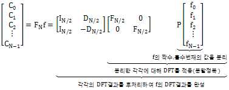

FFT가 없었더라면 고양이 사진 하나를  변환하는 데에 수십 분이 걸렸을 것이고, 푸리에 변환을 이용한 응용결과 조차 없었을 것이다. MIT교수 Gilbert  Strang은 FFT를 "우리 세대의 가장 아름다운 알고리즘"으로 묘사했다. FFT의 정확한 유도 방법이 알고 싶은 사람은, 아래 링크를 이용하자. 

##### 수학물리학에 응용

물리학에서는, 특정한 미분방정식(Differential Equation)과 경계조건(Boundary Condition)을 만족하는  필드(Field)를 구하는 문제를 자주 접할 수 있다. 대표적인 예로, 균일한 전기장 안에 전도체가 들어 있을 때 유도되는  전기장을 구한다든지, 경계면의 온도가 일정하게 유지되는 방의 온도 분포를 구한다든지 하는 것들이다. 첫 번째 경우에서는 도체  외부의 전기장의 라플라시안(Laplacian)이 0이 되는 것이 미분방정식이고, 도체 표면에서의 전위가 균일하다는 것이  경계조건이다. 두 번째 경우엔 열전도방정식이 미분방정식에 해당하고, 표면에서 유지되는 온도가 경계조건에 해당한다. 

이러한 문제들을 해결할 때는, 구하고자 하는 해가 푸리에 급수라고 가정한 뒤 미정계수법을 사용하게 된다. 우선 계수를 정하지 않은 채 푸리에 급수로 답을 적은 뒤, 경계조건을 대입하여 계수를 결정할 수  있다. 이 때, $F(x,y)$꼴의 해를 $X(x)Y(y)$와 같이 각 변수들만의 함수들의 곱으로 표현하는 변수분리(Separation  of Variables)라는 방법이 이용된다. 

하지만 손으로 이것을 계산할 수 있는 경우는 도체가 완벽한 구(Sphere)이거나 방이 완벽한 직육면체일 때처럼 이상적인 경우 뿐이고, 대부분의 경우 수치적인 계산에 의존해야 한다. 이 때 푸리에 변환이 필수적으로 사용된다. 아래는 수치적으로 방의 열평형상태를 구한 이미지이다. 

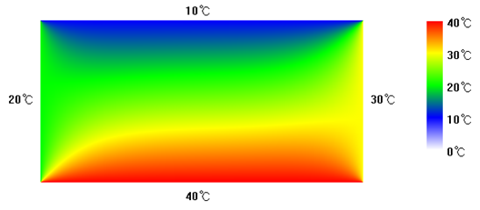

푸리에급수가 물리학에서 응용되는 분야에 관심이 많은 학생은, 수리물리학이나 전자기학의 전공도서에서 관련된 방법을 찾아볼 수 있다. 하지만 편미분방정식에 대한 이해가 불가피해서 난이도가 좀 있다.

##### 필터디자인

금까지는 DCT나 DFT를 컴퓨터상에서 직접 계산하는 것만 다루었다. 이것을 **디지털 필터 (Digital Filter)**라고 한다. 하지만 라디오를 비롯한 무선기기에서는 저항, 축전기, 코일 등의 소자들이 가지고 있는 물리학적인 성질을 이용하여 필터를 사용하기도 한다. 

저항은 일반적으로 전류나 전압의 변화에 상관없이 작동하며, 전압과 전류의  비율을 조절하는 역할을 한다. 하지만 축전기는 빠르게 변화하는 전압에는 반응하지만 느리게 바뀌는 전압에는 끊어진 회로처럼  반응한다. 코일의 경우 축전기와는 반대로 느리게 변화하는 전압에는 그냥 전선이 이어진 것처럼 반응하지만, 빠르게 변화하는 전압에는 코일 내부에 생긴 자기장에 의해 방해를 받는다. 이러한 원리를 이용하여 만든 필터를 **아날로그 필터(Analog Filter)**라고 한다. 디지털 필터는 이산적으로 샘플링된 데이터를 이용하기 때문에 생기는 오차가 발생하고, 아날로그 필터는 물리적인 측정오차나, 소자들의 비선형성(nonlinearity)에 의한 오차가 발생한다. 

다음은 저항, 축전기, 코일 등을 이용하여 필터를 만든 예이다. 

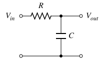 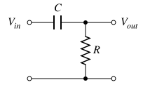

< 축전기와 저항을 이용한 Low-pass Filter (왼쪽)와 High-pass Filter(오른쪽) > 

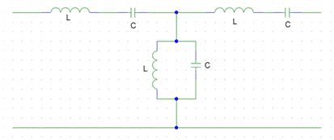

## 참조

- [Kylog: 이미지프로세싱](https://kylog.tistory.com/13)

- [우주벌레: 이산 푸리에 변환](https://m.blog.naver.com/PostView.nhn?blogId=spacebug&logNo=220649543743&proxyReferer=https%3A%2F%2Fwww.google.com%2F)

- [다크프로그래머](https://darkpgmr.tistory.com/171)