# Mel Frequency Cepstral Coefficient (MFCC) tutorial

The first step in any automatic speech recognition system is to  extract features i.e. identify the components of the audio signal that  are good for identifying the linguistic content and discarding all the other stuff which carries  information like background noise, emotion etc.  

The main point to understand about speech is that the sounds  generated by a human are filtered by the shape of the vocal tract  including tongue, teeth etc. This shape determines what sound comes out. If we can determine the shape  accurately, this should give us an accurate representation of the [phoneme](http://en.wikipedia.org/wiki/Phoneme)  being produced. The shape of the vocal tract manifests itself in the envelope of the  short time power spectrum, and the job of MFCCs is to accurately  represent this envelope. This page will provide a short tutorial on  MFCCs.

Mel Frequency Cepstral Coefficents (MFCCs) are a feature widely used  in automatic speech and speaker recognition. They were introduced by Davis and Mermelstein in the 1980's, and have been state-of-the-art  ever since. Prior to the introduction of MFCCs, Linear Prediction Coefficients (LPCs) and Linear Prediction Cepstral Coefficients (LPCCs) (click [here for a tutorial on cepstrum and LPCCs](http://www.practicalcryptography.com/miscellaneous/machine-learning/tutorial-cepstrum-and-lpccs/)) and were the main feature type for automatic speech recognition (ASR), especially with [HMM](http://practicalcryptography.com/miscellaneous/machine-learning/hidden-markov-model-hmm-tutorial/) classifiers. This page will go over the main aspects of MFCCs, why they make a good feature for ASR, and how to implement them. 

## Steps at a Glance 

We will give a high level intro to the implementation steps, then go  in depth why we do the things we do. Towards the end we will go into a more detailed description of how to calculate MFCCs.

1. Frame the signal into short frames.
2. For each frame calculate the [periodogram estimate](http://en.wikipedia.org/wiki/Periodogram) of the power spectrum.
3. Apply the mel filterbank to the power spectra, sum the energy in each filter.
4. Take the logarithm of all filterbank energies.
5. Take the DCT of the log filterbank energies.
6. Keep DCT coefficients 2-13, discard the rest.

There are a few more things commonly done, sometimes the frame energy is appended to each feature vector. [Delta and Delta-Delta](http://practicalcryptography.com/miscellaneous/machine-learning/guide-mel-frequency-cepstral-coefficients-mfccs/#deltas-and-delta-deltas) features  are usually also appended. Liftering is also commonly applied to the final features.

## Why do we do these things? 

We will now go a little more slowly through the steps and explain why each of the steps is necessary.

An audio signal is constantly changing, so to simplify things we  assume that on short time scales the audio signal doesn't change much  (when we say it doesn't change, we mean statistically i.e. statistically  stationary, obviously the samples are constantly changing on even short  time scales). This is why we frame the signal into 20-40ms frames. If the frame is much shorter we don't have enough  samples to get a reliable spectral estimate, if it is longer the signal  changes too much throughout the frame.

The next step is to calculate the power spectrum of each frame. This  is motivated by the human cochlea (an organ in the ear) which vibrates  at different spots depending  on the frequency of the incoming sounds. Depending on the location in  the cochlea that vibrates (which wobbles small hairs),  different nerves fire informing the brain that certain frequencies are  present. Our periodogram estimate performs a similar job for us, identifying  which frequencies are present in the frame.

The periodogram spectral estimate still contains a lot of information  not required for Automatic Speech Recognition (ASR). In particular the  cochlea can not discern the difference between two closely spaced frequencies. This effect becomes more pronounced as the frequencies  increase. For this reason we take clumps of periodogram bins and sum  them up to get an idea of how much energy exists in various frequency regions. This is performed by our Mel  filterbank: the first filter is very narrow and gives an indication of  how much energy exists near 0 Hertz. As the frequencies get higher our filters get wider as we become less concerned  about variations. We are only interested in roughly how much energy  occurs at each spot. The Mel scale tells us exactly how to space our filterbanks and how wide to make them.  See [below](http://practicalcryptography.com/miscellaneous/machine-learning/guide-mel-frequency-cepstral-coefficients-mfccs/#computing-the-mel-filterbank) for how to calculate the spacing.

Once we have the filterbank energies, we take the logarithm of them.  This is also motivated by human hearing: we don't hear loudness on a  linear scale. Generally to double the percieved volume of a sound we need to put 8 times as much energy  into it.  This means that large variations in energy may not sound all that  different if the sound is loud to begin with. This compression operation  makes our features match more closely what humans actually hear. Why  the logarithm and not a cube root? The logarithm allows us to use  cepstral mean subtraction, which is a channel normalisation technique.

The final step is to compute the DCT of the log filterbank energies.  There are 2 main reasons this is performed. Because our filterbanks are  all overlapping, the filterbank energies are quite correlated with each other. The DCT decorrelates the  energies which means diagonal covariance matrices can be used to model  the features in e.g. a HMM classifier. But notice that only 12 of the 26 DCT coefficients are kept. This is  because the higher DCT coefficients represent fast changes in the  filterbank energies and it turns out that these fast changes actually degrade ASR performance, so we get a small  improvement by dropping them. 

## What is the Mel scale? 

The Mel scale relates perceived frequency, or pitch, of a pure tone to its actual measured frequency. Humans are much better at discerning small changes in pitch at low frequencies than they are at high frequencies. Incorporating this scale makes our features match more closely what humans hear. 

The formula for converting from frequency to Mel scale is:

  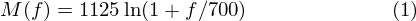

To go from Mels back to frequency:


## Implementation steps 

We start with a speech signal, we'll assume sampled at 16kHz.

### Step 1.

Frame the signal into 20-40 ms frames. 25ms is standard. This  means the frame length for a 16kHz signal is 0.025*16000 = 400 samples.   Frame step is usually something like 10ms (160 samples), which allows some overlap to the frames.  The first 400 sample frame starts at sample 0, the next 400 sample frame  starts at sample 160 etc. until the end of the speech file is reached. If the speech file does not divide into  an even number of frames, pad it with zeros so that it does.

The next steps are applied to every single frame, one set of 12 MFCC  coefficients is extracted for each frame. A short aside on notation: we call our time domain signal 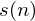. Once it is framed we have 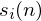 where n ranges over 1-400 (if our frames are 400 samples) and  ranges over the number of frames. When we calculate the complex DFT, we get 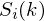 - where the  denotes the frame number corresponding to the time-domain frame. 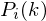 is then the power spectrum of frame .

### Step 2.

To take the Discrete Fourier Transform of the frame, perform the following:


where 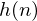 is an  sample long analysis window (e.g. hamming window), and 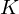 is the length of the DFT. The periodogram-based power spectral estimate for the speech frame  is given by: 


This is called the Periodogram estimate of the power spectrum. We  take the absolute value of the complex fourier transform, and square the  result.  We would generally perform a 512 point FFT and keep only the first 257 coefficents.

### Step 3.

Compute the Mel-spaced filterbank. This is a set of 20-40 (26 is  standard) triangular filters that we apply to the periodogram power  spectral estimate from step 2. Our filterbank comes in the form of 26 vectors of length 257 (assuming the FFT settings  fom step 2). Each vector is mostly zeros, but is non-zero for a certain  section of the spectrum. To calculate filterbank energies we multiply each filterbank with the power  spectrum, then add up the coefficents. Once this is performed we are  left with 26 numbers that give us an indication of how much energy was in each filterbank. For a  detailed explanation of how to calculate the filterbanks see [below](http://practicalcryptography.com/miscellaneous/machine-learning/guide-mel-frequency-cepstral-coefficients-mfccs/#computing-the-mel-filterbank). Here is a plot to hopefully clear things up:

​     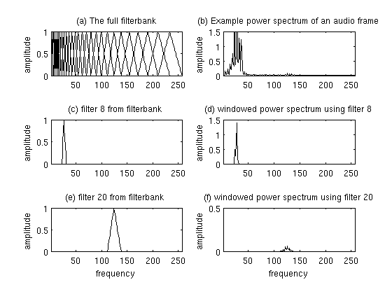     Plot of Mel Filterbank and windowed power spectrum 

\4. Take the log of each of the 26 energies from step 3. This leaves us with 26 log filterbank energies. 

\5. Take the Discrete Cosine Transform (DCT) of the 26 log filterbank  energies to give 26 cepstral coefficents. For ASR, only the lower 12-13  of the 26 coefficients are kept.

The resulting features (12 numbers for each frame) are called Mel Frequency Cepstral Coefficients.

## Computing the Mel filterbank 

In this section the example will use 10 filterbanks because it is easier to display, in reality you would use 26-40 filterbanks.

To get the filterbanks shown in figure 1(a) we first have to choose a  lower and upper frequency. Good values are 300Hz for the lower and  8000Hz for the upper frequency. Of course if the speech is sampled at 8000Hz our upper frequency is limited to  4000Hz. Then follow these steps:

1. Using [equation 1](http://practicalcryptography.com/miscellaneous/machine-learning/guide-mel-frequency-cepstral-coefficients-mfccs/#eqn1), convert the upper and lower frequencies to Mels. In our case 300Hz is 401.25 Mels and 8000Hz is 2834.99 Mels.

2. For this example we will do 10 filterbanks, for which we need 12  points. This means we need 10 additional points spaced linearly between  401.25 and 2834.99. This comes out to: 

   ```
   m(i) = 401.25, 622.50, 843.75, 1065.00, 1286.25, 1507.50, 1728.74, 
          1949.99, 2171.24, 2392.49, 2613.74, 2834.99
   ```

3. Now use 

   equation 2

    to convert these back to Hertz: 

   ```
   h(i) = 300, 517.33, 781.90, 1103.97, 1496.04, 1973.32, 2554.33, 
          3261.62, 4122.63, 5170.76, 6446.70, 8000
   ```

    Notice that our start- and end-points are at the frequencies we wanted. 

4. We don't have the frequency resolution required to put filters at the exact points calculated above, so we need     to round those frequencies to the nearest FFT bin. This process does not affect the accuracy of the features.     To convert the frequncies to fft bin numbers we need to know the FFT size and the sample rate,     

   ```
   f(i) = floor((nfft+1)*h(i)/samplerate)
   ```

   ​     This results in the following sequence: 

   ```
   f(i) =  9, 16,  25,   35,   47,   63,   81,  104,  132, 165,  206,  256
   ```

    We can see that the final filterbank finishes at bin 256, which corresponds to 8kHz with a 512 point FFT size. 

5. Now we create our filterbanks. The first filterbank will start at  the first point, reach its peak at the second point, then return to zero  at the 3rd point. The second filterbank will start at the 2nd point,  reach its max at the 3rd, then be zero at the 4th etc. A formula for  calculating these is as follows:
    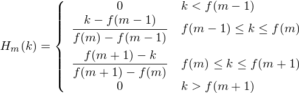
    where  is the number of filters we want, and  is the list of M+2 Mel-spaced frequencies.  

The final plot of all 10 filters overlayed on each other is:

​     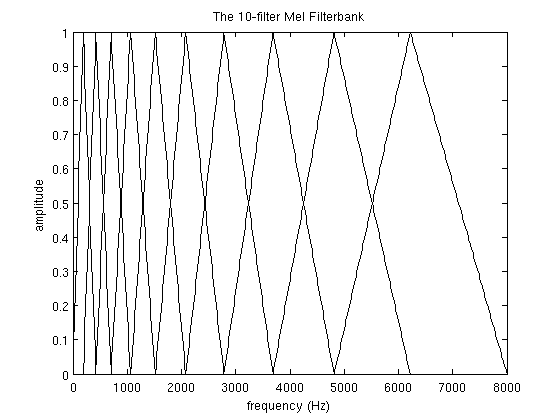     A Mel-filterbank containing 10 filters. This filterbank  starts at 0Hz and ends at 8000Hz. This is a guide only, the worked  example above starts at 300Hz. 

## Deltas and Delta-Deltas 

Also known as differential and acceleration coefficients. The MFCC  feature vector describes only the power spectral envelope of a single  frame, but it seems like speech would also have information in the  dynamics i.e. what are the trajectories of the MFCC coefficients over  time. It turns out that calculating the MFCC trajectories and appending them to the  original feature vector increases ASR performance by quite a bit (if we  have 12 MFCC coefficients, we would also get 12 delta coefficients,  which would combine to give a feature vector of length 24).

To calculate the delta coefficients, the following formula is used:

 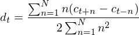 

where 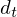 is a delta coefficient, from frame  computed in terms of the static coefficients 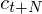 to . A typical value for   is 2. Delta-Delta (Acceleration) coefficients are calculated in the  same way, but they are calculated from the deltas, not the static  coefficients.

## Implementations 

I have implemented MFCCs in python, available [here](https://github.com/jameslyons/python_speech_features). Use the 'Download ZIP' button on the right hand side of the page to get the code. Documentation can be found at [readthedocs](http://python-speech-features.readthedocs.org/en/latest/). If you have any troubles or queries about the code, you can leave a comment at the bottom of this page.

There is a good MATLAB implementation of MFCCs [over here](http://labrosa.ee.columbia.edu/matlab/rastamat/).

## References 

Davis, S. Mermelstein, P. (1980) *Comparison of Parametric Representations for Monosyllabic Word Recognition in Continuously Spoken Sentences*. In IEEE Transactions on Acoustics, Speech, and Signal Processing, Vol. 28 No. 4, pp. 357-366

X. Huang, A. Acero, and H. Hon. *Spoken Language Processing: A guide to theory, algorithm, and system development*. Prentice Hall, 2001.

## Related pages on this site: 

- [A tutorial on LPCCs and Cepstrum](http://practicalcryptography.com/miscellaneous/machine-learning/tutorial-cepstrum-and-lpccs/)
- [Hidden Markov Model (HMM) tutorial](http://practicalcryptography.com/miscellaneous/machine-learning/hidden-markov-model-hmm-tutorial/)
- [Gaussian Mixture Models (GMMs) and the EM Algorithm](http://practicalcryptography.com/miscellaneous/machine-learning/gaussian-mixture-model-tutorial/)
- [An Intuitive Guide to the Discrete Fourier Transform](http://practicalcryptography.com/miscellaneous/machine-learning/intuitive-guide-discrete-fourier-transform/)

---

# MFCC 자습서

ASR (Auto Speech Recognition) 시스템의 첫 번째 단계는 특징을 추출하는 것입니다. 즉, 언어 컨텐츠를 식별하고 배경 소음, 감정 등과 같은 정보를 전달하는 다른 모든 것을 버리는 데 적합한 오디오 신호의 구성 요소를 식별하는 것입니다.

음성에 대해 이해해야 할 주요 요점은 사람이 생성 한 소리가 혀, 이빨 등을 포함한 성대 형태로 필터링된다는 것입니다.이 형태는 어떤 소리가 나오는지를 결정합니다. 모양을 정확하게 결정할 수 있다면, 생성되는 음소를 정확하게 표현할 수 있을 것입니다. 성대의 형태는 단시간 전력 스펙트럼의 엔벌로프에서 나타나며 MFCC의 역할은 이 엔벨로프를 정확하게 나타내는 것입니다. 이 페이지는 MFCC에 대한 간단한 자습서를 제공합니다.

MFCC(Mel Frequency Cepstral Coefficient)는 자동 음성 및 스피커 인식에 널리 사용되는 기능입니다. 그들은 1980 년대에 Davis와 Mermelstein에 의해 소개되었으며, 그 이후로 최첨단 기술이되었습니다. MFCC를 도입하기 전에 LPC (Linear Prediction Coefficients) 및 LPCC (Linear Prediction Cepstral Coefficients)이며 특히 HMM 분류기를 사용하는 자동 음성 인식 (ASR)의 주요 기능 유형이었습니다. 이 페이지에서는 MFCC의 주요 측면, ASR에 유용한 기능 및 구현 방법에 대해 설명합니다.

## 한눈에 보는 단계

우리는 구현 단계에 대해 높은 수준의 소개를 한 다음 왜 우리가 하는 일을 하는지 깊이있게 다룰 것입니다. 마지막으로 MFCC를 계산하는 방법에 대해 더 자세히 설명하겠습니다.

- 신호를 짧은 프레임으로 구성합니다.
- 각 프레임에 대해 전력 스펙트럼의 주기도 추정치를 계산 합니다.
- 멜 필터 뱅크를 전력 스펙트럼에 적용하고 각 필터의 에너지를 합산 합니다.
- 모든 필터 뱅크 에너지의 로그를 취합니다.

- 로그 필터 뱅크 에너지의 DCT를 가져옵니다.
- DCT 계수를 2-13으로 유지하고 나머지는 버립니다.

일반적으로 수행되는 작업이 몇 가지 더 있으며 때로는 프레임 에너지가 각 특징 벡터에 추가됩니다. 델타 및 델타-델타 기능도 일반적으로 추가됩니다. 리프팅은 일반적으로 최종 기능에도 적용됩니다.

## 왜 이것을 해야 할까요?

이제 단계를 조금 더 천천히 진행하고 각 단계가 필요한 이유를 설명하겠습니다.

오디오 신호는 지속적으로 변하기 때문에 짧은 시간에 오디오 신호가 크게 변하지 않는다고 가정하는 것을 단순화하기 위해 (우리가 그것이 변하지 않는다고 말할 때, 우리는 통계적으로 의미합니다. 즉, 통계적으로 고정적입니다. 분명히 샘플은 짧은 시간 규모에서도 끊임없이 변화하고 있습니다.). 이것이 우리가 신호를 20-40ms 프레임으로 만드는 이유입니다. 프레임이 훨씬 짧으면 신뢰할 수있는 스펙트럼 추정치를 얻을 수 있는 샘플이 충분하지 않습니다. 프레임이 길면 신호가 프레임 전체에서 너무 많이 변경됩니다.

다음 단계는 각 프레임의 전력 스펙트럼을 계산하는 것입니다. 이것은 들어오는 소리의 주파수에 따라 다른 지점에서 진동하는 인간 달팽이관 (귀의 기관)에 의해 유발됩니다. 진동하는 달팽이관의 위치에 따라 (작은 모발이 흔들리는) 다른 신경이 발화되어 특정 주파수가 존재한다는 것을 뇌에 알려줍니다. 우리의 주기도 추정은 우리에게 비슷한 작업을 수행하여 프레임에 어떤 주파수가 있는지 식별합니다.

주기도 스펙트럼 추정값에는 여전히 ASR (Automatic Speech Recognition)에 필요하지 않은 많은 정보가 포함되어 있습니다. 특히 달팽이관은 밀접하게 이격 된 두 주파수 간의 차이를 식별 할 수 없습니다. 이 효과는 주파수가 증가함에 따라 더욱 두드러집니다. 이러한 이유로 우리는 주기도 빈의 덩어리를 취해 여러 주파수 영역에 얼마나 많은 에너지가 존재하는지에 대한 아이디어를 얻습니다. 이는 Mel 필터 뱅크에 의해 수행됩니다. 첫 번째 필터는 매우 좁으며 0 Hertz 근처에 얼마나 많은 에너지가 존재하는지 나타냅니다. 주파수가 높아질수록 변동에 대한 걱정이 줄어들수록 필터가 넓어집니다. 우리는 대략 각 지점에서 얼마나 많은 에너지가 발생하는지에 관심이 있습니다. Mel 스케일은 필터 뱅크의 간격을 어떻게 정하고 얼마나 넓게 만들 수 있는지 알려줍니다. 간격을 계산하는 방법은 아래를 참조하십시오.

필터 뱅크 에너지가 확보되면 로그를 취합니다. 이것은 또한 인간의 청각에 의해 유발됩니다 : 우리는 선형 적으로 소리가 들리지 않습니다. 일반적으로 감지되는 음량을 두 배로 늘리려면 8 배의 에너지를 넣어야합니다. 즉, 소리가 크게 들리면 에너지의 큰 변화가 다를 수는 없습니다. 이 압축 작업은 우리의 기능이 사람이 실제로 듣는 것과 더 밀접하게 일치하도록 합니다. 왜 큐브 루트가 아닌 로그인가? 로그는 채널 정규화 기술인 두근 평균 뺄셈을 사용할 수 있게 합니다.

마지막 단계는 로그 필터 뱅크 에너지의 DCT를 계산하는 것입니다. 이것이 수행되는 두 가지 주요 이유가 있습니다. 필터 뱅크가 모두 겹치므로 필터 뱅크 에너지는 서로 매우 밀접한 관련이 있습니다. DCT는 에너지를 관련시킵니다. 즉 대각선 공분산 행렬을 사용하여 형상을 모델링 할 수 있습니다. HMM 분류기. 그러나 26 개의 DCT 계수 중 12 개만 유지됩니다. DCT 계수가 높을수록 필터 뱅크 에너지의 빠른 변화를 나타 내기 때문에 이러한 빠른 변화는 실제로 ASR 성능을 저하시키는 것으로 나타났습니다.

## 멜 스케일은 무엇입니까?

Mel 스케일은 순수한 톤의 인식 된 주파수 또는 피치를 실제 측정 된 주파수와 관련시킵니다. 인간은 고주파수보다 저주파수에서 피치의 작은 변화를 식별하는 것이 훨씬 낫습니다. 이 척도를 통합하면 우리의 기능이 사람의 의견과 더 일치하게됩니다.

주파수에서 멜 스케일로 변환하는 공식은 다음과 같습니다.


멜 스케일에서 주파수로 돌아가려면 :

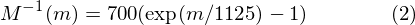

## 구현 단계

음성 신호로 시작해서 16kHz로 샘플링했다고 가정하겠습니다.

### Step 1.

신호를 20-40ms 프레임으로 프레임하십시오. 25ms가 표준입니다. 이것은 16kHz 신호의 프레임 길이가 0.025 * 16000 = 400 샘플임을 의미합니다. 프레임 단계는 일반적으로 10ms (160 개 샘플)와 비슷하며 프레임과 겹칠 수 있습니다. 첫 번째 400 샘플 프레임은 샘플 0에서 시작하고 다음 400 샘플 프레임은 음성 파일의 끝에 도달 할 때까지 샘플 160 등에서 시작합니다. 음성 파일이 짝수 개의 프레임으로 분할되지 않으면 0으로 채웁니다.

다음 단계는 모든 단일 프레임에 적용되며 각 프레임에 대해 12 개의 MFCC 계수 세트가 추출됩니다. 표기법에 대한 짧은 점 : 우리는 시간 도메인 신호를 $s(n)$라고 부릅니다.  일단 프레임되면 $s_i(n)$가 있으며 여기서 $n$은 1-400 (프레임이 400 샘플 인 경우) 이상이고 $i$는 프레임 수에 걸쳐 있습니다.

복소수 DFT를 계산할 때 $S_i(k)$를 얻습니다. 여기서 $i$는 시간 영역 프레임에 해당하는 프레임 번호를 나타냅니다. $P_i(k)$는 프레임 $i$의 전력 스펙트럼입니다.

### Step 2.

프레임의 이산 푸리에 변환을 수행하려면 다음을 수행하십시오:

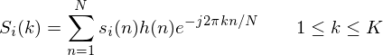

여기서 $h(n)$는 $N$ 샘플 긴 분석 창 (예 : 해밍 창)이고 $K$는 DFT의 길이입니다. 음성 프레임 $s_i(n)$에 대한 주기도 기반 전력 스펙트럼 추정치는 다음과 같이 주어진다.

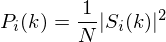

이것을 전력 스펙트럼의 주기도 추정이라고 합니다. 복소 푸리에 변환의 절대 값을 취하고 결과를 제곱합니다. 일반적으로 512 포인트 FFT를 수행하고 처음 257 개의 계수 만 유지합니다.

### Step 3.

멜 간격 필터 뱅크를 계산합니다. 이것은 2 단계의 주기도 전력 스펙트럼 추정치에 적용되는 20-40 (26 표준) 삼각형 필터 세트입니다. 필터 뱅크는 길이가 257 인 26 개의 벡터 형태입니다 (FFT 설정이 2 단계 인 경우). 각 벡터는 대부분 0이지만 스펙트럼의 특정 섹션에서는 0이 아닙니다. 필터 뱅크 에너지를 계산하기 위해 각 필터 뱅크에 전력 스펙트럼을 곱한 다음 계수를 더합니다. 이 작업이 수행되면 26 개의 숫자가 남아 각 필터 뱅크의 에너지 양을 나타냅니다. 필터 뱅크 계산 방법에 대한 자세한 설명은 아래를 참조하십시오. 다음은 희망 사항을 정리하는 도표입니다.


## 참조

- 원문: http://practicalcryptography.com/miscellaneous/machine-learning/guide-mel-frequency-cepstral-coefficients-mfccs/