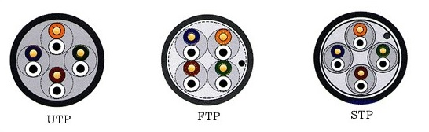
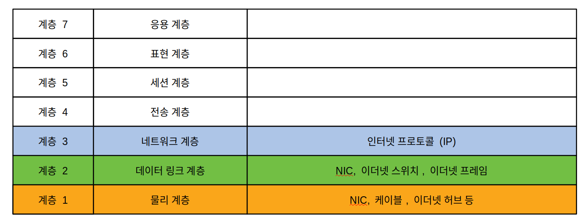
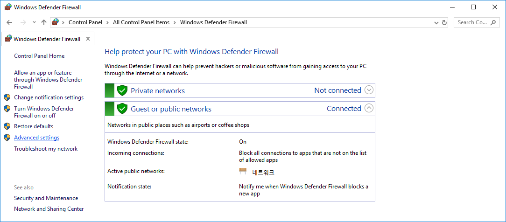
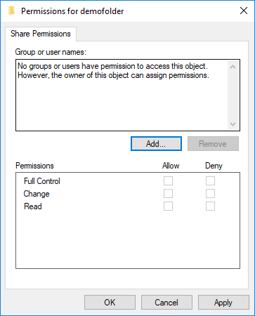

필드엔지니어를 위한

# 컴퓨터 통신 (computer communication)

이 자료는 사내 서비스팀의 교육을 위해 제작되었습니다. 필자는 네트워크 엔지니어(network engineer)가 아닌 소프트웨어 개발자(software developer)로, 이 글은 소프트웨어 개발자의 시각으로 제한 될 가능성이 있습니다.

## 통신이란? (communication)

통신은 매체를 통하여 정보를 전달하는 것을 말합니다. 과거에 봉화, 북(drum), 꽹과리로 전달하던 것 부터 시작하여 파발, 우편, 전신, 전화, 방송등이 있었고, 현대에는 인터넷(internet), 위성(satlite)을 통한 정보 전달을 할 수 있게 되었습니다.

컴퓨터 통신이란 네트워크를 이용하여 컴퓨터끼리 정보를 주고 받을 수 있게 하는 기술입니다. 컴퓨터 통신의 발달은 대규모 정보를 빠르게 전송할 수 있게 하였습니다.

## 통신의 방향 (매우 중요)

통신 매체의 양 종단(endpoint)에는 송신자와 수신자가 있습니다. 송신자는 정보를 보내는 종단, 수신자는 정보를 받는 종단입니다.


### 통신의 주체: 앨리스와 밥

통신, 암호학, 물리에서 자주 사용하는 가상의 이름(placeholder)입니다. 알파벳 순으로 이름을 가지며, 홀수번째는 여성, 짝수번째는 남성의 이름을 줍니다. **이 문서에서는 앨리스, 밥, 캐롤, 이브 정도만 사용될 것이며 나머지는 재미로 봐주시기 바랍니다.**

| 알파벳 |               이름                | 설명                                                         |
| :----: | :-------------------------------: | ------------------------------------------------------------ |
| **A**  |         **Alice 앨리스**          | **통신의 첫번째 당사자입니다.**                              |
| **B**  |            **Bob 밥**             | **통신의 두번째 당사자입니다.**                              |
| **C**  |   **Carol 캐롤, Charlie 찰리**    | **통신의 세번째 당사자입니다.**                              |
|   C    |             Chuck 척              | 통신의 세번째 당사자이며 악의가 있습니다. (해커)             |
|   D    | Dave 데이브, Dan 댄, David 데이빗 | 통신의 네번째 당사자입니다.                                  |
| **E**  |           **Eve 이브**            | **통신을 엿듣는자(Eavesdropper)로 소극적 공격자입니다.**     |
|   F    |           Frank 프랭크            | 여섯번째 당사자입니다.                                       |
|   G    |          Grace 그레이스           | 정부(Government)의 대표(Representitave를 뜻합니다.           |
|   H    |           Heidi 하이디            | 멍청한 암호제작자를 뜻하나 거의 사용되지 않습니다.           |
|   I    |           Isaac 아이작            | 정보 서비스 제공자(Information Service Provider)를 뜻합니다. |
|   I    |             Ivan 이반             | 인증서 등의 발행자 (Issuer)를 뜻합니다.                      |
|   J    |           Justin 저스틴           | 법원 (Justice System)을 뜻합니다.                            |
|   M    |          Mallory 말로리           | 악의적인(Malicious)을 뜻하며 적극적 공격자를 뜻합니다.       |
|   O    |           Oscar 오스카            | 적(opponent)으로 적극적인 공격자의 역할입니다.               |
|   P    |            Peggy 페기             | 증명자(prover)로 지식증명에 자주 사용됩니다.                 |
|   S    |           Sybil 사이빌            | 익명공격자 (Pseudonymous attacker)로 sybil attack를 합니다.  |
|   T    |           투루디 Trudy            | 침입자(Instruder)로 적극적 공격자 입니다.                    |
|   T    |           트렌트 Trent            | 신뢰할 수 있는 중재자(trusted arbitrator)로 중립적인 3자입니다. |
|   T    |             테드 Ted              | 신뢰할 수 있는 중재자(trusted arbitrator)로 중립적인 3자입니다. |
|   V    |            빅터 Victor            | 검증자 (verifier)로 증명자 P와의 동작을 증명합니다.          |
|   W    |            월터 Walter            | 통신을 감시하는 간수 (warden)을 뜻합니다.                    |
|   W    |            웬디 Wendy             | 내부고발자 (whistleblower)를 말합니다.                       |
|   Z    |             조 (Zoe)              | 맨 마지막 당사자를 말합니다.                                 |

### 단뱡향(simplex) 통신

일방은 보낼 수만 있고, 일방은 받을 수만 있는 통신 방법을 단뱡항(Simplex; 심플렉스) 통신이라고 합니다. 대표적인 단방향 통신으로 방송(Broadcast; 브로드캐스트)이 있습니다. 과거에 사용되었던 봉화, 북, 꽹과리도 단방향 통신에 해당합니다.

과거에 군대는 깃발이나 북(drum)을 통신 수단으로 사용하였습니다. 북으로 통신을 하면 북을 가지고 있으며 북으로 말하는 방법을 아는 사람만이 정보를 전달 할 수 있습니다. 북은 공기를 매체로 하며, 라디오는 전파를 매체로 합니다.

아래는 단방향 통신에 대한 그림입니다.


앨리스(Alice)가 송신기를 가지고, 수신기를 가진 밥(Bob)에게 일방적으로 정보를 보내고 있으며 밥은 앨리스에게 정보를 보낼 수 없습니다.

### 양방향(duplex; 듀플렉스) 통신

쌍방이 상호 정보를 주고 받을 수 있으려면, 각 일방은 송신기능과 수신기능을 갖춰야 합니다. 이것을 양방향 통신이라고 합니다. 양방향 통신에는 2가지 방식이 있습니다.

#### 전이중(full-duflex; 풀듀플렉스) 통신

전이중 통신이랑 양방이 동시에 정보를 보내면서 받을 수 있는 통신을 말합니다. 동시에 주고 받으려면 양방은 송신기 및 수신기 뿐만 아니라 미디어도 2개 또는 2개 채널이 필요 합니다. 일반적으로 유선 음성 전화가 양방향 통신입니다.

아래는 전이중통신에 대한 그림입니다.


앨리스와 밥은 송신기와 수신기를 둘 모두 가지고 있습니다. 통신 매체도 2개로 하나의 통신 매체는 앨리스의 정보를 밥에게 전달하고, 다른 하나의 통신 매체는 밥의 정보를 앨리스에게 전달 합니다.

#### 반이중(half-duflex; 하프듀플렉스) 통신

인간이 일반적인 대화 할때 양방이 동시에 말하며 듣지 않습니다. 앨리스가 말하면 밥은 듣기만하고, 밥이 말하면 앨리스는 듣기만 합니다. 컴퓨터 통신에서 이것을 반이중통신이라고 합니다.

아래는 반이중통신에 대한 그림입니다.


앨리스와 밥은 송신기와 수신기를 둘다 가지고 있는데, 송신기 수신기 두개의 쌍이 하나의 미디어를 공유하고 있습니다. 하나의 통신 미디어를 다수의 송수신기가 공유하기 때문에 어느 일방의 송신기만 정보를 미디어에 방출할 수 있고, 다른 일방은 들을 수만 있습니다.

아래 그림을 보면 앨리스가 일방적으로 밥에게 정보를 보내고, 밥은 받기만 하고 있습니다. 밥이 정보를 보내면 통신미디어에서 신호가 간섭하기 때문에 양측이 보낸 정보가 소실 됩니다. 따라서 밥은 정보를 보낼 수 없으며 앨리스가 전송을 마칠때까지 기다렸다가 전송해야 합니다.


밥이 전송을 시작하면 이번에는 앨리스는 받기만 합니다.


전이중통신은 양방이 동시에 정보를 보내고 받을 수 있어야 하므로 더 좋은 통신 방식이 아닌가 하는 생각도 들 것입니다. 전이중 통신을 가능하게 하려면  2개의 미디어나 채널을 사용해야 합니다. 짧은 거리라면 비용이 많이 들지 않지만, 수백킬로의 거리에 선로를 설치해야 한다면 많은 비용이 들게 됩니다. 반이중통신은 하나의 미디어나 채널 만으로 양방이 교대로 송수신을 할 수 있으므로 미디어 설치 비용이 절감 됩니다.

반이중통신은 어느 한 순간에 일방만이 송신할 수 있지만, 규약에 따라 고속으로 빠르게 송신할 수 있는 기술이 적용된다면 마치 전이중처럼 보이게 됩니다. 현대의 많은 통신들이 빠른 반이중 통신을 통해 전이중 통신처럼 사용할 수 있게 합니다. 대표적으로 과거에 이더넷 구성에 사용되었던 BNC 케이블에 의한 이더넷이 반이중통신이며 빠른 속도로 전이중통신처럼 보이게 합니다.

## OSI 참조 모형 (매우 중요)

OSI 참조 모형은 Open System Interconnection Reference Mode로 국제표준화기구 (ISO)에서 개발한 모델로, OSI 7 계층 모형이라고도 불리며, **현대의 네트워크를 이해하는데 매우 중요합니다.**

OSI 참조 모형은 아래 그림처럼 계층 1부터 계층 7까지 7개의 층으로 분류하여 설명 합니다. 각 계층은 짧게 L 층으로 표현 하기도 합니다. 예를들어 계층1은 L1, 계층 3은 L3로 표현합니다.


### OSI 참조 모형

#### 계층

##### 계층 1: 물리 계층 (physical layer; 피지컬 레이어)

물리 계층은  전기적, 기계적 특성을 사용하여 신호(signal; 시그널)를 전송합니다. 이 계층의 전송단위인 신호는 보통 0이나 1인 비트를 나타냅니다. 어느 미디어의 경우는 복수의 비트를 보낼 수도 있습니다.

이 계층에는 RS-232, RS-422, V-35, 10Base-T 등이 있습니다.

쉽게 예를 들면 네트워크에 연결된 리피터, 전기적 또는 전자기파 송수신 장치 등을 말합니다. 여기서 리피터는 거리가 멀 경우 신호를 다시 증폭하여 재전송하는 장치입니다.


##### 계층 2: 데이터 링크 계층 (data link layer; 데이터 링크 레이어)

데이터 링크 계층는 두 지점 (point to point)간의 신뢰성있는 전송을 보장하기 위한 계층으로 오류 제어와 흐름제어를 필요로 합니다. 계층 2에서 각 지점(point)을 구분하기 위해 주소가 부여 되며, 이 주소를 MAC 주소 또는 MAC 어드레스라고 불리며 Media Access Control Address의 약자입니다. 이 맥 어드레스는 각 장비를 제조사에서 고정하여 출시되며 원칙적으로 변경할 수 없습니다.

이 계층의 전송단위는 프레임(frame)이며 이 프레임은 수신자, 송신자, 오류 검출를 위한 구조를 가집니다.

이더넷(Ethernet)이 이 계층에 있습니다.

쉽게 예를 들면, 각 컴퓨터에 장착된 랜카드, 사무실의 스위칭 허브가 이 계층을 담당합니다. 계층2의 전문적인 스위칭 장비를 L2 스위치라고도 합니다.


##### 계층 3: 네트워크 계층 (network layer; 네트워크 레이어)

중계노드를 통하여 어떻게 중계할 것인가를 규정합니다. 

이 계층의 전송단위는 패킷(packet)입니다.

NetBEUI, IP, ARP가 이 계층에 있습니다. 여기서 IP는 인터넷 프로토콜의 약자로 TCP/IP의 그 IP를 말합니다. 어느 자료를 보면 ARP를 계층 2로 소개하는 경우가 있는데, ARP가 IP를 부여하는 역할을 하는데, 계층2라면 IP를 알 수 없으며, IP와 MAC 주소를 알고 이것을 관리하므로 계층 3가 맞습니다. 

쉽게 예를 들면, 중계 노드는 인터넷 공유기가 있습니다. 인터넷 공유기를 라우터(router) 또는 게이트웨이(gateway)라고도 합니다. 인터넷 공유기는 사무실 내부망과 외부망인 인터넷을 연결하는 역할을 합니다. 우리가 컴퓨터를 사용하여 어느 경우에는 내부의 다른 컴퓨터의 파일을 주고 받고, 어느 경우에는 외부 인터넷을 통해 파일을 주고 받습니다. 이 과정에는 컴퓨터와 각 노드들이 어디로 데이터를 보내야 할지 알고 있으며 네트워크 계층이 이 구분을 담당합니다. 계층 3의 전문적인 장비는 L3 스위치라고도 합니다.

라우터(rounter)는 루트(route) + er입니다. 라우터는

> 패킷의 위치를 추출하여, 그 위치에 대한 최적의 경로를 지정하며, 이 경로를 따라 데이터 패킷을 다음 장치로 전향시키는 장치이다. 이때 최적의 경로는 일반적으로는 가장 빠르게 통신이 가능한 경로이므로, 이것이 최단 거리 일수도 있지만, 돌아가는 경로라도 고속의 전송로를 통하여 전달이 되는 경로가 될 수 있다.  간단히 말해 서로 다른 네트워크 간에 중계 역할을 해준다. (위키피디아 인용)


##### 계층 4: 전송 계층 (transport layer; 트렌스포트 레이어)

전송 계층은 종단간(end to end)의 신뢰성 있는 데이터를 주고 받을 수 있도록 하여, 상위 계층들이 데이터 전달에 있어 유효성이나 효율성을 생각하지 않도록 합니다. 일부 프로토콜은 상태 개념이 있으며, 연결 지향입니다. 이것은 패킷들의 전송이 유효한지 확인하고 전송에 실패한 패킷들은 재전송하는 것을 말합니다. 대표적으로 TCP가 있습니다. TCP는 TCP/IP를 말할때 그 TCP입니다. TCP는 Transmission Control Protocol의 약자로 전송제어 프로토콜로 번역되기도 합니다. 

이 계층의 전송 단위는 세그먼트 (segment) 입니다.

NetBEUI, TCP, UDP가 이 계층에 있습니다. 계층 4의 전문적인 장비는 L4 스위치라고 합니다.


##### 계층 5: 세션 계층 (session layer; 세션 레이어)

세션계층은 종단간의 응용 프로세스가 통신을 관리하는 방법을 제공합니다. 셰션을 확립/유지/중단을 합니다.

SSH, SSL, TLS가 이 계층에 있습니다.

쉽게 예를 들면, 우리가 전화를 걸고 상대방이 받으면 두개의 전화기의 세션이 만들어 집니다. 그리고 지속적으로 연결된 상태를 유지하며 대화를 주고 받을 수 있으며, 대화를 끊으면 세션이 중단 됩니다.


##### 계층 6: 표현 계층 (presentation layer;프레즌테이션 레이어)

JPEG, MPEG, SMB, AFP 등이 이 계층에 있습니다.


##### 계층 7: 응용 계층 (application layer; 애플리케이션 레이어)

응용 계층은 응용 서비스를 수행합니다.

이 계층의 전송 단위는 메시지 등입니다.

HL7, HTTP, SMTP, FTP, 텔넷 등이 이 계층에 있습니다.


#### 각 계층별 데이터 명칭

각 계층에서 설명하였지만 다시 표로 정리해 봅니다.

| 계층 |           명칭            |
| :--: | :-----------------------: |
|  L7  |           다양            |
|  L6  |           다양            |
|  L5  | 이 레이어는 상태를 나타냄 |
|  L4  |    세그먼트 (segment)     |
|  L3  |       패킷 (packet)       |
|  L2  |      프레임 (frame)       |
|  L1  |   신호 (signal; 시그널)   |

#### 캡슐화 및 디캡슐화 (Capsulation and decapsulation)

웹브라우저가 웹서버에 요청을 보내면 그 요청이 네트워크에 올려지기까지  캡슐화를 하고, 서버에서 수신하면 디캡슐화 과정을 거칩니다.

## 랜과 인터넷 (LAN and Internet)

비엔지니어의 경우 랜을 랜케이블 정도로, 그리고 웹브라우저를 인터넷으로 이해하고 있습니다. 이 이해가 엔지니어와 비엔지니어 사이의 의사 소통을 어렵게 하기도 합니다. 이 글은 LAN과 인터넷을 엄격하게 구분하여 사용합니다.

### LAN과 WAN

LAN은 Local Area Network의 약자로 **지역 네크워크**를 말합니다. 일반적으로 사무실, 집에서 컴퓨터나 장비를 컴퓨터 네트워크로 연결한 것을 말합니다. 여기에서 사용되는 장비는 NIC, 케이블, 이더넷, 이더넷 스위치를 말하며 이더넷이라는 기술을 사용합니다.

WAN은 Wide Area Network의 약자로 광대역 네트워크를 말합니다. WAN의 대표적인 예로 인터넷이 있으며, 가정이나 사무실에서 사무실 밖으로 연결하려면 인터넷 공유기를 통해서 연결 되어야 합니다. 인터넷 공유기를 라우터 또는 게이트웨이라고도 합니다. KT나 SKT같은 기간통신사업자들 간에 데이터를 전송하는데도 라우터가 사용됩니다.


LAN에서 WAN에 있는 영역과 통신하려면 반드시 라우터를 거쳐야 합니다. LAN 입장에서 보면, 인터넷도 WAN이며, 가정이나 사무실에서 인터넷 공유기를 거쳐야 인터넷에 있는 서비스들과 통신할 수 있습니다.

사무실의 컴퓨터가 WAN과 통신하려면 라우터를 거쳐야 합니다. 그리고 인터넷과 통신하려고 해도 라우터를 거쳐야 합니다. WAN과 인터넷은 동일한 것으로 오해 할것 같기도 합니다. LAN과 WAN의 구분은 OSI 참조 모델에서 계층2를 기준으로 구분한 것을 말합니다. 인터넷은 계층 3에 의한 구분입니다.

규모가 작아서 LAN이 하나뿐인 조직이 있기도 하고, 규모가 큰 조직의 경우 여러개의 LAN으로 구성되기도 합니다.


앨리스가 같은 사무실에서 같은 사무실의 밥에게 파일을 전송하려면, 앨리스 컴퓨터에 달려있는 NIC, 스위칭 허브들, 그리고 밥의 컴퓨터에 NIC만을 통하여 파일을 보낼 수 있습니다.

앨리스가 다른 사무실의 캐롤에게 파일을 전송하려면 WAN을 통해서 파일을 보내야 합니다. 이때 앨리스가 보내는 파일은 앨리스의 컴퓨터에 있는 NIC, 스위칭 허브, 라우터 (인터넷 공유기)를 거쳐서 기간통신사업자들의 라우터들을 거친 다음, 캐롤의 사무실에 있는 라우터, 스위칭허브들을 거쳐 캐롤의 컴퓨터에 장착된 NIC를 거치고, 비로소 캐롤이 파일을 받게 됩니다.

#### NIC

Network Interface Controller의 약자로 컴퓨터를 네트워크에 연결하기 위해 사용됩니다. 네트워크 카드, 랜카드, 네트워크 인터페이스 카드, 네트워크 어댑터, 이더넷 카드 등 다양한 이름으로도 불립니다. 

NIC는 OSI 7계층에서 계층1 물리 계층과 계층 2 데이터링크 계층을 담당합니다. NIC가 제조사에서 출시 될때 MAC 주소가 부여 되어 있습니다.


이 이미지는 위키피디아에서 가져 왔습니다.

### 랜 케이블 (LAN Cable)


랜 케이블은 Twisted Pair Cable을 사용하며 근거리 통신에 사용 됩니다. 케이블의 종단에는 RJ-45라는 단자를 사용하여 장치에 접속합니다.


#### RJ-45 핀 배열

RJ-45의 핀은 2가지 배열이 있습니다. 하나는 T568A라고 하며 다른 하나는 T568B 입니다.

T568A의 배열은 아래 그램과 같습니다. 


T568A는 WO - O- WG - B - WB - G - WB - B 순서입니다.

T568B의 배열은 아래 그림과 같습니다.


T568B는 WG - G- WO - B - WB - O - WB - B 순서로,  T568A와 T568B는 Orange와 Green의 색이 바뀌었다는 것을 알 수 있습니다.

#### 다이렉트 배열과 크로스 배열

다이렉트 배열은 케이블의 양 종단이 T568B 만으로 배열된 케이블을 말합니다. NIC에서 이더넷허브나, 이더넷스위치에 연결할때 이 배열을 사용합니다. 시중에서 구할 수 있는 대부분의 케이블은 다이렉트 배열입니다.

크로스 배열은 케이블의 한 종단은 T568A의 배열이고, 다른 한 종단은 T568B의 배열로 Green과 Orange가 교차되어 있습니다. 크로스 배열은 컴퓨터와 컴퓨터의 NIC를 직접 연결하거나, 모뎀과 인터넷 공유기등을 연결(업링크)하는데 사용됩니다. 


그림을 보면 크로스 배열은 송신 (Transmit)가 다른 종단의 수신 (Receive)에 연결되었음을 알 수 있습니다.

아래는 다이렉트 케이블 배열입니다.


아래는 크로스케이블 배열입니다.


#### MDI/MDI-X

다이렉트 케이블이던지 크로스 케이블이던지 연결만되면 알아서 감지하여, 케이블에 맞게 송신단자와 수신단자를 바꿔주는 기능이 등장하였고, 이것을 **MDI/MDI-X 자동감지 기능**이라고 합니다. 현재 대부분의 장비는 이 기능을 지원하여 동작하지만, 고가의 장비의 경우 물리적인 손상이 발생할  수도 있으니 케이블의 종류와 지원여부를 사전에 확인할 필요가 있습니다.

#### 케이블의 종류

랜선은 4쌍의 동선이 각각 쌍으로 꼬여 있는 형태입니다. 동선은 외부의 전자기파의 영향을 받아 노이즈를 생성할 수 있으며, 이 노이즈는 오류를 발생하여 네트워크 성능을 낮춥니다. 따라서 외부 노이즈의 영향을 줄이기 위해 알루미늄 호일을 사용하여 외부 간섭을 줄이게 됩니다. 



##### UTP (Unshielded Twisted Pair)

UTP는 가장 저렴한 케이블로 알루미늄 호일에 의한 외부 전자기파 차폐 기능이 없으며 최대 전송 거리는 100미터입니다.


##### FTP (Foil screened Twisted Pair)

FTP는 가장 바깥 피복안에 한층의 차폐막을 두고, 접지선을 추가한 형태로 최대 전송 거리는 150미터입니다.


##### STP (Shielded Twisted Pair)

STP는 가장 바깥 피복안에 한층의 차폐막을 두고, 각 쌍도 알루미늄 호일로 감싼 형태이며 가장 비싸고 전송 거리와 속도를 낼 수 있습니다. Cat.7a 케이블은 제품이름이 UTP라도 내부 구조는 STP 인경우가 대부분입니다.

케이블의 이론상 전송 길이는 100미터 ~ 200미터이지만 100미터를 넘어가게 되면 광섬유를 사용하게 됩니다. 또한 중간에 전원 공급이 가능하면 광섬유로 하지 않고, 리피터를 둘 수도 있습니다.


더 많은 종류의 케이블이 있지만 이정도만 소개 하겠습니다. 이 단락에 사용된 이미지는 나무위키에서 가져 왔습니다.

NIC, 케이블 등은 OSI 참조 모델에서 계층 1과 계층 2를 담당합니다.


### 프레임 (frame)

프레임은 데이터의 덩어리를 말합니다. 통신에서 프레임은 계층 2에서 데이터를 전송하는 단위 입니다.

### 이더넷 (ethernet)

이 에테르라는 이름은 "전자기파 전파를 위한 편재하는 완전 수동적 매체"로 존재할 것으로 예언된 루미 페루 에테르의 이름을 따서 명명하였습니다.

이더넷은 각 컴퓨터의 NIC에서 담당하며, OSI 7계층 모델의 계층 2에 해당합니다. 따라서, 이더넷에 참여하는 장비는 MAC 주소를 가지고 있는데, 윈도우에서 `ipconfig` 명령을 사용하여 컴퓨터에 장착된  NIC에 부여된 MAC 주소를 확인 할 수 있습니다.

`ipconfig` 명령은 `Command Prompt` 프로그램에서 사용할 수 있습니다. `Command Prompt`프로그램을 실행해 보겠습니다. (한국어 윈도우는 `명령어 프롬프트`라고 표시될 것입니다.)

시작 메뉴를 띄우고


 `cmd`를 입력하면 


시작 메뉴에 `Command Prompt` 앱을 볼 수 있습니다. 이것을 마우스로 클릭하면, 검은 화면의 앱이 실행됩니다.


여기서 `C:\Users\tedfr`은 각 개별 컴퓨터의 사용자마다 다를 것입니다.

```
C:\> 

```

`ipconfig /all` 명령을 타이핑하고 엔터를 눌러 실행합니다.

```
C:\> ipconfig /all 엔터

```

그러면 이 컴퓨터에 장착된 NIC의 MAC 주소를 확인 할 수 있습니다.

```
C:\> ipconfig /all


Windows IP Configuration

   Host Name . . . . . . . . . . . . : DESKTOP-4P001B3
   Primary Dns Suffix  . . . . . . . :
   Node Type . . . . . . . . . . . . : Hybrid
   IP Routing Enabled. . . . . . . . : No
   WINS Proxy Enabled. . . . . . . . : No

Ethernet adapter 이더넷:

   Connection-specific DNS Suffix  . :
   Description . . . . . . . . . . . : Intel(R) 82579V Gigabit Network Connection
   Physical Address. . . . . . . . . : XX-XX-XX-XX-XX-XX
   DHCP Enabled. . . . . . . . . . . : No
   Autoconfiguration Enabled . . . . : Yes
   Link-local IPv6 Address . . . . . : fe80::8560:1961:20e2:d0fe%9(Preferred)
   IPv4 Address. . . . . . . . . . . : 192.168.10.101(Preferred)
   Subnet Mask . . . . . . . . . . . : 255.255.255.0
   Default Gateway . . . . . . . . . : 192.168.10.1
   DHCPv6 IAID . . . . . . . . . . . : 70803575
   DHCPv6 Client DUID. . . . . . . . : 00-01-00-01-23-8A-AF-AA-38-60-77-7B-56-B2
   DNS Servers . . . . . . . . . . . : 168.126.63.1
                                       168.126.63.2
   NetBIOS over Tcpip. . . . . . . . : Enabled
```

여기서 ``Physical Address` 또는`물리적 주소`가 MAC 주소에 해당 합니다. 16진수 6바이트로 표현되지만 보안을 위해 `XX`로 해 두었습니다.

#### 이더넷 프레임 (ethernet frame)

이더넷은 연결된 각 장치들이 48비트의 MAC  주소를 가지고 상호간에 데이터를 주고 받을 수 있도록 설계 되었습니다. 이더넷에 전송되는 신호의 덩어리를 프레임이라고 부르며, 여러가지 방식이 있지만 기본적으로 다음 3가지는 반드시 포함됩니다.

- 수신자 MAC 주소 (DA) 
- 송신자 MAC 주소 (SA)
- 데이터
- 오류 검출 (FCS)  

#### CSMA/CD 방식

이더넷에 연결된 장치들은 하나의 망을 공유합니다. 두개의 장치가 동시에 프레임을 보내면 서로 간섭하여 알 수 없는 신호가 되는데 이것을 충돌이라고 합니다. 따라서 네트워크에 접속된 장치들은 다른 장치가 프레임을 보내는 동안 기다렸다가, 프레임이 끝나면 전송을 시도하게 됩니다. 네트워크에 존재하는 프레임이 끝나자마자 전송을 시도하면 다른 장치도 동시에 전송을 시도할 것이고, 다시 다수의 프레임이 충돌할 가능성이 있습니다. 따라서, 다른 장치가 보낸 프레임이 끝나면 난수를 발생하여 난수 동안 쉬었다가 전송을 시도하게 됩니다. 이 방식을 CSMA/CD (carrier sense multiple access with collision detection) 반송파 감지 다중 접속 및 충돌 탐지 기술이라고 합니다.

쉽게 비유하자면 1차선의 복잡한 교차로라고 할 수 있습니다.


교차로에는 동시에 한방향의 차량만 통과 할 수 있습니다. 교차로를 여러 차량이 동시에 통과하려면 충돌하여 사고가 발생합니다. 교차로를 통과하기 위해서는 지켜 보고 있다가, 다른 차량이 통과하지 않으면 통과해야 합니다. 물론 출발할때 다른 차량도 출발하지 않는지 눈치를 봐야 합니다. 

#### 이더넷 허브 (ethernet hub)

일반적으로 허브라고 불리는, 이더넷 허브는 단순한 구조로 한 장치가 보낸 프레임을 다른 모든 장치에게 방송 (broadcast) 하는 장치입니다. 어떤 장치가 보낸 프레임은 모든 장치가 듣게 됩니다. 프레임을 들은 장치는 프레임에 포함된 수신자 MAC 주소를 확인하여, 그 프레임이 자신에게 보내진 프레임인지 확인할 수 있고, 자신에게 보내진 프레임을 처리를 하게 됩니다.

이더넷 허브는 모든 단자로 재전송을 하므로, 프레임이 충돌할 가능성이 높으며, 컴퓨터의 운영체제가 그 프레임이 자신에게 보내진 것인지 확인해야 합니다. 따라서, 네트워크에 장치가 많으면 성능이 떨어질 수 밖에 없습니다. 또한 어느 한 장치에 고장이 발생하여 프레임이나 신호를 보내면 전체 네트워크를 마비 시킬 수 있는 위험이 있습니다. 이것은 마치 교차로 중앙에 차한대가 고장나서 멈춰서 도로를 마비 시키는 것과 같습니다.

OSI 7 계층 모델에서 이더넷 스위치는 계층 1의 역할을 하며, 가격이 저렴하지만, 요즘은 거의 사용되지 않습니다.


이더넷 허브는 내부적으로 연결 되어 있습니다.

A라는 주소를 가진 장비가 D라는 주소를 가진 장비로 프레임을 보내려고 합니다.


이더넷 허브는 단순한 루프 구조라서 모든 단자에 프레임을 전송 합니다.


#### 이더넷 스위치 (ethernet switch)

일반적으로 스위칭 허브라고 불리는 이더넷 스위치입니다. 전문 시스템을 위해 사용하는 장비는 L2 스위치라고 합니다. L2 스위치에서 L2는 OSI 7계층의 계층 2를 말합니다.

앞에서 이더넷에 연결된 모든 장치는 MAC 주소를 가지고 있다고 하였습니다. 그리고, 이더넷 프레임은 송신자 MAC 주소와 수신자 MAC 주소를 포함하고 있다고 하였습니다. 그래서, 중간에서 프레임을 중계하는 장치는 어느 단자에 어느 MAC 주소를 가진 장치가 있는지 알수 있고, 이것을 내부 메모리에 기억할 수 있습니다. 

특정 단자를 거쳐 프레임이 도착하면, 이더넷 스위치는 이 프레임의 송신자(SA)가 해당 단자에 있다는 것을 기억 할 수 있습니다. 그리고, 프레임의 수신자(DA) 확인하여, 앞서 기억해둔 단자로 그 프레임을 전송하게 됩니다.

쉽게 설명하자면, 이더넷 허브가 복잡한 교차로라서 어느 순간에 1대의 차량만 교차로를 통과할 수 있는데 비해, 이더넷 스위치는 고속도로의 인터체인지처럼 교차로에 각 방향으로 가는 고가도로나 지하차도가 있다고 보시면 됩니다.

이더넷 스위치는 내부에 MAC 주소 테이블을 가지고 있습니다. 이 테이블에는 어느 단자에 어느 MAC 주소가 있는지 기억을 합니다.

새 이더넷 스위치를 설치하면 MAC  주소 테이블은 비어 있습니다. (아래 그림)


MAC A가 MAC D로 보내는 프레임을 전송합니다. 이 프레임은 단자 1을 통해 이더넷 스위치로 들어 올 것입니다.


이때, 단자 1에 MAC A가 보낸 프레임이 들어 왔으므로, 이더넷 스위치는 프레임에서 송신자의 MAC 주소를 읽어서, 단자 1에 MAC A가 있다고 기억해 둡니다. 이더넷 스위치가 어느 단자에 특정 MAC 주소가 있다는 것을 암기하는 과정을 학습 (learning)이라고 합니다.

아래 그림을 보면 이더넷 스위치가 MAC A는 단자 1에 연결되어 있다고 MAC 주소 테이블이 기억해 두었습니다.


MAC A가 보낸 프레임은 수신자가 MAC D로 되어 있습니다. 그런데, 현재 이더넷 스위치는 MAC D가 어느 단자에 연결되어 있는지 알지 못합니다. MAC 주소가 연결된 단자를 모르면, 이더넷 스위치는 전체 단자에 해당 프레임을 방송(broadcast)합니다. 목표 MAC 주소를 모를때 전체 단자에 방송하는 과정을 플루딩(flooding)이라고 합니다.

아래 그림은 이더넷 스위치가 전체 단자에 프레임을 방송(broadcast) 것을 보여 줍니다.


MAC D에게 보내는 프레임을 전체 NIC가 수신하였습니다. 프레임에는 수신자의 MAC 주소가 포함되어 있습니다. 그래서 프레임을 받은 NIC들은 그 프레임이 자신에게 보내진 것인지 알 수 있습니다. MAC B, C는 그 프레임이 자신에게 온것이 아니기 때문에 해당 프레임을 무시합니다. MAC D는 자신에게 온것임을 알기때문에 그것을 처리 할 것이고, 필요에 따라 다시 MAC A에게 응답을 할 것입니다. 

아래는 MAC D가 MAC A에게 응답을 하는 그림입니다.


MAC D로 부터 프레임을 받은 이더넷 스위치는 단자 4에 MAC D가 있다는 것을 새로 알았습니다. 아래 그림은 이것을 MAC 주소 테이블에 기록해 둡니다.


이제 이더넷 스위치는 MAC A가 단자 1에 연결되어 있다는 것을 알고 있습니다. 따라서, 전체 단자에 프레임을 플루딩(flooding) 할 필요 없이 단자 1에만 프레임을 보냅니다.

아래는 MAC D가 보낸 프레임을 이더넷 스위치가 단자 1을 통해서 MAC A에 보내는 그림입니다.


이더넷 스위치가 MAC 주소가 있는 단자를 알고 그 단자에만 프레임을 보내는 것을 포워딩 (forwarding)이라고 하고, 다른 단자로 가는 것을 막는 것을 필터링(filtering)이라고 합니다.

효율을 위해 일정 시간이 지나면 이더넷 스위치는 MAC 주소 테이블을 삭제 합니다. 이것을 에이징 (aging)이라고 합니다.

네트워크 상에서 다수의 이더넷 스위치들은 트리 구조로 연결될 수 있습니다. 따라서 하나의 단자에서 들어오는 MAC 주소는 아주 많을 수 있습니다.


이더넷 스위치는 주어진 단자로만 프레임을 보내므로, 프레임이 충돌할 가능성이 낮으며, 이더넷 장치에 고장이 발생하더라도 악영향을 줄일 수 있습니다. 하지만, 이더넷 스위치를 사용하더라도 대규모 네트워크의 경우 가장 상위에 있는 이더넷 스위치에 부하가 높아져 처리를 하지 못할 수도 있습니다. 대규모 네트워크의 경우에는 라우터,  가상랜을 사용하여 네트워크를 분리해야 합니다. 그림에서 가장 위에 있는 이더넷 스위치는 집중적으로 프레임을 처리해야 해서 심한 경우 처리를 못할 수도 있습니다. 이경우 네트워크를 분리해야 하며, 이것을 서브네팅(Subneting)이라고 합니다. 서브네팅은 성능향상과 더불어 관리의 효율이나 보안에 유리하기도 합니다. 서브넷에 대해서는 아래에서 언급하게 됩니다.

#### 이더넷 방식

보통 이더넷은 매체의 종류와 배선 방식, 지원 속도에 따라서 여러가지로 나뉘는데 자주 쓰이는 것들은 다음과 같습니다.

| 방식        | 설명                                                         |
| ----------- | ------------------------------------------------------------ |
| 10BASE-T    | 초당 10메가비트를 지원, 카테고리 3, 혹은 카테고리 5에 해당하는 UTP 케이블 4가닥을 이용해 통신. |
| 100BASE-TX  | 초당 100메가비트를 지원, 카테고리 5의 UTP 케이블 네 가닥을 이용해 통신. 10BASE-T와 같은 방법으로 배선. |
| 100BASE-FX  | 광케이블을 이용해 초당 100메가비트를 구현하는 이더넷         |
| 1000BASE-T  | 초당 1기가비트를 지원하며 카테고리 5e나 6의 UTP 케이블을 이용 |
| 1000BASE-SX | 멀티모드 광케이블을 이용해 550미터까지의 거리에서 초당 1기가비트를 전송 |
| 1000BASE-LX | 멀티모드 광케이블로는 550미터, 싱글모드 광케이블로는 10킬로미터까지 지원 |

이더넷은 OSI 참조 모델에서 L2에 해당합니다.


#### 가상랜

가상랜 (VLAN)도 네트워크를 분리하는 방법중 하나입니다. 가상랜은 이더넷 스위치나 라우터에서 지원하지만, 일반 사무실이나 연구실에서는 잘 사용되지 않는 것 같습니다. 가상랜에 대한 설명은 제외하고 필요시 추가하도록 하겠습니다.

### 통신 프로토콜 (protocol)

통신 프로토콜은 한국어로 통신 규약으로 번역합니다. 통신 규약은 통신 장비 사이에서 주고 받는 양식과 규칙의 체계입니다. 통신 규약은 신호 체계, 인증 및 오류 감지 및 오류 수정을 포함할 수 있습니다.

통신 규약의 예를 들면 다음과 같습니다.

- HTTP: Hyper Text Transfer Protocol: 웹서버와 웹브라우저간에 데이터를 주고 받는 규약.
- HTTPS: Secure Hyper Text Transfer Protocol: 보안이 적용된 HTTP.
- FTP: File Transfer Protocol: 파일 전송 프로토콜. 파일서버와 파일 클라이언트간에 파일을 주고 받거나 조회.
- SFTP: Secure File Transfer Protocol: 보안이 적용된 FTP.
- Telnet: TErmernal NETwork: 네트워크를 통해 터미널을 제공.
- POP3: Post Office Protocol version 3: 이메일 클라이언트가 이메일 서버에서 메일을 가져오는 규약.
- SMTP: 이메일 클라이언트가 이메일 서버에 이메일을 전송, 또는 이메일 서버간에 이메일을 전송하는 규약.
- SSH: Secure Shell: 보안이 적용된 원격 셸. 기존 rsh, rlogin, telnet을 대체하기 위해 개발.
- ARP: Adress Resolution Protocol: 로컬 네크워크에서 IP 주소를 결정하기 위한 프로토콜.

### 호스트 (host)

컴퓨터 네트워크에서 호스트란 컴퓨터 네트워크에 참여한 컴퓨터나 장치를 말합니다. 호스트로는 NIC가 장착된 PC, 스마트폰, 특수 장비 등이 있으며, 호스트는 정보 자원, 서비스, 애플리케이션을 네트워크 상의 다른 호스트에 제공할 수 있습니다. 다른 말로 노드(node)라고도 합니다. 컴퓨터 네트워크상에서 호스트는 통신을 하기 위해 주소를 가져야 합니다. 이 주소는 자동이나 수동으로 부여 됩니다.

### 인터넷 (Internet)

> 최초의 인터넷은 미국 국방부 산하의 고등 연구국  (Advanced Research Project Agency; ARPA)의 연구용 네트워크에서 시작되었으며 현재와 같이 TCP/IP 기반의 네트워크가 된 것은 1983년 ARPANET이 NCP 패킷 송출을 중단한것이 기점입니다. 1986년 미국과학재단(National Science Foundation)은 5곳의 수퍼컴퓨터 센터를 연결하여 NSFnet을 만들었고, 1980년대 말에 ARPANET이 흡수하여 통합하면서 대학, 연구소, 정부기관, 기업들을 연결하며 국제 통신망으로 발전하게 되었습니다. 연구나 정부 업무에만 사용되던 인터넷이 상업적 이용이 허용되고, 1993년 모자이크라는 최초의 웹브라우저가 등장하면서 사용자가 폭발적으로 증가하였습니다. (위키피디아 인용)

인터넷은 OSI 계층 3 네트워크 계층인 IP를 기반으로 동작합니다. 이 IP는 인터넷 프로토콜 (Internet Protocol)의 약자로 인터넷을 위해 만들어 졌습니다.

NIC가 MAC 주소를 가지고 있듯이, 인터넷을 사용하는 장비는 IP 주소를 부여받게 되며, MAC 주소와 달리 IP 주소는 운영체제 설정에서 변경할 수 있습니다.

### IP (인터넷 프로토콜; Internet protocol)

아이피 라고도 불리며, OSI 참조 모델에서 계층 3에 해당하며, **패킷** 또는 **데이터 그램**이라는 데이터 덩어리를 전송하고 받습니다. IP는 호스트에서 호스트까지의 데이터 전송을 책임 집니다. 전송시 오류가 발생하고 이를 검출하는 것은, OSI 참조 모델에서 아래 계층 2에서 검출하므로, 계층 3에 있는 IP도 오류를 보고 받게 됩니다.



#### IP 주소

IP 주소는 IPv4와 IPv6로 나뉩니다. 일반적인 업무는 주로 IPv4로 설정하므로, 이 글은 IPv4 중심으로 설명합니다.

##### IPv4

IPv4는 4개의 2진수 8자리씩 총 32비트로 표현됩니다. 각각의 자리는 십진수로 `0`부터 `255`까지 표현할 수 있으며, 각 자리는 `.`으로 구분합니다. IPv4는 `0.0.0.0`부터 `255.255.255.255`로 총 `4,294,967,296`개의 주소를 부여 할 수 있습니다.

##### IPv6

개인용 컴퓨터, 스마트폰, 스마트 시계, IoT 등 많은 장치들이 인터넷에 접속되며 IPv4의 약 42억개의 주소는 고갈되게 되었습니다. 그래서, 더 많은 주소를 부여할 수 있도록 IPv6가 표준으로 제정되게 됩니다. IPv6는 `:`으로 구분하며, 4자리의 16진수 8개로 표현하여, `0000:0000:0000:0000:0000:0000:0000:0000` 부터 `FFFF:FFFF:FFFF:FFFF:FFFF:FFFF:FFFF:FFFF`까지 총 `340,282,366,920,938,463,463,374,607,431,768,211,456`개의 주소를 부여 할 수 있게 되었습니다.

##### 공인 IP 주소

공인 IP 주소는 **인터넷 상**에서 호스트간에 통신할때 사용되는 IP 주소 입니다. 공인 IP 주소는 국제 기구인 IANA (Internet Assigned Numbers Authority)에서 전세계의 IP 주소를 관리하고 있으며, IANA가 각 대륙별로 IP 주소를 부여하고, 각 대륙의 주소 관리 기관이 각국가에 IP주소를 부여하고, 각국가의 IP 주소 관리 기관이 ISP (인터넷 서비스 제공사업자)에게 IP 주소를 부여해 주며,  ISP는 자신의 통신망을 사용하는 계약자들에게 IP 주소를 부여해 줍니다.

##### 사설 IP 주소

공인 IP 주소는 제한된 자원입니다. 인터넷 공유기들은 인터넷망사업자와의 계약에 따라 고정 공인 IP 주소 또는 유동 공인 IP 주소를 받게 됩니다. 대부분의 사무실이나 가정은 유동 공인 IP 주소를 받으며, 서버를 운용하기 위해서는 고정 공인 IP 주소가 필요하며, 별도의 비용을 지불해야 합니다.

로컬 영역의 모든 호스트가 공인 IP를 사용하면 높은 비용을 내야 합니다. 로컬 영역의 호스트들은 사설 IP주소를 사용하며, 호스트들이 인터넷을 통해 패킷을 보낼때 인터넷 공유기들이 사설 IP 주소를 공인 IP 주소로 변환하여 전송합니다.

사설 IP 주소는 인터넷에서는 보이지 않으며 공인 IP 주소로 보이게 됩니다. 만일 같은 로컬 네트워크를 사용하는 앨리스, 이브가 한메일에 접속하면, 한메일 서버에서는 앨리스와 이브를 하나의 공인 IP 주소를 사용하는 것처럼 보이게 됩니다. 만일 이브가 한메일을 악의적으로 해를 끼칠려고 하였고, 한메일 담당자가 이브의 공인 IP 주소를 차단하면, 앨리스까지 한메일을 사용할 수 없게 됩니다. 따라서 인터넷에서 서비스를 운영하는 자는 IP 주소 차단에 주의를 기울려야 합니다.

##### 사설 IP 주소 클래스

사설 IP 주소는 크게 3가지 클래스가 있습니다.

|  클래스  |            주소 범위            |      네트워크 ID 수량       |         호스트 ID 수량          |
| :------: | :-----------------------------: | :-------------------------: | :-----------------------------: |
| 클래스 A |  `10.0.0.0` ~ `10.255.255.255`  |  1개의 A클래스 네트워크 ID  |        전체 16,581,375개        |
| 클래스 B | `172.16.0.0` ~`172.31.255.255`  | 16개의 B 클래스 네트워크 ID | 네트워크당 65,536개의 호스트 ID |
| 클래스 C | `192.168.0.0`~`192.168.255.255` | 256개의 C클래스 네트워크 ID |  네트워크당 256개의 호스트 ID   |

##### 특수 IP주소

|               범위                |                             설명                             |
| :-------------------------------: | :----------------------------------------------------------: |
|    `0.0.0.0` ~ `0.255.255.255`    | IP 주소를 할당 받기 전에 임시로 사용합니다. 주로 `0.0.0.0`이 할당됩니다. |
|  `127.0.0.0` ~ `127.255.255.255`  | 호스트 자신을 가리키는 주소이며, 루프백(loopback)이라고도 부르며, 자기 자신에게 접속하기 위해 사용됩니다. |
| `169.254.0.0` ~ `169.254.255.255` | 자동으로 IP를 설정해주는 서버를 찾지 못했을 경우 임시로 설정되는 IP주소들이며 APIPA라고 합니다. |
|  `192.88.99.0` ~ `192.88.99.255`  |        IPv6를 IPv4에 연결할때 사용되는 IP 주소입니다.        |

기타 특수 IP 주소들이 있지만 여기까지만 예를 들겠습니다.

#### 서브넷

앞에서 대규모 이더넷의 경우, 네트워크에 많은 노드가 참여하면 어느 스위칭 허브는 많은 데이터를 송수신을 담당하게 되고, 성능의 제한으로 이를 처리하지 못할 수 있다고 하였습니다. 그리고 이 문제를 해결하기 위해 라우터나 가상랜을 사용할 수 있다고 하였습니다.

대규모의 네트워크는 라우터를 사용하여, 각 부서, 방, 층을 각 지역(로컬)을 나누고, 지역 내부의 통신이 다른 지역에 영향을 주지 않을 수 있도록 할 수 있습니다. 이렇게 네트워크를 나누는 것을 서브네팅이라고 하고, 나뉘어진 네트워크를 서브넷이라고 하며, 서브넷은 하나의 라우터 아래에 있는 네트워크를 말합니다.


#### LAN과 서브넷의 차이

LAN은 WAN과 구분하여 OSI 참조 모델에서 계층 2에 해당하며, 기술적으로 이더넷을 사용합니다.

서브넷은 인터넷 프로토콜을 기준으로 OSI 참조 모델에서 계층 3에 해당하며, 기술적으로 인터넷 프로토콜을 사용합니다..

|               |  LAN   |        서브넷        |
| :-----------: | :----: | :------------------: |
| OSI 참조 모델 | 계층 2 |        계층 3        |
|    데이터     | 프레임 |         패킷         |
|     기술      | 이더넷 | IP (인터넷 프로토콜) |

이더넷 프레임 형식은 인터넷 공유기 (라우터) 밖으로 나갈 수 없습니다.

##### 서브넷 마스크

사설 IP 주소는 네트워크 ID과 호스트 ID으로 나누어 집니다. 서브넷 마스크가 사설 IP 주소를 네트워크 ID와 호스트 ID로 구분하는 역할을 합니다.

사설 IP 주소에서 네트워크 ID가 같으면 같은 서브넷에 묶여 있습니다. 만일 네트워크 ID가 다르면 라우터를 통해 패킷이 나가게 됩니다.

서브넷 마스크를 구성하는 방식에는 디폴트 서브넷 마스크와 서브넷 마스크가 있습니다.

###### 디폴트 서브넷 마스크

디폴트 서브넷 마스크는 사설 IP 주소의 클래스에 따라 기본으로 정해진 서브넷 마스크 입니다. 위에서 사설 IP 주소는 3가지 클래스가 있다고 하였습니다. 클래스 A, 클래스 B, 클래스 C 입니다. 디폴트 서브넷 마스크는 클래스에 따라 다릅니다.

|  클래스  |            주소 범위            | 디폴트 서브넷 마스크 |
| :------: | :-----------------------------: | :------------------: |
| 클래스 A |  `10.0.0.0` ~ `10.255.255.255`  |     `255.0.0.0`      |
| 클래스 B | `172.16.0.0` ~`172.31.255.255`  |    `255.255.0.0`     |
| 클래스 C | `192.168.0.0`~`192.168.255.255` |   `255.255.255.0`    |

위 표를 이해해 보도록 하겠습니다.

클래스 A는 `10.0.0.0` 부터 `10.255.255.255` 범위의 사설 IP 주소를 사용할 수 있습니다. 디폴트 서브넷 마스크가 `255.0.0.0`이면 `10.0.0.0` 부터 `10.255.255.255` 까지 전체 IP 주소를 하나의 서브넷으로 사용할 수 있습니다. 이때 네트워크 ID는 `10` 하나이며, 호스트 ID가 `0.0.0` 부터 `255.255.255` 까지 입니다.

클래스 B는 `172.16.0.0` 부터 `172.31.255.255` 범위의 사설 IP 주소를 사용할 수 있습니다. 디폴트 서브넷 마스크가 `255.255.0.0`이므로 `172.16`부터 `172.31`까지 `16`개의 네트워크 ID를 사용할 수 있고, 각 서브넷은 `0.0` 부터 `255.255`까지 `65,536`개의 호스트 ID를 부여 할 수 있게 됩니다.

클래스 C는 `192.168.0.0` 부터 `192.168.255.255`  범위의 사설 IP 주소를 사용할 수 있습니다. 디폴트 서브넷 마스크가 `255.255.255.0`이므로 `192.168.0`부터 `192.168.255`까지 `256`개의 네트워크 ID를 사용할 수 있으며, `0` 부터 `255`까지 호스트 ID를 사용할 수 있습니다.

| 클래스 |   주소 시작   |      주소 끝      | 디폴트 서브넷 마스크 | 기본 네트워크 ID | 기본 호스트 ID |
| :----: | :-----------: | :---------------: | :------------------: | :--------------: | :------------: |
|   A    |  `10.0.0.0`   | `10.255.255.255`  |     `255.0.0.0`      |       1개        |  16,777,216개  |
|   B    | `172.16.0.0`  | `172.31.255.255`  |    `255.255.0.0`     |       16개       |    65,536개    |
|   C    | `192.168.0.0` | `192.168.255.255` |   `255.255.255.0`    |      256개       |     256개      |

| 클래스 | 기본 네트워크 ID 시작 | 기본 네트워크 ID 끝 | 기본 호스트 ID 시작 | 기본 호스트 ID 끝 |
| :----: | :-------------------: | :-----------------: | :-----------------: | :---------------: |
|   A    |         `10`          |        `10`         |       `0.0.0`       |   `255.255.255`   |
|   B    |       `172.16`        |      `172.31`       |        `0.0`        |     `255.255`     |
|   C    |      `192.168.0`      |    `192.168.255`    |         `0`         |       `255`       |

##### 연습

연습을 하겠습니다.

질문: `172.17.5.3`은 어느 클래스의 사설 IP 입니까?

답: 클래스 B입니다.

질문: `172.17.5.3`의 디폴트 서브넷 마스크는 무엇이니까?

답: `255.255.0.0` 입니다.

질문: `172.17.5.3`의 네트워크 ID는 무엇입니까?

답: `172.17` 입니다.

질문: `172.17.5.3`의 호스트 ID는 무엇입니까?

답: `5.3`입니다.

질문: `172.17.5.3`이 `172.27.5.3`에 접속하려면 라우터를 거쳐야 합니까?

답: 예. 전자의 네트워크 ID는 `172.17`이고, 후자의 네트워크 ID는 `172.27`으로 네트워크 ID가 다릅니다. 따라서 서로 다른 서브넷이므로 라우터를 거쳐서 접속해야 합니다.

질문: `172.17.5.3`이 `172.17.6.3`에 접속하려면 라우터를 거쳐야 합니까?

답: 예. 전자의 네트워크 ID는 `172.17`이고, 후자의 네트워크 ID도 `172.17`로 네트워크 ID가 같습니다. 따라서 서로 같은 서브넷이므로 라우터를 거쳐서 접속하지 않습니다.

##### 서브넷 마스크의 2진수로의 표현

일반적으로 윈도우에서 디폴트 서브넷 마스크는 10진수로 표현합니다. 서브넷 마스크라는 이름에 마스크라는 키워드가 있습니다. 마스크란 탈, 가면을 뜻하기도하고 가린다는 의미도 있습니다. 인쇄회로 기판을 만들때 에칭액이 묻지 않도록 막는 작업도 마스킹이라고도 합니다. 컴퓨터 프로그램에서 비트열 연산을 위한 마스크를 말합니다.

먼저 `0`을 8비트 이진수로 변경하면 `00000000`이 됩니다.

그리고 `255`를 8비트 이진수로 변경하면 `11111111`이 됩니다.

그래서 디폴트 서브넷 마스크를 2진수로 표현하면 아래와 같습니다.

|  클래스  | 디폴트 서브넷 마스크 |      2진수 디폴트 서브넷 마스크       |
| :------: | :------------------: | :-----------------------------------: |
| 클래스 A |     `255.0.0.0`      | `11111111.00000000.00000000.00000000` |
| 클래스 B |    `255.255.0.0`     | `11111111.11111111.00000000.00000000` |
| 클래스 C |   `255.255.255.0`    | `11111111.11111111.11111111.00000000` |

2진수로 표현하면 마스크가 무엇을 의미하는지 보이시죠? 클래스 A는 `1`이 8개입니다. 클래스 B는 `1`이 16개 입니다. 클래스 C는 24개 입니다. 그래서 서브넷 마스크를 1의 갯수로 표현하는 방법도 있습니다. 일반적으로 유닉스 계열은 서브넷 마스크를 1의 갯수로 표현합니다.

|  클래스  | 디폴트 서브넷 마스크 |      2진수 디폴트 서브넷 마스크       | 1의 갯수 |
| :------: | :------------------: | :-----------------------------------: | :------: |
| 클래스 A |     `255.0.0.0`      | `11111111.00000000.00000000.00000000` |    8     |
| 클래스 B |    `255.255.0.0`     | `11111111.11111111.00000000.00000000` |    16    |
| 클래스 C |   `255.255.255.0`    | `11111111.11111111.11111111.00000000` |    24    |

그리고 `사설 IP주소/1의 갯수`로 표현하게 됩니다.

문제

문제를 풀어 보겠습니다.

문제: 사설 IP주소 `10.5.12.5`를 디폴드 서브넷 마스크와 함께 짧은 방식으로 표현해보시오.

답: `10.5.12.5/8`

문제: 사설 IP주소 `172.17.5.3`를 디폴드 서브넷 마스크와 함께 짧은 방식으로 표현해보시오.

답: `172.17.5.3/16`

문제: 사설 IP주소 `192.168.8.127`를 디폴트 서브넷 마스크와 함께 짧은 방식으로 표현해 보시요.

답: `192.168.8.127/24`

###### 서브넷

이제까지 디폴트 서브넷을 설명하였습니다. 이 서브넷의 크기는 필요에 따라 변경할 수 있습니다. 만일 어느 회사의 전체 장비가 6만여개인데, 각 서브넷에는 30개 정도 밖에 되지 않는다면, 디폴트 서브넷 마스크를 사용하지 않고 이를 조정할 필요가 있습니다.

이 회사는 클래스 C를 사용한다고 가정을 하겠습니다.

클래스 C의 디폴트 서브넷 마스크는 `255.255.255.0`이고 이것을 2진수로 표현하면 `11111111.11111111.11111111.0000000`입니다. 각 서브넷에 최대 호스트는 30개 이므로, 32개의 호스트 ID를 부여 할 수 있습니다. 호스트 아이디는 `0`부터 `31`까지로 32개이며, 서브넷 마스크는 이진수로 `11111111.11111111.11111111.11100000` 이렇게 부여하면, 각 서브넷은 32개의 호스트 ID를 사용할 수 있습니다.

네트워크 ID는 `192.168.0`부터 `192.168.255`까지 `256`개를 사용할 수 있었지만, 서브넷을 변경한 뒤로, `192.168.0.0`부터 `192.168.255.31`까지 `8,192`개를 사용할 수 있게 되었습니다.

대부분의 기업들이 디폴트 서브넷 마스크를 사용하고, 2진수 연산은 초등학교나 중학교에서 배운 이후 소프트웨어 개발자가 아니면 익숙하지 않으므로 서브넷은 여기까지만 설명하도록 하겠습니다. 추가 설명을 요청하시면 더 자세히 설명해 드리도록 하겠습니다.

### 라우터

라우터는 OSI 7 계층에서 계층 3 네트워크 계층을 담당합니다. 계층 3의 패킷을 처리하며, 서브넷에서 다른 서브넷으로 패킷을 전송하는 역할을 담당합니다. 라우터는 가장 빠른 경로를 추적하고 있으며, 빠른 경로에 있는 라우터들을 통해 패킷을 전송을 하게 됩니다.

### ARP

ARP는 Address Resolution Protocol의 약자로 주소결정프로토콜로 변역되기도 합니다. 일반 사용자들은 ARP의 존재를 거의 인식하지 못할 수도 있습니다.

로컬 네트워크에서 ARP는 중요한데 IP 주소를 MAC 주소로 번역하는 역할을 합니다. 이 번역은 테이블에 저장되어 있으며, 이 테이블을 보려면, 윈도우즈에서  `arp -a` 명령을 사용할 수 있습니다. 

`명령어 프롬프트` 앱을 실행하고,


`arp -a` 명령을 입력하여 실행합니다.

```
C:\> arp -a

인터페이스: 192.168.1.45 --- 0xa
 인터넷 주소			물리적 주소				유형
 192.168.1.32	   00-0c-29-28-2c-da	 동적
 192.168.1.35	   00-14-19-29-14-a3     동적
```

저의 경우 아래처럼 ARP 테이블을 볼 수 있습니다.


IPv6에서는 ARP가 아닌 IPv6 ND (Neighbor Discovery) 또는 NDP (Neighbor Discovery Protocol)이라고 합니다. 위 예제에 표시된 물리적 주소는 임으로 만든 주소 입니다.

### DHCP

윈도우즈 네트워크의 IPv4 설정을 보면 자동으로 설정과 수동으로 설정을 선택할 수 있는 것을 볼 수 있습니다. 

다음은 자동 IP 주소 설정입니다.


다음은 고정 IP 주소 설정입니다.


어느 경우에 자동으로 설정하고 수동으로 설정해야 할까요?

자동으로 설정하는 경우는 컴퓨터에 대해 잘 모르고, 다른 컴퓨터나 장비가 이 컴퓨터에 IP 주소로 접속하지 않을때 사용할 수 있습니다. 일반 사용자들은 자동으로 설정하면 적합합니다.

수동으로 설정하는 경우는 다른 컴퓨터나 장비가 이 컴퓨터의 IP 주소로 접속을 할때 사용합니다. 어떤 장비가 어떤 컴퓨터에 접속해야 한다면 그 접속을 받는 컴퓨터는 수동으로 설정해야 합니다.

IP 주소를 자동으로 설정하는 프로토콜을 DHCP Dynamic Host Configuration Protocol이라고 하며 동적 호스트 구성 프로토콜이라고 합니다. 이름에서 볼 수 있듯이 DHCP 서버가 규칙에 따라 임의로 정해진 IP주소를 할당해 주며, 동적 IP 주소는 상황에 따라 바뀔 수도 있다는 것을 의미합니다. IP 주소가 바뀔 수 있고, 언제 바뀔지 예측하기 어렵고, IP 주소가 바뀌면 다른 장비가 해당 컴퓨터에 접속할때 실패할 수 있습니다.

DHCP를 사용하지 않고, 수동으로 IP 설정하면 IP 주소는 고정되므로 다른 장비는 고정된 IP주소로 안정적으로 접속 할 수 있습니다.

일반적으로 DHCP를 통한 동적 IP 주소는 별도의 DHCP 서버에서 제공할 수도 있고, 인터넷 공유기에서 제공하기도 합니다.

다음 그림은 인터넷 공유기의 DHCP 서버의 설정 샷입니다.


이 인터넷 공유기는 `192.168.10.2` 부터 `192.168.10.100`까지 `98`개의 IP 주소를 DHCP가 관라하도록 설정 되어 있습니다. `192.168.10.101`부터 `192.168.10.255`까지 `155`개의 IP 주소는 수동으로 설정하여 사용 할 수 있도록 하였습니다.

### 인터넷 프로토콜에서 포트 번호

컴퓨터에는 다수의 프로세스들이 구동됩니다. 또한 다양한 장비에 접속을 하거나, 접속을 받는 다양한 프로세스들이 있습니다. 어떤 프로세스는 파일을 전송하거나 전송 받을 수 있고, 어떤 프로세스는 셸을 열어서 제어를 할 수 있게 하고, 어떤 프로세스는 자료를 전송하거나 받을 수도 있습니다.

만일 포트 번호라는 개념이 없다면 컴퓨터는 한종류의 접속만을 받을 것입니다. 파일 공유 기능을 켜면 파일만을 주거나 받을 수 있게 됩니다. 자료를 전송하거나 받는 것은 할 수 없게 됩니다.

각 프로세스는 포트 번호를 사용하여 다양한 역할을 할 수 있게 합니다. 포트 번호는 `0`부터 `65,535`까지의 숫자로 지정하며, 이중 몇개는 시스템이 예약되어 사용하고, 몇개는 관례에 의해 예약되어 있으며, 나머지를 소프트웨어 개발자들이 정의하여 사용하고 있습니다.

인터넷 프로토콜에서 IP 주소는 호스트와 호스트를 구분하는 역할을 합니다. 포트 번호는 하나의 호스트 내에서 인터넷 프로토콜을 사용하는 프로세스를 구분합니다. (전문적인 장비의 경우 서브넷의 앞단에서 포트 번호에 따라 각각 다른 호스트로 포워딩을 하는 역할을 하기도 합니다.)

잘 알려진 포트 번호는 다음과 같습니다.

| 포트 | TCP  | UDP  | 설명                                                         | 상태         |
| ---- | ---- | ---- | ------------------------------------------------------------ | ------------ |
| 0    |      | UDP  | 예약됨; 사용하지 않음                                        | 공식         |
| 1    | TCP  |      | [TCPMUX](https://ko.wikipedia.org/wiki/TCPMUX) (TCP 포트 서비스 멀티플렉서) | 공식         |
| 7    | TCP  | UDP  | [ECHO](https://ko.wikipedia.org/w/index.php?title=ECHO&action=edit&redlink=1) 프로토콜 | 공식         |
| 9    | TCP  | UDP  | [DISCARD](https://ko.wikipedia.org/w/index.php?title=DISCARD&action=edit&redlink=1) 프로토콜 | 공식         |
| 13   | TCP  | UDP  | [DAYTIME](https://ko.wikipedia.org/w/index.php?title=DAYTIME&action=edit&redlink=1) 프로토콜 | 공식         |
| 17   | TCP  |      | [QOTD](https://ko.wikipedia.org/w/index.php?title=QOTD&action=edit&redlink=1) (Quote of the Day) 프로토콜 | 공식         |
| 19   | TCP  | UDP  | [CHARGEN](https://ko.wikipedia.org/w/index.php?title=CHARGEN&action=edit&redlink=1) (Character Generator) 프로토콜 - 원격 오류 수정 | 공식         |
| 20   | TCP  |      | [FTP](https://ko.wikipedia.org/wiki/FTP) (파일 전송 프로토콜) - 데이터 포트 | 공식         |
| 21   | TCP  |      | [FTP](https://ko.wikipedia.org/wiki/FTP) - 제어 포트         | 공식         |
| 22   | TCP  |      | [SSH](https://ko.wikipedia.org/wiki/시큐어_셸) (Secure Shell) - [ssh](https://ko.wikipedia.org/wiki/시큐어_셸) [scp](https://ko.wikipedia.org/wiki/Scp), [sftp](https://ko.wikipedia.org/wiki/SSH_파일_전송_프로토콜)같은 프로토콜 및 포트 포워딩 | 공식         |
| 23   | TCP  |      | [텔넷](https://ko.wikipedia.org/wiki/텔넷) 프로토콜 - 암호화되지 않은 텍스트 통신 | 공식         |
| 24   | TCP  |      | 개인메일 시스템                                              | 공식         |
| 25   | TCP  |      | [SMTP](https://ko.wikipedia.org/wiki/SMTP) (Simple Mail Transfer Protocol) - [이메일](https://ko.wikipedia.org/wiki/이메일) 전송에 사용 | 공식         |
| 37   | TCP  | UDP  | [TIME](https://ko.wikipedia.org/w/index.php?title=TIME&action=edit&redlink=1) 프로토콜 | 공식         |
| 49   |      | UDP  | [TACACS](https://ko.wikipedia.org/w/index.php?title=TACACS&action=edit&redlink=1) 프로토콜 | 공식         |
| 53   | TCP  | UDP  | [DNS](https://ko.wikipedia.org/wiki/도메인_네임_시스템) (Domain Name System) | 공식         |
| 67   |      | UDP  | [BOOTP](https://ko.wikipedia.org/w/index.php?title=BOOTP&action=edit&redlink=1) (부트스트랩 프로토콜) 서버. [DHCP](https://ko.wikipedia.org/wiki/DHCP)로도 사용 | 공식         |
| 68   |      | UDP  | [BOOTP](https://ko.wikipedia.org/w/index.php?title=BOOTP&action=edit&redlink=1) (부트스트랩 프로토콜) 클라이언트. [DHCP](https://ko.wikipedia.org/wiki/DHCP)로도 사용 | 공식         |
| 69   |      | UDP  | [TFTP](https://ko.wikipedia.org/wiki/TFTP)                   | 공식         |
| 70   | TCP  |      | [고퍼](https://ko.wikipedia.org/wiki/고퍼) 프로토콜          | 공식         |
| 79   | TCP  |      | [Finger](https://ko.wikipedia.org/w/index.php?title=Finger_프로토콜&action=edit&redlink=1) 프로토콜 | 공식         |
| 80   | TCP  | UDP  | [HTTP](https://ko.wikipedia.org/wiki/HTTP) (HyperText Transfer Protocol) - 웹 페이지 전송 | 공식         |
| 88   | TCP  |      | [커베로스](https://ko.wikipedia.org/wiki/커베로스) - 인증 에이전트 | 공식         |
| 109  | TCP  |      | [POP2](https://ko.wikipedia.org/w/index.php?title=POP2&action=edit&redlink=1) (Post Office Protocol version 2) - [전자우편](https://ko.wikipedia.org/wiki/전자우편) 가져오기에 사용 | 공식         |
| 110  | TCP  |      | [POP3](https://ko.wikipedia.org/wiki/POP3) (Post Office Protocol version 3) - [전자우편](https://ko.wikipedia.org/wiki/전자우편) 가져오기에 사용 | 공식         |
| 111  | TCP  | UDP  | [RPC](https://ko.wikipedia.org/wiki/RPC) (Remote Procedure Call) | 공식         |
| 113  | TCP  |      | [ident](https://ko.wikipedia.org/w/index.php?title=Ident&action=edit&redlink=1) - 예전 서버 인증 시스템, 현재는 [IRC](https://ko.wikipedia.org/wiki/IRC) 서버에서 사용자 인증에 사용 | 공식         |
| 119  | TCP  |      | [NNTP](https://ko.wikipedia.org/wiki/NNTP) (Network News Transfer Protocol) - 뉴스 그룹 메시지 가져오기에 사용 | 공식         |
| 123  |      | UDP  | [NTP](https://ko.wikipedia.org/wiki/NTP) (Network Time Protocol) - 시간 동기화 | 공식         |
| 139  | TCP  |      | [넷바이오스](https://ko.wikipedia.org/wiki/넷바이오스)       | 공식         |
| 143  | TCP  |      | [IMAP4](https://ko.wikipedia.org/w/index.php?title=IMAP4&action=edit&redlink=1) (인터넷 메시지 접근 프로토콜 4) - [이메일](https://ko.wikipedia.org/wiki/이메일) 가져오기에 사용 | 공식         |
| 161  |      | UDP  | [SNMP](https://ko.wikipedia.org/wiki/SNMP) (Simple Network Management Protocol) - Agent 포트 | 공식         |
| 162  |      | UDP  | [SNMP](https://ko.wikipedia.org/wiki/SNMP) - Manager 포트    | 공식         |
| 179  | TCP  |      | [BGP](https://ko.wikipedia.org/wiki/BGP) (Border Gateway Protocol) | 공식         |
| 194  | TCP  |      | [IRC](https://ko.wikipedia.org/wiki/IRC) (Internet Relay Chat) | 공식         |
| 389  | TCP  |      | [LDAP](https://ko.wikipedia.org/wiki/LDAP) (Lightweight Directory Access Protocol) | 공식         |
| 443  | TCP  |      | [HTTPS](https://ko.wikipedia.org/wiki/HTTPS) - [SSL](https://ko.wikipedia.org/wiki/SSL) 위의 [HTTP](https://ko.wikipedia.org/wiki/HTTP) (암호화 전송) | 공식         |
| 445  | TCP  |      | Microsoft-DS ([액티브 디렉터리](https://ko.wikipedia.org/wiki/액티브_디렉터리), 윈도 공유, [Sasser](https://ko.wikipedia.org/w/index.php?title=Sasser&action=edit&redlink=1)-worm, Agobot, Zobotworm) | 공식         |
| 445  |      | UDP  | Microsoft-DS [SMB](https://ko.wikipedia.org/wiki/서버_메시지_블록) 파일 공유 | 공식         |
| 465  | TCP  |      | [SSL](https://ko.wikipedia.org/wiki/SSL) 위의 [SMTP](https://ko.wikipedia.org/wiki/SMTP) - Cisco 프로토콜과 충돌 | 비공식, 충돌 |
| 514  |      | UDP  | [syslog](https://ko.wikipedia.org/w/index.php?title=Syslog&action=edit&redlink=1) 프로토콜 - 시스템 로그 작성 | 공식         |
| 515  | TCP  |      | [LPD](https://ko.wikipedia.org/w/index.php?title=LPD&action=edit&redlink=1) 프로토콜 - 라인 프린터 데몬 서비스 | 공식         |
| 540  | TCP  |      | [UUCP](https://ko.wikipedia.org/wiki/UUCP) (Unix-to-Unix Copy Protocol) | 공식         |
| 542  | TCP  | UDP  | [상용](https://ko.wikipedia.org/wiki/상업) (Commerce Applications)  (RFC maintained by: Randy Epstein [repstein at host.net]) | 공식         |
| 587  | TCP  |      | email message submission ([SMTP](https://ko.wikipedia.org/wiki/SMTP)) ([RFC](https://ko.wikipedia.org/wiki/RFC) 2476) | 공식         |
| 591  | TCP  |      | [파일메이커](https://ko.wikipedia.org/wiki/파일메이커) 6.0 Web Sharing *(HTTP Alternate, see port 80)* | 공식         |
| 636  | TCP  |      | [SSL](https://ko.wikipedia.org/wiki/SSL) 위의 [LDAP](https://ko.wikipedia.org/wiki/LDAP) (암호화된 전송) | 공식         |
| 666  | TCP  |      | [id 소프트웨어](https://ko.wikipedia.org/wiki/Id_소프트웨어)의 *둠* 멀티플레이어 게임 | 공식         |
| 873  | TCP  |      | [rsync](https://ko.wikipedia.org/wiki/Rsync) 파일 동기화 프로토콜 | 공식         |
| 981  | TCP  |      | [SofaWare Technologies](https://ko.wikipedia.org/w/index.php?title=SofaWare_Technologies&action=edit&redlink=1) [Checkpoint Firewall-1](https://ko.wikipedia.org/w/index.php?title=Checkpoint_Firewall-1&action=edit&redlink=1) 소프트웨어 내장 방화벽의 원격 HTTPS 관리 | 비공식       |
| 990  | TCP  |      | [SSL](https://ko.wikipedia.org/wiki/SSL) 위의 [FTP](https://ko.wikipedia.org/wiki/FTP) (암호화 전송) | 공식         |
| 992  | TCP  |      | [SSL](https://ko.wikipedia.org/wiki/SSL) 위의 [Telnet](https://ko.wikipedia.org/wiki/TELNET) (암호화 전송) | 공식         |
| 993  | TCP  |      | [SSL](https://ko.wikipedia.org/wiki/SSL) 위의 [IMAP4](https://ko.wikipedia.org/w/index.php?title=IMAP4&action=edit&redlink=1) (암호화 전송) | 공식         |
| 995  | TCP  |      | [SSL](https://ko.wikipedia.org/wiki/SSL) 위의 [POP3](https://ko.wikipedia.org/wiki/POP3) (암호화 전송) | 공식         |

출처: 위키피디아

### 서버와 클라이언트 모델

클라이언트 서버 모델(client–server model)은 서비스 요청자인 클라이언트와 서비스 자원의 제공자인 서버 간에 작업을 분리해주는 분산 애플리케이션 구조이자 네트워크 아키텍처를 나타 냅니다. 웹 시스템도 확장된 '클라이언트 서버 시스템'으로 분류되나, 일반적으로는 클라이언트 서버 시스템이라고 하면 웹 시스템이 나오기 이전의, 사용자 PC에는 클라이언트가 설치되어 화면을 처리하고 서버에서는 자료를 처리하는 시스템을 가리킵니다.


서버는 네트워크상에서 접속을 받는 대기 상태에 있습니다. 인터넷 프로토콜을 사용하는 서버는 IP 주소와 포트 번호를 사전에 예약 하고 있습니다.

클라이언트는 서버에 접속하여 서버의 자원을 사용하는 장비 또는 소프트웨어를 말합니다. 클라이언트가 서버에 접속하기 위해서는 서버의 IP주소와 포트 번호를 알아야 합니다. 

따라서 서버-클라이언트 모델인 장비는 서버 컴퓨터의 IP 주소를 알아야 하고, 서버 프로그램이 사용하는 사용하는 포트 번호를 지정하거나 알아야 합니다. 일반적으로 공장에서 서버 프로그램이 출시되면 기본적인 포트 번호가 지정되어 있습니다.

만일, 서버 컴퓨터 안에 여러 서버 프로그램이 구동되고 있고, 특정 포트 번호는 특정 1개의 서버 프로그램만 사용할 수 있습니다. 한 서버 컴퓨터 안에 여러 서버 프로그램이 구동될때 포트 번호가 충돌하지 않도록 확인하거나 설정해줄 필요가 있습니다.  

#### 윈도우에서 ARP 테이블

윈도우 클라이언트가 인터넷 프로토콜을 통해 어느 서버에 접속하고자 합니다.

만일 클라이언트의 주소가 `192.168.2.1`, 서브넷 마스크가 `255.255.255.0`이고 , 서버의 주소가 `192.168.2.10`이면 동일 서브넷에 들어 있습니다. 그런데, IP 주소는 알고 있지만, 실제 데이터 프레임은 이더넷을 통해서 보내게 됩니다. 윈도우는 IP 주소를 판별하여 이 IP 주소가 사설 IP 주소인지, 서브넷에 해당하는지 판단을 합니다. 서브넷에 해당하면 운영체제가 IP 주소에 해당하는 MAC 주소를 찾게 됩니다. 이 주소는 운영체제 내부에 ARP 테이블이라는 영역에 저장되어 있고, 이 테이블에서 MAC 주소를 얻어 패킷을 전송하게 됩니다.

만일 서버의 주소가 `192.168.3.1`이면 같은 서브넷이 아니므로, 윈도우 운영체제는 패킷을 라우터로 보냅니다. 라우터는 받은 패킷의 IP 주소를 분석하여, 자신이 가진 테이블에서 해당 서브넷의 라우터로 패킷을 보내게 됩니다.

만일 서버의 주소가 공인 IP 주소이면, 윈도우 클라이언트는 패킷을 라우터로 전송합니다. 패킷을 받은 라우터는 패킷에 포함된 IP 주소를 분석하여 해당 라우터(router)로 가는 가장 빠르다고 생각되는 경로(route)로 패킷을 보내게 됩니다.

### 도메인 이름 (도메인 네임; Domain Name)

IP 주소는 `103.104.19.5` 처럼 숫자로 이루어져 있습니다. 이 숫자는 암기하기 어렵습니다. 그리고, 공인 IP 주소는 대륙, 국가, 인터넷 망 사업자에게 할당된 것으로 지역적으로 고정되어 있다고 볼 수 있습니다. 만일 한국에 있는 서버를 미국에 옮긴다면 공인 IP 주소를 바꿔야 할 것입니다. IP 주소를 암기해서 인터넷을 사용하는 중에 서버가 미국으로 옮겨가 IP주소가 바뀌면 고객들은 서버에 접속할 수 없을 것입니다.

암기하기 어렵고, 인터넷망사업자에게 고정된 IP 주소의 문제를 해결하기 위해 도메인 이름(Domain Name)이 있으며, 도메인 이름은 IP 주소를 암기하기 쉬운 알파벳 및 숫자로 대치한 것을 말합니다.

가령 네이버의 도메인 이름은 `naver.com`이며 한메일의 도메인 이름은 `hanmail.net`이며, 구글의 도메인 이름은 `google.com`입니다.

> 도메인 네임(Domain name, 문화어: 령역이름)은 넓은 의미로는 네트워크상에서 컴퓨터를 식별하는 호스트명을 가리키며, 좁은 의미에서는 도메인 레지스트리에게서 등록된 이름을 의미한다. 이를 통틀어서 ‘웹 주소’라고 (잘못) 부르는 경우도 있다. 여기서는 후자를 서술한다.
>
> 등록된 도메인 네임은 보통 호스트명의 일부분으로, DNS 상에서 해당 호스트명 및 그 하위의 호스트명들은 일반적으로 해당 등록자에게 권한이 주어진다. 도메인 레지스트리는 도메인 네임의 종류에 따라 국제 인터넷 주소자원 관리기관(ICANN)과 해당 국가 기관으로부터 승인을 받아, 일반 사용자들의 도메인 등록을 위임받는 역할을 한다. 이런 도메인 네임은 숫자로 된 IP 주소에 비해 외우기 쉬우며, 여러 개의 IP 주소가 한 도메인에 대응되거나 (서브 도메인) 여러 도메인이 하나의 IP 주소로 대응되는 (가상 호스트) 것도 가능하다.
>
> 도메인 네임이 항상 호스트명인 것은 아니지만, 호스트명이 아닌 도메인 네임은 대부분 아무 곳에도 사용될 수 없기 때문에 대부분의 도메인 레지스트리들은 호스트명과 같이 도메인 네임에 들어갈 수 있는 문자를 ASCII에서 0부터 9까지, a부터 z까지, 그리고 하이픈으로 등록을 제한하고 있다. 국제화 도메인(IDN)은 임의의 유니코드 문자열을 올바른 호스트명으로 변환하여 이 제한을 회피할 수 있도록 한다. 다만 제한적으로 밑줄(_)로 시작하는 도메인은 SRV 레코드와 같이 올바른 호스트명이 아니어야 하는 도메인 네임을 위해서 쓰이기도 한다. (위키피디아 인용)

도메인 이름을 등록 받고 관리하는 기관이 있으며, 기본적으로 1년동안 수천원에서 수십만원을 지불하고 도메인 이름 사용권을 구매합니다.

사람이 편리하게 도메인 이름만 입력하면 IP 주소로 변환하게 되는데, 컴퓨터가 서버에 접속할때 도메인 이름이면 도메인 네임 서버에 접속하여 IP 주소를 얻고, 이 IP 주소로 해당 서버에 접속 합니다. 이 동작은 사용자의 눈에 보이지 않으므로 도메인 네임 서버의 존재를 눈치채지 못할 수 있습니다. 이 도메인 네임 서버(Domain Name Server)를 짧게 DNS로 줄여서 표현합니다. 이후 다시 DNS를 언급하겠습니다.

### ping

> 핑(ping)은 Packet INternet Groper의 약자로 인터넷 프로토콜(IP)을 통해 특정한 호스트가 다른 호스트에 도달 할 수 있는지 테스트하는 목적으로 사용되는 컴퓨터 네트워크 도구입니다. (위키피디아 인용)
>

핑 영어 이름에 packet 이 들어 있어서 눈치를 채셨겠지만 핑은 OSI 참조모델 L3 IP(인터넷프로토콜)에서 동작합니다.

#### 윈도우에서 ping  사용 방법

윈도우에서 `명령어 프롬프트` 앱을 실행합니다. 위에서 이 앱을 실행하는 방법을 설명 했을 것입니다. 시작 메뉴에서 `cmd`를 누루고 앱이 검색되면 앱을 마우스로 클릭하여 실행할 수 있습니다.


`ping` 명령과 검사할 IP 주소를 입력합니다. 예를 들어 `google.com`의 IP 주소는 `172.217.31.142` 입니다. 구글에 핑을 보내보도록 하겠습니다.

```
C:\> ping 172.217.31.142 엔터

Pinging 172.217.31.142 with 32 bytes of data:
Reply from 172.217.31.142: bytes=32 time=38ms TTL=52
Reply from 172.217.31.142: bytes=32 time=38ms TTL=52
Reply from 172.217.31.142: bytes=32 time=38ms TTL=52
Reply from 172.217.31.142: bytes=32 time=39ms TTL=52

Ping statistics for 172.217.31.142:
    Packets: Sent = 4, Received = 4, Lost = 0 (0% loss),
Approximate round trip times in milli-seconds:
    Minimum = 38ms, Maximum = 39ms, Average = 38ms
```

연결에 성공하면 `Reply from 아이피주소: bytes=32 time=38ms TTL=52`가 표시 됩니다.

##### TTL

응답에 보면 `TTL`이 있습니다. `TTL`은 Time To Live의 약자로, 도중에 얼마나 많은 라우터를 거쳤는지 표시합니다. 윈도우를 사용하는 호스트는 기본적으로 `128`을 시작 TTL로 정하고, 유닉스를 사용하는 호스트는 `64`를 시작 TTL로 정합니다. 그리고 라우터를 한번 거칠때마다 라우터가 `TTL` 값에서 `1`을 뺍고 다음 라우터로 보냅니다. 여기 구글 예제에서 `TTL`이 `52`이므로, 구글은 운영체제로 유닉스 계열을 사용하고 있고, 구글에서 필자의 컴퓨터까지 `64-52`  즉 `12`개의 라우터를 거쳤다고 유추할 수 있습니다.

이 `TTL`이 왜 있느냐 하면, 글로벌 인터넷 망에 문제가 있으면 라우터들이 다른 라우터들에게 보낸 패킷이 목적지로 가지 못하고, 라우터들 사이를 떠둘 수 있습니다. 많은 패킷들이 라우터 사이를 떠돌면 글로벌 인터넷 망에 부하가 가중되고, 망 전체가 마비될 위험이 있습니다. 많은 라우터를 거친 패킷은 인터넷상에 문제가 있는 것으로 간주하여 버리도록 하기 위한 것입니다. TTL이 0이 되면 라우터는 이 패킷을 재전송 하지 않고 폐기 합니다.

##### time

응답에 보면 `time` 값이 있습니다. 이 `time`은 왕복 시간으로 네트워크 트랙픽이 많거나 라우터들의 성능이 떨어지거나, 많은 라우터를 거치거나, 거리가 멀어 광케이블에 빛이 전달되는 시간이 오래걸릴 수록 값이 큽니다. time 값이 클 수록 네트워크 상태가 좋지 않다고 볼 수 있습니다.

##### 해당 장비가 없거나 끊어진 상태

ping을 보냈을때 time out이 되거나 시간이 지나치기 길면 네트워크에 문제가 있습니다. 예제로 서브넷에 존재하지 않는 IP 주소 `192.168.3.10`에 ping을 보내 보겠습니다.

```
C:\>ping 192.168.3.10

Pinging 192.168.3.10 with 32 bytes of data:
Request timed out.
Request timed out.
Request timed out.
Request timed out.

Ping statistics for 192.168.3.10:
    Packets: Sent = 4, Received = 0, Lost = 4 (100% loss),
```

`100% Loss`로 모두 실패하였다고 보고 되었음을 확인 할 수 있습니다.

### 윈도우에서 제어판

윈도우에서 제어판은 윈도우 운영체제를 설정하고 감시 할 수 있는 도구들을 제공 합니다. 제어판을 통해 여러가지 도구를 실행하면 사용이 쉽습니다. 먼저 제어판을 실행해 보겠습니다.

먼저 시작메뉴를 클릭하고,


 `control`을 입력하여 제어판을 검색 합니다.


제어판 앱을 마우스로 클릭하여 실행 하면 아래와 같습니다.


제어판을 실행 할 수 있으니 이제 여러가지 설정을 할 수 있게 되었습니다.

#### 윈도우에서 IP 주소 설정 방법

IP 주소를 설정하려면 제어판에서 `네트워크 및 공유센터`를 실행합니다. 그러면 현재 네트워크 상태가 표시 됩니다.


유선랜을 설정하려면 우측 중간을 있는 `이더넷`을 클릭합니다. 이더넷을 클릭하면  `이더넷 상태`창이 표시 됩니다.


이 창에서 `속성 (Properties)`을 클릭합니다.

그러면 `이더넷 속성` 창이 표시 됩니다. 이 창에는 연결된 NIC의 이름, 그리고 이 NIC를 지원하는 프로토콜과 서비스 목록들이 표시 됩니다.


우리가 변경하고자 하는 것은 IP 주소이고, IPv4 버전을 변경할 것입니다.  아이템 목록에서 `인터넷 프로토콜 버전 4(TCP/IPv4)`를 클릭합니다. 클릭하면 아래와 같습니다.


그리고 `속성 (Properties)`를 클릭하면 `인터넷 프로토콜 버전 4(TCP/IPv4) 속성`창이 표시됩니다. 기본적으로 자동으로 설정 되었을 것입니다.


`수동으로 설정`을 클릭하고 IP 주소, 서브넷 주소, 기본 게이트웨이를 입력합니다. IP 주소, 서브넷 주소는 앞에서 설명하였습니다. 기본 게이트웨이는 라우터나 인터넷 공유기의 주소를 말합니다. 앞에서 윈도우가 LAN의 밖 또는 서브넷의 밖에 패킷을 보내려면 라우터에 패킷을 보낸다고 하였습니다. 윈도우가 서브넷 밖에 패킷을 보내야 할 경우 반드시 기본 게이트웨이를 지정해야 합니다.


IP 주소, 서브넷 마스크, 기본 게이트웨이는 임으로 지정할 수 없으며, 만일 정확히 지정하지 않을 경우 네트워크가 되지 않거나, 다른 호스트의 네트워크를 방해할 수 있습니다.  IP 주소, 서브넷 마스크, 기본 게이트웨이는 해당 조직의 네트워크 관리 담당자에게 질의하여 얻어야 합니다.

#### 도메인 네임 서버 주소

앞에서 도메인 네임은 암기하기 어렵고 망사업자에게 고정된 IP주소를 영숫자로 대치하여 암기하기 쉽고, 망사업자에게 종속되지 않도록 한다고 하였습니다. 도메인 네임을 IP 주소로 변환하는 서버를  DNS, 도메인 네임 서버라고 한다고 하였습니다.

`인터넷 프로토콜 버전 4(TCP/IPv4) 속성`창을 보면 아래에 `도메인 네임 서버 주소`를 설정할 수 있습니다. 웹 브라우저 같은 컴퓨터 프로그램들이 도메인 네임을 이 서버주소로 보내고,  IP 주소를 얻어 오게 됩니다. 


이 창에서 DNS가 도메인 네임 서버를 지정하는 것입니다. 도메인 네임 서버는 구글 같은 업체나 인터넷 망 사업자들이 지원합니다. 거리가 멀 수록 DNS까지의 도달하는데 시간이 걸려서 느릴 수 있으니 가까운 DNS를 설정하는 것이 좋습니다. 일반적으로 가입한 인터넷망 사업자가 운영하는 DNS가 낫습니다.

다음은 한국에서 사용할 수 있는 DNS IP 주소 목록 입니다.

| 제공업체     | 서버구분      | 서버주소       |
| ------------ | ------------- | -------------- |
| Google       | 기본 DNS 서버 | 8.8.8.8        |
|              | 보조 DNS 서버 | 8.8.4.4        |
| KT           | 기본 DNS 서버 | 168.126.63.1   |
|              | 보조 DNS 서버 | 168.126.63.2   |
| SK Broadband | 기본 DNS 서버 | 210.220.163.82 |
|              | 보조 DNS 서버 | 219.250.36.130 |
| LG U+        | 기본 DNS 서버 | 164.124.107.9  |
|              | 보조 DNS 서버 | 203.248.242.2  |

### 방화벽 (Firewall)

건축에서 방화벽은 화재 발생시 화재가 다른 공간으로 옮겨가지 않도록 내화 구조를 가진 벽을 말합니다.

컴퓨터 네트워크에서,

> 방화벽(防火壁) 또는 파이어월(firewall)은 미리 정의된 보안 규칙에 기반한, 들어오고 나가는 네트워크 트래픽을 모니터링하고 제어하는 네트워크 보안 시스템이다. 방화벽은 일반적으로 신뢰할 수 있는 내부 네트워크, 신뢰할 수 없는 외부 네트워크(예: 인터넷) 간의 장벽을 구성한다. 서로 다른 네트워크를 지나는 데이터를 허용하거나 거부하거나 검열, 수정하는 하드웨어나 소프트웨어 장치이다. (위키피디아 인용) 

방화벽은 LAN과 WAN 사이에 설치되어 LAN과 WAN 사이에 이동하는 트래픽을 감시하거나 제어할 수 있고, 어느 컴퓨터의 NIC와 응용프로그램 사이에 위치하여 LAN과 컴퓨터 소프트웨어 사이에 이동하는 트래픽을 감시하거나 제어 할 수도 있습니다.

LAN과 WAN 사이의 방화벽에 규칙을 추가하려면 해당 조직의 네트워크 책임자에게 문의를 해야 합니다. 이 글은 윈도우에 서버를 설치할 때 방화벽 규칙을 설명하고자 합니다.

#### 윈도우에서  방화벽 규칙 설정 방법

윈도우에서 방화벽의 규칙을 추가하기 전에 먼저 서버 프로그램이 사용하는 포트 번호, 프로토콜 종류를 파악해야 합니다. 포트 번호는 0번부터 65,535번까지이며, 프로토콜은 OSI 참조 모델 L4에 해당하는 UDP나 TCP입니다. 제품 매뉴얼을 보고 포트번호, 프로토콜을 확인하였으면 제어판에서 `윈도우즈 디펜더 방화벽`을 실행합니다.


`윈도우 디펜더 방화벽`이 실행되면 좌측에서 `고급 설정`을 선택합니다.



그러면 다음과 같이 규칙을 `고급 설정` 창을 볼 수 있습니다.


`고급 설정`의 좌측을 보면 `인바운드 규칙`과 `아웃바운드 규칙`이 있습니다. 여기서, `인바운드 규칙`은 외부에서 이 컴퓨터로 들어오는 규칙이고, `아웃바운드 규칙`은 이 컴퓨터에서 외부로 나가는 규칙입니다.

외부 장비가 이 컴퓨터의 프로그램에 접속하게 하려면 `인바운드 규칙`에 설정을 추가해야 하고, 이 컴퓨터의 프로그램이 다른 컴퓨터에 접속하게 하려면 `아웃바운드 규칙`을 추가 합니다.

먼저 `인바운드 규칙`에 등록된 목록을 확인해 보겠습니다.


이미 많은 `인바운드 규칙`이 등록되어 있습니다.

다음은 `아웃바운드 규칙`을 보겠습니다.


많은 아웃바운드 규칙이 등록 되어 있습니다.

이미 설치된 다른 프로그램들을 위해 규칙들이 등록 되어 있는 것을 확인 하였습니다. 이 컴퓨터의 외부에서 접속을 받기 위한 인바운드 규칙을 추가해 보겠습니다.

좌측에서 `인바운드 규칙`이 선택된 상태에서 우측에서 `새 규칙`을 선택 합니다.


`새 규칙`을 선택하면 `새 인바운드 규칙` 창이 표시 됩니다.


여기서 `프로그램`, `포트`, `사전정의`, `커스텀` 중에서 선택할 수 있습니다. 프로그램을 설정할 수도 있지만, 우리는 포트 번호와 프로토콜을 기준으로 설정 하겠습니다. 

`포트`를 선택하고 아래에서 `다음`버튼을 누릅니다.


프로토콜은 TCP와 UDP 중에 선택할 수 있습니다. 많은 경우  TCP이고, 실시간 영상이나 음성의 경우 UDP를 사용합니다. 이 예제에서는 TCP를 선택하겠습니다. 포트 번호 선택에 `모든 로컬 포트`와 `지정한 로컬 포트` 중에 선택할 수 있지만, `모든 로컬 포트`를 열어 주면 위험하니, 특별한 포트만을 열도록 하겠습니다. 이 예제에서 열어줄 포트는 `40,201`으로 하겠습니다. 포트 번호에 `40,201`을 입력하고 


아래에서 `다음`버튼을 클릭합니다.

다음 창에는,


`모든 접속을 허용`, `모든 보안 접속만을 허용`, `접속 차단` 중에서 선택할 수 있습니다. 우리의 예제는 `모든 접속을 허용`을 선택하고 `다음`버튼을 클릭합니다.

다음은 규칙을 적용할 프로필을 지정하도록 합니다.


이 예제는 모든 프로필에서 사용하도록 할 것 입니다. 모든 프로필을 선택하도 `다음`버튼을 클릭합니다.

다음은 이 규칙의 이름과 설명을 입력 합니다.


규칙의 이름과 설명을 추가하고


`완료` 버튼을 클릭하여 저장합니다. 그러면, 인바운드 규칙 목록에 우리가 추가한 `Demo InBound Rule`이 추가 되었는 것을 확인 할 수 있습니다. 이것을 변경하려면 더블클릭하면 됩니다.


다음은 `아웃바운드 규칙`을 추가하는 방법도 `인바운드 규칙`을 추가하는 방법과 동일 합니다.

### 윈도우 사용자 관리

많은 경우 외부의 장비들이 공유 폴더에 파일을 떨궈 주는 방법으로 정보를 전달 하기도 합니다. 이제까지 테스트해본 장비들은 `관리자 계정`으로 공유 폴더를 만들어야 전달 받을 수 있었습니다. `관리자 계정`으로 폴더를 만들어서 공유하는 것은 어렵지 않을 수도 있는데,  현장에서 공용으로 24시간 사용하는 PC들의  비밀번호가 설정 되지 않는 경우들이 있습니다. 이 경우 `Administrator`의 계정을 열어주면 보안에 위험 요소가 될 수 있습니다.

이 글에서는 별도의 비밀번호를 가진 관리자 계정을 추가하는 방법을 설명 하겠습니다.

이제까지 해왔듯이 `제어판`에서 `사용자 계정`을 관리하도록 하겠습니다.


`사용자 계정`을 클릭하면 `사용자 계정`창이 표시 됩니다.


새 사용자를 추가하려면 `다른 계정 관리`를 클릭합니다.


그리고 아래에 있는 `이 컴퓨터 설정에 새 사용자 추가`를 클릭합니다.


그러면, 윈도우10의 경우 윈도우 10에 있는 사용자 관리 창이 표시 됩니다. 아래에 있는 `이 PC에 누군가를 추가`를 클릭합니다.


그러면 이메일을 입력하라는 창이 표시됩니다.


우리는 이메일에 관련된 서비스를 사용하지 않고 바로 윈도우 사용자를 추가할 것입니다. `아래에 있는 이 사람에 대한 로그인 정보를 가지고 있지 않습니다`를 클릭합니다.

그러면 마이크로소프트 서비스를 사용하기 위한 계정을 입력하라는 창이 표시됩니다.


우리는 마이크로소프트 서비스를 사용하지 않으므로 `마이크로소프트 계정 없이 사용자를 추가하겠습니다`를 클릭합니다. 그러면 `사용자이름`과 `비밀번호`를 입력하라는 창이 표시 됩니다.


우리의 예제로 `demouser`와 비밀번호를 입력하겠습니다.

유저이름과 비밀번호를 입력하니 비밀번호 찾기를 위한 질문을 입력하라고 합니다. 이것을 입력하지 않으면 진행이 불가능하니 입력 하도록 하겠습니다.


모두 입력하였으면 `다음`버튼을 클릭합니다. 이제 `demouser` 사용자가 추가 되었는 것을 확인 할 수 있습니다.


`demouser`사용자에게 관리자(Administrator) 권한을 주도록 하겠습니다.

`demouser` 사용자를 클릭하면 두개의 버튼이 표시 됩니다. 하나는 `계정 유형 변경`, 다른 하나는 `제거`입니다. `계정 유형 변경`을 클릭하여 권한을 변경하겠습니다.


윈도우 10의 경우 파란색 창이 표시되고, 중간 드롭다운에서 `계정 유형`을 선택할 수 있습니다.

새로 추가한 사용자는 기본적으로 `표준 사용자`입니다.


드롭 다운을 클릭하여 `관리자`를 선택 합니다.


관리자로 변경하였으면 `확인`버튼을 클릭합니다.

윈도우 10 설정에서  `demouser`가 관리자 계정으로 바뀌었음을 확인 할 수 있습니다.


### 윈도우 파일 공유 서비스

#### 윈도우 파일 공유 서비스 활성화

폴더를 공유하려면 먼저 윈도우 파일 공유 서비스를 활성화 해야 합니다. 먼저 제어판을 실행하고, `네트워크 및 공유센터`를 클릭합니다.


`네트워크 및 공유 센터`창이 표시되고 좌측에 보면 `고급 공유 설정 변경`이 있습니다. 클릭합니다.


그러면 프로필별로 공유와 네트워크에서 보기 설정을 하는 창이 표시 됩니다.


먼저 `게스트 및 공개`에서 외부에서 볼 수 있고, 공유를 할 수 있도록 켭니다.


개인 영역의 컴퓨터 보기와 파일 공유를 켭니다.


이제 이 컴퓨터는 네트워크상에서 볼 수 있으며, 파일 및 프린터를 공유할 수 있습니다.

#### 폴더를 만들고 관리자 유저가 사용할 수 있도록 고유하기

먼저 임의의 폴더에 새 폴더를 만듭니다.


이 예제에서 폴더 이름은 `demofolder`로 정하였습니다.


폴더에서 마우스 오른쪽 버튼을 눌러 메뉴에서 `속성`을 선택 합니다.


그러면 `demofolder` 속성 창이 표시 됩니다.


먼저 아래에서 `읽기 전용 (Read-only)`가 표시 되어 있는데 이것을 해제하고 `적용`을 클릭합니다.


`읽기 전용`을 해제 하였으면, 다음은 `공유`탭을 클릭하여 `demofolder`를 공유 합니다.


여기서 중간의 `고급 공유`를 클릭 합니다.


`이 폴더를 공유`를 클릭하면 `공유 이름`과 `설명`을 추가 할 수 있습니다. 우리의 예제는 `공유 이름`으로 `demofolder`로 지정하고 설명은 적당히 지정하였습니다.


이름과 설명을 지정하였으면 유저에게 `권한`을 주어야 합니다. `권한(Permissions)`를 클릭하면 아래와 같이 `demofolder의 권한`창이 표시되며 기본은 아래와 같습니다.


우리은 `모든 사용자`를 제거하고 앞에서 만든 `demouser`를 추가할 것입니다. 먼저 `모든 사용자`를 클릭하고 `제거`버튼을 눌러서 `모든 사용자`를 제거 합니다. 그러면 아무 사용자나 그룹도 없다는 메시지가 표시 됩니다.



`추가` 버튼을 클릭하여, 이 공유 폴더 사용자로 `demouser`를 추가 하겠습니다. `추가`버튼을 클릭합니다.


아래 `개체 이름을입력하거나 선택하세요`에 `demouser`를 입력합니다.


어느정도 입력하면 `이름 확인` 버튼을 클릭합니다. 그러면 유저가 어느 도메인에 속해 있는지 표시 됩니다. 현재 도메인 서버는 없으므로 이 컴퓨터의 유저로 선택 됩니다.


그리고 `확인` 버튼을 누릅니다.

`demofolder`의 사용자로 `demouser`가 추가 되었는지 목록에 표시 됩니다.


이제 `demouser`가 이 폴더에 파일을 넣을 수 있도록 권한을 주어야 합니다. `demouser`를 선택하고 아래에서 `모든 권한`을 체크해 줍니다.


이제 `demouser`가 `관리자권한`으로 `demofolder`에 접근할 수 있습니다.

## 참조

- [위키피디아](wikipedia.org)

- [나무위키](namu.wiki)


