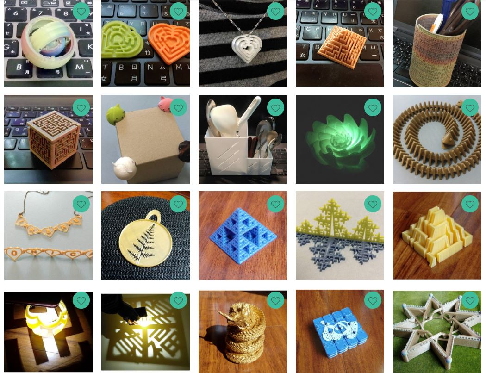
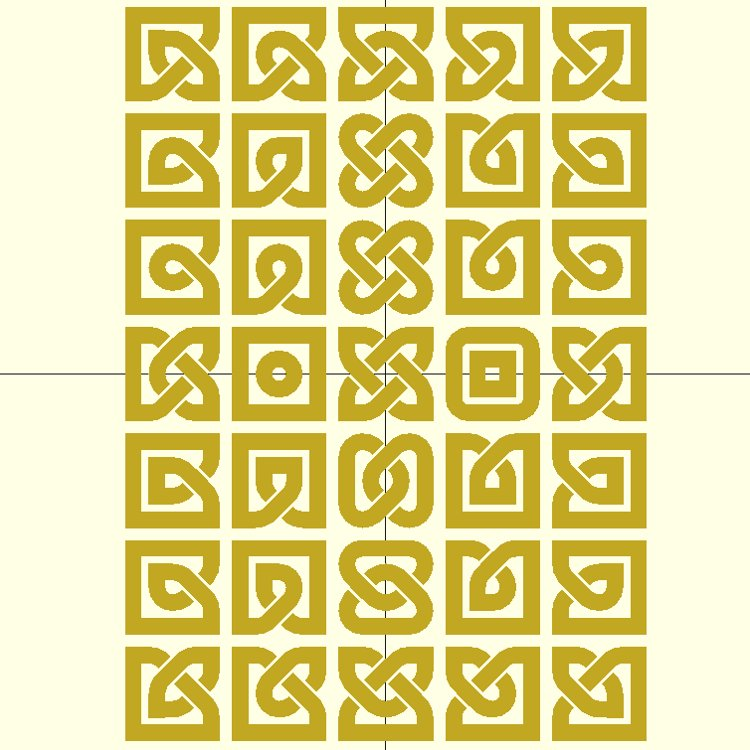
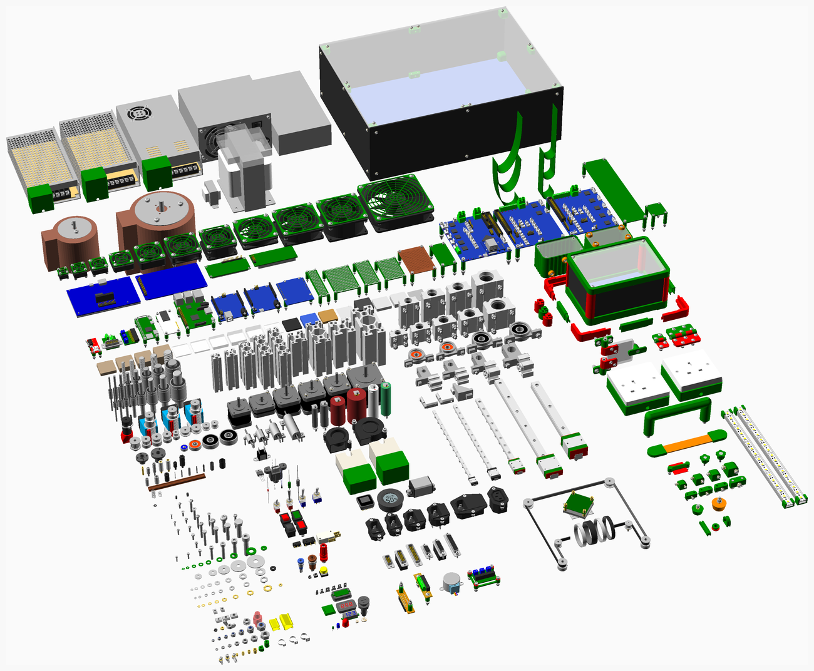

# OpenSCAD

## 라이브러리

- 오피셜: Generic [Documents](https://www.openscad.org/libraries.html)
- 오피셜: MCAD [Documents](https://en.wikibooks.org/wiki/OpenSCAD_User_Manual/MCAD), [Source](https://github.com/openscad/MCAD)

### Decorations

- [dotSCAD](https://github.com/JustinSDK/dotSCAD)

- [celtic-knot-scad](https://github.com/beanz/celtic-knot-scad)

### Electronics

- [NopSCADlib](https://github.com/nophead/NopSCADlib)

### Manipulators

- [BOSL](https://github.com/revarbat/BOSL)

### Mechines

- [BOLTS](https://github.com/boltsparts/BOLTS)

