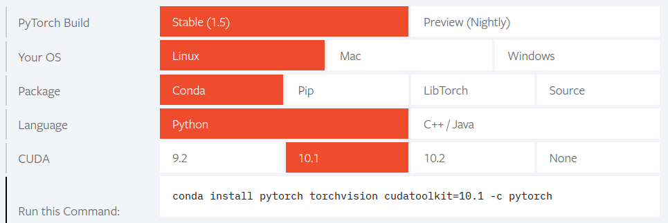
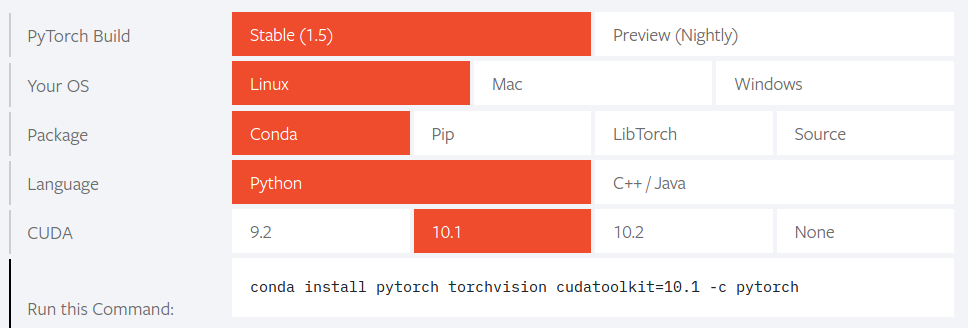
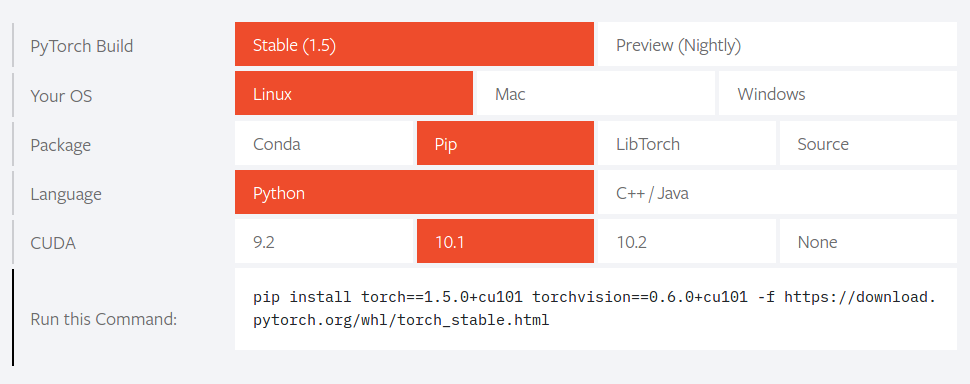

[Up](index.md)
# Ubuntu에 Pytorch 설치하기

2020년 5월 30일

Pytorch는 [pytorch.org](https://pytorch.org/)를 보면 바로 설치할 수 있는 셸 명령어를 제공 합니다.

가령 이렇게 설치할 수 있습니다.



얼핏 간단한 문제 같지만 사실 그렇지 않습니다. nvidia 드라이버, CUDA 툴킷도 설치해야 합니다. 

nvidia 드라이버 설치 방법은 [이 글](../linux/installation_of_nvidia_on_ubuntu.md)을 참조하세요.

CUDA 툴킷 설치 방법은 [이 글](../linux/installation_on_cuda_toolkit_on_ubuntu.md)을 참조하세요.

Ubuntu에는 기본적으로 Python이 설치되어 있고, 여기에 Pytorch를 설치하며 되는데 Python 고질적인 문제가 있습니다. Python은 큰 단점을 꼽자면 인터프리터나 패키지관리자인 pip가 썩 훌륭하지 못하다는 점입니다. 이 점은 NodeJS 패키지 관리자인 NPM도 마찬가지 입니다. Python 버전관리나 NPM도 Dart의 pub 패키지 관리자처럼 충돌 문제를 줄일 수 있는 날이 오기를 바랍니다.

Python의 패키지관리자의 문제로 가상환경을 사용합니다.

가상환경을 구현해주는 도구는 여러가지가 있는데 먼저 설치 및 다루기가 쉬운 Anaconda로 설치하는 방법을 기술하고, Pyenv를 나중에 소개 하도록 하겠습니다.

## Anaconda로 만든 가상환경에 Pytorch 설치하기

Anaconda는 가상환경 관리자이자, 패키지 관리자 입니다. Pyenv와 Pip로 가상환경 관리자와 패키지관리자가 분리된 환경과 다릅니다. Anaconda는 패키지 버전 호환성 관리를 자동으로 해주지만 나름 다운그레이드나 롤백으로 인한 어려움이 있기도 합니다.

파이썬 데이터과학 패키지를 위주로 관리되는 특성이 있습니다. 따라서, 관리에 포함되지 않은 패키지들이 제법 있습니다. 제외된 패키지는 채널에서 검색해야 할 수 있으며, pip로 패키지를 관리해야 할 수도 있습니다.

Anacoda로 가상환경을 구성하는 방법은 Pyenv + pip보다 쉽습니다. 임시 파일을 다운로드하여 설치해야 하므로 `/tmp` 폴더로 이동합니다.

```sh
cd /tmp
```

데비안 패키지들을 업데이트 해주고요.

```sh
sudo apt update
```

셸에서 http 메시지를 보내고 받을 수 있는  `curl`을 설치합니다.

```sh
sudo apt install -y curl
```

[https://www.anaconda.com/products/individual](https://www.anaconda.com/products/individual)에서 다운로드 파일의 링크를 얻을 수 있습니다. 2020년 5월 30일 최신 파일의 링크는 [https://repo.anaconda.com/archive/Anaconda3-2020.02-Linux-x86_64.sh](https://repo.anaconda.com/archive/Anaconda3-2020.02-Linux-x86_64.sh) 입니다. 직접 파일을 다운로드 하여도 되고 curl로 다운로드 하여도 됩니다. Anaconda 개인용은 다운로드가 많이 느립니다.

```sh
curl -O https://repo.anaconda.com/archive/Anaconda3-2020.02-Linux-x86_64.sh
```

체크섬을 확인 하고

```sh
sha256sum Anaconda3-2020.02-Linux-x86_64.sh
```

다운로드한 셸스크립트 파일을 실행 합니다.

```sh
bash Anaconda3-2020.02-Linux-x86_64.sh
```

설치가 완료되면 `~/bashrc`에 변경된 환경변수를 업데이트 합니다.

```sh
source ~/.bashrc
```

설치 과정이 단순합니다. 가상환경 구성이나 패키지 관리도 쉽습니다.

### Anaconda 가상환경

이제 가상환경을 만들어 보겠습니다. Python 3.6 에 가상환경 이름은 `ml`입니다.

```sh
conda create -n ml python=3.6
```

그리고 가상환경 `ml`을 활성화합니다.

```sh
conda activate ml
```

가상환경 `ml`이 활성화되면 셸 프롬프트에 `(ml)` 이 표시될 것입니다.

[pytorch.org](https://pytorch.org/)에서 패키지 관리자로 Conda로 선택하면 셸 명령어를 제공해 줍니다. 제 Ubuntu에는 CUDA 10.1이 설치되어 있으니 아래처럼 선택 합니다.



```
conda install pytorch torchvision cudatoolkit=10.1 -c pytorch
```

Anaconda 가상환경을 종료하려면 `deactivate`를 합니다.

```
conda deactivate
```

다른 패키지를 설치하려면

```sh
conda install <패키지이름>
```

또는

```sh
 conda install <패키지이름> -c <채널>
```

로 설치할 수 있습니다.

예를 들어 Scipy를 설치하는 경우 검색에서 `anaconda scipy`로 검색하면, anaconda.org에서 scipy를 제공하는 채널을 얻을 수 있습니다. 클릭해서 확인하면 `anaconda` 채널에서 `scipy` 설치 할 수 있는 명령라인이 소개 됩니다.

```sh
conda install -c anaconda scipy  
```

## Pyenv로 만든 가상환경에 Pytorch 설치하기

Pyenv로 가상 환경은 구성 방법은 [이 글](../python/pyenv.md)을 참조 하세요. 보시면 Pyenv로 Anaconda도 설치 할 수 있습니다. Pyenv까지 설치가 되면 Pytorch를 설치할 수 있습니다. 저의 경우 ROS 때문에 Ubuntu 16.04 LTS Xenial에 설치하며 Pyenv에서 예제로 보인 3.6.1 버전의 가상환경 `ml`에 설치 할 것입니다.

먼저 설치된 파이썬 버전들을 확인하겠습니다.

```sh
pyenv versions
```

설치할 수 있는 버전을 확인 할 수도 있습니다.

3.6.1의 설치되어 있지 않다면 설치합니다.

```sh
pyenv install 3.6.1
```

가상환경 ml 이 구성되어 있지 않다면 생성합니다.

```sh
pyenv virtualenv 3.6.1 ml
```

가상환경 `ml`로 전환합니다.

```sh
pyenv activate ml
```

그러면 프롬프트 앞에 `(ml)`이 표시될 것입니다. 이제 Pytorch를 설치할 수 있습니다. 저의 경우 CUDA 10.1 이므로 해당 버전을 설치할 것입니다. 각자 CUDA 버전에 맞는 명령어를 [pytorch.org](https://pytorch.org/)에서 얻어서 설치하시면 됩니다. Pyenv에 설치할 경우 패키지 관리자는 `pip` 입니다.



먼저 pip를 최신 버전으로 업그레이드 합니다.

```
pip install --upgrade pip
```

그리고 pytorch를 설치 합니다.

```sh
pip install torch==1.5.0+cu101 torchvision==0.6.0+cu101 -f https://download.pytorch.org/whl/torch_stable.html
```

각자 버전이 다를 수 있으니 주의하시기 바랍니다.

## 참조

- [pytorch.org](https://pytorch.org/)
- [anaconda.org](https://anaconda.org/)

