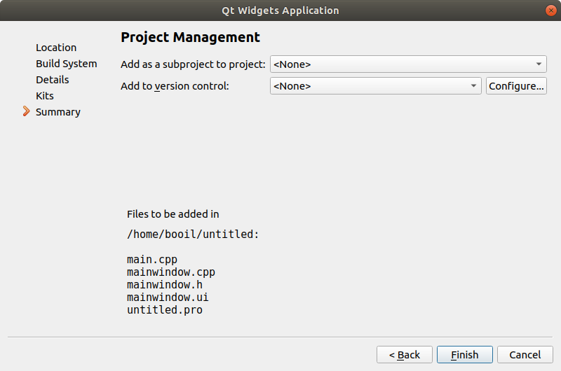

# Qt 서브 프로젝트

비주얼 스튜디오는 솔루션이 기본으로 생성되고 솔루션의 하위에 프로젝트가 생성되는 구조를 가지고 있습니다. Qt는 개발자가 계층적으로 풀어야 합니다.

먼저 Subdirs Project를 만듭니다. 새 프로젝트에서 Other Project > Subdirs Project 항목을 선택하고 Choose...를 누릅니다.

그러면 qmake 파일은 아래와 같습니다. 

```qmake
TEMPLATE = subdirs

SUBDIRS +=
```

여기에 서브 프로젝트를 만들 수 있습니다. 서브 프로젝트를 만들고 가장 마지막 단계에서 부모 프로젝트를 지정 합니다.



Add as a subproject to project에 부모 프로젝트를 지정하면 됩니다. 그러면 부모 프로젝트의 내용은 다음과 같이 변경 됩니다.

```qmake
TEMPLATE = subdirs

SUBDIRS += <서브디렉토리>
```

여러 서브 프로젝트가 있을때 서브 프로젝트끼리의 의존관계와 링크를 지정해야 할 수 도 있습니다. qmake  파일을 편집하여 지정을 하면 됩니다.

```qmake
...

DEPENDPATH += ../<subdir>
INCLUDEPATH += ../<subdir>
LIBS += -L../<subproj> -l<subproj>

...
```

예를 들어 의존하는 프로젝트의 서브 디렉토리 이름이 `a`이고 프로젝트 이름이 `aa`이면 다음과 같이 지정합니다.

```qmake
...

DEPENDPATH += ../a
INCLUDEPATH += ../a
LIBS += -L../a -laa

...
```

## 참조

- Qt

