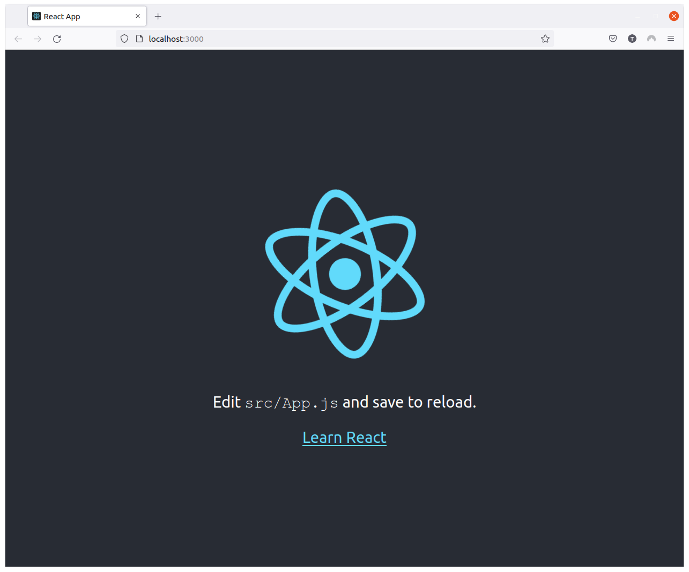
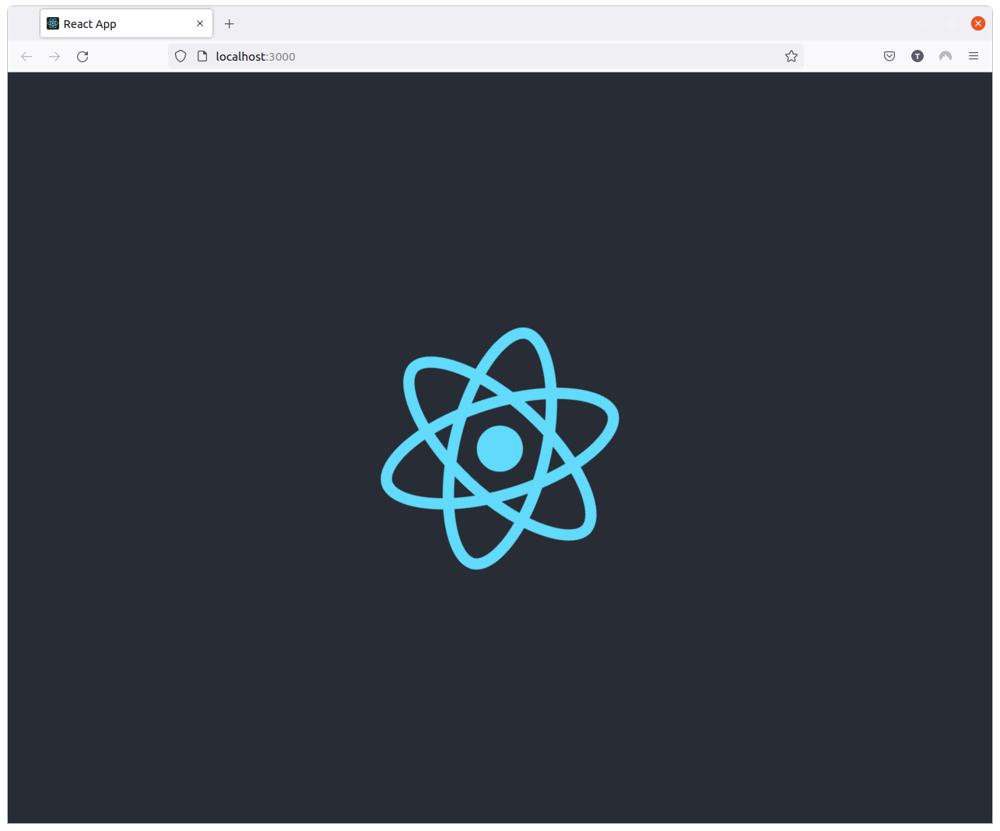

ReactJS

# Create app

##  앱 생성하고 실행하기

앱 생성:

```sh
npx create-react-app app001
```

- 프로젝트 이름은 소문자로 시작 한다.
- webpack, babel, dev server 패키지가 기본으로 설치 된다.

`src/index.js`:

```js
import React from 'react';
import ReactDOM from 'react-dom';
import './index.css';
import App from './App';
import reportWebVitals from './reportWebVitals';

ReactDOM.render(
  <React.StrictMode>
    <App />
  </React.StrictMode>,
  document.getElementById('root')
);

// If you want to start measuring performance in your app, pass a function
// to log results (for example: reportWebVitals(console.log))
// or send to an analytics endpoint. Learn more: https://bit.ly/CRA-vitals
reportWebVitals();
```

여기서 `React`는 최상위 컴포넌트로 `App` 컴포넌트를 렌더링 하고 있다.

`src/index.css`

```css
body {
  margin: 0;
  font-family: -apple-system, BlinkMacSystemFont, 'Segoe UI', 'Roboto', 'Oxygen',
    'Ubuntu', 'Cantarell', 'Fira Sans', 'Droid Sans', 'Helvetica Neue',
    sans-serif;
  -webkit-font-smoothing: antialiased;
  -moz-osx-font-smoothing: grayscale;
}

code {
  font-family: source-code-pro, Menlo, Monaco, Consolas, 'Courier New',
    monospace;
}
```

`src/App.js`:

```js
import logo from './logo.svg';
import './App.css';

function App() {
  return (
    <div className="App">
      <header className="App-header">
        
        <p>
          Edit <code>src/App.js</code> and save to reload.
        </p>
        <a
          className="App-link"
          href="https://reactjs.org"
          target="_blank"
          rel="noopener noreferrer"
        >
          Learn React
        </a>
      </header>
    </div>
  );
}

export default App;
```

실행해보자:

```sh
npm start
```

새 웹브라우저 탭이 생성되고 표출된다:



`App.js`에서 텍스트 두줄을 제거하도록 아래와 같이 코드를 제거하여 수정한다:

```js
import logo from './logo.svg';
import './App.css';

function App() {
  return (
    <div className="App">
      <header className="App-header">
        
      </header>
    </div>
  );
}

export default App;
```

저장하면 웹페이지가 다음과 같이 변경된다:



## 