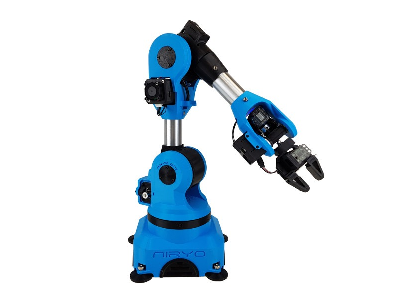

# OpenSource Robot Arms

## Actuators

### [OpenTorque Actuator](https://www.youtube.com/watch?v=Hd54ik_45Wo)

- Youtube: [OpenTorque Actuator (developed by Gabrael Levine)](https://www.youtube.com/watch?v=Hd54ik_45Wo)

## Robot Arms

### [BCN3D MOVEO](https://www.bcn3d.com/bcn3d-moveo-the-future-of-learning/)

Source: [Github](https://github.com/BCN3D/BCN3D-Moveo)

### Brushless Robot Arm

Youtube: [6DoF Brushless Robot Arm which you can buy now! (INNFOS GLUON)](https://www.youtube.com/watch?v=ZlJENPxR7yM)

Kickstarter: [GLUON丨Modular Desktop Collaborative Robotic Arm by SCA](https://www.kickstarter.com/projects/1383636492/the-smallest-servomotor-robotic-arm)

- 6 DOF

### DOBOT

### Evil Minion

Source: [Github](https://github.com/i-make-robots/Evil-Minion)

- 5 DOF

### John Lauer

Youtube: [3D Printed Robot Arm](https://www.youtube.com/watch?v=tEbJV32GyYU)

### Niryo one

Source: [Github](https://github.com/NiryoRobotics/niryo_one)

- 6 DOF

- License: [Creative Commons Attribution-NonCommercial-ShareAlike 4.0 International License](http://creativecommons.org/licenses/by-nc-sa/4.0/).

### [Thor](https://github.com/AngelLM/Thor)

Source: [Github](https://github.com/AngelLM/Thor)

- 6 DOF
- Payload: 0.75 kg

