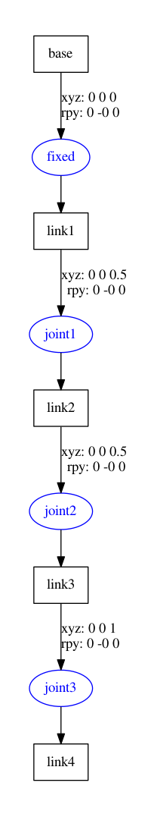
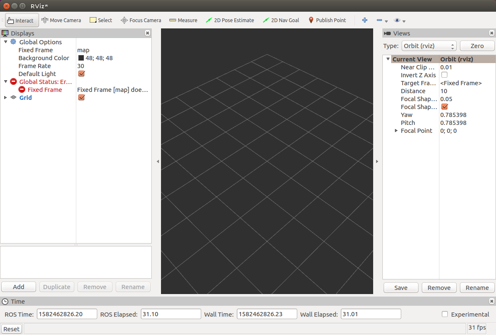
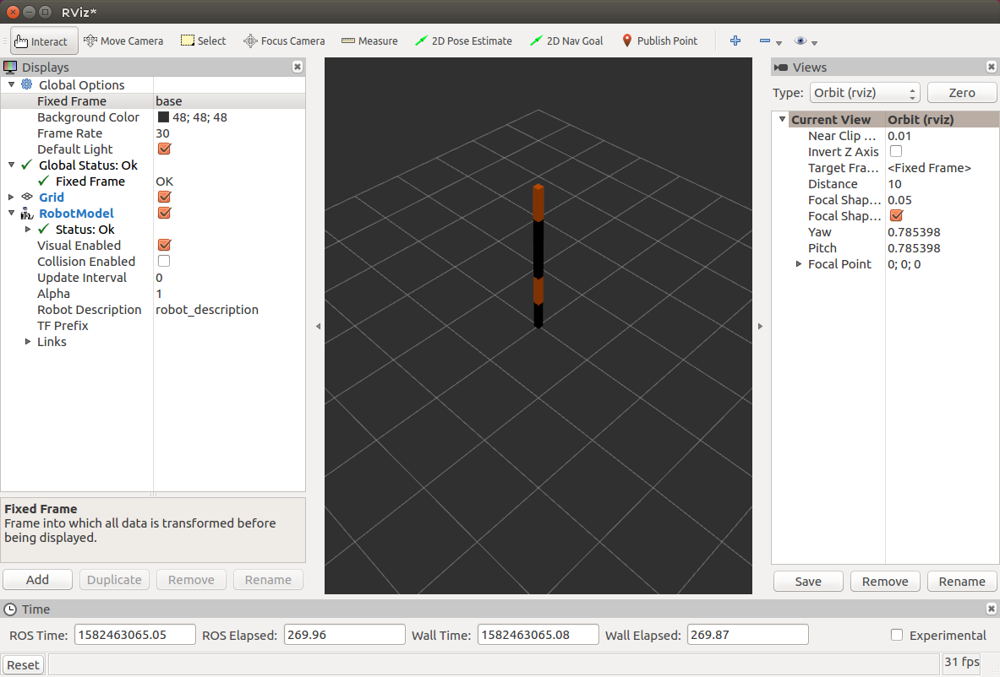
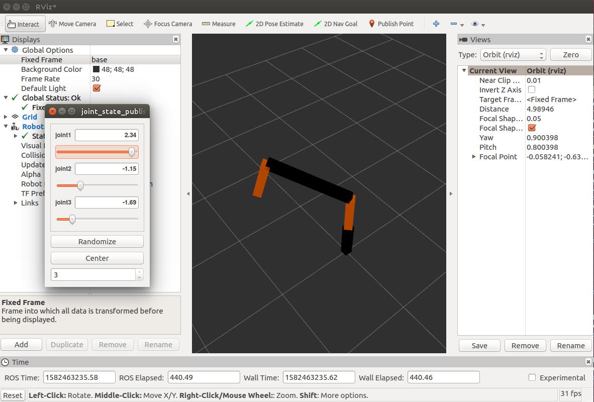
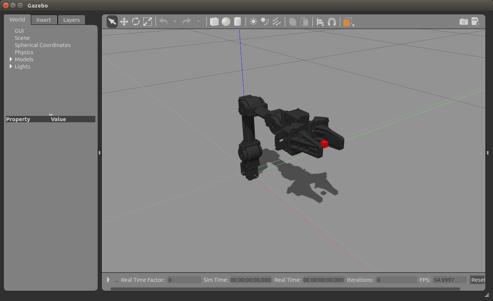

# ROS OpenManipulator

URDF, Gazebo, MoveIt!을 위한 패키지를 미리 설치 합니다.

```
sudo apt install ros-kinetic-ros-controllers
sudo apt install ros-kinetic-gazebo*
sudo apt install ros-kinetic-moveit*
sudo apt install ros-kinetic-industrial*
sudo apt install ros-kinetic-joint-state*
sudo apt install ros-kinetic-xpp
```

testbot_description 패키지를 생성합니다. 그리고 URDF 파일을 생성합니다.

```
cd ~/catkin_ws/src
catkin_create_pkg testbot_description urdf
cd testbot_description
```

```
mkdir urdf
cd urdf
gedit testbot.urdf
```

다음은 URDF 파일의 내용입니다. URDF 태그에 대한 자세한 설명은 [이곳](http://wiki.ros.org/urdf/XML/link)에 있습니다.

```xml
<?xml version="1.0" ?>
<robot name="testbot">

  <material name="black">
    <color rgba="0.0 0.0 0.0 1.0"/>
  </material>
  <material name="orange">
    <color rgba="1.0 0.4 0.0 1.0"/>
  </material>

  <link name="base"/>

  <joint name="fixed" type="fixed">
    <parent link="base"/>
    <child link="link1"/>
  </joint>

  <link name="link1">
    <collision>
      <origin xyz="0 0 0.25" rpy="0 0 0"/>
      <geometry>
        <box size="0.1 0.1 0.5"/>
      </geometry>
    </collision>
    <visual>
      <origin xyz="0 0 0.25" rpy="0 0 0"/>
      <geometry>
        <box size="0.1 0.1 0.5"/>
      </geometry>
      <material name="black"/>
    </visual>
    <inertial>
      <origin xyz="0 0 0.25" rpy="0 0 0"/>
      <mass value="1"/>
      <inertia ixx="1.0" ixy="0.0" ixz="0.0" iyy="1.0" iyz="0.0" izz="1.0"/>
    </inertial>
  </link>

  <joint name="joint1" type="revolute">
    <parent link="link1"/>
    <child link="link2"/>
    <origin xyz="0 0 0.5" rpy="0 0 0"/>
    <axis xyz="0 0 1"/>
    <limit effort="30" lower="-2.617" upper="2.617" velocity="1.571"/>
  </joint>

  <link name="link2">
    <collision>
      <origin xyz="0 0 0.25" rpy="0 0 0"/>
      <geometry>
        <box size="0.1 0.1 0.5"/>
      </geometry>
    </collision>
    <visual>
      <origin xyz="0 0 0.25" rpy="0 0 0"/>
      <geometry>
        <box size="0.1 0.1 0.5"/>
      </geometry>
      <material name="orange"/>
    </visual>
    <inertial>
      <origin xyz="0 0 0.25" rpy="0 0 0"/>
      <mass value="1"/>
      <inertia ixx="1.0" ixy="0.0" ixz="0.0" iyy="1.0" iyz="0.0" izz="1.0"/>
    </inertial>
  </link>

  <joint name="joint2" type="revolute">
    <parent link="link2"/>
    <child link="link3"/>
    <origin xyz="0 0 0.5" rpy="0 0 0"/>
    <axis xyz="0 1 0"/>
    <limit effort="30" lower="-2.617" upper="2.617" velocity="1.571"/>
  </joint>

  <link name="link3">
    <collision>
      <origin xyz="0 0 0.5" rpy="0 0 0"/>
      <geometry>
        <box size="0.1 0.1 1"/>
      </geometry>
    </collision>
    <visual>
      <origin xyz="0 0 0.5" rpy="0 0 0"/>
      <geometry>
        <box size="0.1 0.1 1"/>
      </geometry>
      <material name="black"/>
    </visual>
    <inertial>
      <origin xyz="0 0 0.5" rpy="0 0 0"/>
      <mass value="1"/>
      <inertia ixx="1.0" ixy="0.0" ixz="0.0" iyy="1.0" iyz="0.0" izz="1.0"/>
    </inertial>
  </link>

  <joint name="joint3" type="revolute">
    <parent link="link3"/>
    <child link="link4"/>
    <origin xyz="0 0 1.0" rpy="0 0 0"/>
    <axis xyz="0 1 0"/>
    <limit effort="30" lower="-2.617" upper="2.617" velocity="1.571"/>
  </joint>

  <link name="link4">
    <collision>
      <origin xyz="0 0 0.25" rpy="0 0 0"/>
      <geometry>
        <box size="0.1 0.1 0.5"/>
      </geometry>
    </collision>
    <visual>
      <origin xyz="0 0 0.25" rpy="0 0 0"/>
      <geometry>
        <box size="0.1 0.1 0.5"/>
      </geometry>
      <material name="orange"/>
    </visual>
    <inertial>
      <origin xyz="0 0 0.25" rpy="0 0 0"/>
      <mass value="1"/>
      <inertia ixx="1.0" ixy="0.0" ixz="0.0" iyy="1.0" iyz="0.0" izz="1.0"/>
    </inertial>
  </link>

</robot>
```

모두 작성되였으면 각 링크와 관절의 구성에 오류가 없는지 린트를 합니다.

```
check_urdf testbot.urdf
```

정상적이면 관절 구조를 볼 수 있습니다.

```
robot name is: testbot
---------- Successfully Parsed XML ---------------
root Link: base has 1 child(ren)
    child(1):  link1
        child(1):  link2
            child(1):  link3
                child(1):  link4
```

이 구조를 시각적인 파일로 문서화 합니다.

```
urdf_to_graphiz testbot.urdf
```

그려면 두개의 파일이 생성 됩니다.

```
Created file testbot.gv
Created file testbot.pdf
```

파일 내용을 확인 해 보겠습니다.



다시 패키지 폴더로 이동하여 launch  파일을 작성 합니다.

```
cd ~/catkin_ws/src/testbot_description
mkdir launch
cd launch
gedit testbot.launch
```

```xml
<launch>
  <arg name="model" default="$(find testbot_description)/urdf/testbot.urdf" />
  <arg name="gui" default="True" />
  <param name="robot_description" textfile="$(arg model)" />
  <param name="use_gui" value="$(arg gui)"/>
  <node name="joint_state_publisher" pkg="joint_state_publisher" type="joint_state_publisher" />
  <node name="robot_state_publisher" pkg="robot_state_publisher" type="state_publisher" />
</launch>
```

준비가 완료되면 각각의 터미널에서 testbot.launch와 RViz를 실행합니다.

터미널1:

```
roscore
```

터미널2:

```
roslaunch testbot_description testbot.launch
```

터미널3:

```
rosrun rviz rviz
```

그런데 오류가 발생



`Fixed Frame [map] does not exist`라는 오류 메시지 입니다.

Displays아래 Add 버튼을 눌러서 RobotModel을 추가해주고, Displays에서 FixedFrame을 base로 선택 합니다. 그러면 로봇팔을 볼 수 있습니다.



관절을 제어하여 로봇팔을 움직여 봅니다.



## OpenManipulor Chain

튜토리얼 소스 코드를 다운로드 합니다.

```
cd ~/catkin_ws/src
git clone https://github.com/ROBOTIS-GIT/DynamixelSDK.git
git clone https://github.com/ROBOTIS-GIT/dynamixel-workbench.git
git clone https://github.com/ROBOTIS-GIT/dynamixel-workbench-msgs.git
git clone https://github.com/ROBOTIS-GIT/robotis_manipulator.git
git clone https://github.com/ROBOTIS-GIT/open_manipulator.git
git clone https://github.com/ROBOTIS-GIT/open_manipulator_msgs.git
git clone https://github.com/ROBOTIS-GIT/open_manipulator_simulations.git
```

`open_manipulator`폴더의 구조

- `open_manipulator`: 메타 패키지.

- `open_manipulator_control_gui`: GUI 패키지.
- `open_manipulator_controller`: 제어 패키지.
- `open_manipulator_description`: 모델링 패키지.
  - `urdf`
    - `materials.xacro`: 물질 정보.
    - `open_manipulator.urdf.xacro`: 매니풀레이터 모델링.
    - `open_manipulator.gazebo.xacor`: 매니풀레이터 Gazebo 모델링.
  - `launch`
    - `open_manipulator_rviz.launch`: 매니풀레이터 모델링 정보 시각화, 상태 정보 퍼블리셔 노드 실행 파일.
- `open_manipulator_libs`: 매니풀레이션 라이브러리.
- `open_manipulator_moveit`: MoveIt! 구성 패키지.
- `open_manipulator_teleop`: teleoperation 패키지.

실행은

```
roslaunch open_manipulator_gazebo open_manipulator_gazebo.launch
```

하면



를 볼 수 있습니다. 새 터미널에서

```
rostopic list
```

하여, 토픽을 확인해 보면,

```
/clock
/gazebo/link_states
/gazebo/model_states
/gazebo/set_link_state
/gazebo/set_model_state
/open_manipulator/gripper_position/command
/open_manipulator/gripper_position/pid/parameter_descriptions
/open_manipulator/gripper_position/pid/parameter_updates
/open_manipulator/gripper_position/state
/open_manipulator/gripper_sub_position/command
/open_manipulator/gripper_sub_position/pid/parameter_descriptions
/open_manipulator/gripper_sub_position/pid/parameter_updates
/open_manipulator/gripper_sub_position/state
/open_manipulator/joint1_position/command
/open_manipulator/joint1_position/pid/parameter_descriptions
/open_manipulator/joint1_position/pid/parameter_updates
/open_manipulator/joint1_position/state
/open_manipulator/joint2_position/command
/open_manipulator/joint2_position/pid/parameter_descriptions
/open_manipulator/joint2_position/pid/parameter_updates
/open_manipulator/joint2_position/state
/open_manipulator/joint3_position/command
/open_manipulator/joint3_position/pid/parameter_descriptions
/open_manipulator/joint3_position/pid/parameter_updates
/open_manipulator/joint3_position/state
/open_manipulator/joint4_position/command
/open_manipulator/joint4_position/pid/parameter_descriptions
/open_manipulator/joint4_position/pid/parameter_updates
/open_manipulator/joint4_position/state
/open_manipulator/joint_states
/rosout
/rosout_agg
```

를 확인 할 수 있습니다.

토픽을 보내 로봇을 움직여 보겠습니다.

```
rostopic pub /open_manipulator/joint2_position/command std_msgs/Float64 "data: -1.0" --once
```

## 참조

- https://github.com/ROBOTIS-GIT/ros_tutorials/tree/master/testbot_description

- https://github.com/ROBOTIS-GIT/DynamixelSDK.git
- https://github.com/ROBOTIS-GIT/dynamixel-workbench.git
- https://github.com/ROBOTIS-GIT/dynamixel-workbench-msgs.git
- https://github.com/ROBOTIS-GIT/robotis_manipulator.git
- https://github.com/ROBOTIS-GIT/open_manipulator.git
- https://github.com/ROBOTIS-GIT/open_manipulator_msgs.git
- https://github.com/ROBOTIS-GIT/open_manipulator_simulations.git

- ROS 로봇 프로그래밍, 2017, 표윤석, 조한철, 정려운, 임태훈.