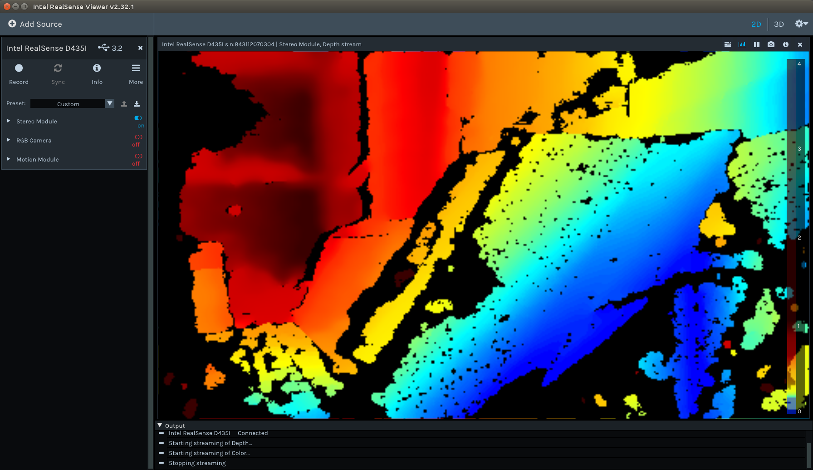
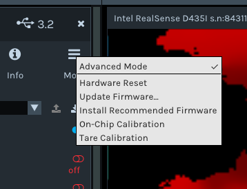
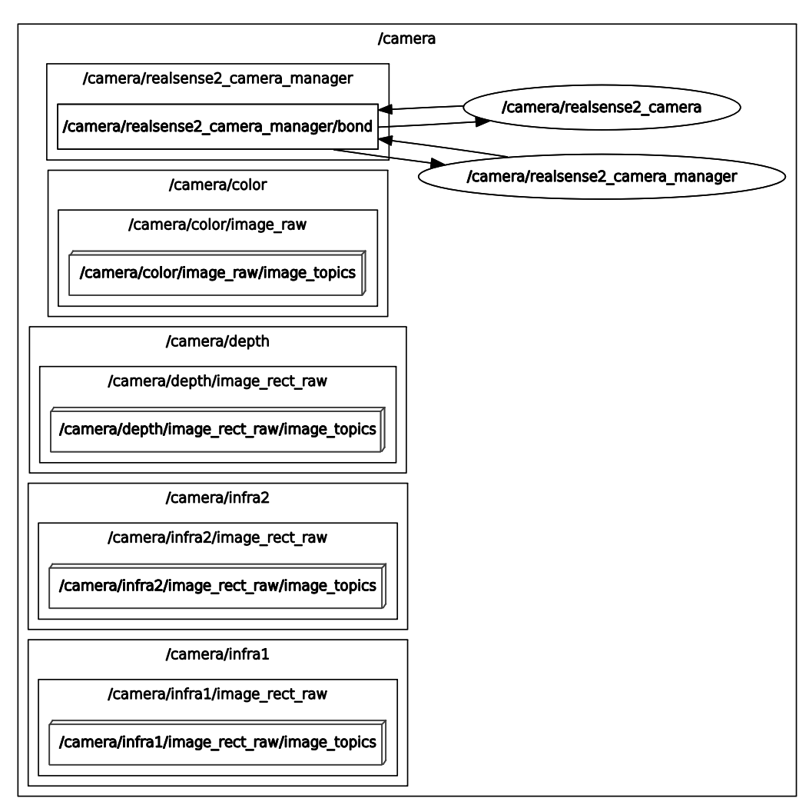

# Ubuntu ROS에 RealSense

2020년 3월 1일

- SR300, D415, D435, D435i은 Realsense2로 사용 할 수 있습니다.

- 이 글은 Realsense2와 ROS kinetic과 melodic에 한정합니다.

- 최신 펌웨어가 제대로 동작 합니다.

## Ubuntu에 라이브러리 설치

저장소 키를 등록 합니다.

```
sudo apt adv --keyserver keys.gnupg.net --recv-key F6E65AC044F831AC80A06380C8B3A55A6F3EFCDE || sudo apt-key adv --keyserver hkp://keyserver.ubuntu.com:80 --recv-key F6E65AC044F831AC80A06380C8B3A55A6F3EFCDE
```

Ubuntu 16.04에는 아래처럼 xenial 저장소를 추가합니다.

```
sudo add-apt-repository "deb http://realsense-hw-public.s3.amazonaws.com/Debian/apt-repo xenial main" -u
```

Ubuntu 18.04에는 아래처럼 bionic 저장소를 추가합니다.

```
sudo add-apt-repository "deb http://realsense-hw-public.s3.amazonaws.com/Debian/apt-repo bionic main" -u
```

라이브러리들을 설치 합니다.

```
sudo apt update
sudo apt install librealsense2
sudo apt install librealsense2-dkms librealsense2-utils
sudo apt install librealsense2-dev librealsense2-dbg # optional
```

동작하는지 테스트 합니다.

```
realsense-viewer
```



realsense-viewer에서, Install Recommended Firmware를 확인하고 설치 할 수 있습니다.



펌웨어 최신 버전이 ROS에서 제대로 동작합니다. 혹 업그레이드 중 중단되기도 하는데, 중단되면 장치 이름이 DxxxRecovery로 바뀝니다. 장치 선택하고 업그레이드를 하면 됩니다.

## ROS에 패키지 설치

`<distro>`는 `kinetic` 또는 `melodic` 중 설치하고자 하는 Ubuntu와 ROS에 의존하여 선택합니다.

- Ubuntu 16.04 - kinetic
- Ubuntu 18.04 - melodic

```
sudo apt install ros-<distro>-librealsense2 ros-<distro>-realsense2-camera
```

ROS kinetic에 Realsense2  패키지를 설치하려면 아래와 같습니다.

```
sudo apt install ros-kinetic-librealsense2 ros-kinetic-realsense2-camera
```

ROS melodic에 Realsense2  패키지를 설치하려면 아래와 같습니다.

```
sudo apt install ros-melodic-librealsense2 ros-melodic-realsense2-camera
```

## RGBD 카메라로 실행

터미널에서

```
roscore
```

하고, 

새 창에서 카메라 퍼블리셔를 실행합니다.

```
roslaunch realsense2_camera rs_camera.launch
```

그리고, 새 창에서

```
rqt_graph
```

로 ROS 노드들을 확인해 봅니다. 아래는 D435i의 노드와 토픽입니다.

노드 그래프가 다르다면 노드가 준비 될때까지 계속 리프레시를 누르면서 기다리세요.

ROS melodic에서는 제대로 노드가 보이지 않으며 아래 내용은 동작하지 않습니다.



Realsense2는 다양한 노드에서 영상을 받습니다.

컬러 영상:

```
rosrun image_view image_view image:=/camera/color/image_raw
```

깊이 영상:

```
rosrun image_view image_view image:=/camera/depth/image_rect_raw
```

IR 1번 카메라의 영상:

```
rosrun image_view image_view image:=/camera/infra1/image_rect_raw
```

IR 2번 카메라의 영상:

```
rosrun image_view image_view image:=/camera/infra2/image_rect_raw
```

## 참조

- [github.com/IntelRealSense/realsense-ros](https://github.com/IntelRealSense/realsense-ros?fbclid=IwAR3ZCG4d4KQJLcIVMTxKt0QN-sQ48L9N9OxRThwwTyXgdbw4hijlrW-arlI)

- [github.com/IntelRealSense/librealsense](https://github.com/IntelRealSense/librealsense/blob/master/doc/distribution_linux.md)

