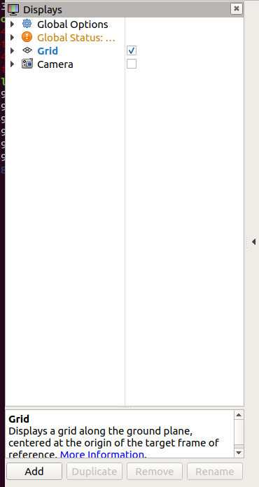
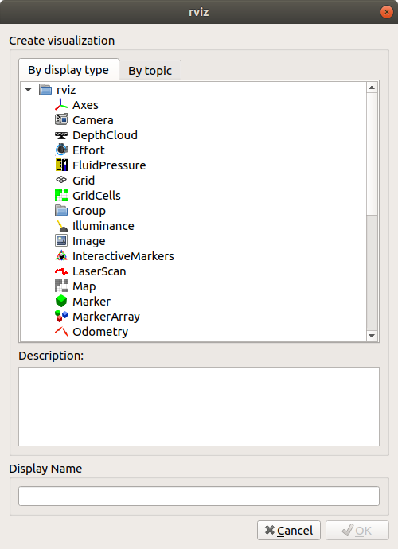
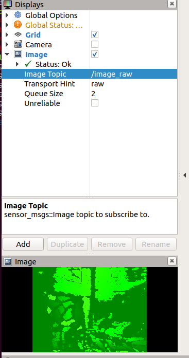

# UVC Camera on ROS melodic

## 설치

UVC 카메라 패키지 설치

```
sudo apt install ros-melodic-uvc-camera
```

이미지 관련 패키지 설치

```
sudo apt install ros-melodic-image-*
sudo apt install ros-melodic-rqt-image-view
```

## 실행

첫 터미널에서

```
roscore
```

두번째 터미널에서

```
rosrun uvc_camera uvc_camera_node
```

세번째 터미널에서 image_view 노드로 보기

```
rosrun image_view image_view image:=/image_raw
```

세번째 터미널에서 rqt_image_view 노드로 보기

```
rqt_image_view image:=image_raw
```

세번째 터미널에서 RViz로 보기

```
rviz
```

1. Display Panel의 아래에서 Add 버튼을 누른다.
2. 
3. Create Visulaization에서 Image 를 선택한다. Display  Panel에 Image가 추가될 것이다.
4. 
5. Display  Panel에서 Image를 선택하고, Image Topic에서 /image_raw를 선택 한다.
6. 

## 참조

- ROS 로봇 프로그래밍, 2017, 표윤석, 조한철, 정려운, 임태훈.