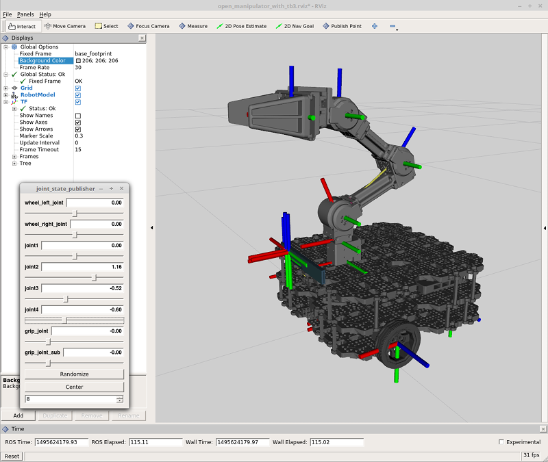

해당 동작을 실행하기 위해 어느 패키지가 실행되는지 파악하기 위해서 정리 하였습니다. 자세한 내용은 원문을 참조하세요.

# [[ROS1] Manipulation](http://emanual.robotis.com/docs/en/platform/turtlebot3/manipulation/#manipulation)

## Software setup

```
$ cd ~/catkin_ws/src/
$ git clone https://github.com/ROBOTIS-GIT/open_manipulator_with_tb3.git
$ git clone https://github.com/ROBOTIS-GIT/open_manipulator_with_tb3_msgs.git
$ git clone https://github.com/ROBOTIS-GIT/open_manipulator_with_tb3_simulations.git
$ git clone https://github.com/ROBOTIS-GIT/open_manipulator_perceptions.git
$ sudo apt-get install ros-kinetic-smach* ros-kinetic-ar-track-alvar ros-kinetic-ar-track-alvar-msgs
$ cd ~/catkin_ws && catkin_make
```

```
$ export TURTLEBOT3_MODEL=${TB3_MODEL}
$ roslaunch open_manipulator_with_tb3_description open_manipulator_with_tb3_rviz.launch
```




## 참조

- http://emanual.robotis.com/docs/en/platform/turtlebot3/simulation/

