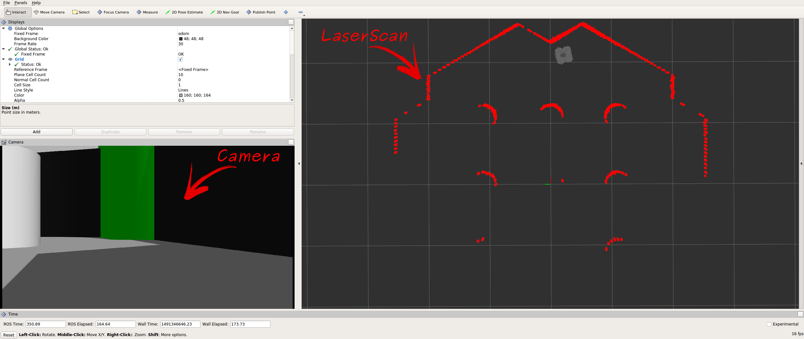

해당 동작을 실행하기 위해 어느 패키지가 실행되는지 파악하기 위해서 정리 하였습니다. 자세한 내용은 원문을 참조하세요.

# [[ROS1] SLAM](http://emanual.robotis.com/docs/en/platform/turtlebot3/slam/)

```
$ roscore
```

```
$ roslaunch turtlebot3_bringup turtlebot3_robot.launch
```

```
$ export TURTLEBOT3_MODEL=${TB3_MODEL}
$ roslaunch turtlebot3_slam turtlebot3_slam.launch slam_methods:=gmapping
```

#### Run Teleoperation Node

```
$ export TURTLEBOT3_MODEL=${TB3_MODEL}
$ roslaunch turtlebot3_teleop turtlebot3_teleop_key.launch
```

# [[ROS1] Navigation](http://emanual.robotis.com/docs/en/platform/turtlebot3/navigation/)

```
$ roscore
```

```
$ roslaunch turtlebot3_bringup turtlebot3_robot.launch
```

```
$ export TURTLEBOT3_MODEL=${TB3_MODEL}
$ roslaunch turtlebot3_navigation turtlebot3_navigation.launch map_file:=$HOME/map.yaml
```

```
$ rviz -d `rospack find turtlebot3_navigation`/rviz/turtlebot3_navigation.rviz
```

# [[ROS 1] Simulation](http://emanual.robotis.com/docs/en/platform/turtlebot3/simulation/)

## Turtlebot3 Simulation using Fake Node

시뮬레이션을 하려면 `turtlebot3_fake_node`를 필요로 하고, `turtlebot3_simulation` 메타 패키지가 필요하다.

```
$ roscore
```

```
$ cd ~/catkin_ws/src/
$ git clone https://github.com/ROBOTIS-GIT/turtlebot3_simulations.git
$ cd ~/catkin_ws && catkin_make
```

```
$ export TURTLEBOT3_MODEL=${TB3_MODEL}
$ roslaunch turtlebot3_fake turtlebot3_fake.launch
```

```
$ export TURTLEBOT3_MODEL=${TB3_MODEL}
$ roslaunch turtlebot3_teleop turtlebot3_teleop_key.launch
```

## Turtlebot3 Simulation using Gazebo

Gazebo를 사용하여 시뮬레이션하는 방법에는 두가지가 있다.

- `turtlebot3_gazebo`를 통해 ROS를 사용하는 방법.
- ROS를 사용하지 않고, Gazebo와 `turtlebot3_gazebo_plugin`을 사용하는 방법.

### turtlebot3_gazebo를 사용하는 방법

#### empty_world 에서

Gazebo가 기본으로 제공하는 `empty_world`에서 하는 방법.

```
$ export TURTLEBOT3_MODEL=${TB3_MODEL}
$ roslaunch turtlebot3_gazebo turtlebot3_empty_world.launch
```


#### turtlebot3_world에서 하는 방법

```
$ export TURTLEBOT3_MODEL=${TB3_MODEL}
$ roslaunch turtlebot3_gazebo turtlebot3_world.launch
```


#### turtlebot3_house에서 하는 방법

```
$ export TURTLEBOT3_MODEL=${TB3_MODEL}
$ roslaunch turtlebot3_gazebo turtlebot3_house.launch
```

### Drive Turtlebot3

#### 키보드로 제어

```
$ roslaunch turtlebot3_teleop turtlebot3_teleop_key.launch
```

#### 충돌 회피

```
$ export TURTLEBOT3_MODEL=${TB3_MODEL}
$ roslaunch turtlebot3_gazebo turtlebot3_world.launch
```

```
$ export TURTLEBOT3_MODEL=${TB3_MODEL}
$ roslaunch turtlebot3_gazebo turtlebot3_simulation.launch
```

### RViz에서 실행

```
$ export TURTLEBOT3_MODEL=${TB3_MODEL}
$ roslaunch turtlebot3_gazebo turtlebot3_gazebo_rviz.launch
```



### Vitual SLAM with Turtlebot3

Launch Gazebo

```
$ export TURTLEBOT3_MODEL=waffle_pi
$ roslaunch turtlebot3_gazebo turtlebot3_world.launch
```

Launch SLAM

```
$ export TURTLEBOT3_MODEL=waffle_pi
$ roslaunch turtlebot3_slam turtlebot3_slam.launch slam_methods:=gmapping
```

Remotely Control Turtlebot3

```
$ roslaunch turtlebot3_teleop turtlebot3_teleop_key.launch
```

Save the Map

```
$ rosrun map_server map_saver -f ~/map
```


### Virtual Navigation with Turtlebot3

#### Virtual Navigation Execution Procedure

Gazebo 실행

```
$ export TURTLEBOT3_MODEL=waffle_pi
$ roslaunch turtlebot3_gazebo turtlebot3_world.launch
```

Navigation  실행

```
$ export TURTLEBOT3_MODEL=waffle_pi
$ roslaunch turtlebot3_navigation turtlebot3_navigation.launch map_file:=$HOME/map.yaml
```


### Virtual SLAM by Multiple TurtleBot3s

##### Call Three TurtleBot3s in TurtleBot3 House

```
$ roslaunch turtlebot3_gazebo multi_turtlebot3.launch
```

##### Excute SLAM

```
$ ROS_NAMESPACE=tb3_0 roslaunch turtlebot3_slam turtlebot3_gmapping.launch set_base_frame:=tb3_0/base_footprint set_odom_frame:=tb3_0/odom set_map_frame:=tb3_0/map
$ ROS_NAMESPACE=tb3_1 roslaunch turtlebot3_slam turtlebot3_gmapping.launch set_base_frame:=tb3_1/base_footprint set_odom_frame:=tb3_1/odom set_map_frame:=tb3_1/map
$ ROS_NAMESPACE=tb3_2 roslaunch turtlebot3_slam turtlebot3_gmapping.launch set_base_frame:=tb3_2/base_footprint set_odom_frame:=tb3_2/odom set_map_frame:=tb3_2/map
```

##### Merge Map Data from each TurtleBot3’s Map Data

```
$ sudo apt-get install ros-kinetic-multirobot-map-merge
$ roslaunch turtlebot3_gazebo multi_map_merge.launch
```

##### Excute RViz

```
$ rosrun rviz rviz -d `rospack find turtlebot3_gazebo`/rviz/multi_turtlebot3_slam.rviz
```

##### Teleoperation

```
$ ROS_NAMESPACE=tb3_0 rosrun turtlebot3_teleop turtlebot3_teleop_key
$ ROS_NAMESPACE=tb3_1 rosrun turtlebot3_teleop turtlebot3_teleop_key
$ ROS_NAMESPACE=tb3_2 rosrun turtlebot3_teleop turtlebot3_teleop_key
```

##### Save the Map

```
$ rosrun map_server map_saver -f ~/map
```


#### [Turtlebot3 AutoRace with Gazebo](http://emanual.robotis.com/docs/en/platform/turtlebot3/autonomous_driving/#autorace-with-gazebo)

#### [Turtlebot3 with OpenMANIPULATOR](http://emanual.robotis.com/docs/en/platform/turtlebot3/manipulation/#simulation)

### Standalone Gazebo Plugin

#### Gazebo 플러그인 사용법

Install Library for Gazebo7

```
$ sudo apt-get install libgazebo7-dev
```

Download Source Code from Github

```
$ git clone https://github.com/ROBOTIS-GIT/turtlebot3_gazebo_plugin
```

편집

```
$ nano ~/.bashrc
```

내용

```
export GAZEBO_PLUGIN_PATH=$GAZEBO_PLUGIN_PATH:${turtlebot3_gazebo_plugin path}/build
export GAZEBO_MODEL_PATH=$GAZEBO_MODEL_PATH:${turtlebot3_gazebo_plugin path}/models
```

빌드

```
$ cd ${turtlebot3_gazebo_plugin path}
$ mkdir build
$ cd build
$ cmake ..
$ make
```

실행

```
$ cd ${turtlebot3_gazebo_plugin}
$ gazebo worlds/turtlebot3_${TB3_MODEL}.world
```


##### Topic Subscribe Command

Show all topic

```
$ gz topic -l
```

Subscribe scan data

```
$ gz topic -e /gazebo/default/user/turtlebot3_${TB3_MODEL}/lidar/hls_lfcd_lds/scan
```

Subscribe image data

Waffle

```
$ gz topic -e /gazebo/default/user/turtlebot3_waffle/image/intel_realsense_r200/image
```

Waffle Pi

```
$ gz topic -e /gazebo/default/user/turtlebot3_waffle_pi/image/raspberry_pi_cam/image
```

##### 8) Excute listener

```
$ cd ${turtlebot3_gazebo_plugin}/build
$ ./lidar_listener ${TB3_MODEL}
```

```
$ cd ${turtlebot3_gazebo_plugin}/build
$ ./image_listener ${TB3_MODEL}
```

## 참조

- http://emanual.robotis.com/docs/en/platform/turtlebot3/simulation/

