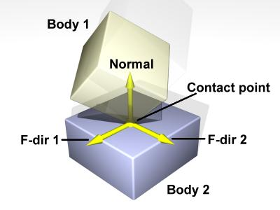
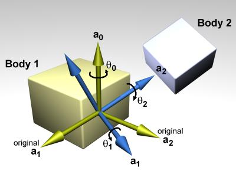

# turtlebot3

## ./turtlebot3/

특별한 코드는 없다.

## [./turtlebot3_bringup/](http://wiki.ros.org/turtlebot3_bringup)

- turtlebot3 센서나 모터 진단.

### ./camera_info/

#### ./turtlebot3_rpicamera.yaml

라스베리파이 카메라 보정.

### ./launch/

##### ./includes/

###### ./description.launch.xml

...

#### ./turtlebot3_core.launch

- rosserial로 리모트 컴퓨터와의 통신 사양을 정의.

#### ./turtlebot3_lidar.launch

- LiDAR와의 통신 사양을 정의.

#### ./turtlebot3_model.launch

...

#### ./turtlebot3_realsense.launch

- r200 카메라를 실행.

#### ./turtlebot3_remote.launch

#### ./turtlebot3_robot.launch

#### ./turtlebot3_rpicamera.launch

라스베리 카메라 사양.

라스베리 카메라 보정 파일 경로.

### ./scripts/

#### ./create_udev_rules/

### ./src/

#### ./turtlebot3_diagnostics.cpp

모터, 센서 등에서 메시지를 받아서 다시 메시지를 전송. 

## ./turtlebot3_description

- 로봇 모델에 대한 설명.

### ./meshes/

메시 파일들에 대한 정의

#### ./bases/

몸체 mesh 파일들

- burger
- waffle
- waffle + open manipulator
- waffle pi
- waffle pi + open manipulator

#### ./sensors/

센서 메시 및 텍스쳐 파일들

- [astra](https://orbbec3d.com/product-astra-pro/)
- [lds](http://www.robotis.us/360-laser-distance-sensor-lds-01-lidar/)
- [r200 (리얼센스)](https://ark.intel.com/content/www/us/en/ark/products/92256/intel-realsense-camera-r200.html)

#### ./wheels/

타이어 메시 파일들

### ./rviz/

#### ./model.rviz

rviz 보기 설정 파일

### ./urdf/

#### ./common_properties.xacro

색상 이름과 값

#### ./*.gazebo.xacro

##### 링크 구조

예를 들어

```
<gazebo reference="wheel_left_link">
	<mu1>0.1</mu1> // Open Dynamic Engine 마찰 계수
	<mu2>0.1</mu2> // Open Dynamic Engine 마찰 계수
	<kp>500000.0</kp> // Open Dynamic Engine
	<kd>10.0</kd> // Open Dynamic Engine
	<minDepth>0.001</minDepth> 
	<maxVel>0.1</maxVel> // 
	<fdir1>1 0 0</fdir1> // 
	<material>Gazebo/FlatBlack</material>
</gazebo>
```

[이 문서](http://gazebosim.org/tutorials?tut=ros_urdf)를 참조.

[이 ODE 문서](http://www.ode.org/ode-latest-userguide.html#sec_7_3_7)를 참조.

 

##### 플러그인

```
<gazebo>
	<plugin name="imu_plugin" filename="libgazebo_ros_imu.so">
		<alwaysOn>true</alwaysOn>
		<bodyName>imu_link</bodyName> // link reference name
		<topicName>imu</topicName>
		<serviceName>imu_service</serviceName>
		<gaussianNoise>0.0</gaussianNoise>
		<updateRate>200</updateRate>
		<imu>
            <noise>
                <type>gaussian</type>
                <rate>
                    <mean>0.0</mean>
                    <stddev>2e-4</stddev>
                    <bias_mean>0.0000075</bias_mean>
                    <bias_stddev>0.0000008</bias_stddev>
                </rate>
                <accel>
                    <mean>0.0</mean>
                    <stddev>1.7e-2</stddev>
                    <bias_mean>0.1</bias_mean>
                    <bias_stddev>0.001</bias_stddev>
                </accel>
            </noise>
		</imu>
	</plugin>
</gazebo>
```

#### ./turtlebot3_burger_for_autorace.gazebo.xacro

