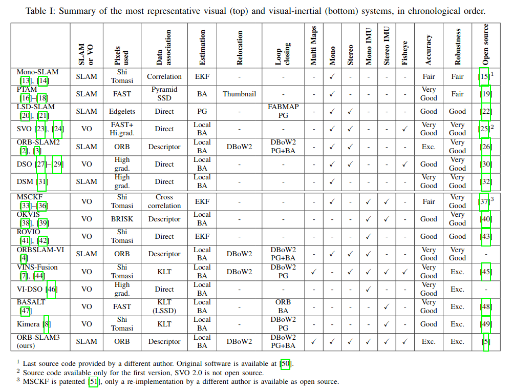
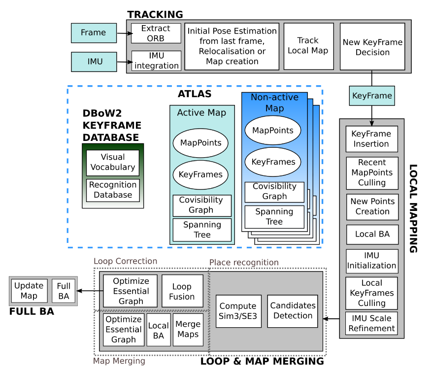
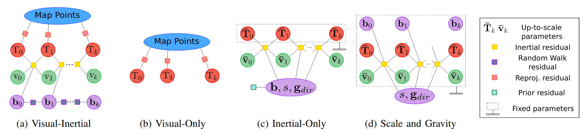
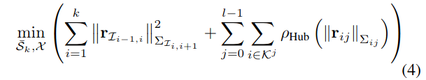

# ORB-SLAM3에 대한 이해

## 초록

This paper presents ORB-SLAM3, the first systemable to perform visual, visual-inertial and multi-map SLAM with monocular, stereo and RGB-D cameras, using pin-hole and fisheye lens models. The first main novelty is a feature-based tightly-integrated visual-inertial SLAM system that fully relies on Maximum-a-Posteriori (MAP) estimation, even during the IMU initialization phase. The result is a system that operates robustly in real time, in small and large, indoor and outdoor environments, and is 2 to 5 times more accurate than previous approaches. The second main novelty is a multiple map system that relieson a new place recognition method with improved recall. Thanks to it, ORB-SLAM3 is able to survive to long periods of poor visual information: when it gets lost, it starts a new map that will be seamlessly merged with previous maps when revisiting mapped areas. Compared with visual odometry systems that only use information from the last few seconds, ORB-SLAM3 is the first system able to reuse in all the algorithm stages all previous information. This allows to include in bundle adjustment co-visible keyframes, that provide high parallax observations boosting accuracy, even if they are widely separated in time or if they come from a previous mapping session. Our experiments show that, in all sensor configurations, ORB-SLAM3 is as robust as the best systems available in the literature, and significantly more accurate. Notably, our stereo-inertial SLAM achieves an average accuracy of 3.6 cm on the [EuRoC drone](https://projects.asl.ethz.ch/datasets/doku.php?id=kmavvisualinertialdatasets) and 9 mm under quick hand-held motions in the room of [TUM-VI dataset](https://arxiv.org/abs/1804.06120) a setting representative of AR/VR scenarios. For the benefit of the community we make public the source code.

## 1. 서론

Intense research on Visual Simultaneous Localization and Mapping systems (SLAM) and Visual Odometry (VO), using cameras alone or in combination with inertial sensors, has produced during the last two decades excellent systems, with increasing accuracy and robustness. Modern systems rely on Maximum a Posteriori (MAP) estimation, which in the case of visual sensors corresponds to Bundle Adjustment (BA), either geometric BA that minimizes feature reprojection error, in feature-based methods, or photometric BA that minimizes the photometric error of a set of selected pixels, in direct methods.

With the recent emergence of VO systems that integrate loop-closing techniques, the frontier between VO and SLAM is more diffuse. The goal of Visual SLAM is to use the sensors on-board a mobile agent to build a map of the environment and compute in real-time the pose of the agent in that map. In contrast, VO systems put their focus on computing the agent’s ego-motion, not on building a map. The big advantage of a SLAM map is that it allows matching and using in BA previous observations performing three types of data association (extending the terminology used in [1]):

- Short-term data association, matching map elements obtained during the last few seconds. This is the only data association type used by most VO systems, that forget environment elements once they get out of view, resulting in continuous estimation drift even when the system moves in the same area.
- Mid-term data association, matching map elements that are close to the camera whose accumulated drift is still small. These can be matched and used in BA in the same way than short-term observations and allow to reach zero drift when the systems moves in mapped areas. They are the key of the better accuracy obtained by our system compared against VO systems with loop detection.
- Long-term data association, matching observations with elements in previously visited areas using a place recognition technique, regardless of the accumulated drift (loop detection) or even if the tracking was lost (relocation).Long term matchings allow to reset the drift and to correct the loop using pose-graph (PG) optimization, or more accurately, using BA. This is the key of SLAM accuracy in medium and large loopy environments.

In this work we build on ORB-SLAM [2], [3] and ORB-SLAM Visual-Inertial [4], the first visual and visual-inertial systems able to take full profit of short-term, mid-term and long-term data association, reaching zero drift in mapped areas. Here we go one step further providing multi-map data association, which allows us to match and use in BA map elements coming from previous mapping sessions, achieving the true goal of a SLAM system: building a map than can be used later to provide accurate localization. This is essentially a system paper, whose most important contribution is the ORB-SLAM3 library itself [5], the most complete and accurate visual, visual-inertial and multi-map SLAM system to date (see table I). The main novelties of ORB-SLAM3 are:

- A monocular and stereo visual-inertial SLAM system that fully relies on Maximum-a-Posteriori (MAP) estimation, even during the IMU (Inertial Measurement Unit) initialization phase. The initialization method proposed was previously presented in [6]. Here we add its integration with ORB-SLAM visual-inertial [4], the extension to stereo-inertial SLAM, and a thorough evaluation in public datasets. Our results show that the monocular and stereo visual-inertial systems are extremely robust and significantly more accurate than other visual-inertial approaches, even in sequences without loops.

- High-recall place recognition. Many recent visual SLAM and VO systems [2], [7], [8] solve place recognition using the DBoW2 bag of words library [9]. DBoW2 requires temporal consistency, matching three consecutive keyframes to the same area, before checking geometric consistency, boosting precision at the expense of recall. As a result, the system is too slow at closing loops and reusing previous maps. We propose a novel place recognition algorithm, in which candidate keyframes are first checked for geometrical consistency, and then for local consistency with three covisible keyframes, that in most occasions are already in the map. This strategy increases recall and densifies data association improving map accuracy, at the expense of a slightly higher computational cost.

- ORB-SLAM Atlas, the first complete multi-map SLAM system able to handle visual and visual-inertial systems, in monocular and stereo configurations. The Atlas can represent a set of disconnected maps, and apply to the mall the mapping operations smoothly: place recognition,camera relocalization, loop closure and accurate seamless map merging. This allows to automatically use and combine maps built at different times, performing incremental multi-session SLAM. A preliminary version of ORB-SLAM Atlas for visual sensors was presented in [10]. Here we add the new place recognition system, the visual-inertial multi-map system and its evaluation on public datasets.
- An abstract camera representation making the SLAM code agnostic of the camera model used, and allowing to add new models by providing their projection, unprojection and Jacobian functions. We provide the implementations of pinhole [11] and fisheye [12] models.

All these novelties, together with a few code improvements make ORB-SLAM3 the new reference visual and visual-inertial open-source SLAM library, being as robust as the best systems available in the literature, and significantly more accurate, as shown by our experimental results in section VII. We also provide comparisons between monocular, stereo,monocular-inertial and stereo-inertial SLAM results that can be of interest for practitioners.

## 2. RELATED WORK

Table I presents a summary of the most representative visual and visual-inertial systems, showing the main techniques used for estimation and data association. The qualitative accuracy and robustness ratings included in the table are based, for modern systems, on the comparisons reported in section VII, and for classical systems, on previous comparisons in the literature [2], [52].

### A. Visual SLAM

Monocular SLAM was first solved in MonoSLAM [13],[14], [53] using an Extended Kalman Filter (EKF) and Shi-Tomasi points that were tracked in subsequent images doing a guided search by correlation. Mid-term data association was significantly improved using techniques that guarantee that the feature matches used are consistent, achieving hand-held visual SLAM [54], [55].

In contrast, keyframe-based approaches estimate the map using only a few selected frames, discarding the information coming from intermediate frames. This allows to perform the more costly, but more accurate, BA optimization at keyframerate. The most representative system was PTAM [16], that split camera tracking and mapping in two parallel threads. Keyframe-based techniques are more accurate than filtering for the same computational cost [56], becoming the gold standard in visual SLAM and VO. Large scale monocular SLAM was achieved in [57] using sliding-window BA, and in [58] using a double-window optimization and a covisibility graph.

Building on these ideas, ORB-SLAM [2], [3] uses ORB features, whose descriptor provides short-term and mid-term data association, builds a covisibility graph to limit the complexity of tracking and mapping, and performs loop-closing and relocalization using the bag-of-words library DBoW2 [9], achieving long-term data association. To date is the only visual SLAM system integrating the three types of data association, which we believe is the key of its excellent accuracy. In this work we improve its robustness in pure visual SLAM with the new Atlas system that starts a new map when tracking is lost, and its accuracy in loopy scenarios with the new high-recall place recognition method.

Direct methods do not extract features, but use directly the pixel intensities in the images, and estimate motion and structure by minimizing a photometric error. LSD-SLAM [20] was able to build large scale semi-dense maps using high gradient pixels. However, map estimation was reduced to pose graph, achieving lower accuracy than PTAM and ORB-SLAM[2]. The hybrid system SVO [23], [24] extracts FAST features, uses a direct method to track features, and any pixel with nonzero intensity gradient, from frame to frame, and optimizes camera trajectory and 3D structure using reprojection error. SVO is extremely efficient, but being a pure VO method, it only performs short-term data association, which limits its accuracy. Direct Sparse Odometry DSO [27] is able to compute accurate camera poses in situations where point detectors perform poorly, enhancing robustness in low textured areas or against blurred images. It introduces local photometric BA that simultaneously optimizes a window of 7 recent keyframes and the inverse depth of the points. Extensions of this work include stereo [29], loop-closing using features and DBoW2[59] [60], and visual-inertial odometry [46]. Direct Sparse Mapping DSM [31] introduces the idea of map reusing indirect methods, showing the importance of mid-term data association. In all cases, the lack of integration of short, mid,and long-term data association results in lower accuracy than our proposal (see section VII).

### B. Visual-Inertial SLAM

The combination of visual and inertial sensors provide robustness to poor texture, motion blur and occlusions, and in the case of monocular systems, make scale observable. 

Research in tightly coupled approaches can be traced back to MSCKF [33] where the EKF quadratic cost in the number of features is avoided by feature marginalization. The initial system was perfected in [34] and extended to stereo in [35], [36]. The first tightly coupled visual odometry system based on keyframes and bundle adjustment was OKVIS [38], [39] that is also able to use monocular and stereo vision. While these systems rely on features, ROVIO [41], [42] feeds an EFK with photometric error using direct data association.

ORB-SLAM-VI [4] presented for the first time a visual-inertial SLAM system able to reuse a map with short-term, mid-term and long-term data associations, using them in an accurate local visual-inertial BA based on IMU preintegration [61], [62]. However, its IMU initialization technique was too slow, taking 15 seconds, which harmed robustness and accuracy. Faster initialization techniques were proposed in [63], [64], based on a closed-form solution to jointly retrieve scale, gravity, accelerometer bias and initial velocity, as well as visual features depth. Crucially, they ignore IMU noiseproperties, and minimize the 3D error of points in space,and not their reprojection errors, that is the gold standard infeature-based computer vision. Our previous work [65] showsthat this results in large unpredictable errors.VINS-Mono [7] is a very accurate and robust monocular-inertial odometry system, with loop-closing using DBoW2 and 4 DoF pose-graph optimization, and map-merging. Feature tracking is performed with Lucas-Kanade tracker, being slightly more robust than descriptor matching.

In VINS-Fusion[44] it has been extended to stereo and stereo-inertial. Kimera[8] is an novel outstanding metric-semantic mapping system, but its metric part consists in stereo-inertial odometry plus loop closing with DBoW2 and pose-graph optimization, achieving similar accuracy to VINS-Fusion. The recent BASALT [47] is a stereo visual-inertial odometry system that extracts non-linear factors from visual-inertial odometry to use them in BA,and closes loops matching ORB features, achieving very good to excellent accuracy.

Recently, VI-DSO [66] extends DSO to visual-inertial odometry. They propose a bundle adjustment which combines inertial observations with the photometric error in selected high gradient pixels, what renders very good accuracy. As the information in high gradient pixels is successfully exploited, the robustness in scene regions with poor texture is also boosted. Their initialization method relies on visual-inertial BA and takes 20-30 seconds to converge within 1% scale error. In this work we build on ORB-SLAM-VI and extend it to stereo-inertial SLAM. We propose a novel fast initialization method based on Maximum-a-Posteriori (MAP) estimation that properly takes into account visual and inertial sensor uncertainties, and estimates the true scale with 5% error in 2 seconds, converging to 1% scale error in 15 seconds. All other systems discussed above are visual-inertial odometry methods, some of them extended with loop closing, and lack the capability of using mid-term data associations. We believe this, together with our fast and precise initialization, is the key of the better accuracy consistently obtained by our system,even in sequences without loops.

### C. Multi-Map SLAM

The idea of adding robustness to track losses during exploration by means of map creation and fusion was first proposed in [67] within a filtering approach. One of the first keyframe based multi-map systems was [68], but the map initialization was manual, and the system was not able to merge or relate the different sub-maps. Multi-map capability has been researched as a component of collaborative mapping systems, with several mapping agents and a central server that only receives information [69] or with bidirectional information flow as in C2TAM[70]. MOARSLAM [71] proposes a robust stateless client-server architecture for collaborative multiple-device SLAM, but the main focus is the software architecture, not reporting accuracy results.

More recently, CCM-SLAM [72], [73] proposes a distributed multi-map system for multiple drones with bidirectional information flow, built on top of ORB-SLAM. Their focus is on overcoming the challenges of limited bandwidth and distributed processing, while ours is on accuracy and robustness, achieving significantly better results on the EuRoC dataset. ORB-SLAMM [74] also proposes a multi-map extension of ORB-SLAM2, but keeps sub-maps as separated entities, while we perform seamless map merging, building a more accurate global map.

VINS-Mono [7] is a visual odometry system with loop closing and multi-map capabilities that rely on the place recognition library DBoW2 [9]. Our experiments show that ORB-SLAM3 is 2.6 times more accurate than VINS-Mono in monocular-inertial single-session operation on the EuRoc dataset, thanks to our ability to use mid-term data association. Our Atlas system also builds on DBoW2, but proposes a novel higher-recall place recognition technique, and performs more detailed and accurate map merging using local BA, increasing the advantage to 3.2 times better accuracy than VINS-Mono in multi-session operation on EuRoC.

## 3. 시스템 개요

ORB-SLAM3 is built on ORB-SLAM2 [3] and ORB-SLAM-VI [4]. It is a full multi-map and multi-session sys-tem able to work in pure visual or visual-inertial modes

with monocular, stereo or RGB-D sensors, using pin-hole and fisheye camera models. Figure 1 shows the main system components, that are parallel to those of ORB-SLAM2 with some significant novelties, that are summarized next:

- **Atlas** is a multi-map representation composed of a set of disconnected maps. There is an active map where the tracking thread localizes the incoming frames, and is continuously optimized and grown with new keyframes by the local mapping thread. We refer to the other maps in the Atlas as the non-active maps. The system builds a unique DBoW2 database of keyframes that is used for relocalization, loop closing and map merging.
- **Tracking thread** processes sensor information and computes the pose of the current frame with respect to the active map in real-time, minimizing the reprojection error of the matched map features. It also decides whether the current frame becomes a keyframe. In visual-inertial mode, the body velocity and IMU biases are estimated by including the inertial residuals in the optimization. When tracking is lost, the tracking thread tries to relocate the current frame in all the Atlas’ maps. If relocated, tracking is resumed, switching the active map if needed. Otherwise, after a certain time, the active map is stored as non-active, and a new active map is initialized from scratch.
- **Local mapping thread** adds keyframes and points to the active map, removes the redundant ones, and refines the map using visual or visual-inertial bundle adjustment, operating in a local window of keyframes close to the current frame. Additionally, in the inertial case, the IMU parameters are initialized and refined by the mapping thread using our novel MAP-estimation technique.
- **Loop and map merging thread** detects common regions between the active map and the whole Atlas at keyframe rate. If the common area belongs to the active map, it performs loop correction; if it belongs to a different map,both maps are seamlessly merged into a single one, that becomes the active map. After a loop correction, a full BA is launched in an independent thread to further refine the map without affecting real-time performance.

## 4.  CAMERA MODEL

ORB-SLAM assumed in all system components a pin-hole camera  model.  Our  goal  is  to  abstract  the  camera  model from  the  whole  SLAM  pipeline  by  extracting  all  properties and  functions  related  to  the  camera  model  (projection  and unprojection  functions,  Jacobian,  etc)  to  separate  modules. This allows our system to use any camera model by providing the  corresponding  camera  module.  In  ORB-SLAM3  library, apart from the pinhole model, we provide the Kannala-Brandt[12] fisheye model. However, camera model abstraction raises some difficulties that need to be addressed, and are discussed next.

### A.  Relocalization

A  robust  SLAM  system  needs  the  capability  of  relocating the  camera  when  tracking  fails.  ORB-SLAM  solves  the  relocalization  problem  by  setting  a  Perspective-n-Points  solver based on the ePnP algorithm [75], which assumes a calibrated pinhole camera along all its formulation. To follow up with our approach, we need a PnP algorithm that works independently of  the  camera  model  used.  For  that  reason,  we  have  adopted Maximum Likelihood Perspective-n-Point algorithm (MLPnP)[76]  that  is  completely  decoupled  from  the  camera  model  as it uses projective rays as input. The camera model just needs to  provide  an  unprojection  function  passing  from  pixels  to projection rays, to be able to use relocalization.

### B. Non-rectified Stereo SLAM

Most  stereo  SLAM  systems  assume  that  stereo  frames are  rectified,  i.e.  both  images  are  transformed  to  pin-hole projections  using  the  same  focal  length,  with  image  planes co-planar,  and  are  aligned  with  horizontal  epipolar  lines,such  that  a  feature  in  one  image  can  be  easily  matched  by looking  at  the  same  row  in  the  other  image.  However  the assumption of rectified stereo images is very restrictive and, in many  applications,  is  not  suitable  nor  feasible.  For  example,rectifying  a  divergent  stereo  pair,  or  a  stereo  fisheye  camera would require severe image cropping, loosing the advantages of  a  large  field  of  view:  faster  mapping  of  the  environment and better robustness to occlusions.

For that reason, our system does not rely on image rectification,  considering  the  stereo  rig  as  two  monocular  camera shaving:

1)  a constant relative SE(3) transformation between them, and

2)  optionally,  a  common  image  region  that  observes  the same portion of the scene.

These  constrains  allow  us  to  effectively  estimate  the  scale of the map by introducing that information when triangulating new  landmarks  and  in  the  Bundle  Adjustment  optimization.

These  constrains  allow  us  to  effectively  estimate  the  scale of the map by introducing that information when triangulating new  landmarks  and  in  the  Bundle  Adjustment  optimization.

Following up with this idea, our SLAM pipeline estimates a 6 DoF rigid body pose, whose reference system can be located in one of the cameras or in the IMU sensor, and represent thecameras with respect to the rigid body pose.

If both cameras have an overlapping area in which we have stereo  observations,  we  can  triangulate  true  scale  landmarks the first time they are seen. The rest of both images still has a  lot  of  relevant  information  for  the  SLAM  pipeline  and  it is used as monocular information. Features first seen in these areas are triangulated from multiple views, as in the monocular case.

## V.  VISUAL-INERTIALSLAM

ORB-SLAM-VI [4] was the first true visual-inertial SLAM system  capable  of  map  reusing.  However,  it  was  limited  to pinhole  monocular  cameras,  and  its  initialization  was  too slow, failing in some challenging scenarios. In this work, we build  on  ORB-SLAM-VI  providing  a  fast  an  accurate  IMU initialization  technique,  and  an  open-source  SLAM  library capable of monocular-inertial and stereo-inertial SLAM, with pinhole and fisheye cameras.

### A.  Fundamentals

While   in   pure   visual   SLAM,   the   estimated   state   only includes  the  current  camera  pose,  in  visual-inertial  SLAM, additional variables need to be computed. These are the body pose $\mathbf T_i = [\mathbf R_i, \mathbf p_i] \in \mathbf S \mathbf E (3)$ and  velocity $\mathbf v_i$ in  the  world frame,  and  the  gyroscope  and  accelerometer  biases, $\mathbf b_i^g$ and $\mathbf b_i^a$,  which  are  assumed  to  evolve  according  to  a  Brownian motion. This leads to the state vector:
$$
\mathcal S_i \doteq 
\{
\mathbf T_i, \mathbf v_i, \mathbf b_i^g, \mathbf b_i^a
\}
\tag{1}
$$
For  visual-inertial  SLAM,  we  preintegrate  IMU  measurements between consecutive visual frames, $i$ and $i+1$, following the theory developed in [61], and formulated on manifolds in [62].  We  obtain  preintegrated  rotation,  velocity  and  position measurements, denoted as $\Delta \mathbf R_{i, i+1}$, $\Delta \mathbf v_{i, i+1}$ and $\Delta \mathbf p_{i, i+1}$, as well an information matrix $\sum _{\mathcal I_{i, i+1}}$ for the whole measurement vector. Given these preintegrated terms and states $\mathcal S_i$ and $\mathcal S_{i+1}$, we adopt the definition of inertial residual $\mathbf r_{\mathcal I_{i, i+1}}$ from [62]:
$$
\begin{aligned}
\mathbf r_{\mathcal I_{i, i+1}}
&= [
\mathbf r _{\Delta \mathbf R_{i, i+1}},
\mathbf r _{\Delta \mathbf v_{i, i+1}},
\mathbf r _{\Delta \mathbf p_{i, i+1}}
]
\\
\mathbf r _{\Delta \mathbf R_{i, i+1}}
&=
\log(\Delta \mathbf R_{i, i+1}^\top R_{i}^\top R_{i+1}^\top)
\\
\mathbf r _{\Delta \mathbf v_{i, i+1}}
&=
\mathbf R_i^\top (\mathbf v_{i+1} - \mathbf v_{i} - \mathbf g \Delta t_{i, i+1}) - \Delta \mathbf v _{i, i+1}
\\
\mathbf r _{\Delta \mathbf p_{i, i+1}}
&=
\mathbf R_i^\top (\mathbf p_{j} - \mathbf p_{i} - \mathbf v_{i} \Delta t  - \frac{1}{2} \mathbf g \Delta t^2) - \Delta \mathbf p_{i, i+1}
\end{aligned}
\tag{2}
$$
Together  with  inertial  residuals,  we  also  use  reprojection errors $\mathbf r_{ij}$ between frame i and 3D point $j$ at position $\mathbf x_j$:
$$
\mathbf r_{ij} = \mathbf u _{ij} - \Pi (\mathbf T _\mathrm{CB} \mathbf T_i^{-1} \oplus \mathbf x_j)
$$
where $\Pi : \R^3 \rightarrow \R^n$ is the projection function for the corresponding camera model, $\mathbf u_{ij}$ is observation of point $j$ at image $i$, having an information matrix $\sum_{ij}$.  $\mathbf T_\mathrm{CB} \in \mathbf{SE}(3)$ stands for the rigid transformation from body-IMU to camera (left or right), known form calibration. $\oplus$ is the transformation operation of $\mathbf{SE}(3)$ group over $\R^3$ elements.

Figure 2: Factor graph representation for different optimizations along the system

Combining inertial and visual residual terms, visual-inertial SLAM can be posed as a keyframe-based minimization problem [39].  Given a set of $ k + 1 $ keyframes  and  its  state $\bar{\mathcal{S}}_k \doteq \{ \mathcal S_0 \dots \mathcal S_k \}$,  and  a  set  of $l$ 3D  points  and  its  state $\mathcal X \doteq {\mathbf x_0 \dots \mathbf x_{l−1}}$,  the  visual-inertial  optimization  problem can be stated as:

where $\mathcal K_j$ is  the  set  of  keyframes  observing  3D  point $j$. This optimization may be outlined as the factor-graph shown in  figure  2a.  Note  that  for  reprojection  error  we  use  a  robust  Huber  kernel $\rho$ Hub to  reduce  the  influence  of  spurious matchings,  while  for  inertial  residuals  it  is  not  needed,  since miss-associations  do  not  exist.  This  optimization  needs  to be  adapted  for  efficiency  during  tracking  and  mapping,  but more importantly, it requires good initial seeds to converge to accurate solutions.

### B.  IMU Initialization

The  goal  of  this  step  is  to  obtain  good  initial  values  for the  inertial  variables:  body  velocities,  gravity  direction,  and IMU biases. Some systems like VI-DSO [46] try to solve from scratch visual-inertial BA, sidestepping a specific initialization process, obtaining slow convergence for inertial parameters (up to 30 seconds). In  this  work  we  propose  a  fast  and  accurate  initialization method based on three key insights: 

- Pure monocular SLAM can provide very accurate initial maps [2], whose main problem is that scale is unknown. Solving  first  the  vision-only  problem  will  enhance  IMU initialization.
- As shown in [77], scale converges much faster when it is explicitly represented as an optimization variable, instead of using the implicit representation of BA.
- Ignoring  sensor  uncertainties  during  IMU  initialization produces large unpredictable errors [65]. So,  taking  properly  into  account  sensor  uncertainties,  we state  the  IMU  initialization  as  a  MAP  estimation  problem,split in three steps:
  - 1) **Vision-only    MAP    Estimation**:   We   initialize   pure monocular  SLAM  [2]  and  run  it  during  2  seconds, inserting keyframes at 4Hz. After this period, we have an up-to-scale map composed of $k = 10$ camera poses and hundreds of points, that is optimized using Visual-Only BA  (figure  2b).  These  poses  are  transformed  to  body reference,  obtaining  the  trajectory $\bar{\mathbf T}_{0:k} = [\mathbf R,\bar{\mathbf p}]_{0:k}$where the bar denotes up-to-scale variables.

## 참조

## 참조2

1. [Carlos Campos](https://arxiv.org/search/cs?searchtype=author&query=Campos%2C+C), [Richard Elvira](https://arxiv.org/search/cs?searchtype=author&query=Elvira%2C+R), [Juan J. Gómez Rodríguez](https://arxiv.org/search/cs?searchtype=author&query=Rodríguez%2C+J+J+G), [José M. M. Montiel](https://arxiv.org/search/cs?searchtype=author&query=Montiel%2C+J+M+M), [Juan D. Tardós](https://arxiv.org/search/cs?searchtype=author&query=Tardós%2C+J+D). [ORB-SLAM3: An Accurate Open-Source Library for Visual, Visual-Inertial and Multi-Map SLAM.](https://arxiv.org/abs/2007.11898)
2. [David Schubert](https://arxiv.org/search/cs?searchtype=author&query=Schubert%2C+D), [Thore Goll](https://arxiv.org/search/cs?searchtype=author&query=Goll%2C+T), [Nikolaus Demmel](https://arxiv.org/search/cs?searchtype=author&query=Demmel%2C+N), [Vladyslav Usenko](https://arxiv.org/search/cs?searchtype=author&query=Usenko%2C+V), [Jörg Stückler](https://arxiv.org/search/cs?searchtype=author&query=Stückler%2C+J), [Daniel Cremers](https://arxiv.org/search/cs?searchtype=author&query=Cremers%2C+D) [The TUM VI Benchmark for Evaluating Visual-Inertial Odometry](https://arxiv.org/abs/1804.06120)

## 데이터셋

- [EuRoC MAV dataset](https://projects.asl.ethz.ch/datasets/doku.php?id=kmavvisualinertialdatasets)

- [The TUM VI Benchmark for Evaluating Visual-Inertial Odometry](https://vision.in.tum.de/data/datasets/visual-inertial-dataset)