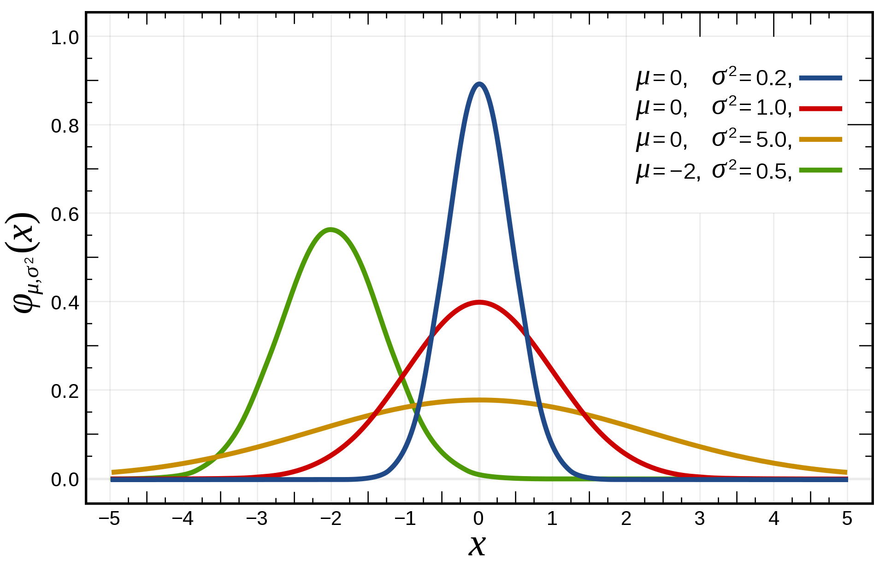

[Up](index.md)

# Kalman filter

## 추정

앞에서 예측한 추정 예측값 $\breve x_k$에 입력된 $k$번째 측정값 $z_k$ 을 적용하여 $k$번째 추정값 $\hat x_k$를 계산합니다.
$$
\begin{aligned}
\hat x_k = \breve x_k + K_k (z_k - H \breve x_k)
\end{aligned}
$$
이 식을 전개해 보겠습니다.
$$
\begin{aligned}
\hat x_k
&= \breve x_k + K_k (z_k - H \breve x_k)
\\
&= \breve x_k + K_k z_k - K_k H \breve x_k
\\
&= \breve x_k - K_k H \breve x_k + K_k z_k
\\
&= (I - K_k H) \breve x_k + K_k z_k
\end{aligned}
$$
여기서 $I$는 단위행렬 (identity matrix) 이며 $H$를 단위행렬로 가정하고 식을 다시 씁니다.
$$
\begin{aligned}
\hat x_k
&= (I - K_k H) \breve x_k + K_k z_k
\\
&= (I - K_k I) \breve x_k + K_k z_k
\\
&= (I - K_k) \breve x_k + K_k z_k
\end{aligned}
$$
앞에서 거론한 저주파 통과 필터를 확인해 봅니다.
$$
\begin{aligned}
\bar x_{k} = a \bar x_{k-1} + (1-a) x_k
\end{aligned}
$$
이 저주파 통과 필터에 $a = 1 - K$를 대입하여 다시 써 보겠습니다.
$$
\begin{aligned}
\bar x_{k}
&= a \bar x_{k-1} + (1-a) x_k
\\
&= (1-K) \bar x_{k-1} + (1-(1-K)) x_k
\\
&= (1-K) \bar x_{k-1} + K x_k
\end{aligned}
$$
정리한 1차 저주파 통과 필터와 칼만필터 추정식을 비교해 보겠습니다.
$$
\begin{aligned}
1차 저주파 통과 필터&:
\bar x_{k}
= (1-K) \bar x_{k-1} + K x_k
\\
칼만 필터&: \hat x_k
= (I - K_k) \breve x_k + K_k z_k
\end{aligned}
$$
저주파 통과 필터의 이전 값과 가중치는 $(1-K) \bar x_{k-1}$이며, 칼만필터의 이전 예측값과 칼만 이득은 $(I-K_k)\hat x _k$ 입니다.

저주파 통과 필터의 새 입력 데이터는 $x_k$이며, 칼만필터의 새 측정값은 $z_k$입니다.

칼만필터의 추정식에 시스템 상수 $H$를 단위행렬 $I$로 치환한 식과 저주파 통과 필터는 매우 닮았음을 알 수 있습니다.

## 칼만이득

*칼만필터의 가중치가 저주파 통과 필터의 가중치와 다른 점*

칼만필터와 저주파 통과 필터가 닮았다고 하지만, 칼만필터만의 다른 점이 있습니다. 추정식을 다시 확인해 보겠습니다.
$$
\begin{aligned}
\hat x_k = \breve x_k + K_k (z_k - H \breve x_k)
\end{aligned}
$$

시스템 상수 $H$는 시스템 설계 과정에서 결정 되는 상수입니다.

측정값 $z_k$는 외부에서 입력을 받습니다.

$K_k$는 변수로 칼만이득으로 추정값을 계산에 이 값도 사용됩니다.

칼만이득 $K_k$를 계산하는 식을 다시 보겠습니다.
$$
\begin{align}
K_k = \breve P_k H ^\top (H \breve P_k H^\top + R)^{-1}
\end{align}
$$
저주파 통과 필터에서 가중치 변수는 $a$ 이며 시스템 설계자가 임으로 정하고 실험을 통해 개선 합니다. 칼만필터에서 추정값 계산시 칼만이득 $K_k$은 알고리즘을 반복하면서 조정됩니다. 이 점이 저주파 통과 필터와 칼만필터가 다른 점입니다.

## 오차공분산

오차공분산으로 추정값이 정확한지 판단 할 수 있습니다. 오차공분산은 추정값이 실제 참값과 얼마나 차이가 나는지 표현하는 척도가 됩니다. 오차공분산이 크면 추정 오차가 크고, 작으면 추정 오차도 작습니다.

오차공분산 $P_k$는 다음 식으로 얻습니다.
$$
\begin{aligned}
P_k = \breve P_k - K_k H \breve P_k
\end{aligned}
$$
여기에 시스템 상수 $H$, 칼만이득 $K_k$, 오차공분산 예측값 $\breve P_k$가 사용됩니다.

참값 $x_k$와 추정값 $\hat x_k$, 오차공분산 $P_k$ 사이에는 다음과 같은 관계가 있습니다.
$$
\begin{aligned}
x_k \sim N(\hat x_k, P_k)
\end{aligned}
$$
여기서 $N(\dots)$은 정규분포 (normal distribution)을 따른 다는 뜻입니다. 정규분포는 종 모양의 확률분포 입니다.

정규분포의 최고값이 높으면 추정오차가 작으며, 넓게 퍼지면 추정오차가 크게 됩니다.

오차공분산의 수학적 정의는 다음과 같습니다.
$$
\begin{aligned}
P_k = E \{ (x_k - \hat x_k) (x_k - \hat x_k)^\top \}
\end{aligned}
$$
여기서, $E$는 변수의 평균을 구하는 연산자이며, $x_k$는 참값이며 $\hat x_k$는 추정값이며, $x_k - \hat x_k$는 추정오차입니다. 즉, 오차공분산은 추정오차의 제곱을 평균한 값을 말합니다.

## 예측

예측은 시각이 $t_{k-1}$에서 다음 시각 $t_k$로 바뀔때 추정값 $\hat x_{k-1}$가 어떻게 변하는지 예측합니다.

### 추정값 예측

추정값은 아래 식으로 예측합니다.
$$
\begin{align}
\breve x_k &= A \hat x_{k-1} \\\\
\end{align}																																																																																																																																																		
$$
이전 추정값에 시스템 상수 $A$를 적용하여 계산합니다.

다시 추정값 계산식을 소환하여 보겠습니다.
$$
\begin{aligned}
\hat x_k = \breve x_k + K_k (z_k - H \breve x_k)
\end{aligned}
$$
여기에 예측 추정값 $\breve x_k = A \hat x_{k-1}$를 적용해 보겠습니다.
$$
\begin{aligned}
\hat x_k = A \hat x_{k-1} + K_k (z_k - H A \hat x_{k-1})
\end{aligned}
$$
이것은 직전 추정값입니다. 저주파 필터는 직전추정값을 바로 사용하지만, 칼만필터는 예측 추정값을 거쳐서 계산합니다.

- 예측 추정값을 사전 추정값 (priori estimate)
- 추정값을 사후 추정값 (posteriori estimate)

라고도 부릅니다.

추정값 계산식을 다시 보겠습니다.
$$
\begin{aligned}
\hat x_k = \breve x_k + K_k (z_k - H \breve x_k)
\end{aligned}
$$
여기서 $H \breve x_k$는 예측 추정값을 말합니다. 그렇다면 $(z_k - H \breve x_k)$는 관측값과 예측 추정값의 차이, 즉 예측 오차가 됩니다.

그래서 **칼만필터는 측정값의 예측 오차로 예측값을 적절히 보정하여 최종 추정값을 계산한다**라고 볼 수 있습니다. 여기서 칼만이득 $K_k$는 관측값과 예측 추정값의 차이를 얼마나 반영할지를 결정하는 매개변수가 됩니다.

추정값의 정확성에 가장 큰 영향을 주는 요인은 예측값의 정확성입니다.

## 시스템모델

칼만필터는 다음과 같은 선형 상태 모델을 대상으로 합니다.

$k+1$번째 추정값 $x_{k+1}$은 시스템 상수 $A$와 이전 추정값 $x_k$와 시스템 잡음 $w_k$의 영향을 받습니다.
$$
\begin{aligned}
x_{k+1} = A x_k + w_k
\end{aligned}
\tag{3.1}
$$
$k$번째 관측값 $z_k$는 출력행렬 $H$와 측정잡음 $v_k$의 영향을 받습니다.
$$
\begin{aligned}
z_k = H x_k + v_k
\end{aligned}
\tag{3.2}
$$
여기서,

$x_k$는 상태 변수이며 $(n \times 1)$ 의 열벡터로, 거리, 속도, 무게 등 우리가 관심 있는 물리적인 변수로 이해하면 쉽습니다.

$z_k$는 측정값으로 $(m \times 1)$ 의 열벡터입니다.

$A$는 시스템 행렬이며 $(n \times n)$ 의 행렬로 상수로, 시간에 따라 시스템이 어떻게 움직이는지 나타냅니다.

$H$는 출력 행렬수이며 $(m \times m)$ 의 행렬로 상수로, 측정값과 상태 변수의 관계를 나타내며, 측정값에 각 상태 변수가 어떻게 반영되는지를 이 행렬이 규정 합니다.

$w_k$는 시스템 잡음이며 $(n \times 1)$ 의 열벡터이며, $v_k$는 측정 잡음이며 $(m \times 1)$ 의 열벡터입니다. 칼만필터에서 잡음의 역할은 중요한데 시스템 잡음은 시스템에 유입되어 상태 변수에 영향을 주는 잡음을 말하며, 측정 잡음은 센서에서 유입되는 잡음을 말합니다.

칼만필터의 추정값 예측식
$$
\begin{align}
\breve x_{k+1} &= A \hat x_k \\\\
\end{align}
\tag{3.3}
$$
은 식 (3.1)
$$
\begin{aligned}
x_{k+1} = A x_k + w_k
\end{aligned}
\tag{3.1}
$$
에서 비롯되었으며 잡음항이 빠져 있을 뿐입니다.

추정값 계산식
$$
\begin{aligned}
\hat x_k = \breve x_k + K_k (z_k - H \breve x_k)
\end{aligned}
\tag{3.4}
$$
은 식 (3.2)
$$
\begin{aligned}
z_k = H x_k + v_k
\end{aligned}
\tag{3.2}
$$
와 관련이 있으며 잡음항이 빠져 있습니다.

### 잡음의 공분산

잡음은 예측할 수 없으며 통계적으로 추정만 가능 합니다. 칼만필터에서 잡음은 평균이 0인 정규분포를 따른다고 가정하기 때문에 잡음의 분산(variance)만 알면 됩니다. 이론적으로 칼만필터는 상태 모델의 잡음을 공분산행렬로 표현 합니다.

$Q$: $w_k$의 공분산 행렬,  $(n \times n)$ 대각 행렬.

$R$: $v_k$의 공분산 행렬,  $(m \times m)$ 대각 행렬.

여기서, 대각행렬(diagonal matrix)은 대각선 외의 성분은 $0$인 행렬을 말합니다.

공분산 행렬은 변수의 분산으로 구성되며, 예를 들어 $n$개의 잡음 $w_1, w_2, \dots, w_n$이 있고, 각 잡음의 분산은 $\sigma_1^2, \sigma_2^2, \dots, \sigma_n^2$이라면, 공분산 행렬 $Q$는 
$$
\begin{aligned}
Q =
\begin{bmatrix}
\sigma_1^2 & 0 & \cdots & 0 \\
0 & \sigma_1^2 & \cdots & 0 \\
\vdots & \vdots & \ddots & \vdots \\
0 & 0 & \cdots & \sigma_n^2\\
\end{bmatrix}
\end{aligned}
$$
로 쓸 수 있으며, 측정잡음 $v_k$에 대한 공분산 행렬 $R$도 같은 방식으로 구성 합니다.

잡음에 대한 공분산 행렬 $Q$와 $R$은 여러 오차가 복합적으로 작용하기때문에 해석적으로 결정하는데는 한계가 있으며 시행착오를 통해 보정을 하면서 적절한 값을 찾아야 하는데 적절한 기준을 가지고 찾는 방법이 있습니다.

칼만 이득 $K_k$를 계산하는 식
$$
\begin{align}
K_k = \breve P_k H ^\top (H \breve P_k H^\top + R)^{-1}
\end{align}
$$
입니다. 행렬이기때문에 역행렬이 사용되어 감을 잡기 어려운데 행렬들을 스칼라로 간주하면 식
$$
\begin{align}
K_k = \frac{\breve P_k H ^\top}{H \breve P_k H^\top + R}
\end{align}
$$
이며, 여기서 $R$이 커지면 칼만 이득이 작아지는 것을 알 수 있습니다. 칼만 이득이 작아지면 추정값 계산식
$$
\begin{aligned}
\hat x_k
= (I - K_k) \breve x_k + K_k z_k
\end{aligned}
$$
를 확인하면, 추정값 계산에 측정값이 반영되는 비율도 작아 집니다. 반면에 예측값의 반영 비율은 높아 집니다.

다시 정리해 보겠습니다.

- $R$ 값이 커지면, 외부 측정값의 영향을 덜 받게 되어 추정값의 변화가 감소 합니다.
- $R$값이 작아지면, 외부 측정값의 영향을 더 받게 되어 추정값의 변화가 증가 합니다.

$R$값이 커지면 외부 측정값에 대해 둔감해지고, $R$값이 작아지면 외부 측정값에 대해 민감해 집니다. 아날로그 회로라면 $R$값은 외부에서 유입되는 신호의 저항값이라고 생각하면 암기하기 쉽습니다.

다음은 시스템 잡음 $w_k$에 대한 공분산 행렬 $Q$를 찾는 방법을 보겠습니다. 먼저 $Q$는 오차공분산 예측값을 계산하는데 사용됩니다.
$$
\begin{align}
\breve P_k &= AP_{k-1} A^\top + Q
\end{align}
$$
여기서 시스템 잡음 공분산 행렬  $Q$가 커질 수록 오차 공분산 예측값도 커지며, 칼만이득 계산식을 스칼라로 간주한 식
$$
\begin{align}
K_k = \frac{\breve P_k H ^\top}{H \breve P_k H^\top + R}
\end{align}
$$
을 다시 보면 오차공분산 예측값이 커지면 칼만이득도 커짐을 알 수 있습니다. 즉 시스템 잡음 공분산 행렬 $Q$가 커지면, 칼만 이득이 커지고, 칼만 이득이 커지면, 측정값이 더 많이 반영 됩니다.

다시 정리해 보겠습니다.

- $Q$ 값이 커지면, 측정값이 더 많이 반영되여 추정값의 변화가 증가 합니다.
- $Q$ 값이 작아지면, 측정값이 더 적게 반영되어 추정값의 변화가 감소 합니다.

즉, $Q$와 $R$은 서로 반대되는 작용을 합니다.

