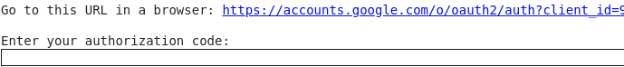
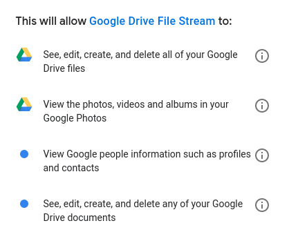

[Up](index.md)

# Google Colab의 파일 및 드라이브

구글 Colab은 무료로 강력한 컴퓨팅을 제공합니다. 로컬컴퓨터와 달리 파일을 I/O나 파일 시각화가 어렵습니다. 많은 경우 직접 업로드 또는 다운로드 해야 합니다.

## 로컬 컴퓨터와 파일 IO

로컬컴퓨터와의 파일 IO는 데이터가 대양을 건너오느라 느리다는 문제가 있습니다.

##### 로컬 컴퓨터에서 원격 컴퓨터로 파일 업로드 `files.upload()`

```python
from google.colab import files

uploaded = files.upload()

for fn in uploaded.keys():
  print('User uploaded file "{name}" with length {length} bytes'.format(
      name=fn, length=len(uploaded[fn])))
```

`files.upload()`를 실행하면 실행 셀에 파일업로드가 표시되며 로컬 파일을 선택하여 업로드 할 수 있습니다.


##### 원격 컴퓨터에서 로컬 컴퓨터로 파일 다운로드`files.download(...)`

```python
from google.colab import files

with open('example.txt', 'w') as f:
  f.write('some content')

files.download('example.txt')
```

`files.download(파일명)`을 실행하면 파일을 다운로드 합니다.

## Google Drive 사용하기

구글 드라이브와의 파일 입출력은 매우 빠릅니다. 구글 드라이브 장비와 Colab 장비가 가까이 있거나 빠른 회선으로 연결되어 있을거라 추정 합니다.

구글 드라이브를 사용하는 방법은 3가지가 있습니다.

- 구글 드라이브를 Colab 런타임 가상머신에 마운트하는 방법.
- API를 PyDrive 같은 것으로 감싸서 사용하는 방법.

- Google Drive [Native REST API](https://developers.google.com/drive/api/v3/about-sdk)를 사용하는 방법.

##### 구글 드라이브로 마운트하기

Google Drive를 마운트하는 방법을 보겠습니다. 

먼저 다음 Colab 셀에서 다음을 실행합니다.

```python
from google.colab import drive
drive.mount('/content/gdrive')
```

그러면 다음처럼 링크가 표시되고 인증 코드를 요구합니다.



링크를 클릭하면 권한이 표시 됩니다.



아래에서 Allow 버튼을 클릭하면 


인증 코드가 표시됩니다.

이 인증 코드를 붙여 넣기를 하고 엔터를 누릅니다. 성공했다면 다음 메시지가 표시됩니다.

```
Enter your authorization code:
··········
Mounted at /content/gdrive
```

테스트 파일을 생성하고 표시해 보겠습니다.

```python
with open('/content/gdrive/My Drive/foo.txt', 'w') as f:
  f.write('Hello Google Drive!')
!cat /content/gdrive/My\ Drive/foo.txt
```

```
Hello Google Drive!
```

참 쉽죠?

##### PyDrive를 사용하는 방법

먼저 구글 드라이브에 관련된 패키지 라이브러리들을 로드 합니다.

```python
from pydrive.auth import GoogleAuth
from pydrive.drive import GoogleDrive
from google.colab import auth
from oauth2client.client import GoogleCredentials
```

구들 드라이브 인증을 얻습니다.

```
auth.authenticate_user()
gauth = GoogleAuth()
gauth.credentials = GoogleCredentials.get_application_default()
drive = GoogleDrive(gauth)
```

링크와 함께 검증코드를 입력을 요구합니다. 


링크를 클릭하면, 구글 로그인이 나옵니다.


로그인 하거나 로그인된  계정을 선택하면 퍼미션을 요구하고,


퍼미션을 허가 해주면 base64로 구성된 검증 코드를 표시합니다. 


검증 코드를 클립보드에 복사한 후 다시 Colab으로 되돌아가 검증 코드를 붙여 넣고 엔터를 누릅니다. 

잠시 기다리면 검증 코드 입력 셀이 사라집니다.

예제 파일을 구글 드라이브에 생성하고 Colab으로 업로드해 봅니다.

```python
uploaded = drive.CreateFile({'title': 'Sample upload.txt'})
uploaded.SetContentString('Sample upload file content')
uploaded.Upload()
print('Uploaded file with ID {}'.format(uploaded.get('id')))
```

파일이 업로드되면 성공했다는 메시지가 파일 ID와 함께 셀에 표시됩니다.

```
Uploaded file with ID ...............................
```

구글 드라이브에 파일이 생성되었는지 확인 합니다. 구글 드라이브는 파일 이름이 아니라 ID로 구분하니 동일 이름의 파일이 여러개 있을 수 있습니다.


## 참조

- [External data: Drive, Sheets and Cloud Storage](https://colab.research.google.com/notebooks/io.ipynb#scrollTo=vz-jH8T_Uk2c)