Dev Container로 JavaScript 개발환경 구성

# #1 기초편

JavaScript 는 Node 환경에서 개발 할 수 있습니다. 이 글은 Dev Container에 Node 개발 환경을 구성합니다. Dev Container는 Node 뿐만 아니라 준비된 다양한 개발 환경을 구성 할 수 있습니다. 예를 들자면, Python, Dart, Java  같은 개발 환경들입니다.

## Dev Container란?

마이크로소프트가 제안한 개발 환경 컨테이너 입니다.

장점:

- 개발환경을 빠르게 구축할 수 있습니다.
- 가상머신보다 적은 자원만을 필요로 합니다.
- 참여하는 개발자들이 동일한 개발 환경을 사용할 수 있습니다.
- 소스코드와 함께 개발 환경을 공유 할 수 있습니다.
- 적은 오버헤드로 다른 장비에서 사용할 수 있습니다.
- 개발/테스트/스테이징/운영 환경을 동일하게 구성할 수 있습니다.
- 호스트 운영체제를 손상시키지 않습니다.

## Dev Container는 다음으로 구성됩니다.

### [Ubuntu]에서 구성

Ubuntu에서 간단한 명령으로 Dev Container를 사용할 수 있습니다.

- Docker
- Visual Studio Code
- Dev Containers (Visual Studio Extension)

### [Windows]에서 구성

윈도우에서도 Docker와 Dev Container를 사용할 수 있습니다.

- Windows Subsystem for Linux (WSL)
- Docker Desktop
- Visual Studio Code
- Dev Containers (Visual Studio Extension)

## [Windows]에서 Windows Subsystem for Linux (WSL) 설치

Container 기술은 Free-BSD와 Linux에서 지원 됩니다. 윈도우에서 Dev Container를 사용하려면 Docker Desktop을 설치해야 하고, Docker를 구동하려면 WSL이 설치되어 있어야 합니다.

[이곳 마이크로소프트 스토어](https://aka.ms/wslstore)에서 WSL을 검색하여 설치 합니다.

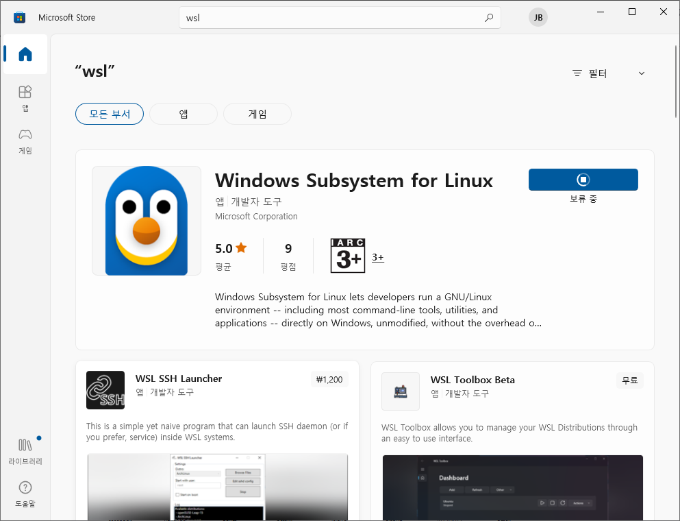

(선택사항) 다른 리눅스 배포판을 설치하여 WSL을 테스트 해볼 수도 있습니다.

- [Ubuntu 배포판](https://www.microsoft.com/store/productId/9PDXGNCFSCZV)
- [22.04](https://www.microsoft.com/store/productId/9PN20MSR04DW)
- [20.04](https://www.microsoft.com/store/productId/9MTTCL66CPXJ)
- [18.04](https://www.microsoft.com/store/productId/9PNKSF5ZN4SW)
- [Debian 배포판](https://www.microsoft.com/store/productId/9MSVKQC78PK6)
- [Apine 배포판](https://www.microsoft.com/store/productId/9P804CRF0395)
- [Arch 배포판](https://www.microsoft.com/store/productId/9MZNMNKSM73X)

## [Windows]에서 Docker 설치

[docker.com](https://www.docker.com/products/docker-desktop/)에서 Windows용 Docker Desktop을 다운로드 받아 설치 합니다.

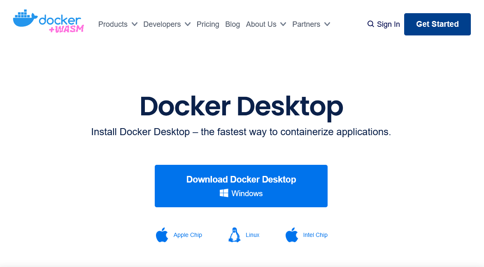

설치를 진행합니다.

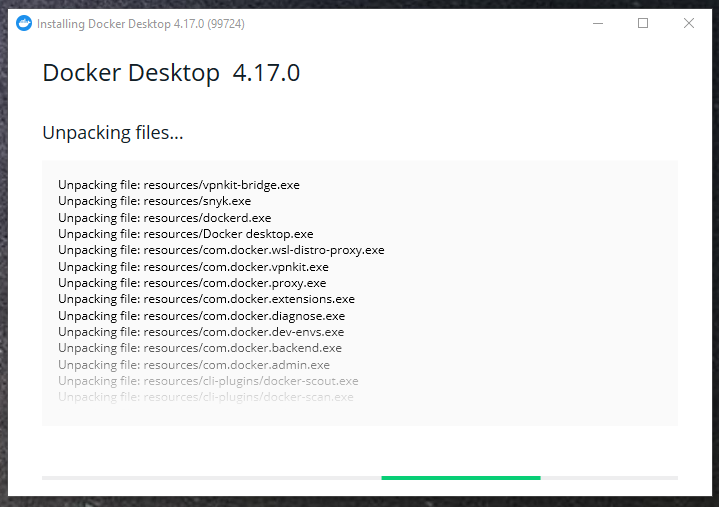

설치를 완료 합니다.

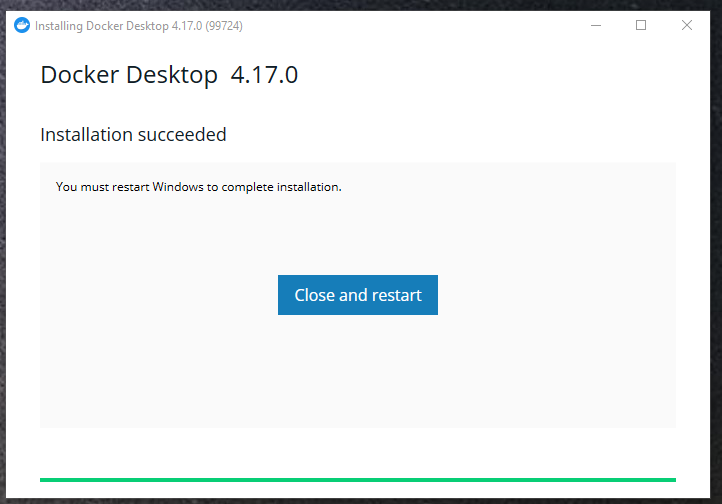

## [Ubuntu]에서 Docker 설치

우분투에서 도커 설치는 쉽습니다.

터미널에서

```sh
snap install docker
```

를 입력합니다.

수퍼유저 비밀번호를 물어보면 입력 합니다.

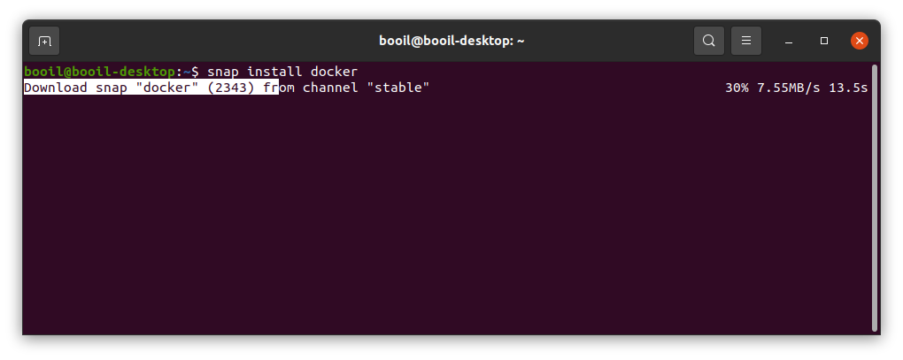

## [Windows]에서 Visual Studio Code 설치

[이곳](https://code.visualstudio.com/)에서 Visual Studio Code를 다운로드하여 설치 합니다.

## [Ubuntu]에서 Visual Studio Code 설치

우분투 터미널에서 Visual Studio Code를 설치합니다.

```sh
snap install code --classic
```

수퍼유저 비밀번호를 물어보면 입력 합니다.

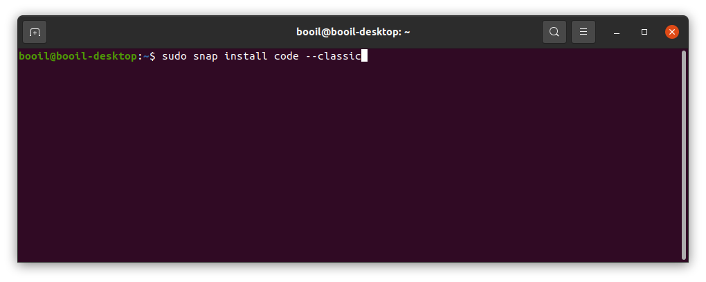

## 프로젝트 폴더 만들기

파일 관리자를 열어서 폴더를 `node1`이라는 폴더를 만듭니다. 폴더를 만들고 Visual Studio Code로 폴더를 오픈합니다.

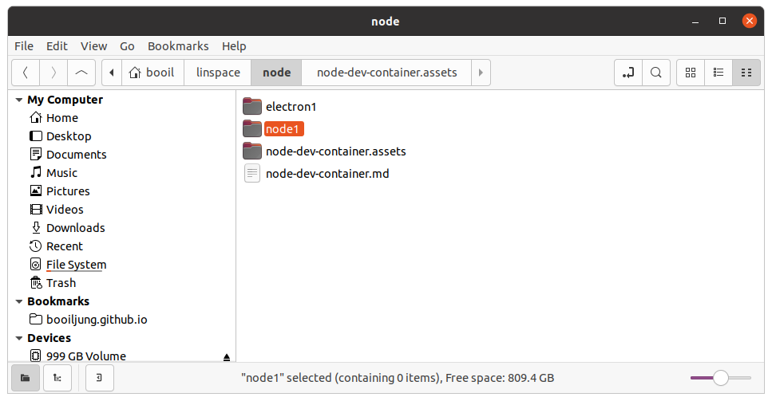

Visual Studio Code가 폴더 저작자를 신뢰하냐는 질문에 동의 해 줍니다.

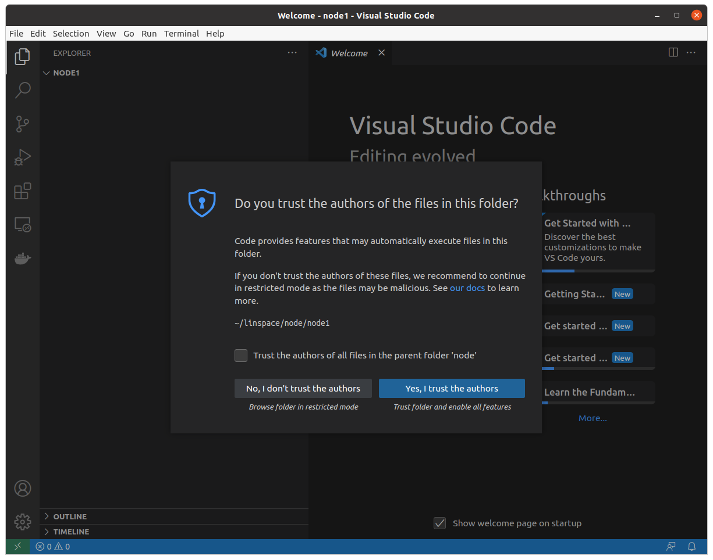

Visual Studio Code의 Extensions (확장 플러그인) 탭을 엽니다.

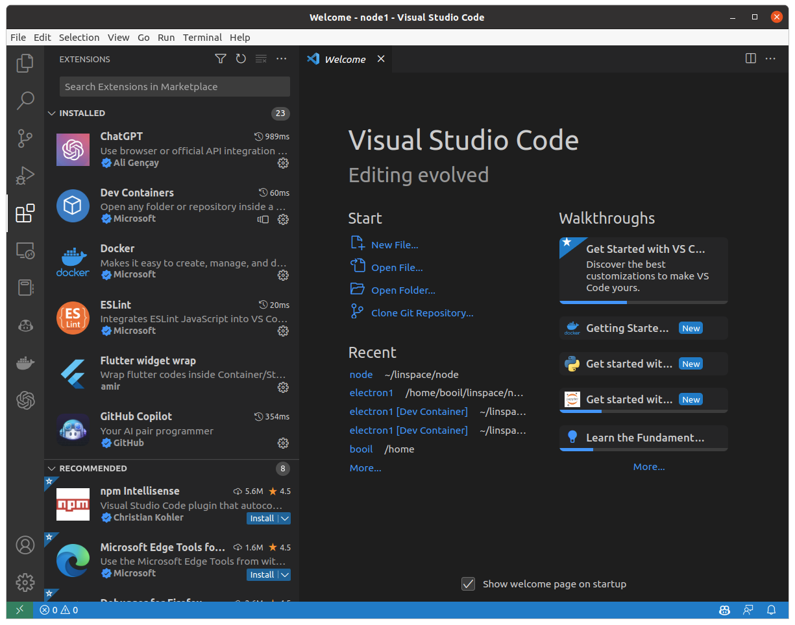

확장 플러그인에서 `Dev Containers`를 검색하여 설치합니다.

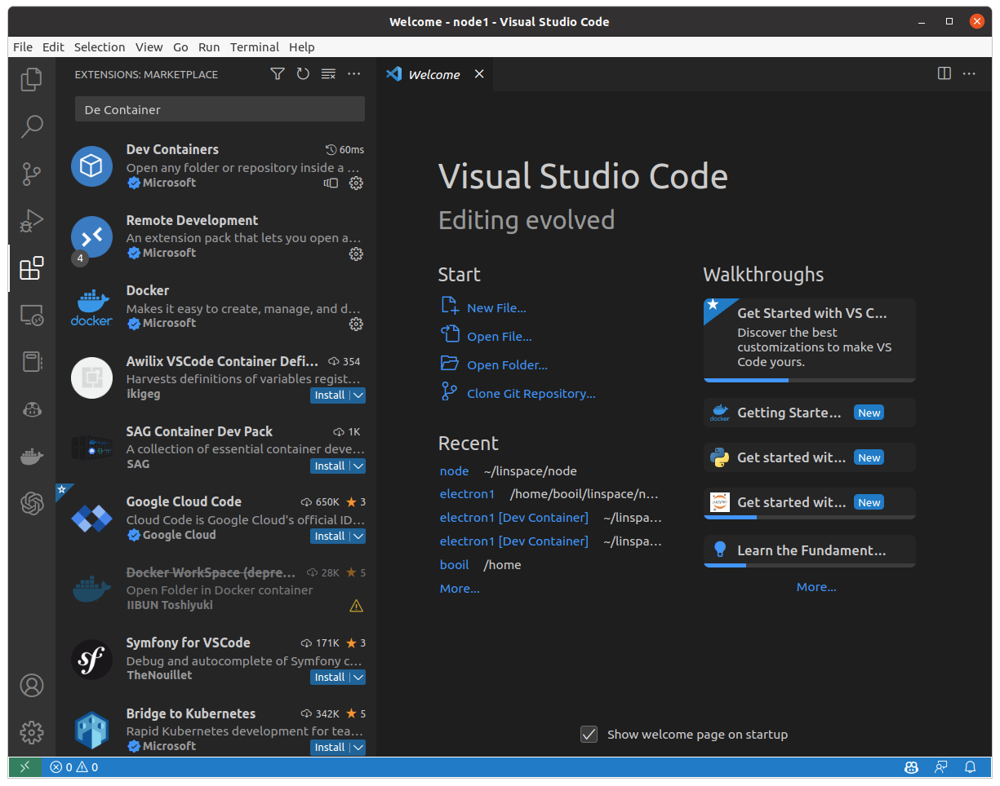

다음 확장 플러그인 들을 설치해 줍니다.

- Remote Development (Microsoft)
- Docker (Microsoft)
- ESLint (Microsoft)
- JavaScript and TypeScript (Microsoft)

(선택사항 - 팁) 좌측 아래 사람 형상의 아이콘을 눌러서 github나 microsoft 계정과 연동하면 확장 플러그인이나 디자인 등이 여러 컴퓨터에서 동기화 됩니다.

## Node.Js & TypeScript Dev Container를 추가합니다.

### 명령 팰럿

Visual Studio Code에서 `Ctrl + Shift + P` 를 누르고 명령 팰럿을 통해 다양한 확장 명령들을 검색하여 빠르게 수행 할 수 있습니다.

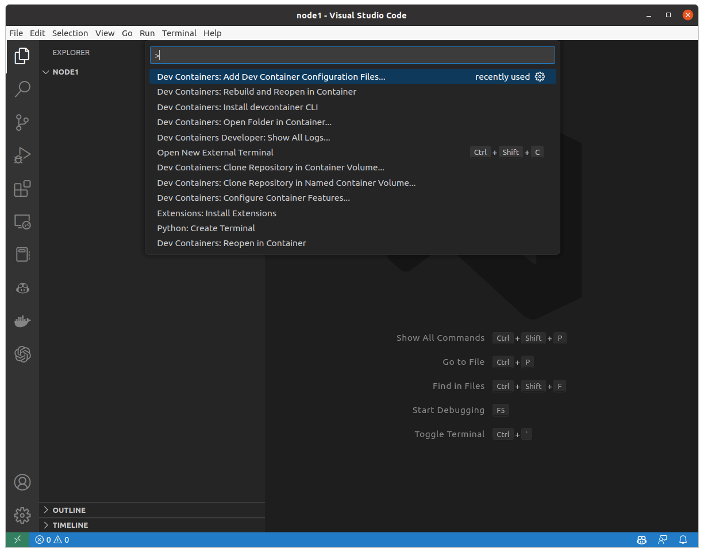

명령 팰럿에서 `Add Dev Con`을 입력하여 `Dev Container: Add Dev Container Configuration Files...` 명령을 실행 합니다.

Dev Container 리스트가 표시 됩니다.

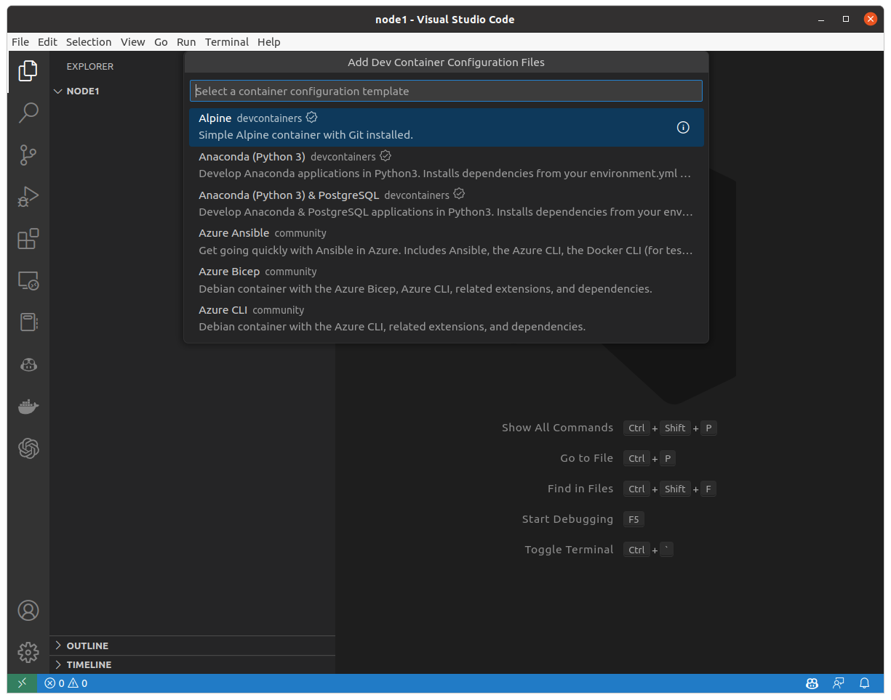

여기서 `Node`를 입력하여 우리가 설치하고자 하는 Dev Container를 검색합니다.

우리는 `Node.js & TypeScript`를 설치하여 JavaScript와 TypeScript를 함께 사용할 것입니다.

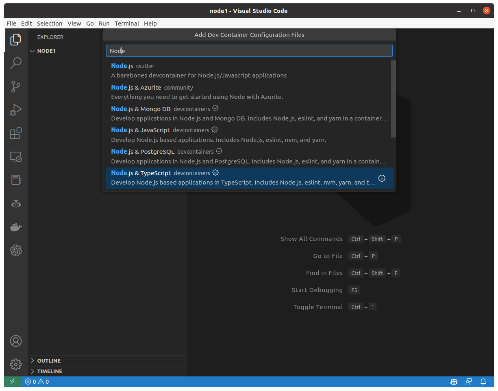

Node 버전을 물으면 해당 프로젝트가 요구하는 16 또는 18을 선택 합니다.

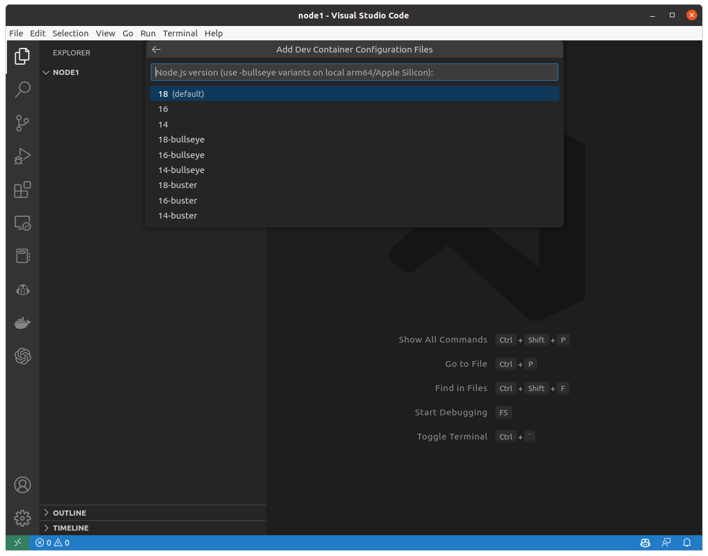

피처 선택에서 선택하지 않고 확인 (OK)을 눌러 줍니다.

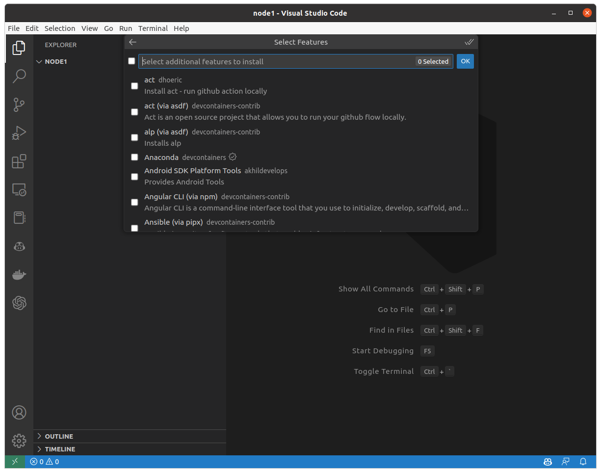

아래처럼 `.devcontainer/devcontainer.json`파일이 열리면 구성에 성공한 것입니다.

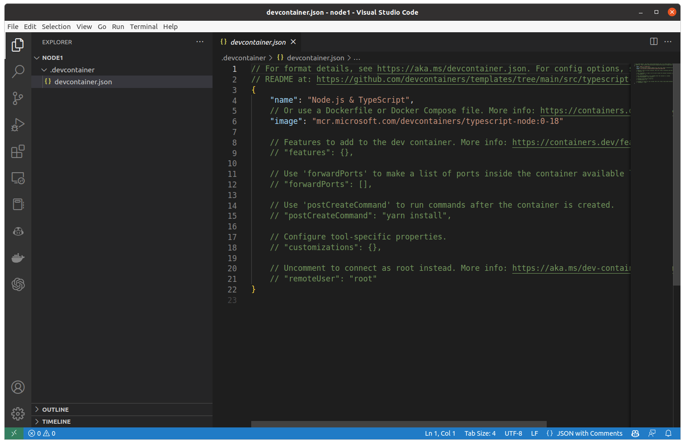

`.devcontainer/devcontainer.json` 파일 내용은 아래와 같습니다.

```json
// For format details, see https://aka.ms/devcontainer.json. For config options, see the
// README at: https://github.com/devcontainers/templates/tree/main/src/typescript-node
{
	"name": "Node.js & TypeScript",
	// Or use a Dockerfile or Docker Compose file. More info: https://containers.dev/guide/dockerfile
	"image": "mcr.microsoft.com/devcontainers/typescript-node:0-18"

	// Features to add to the dev container. More info: https://containers.dev/features.
	// "features": {},

	// Use 'forwardPorts' to make a list of ports inside the container available locally.
	// "forwardPorts": [],

	// Use 'postCreateCommand' to run commands after the container is created.
	// "postCreateCommand": "yarn install",

	// Configure tool-specific properties.
	// "customizations": {},

	// Uncomment to connect as root instead. More info: https://aka.ms/dev-containers-non-root.
	// "remoteUser": "root"
}

```

- `name`은 개발 환경 이름입니다.
- `image`는 개발에 사용할 이미지 입니다.

## Dev Container 구동하기

지금 Dev Container 구성 파일만 만들어졌을 뿐입니다. 아직 Dev Container가 구동되지 않았습니다. 우리는 여전히 로컬 컴퓨터에 있습니다.

`Ctrl + Shift + P`를 눌러서 다시 명령 팰럿을 열고, `Rebuild`를 검색하여 `Dev Container: Rebuild & Reopen in Container`를 실행합니다.

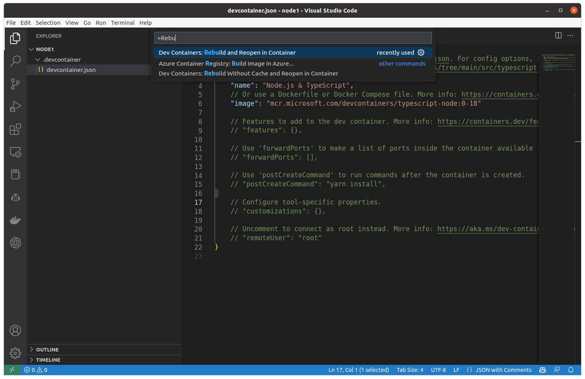

이 `Dev Container: Rebuild & Reopen in Container`명령은 다음 작업을 수행 합니다.

- `devcontainer.json`에 표시된 도커 이미지를 찾고 없으면 다운로드 합니다.
- `Starting Dev Coltainer (show log)`가 표시되며 컨테이너를 준비합니다.

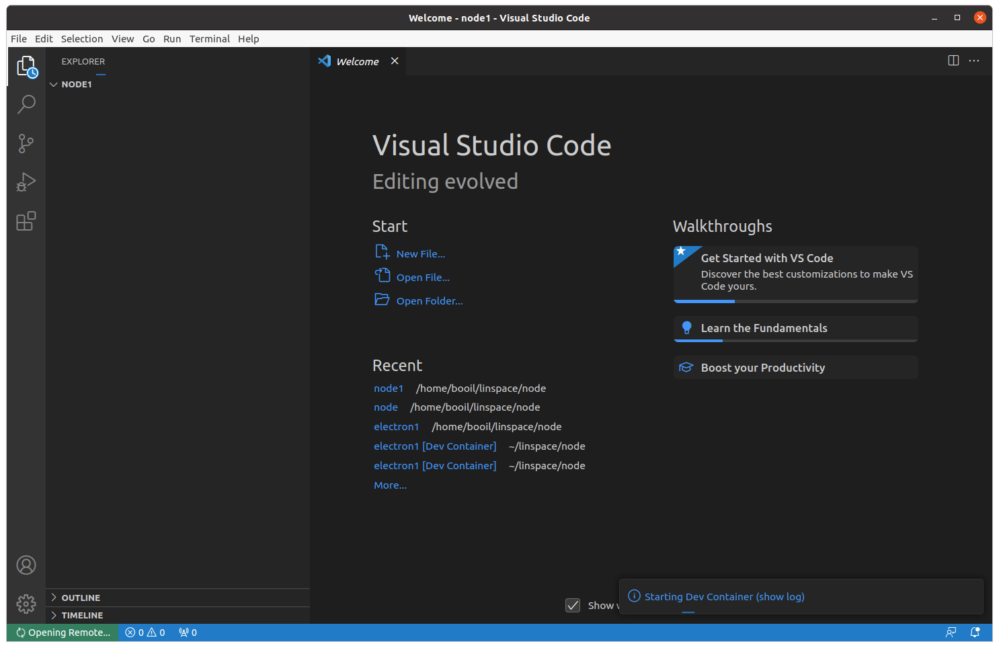

- Visual Studio Code 하단 상태바 좌측에 `Openning Remote ...`로 컨테이너를 열고 있는 중으로 표시됩니다.

컨테이너가 준비 완료 되었으면 상태바 좌측에 `Dev Container: Node.js & TypeScript`로 표시됩니다.

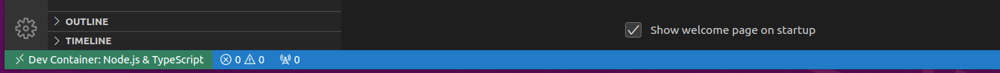

이제 NodeJs 개발 환경이 준비되었습니다.  터미널 탭을 눌러서 컨테이너의 Bash 로 들어가 봅니다.  유저는 `node`이고 컨테이너 안의 `/workspaces/node1` 폴더에 있습니다:

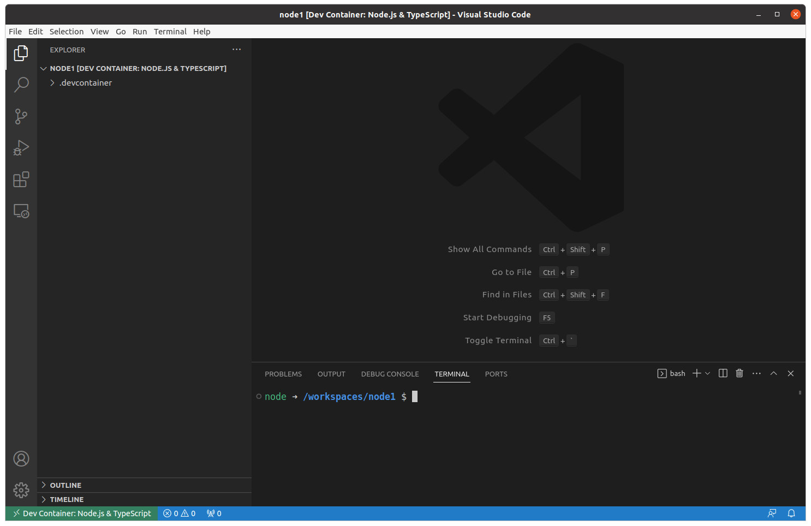

터미널에서 운영체제를 확인합니다:

```sh
node ➜ /workspaces/node1 $ lsb_release -a
No LSB modules are available.
Distributor ID: Debian
Description:    Debian GNU/Linux 11 (bullseye)
Release:        11
Codename:       bullseye
```

- 데비안 배포판으로 알 수 있습니다.

터미널에서 `node` 버전을 확인합니다:

```sh
node ➜ /workspaces/node1 $ node --version
v18.14.2
node ➜ /workspaces/node1 $ 
```

node 패키지를 준비합니다. 몇가지 프롬프트가 나오며 그냥 엔터를 눌러도 기본값으로 설정 됩니다:

```sh
node ➜ /workspaces/node1 $ npm init
This utility will walk you through creating a package.json file.
It only covers the most common items, and tries to guess sensible defaults.

See `npm help init` for definitive documentation on these fields
and exactly what they do.

Use `npm install <pkg>` afterwards to install a package and
save it as a dependency in the package.json file.

Press ^C at any time to quit.
package name: (node1) 
version: (1.0.0) 0.0.1
description: node demo
entry point: (index.js) 
test command: 
git repository: 
keywords: node
author: Booil Jung
license: (ISC) MIT
About to write to /workspaces/node1/package.json:

{
  "name": "node1",
  "version": "0.0.1",
  "description": "node demo",
  "main": "index.js",
  "scripts": {
    "test": "echo \"Error: no test specified\" && exit 1"
  },
  "keywords": [
    "node"
  ],
  "author": "Booil Jung",
  "license": "MIT"
}
Is this OK? (yes) yes
node ➜ /workspaces/node1 $ 
```

- 폴더에 `package.json` 파일이 생성되었습니다.

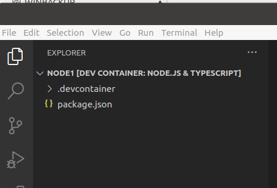

## React 예제 구동해 보기

[ReactJS React 프로젝트 생성 및 실행 (React로 아주 간단한 게시판 만들기 - 1)](https://antdev.tistory.com/77)를 따라 간단한 React 예제를 구동해 보겠습니다.

npm의 버전을 확인합니다:

```sh
node ➜ /workspaces/node1 $ npm --version
9.5.0
node ➜ /workspaces/node1 $ 
```

`create-react-app` 패키지 설치:

Dev Container엣허 npm 사용시 수퍼 유저 권한(`su`) 등을 지정할 필요가 없습니다.

```sh
node ➜ /workspaces/node1 $ npm install -g create-react-app
npm WARN deprecated tar@2.2.2: This version of tar is no longer supported, and will not receive security updates. Please upgrade asap.

added 67 packages in 3s

5 packages are looking for funding
  run `npm fund` for details
node ➜ /workspaces/node1 $ 
```

`react-simple-blog`를 React 프로젝트를 생성합니다:

```sh
node ➜ /workspaces/node1 $ create-react-app react-simple-blog

Creating a new React app in /workspaces/node1/react-simple-blog.

Installing packages. This might take a couple of minutes.
Installing react, react-dom, and react-scripts with cra-template...


added 1417 packages in 46s

231 packages are looking for funding
  run `npm fund` for details

Initialized a git repository.

Installing template dependencies using npm...

added 62 packages in 6s

231 packages are looking for funding
  run `npm fund` for details
Removing template package using npm...


removed 1 package, and audited 1479 packages in 7s

231 packages are looking for funding
  run `npm fund` for details

6 high severity vulnerabilities

To address all issues (including breaking changes), run:
  npm audit fix --force

Run `npm audit` for details.

Created git commit.

Success! Created react-simple-blog at /workspaces/node1/react-simple-blog
Inside that directory, you can run several commands:

  npm start
    Starts the development server.

  npm run build
    Bundles the app into static files for production.

  npm test
    Starts the test runner.

  npm run eject
    Removes this tool and copies build dependencies, configuration files
    and scripts into the app directory. If you do this, you can’t go back!

We suggest that you begin by typing:

  cd react-simple-blog
  npm start

Happy hacking!
node ➜ /workspaces/node1 $ 
```

다음과 같이 파일들이 생성되었습니다:

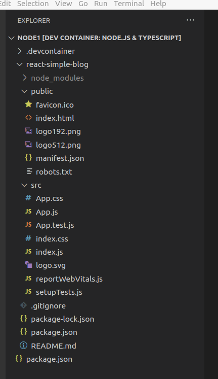

프로젝트 폴더에서 Reat 앱을 실행합니다:

```sh
node ➜ /workspaces/node1 $ cd react-simple-blog
node ➜ /workspaces/node1/react-simple-blog $ npm start
Compiled successfully!

You can now view react-simple-blog in the browser.

  Local:            http://localhost:3000
  On Your Network:  http://172.17.0.2:3000

Note that the development build is not optimized.
To create a production build, use npm run build.

webpack compiled successfully
```

호스트 브라우저에서 핵 아이콘이 표시된 페이지가 열립니다:

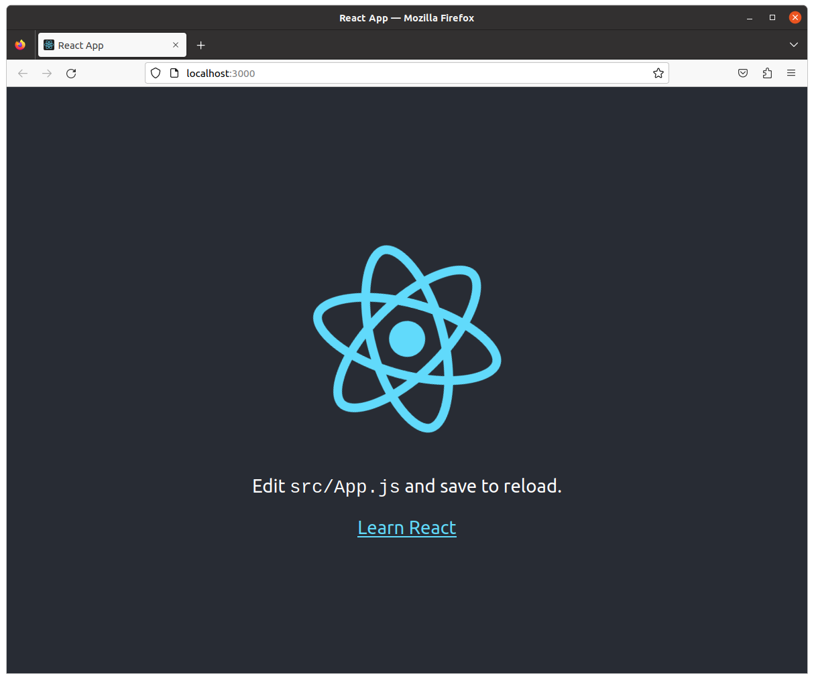

컨테이너 안에서 소스코드를 변경하면 핫리로드가 되는지 확인합니다.`src/App.js`를 열어서:

```javascript
import logo from './logo.svg';
import './App.css';

function App() {
  return (
    <div className="App">
      <header className="App-header">
        
        <p>
          Edit <code>src/App.js</code> and save to reload.
        </p>
        <a
          className="App-link"
          href="https://reactjs.org"
          target="_blank"
          rel="noopener noreferrer"
        >
          Learn React
        </a>
      </header>
    </div>
  );
}

export default App;

```

 `Learn React`를 `Learn Reat MORE`로 변경합니다:

```javascript
import logo from './logo.svg';
import './App.css';

function App() {
  return (
    <div className="App">
      <header className="App-header">
        
        <p>
          Edit <code>src/App.js</code> and save to reload.
        </p>
        <a
          className="App-link"
          href="https://reactjs.org"
          target="_blank"
          rel="noopener noreferrer"
        >
          Learn React MORE
        </a>
      </header>
    </div>
  );
}

export default App;
```

그리고 저장합니다. 핫리로드가 동작하는지 확인 합니다.

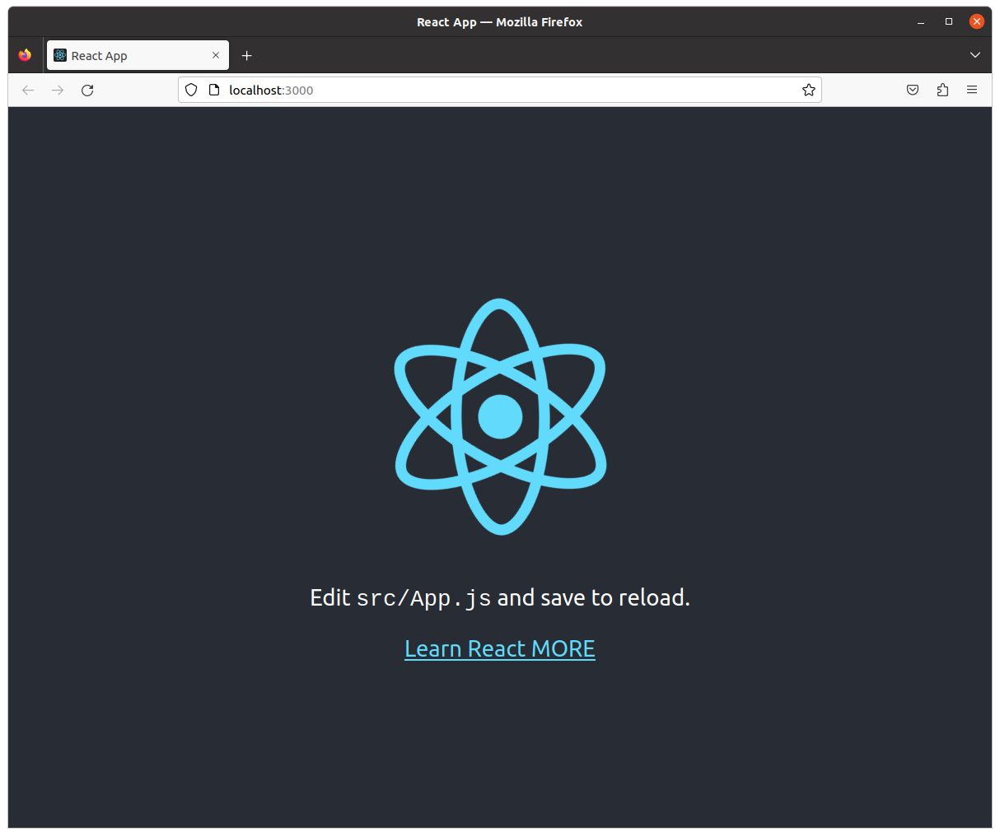

## 참조

- [자습서: React 시작하기](https://ko.reactjs.org/tutorial/tutorial.html)
- [ReactJS React 프로젝트 생성 및 실행 (React로 아주 간단한 게시판 만들기 - 1)](https://antdev.tistory.com/77)
- [Developing inside a Container](https://code.visualstudio.com/docs/devcontainers/containers)

