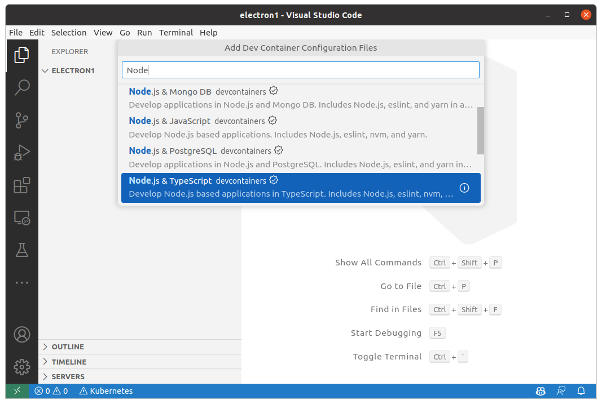

Dev Container로 JavaScript 개발환경 구성

# #2 Electron GUI 앱 개발

컨테이너가 GUI 앱을 실행하는 방법은 2가지가 있습니다.

- 호스트의 X11 사용
- VNC를 통한 화면 공유

이중 개인 컴퓨터에서 테스트가 용이한 X11을 사용해 보도록 하겠습니다.

## 컨테이너란?

먼저 호스트 컴퓨터의 X11을 사용하기 전에 컨테이너 기술이란 무엇인지 알아 보겠습니다.

- [컨테이너 기술의 발전과 역사](https://www.openmaru.io/%EC%BB%A8%ED%85%8C%EC%9D%B4%EB%84%88-%EA%B8%B0%EC%88%A0%EC%9D%98-%EC%97%AD%EC%82%AC%EC%99%80-%EB%B0%9C%EC%A0%84/)

컨테이너가 무엇인가에 대해 쉽게 와닿지 않습니다. 가상머신과 비교하기도 하는데 가상머신과 컨테이너는 비교하기에 너무 다릅니다.

- [가상머신과 컨테이너의 차이](https://daaa0555.tistory.com/464)
- [컨테이너 기술과 가상화 기술 비교](http://www.opennaru.com/cloud/virtualization-vs-container/)


가상머신은 호스트 컴퓨터 상의 호스트 운영체제 상에 가상 컴퓨터를 생성하고, 가상 컴퓨터에 게스트 운영체제를 설치하고, 이 게스트 운영체제 위에서 서비스를 구동합니다.

컨테이너는 호스트 컴퓨터 상의 호스트 운영체제에서 격리된 환경을 만들고 이 **격리된 환경**에서 서비스를 구동합니다.

이 격리된 환경은 리눅스에서 제공하는 namespace cgroup를 이용한다는 것인데 이 것은 잊어도 됩니다. 리눅스 커널을 공유하는 격리된 환경이라는 것이 핵심 포인트입니다.

가상머신은 생성, 설치, 운영에 느리며 많은 자원을 점유 합니다. 또한 자원을 미리 예약하여 점유하기때문에 자원이 비효율적입니다. (자원: 메모리, 디스크, CPU, 전력 등)

컨테이너는 운영체제의 격리된 환경이기 때문에 생성, 설치, 제거가 빠르고 가볍습니다. 자원을 예약하지 않고 필요한 자원만 점유합니다.

## 도커란?

- [도커란 무엇인가?](https://wooody92.github.io/docker/Docker-%EB%8F%84%EC%BB%A4%EB%9E%80-%EB%AC%B4%EC%97%87%EC%9D%B8%EA%B0%80/)

도커는 컨테이너를 사용하는 기술 중 하나일뿐이지만, 컨테이너 기술의 부흥을 일으킨 기술입니다.

컨테이너는 격리된 환경입니다. 격리된 컨테이너에 호스트의 자원을 제공합니다.

- 컨테이너는 도커 이미지의 인스턴스입니다. 컨테이너 생성시 도커 이미지를 지정해야 합니다.
- 컨테이너에 volumes을 지정하여 호스트의 디스크 자원을 제공합니다. 지정하지 않으면 디폴트 보륨이 지정됩니다.
- 컨테이너에 ports를 지정하여 호스트의 TCP/UDP 포트를 제공합니다. 지정하지 않으면 포트를 사용할 수 없습니다.
- 컨테이너에 networks를 지정하여 네트워크를 제공할 수 있습니다. 지정하지 않으면 디폴트 네트워크가 지정됩니다.
- 컨테이너에 devices를 지정하여 장치를 제공할 수 있습니다. 요구하는 장치를 제공하지 않으면 컨테이너는 구동되지 않습니다.
- 컨테이너에 환경변수를 제공할 수 있습니다. 환경변수를 제공하지 않으면 기본 값이 사용됩니다.

도커 이미지는 여러 기업들이 제공하고 있습니다. 도커 이미지를 제공하는 서비스를 registry라고 합니다.

- [도커 허브](https://hub.docker.com/_/docker)
- [레드햇](https://catalog.redhat.com/software/containers/search)

도커 이미지를 제공하는 도커 레지스트리를 만들 수도 있습니다.

- [Harbor](https://goharbor.io/)
- [Gitlab container registry](https://docs.gitlab.com/ee/user/packages/container_registry/)
- [Github](https://github.com/features/packages)
- [Azure Container Registry](https://azure.microsoft.com/ko-kr/products/container-registry)

[도커 이미지는 Dockerfile로 부터 빌드 합니다.](https://docs.docker.com/engine/reference/builder/) 도커 파일 작성은 sh을 통한 리눅스 명령을 사용할 수 있으면 어렵지 않습니다.

이상 도커와 컨테이너에 대해 간단하게 안내해 드렸습니다.

## DevContainer에서 Electron 시작하기

도커에서 GUI 앱을 구동하는 방법은 인터넷을 검색하였습니다.

- [도커에서 GUI 프로그램 사용하기](https://open-support.tistory.com/entry/%EB%8F%84%EC%BB%A4Docker%EC%97%90%EC%84%9C-GUI%ED%94%84%EB%A1%9C%EA%B7%B8%EB%9E%A8-%EC%82%AC%EC%9A%A9%ED%95%98%EA%B8%B0)
- [도커 환경에서 GUI 앱 사용](도커 환경에서 GUI 앱 사용)
- [docker에서 컨테이너 gui 실행하기](https://conservative-vector.tistory.com/entry/docker%EC%97%90%EC%84%9C-%EC%BB%A8%ED%85%8C%EC%9D%B4%EB%84%88-gui-%EC%8B%A4%ED%96%89%ED%95%98%EA%B8%B0)
- [docker와 GUI 환경 연결](https://driz2le.tistory.com/257)
- [github.com/bengreenier/docker-x11-electron](https://github.com/bengreenier-archive/docker-x11-electron)

먼저 프로젝트 폴더를 만들고 vscode로 폴더를 오픈합니다.

리눅스:

```sh
mkdir electron1
code electron1
```

윈도우 탐색기의 경우 폴더 열기를 지원하지 않기 때문에 vscode를 실행하고 해당 폴더를 찾아서 열어야 합니다.

vscode는 아래와 같습니다. 


F1 또는 Ctrl+Shift+P를 눌러서 명령 팰럿을 열고 DevContainers: Add DevContainer Configuration FIles...를 실행합니다.


JavaScript와 함께 TypeScript도 사용하기 위해 Node.js & TypeScript devcontainers를 선택합니다.



Node 18 버전을 선택합니다. 


피쳐는 선택하지 않고 바로 OK를 눌러 줍니다.


프로젝트 폴더에 `.devcontainer/devcontainer.json` 파일이 생성되었습니다.


이제 Node DevContainer를 시작할 수 있습니다.

명령 팰럿에서 Dev Containers: Rebuild and Reopen in Container 를 선택하여 컨테이너를 올립니다.


좌측 아래에 Dev Container: Node.js & TypeScript 가 표시되면 성공적으로 컨테이너를 구동한 것입니다.


터미널을 확인하면 컨테이너 안의 bash 셸로 확인 할 수 있습니다.

```sh
$ echo $0
/bin/bash
$ echo $SHELL
/bin/bash
$
```


electron 앱 개발은 [공식 튜토리얼](https://www.electronjs.org/docs/latest/tutorial/quick-start)에 따라할 것입니다.

node와 npm의 버전을 확인합니다:

```sh
$ node --version
v18.14.2
$ npm --version
9.5.0
$
```

npm 패키지를 준비합니다. 적절한 답을 달아 줍니다.

```sh
$ npm init
node ➜ /workspaces/electron1 $ npm init
This utility will walk you through creating a package.json file.
It only covers the most common items, and tries to guess sensible defaults.

See `npm help init` for definitive documentation on these fields
and exactly what they do.

Use `npm install <pkg>` afterwards to install a package and
save it as a dependency in the package.json file.

Press ^C at any time to quit.
package name: (electron1) 
version: (1.0.0) 
description: 
entry point: (index.js) 
test command: 
git repository: 
keywords: 
author: 
license: (ISC) 
About to write to /workspaces/electron1/package.json:

{
  "name": "electron1",
  "version": "1.0.0",
  "description": "",
  "main": "index.js",
  "scripts": {
    "test": "echo \"Error: no test specified\" && exit 1"
  },
  "author": "",
  "license": "ISC"
}


Is this OK? (yes) yes
npm notice 
npm notice New minor version of npm available! 9.5.0 -> 9.6.1
npm notice Changelog: https://github.com/npm/cli/releases/tag/v9.6.1
npm notice Run npm install -g npm@9.6.1 to update!
$
```

생성된 package.json 내용을 확인해 봅니다:

```sh
$ cat package.json
{
  "name": "electron1",
  "version": "1.0.0",
  "description": "",
  "main": "index.js",
  "scripts": {
    "test": "echo \"Error: no test specified\" && exit 1"
  },
  "author": "",
  "license": "ISC"
}
$
```

electron 패키지를 설치 합니다:

```sh
$ npm install electron

added 71 packages, and audited 72 packages in 22s

17 packages are looking for funding
  run `npm fund` for details

found 0 vulnerabilities
$
```

package.json을 수정하여 `npm start` 명령을 추가하고 저장합니다:

```json
{
  "name": "electron1",
  "version": "1.0.0",
  "description": "",
  "main": "index.js",
  "scripts": {
    "start": "electron . --no-sandbox", <<< 새로 추가한 명령
    "test": "echo \"Error: no test specified\" && exit 1"
  },
  "author": "",
  "license": "ISC",
  "dependencies": {
    "electron": "^23.1.3"
  }
}
```

튜토리얼에 따라 3개의 소스코드를 추가 합니다.

index.html:

```html
<!--index.html-->

<!DOCTYPE html>
<html>
  <head>
    <meta charset="UTF-8">
    <!-- https://developer.mozilla.org/en-US/docs/Web/HTTP/CSP -->
    <meta http-equiv="Content-Security-Policy" content="default-src 'self'; script-src 'self'">
    <title>Hello World!</title>
  </head>
  <body>
    <h1>Hello World!</h1>
    We are using Node.js <span id="node-version"></span>,
    Chromium <span id="chrome-version"></span>,
    and Electron <span id="electron-version"></span>.

    <!-- You can also require other files to run in this process -->
    <script src="./renderer.js"></script>
  </body>
</html>
```

index.js:

```javascript
// main.js

// Modules to control application life and create native browser window
const { app, BrowserWindow } = require('electron')
const path = require('path')

const createWindow = () => {
  // Create the browser window.
  const mainWindow = new BrowserWindow({
    width: 800,
    height: 600,
    webPreferences: {
      preload: path.join(__dirname, 'preload.js')
    }
  })

  // and load the index.html of the app.
  mainWindow.loadFile('index.html')

  // Open the DevTools.
  // mainWindow.webContents.openDevTools()
}

// This method will be called when Electron has finished
// initialization and is ready to create browser windows.
// Some APIs can only be used after this event occurs.
app.whenReady().then(() => {
  createWindow()

  app.on('activate', () => {
    // On macOS it's common to re-create a window in the app when the
    // dock icon is clicked and there are no other windows open.
    if (BrowserWindow.getAllWindows().length === 0) createWindow()
  })
})

// Quit when all windows are closed, except on macOS. There, it's common
// for applications and their menu bar to stay active until the user quits
// explicitly with Cmd + Q.
app.on('window-all-closed', () => {
  if (process.platform !== 'darwin') app.quit()
})

// In this file you can include the rest of your app's specific main process
// code. You can also put them in separate files and require them here.
```

preload.js:

```javascript
// preload.js

// All the Node.js APIs are available in the preload process.
// It has the same sandbox as a Chrome extension.
window.addEventListener('DOMContentLoaded', () => {
    const replaceText = (selector, text) => {
      const element = document.getElementById(selector)
      if (element) element.innerText = text
    }
  
    for (const dependency of ['chrome', 'node', 'electron']) {
      replaceText(`${dependency}-version`, process.versions[dependency])
    }
  })
```

터미널에서 방금 만든 앱을 실행합니다:

```sh
$ npm start

> electron1@1.0.0 start
> electron .

/workspaces/electron1/node_modules/electron/dist/electron: error while loading shared libraries: libnss3.so: cannot open shared object file: No such file or directory
```

실행되지 않고 오류가 발생하였습니다. 여러 라이브러리들이 설치 되지 않았습니다. 부족한 패키지를 설치하기 위해 DevContainer를 커스터마이징 해야 합니다.

### 커스터마이징

.devcontainer 폴더에서 devcontainer.json을 변경합니다.

```json

{
	"name": "Electron & TypeScript",
	// Or use a Dockerfile or Docker Compose file. More info: https://containers.dev/guide/dockerfile
	// "image": "mcr.microsoft.com/devcontainers/typescript-node:0-18"
	// "build": {
	//	"context": "..",
	//	"dockerfile": "Dockerfile"
	// },    
	// https://code.visualstudio.com/docs/devcontainers/create-dev-container
	"dockerComposeFile": [
		"docker-compose.yml"
	],
	"service": "electron-devcontainer",
	"workspaceFolder": "/workspaces/${localWorkspaceFolderBasename}",
	//"shutdownAction": "stopCompose",
	// Features to add to the dev container. More info: https://containers.dev/features.
	"features": {
		"ghcr.io/devcontainers/features/docker-outside-of-docker:1": {
			"version": "latest",
			"enableNonRootDocker": "true",
			"moby": "true"
		}
	},
	// Use 'forwardPorts' to make a list of ports inside the container available locally.
	// "forwardPorts": [],
	// Use 'postCreateCommand' to run commands after the container is created.
	// "postCreateCommand": "yarn install",
	// Configure tool-specific properties.
	// "customizations": {},
	// Uncomment to connect as root instead. More info: https://aka.ms/dev-containers-non-root.
	//"remoteUser": "node"
}
```

변경 내용을 살펴 보겠습니다:

```
// "image": mcr.microsoft.com/devcontainers/typescript-node:0-18
```

image 항목을 주석으로 막았습니다. 대신 docker-compose.yml 파일을 추가 하였습니다.

```
	// https://code.visualstudio.com/docs/devcontainers/create-dev-container
	"dockerComposeFile": [
		"docker-compose.yml"
	],
	"service": "electron-devcontainer",
```

dockerComposeFile 항목은 docker-compose.yml을 빌드하게 합니다. 그리고 docker-compose 내에서 사용할 서비스는 electron-devcontainer라는 것을 알립니다.

어느 컨테이너 개발 환경은 Dockerfile 만으로도 커스터마이징이 가능한데 

```
	// "build": {
	//	"context": "..",
	//	"dockerfile": "Dockerfile"
	// },
```

GUI 경우 호스트의 x11을 컨테이너에 volume으로 전달해야 하므로 docker-compose.yml을 작성해야 합니다:

### docker-compose.yml 추가

docker-compose.yml  파일 내용은 아래와 같습니다:

```yaml
version: '3'
services:
  electron-devcontainer:
    # https://code.visualstudio.com/docs/devcontainers/create-dev-container
    container_name: electron-devcontainer
    build:
      context: .
      dockerfile: Dockerfile
    environment:
      - DISPLAY=unix$DISPLAY
    volumes:
      - ../..:/workspaces:cached
      # make sure electron access X11 on host computer
      # run first in host computer
      # 'xhost +local:docker'
      - /tmp/.X11-unix:/tmp/.X11-unix
      - /var/run/docker.sock:/var/run/docker-host.sock
    network_mode: host
    command: /bin/bash -c "while sleep 1000; do :; done"    
```

내용을 살펴 보겠습니다.

```
services:
  electron-devcontainer:
```

서비스에는 `electron-devcontainer` 하나가 있습니다. 이 서비스 이름은 devcontainer.json에서도 참조하고 있습니다:

```
	"dockerComposeFile": [
		"docker-compose.yml"
	],
	"service": "electron-devcontainer",
```

컨테이너 이름을 보겠습니다:

```
  electron-devcontainer:
    # https://code.visualstudio.com/docs/devcontainers/create-dev-container
    container_name: electron-devcontainer
```

컨테이너 이름은 `electron-devcontainer`로 서비스 이름과 동일하게 하였습니다. 컨테이너 이름을 지정하지 않으면 docker가 랜덤하게 이름을 주는데, 직접 지정하면 별도로 관리하거나 로그인 할때 직접 참조 할 수 있습니다.

사용할 이미지를 보겠습니다L

```
    container_name: electron-devcontainer
    build:
      context: .
      dockerfile: Dockerfile
```

docker-compose.yml에서 이미지 이름을 지정하지 않고 Dockerfile로부터 빌드하라고 지정하였습니다.

아래가 X11 GUI를 위한 환경 준비 입니다:

```
    environment:
      - DISPLAY=unix$DISPLAY
```

DISPLAY 환경 변수에 화면 번호를 지정하였습니다.

다음은 volume을 지정합니다:

```
    volumes:
      - ../..:/workspaces:cached
      # make sure electron access X11 on host computer
      # run first in host computer
      # 'xhost +local:docker'
      - /tmp/.X11-unix:/tmp/.X11-unix
      - /var/run/docker.sock:/var/run/docker-host.sock
```

`../..:/workspaces:cached` 호스트의 소스코드 폴더를 볼륨으로 지정하였습니다.

`/tmp/.X11-unix:/tmp/.X11-unix` 호스트의 x11-unix 폴더를 컨테이너의 볼륨으로 지정하였습니다.

`/var/run/docker.sock:/var/run/docker-host.sock` 호스트의 도커 소켓을 컨테이너의 도커 소켓으로 지정하였습니다.

```
	network_mode: host
```

네트워크는 호스트와 동일한 네트워크를 사용하도록 하였습니다. 이것은 필수이지 않습니다만, GUI 앱의 경우 호스트 컴퓨터의 네트워크를 사용하는 경우가 많습니다.

```
    command: /bin/bash -c "while sleep 1000; do :; done"
```

컨테이너가 시작하자마자 종료하지 않도록 `bash`를 계속 실행하도록 하였습니다.

## xhost 연결 허용

docker-compose.yml의 volumes 항목을 보면:

```
      # make sure electron access X11 on host computer
      # run first in host computer
      # 'xhost +local:docker'
```

호스트 터미널을 사용하여 xhost에 docker 연결을 허용해 주어야 합니다:

```sh
$ xhost +local:docker
non-network local connections being added to access control list
```

연결을 제거하려면:

```sh
$ xhost -local:docker
non-network local connections being removed to access control list
```

컴퓨터를 사용할 때마다 입력해야 해서 불편하다면 .bashrc에 추가해 줍니다:

```sh
$ echo "xhost +local:docker" >> ~/.bashrc
```

### Dockerfile 추가

```dockerfile
FROM mcr.microsoft.com/devcontainers/typescript-node:0-18

USER root

ENV DEBIAN_FRONTEND=noninteractive

RUN apt-get update -y --no-install-recommends \
    && apt-get install -y --no-install-recommends \
    sudo \
    build-essential \
    xz-utils \
    curl \
    ca-certificates \
    apt-utils \
    dialog \
    git \
    xauth

RUN apt-get update -y --no-install-recommends \
    && apt-get install -y --no-install-recommends \
    libx11-xcb1 \
    libxcb-dri3-0 \
    libgbm1 \
    libxtst6 \
    libnss3 \
    libatk-bridge2.0-0 \
    libgtk-3-0 \
    libxss1 libasound2 \
    libdrm-dev \
    libgl1-mesa-glx \
    x11-apps \
    && apt-get autoremove -y \
    && apt-get clean -y

RUN apt-get update && apt-get install -yq --no-install-suggests --no-install-recommends \
    xinit \
    xdg-utils \
    libgdk-pixbuf2.0-0 \
    xserver-xorg-video-dummy \
    xserver-xorg-legacy \
    x11-xserver-utils \
    fonts-liberation \
    fonts-roboto \
    fonts-symbola \
    && apt-get clean && rm -rf /var/lib/apt/lists/*

USER $USERNAME
```

내용을 살펴 보겠습니다:

```
FROM mcr.microsoft.com/devcontainers/typescript-node:0-18
```

- 베이스로 사용할 도커 이미지를 지정하였습니다. 이 이미지는 1편에서 react  를 사용하던 이미지와 동일합니다.

```
USER root
```

- apt 패키지를 사용하기 위해 root 계정으로 전환 합니다.

```
ENV DEBIAN_FRONTEND=noninteractive
```

- apt 패키지 관리자가 설정 관련 질문 프롬프트를 하지 않도록 합니다.

```
RUN apt-get update -y --no-install-recommends \
    && apt-get install -y --no-install-recommends \
    sudo \
    build-essential \
    xz-utils \
    curl \
    ca-certificates \
    apt-utils \
    dialog \
    git \
    xauth
```

```
RUN apt-get update -y --no-install-recommends \
    && apt-get install -y --no-install-recommends \
    libx11-xcb1 \
    libxcb-dri3-0 \
    libgbm1 \
    libxtst6 \
    libnss3 \
    libatk-bridge2.0-0 \
    libgtk-3-0 \
    libxss1 libasound2 \
    libdrm-dev \
    libgl1-mesa-glx \
    x11-apps \
    && apt-get autoremove -y \
    && apt-get clean -y \
    && apt-get clean && rm -rf /var/lib/apt/lists/*
```

```
RUN apt-get update && apt-get install -yq --no-install-suggests --no-install-recommends \
    xinit \
    xdg-utils \
    libgdk-pixbuf2.0-0 \
    xserver-xorg-video-dummy \
    xserver-xorg-legacy \
    x11-xserver-utils \
    fonts-liberation \
    fonts-roboto \
    fonts-symbola \
    && apt-get clean && rm -rf /var/lib/apt/lists/*
```

electron이 사용하는 라이브러리들을 설치해 줍니다. 마지막 `x11-apps`는 x11이 제대로 연결되었는지 확인하는 용도로 사용됩니다. 확인이 끝나면 삭제하여도 됩니다.

```
USER node
```

다시 개발자 유저로 전환합니다.

### 컨테이너 다시 시작

devcontainer를 커스터마이징 하였으니 vscode 명령 팰럿에서 Dev Containers: Rebuild Container를 시작 합니다.

컨테이너 빌드에 실패하면 .devcontainer에서 직접 docker-compose를 빌드하면 더 빠르기 피드백을 받고 에러 메시지를 확인 할 수 있습니다:

```sh
$ docker compose build
```

성공적으로 빌드되고 컨테이너가 올라 왔다면 기본적인 테스트를 해보겠습니다.

먼저 호스트의 x11과 연결이 되었는지 확인 합니다. Dockerfile에서 우리는 x11-apps를 설치하였습니다. `xeyes`를 실행하여 연결을 확인 하겠습니다:

```sh
$ xeyes
```


호스트의 화면 어디에선가 마우스 커서를 쳐다보는 두개의 눈이 표시되면 연동에 성공한 것입니다.

ip 주소들을 확인해 보겠습니다:

```
$ ifconfig
docker0: flags=4099<UP,BROADCAST,MULTICAST>  mtu 1500
        inet 172.17.0.1  netmask 255.255.0.0  broadcast 172.17.255.255
        ...

enx34298f68149d: flags=4163<UP,BROADCAST,RUNNING,MULTICAST>  mtu 1500
        inet 192.168.0.9  netmask 255.255.0.0  broadcast 192.168.255.255
        ...

lo: flags=73<UP,LOOPBACK,RUNNING>  mtu 65536
        inet 127.0.0.1  netmask 255.0.0.0
        ...

wlp2s0: flags=4099<UP,BROADCAST,MULTICAST>  mtu 1500
        ...
```

`enx34298f68149d` 를 보면 ip주소가 호스트의 네트워크에 있는 것을 확인 할 수 있습니다.

## Electron App 실행하기

```sh
$ npm start
```

많은 오류들이 표시되며 실행 됩니다:

```
> electron1@1.0.0 start
> electron . --no-sandbox

[732:0311/181448.336014:ERROR:bus.cc(399)] Failed to connect to the bus: Failed to connect to socket /run/dbus/system_bus_socket: No such file or directory
Gtk-Message: 18:14:48.466: Failed to load module "canberra-gtk-module"
Gtk-Message: 18:14:48.469: Failed to load module "canberra-gtk-module"
[732:0311/181448.484852:ERROR:bus.cc(399)] Failed to connect to the bus: Failed to connect to socket /run/dbus/system_bus_socket: No such file or directory
[732:0311/181448.484906:ERROR:bus.cc(399)] Failed to connect to the bus: Failed to connect to socket /run/dbus/system_bus_socket: No such file or directory
[732:0311/181448.487757:ERROR:bus.cc(399)] Failed to connect to the bus: Could not parse server address: Unknown address type (examples of valid types are "tcp" and on UNIX "unix")
[732:0311/181448.487798:ERROR:bus.cc(399)] Failed to connect to the bus: Could not parse server address: Unknown address type (examples of valid types are "tcp" and on UNIX "unix")
libGL error: MESA-LOADER: failed to retrieve device information
libGL error: MESA-LOADER: failed to open amdgpu: /usr/lib/dri/amdgpu_dri.so: cannot open shared object file: No such file or directory (search paths /usr/lib/x86_64-linux-gnu/dri:\$${ORIGIN}/dri:/usr/lib/dri)
libGL error: failed to load driver: amdgpu
libGL error: failed to open /dev/dri/card0: No such file or directory
libGL error: failed to load driver: radeonsi
[757:0311/181448.606465:ERROR:angle_platform_impl.cc(43)] Display.cpp:1014 (initialize): ANGLE Display::initialize error 12289: Could not create a backing OpenGL context.
ERR: Display.cpp:1014 (initialize): ANGLE Display::initialize error 12289: Could not create a backing OpenGL context.
[757:0311/181448.606696:ERROR:gl_display.cc(504)] EGL Driver message (Critical) eglInitialize: Could not create a backing OpenGL context.
[757:0311/181448.606771:ERROR:gl_display.cc(917)] eglInitialize OpenGL failed with error EGL_NOT_INITIALIZED, trying next display type
[757:0311/181448.608538:ERROR:angle_platform_impl.cc(43)] Display.cpp:1014 (initialize): ANGLE Display::initialize error 12289: Could not create a backing OpenGL context.
ERR: Display.cpp:1014 (initialize): ANGLE Display::initialize error 12289: Could not create a backing OpenGL context.
[757:0311/181448.608781:ERROR:gl_display.cc(504)] EGL Driver message (Critical) eglInitialize: Could not create a backing OpenGL context.
[757:0311/181448.608902:ERROR:gl_display.cc(917)] eglInitialize OpenGLES failed with error EGL_NOT_INITIALIZED
[757:0311/181448.609488:ERROR:gl_ozone_egl.cc(23)] GLDisplayEGL::Initialize failed.
[757:0311/181448.611370:ERROR:viz_main_impl.cc(186)] Exiting GPU process due to errors during initialization
[732:0311/181448.614186:ERROR:bus.cc(399)] Failed to connect to the bus: Could not parse server address: Unknown address type (examples of valid types are "tcp" and on UNIX "unix")
libGL error: MESA-LOADER: failed to retrieve device information
libGL error: MESA-LOADER: failed to open amdgpu: /usr/lib/dri/amdgpu_dri.so: cannot open shared object file: No such file or directory (search paths /usr/lib/x86_64-linux-gnu/dri:\$${ORIGIN}/dri:/usr/lib/dri)
libGL error: failed to load driver: amdgpu
libGL error: failed to open /dev/dri/card0: No such file or directory
libGL error: failed to load driver: radeonsi
[802:0311/181448.743752:ERROR:angle_platform_impl.cc(43)] Display.cpp:1014 (initialize): ANGLE Display::initialize error 12289: Could not create a backing OpenGL context.
ERR: Display.cpp:1014 (initialize): ANGLE Display::initialize error 12289: Could not create a backing OpenGL context.
[802:0311/181448.743889:ERROR:gl_display.cc(504)] EGL Driver message (Critical) eglInitialize: Could not create a backing OpenGL context.
[802:0311/181448.743938:ERROR:gl_display.cc(917)] eglInitialize OpenGL failed with error EGL_NOT_INITIALIZED, trying next display type
[802:0311/181448.744822:ERROR:angle_platform_impl.cc(43)] Display.cpp:1014 (initialize): ANGLE Display::initialize error 12289: Could not create a backing OpenGL context.
ERR: Display.cpp:1014 (initialize): ANGLE Display::initialize error 12289: Could not create a backing OpenGL context.
[802:0311/181448.744965:ERROR:gl_display.cc(504)] EGL Driver message (Critical) eglInitialize: Could not create a backing OpenGL context.
[802:0311/181448.744997:ERROR:gl_display.cc(917)] eglInitialize OpenGLES failed with error EGL_NOT_INITIALIZED
[802:0311/181448.745026:ERROR:gl_ozone_egl.cc(23)] GLDisplayEGL::Initialize failed.
[802:0311/181448.746499:ERROR:viz_main_impl.cc(186)] Exiting GPU process due to errors during initialization
MESA-LOADER: failed to retrieve device information
MESA-LOADER: failed to open amdgpu: /usr/lib/dri/amdgpu_dri.so: cannot open shared object file: No such file or directory (search paths /usr/lib/x86_64-linux-gnu/dri:\$${ORIGIN}/dri:/usr/lib/dri)
failed to load driver: amdgpu
[796:0311/181448.849922:ERROR:command_buffer_proxy_impl.cc(128)] ContextResult::kTransientFailure: Failed to send GpuControl.CreateCommandBuffer.
npm notice 
npm notice New minor version of npm available! 9.5.0 -> 9.6.1
npm notice Changelog: https://github.com/npm/cli/releases/tag/v9.6.1
npm notice Run npm install -g npm@9.6.1 to update!
npm notice 
```


오류 메시지들은 gtk와 opengl에 대한 내용들입니다. 장기적으로 이 오류들을 제거해 보겠습니다.

이 예제의 소스코드들은 https://github.com/booiljung/devcontainer-electron2 에 올려 두었습니다.
