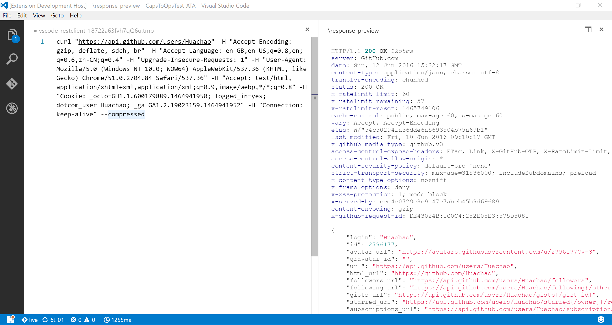
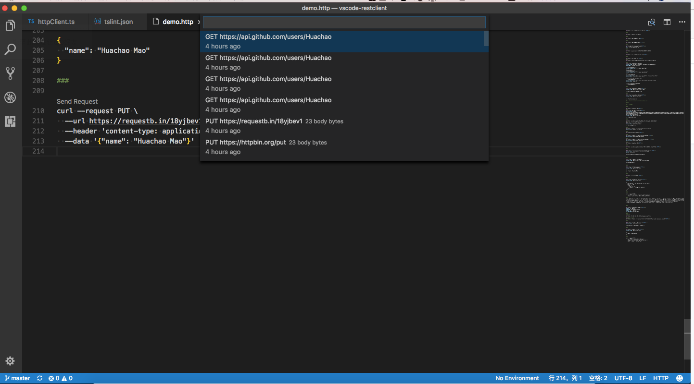
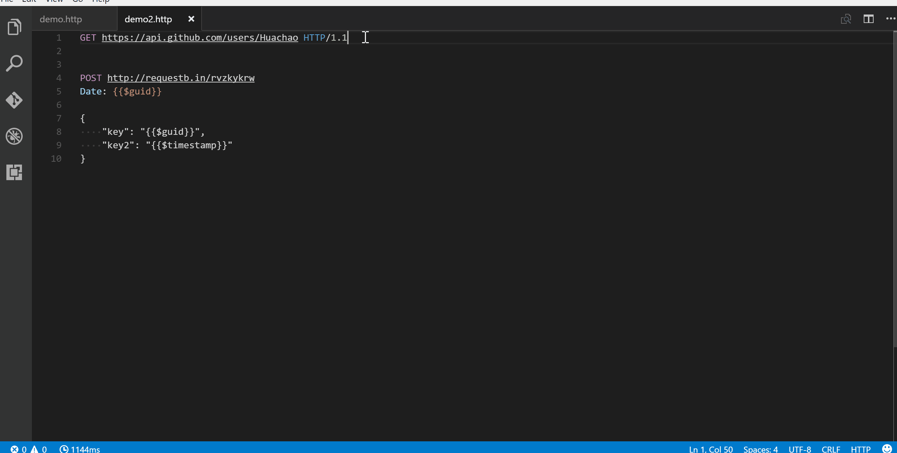
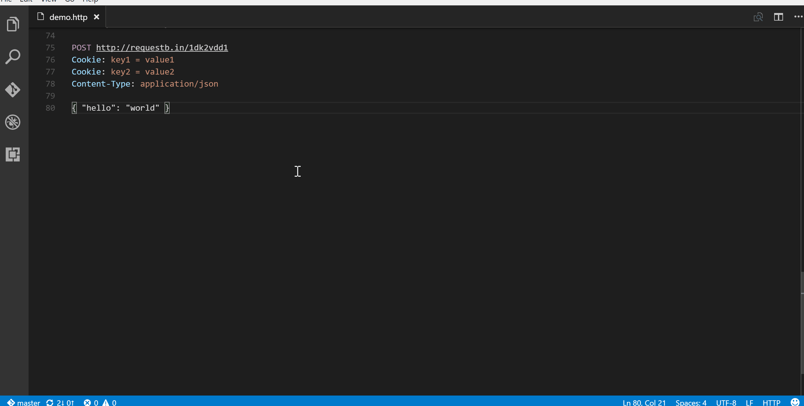
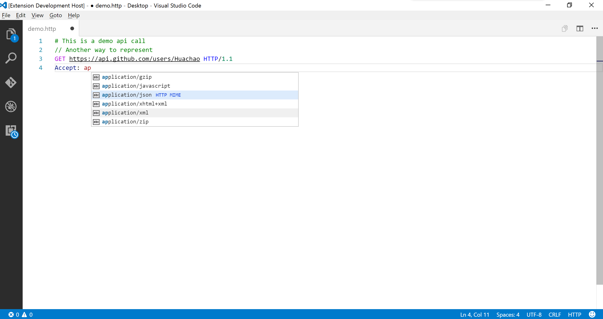
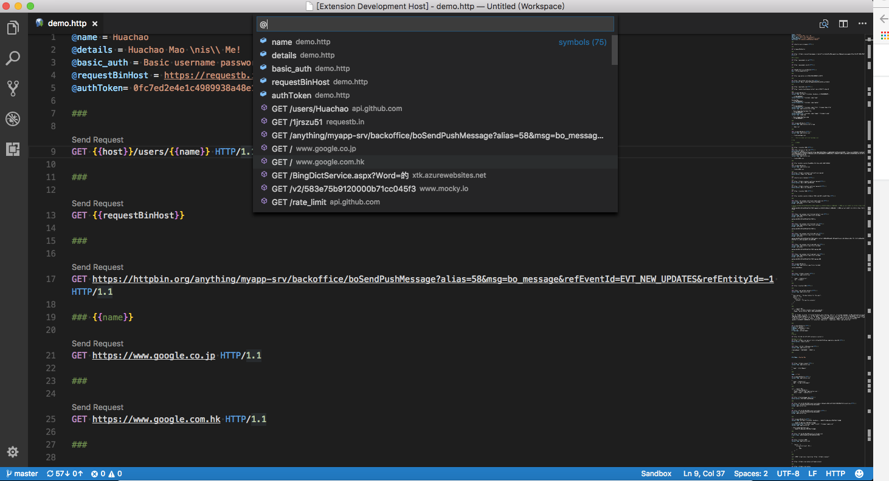

# [Rest Client on VSCODE](https://marketplace.visualstudio.com/items?itemName=humao.rest-client)

REST 클라이언트를 사용하면 HTTP 요청을 보내고 Visual Studio Code에서 직접 응답을 볼 수 있습니다.

## 주요 특징

- **편집기에서 HTTP 요청**을 보내기/취소/재실행 및 구문 강조 표시가 있는 별도 창에서 응답 보기
- **GraphQL 쿼리** 보내기 및 편집기에서 **GraphQL 변수 작성**
- 편집기에서 cURL 명령 을 보내고 HTTP 요청을 `cURL command` 복사
- 자동 저장 및 요청 기록 보기/지우기
- 동일한 파일에서  `###`로 구분하여 다중 요청 구성
- 창에서 직접 이미지 응답 보기
- Raw 응답 및 응답 본문을 로컬 디스크에만 저장
- 응답 body 접기 및 펼치기
- 응답 미리보기에서 글꼴(크기/패밀리/굵기) 사용자 지정
- 예상되는 부분이 포함된 미리보기 응답 ( *헤더만* , *본문만* , *전체 응답* 및 *요청 및 응답 모두* )
- 다음에 대한 인증 지원:
  - Basic Auth
  - Digest Auth
  - SSL 클라이언트 인증서
  - Azure Active Directory
  - Microsoft Identity Platform
  - AWS Signature v4
- 환경 및 사용자 정의/시스템 변수 지원
  - 요청( *URL* , *Headers* , *Body* ) 의 모든 위치에서 변수 사용
  - **환경** , **파일** 및 **요청** 사용자 정의 변수 모두 지원
  - **환경** , **파일** 및 **요청** 사용자 정의 변수 모두에 대한 자동 완성 및 호버 지원
  - **요청** 및 **파일** 사용자 정의 변수 에 대한 진단 지원
  - **요청** 및 **파일** 사용자 정의 변수 에 대한 정의 지원으로 이동
  - **파일** 사용자 정의 변수 에 *대해서만* 지원되는 모든 참조 찾기
  - 시스템 동적 변수 제공
    - `{{$guid}}`
    - `{{$randomInt min max}}`
    - `{{$timestamp [offset option]}}`
    - `{{$datetime rfc1123|iso8601 [offset option]}}`
    - `{{$localDatetime rfc1123|iso8601 [offset option]}}`
    - `{{$processEnv [%]envVarName}}`
    - `{{$dotenv [%]variableName}}`
    - `{{$aadToken [new] [public|cn|de|us|ppe] [<domain|tenantId>] [aud:<domain|tenantId>]}}`
  - 설정 파일에서 환경 및 환경 변수를 쉽게 생성/업데이트/삭제
  - 파일 변수는 사용자 정의 변수와 시스템 변수를 모두 참조 가능
  - 지원 환경 스위치
  - 모든 환경에서 사용 가능한 변수 제공을 위한 공유 환경 지원
- Python, JavaScript등의 언어처럼 HTTP 요청에 대한 **코드** 조각을 생성
- 후속 요청에 대한 쿠키 기억
- 프록시 지원
- SOAP 요청을 보내고 SOAP 봉투를 쉽게 구축하기 위한 스니펫 지원
- HTTP 언어 지원
  - `.http`및 `.rest`파일 확장자 지원
  - 구문 강조(요청 및 응답)
  - 메소드, URL, 헤더, 사용자 정의/시스템 변수, MIME 유형 등에 대한 자동 완성
  - 주석( `#`또는 으로 시작하는 줄 `//`) 지원
  - 지원 `json`및 `xml`본문 들여쓰기, 주석 바로 가기 및 자동 닫기 괄호
  - `GET` 및 `POST` 같은 작업에 대한 코드 조각
  - 열린 `http` 파일에서 기호 정의(요청 및 파일 수준 사용자 정의 변수)로 이동 지원
  - 요청을 보내기 위해 실행 가능한 링크를 추가하는 CodeLens 지원
  - 요청 블록 접기/펼치기

## 사용법

편집기에서 아래와 같이 간단한 HTTP 요청을 입력합니다.

```http
https://example.com/comments/1
```

또는 요청 방법, 헤더 및 본문을 포함 하는 표준 [RFC 2616](http://www.w3.org/Protocols/rfc2616/rfc2616-sec5.html) 을 따를 수 있습니다 .

```http
POST https://example.com/comments HTTP/1.1
content-type: application/json

{
    "name": "sample",
    "time": "Wed, 21 Oct 2015 18:27:50 GMT"
}
```

요청을 준비했으면 요청 `Send Request`위의 링크를 클릭하거나 (파일의 언어 모드가 `HTTP`기본적으로 `.http`다음과 같은 경우 나타납니다) 바로 가기를 사용하거나 `Ctrl+Alt+R` ( `Cmd+Alt+R`macOS의 경우) 편집기에서 마우스 오른쪽 버튼을 클릭한 `Send Request` 다음 메뉴를 누르거나 를 누른 `F1`다음 선택/입력 하면 Visual Studio Code의 `Rest Client: Send Request`별도 웹 보기 패널에서 응답을 미리 볼 수 있습니다 **.** Visual Studio Code에서 검색, 선택 또는 조작의 모든 기능을 사용하려는 경우 다음으로 설정 하여 제목 없는 문서 에서 응답을 미리 볼 수도 있습니다. `rest-client.previewResponseInUntitledDocument``true`. 요청이 발행되면 응답이 수신될 때까지 대기 중인 스핀 아이콘이 상태 표시줄에 표시됩니다. 스핀 아이콘을 클릭하여 요청을 취소할 수 있습니다. 그 후 아이콘은 총 기간 및 응답 크기로 바뀝니다.

상태 표시줄에서 총 기간 위로 마우스를 가져가면 응답 시간 분석을 볼 수 있으며 Socket, DNS, TCP, First Byte 및 Download의 기간 세부 정보를 볼 수 있습니다 .

상태 표시줄에서 응답 크기 위로 마우스를 가져가면 헤더 및 본문의 세부 응답 크기 세부 정보를 볼 수 있습니다.

> REST Client Extension의 모든 바로 가기는 파일 언어 모드 `http` 및  `plaintext`.

> **각 요청 위의 요청 보내기** 링크는 요청 파일이 `http` 모드일 때만 볼 수 있습니다. 자세한 내용은 [http 언어 섹션](https://marketplace.visualstudio.com/items?itemName=humao.rest-client#http-language) 에서 찾을 수 있습니다 .

### 요청 텍스트 선택

동일한 파일에 수많은 요청을 저장하고 원하는 대로 쉽게 실행할 수도 있습니다. REST 클라이언트 확장은 세 개 이상의 연속 `#`으로 시작하는 줄로 구분된 요청을 구분 기호로 인식할 수 있습니다. 구분 기호 사이에 커서를 놓고 위와 같이 요청하면 기본 요청이 전송됩니다.

```http
GET https://example.com/comments/1 HTTP/1.1

###

GET https://example.com/topics/1 HTTP/1.1

###

POST https://example.com/comments HTTP/1.1
content-type: application/json

{
    "name": "sample",
    "time": "Wed, 21 Oct 2015 18:27:50 GMT"
}
```

REST 클라이언트 확장은 또한 편집기에서 선택한 텍스트와 함께 요청을 보낼 수 있는 유연성을 제공합니다.

## 설치

을 누르고 `F1`를 입력 `ext install`한 다음 검색하십시오 `rest-client`.

## 요청하기


### 요청 라인

선택 항목(또는 아무것도 선택되지 않은 경우 문서)의 비어 있지 않은 첫 번째 줄은 요청 줄입니다. 다음은 요청 라인의 몇 가지 예입니다 .

```http
GET https://example.com/comments/1 HTTP/1.1
GET https://example.com/comments/1
https://example.com/comments/1
```

요청 메소드를 생략하면 요청이 `GET`으로 처리 되므로 위의 요청은 파싱 후에도 동일합니다.

#### 쿼리 문자열

다음과 같이 요청 라인에 항상 쿼리 문자열을 작성할 수 있습니다.

```http
GET https://example.com/comments?page=2&pageSize=10
```

때로는 단일 요청에 여러 쿼리 매개변수가 있을 수 있으며 모든 쿼리 매개변수를 *요청 라인* 에 넣는 것은 읽고 수정하기 어렵습니다. 따라서 쿼리 매개변수를 여러 줄로 분산할 수 있습니다(한 줄에 쿼리 매개변수 한 줄). 및 로 시작 하는 *요청 줄 바로 뒤에 있는 줄을 구문 분석합니다.*`?``&`

```http
GET https://example.com/comments
    ?page=2
    &pageSize=10
```

### 헤더 요청

The lines immediately after the *request line* to first empty line are parsed as *Request Headers*. Please provide headers with the standard `field-name: field-value` format, each line represents one header. By default `REST Client Extension` will add a `User-Agent` header with value `vscode-restclient` in your request if you don't explicitly specify. You can also change the default value in setting `rest-client.defaultHeaders`. Below are examples of *Request Headers*:

```http
User-Agent: rest-client
Accept-Language: en-GB,en-US;q=0.8,en;q=0.6,zh-CN;q=0.4
Content-Type: application/json
```

### Request Body

If you want to provide the request body, please add a blank line after the request headers like the POST example in usage, and all content after it will be treated as *Request Body*. Below are examples of *Request Body*:

```http
POST https://example.com/comments HTTP/1.1
Content-Type: application/xml
Authorization: token xxx

<request>
    <name>sample</name>
    <time>Wed, 21 Oct 2015 18:27:50 GMT</time>
</request>
```

You can also specify file path to use as a body, which starts with `<`, the file path(*whitespaces* should be preserved) can be either in absolute or relative(relative to workspace root or current http file) formats:

```http
POST https://example.com/comments HTTP/1.1
Content-Type: application/xml
Authorization: token xxx

< C:\Users\Default\Desktop\demo.xml
POST https://example.com/comments HTTP/1.1
Content-Type: application/xml
Authorization: token xxx

< ./demo.xml
```

If you want to use variables in that file, you'll have to use an `@` to ensure variables are processed when referencing a file (UTF-8 is assumed as the default encoding)

```http
POST https://example.com/comments HTTP/1.1
Content-Type: application/xml
Authorization: token xxx

<@ ./demo.xml
```

to override the default encoding, simply type it next to the `@` like the below example

```http
POST https://example.com/comments HTTP/1.1
Content-Type: application/xml
Authorization: token xxx

<@latin1 ./demo.xml
```

When content type of request body is `multipart/form-data`, you may have the mixed format of the request body as follows:

```http
POST https://api.example.com/user/upload
Content-Type: multipart/form-data; boundary=----WebKitFormBoundary7MA4YWxkTrZu0gW

------WebKitFormBoundary7MA4YWxkTrZu0gW
Content-Disposition: form-data; name="text"

title
------WebKitFormBoundary7MA4YWxkTrZu0gW
Content-Disposition: form-data; name="image"; filename="1.png"
Content-Type: image/png

< ./1.png
------WebKitFormBoundary7MA4YWxkTrZu0gW--
```

When content type of request body is `application/x-www-form-urlencoded`, you may even divide the request body into multiple lines. And each key and value pair should occupy a single line which starts with `&`:

```http
POST https://api.example.com/login HTTP/1.1
Content-Type: application/x-www-form-urlencoded

name=foo
&password=bar
```

> When your mouse is over the document link, you can `Ctrl+Click`(`Cmd+Click` for macOS) to open the file in a new tab.

## Making GraphQL Request

With [GraphQL](https://www.graphql.com/) support in REST Client extension, you can author and send `GraphQL` query using the request body. Besides that you can also author GraphQL variables in the request body. GraphQL variables part in request body is optional, you also need to add a **blank line** between GraphQL query and variables if you need it.

You can specify a request as `GraphQL Request` by adding a custom request header `X-Request-Type: GraphQL` in your headers. The following code illustrates this:

```http
POST https://api.github.com/graphql
Content-Type: application/json
Authorization: Bearer xxx
X-REQUEST-TYPE: GraphQL

query ($name: String!, $owner: String!) {
  repository(name: $name, owner: $owner) {
    name
    fullName: nameWithOwner
    description
    diskUsage
    forkCount
    stargazers(first: 5) {
        totalCount
        nodes {
            login
            name
        }
    }
    watchers {
        totalCount
    }
  }
}

{
    "name": "vscode-restclient",
    "owner": "Huachao"
}
```

## Making cURL Request

 We add the capability to directly run [curl request](https://curl.haxx.se/) in REST Client extension. The issuing request command is the same as raw HTTP one. REST Client will automatically parse the request with specified parser.

`REST Client` doesn't fully support all the options of `cURL`, since underneath we use `request` library to send request which doesn't accept all the `cURL` options. Supported options are listed below:

- -X, --request
- -L, --location, --url
- -H, --header(no *@* support)
- -I, --head
- -b, --cookie(no cookie jar file support)
- -u, --user(Basic auth support only)
- -d, --data, --data-ascii,--data-binary, --data-raw

## Copy Request As cURL

Sometimes you may want to get the curl format of an http request quickly and save it to clipboard, just pressing `F1` and then selecting/typing `Rest Client: Copy Request As cURL` or simply right-click in the editor, and select `Copy Request As cURL`.

## Cancel Request

Once you want to cancel a processing request, click the waiting spin icon or use shortcut `Ctrl+Alt+K`(`Cmd+Alt+K` for macOS), or press `F1` and then select/type `Rest Client: Cancel Request`.

## Rerun Last Request

Sometimes you may want to refresh the API response, now you could do it simply using shortcut `Ctrl+Alt+L`(`Cmd+Alt+L` for macOS), or press `F1` and then select/type `Rest Client: Rerun Last Request` to rerun the last request.

## Request History

 Each time we sent an http request, the request details(method, url, headers, and body) would be persisted into file. By using shortcut `Ctrl+Alt+H`(`Cmd+Alt+H` for macOS), or press `F1` and then select/type `Rest Client: Request History`, you can view the last **50** request items(method, url and request time) in the time reversing order, you can select any request you wish to trigger again. After specified request history item is selected, the request details would be displayed in a temp file, you can view the request details or follow previous step to trigger the request again.

You can also clear request history by pressing `F1` and then selecting/typing `Rest Client: Clear Request History`.

## Save Full Response

 In the upper right corner of the response preview tab, we add a new icon to save the latest response to local file system. After you click the `Save Full Response` icon, it will prompt the window with the saved response file path. You can click the `Open` button to open the saved response file in current workspace or click `Copy Path` to copy the saved response path to clipboard.

## Save Response Body

Another icon in the upper right corner of the response preview tab is the `Save Response Body` button, it will only save the response body **ONLY** to local file system. The extension of saved file is set according to the response `MIME` type, like if the `Content-Type` value in response header is `application/json`, the saved file will have extension `.json`. You can also overwrite the `MIME` type and extension mapping according to your requirement with the `rest-client.mimeAndFileExtensionMapping` setting.

```json
"rest-client.mimeAndFileExtensionMapping": {
    "application/atom+xml": "xml"
}
```

## Fold and Unfold Response Body

In the response webview panel, there are two options `Fold Response` and `Unfold Response` after clicking the `More Actions...` button. Sometimes you may want to fold or unfold the whole response body, these options provide a straightforward way to achieve this.

## Authentication

We have supported some most common authentication schemes like *Basic Auth*, *Digest Auth*, *SSL Client Certificates*, *Azure Active Directory(Azure AD)* and *AWS Signature v4*.

### Basic Auth

HTTP Basic Auth is a widely used protocol for simple username/password authentication. We support **three** formats of Authorization header to use Basic Auth.

1. Add the value of Authorization header in the raw value of `username:password`.
2. Add the value of Authorization header in the base64 encoding of `username:password`.
3. Add the value of Authorization header in the raw value of `username` and `password`, which is separated by space. REST Client extension will do the base64 encoding automatically.

The corresponding examples are as follows, they are equivalent:

```http
GET https://httpbin.org/basic-auth/user/passwd HTTP/1.1
Authorization: Basic user:passwd
```

and

```http
GET https://httpbin.org/basic-auth/user/passwd HTTP/1.1
Authorization: Basic dXNlcjpwYXNzd2Q=
```

and

```http
GET https://httpbin.org/basic-auth/user/passwd HTTP/1.1
Authorization: Basic user passwd
```

### Digest Auth

HTTP Digest Auth is also a username/password authentication protocol that aims to be slightly safer than Basic Auth. The format of Authorization header for Digest Auth is similar to Basic Auth. You just need to set the scheme to `Digest`, as well as the raw user name and password.

```http
GET https://httpbin.org/digest-auth/auth/user/passwd
Authorization: Digest user passwd
```

### SSL Client Certificates

We support `PFX`, `PKCS12`, and `PEM` certificates. Before using your certificates, you need to set the certificates paths(absolute/relative to workspace/relative to current http file) in the setting file for expected host name(port is optional). For each host, you can specify the key `cert`, `key`, `pfx` and `passphrase`.

- `cert`: Path of public x509 certificate
- `key`: Path of private key
- `pfx`: Path of PKCS [#12](https://github.com/Huachao/vscode-restclient/issues/12) or PFX certificate
- `passphrase`: Optional passphrase for the certificate if required You can add following piece of code in your setting file if your certificate is in `PEM` format:

```json
"rest-client.certificates": {
    "localhost:8081": {
        "cert": "/Users/demo/Certificates/client.crt",
        "key": "/Users/demo/Keys/client.key"
    },
    "example.com": {
        "cert": "/Users/demo/Certificates/client.crt",
        "key": "/Users/demo/Keys/client.key"
    }
}
```

Or if you have certificate in `PFX` or `PKCS12` format, setting code can be like this:

```json
"rest-client.certificates": {
    "localhost:8081": {
        "pfx": "/Users/demo/Certificates/clientcert.p12",
        "passphrase": "123456"
    }
}
```

### Azure Active Directory(Azure AD)

Azure AD is Microsoft’s multi-tenant, cloud-based directory and identity management service, you can refer to the [System Variables](https://marketplace.visualstudio.com/items?itemName=humao.rest-client#system-variables) section for more details.

### Microsoft Identity Platform(Azure AD V2)

Microsoft identity platform is an evolution of the Azure Active Directory (Azure AD) developer platform. It allows developers to build applications that sign in all Microsoft identities and get tokens to call Microsoft APIs such as Microsoft Graph or APIs that developers have built. Microsoft Identity platform supports OAuth2 scopes, incremental consent and advanced features like multi-factor authentication and conditional access.

### AWS Signature v4

AWS Signature version 4 authenticates requests to AWS services. To use it you need to set the Authorization header schema to `AWS` and provide your AWS credentials separated by spaces:

- `<accessId>`: AWS Access Key Id
- `<accessKey>`: AWS Secret Access Key
- `token:<sessionToken>`: AWS Session Token - required only for temporary credentials
- `region:<regionName>`: AWS Region - required only if region can't be deduced from URL
- `service:<serviceName>`: AWS Service - required only if service can't be deduced from URL

```http
GET https://httpbin.org/aws-auth HTTP/1.1
Authorization: AWS <accessId> <accessKey> [token:<sessionToken>] [region:<regionName>] [service:<serviceName>]
```

## Generate Code Snippet

 Once you’ve finalized your request in REST Client extension, you might want to make the same request from your source code. We allow you to generate snippets of code in various languages and libraries that will help you achieve this. Once you prepared a request as previously, use shortcut `Ctrl+Alt+C`(`Cmd+Alt+C` for macOS), or right-click in the editor and then select `Generate Code Snippet` in the menu, or press `F1` and then select/type `Rest Client: Generate Code Snippet`, it will pop up the language pick list, as well as library list. After you selected the code snippet language/library you want, the generated code snippet will be previewed in a separate panel of Visual Studio Code, you can click the `Copy Code Snippet` icon in the tab title to copy it to clipboard.

## HTTP Language

Visual Studio Code에서 HTTP 요청을 작성할 때 **구문 강조 표시** , **자동 완성** , **코드 렌즈** 및 **주석 지원** 과 같은 기능을 사용하여 HTTP 요청에 대한 언어 지원을 추가합니다 . 기본적으로 언어 연결은 다음 두 가지 경우에 자동으로 활성화됩니다.

1. 확장자가 있는 파일 `.http`또는`.rest`
2. 파일의 첫 번째 줄은 형식 이 있는 [RFC 2616](http://www.w3.org/Protocols/rfc2616/rfc2616-sec5.html) 의 표준 요청 줄을 따릅니다 .`Method SP Request-URI SP HTTP-Version`

다른 경우에 언어 연결을 활성화하려면 오른쪽 하단의 언어 모드를 로 변경하면 `Visual Studio Code`됩니다 `HTTP`.



### 자동 완성

현재 다음 7개 범주에 대해 자동 완성이 활성화됩니다.

1. HTTP 메소드
2. 요청 기록의 HTTP URL
3. HTTP 헤더
4. 시스템 변수
5. 현재 환경/파일/요청의 사용자 정의 변수
6. `Accept`및 `Content-Type`헤더 의 MIME 유형
7. 에 대한 인증 체계 `Basic`및`Digest`

### 요청 파일의 기호로 이동

단일 `http`파일은 많은 요청과 파일 수준 사용자 정의 변수를 정의할 수 있으므로 원하는 요청/변수를 찾기가 어려울 것입니다. *Visual Studio Code 의* *Goto Symbol 기능* 을 활용 하여 바로 가기 ( macOS의 경우)로 요청/변수 탐색(goto)을 지원하거나 간단히 , 를 입력 합니다. `Ctrl+Shift+O``Cmd+Shift+O``F1``@`

## 환경

환경은 변수를 사용하여 요청을 사용자 정의할 수 있는 기능을 제공하며 `http`파일의 요청을 변경하지 않고도 쉽게 환경을 전환할 수 있습니다. 일반적인 사용법은 devbox, sandbox 및 프로덕션과 같은 다양한 웹 서비스 환경에 대해 서로 다른 구성을 사용하는 것입니다. 또한 모든 환경에서 사용할 수 있는 변수 집합을 제공하기 위해 **공유** 환경(특수 환경 이름 *$shared 로 식별됨)을 지원합니다.* 그리고 지정한 환경에서 같은 이름의 변수를 정의하여 공유 환경의 값을 덮어쓸 수 있습니다. 현재 활성화된 환경의 이름은 의 오른쪽 하단에 표시되며 `Visual Studio Code`클릭하면 팝업 목록에서 환경을 전환할 수 있습니다. 또한 바로 가기 `Ctrl+Alt+E`(`Cmd+Alt+E`macOS의 경우) 또는 를 누른 `F1`다음 를 선택/입력 `Rest Client: Switch Environment`합니다.

환경 및 변수를 포함하는 것은 설정 파일에 직접 정의 `Visual Studio Code`되어 있으므로 언제든지 환경 및 변수를 생성/업데이트/삭제할 수 있습니다. **어떤 환경도 사용 하지** 않으 `No Environment`려면 환경 목록에서 선택할 수 있습니다 . 를 선택하면 `No Environment`공유 환경에 정의된 변수를 계속 사용할 수 있습니다. [환경 변수](https://marketplace.visualstudio.com/items?itemName=humao.rest-client#environment-variables) 에 대한 자세한 내용은 환경 변수를 참조 하십시오.

## 변수

우리는 두 가지 유형의 변수를 지원합니다. 하나는 **사용자 가 정의하고** **환경 변수** , **파일 변수** 및 **요청 변수** 로 더 나눌 수 있는 사용자 변수 이고, 다른 하나는 사전 정의된 변수 세트인 **시스템 변수 입니다.**

시스템 및 사용자 정의 변수 유형의 참조 구문에는 미묘한 차이가 있습니다. 전자의 경우 구문은 `{{$SystemVariableName}}`이고 후자의 경우 구문은 변수 이름 `{{CustomVariableName}}`앞에 선행하지 않고 입니다. `$`다양한 유형의 사용자 정의 변수에 대한 정의 구문과 위치는 다릅니다. 사용자 정의 변수에 동일한 이름을 사용하는 경우 요청 변수가 파일 변수보다 우선 순위가 높고 파일 변수가 환경 변수보다 우선 순위가 높습니다.

### 맞춤 변수

사용자 정의 변수는 환경 변수, 파일 변수 및 요청 변수의 이점으로 다양한 사용자 시나리오를 다룰 수 있습니다. 환경 변수는 주로 다른 환경에서 다를 수 있는 값을 저장하는 데 사용됩니다. 환경 변수는 Visual Studio Code 설정 파일에 직접 정의되어 있으므로 여러 `http`파일에서 참조할 수 있습니다. 파일 변수는 주로 파일 전체에서 일정한 값을 나타내는 데 사용 `http`됩니다. *요청 변수는 요청이 동일한* 내에서 다른 요청/응답의 일부(헤더 또는 본문)를 참조해야 함을 의미하는 연결 요청 시나리오에 사용됩니다. `http`파일에서 로그인 응답에서 인증 토큰을 동적으로 검색해야 한다고 상상해 보세요. 요청 변수는 케이스에 잘 맞습니다. 파일 및 요청 변수는 모두 파일에 정의되며 **파일 범위**`http` 만 있습니다 .

#### 환경 변수

환경 변수의 경우 각 환경은 설정 파일에 정의된 키 값 쌍의 집합으로 구성되며 키와 값은 각각 변수 이름과 값입니다. 선택한 환경 및 공유 환경에서 정의된 변수만 사용할 수 있습니다. `{{$shared variableName}}`활성 환경의 구문을 사용하여 공유 환경의 변수를 참조할 수도 있습니다. 다음은 사용자 지정 환경 및 환경 수준 변수에 대한 설정 파일의 샘플입니다.

```json
"rest-client.environmentVariables": {
    "$shared": {
        "version": "v1",
        "prodToken": "foo",
        "nonProdToken": "bar"
    },
    "local": {
        "version": "v2",
        "host": "localhost",
        "token": "{{$shared nonProdToken}}",
        "secretKey": "devSecret"
    },
    "production": {
        "host": "example.com",
        "token": "{{$shared prodToken}}",
        "secretKey" : "prodSecret"
    }
}
http`위의 환경 변수에 대한 파일 의 샘플 사용법 은 아래에 나열되어 있습니다. *로컬* 환경으로 전환하면 *v2*`version` 가 되고 *프로덕션* 환경으로 변경 하면 *$shared* 환경 에서 상속되는 *v1* 이 됩니다.`version
GET https://{{host}}/api/{{version}}comments/1 HTTP/1.1
Authorization: {{token}}
```

#### 파일 변수

파일 변수의 경우 정의 **`@variableName = variableValue`**는 완전한 행을 차지하는 구문을 따릅니다. 그리고 변수 이름 에는 공백이 포함 되어서는 안 됩니다 **(MUST NOT ).** 변수 값은 모든 문자로 구성될 수 있으며 공백도 허용됩니다(선행 및 후행 공백은 잘림). 줄 바꿈과 같은 일부 특수 문자를 유지하려면 *백슬래시* `\` 를 사용하여 이스케이프할 수 있습니다(예: `\n`. 파일 변수 값은 다른 모든 종류의 변수에 대한 참조를 포함할 수도 있습니다. 예를 들어, 와 같은 다른 [요청 변수](https://marketplace.visualstudio.com/items?itemName=humao.rest-client#request-variables) 의 값으로 파일 변수를 생성할 수 있습니다 `@token = {{loginAPI.response.body.token}}`.

파일 변수는 변수 정의로만 채워진 별도의 요청 블록에서 정의할 수 있을 뿐만 아니라 변수 정의와 요청 URL 사이에 추가 공백 줄이 필요한 모든 요청 URL 앞에 요청 변수를 정의할 수 있습니다. 그러나 파일에서 파일 변수를 정의한 위치에 관계없이 `http`전체 파일의 모든 요청에서 참조할 수 있습니다. 파일 변수의 경우 *정의* 로 이동 및 *모든 참조 찾기*`Visual Studio Code` 와 같은 일부 기능 을 활용할 수도 있습니다 . 다음은 파일의 파일 변수 정의 및 참조 샘플입니다 .`http`

```http
@hostname = api.example.com
@port = 8080
@host = {{hostname}}:{{port}}
@contentType = application/json
@createdAt = {{$datetime iso8601}}
@modifiedBy = {{$processEnv USERNAME}}

###

@name = hello

GET https://{{host}}/authors/{{name}} HTTP/1.1

###

PATCH https://{{host}}/authors/{{name}} HTTP/1.1
Content-Type: {{contentType}}

{
    "content": "foo bar",
    "created_at": "{{createdAt}}",
    "modified_by": "{{modifiedBy}}"
}
```

#### 요청 변수

요청 변수는 범위 및 정의 위치와 같은 일부 측면에서 파일 변수와 유사합니다. 그러나 몇 가지 분명한 차이점이 있습니다. 요청 변수의 정의 구문은 한 줄 주석과 같 으며 원하는 요청 URL 뒤 **`// @name requestName`**또는 **`# @name requestName`**바로 앞에 있습니다. *요청 변수를 기본 요청에 이름 메타데이터* 를 첨부하는 것으로 생각할 수 있으며 이러한 종류의 요청은 **Named Request** 로 호출 할 수 있지만 일반 요청은 **Anonymous Request** 로 호출할 수 있습니다 . 다른 요청에서 사용할 수 있는`requestName`명명된 요청 또는 최신 응답의 예상 부분을 참조하는 식별자로 사용됩니다. 명명된 요청의 응답을 참조하려면 먼저 응답을 검색하도록 명명된 요청을 수동으로 트리거해야 합니다. 그렇지 않으면 변수 참조의 일반 텍스트가 `{{requestName.response.body.$.id}}`대신 전송됩니다.

요청 변수의 참조 구문은 다른 종류의 사용자 정의 변수보다 약간 더 복잡합니다. 요청 변수 참조 구문은 다음과 같습니다 `{{requestName.(response|request).(body|headers).(*|JSONPath|XPath|Header Name)}}`. 응답 또는 요청의 두 가지 참조 부분 선택: *body* 및 *headers* 가 있습니다 . *본문* 부분의 경우 전체 응답 본문을 참조하는 데 사용할 수 있고 `*`및 `JSON`응답 `XML`의 경우 [JSONPath](http://goessner.net/articles/JsonPath/) 및 [XPath](https://developer.mozilla.org/en-US/docs/Web/XPath) 를 사용하여 특정 속성 또는 속성을 추출할 수 있습니다. 예를 들어 JSON 응답이 body 를 반환하는 경우 id를 참조하도록 `{"id": "mock"}`JSONPath 부분을 설정할 수 있습니다 . *헤더*`$.id` 부분의 경우 헤더 이름을 지정하여 헤더 값을 추출할 수 있습니다. 또한 헤더 이름은*대소문자를 구분하지 않습니다* .

> 본문 의 *JSONPath* 또는 *XPath 또는 헤더의* *헤더 이름* 을 확인할 수 없는 경우 변수 참조의 일반 텍스트가 대신 전송됩니다. 그리고 이 경우 진단 정보가 표시되어 이를 검사하는 데 도움이 됩니다. 또한 요청 변수 위로 마우스를 가져가 실제 해결된 값을 볼 수도 있습니다.

다음은 파일에 있는 요청 변수 정의 및 참조의 샘플입니다 `http`.

```http
@baseUrl = https://example.com/api

# @name login
POST {{baseUrl}}/api/login HTTP/1.1
Content-Type: application/x-www-form-urlencoded

name=foo&password=bar

###

@authToken = {{login.response.headers.X-AuthToken}}

# @name createComment
POST {{baseUrl}}/comments HTTP/1.1
Authorization: {{authToken}}
Content-Type: application/json

{
    "content": "fake content"
}

###

@commentId = {{createComment.response.body.$.id}}

# @name getCreatedComment
GET {{baseUrl}}/comments/{{commentId}} HTTP/1.1
Authorization: {{authToken}}

###

# @name getReplies
GET {{baseUrl}}/comments/{{commentId}}/replies HTTP/1.1
Accept: application/xml

###

# @name getFirstReply
GET {{baseUrl}}/comments/{{commentId}}/replies/{{getReplies.response.body.//reply[1]/@id}}
```

### 시스템 변수

시스템 변수는 요청(Url/Headers/Body)의 모든 부분에서 사용할 수 있는 미리 정의된 변수 집합을 형식으로 제공합니다 `{{$variableName}}`. 현재 귀하의 요청에 사용할 수 있는 몇 가지 동적 변수를 제공합니다. 변수 이름은 *대소문자를 구분* 합니다.

- `{{$aadToken [new] [public|cn|de|us|ppe] [<domain|tenantId>] [aud:<domain|tenantId>]}}`: 다음 옵션을 기반으로 Azure Active Directory 토큰을 추가합니다(순서대로 지정해야 함).

  `new`: 선택 사항입니다. `new`강제 재인증을 지정하고 지정된 디렉터리에 대한 새 토큰을 가져옵니다 . 기본값: 메모리 내 캐시에서 지정된 디렉토리에 대한 이전 토큰을 재사용합니다. 만료된 토큰은 자동으로 새로 고쳐집니다. (캐시를 지우려면 Visual Studio Code를 사용 `F1 > Rest Client: Clear Azure AD Token Cache`하거나 다시 시작하십시오.)

  `public|cn|de|us|ppe`: 선택 사항입니다. `public`지정된 정부 클라우드, 퍼블릭 클라우드 또는 `ppe`내부 테스트를 위한 토큰을 가져오려면 최상위 도메인(TLD)을 지정합니다 . 기본값: REST 끝점의 TLD. `public`유효하지 않은 경우.

  `<domain|tenantId>`: 선택 사항입니다. 로그인할 디렉터리의 도메인 또는 테넌트 ID입니다. 기본값: 드롭다운에서 디렉터리를 선택하거나 을 눌러 `Esc`홈 디렉터리( `common`Microsoft 계정용)를 사용합니다.

  `aud:<domain|tenantId>`: 선택 사항입니다. 대상 Azure AD 앱 ID(클라이언트 ID라고도 함) 또는 토큰을 생성해야 하는 도메인(대상 또는 리소스라고도 함). 기본값: REST 끝점의 도메인입니다.

- `{{$aadV2Token [new] [appOnly ][scopes:<scope[,]>] [tenantid:<domain|tenantId>] [clientid:<clientId>]}}`: 다음 옵션을 기반으로 Azure Active Directory 토큰을 추가합니다(순서대로 지정해야 함).

  `new`: 선택 사항입니다. `new`강제 재인증을 지정하고 지정된 디렉터리에 대한 새 토큰을 가져옵니다 . 기본값: 메모리 내 캐시에서 지정된 tenantId 및 clientId에 대한 이전 토큰을 재사용합니다. 만료된 토큰은 자동으로 새로 고쳐집니다. (캐시를 지우려면 Visual Studio Code를 다시 시작하십시오.)

  `appOnly`: 선택 사항입니다. `appOnly`make를 사용하여 클라이언트 자격 증명 흐름을 사용하여 토큰을 얻으려면 지정 합니다. `aadV2ClientSecret`REST 클라이언트 환경 변수 로 `aadV2AppUri`제공되어야 합니다. `aadV2ClientId`환경 을 `aadV2TenantId`통해 선택적으로 제공될 수도 있습니다. 환경에서는 통화 `aadV2ClientId`에만 사용됩니다 .`appOnly`

  `scopes:<scope[,]>`: 선택 사항입니다. 호출이 성공할 수 있도록 동의해야 하는 범위의 쉼표로 구분된 목록입니다. `appOnly`통화 에는 적용되지 않습니다 .

  `tenantId:<domain|tenantId>`: 선택 사항입니다. 테넌트가 로그인할 도메인 또는 테넌트 ID입니다. ( `common`로그인에서 임차인을 결정하기 위해).

  `clientId:<clientid>`: 선택 사항입니다. 토큰을 얻는 데 사용할 애플리케이션 등록의 식별자입니다. 기본값은 이 플러그인을 위해 특별히 생성된 애플리케이션 등록을 사용합니다.

- `{{$guid}}`: RFC 4122 v4 UUID 추가

- `{{$processEnv [%]envVarName}}`: 로컬 시스템 환경 변수를 문자열 값으로 해석할 수 있습니다. 일반적인 사용 사례는 소스 제어에 커밋하고 싶지 않은 비밀 키에 대한 것입니다. 예: `.bashrc`Windows에서 또는 이와 유사한 쉘 환경 변수를 정의하십시오.

  ```bash
  export DEVSECRET="XlII3JUaEZldVg="
  export PRODSECRET="qMTkleUgjclRoRmV1WA=="
  export USERNAME="sameUsernameInDevAndProd"
  ```

  확장 설정 환경 변수와 함께.

  ```json
  "rest-client.environmentVariables": {
      "$shared": {
          "version": "v1"
      },
      "local": {
          "version": "v2",
          "host": "localhost",
          "secretKey": "DEVSECRET"
      },
      "production": {
          "host": "example.com",
          "secretKey" : "PRODSECRET"
      }
  }
  ```

  `PRODSECRET`예 를 들어 프로덕션 환경에서 실행 중인 경우 스크립트에서 키(예: )를 직접 참조할 수 있습니다.

  ```http
  # Lookup PRODSECRET from local machine environment
  GET https://{{host}}/{{version}}/values/item1?user={{$processEnv USERNAME}}
  Authorization: {{$processEnv PRODSECRET}}
  ```

  또는 확장 환경 설정(예: )을 사용하여 키를 간접적으로 참조하도록 다시 작성하여 선택적 수정자를 `%secretKey`사용하여 환경에 독립적일 수 있습니다 .`%`

  ```http
  # Use secretKey from extension environment settings to determine which local machine environment variable to use
  GET https://{{host}}/{{version}}/values/item1?user={{$processEnv USERNAME}}
  Authorization: {{$processEnv %secretKey}}
  ```

  `envVarName`: 필수적인. 로컬 시스템 환경 변수를 지정합니다.

  `%`: 선택 사항입니다. 지정하면 envVarName을 확장 설정 환경 변수로 취급하고 그 값을 조회에 사용합니다.

- `{{$dotenv [%]variableName}}`[`.env`](https://github.com/motdotla/dotenv): 파일의 동일한 디렉토리에 존재 하는 파일에 저장된 환경 값을 반환 `.http`합니다.

- `{{$randomInt min max}}`: 최소(포함)와 최대(제외) 사이의 임의의 정수를 반환합니다.

- `{{$timestamp [offset option]}}`: 현재 UTC 타임스탬프를 추가합니다. 현재 시간을 기준으로 날짜 시간을 형식으로 지정할 수도 있습니다 `{{$timestamp number option}}`. 예를 들어 3시간 전을 간단히 `{{$timestamp -3 h}}`; 모레를 나타내기 위해 간단히 `{{$timestamp 2 d}}`.

- `{{$datetime rfc1123|iso8601|"custom format"|'custom format' [offset option]}}`: *ISO8601* , *RFC1123* 또는 사용자 지정 표시 형식으로 날짜/시간 문자열을 추가합니다. *ISO8601* 형식으로 1년 후를 나타내기 위해 `timestamp`like: 와 유사한 현재 날짜를 기준으로 날짜 시간을 지정할 수도 있습니다 . 사용자 지정 형식을 지정하는 경우 다음과 같이 작은따옴표나 큰따옴표로 묶 습니다. 날짜는 Day.js를 사용하여 형식이 지정 됩니다. 형식 문자열에 대한 정보는 [여기 를 참조하세요.](https://day.js.org/docs/en/get-set/get#list-of-all-available-units)`{{$datetime iso8601 1 y}}``{{$datetime "DD-MM-YYYY" 1 y}}`

- `{{$localDatetime rfc1123|iso8601|"custom format"|'custom format' [offset option]}}`: 현지 시간대의 시간 문자열을 반환 한다는 점을 `$datetime`제외하고 유사합니다 .`$localDatetime`

에서 지정할 수 있는 오프셋 옵션 은 다음 `timestamp`과 `datetime`같습니다.

| 옵션 | 설명   |
| ---- | ------ |
| 와이 | 년도   |
| 중   | 월     |
| 승   | 주     |
| 디   | 낮     |
| 시간 | 시     |
| 중   | 분     |
| 에스 | 초     |
| ms   | 밀리초 |

다음은 시스템 변수를 사용하는 예입니다.

```http
POST https://api.example.com/comments HTTP/1.1
Content-Type: application/xml
Date: {{$datetime rfc1123}}

{
    "user_name": "{{$dotenv USERNAME}}",
    "request_id": "{{$guid}}",
    "updated_at": "{{$timestamp}}",
    "created_at": "{{$timestamp -1 d}}",
    "review_count": "{{$randomInt 5 200}}",
    "custom_date": "{{$datetime 'YYYY-MM-DD'}}",
    "local_custom_date": "{{$localDatetime 'YYYY-MM-DD'}}"
}
```

> `aadToken`(Azure Active Directory 토큰) 에 대한 자세한 내용은 [Wiki 에서 찾을 수 있습니다.](https://github.com/Huachao/vscode-restclient/wiki/Azure-Active-Directory-Authentication-Samples)

## 응답 미리보기 사용자 정의

REST 클라이언트 확장은 응답 미리보기에 사용되는 글꼴 패밀리, 크기 및 두께를 제어하는 기능을 추가합니다.

기본적으로 REST Client Extension은 미리보기 패널( *status line* , *headers* 및 *body* )에서 전체 응답만 미리 봅니다. `rest-client.previewOption`설정 을 통해 미리 볼 부분을 제어할 수 있습니다 .

| 옵션   | 설명                                            |
| ------ | ----------------------------------------------- |
| 가득한 | 기본. 전체 응답을 미리 봅니다.                  |
| 헤더   | 응답 헤더( *상태 표시줄* 포함 )만 미리 봅니다 . |
| 몸     | 응답 본문만 미리 봅니다.                        |
| 교환   | 전체 HTTP 교환 미리보기(요청 및 응답)           |

## 설정

- `rest-client.followredirect`: 리디렉션으로 HTTP 3xx 응답을 따릅니다. (기본값은 **true** )
- `rest-client.defaultHeaders`: 요청 헤더에서 특정 헤더가 생략되면 각 요청에 대한 헤더로 추가됩니다. (기본값은 `{ "User-Agent": "vscode-restclient", "Accept-Encoding": "gzip" }`)
- `rest-client.timeoutinmilliseconds`: 밀리초 단위의 시간 초과입니다. 0은 무한대입니다. (기본값은 **0** )
- `rest-client.showResponseInDifferentTab`: 다른 탭에 응답을 표시합니다. (기본값은 **false** )
- `rest-client.requestNameAsResponseTabTitle`: 응답 탭 제목으로 요청 이름을 표시합니다. 요청 이름이 지정되지 않은 경우 html 보기를 사용할 때만 유효하며 기본값은 "응답"입니다. (기본값은 **false** )
- `rest-client.rememberCookiesForSubsequentRequests`: 응답으로 헤더의 쿠키를 저장 `Set-Cookie`하고 후속 요청에 사용합니다. (기본값은 **true** )
- `rest-client.enableTelemetry`: 익명의 사용 데이터를 보냅니다. (기본값은 **true** )
- `rest-client.excludeHostsForProxy`: 프록시 설정을 사용할 때 호스트를 제외합니다. (기본값은 **[]** )
- `rest-client.fontSize`: 응답 미리보기에 사용되는 글꼴 크기를 픽셀 단위로 제어합니다. (기본값은 **13** )
- `rest-client.fontFamily`: 응답 미리보기에 사용되는 글꼴 모음을 제어합니다. (기본값은 **Menlo, Monaco, Consolas, "Droid Sans Mono", "Courier New", 고정 공간, "Droid Sans Fallback"** )
- `rest-client.fontWeight`: 응답 미리보기에 사용되는 글꼴 두께를 제어합니다. (기본값은 **정상** 입니다 )
- `rest-client.environmentVariables`: 환경을 설정하고 여기에 속한 사용자 정의 변수(예: `{"production": {"host": "api.example.com"}, "sandbox":{"host":"sandbox.api.example.com"}}`). (기본값은 **{}** 입니다 )
- `rest-client.mimeAndFileExtensionMapping`: 저장된 응답 본문의 MIME 유형 및 파일 확장자의 사용자 정의 매핑을 설정합니다. (기본값은 **{}** 입니다 )
- `rest-client.previewResponseInUntitledDocument`: true로 설정하면 제목 없는 문서에서 응답을 미리 보고, 그렇지 않으면 html 보기로 표시합니다. (기본값은 **false** )
- `rest-client.certificates`: 다른 호스트에 대한 인증서 경로. 경로는 절대 경로 또는 상대 경로(작업 공간 또는 현재 http 파일에 상대적)일 수 있습니다. (기본값은 **{}** 입니다 )
- `rest-client.suppressResponseBodyContentTypeValidationWarning`: 응답 본문 내용 유형 유효성 검사를 억제합니다. (기본값은 **false** )
- `rest-client.previewOption`: 응답 미리보기 출력 옵션입니다. 옵션 세부 정보는 위에 설명되어 있습니다. (기본값은 **전체** )
- `rest-client.disableHighlightResonseBodyForLargeResponse`: 에서 지정한 제한보다 크기가 큰 응답에 대해 응답 본문을 강조 표시할지 여부를 제어합니다 `rest-client.largeResponseSizeLimitInMB`. (기본값은 **true** )
- `rest-client.disableAddingHrefLinkForLargeResponse`: 크기가 에 지정된 제한보다 큰 응답에 대해 미리보기 응답에 href 링크를 추가할지 여부를 제어합니다 `rest-client.largeResponseSizeLimitInMB`. (기본값은 **true** )
- `rest-client.largeResponseBodySizeLimitInMB`: 응답이 소위 '대규모 응답'인지 식별하기 위해 응답 본문 크기 임계값을 MB로 설정 `rest-client.disableHighlightResonseBodyForLargeResponse`하고 및/또는 `rest-client.disableAddingHrefLinkForLargeResponse`가 true로 설정된 경우에만 사용됩니다. (기본값은 **5** )
- `rest-client.previewColumn`: 응답 미리보기 열 옵션입니다. 현재 요청 파일의 열에서 미리 보려면 '현재'입니다. 현재 활성 열의 측면에서 미리 보기 위한 '옆'과 측면 방향은 `workbench.editor.openSideBySideDirection`현재 편집기 열의 오른쪽 또는 아래 설정에 따라 다릅니다. (기본값은 **옆에** 있음)
- `rest-client.previewResponsePanelTakeFocus`: 미리보기 응답 패널은 응답을 받은 후 초점을 맞춥니다. (기본값은 **True** )
- `rest-client.formParamEncodingStrategy`*: x-www-form-urlencoded* 의 요청 본문에 대한 양식 매개변수 인코딩 전략입니다 . `automatic`인코딩 감지 여부를 자동으로 감지하고 필요한 경우 인코딩 작업을 수행합니다. `never`제공된 요청 본문을 있는 그대로 처리하기 위해 인코딩 작업이 적용되지 않습니다. 옵션이 제대로 작동하지 않는 `always`시나리오에만 사용합니다 (예: 일부 특수 문자( )가 올바르게 인코딩되지 않음). (기본값은 **자동** )`automatic``+`
- `rest-client.addRequestBodyLineIndentationAroundBrackets`: Enter 키를 누를 때 요청 본문의 대괄호( `{}`, `<>`, ) 주위에 줄 들여쓰기를 추가합니다. `[]`(기본값은 **true** )
- `rest-client.decodeEscapedUnicodeCharacters`: 응답 본문에서 이스케이프된 유니코드 문자를 디코딩합니다. (기본값은 **false** )
- `rest-client.logLevel`: REST 출력 패널에서 로깅의 자세한 정도입니다. (기본값은 **오류** 입니다 )
- `rest-client.enableSendRequestCodeLens`: 요청 파일에서 요청 CodeLens 전송을 활성화/비활성화합니다. (기본값은 **true** )
- `rest-client.enableCustomVariableReferencesCodeLens`: 요청 파일에서 사용자 정의 변수 참조 CodeLens를 활성화/비활성화합니다. (기본값은 **true** )
- `rest-client.useContentDispositionFilename`: 응답 본문을 저장할 때 헤더 `filename=`에서 (사용 가능한 경우)를 사용하여 출력 파일 이름을 결정합니다. `'content-disposition'`(기본값은 **true** )

Rest Client 확장은 Visual Studio Code( `http.proxy`및 `http.proxyStrictSSL`)에 대한 프록시 설정을 따릅니다. HTTP 및 HTTPS 프록시만 지원됩니다.

### 요청별 설정

REST 클라이언트 확장은 또한 각 독립 요청에 대한 요청 수준 설정을 지원합니다. 구문은 요청 이름 정의, `# @settingName [settingValue]`필수 설정 이름 및 선택적 설정 값과 유사합니다. 사용 가능한 설정은 다음과 같습니다.

| 이름 | 통사론    | 설명                               |
| ---- | --------- | ---------------------------------- |
| 노트 | `# @note` | 요청 확인, 특히 중요한 요청에 사용 |

> 위의 모든 선행 `#`은 다음으로 대체 될 수 있습니다.`//`

## 특허

[MIT 라이선스](https://github.com/Huachao/vscode-restclient/blob/master/LICENSE)

## 변경 로그

[여기에서](https://github.com/Huachao/vscode-restclient/blob/master/CHANGELOG.md) CHANGELOG를 참조 하십시오.

## 특별한 감사

멋진 [기여자](https://github.com/Huachao/vscode-restclient/graphs/contributors) 여러분 ❤️