# 윈도우 주기적으로 재부팅

윈도우에서 작업 스케줄러를 사용하여 주기적으로 재부팅을 할 수 있습니다. 먼저 작업 스케줄러를 실행합니다. 시작 메뉴에서 `task scheduler`를 입력하면 검색이 됩니다.

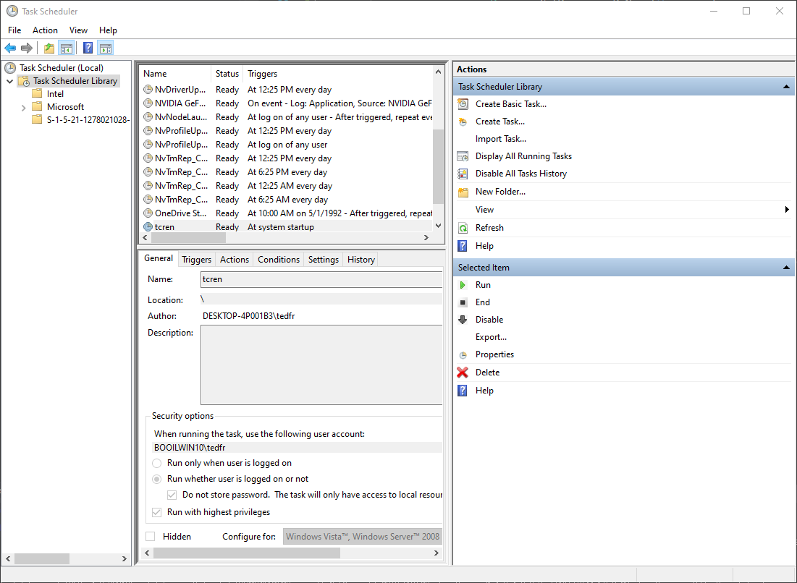

우측 pane에서 작업 생성을 클릭 합니다. 다음 창에서 옵션을 설정 할 수 있습니다.

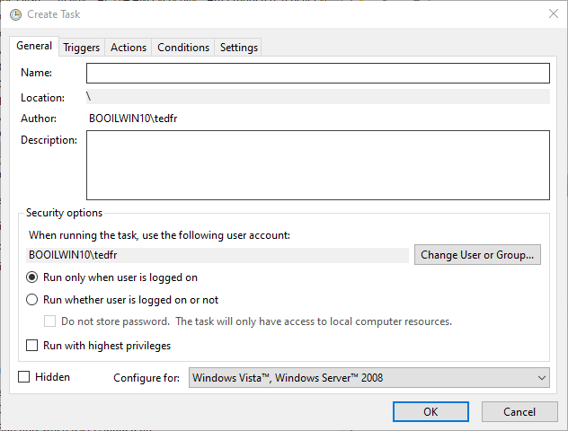

이름과 설명을 입력합니다. 로그인 중에 재부팅을 하려면  `Run only when user is logged in`을 선택하고, 아니라면 `Run  whether user is logged on or not`을 선택합니다.

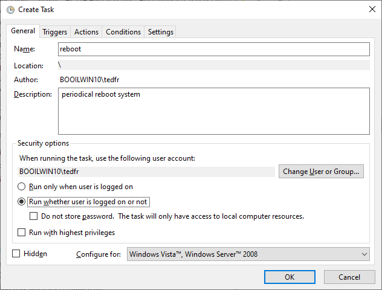

트리거에서 탭을 눌러 트리거를 생성 합니다.

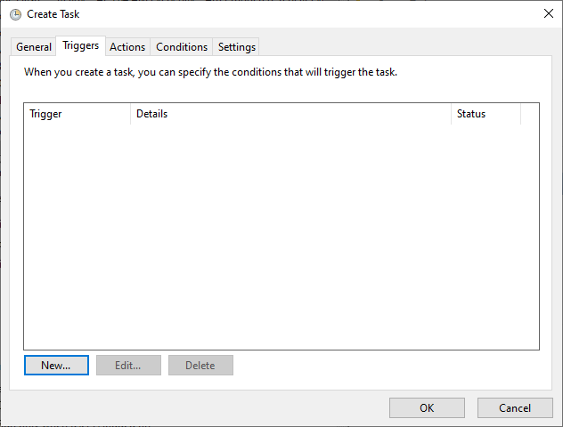

새 트리거를 클릭하여 새 트리거를 편집 합니다.

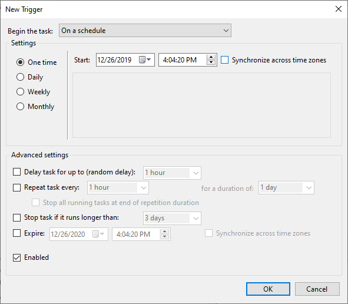

이 예제는 매일 자정에 트리거 되도록 하겠습니다.

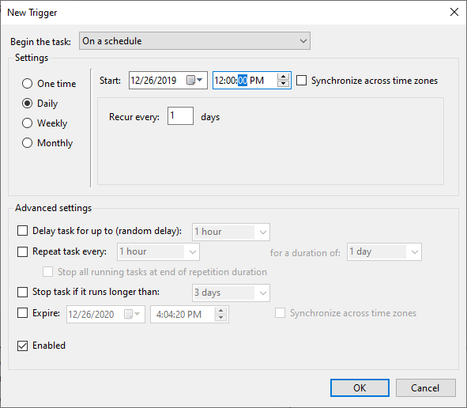

확인 버튼을 클릭하면 새 트리거가 생성 되었음을 확인 할 수 있습니다.

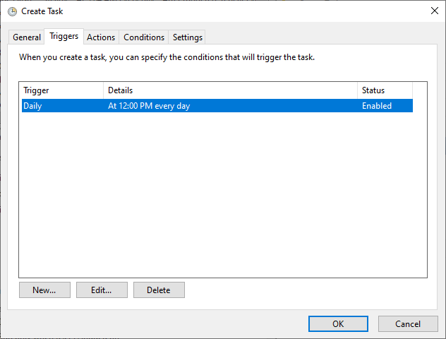

동작 탭을 눌러서 새 동작을 추가 합니다. 이 동작에 재부팅 동작을 추가 할 할 수 있습니다.

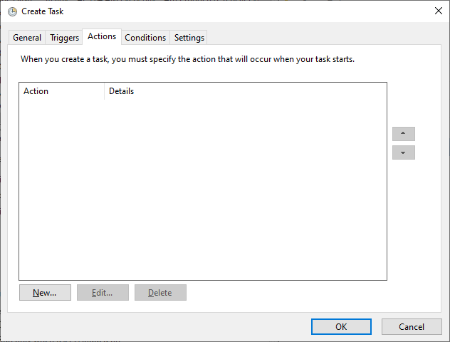

새동작 버튼을 클릭하여 동작을 추가 합니다.

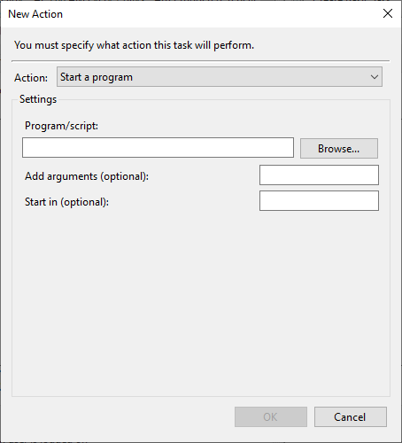

새 동작을 편집 합니다.

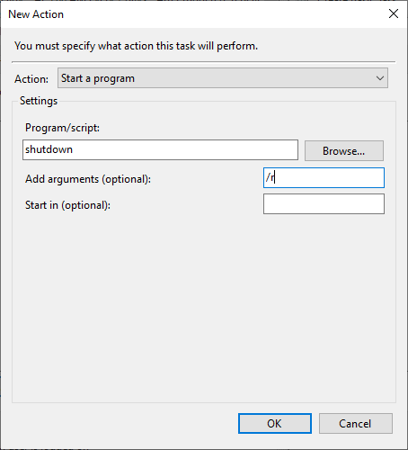

동작에는 프로그램 시작을 지정/유지합니다.

프로그램/스크립트에는 `shutdown`을 입력합니다.

추가적인 인수에는 `/r`을 입력합니다.

확인 버튼을 눌러서 동작 편집을 종료하면 동작이 추가 된것을 확인 할 수 있습니다.

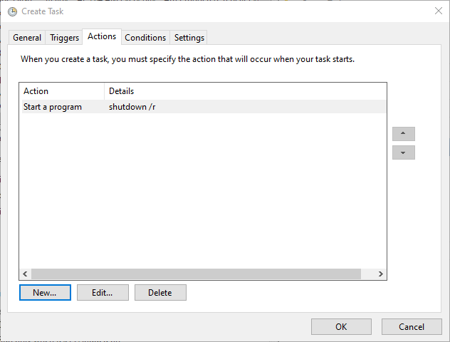

조건 탭에서 전원이나 재시도 관련 옵션을 변경할 수 있습니다.

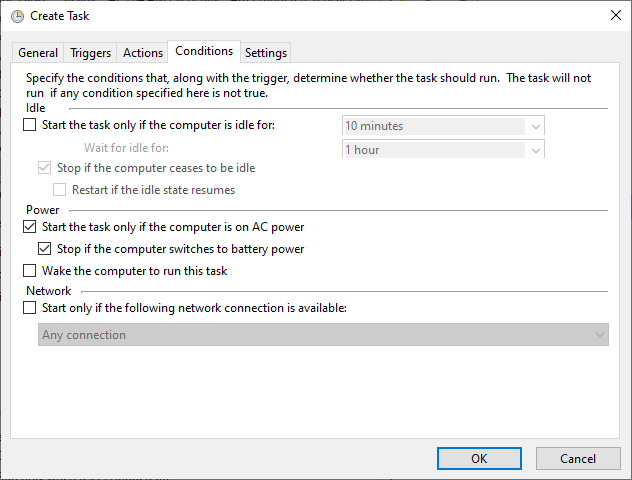

설정 탭에서 종료 옵션 등을 변경할 수 있습니다.

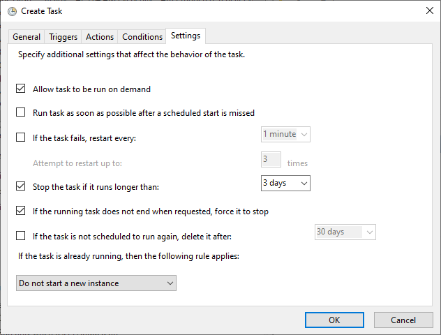

확인을 누르면 새 작업 스케줄이 추가 된것을 확인 할 수 있습니다.

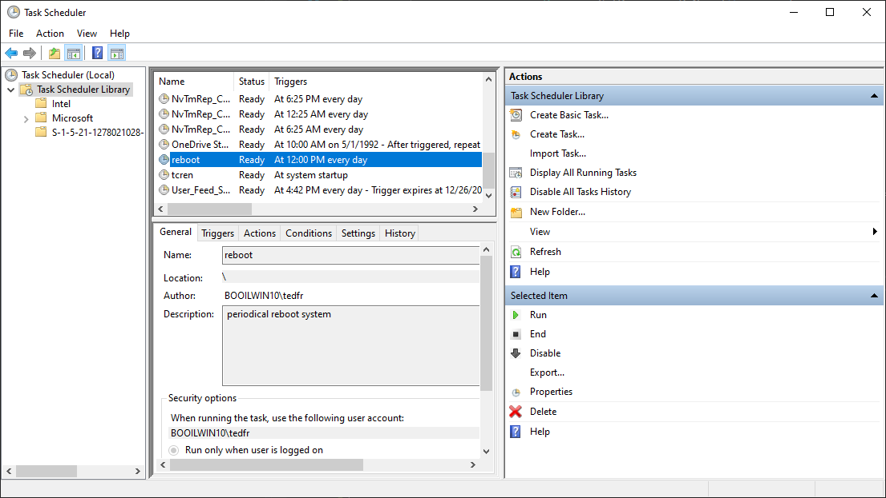

시험을 하고자 하면 해당 작업 스케줄을 선택하고, 마우스 우측 버튼을 클릭하여 나타나는 문맥 메뉴에서 실행을 선택하면 재부팅을 할 수 있습니다.

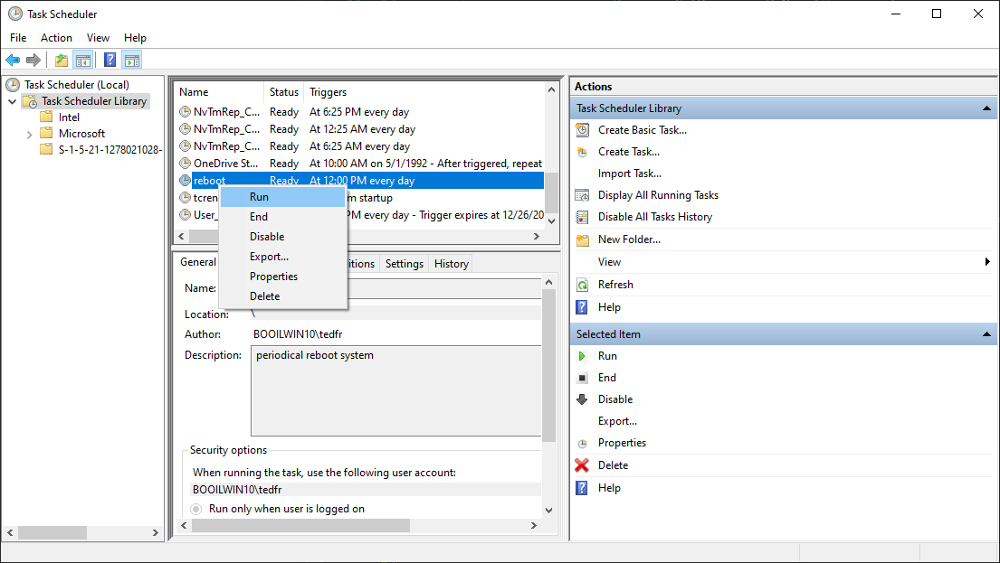

