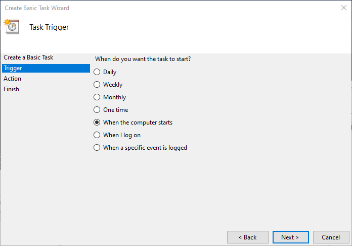

# 파워셸 스크립트를 백그라운드로 구동 하기

이 튜토리얼은 2019년 9월 8일에 실험 되었습니다.

### 실험 환경

- 운영체제: Windows 10
- 프로세서: x86 64 bits.

## 윈도우 파워셸

> **파워셸**([영어](https://ko.wikipedia.org/wiki/영어): PowerShell)은 [마이크로소프트](https://ko.wikipedia.org/wiki/마이크로소프트)가 개발한 확장 가능한 [명령 줄 인터페이스](https://ko.wikipedia.org/wiki/명령_줄_인터페이스)(CLI) [셸](https://ko.wikipedia.org/wiki/셸) 및 [스크립트 언어](https://ko.wikipedia.org/wiki/스크립트_언어)를 특징으로 하는 [명령어 인터프리터](https://ko.wikipedia.org/wiki/명령어_인터프리터)이다. 원래는 '윈도우 파워셸(Windows PowerShell)'로 윈도우 구성요소를 중심으로 개발하였으나, 파워셸 코어(PowerShell Core)를 도입하고, [2016년](https://ko.wikipedia.org/wiki/2016년) [8월 18일](https://ko.wikipedia.org/wiki/8월_18일)에 [오픈 소스](https://ko.wikipedia.org/wiki/오픈_소스)로 공개하여, 각종 운영 체제에서 쓰일 수 있게 개발하여 공개하고 있다. 윈도우 버전은 [닷넷 프레임워크](https://ko.wikipedia.org/wiki/닷넷_프레임워크) 기반으로, 그 외 운영체제 버전은 [닷넷 코어](https://ko.wikipedia.org/wiki/닷넷_코어)으로 기반으로 개발한다. 
>
> 파워셸에서 관리 작업은 일반적으로 특정 작업을 구현하는 특수화된 닷넷 [클래스](https://ko.wikipedia.org/wiki/클래스_(컴퓨터_과학))인 cmdlet(command-lets로 발음)을 통해 실행된다. 이러한 기능은 공급자를 통해 파워셸에 제공되는 [파일 시스템](https://ko.wikipedia.org/wiki/파일_시스템)이나 [레지스트리](https://ko.wikipedia.org/wiki/레지스트리)와 같은 다른 데이터 저장소의 데이터에 액세스하여 작동된다. 타 개발자는 cmdlet 및 공급자를 파워셸에 추가 할 수 있다. cmdlet은 스크립트에서 사용할 수 있으며 스크립트는 모듈로 패키지화 할 수 있게 된다. 
>
> 파워셸은 [COM](https://ko.wikipedia.org/wiki/컴포넌트_오브젝트_모델) 및 [WMI](https://ko.wikipedia.org/wiki/윈도우_관리_도구)에 대한 완전한 액세스를 제공하므로 관리자는 원격 리눅스 시스템 및 네트워크 장치를 관리 할 수 있도록 [WS-Management](https://ko.wikipedia.org/w/index.php?title=WS-Management&action=edit&redlink=1) 및 [CIM](https://ko.wikipedia.org/wiki/일반_정보_모델_(컴퓨팅))뿐만 아니라 로컬 및 원격 Windows 시스템에서 모두 관리 작업을 실행 시킬 수 있다. 파워셸은 파워셸 런타임을 다른 응용 프로그램에 포함 할 수 있는 호스팅 [API](https://ko.wikipedia.org/wiki/API)도 제공하고, 그런 다음 이러한 응용 프로그램은 파워셸 기능을 사용하여 [그래픽 인터페이스](https://ko.wikipedia.org/w/index.php?title=그래픽_인터페이스&action=edit&redlink=1)를 통해 노출 된 작업을 포함하여 특정 작업을 구현할 수 있다. 이러한 기능은 [마이크로소프트 SQL 서버](https://ko.wikipedia.org/wiki/마이크로소프트_SQL_서버) 2007 버전에서 파워셸 cmdlet 및 공급자로 관리 기능을 노출하고 필요한 cmdlet을 호출하는 파워셸 호스트로 그래픽 관리 도구를 구현하는 데 사용해왔던 것이다. 현제는 [마이크로소프트 SQL 서버](https://ko.wikipedia.org/wiki/마이크로소프트_SQL_서버) 2008을 시작으로, 각종 MS 응용 프로그램도 파워셸 cmdlet을 통해 관리 인터페이스를 제공한다. 
>
> 파워셸에는 `Get-Help cmdlet` 명령어로 통해 액세스 할 수 있는 광범위한 콘솔 기반 도움말([유닉스 셸](https://ko.wikipedia.org/wiki/유닉스_셸)의 [man page](https://ko.wikipedia.org/wiki/Man_page)와 유사)을 볼수 있다. (혹은, `Get-Help`로 온라인 전환을 통해 사례 별로 웹 도움말을 볼 수 있음.) 
>
> (위키피디아 인용)

초기의 도스는 `command.com`이라는 명령줄 실행기를 제공하였습니다. 이후 윈도우 NT와 XP에서 `cmd.exe` 제공하였고, 유닉스처럼 진보된 명령을 제공하기 위한 도구로 파워셸이 제공 됩니다.

파워셸 터미널을 실행하려면 시작 매뉴에서 `power`를 입력하면 찾을 수 있고 클릭하면 실행할 수 있습니다.


윈도우 10에서 파워셸 터미널은 아래와 같습니다.


파워셸은 `cmd.exe` 명령줄 실행기와 호환을 위해 동일한 명령도 제공하며, `ls` 등은 몇가지 명령은 유닉스와 유사한 명령을 제공하기도 합니다. 파워셸에 대한 자세한 문서들은 [이곳 공식 문서](https://docs.microsoft.com/ko-kr/powershell/scripting/overview?view=powershell-6)에서 확인 할 수 있습니다.

파워셸 스크립트는 파워셸 명령어들을 파일에 작성한 것으로 `powershell.exe`에 의해 실행됩니다.

파워셸 명령은 닷넷의 `cmdlet`에 의해 실행되며 닷넷 개체를 사용하여 보다 향상되고 강력한 스크립트를 작성 할 수도 있습니다. 파워셸이 닷넷의 기능을 사용할 수 있기 때문에 보안을 위해 스크립트 실행을 제한 합니다. 유닉스의 `sh`도 강력하기 때문에 높은 보안 수준이 필요한데, 유닉스는 해당 시스템 호출시  수퍼 유저 권한을 확인하고, 윈도우는 해당 프로그램 실행시 권한이나 인증을 확인 하는 점에 차이가 있습니다.

이 글은 파워셸 스크립트 작성법이 아닙니다. 파워셸 스크립트 작성법은 위에서 소개한 문서로도 충분하며 짧은 문서로 정리 할 수 없습니다. 이 글은 파워셸 편집 개발 환경과 서명하는 방법을 다룹니다.

다음은 파워셸 스크립트 예제인 `demo1.ps1`입니다. 파일 이름은 `demo1`이고, 파워셸 스크립트 확장자는 `.ps1`입니다. (윈도우 기본 설정이면 아래 스크립트는 실행되지 않습니다. 실행하지 마시고 코드만 읽으세요)

```powershell
Write-Host "This is powershell script in white" -fore white
Write-Host "This is powershell script in red" -fore red
Write-Host "This is powershell script in green" -fore green
Write-Host "This is powershell script in yellow" -fore yellow
Out-File -FilePath "./outlog.txt" -Append -InputObject "$(Get-Date)"
```

이 스크립트 파일은 명령 라인에

```
This is powershell script in white
This is powershell script in red
This is powershell script in green
This is powershell script in yellow
```

를 white, red, green, yellow 색상으로 표시합니다. 마지막 줄은 `demo1.ps1` 스크립트 파일이 있는 위치에 `outlog.txt`파일을 생성하고 실행된 로컬 날자를 로그로 남깁니다.

이 `demo1.ps1`파일은 이 문서와 함께 제공되며 `scripts` 폴더에서 발견할 수 있습니다.

## 파워셸 스크리트 개발 환경

이 단락은 개발 환경에 대한 내용입니다. 스크립트를 개발하지 않을 것이라면 이 단락을 건너 뛰도록 합니다.

파워셸 스크립트 개발은 `Windows PowerShell ISE`로 개발 할 수 있는데, 현재 마이크로소프트은 더 이상 `ISE` 업데이트 하지 않겠다고 하였으며, `Visual Studio Code` 통해 개발 할 것을 권장 하고 있습니다. `ISE`는 시작 메뉴에서 `ISE`를 입력하면 발견 할 수 있으며 `demo1.ps1`을 작성한 스크린 샷은 아래와 같습니다.


`ISE`는 업데이트가 중단되었고, `ISE`에서 기본 모드로 스크립트를 실행할 방법이 없으므로, 이 예제는 VSCode로 하도록 하겠습다. VSCode는 [이곳 공식 페이지](https://code.visualstudio.com/)에서 다운로드 받고 설치 할 수 있습니다. VSCode는 `ISE`와 달리 스크립트를 실행하고 디버깅 할 수 있습니다.

VSCode를 설치하고 이 튜토리얼 폴더를 VSCode로 열면 아래와 같습니다.


그리고 가장 좌측 `Extentions`에서 `Powershell` 확장을 검색하여 설치합니다.


그리고 좌측의 벌래 모양의 `Debug`  버튼을 누르고, 위쪽에서 톱니 바퀴 모양의 아이콘을 누르면, 디버깅 환경을 묻고 `PowerShell`을 선택하면 파워셸 런처가 자동으로 작성 됩니다.


VSCode에서 자동으로 작성된 파워셸 `launch.json` 파일은 아래와 같습니다.

```json
{
    // Use IntelliSense to learn about possible attributes.
    // Hover to view descriptions of existing attributes.
    // For more information, visit: https://go.microsoft.com/fwlink/?linkid=830387
    "version": "0.2.0",
    "configurations": [
        {
            "name": "PowerShell Launch Current File",
            "type": "PowerShell",
            "request": "launch",
            "script": "${file}",
            "args": [],
            "cwd": "${file}"
        },
        {
            "name": "PowerShell Launch Current File in Temporary Console",
            "type": "PowerShell",
            "request": "launch",
            "script": "${file}",
            "args": [],
            "cwd": "${file}",
            "createTemporaryIntegratedConsole": true
        },
        {
            "name": "PowerShell Launch Current File w/Args Prompt",
            "type": "PowerShell",
            "request": "launch",
            "script": "${file}",
            "args": [
                "${command:SpecifyScriptArgs}"
            ],
            "cwd": "${file}"
        },
        {
            "name": "PowerShell Attach to Host Process",
            "type": "PowerShell",
            "request": "attach"
        },
        {
            "name": "PowerShell Interactive Session",
            "type": "PowerShell",
            "request": "launch",
            "cwd": ""
        },
        {
            "name": "PowerShell Attach Interactive Session Runspace",
            "type": "PowerShell",
            "request": "attach",
            "processId": "current"
        }
    ]
}
```

우리는 가장 첫번째 런처 `PowerShell Launch Current File`를 주로 사용하게 될 것입니다.

VSCode의 좌측 Explorer 창에서 `demo1.ps1` 파일을 클릭하여 열고, Debug 창을 보면 아래와 같습니다.


좌측 위의 파란색 삼각형 아이콘 `Start Debugging` 버튼을 클릭하면 실행 할 수 있습니다. 클릭해 봅니다.

VSCode 아래의 Terminal 창을 보면 실행 결과는 아래와 같습니다.


Terminal 창에 white, red, green, yellow 색상으로 메시지들이 표시 되었습니다. 그리고 `demo1.ps1` 파일이 있는 작업 폴더에 보면 `outlog.txt `파일이 새로 생성되어 있을 것입니다. 이 파일을 열어 보면 실행된 날짜와 시간이 기록 되어 있을 것입니다. 실행할때마다 아래 줄에 시간과 날짜가 기록 될 것입니다.


우리는 이것을 셸에서 직접 실행되도록 할 것입니다.

## 스크립트 실행

`demo1.ps1`을 파워셸에서 실행해 보겠습니다.  아래에서 프롬프트의 경로 `PS >` 는 각 PC와 유저에 따라 다를 것입니다. 

```
PS > powershell demo1.ps1 엔터 
```

그러면 다음과 같은 오류 메시지가 빨간색으로 표시되며 실행되지 않습니다.

```
.\demo1.ps1 : File demo1.ps1 cannot be loaded. The file
demo1.ps1 is not digitally signed. You cannot run this script on the current system.
For more information about running scripts and setting execution policy, see about_Execution_Policies at
https:/go.microsoft.com/fwlink/?LinkID=135170.
At line:1 char:1
+ .\demo1.ps1
+ ~~~~~~~~~~~
    + CategoryInfo          : SecurityError: (:) [], PSSecurityException
    + FullyQualifiedErrorId : UnauthorizedAccess
```

`demo1.ps1`이 디지털 서명이 되어 있지 않았고, 따라서 실행 할 수 없으며, 스크립트 실행이나 실행 정책을 관련 문서를 읽어 보라는 오류 메시지 입니다.

기본적으로 윈도우는 파워셸 스크립트 실행을 허용하지 않습니다.  파워셸 스크립트를 실행하려면 운영 체제의 실행 정책을  변경하고 스크립트 파일에 디지털 서명을 넣어야 합니다. 이것은 윈도우가 보안을 이유로 다른 실행 파일에 대해서도 동일한 정책을 가지고 있기도 합니다.

## 파워쎌 실행 정책 (Execution Policy)

윈도우는 파워셸 스크립트 실행에 있어 4가지 모드를 가지고 있습니다.

- `Restricted`:
  - 윈도우를 설치하면 정해진 기본 실행 정책입니다.
  - 어떤 스크립트라도 실행을 허용하지 않습니다.
  - 대화식으로만 사용할 수 있습니다.
- `AllSigned`:
  - 스크립트 실행을 허용 합니다.
  - 신뢰 할 수 있는 게시자가 서명한 스크립트를 사용자가 승인 하고 실행할 수 있습니다.
  - 악의적인 공격자가 디지털 서명된 스크립트를 제공하고 사용자가 승인하고 실행할 위험이 있습니다.
- 프로덕션에 적합 합니다.
  
- `RemoteSigned`:
  - Outlook, IE, Messanger 같은 통신 응용 프로그램으로 다운로드한 디지털 서명된 모든 스크립트 파일을 실행할 수 있습니다.
  - 디지털 서명된 악의적인 스크립트가 다운로드 되고 경고 없이 실행 될 위험이 있습니다.
- `Unstricted`:
  - 모든 스크립트 파일과 다운로드한 스크립트 파일에 대해 경고를 표시하고, 사용자가 승인 하였을때 실행합니다.
  - 디지털 서명을 필요로 하지 않습니다.
  - 응용프로그램이 다운로드한 서명되지 않은 악성 스크립트를 실행할 위험이 있습니다.

보안 수준이 가장 높은 모드는 `Restrocted`이며, `AllSigned`, `RemoteSigned`, `Unstricted` 순서로 보안이 낮습니다. 이 자습서는  `RemoteSigned`나 `Unstricted`는 다루지 않습니다.

실행 정책에 대한 보다 추가 정보는 [공식 문서](https://docs.microsoft.com/ko-kr/powershell/module/microsoft.powershell.core/about/about_execution_policies?view=powershell-6)에서 확인 할 수 있습니다.

## 스크립트 서명 도구

이 단락은 파워셸 스크립트에 서명하는 방법을 다룹니다.

스크립트에 디지털 서명을 추가하려면 코드 서명 인증서로 서명해야 합니다. 디지털 서명 방법에는 2가지가 있습니다.

- Verisign 같은 인증 기관의 인증서 사용.
  - 다른 외부 컴퓨터에서도 실행 할 수 있습니다.
  - 인증 기관에 비용을 지불해야 합니다. 
- 자체 서명된 인증서 사용.
  - 자체 컴퓨터를 인증 기관으로 하고 인증서를 발행할 수 있습니다.
  - 내부적으로 사용할 경우 적합 합니다.
  - 인증서가 즉시 발행 됩니다.
  - 무료 입니다.
  - 실행할 컴퓨터에 인증서를 복사해 넣어야 하므로 불편합니다.

이 튜토리얼은 자체 서명된 인증서를 사용하는 방법을 다룹니다.

자체 서명 된 인증서를 작성하려면 `makecert.exe` 프로그램이 필요한데 이 프로그램은 운영체제나 SDK 버전에 따라 다릅니다.  윈도우 10에서 Visual Studio가 설치되어 있다면 `C:\Program Files (x86)\Windows Kits\8.1\bin\x64` 에 있습니다.

## makecert.exe 경로를 PATH에 추가 (선택사항)

`makecert.exe`를 편리하게 실행하려면 이 실행 파일이 있는 경로를 `PATH` 환경 변수에 추가 할 수 있습니다.

시작 메뉴에서 `edit env`를 입력 하면 `Edit the system environment variables` 앱을 실행하고 경로를 추가 할 수 있습니다.


`PATH` 환경 변수는 유저 변수에도 있고, 시스템 변수에도 있습니다. 저는 유저 변수에 추가해 보겠습니다. (시스템 변수에 추가하려면 `Edit the system environment variables`를 관리자 권한으로 실행해야 합니다.)


`New` 버튼을 눌러서 경로를 추가 할 수 있습니다. 추가하면 아래와 같습니다.


이제 새 `cmd.exe`나 `powershell.exe` 명령어줄 실행기에서  `makecert` 앱을 실행할 수 있습니다.

## 인증서 보기

먼저 `mmc.exe`를 실행 합니다. 시작 메뉴에서 `mmc`를 입력하면 검색 하고 실행 할 수 있습니다.


그리고  `File`메뉴에서 `Add Remove Snap-in`를 실행합니다. 그러면 다음과 같습니다.


그리고, 좌측의 `Available snap-ins:`에서 `Certificates`를 클릭하여 선택합니다.


그리고 대화창 중간의 `Add>` 버튼을 클릭하여 우측의 `Selected snap-ins`에 추가 합니다. 그러면 `My user account`, `Service account`, `Computer account` 중에서 선택하는데 `My user account`를 선택하고 `Finish` 버튼을 클릭합니다.


그러면 현재 사용자로 `Certificates`가 활성화 되어 있습니다.


## 자체 서명 인증 설정

### 로컬 인증 기관 만들기

윈도우 10에서 실험 결과 자체 서명 인증 설정은 관리자 권한으로 해야 된다는 것을 알았습니다. 파워셸을 관리자 권한으로 실행합니다.

명령줄 실행기에서 다음을 실행합니다. 그러면 이 컴퓨터에 대한 로컬 인증 기관(local certificate authority)가 만들어 집니다.

```powershell
PS > makecert -n "CN=PowerShell Local Certificate Root" -a sha1 -eku 1.3.6.1.5.5.7.3.3 -r -sv root.pvk root.cer -ss Root -sr localMachine
```

먼저 개인키(Private Key) 를 묻는데 비밀번호를 2회 입력합니다. (기록: 저는 연습용 비밀번호를 `pass`로 했습니다.)


그러면 다시 비밀번호를 묻습니다. 앞에서 입력한 비밀번호를 입력헤 줍니다.


관리자 권한으로 실행하지 않으면

```
Error: Save encoded certificate to store failed => 0x5 (5)
Failed
```

오류가 표시되며 저장되지 않습니다.

여기까지 성공적으로 진행하면 해당 폴더에 `root.cer`과 `root.pvk` 파일이 생성된 것을 확인 할 수 있습니다.

```powershell
PS > ls root.*

    Directory: C:...

Mode                LastWriteTime         Length Name
----                -------------         ------ ----
-a----        8/20/2019  12:25 PM            852 root.cer
-a----        8/20/2019  12:25 PM           1212 root.pvk

PS >       
```

그리고 `mmc.exe`를 실행하고


좌측 창에서 `Certificates - Current User`를 선택하고,


중앙 창에서 `Trusted Root Certification Authorities`를 선택하고,


다시 중앙 창에서 `Certificates`를 선택하고


인증서 이름이 정렬되어 있다는 점을 고려하여 스크롤하여 `PowerShell Local Certificate Root`를 찾아보면 인증서를 발견 할 수 있습니다. 만일 발급 명령을 여러번 하였다면 여러개의 인증서가 있을 것입니다.


잘못되어 다시 만드려면 `root.cer`과 `root.pvk`를 삭제하시면 됩니다.

이 단락은 로컬 인증 기관(local certificate authority)을 만들었습니다.

### 개인 인증서 (personal certificate) 발행

이전 단락에서는 로컬 인증 기관을 생성하였습니다. 이제 개인 인증서를 만들어 보겠습니다. 관리자(administrator) 계정의 파워셸에 다음을 입력하여 인증서를 만듭니다.

```powershell
makecert -pe -n "CN=PowerShell User" -ss MY -a sha1 -eku 1.3.6.1.5.5.7.3.3 -iv root.pvk -ic root.cer
```

이 명령에는 `-pe`과 `-ss` 옵션이 있고 인증서 이름이 다릅니다.

다시 `mmc.exe`에서 인증서가 발행되었는지 확인해 보겠습니다. 이번에는 좌측 창에서 `Personal`을 선택합니다.


그러면 개인용  `Certificates`가 보입니다. 만일 `Certficates`가 보이지 않는다면 `F5`를 눌러서 한번 리프레시 해주면 나타날 것입니다.


좌측 창에서 `Personal`의 `Certificates`를 선택하면 `PowerShell User` 인증서가 발급 되었다는 것을 확인 할 수 있습니다.


이제 인증서가 올바르게 생성되었는지 검증하겠습니다.

```powershell
PS > Get-ChildItem cert:\CurrentUser\My -codesign
```

올바르게 되었다면 아래와 같은 메시지를 얻을 것입니다.

```
   PSParentPath: Microsoft.PowerShell.Security\Certificate::CurrentUser\My

Thumbprint                                Subject
----------                                -------
A3DF154FF19D888F5069F7981BDDF288DB6EF184  CN=PowerShell User
```

작업 디렉토리에서 두 개의 임시 파일 `root.pvk`와 `root.cer`를 삭제할 수 있습니다. 인증서 정보는 다른 인증서와 함께 `C:\Documents and Settings\[username]\Application  Data\Microsoft\SystemCertificates\My\`에 저장됩니다.

## 파워셸 스크립트에 서명 하기

파워셸 스크립트가 실행되도록 하려면, 먼저 파워셸의 실행 정책 (Execution Policy)를 변경합니다. 실행 가능한 정책중 가장 강력한 보안 정책을 가진 `AllSigned`로 실행 정책을 변경 하겠습니다.

```powershell
PS > Set-ExecutionPolicy AllSigned
```

그러면 경고 메시지와 함께 실행 정책 변경 허용을 물을 것입니다.

```
Execution Policy Change
The execution policy helps protect you from scripts that you do not trust. Changing the execution policy might expose you to the security
risks described in the about_Execution_Policies help topic at https:/go.microsoft.com/fwlink/?LinkID=135170. Do you want to change the
execution policy?
[Y] Yes  [A] Yes to All  [N] No  [L] No to All  [S] Suspend  [?] Help (default is "N"):         
```

프러덕션에서는 지속적으로 스크립트 실행을 허용해야 하므로 `A`를 선택합니다.

이제 스크립트를 실행해 보겠습니다.

```powershell
PS > ./demo1.ps1
```

그러면 에러 메시지를 표시하면서 실행되지 않습니다.

```
.\demo1.ps1 : File demo1.ps1 cannot be loaded. The file demo1.ps1 is not
digitally signed. You cannot run this script on the current system. For more information about running scripts and setting execution policy,
see about_Execution_Policies at https:/go.microsoft.com/fwlink/?LinkID=135170.
At line:1 char:1
+ .\demo1.ps1
+ ~~~~~~~~~~~
    + CategoryInfo          : SecurityError: (:) [], PSSecurityException
    + FullyQualifiedErrorId : UnauthorizedAccess
```

스크립트 실행을 허용 하였지만 `demo1.ps1`에 디지털 서명이 되지 않았다며 실행이 되지 않는다는 것을 확인 할 수 있습니다.

실행을 위해 `demo1.ps1` 스크립트에 디지털 서명을 해보겠습니다.

```powershell
PS > Set-AuthenticodeSignature .\demo1.ps1 @(Get-ChildItem cert:\CurrentUser\My -codesign)[0]                                                  
```

서명에 성공하면 아래와 같은 메시지를 표시 합니다.

```powershell

    Directory: 

SignerCertificate                         Status                                            Path
-----------------                         ------                                            ----
A3DF154FF19D888F5069F7981BDDF288DB6EF184  Valid                                             demo1.ps1
```

`demo1.ps1` 파일을 열어보면 아래에 서명이 추가 되어 있는 것을 확인 할 수 있습니다.

```powershell
Write-Host "This is powershell script in white" -fore white
Write-Host "This is powershell script in red" -fore red
Write-Host "This is powershell script in green" -fore green
Write-Host "This is powershell script in yellow" -fore yellow
# SIG # Begin signature block
# MIIFuQYJKoZIhvcNAQcCoIIFqjCCBaYCAQExCzAJBgUrDgMCGgUAMGkGCisGAQQB
# gjcCAQSgWzBZMDQGCisGAQQBgjcCAR4wJgIDAQAABBAfzDtgWUsITrck0sYpfvNR
# AgEAAgEAAgEAAgEAAgEAMCEwCQYFKw4DAhoFAAQUWEQKtGciNAdoeWtWk1EWWzxN
# AQ+gggNCMIIDPjCCAiqgAwIBAgIQeMsxrFaVsY9F8ARc+BUhCTAJBgUrDgMCHQUA
#				...		중략 		...
# sYgAZqh/AfUPSA82RJcwrwdYV6m1sY44Ju2snjK0QAccNFMY+kYP26v4SU5aplFN
# r1IRfKfdg6YGK6S23WBHkMwXTi/zbns3C21yMYZiSzkDC+AECGoSyc9vaYat7Ecg
# 6FfscW70AzaHDC+aZc7tu5qXKkxVsTNba4VRY0Q=
# SIG # End signature block
```

이제 스크립트 `demo1.ps1`을 실행할 수 있습니다.

```
PS > .\demo1.ps1
```

디지털 서명을 했음에도 불구하고 실행 허용을 확인합니다.

```
Do you want to run software from this untrusted publisher?
File demo1.ps1 is published by CN=PowerShell User and is not trusted on your system. Only run scripts from trusted publishers.
[V] Never run  [D] Do not run  [R] Run once  [A] Always run  [?] Help (default is "D"):                                    
```

프러덕션이므로 사용자의 개입 없이 실행 되어야 하므로 `A`를 선택하여 실행합니다. 실행 결과는 다음과 같습니다.

```
This is powershell script in white
This is powershell script in red
This is powershell script in green
This is powershell script in yellow
```

그리고 `A`를 선택 하였으므로 `mmc.exe`를 확인해 보면 `Trusted Publishers`에 `PowerShell User`가 등록 되었다는 것을 확인 할 수 있습니다.


확인을 위해 스크립트를 다시 한번 실행해 보겠습니다.

```
PS > .\demo1.ps1
```

이번에는 허용을 묻지 않고 실행 됩니다. 이제 부팅시 사용자의 개입 없이 이 스크립트를 실행 할 수 있게 되었습니다.

```
This is powershell script in white
This is powershell script in red
This is powershell script in green
This is powershell script in yellow
```

## 디지털 서명된 스크립트를 다른 컴퓨터에서 실행

작업 컴퓨터에서 서명된 스크립트는 다른 컴퓨터에서 서명의 유효성을 검증할 수 없습니다. 작업 컴퓨터에서 서명된 스크립트를 다른 컴퓨터에서 실행하려면 작업 컴퓨터의 인증서를 내보내고(export), 다른 컴퓨터에서 인증서를 가져와서(import) 실행하고, 첫 실행 허용을 묻는 프롬프트를 방지할 수도 있습니다.

### 루트 인증 기관 (Trusted Root Certification Authority) 인증서 내보내기

`mmc.exe`에서 루트 인증 기관 인증서를 내보내도록 하겠습니다. 먼저 좌측 창에서 `/Console Root/Trusted Root Certification Authorities/Certificates`를 선택하고 중앙창에서 `PowerShell Local Certificate Root`를 선택하여 내보냅니다.


그리고 `Next` 버튼을 누릅니다.


`DER encoded binary X.509 (.CER)` 포맷을 그대로 선택하고 ` Next` 버튼을 누릅니다.


 파일을 저장할 경로와 이름을 물을 것입니다. 원하는 경로와 이름으로 인증서를 저장합니다.


저장 경로와 파일 이름을 지정하면 확인을 합니다. `Finish`를 눌러서 저장합니다.


저장에 성공하면 메시지 박스가 표시 됩니다.


필자는 튜토리얼 작업 폴더에 `tutorial_authority`라는 이름을 주어 저장하였습니다.

### 신뢰할 수 있는 발급자 (Trusted Publisher) 인증서 내보내기

이것은 다른 컴퓨터에서 첫 실행시 프롬프트를 방지하기 위한 인증서 교환입니다. 첫 프롬프트를 표시하고 옵션을 선택하려면 이 절차는 하지 않아도 됩니다. 

`mmc.exe`을 실행하고 좌측 창에서 `Colsone Root/Trusted Publishers/Certificates`를 선택하고, 중앙 창에서 `PowerShell User`를 선택하여 인증서를 내보냅니다.


필자는 튜토리얼 작업 폴더에 `tutorial_user` 로 인증서를 저장하였습니다.

## 루트 인증 기관 인증서 가져오기

먼저 루트 인증 기관 인증서를 가져 오겠습니다.

`mmc.exe`를 실행하고, 좌측창에서 `Console Root/Trusted Root Certification Authorities`를 선택하고 마우스 우측 버튼을 클릭하고, `All Tasks/Import`를 선택합니다.


그러면 인증서 가져오기 마법사가 실행 됩니다. `Next` 버튼을 클릭합니다.


`Browse...` 버튼을 클릭하여 루트 인증 기관 인증서를 가져오고 `Next`버튼을 클릭 합니다. 


이 인증서는 루트 인증 기관 인증서이므로 `Trusted Root Certification Authorities`에 저장하도록 기본 선택을 그대로 두고 `Next` 버튼을 클릭합니다.


마지막으로 가져오기 정보들이 표시 될 것입니다. `Finish` 버튼을 눌러서 가져오기를 마법사를 완료 합니다.


그러면 인증서를 설치 할 것인가 물을 것입니다.


설치 하겠다고 `Yes`를 누릅니다. 가져오기에 성공하면 메시지 박스가 표시 됩니다.


### 신뢰할 수 있는 발급자 (Trusted Publisher) 인증서 가져오기

이 단락은 스크립트 실행시 프롬프트를 선택할 것이냐에 따라 옵션입니다.

`mmc.exe`를 실행하고 좌측창에서 `Console Root/Trusted Publishers`를 선택하고 마우스 오른쪽 버튼을 눌러 메뉴에서 `All Tasks/Import`를 클릭하여 저장해둔 인증서를 가져 옵니다.


## 가져온 스크리트 실행하기

다른 컴퓨터에 스크립트 `demo1.ps1`과 인증서들을 가져왔으면 실행 할 수 있습니다.

## 컴퓨터 시작시 스크립트 실행하기

윈도우에서 사용자가 로그인 하기 전에 스크립트를 실행하려면 윈도우 서비스로 등록해야 합니다. 윈도우 시작 메뉴에서 `services`를 입력하면 서비스 앱으로 이것을 감시하고 제어 할 수 있습니다.


그런데, 서비스 응용 프로그램은 일반 응용 프로그램과 구조가 다릅니다. 따라서, 직접 파워셸 스크립트는 서비스로 실행 할 수 없습니다. 파워셸이 .NET cmdlet을 사용하므로 .NET 서비스 응용프로그램을 만들어서 파워셸 스크립트를 실행 할 수 있지만, 이중구조로 복잡해 지므로 이 방법은 제외 하겠습니다.

윈도우는 `task scheduler`를 통해 사용자가 로그인 하지 않아도 백그라운드로 스크립트를 실행할 방법을 제공합니다. 시작 메뉴에서 `task scheduler`를 입력하면 `Task Scheduler`를 발견할 수 있고 실행 할 수 있습니다. 작업 스케줄러를 실행하면 아래와 같습니다.


우측창에서 `Create Basic Task...`를 선택하여 작업을 생성합니다. 한참 기다리면 대화 상자가 나타납니다.


작업 스케줄러의 이름과 설명을 추가하고 `Next` 버튼을 클릭합니다.


`작업 트리거`에서 `컴퓨터가 시작시`를 선택 하고 `Next`  버튼을 클릭합니다.



`동작`에서 `Start a program`을 선택하고 `Next` 버튼을 클릭합니다.


`Start a program`에서 스크립트 파일과 옵션을 지정합니다. 먼저 우리는 테스트를 위해 포그라운드로 실행하도록 할 것 입니다.

`Program/script` 에는 `powershell.exe`를 지정합니다.

`Add arguments (optional)`에는 `-NoExit -NoLogo -file 절대경로/demo1.ps1`을 지정합니다. 여기서 `-file` 인자는 가장 마지막에 와야 합니다. 다른 인자가 뒤에오면 `-file`인자로 해석 되어 제대로 되지 않습니다. 이 문제로 하루를 허비 했었습니다.

`Start in (optional)`에는 `demo1.ps1`가 위치한 폴더의 절대 경로를 지정합니다. 

그리고 `Next` 버튼을 클릭 합니다.


마지막으로 작업 스케줄러에 설정된 매개변수가 표시됩니다. `Finish`버튼을 클릭합니다.


아직 완료 되지 않았습니다. 계속하여 `작업 스케줄러`에서 우리가 만든 `demo1 runner`를 찾아서


더블 클릭 합니다. 옵션이 아래와 같을 것입니다.


`보안 옵션`에서 `Run whether user is logged on or not`을 선택하고, 로컬 컴퓨터에서만 작업 할 것이기 때문에 `Don not store password`를 체크합니다. 그리고 `Run with highest privileges`를 체크 합니다. 그리고 운영체제 옵션을 변경합니다. 이 옵션 변경은 아래와 같습니다.


그리고 `Condition` 탭을 눌러서 `Start the task only if the computer is on AC power`를 해제하여 전원에 관계 없이 실행 하도록 합니다. 이 변경 사항은 아래와 같습니다.


그리고 `Settings` 탭을 클릭하고, `Stop the task if it runs longer than`을 해제하여 계속 구동 되도록 합니다. 변경 사항은 아래와 같습니다.


재부팅을 해보면 파워셸 스크립트가 실행되어 있을 것입니다.

## 참조

- [위키피디아](https://ko.wikipedia.org/wiki/%EC%9C%88%EB%8F%84%EC%9A%B0_%ED%8C%8C%EC%9B%8C%EC%85%B8)
- [Signing Powershell Scripts](https://www.hanselman.com/blog/SigningPowerShellScripts.aspx)
- [마이크로소프트 파워셸](https://docs.microsoft.com/ko-kr/powershell/scripting/overview?view=powershell-6)