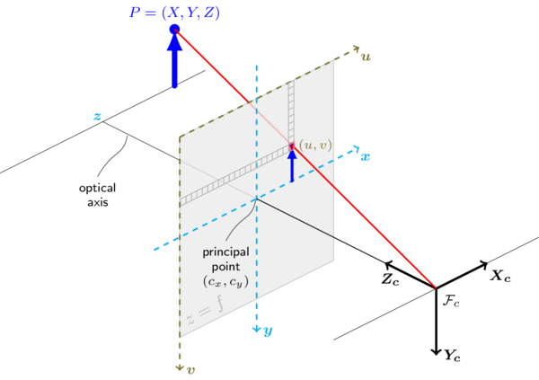

# Camera Calibration and 3D Reconstruction

## 2D camera calibration

The functions in this section use a so-called pinhole camera model. In this model, a scene view is formed by projecting 3D points into the image plane using a perspective transformation.
$$
s \; \mathbf m'

=

\mathbf A 

\begin{bmatrix}
\mathbf R | \mathbf t
\end{bmatrix}

\mathbf M'
$$
or
$$
s

\begin{bmatrix}
u \\ v \\ 1
\end{bmatrix}

= 

\begin{bmatrix}
f_{x} & 0 & c_{x} \\
0 & f_{y} & c_{y} \\
0 & 0 & 1
\end{bmatrix}

\begin{bmatrix}
r_{11} & r_{12} & r_{13} & t_1  \\
r_{21} & r_{22} & r_{23} & t_2  \\
r_{31} & r_{32} & r_{33} & t_3
\end{bmatrix}

\begin{bmatrix}
X \\ Y \\ Z \\ 1
\end{bmatrix}
$$
where:

- $(X, Y, Z)$ are the coordinates of a 3D point in the world coordinate space
- $(u, v)$ are the coordinates of the projection point in pixels
- $\mathbf A = \begin{bmatrix}
  f_{x} & 0 & c_{x} \\
  0 & f_{y} & c_{y} \\
  0 & 0 & 1
  \end{bmatrix}$ is a camera matrix, or a matrix of intrinsic parameters
- $(c_x, c_y)$ is a principal point that is usually at the image center
- $f_x, f_y$ are the focal lengths expressed in pixel units.

Thus, if an image from the camera is scaled by a factor, all of these parameters should be scaled (multiplied/divided, respectively) by the same factor. The matrix of intrinsic parameters does not depend on the scene viewed. So, once estimated, it can be re-used as long as the focal length is fixed (in case of zoom lens). The joint rotation-translation matrix $\begin{bmatrix} \mathbf R | \mathbf t \end{bmatrix}$ is called a matrix of extrinsic parameters. It is used to describe the camera motion around a static scene, or vice versa, rigid motion of an object in front of a still camera. That is, $\begin{bmatrix} \mathbf R | \mathbf t \end{bmatrix}$ translates coordinates of a point $(X, Y, Z)$ to a coordinate system, fixed with respect to the camera. The transformation above is equivalent to the following (when $z \ne 0$):
$$
\begin{align*}
\begin{bmatrix} x \\ y \\ z \end{bmatrix}

&=

\mathbf R

\begin{bmatrix} X \\ Y \\ Z \end{bmatrix}

+

\mathbf t

\\

x' &= x/z

\\

y' &= y/z

\\

u &= f_x * x' + c_x

\\

v &= f_y * y' + c_y
\end{align*}
$$
The following figure illustrates the pinhole camera model.

Real lenses usually have some distortion, mostly radial distortion and slight tangential distortion. So, the above model is extended as:

$$
\begin{align*}
\begin{bmatrix} x \\ y \\ z \end{bmatrix}

&=

\mathbf R

\begin{bmatrix} X \\ Y \\ Z \end{bmatrix}

+

\mathbf t

\\

x' &= x/z

\\

y' &= y/z

\\

x'' &= x' 
\frac
{1+k_1r^2+k_2r^4+k_3r^6}
{1+k_4r^2+k_5r^4+k_6r^6}
+
2p_1x'y' + p_2(r^2 + 2x'^2)

\\

y'' &= y' 
\frac
{1+k_1r^2+k_2r^4+k_3r^6}
{1+k_4r^2+k_5r^4+k_6r^6}
+
p_2(r^2 + 2x'^2) + 2p_1x'y' 

\\

u &= f_x * x'' + c_x

\\

v &= f_y * y'' + c_y
\end{align*}
$$
$k_1, k_2, k_3, k_4, k_5,$ and $k_6$ are radial distortion coefficients. $p_1$ and $p_2$ are tangential distortion coefficients.
Higher-order coefficients are not considered in OpenCV.

The next figure shows two common types of radial distortion: barrel distortion (typically $k_1 > 0$) and pincushion distortion (typically $k_1 < 0$).

In some cases the image sensor may be tilted in order to focus an oblique plane in front of the camera (Scheimpfug condition). This can be useful for particle image velocimetry (PIV) or triangulation with a 
laser fan. The tilt causes a perspective distortion of $x′$′ and $y′′$. This distortion can be modelled in the following way,

where the matrix $R(τ_x,τ_y)$ is defined by two rotations with angular parameter τx and τy, respectively,

In the functions below the coefficients are passed or returned as
$$
(
k_1, k_2, p_1, p_2 [, k_3 [, k_4, k_5, k_6 [, s_1, s_2, s_3, s_4 [, \tau_x, \tau_y]]]]
)
$$
vector. That is, if the vector contains four elements, it means that $k_3=0$ . The distortion coefficients do not depend on the scene viewed. Thus, they also belong to the intrinsic camera parameters. And they remain the same regardless of the captured image resolution. If, for example, a camera has been calibrated on images of $320 \times 240$ resolution, absolutely the same distortion coefficients can be used for $640 \times 480$ images from the same camera while $f_x, f_y, c_x$ and $c_y$ need to be scaled appropriately.

The functions below use the above model to do the following:

- Project 3D points to the image plane given intrinsic and extrinsic parameters.
- Compute extrinsic parameters given intrinsic parameters, a few 3D points, and their projections.
- Estimate intrinsic and extrinsic camera parameters from several  views of a known calibration pattern (every view is described by several  3D-2D point correspondences).
- Estimate the relative position and orientation of the stereo camera “heads” and compute the *rectification* transformation that makes the camera optical axes parallel.

> Note
>
> - A calibration sample for 3 cameras in horizontal position can be found at opencv_source_code/samples/cpp/3calibration.cpp
> - A calibration sample based on a sequence of images can be found at opencv_source_code/samples/cpp/calibration.cpp
> - A calibration sample in order to do 3D reconstruction can be found at opencv_source_code/samples/cpp/build3dmodel.cpp
> - A calibration sample of an artificially generated camera and  chessboard patterns can be found at  opencv_source_code/samples/cpp/calibration_artificial.cpp
> - A calibration example on stereo calibration can be found at opencv_source_code/samples/cpp/stereo_calib.cpp
> - A calibration example on stereo matching can be found at opencv_source_code/samples/cpp/stereo_match.cpp
> - (Python) A camera calibration sample can be found at opencv_source_code/samples/python2/calibrate.py

## Stereo Camera

epipolar contraint:
$$
\mathbf p'^\top \mathbf E \mathbf p
$$

$$
\begin{bmatrix}
u' & v' & 1
\end{bmatrix}

\mathbf E

\begin{bmatrix}
u \\ v \\ 1
\end{bmatrix}
$$

Here:

- $\mathbf E$ is  Essential Matrix of $3 \times 3$.

The reason why Essential Matrix always exists:
$$
\mathbf P' = \mathbf R \mathbf P + \mathbf t
$$
Here:

- $\mathbf R$ is  $3 \times 3$ rotation matrix between two cameras.
- $\mathbf t$ is $3 \times 1$ translation vector between two cameras.
- $\mathbf P$ is the three-dimensional coordinates of the point in outer space in the A camera coordinate system.

- $\mathbf P'$ is the three-dimensional coordinates of the point in outer space in the B camera coordinate system.

$$
\begin{bmatrix}
\end{bmatrix}
$$

If we take the essential matrix $\mathbf E$ as
$$
\mathbf E = [\mathbf t]_\times \mathbf R
$$

## OpenCV 관련 함수

##### calibrateCamera

Finds the camera intrinsic and extrinsic parameters from several views of a calibration pattern.

##### composeRT

Combines two rotation-and-shift transformations.

##### [findFundamentalMat](https://docs.opencv.org/3.4/d9/d0c/group__calib3d.html#gae420abc34eaa03d0c6a67359609d8429)

Calculates a fundamental matrix from the corresponding points in two images.

##### [findEssentialMat](https://docs.opencv.org/3.4/d9/d0c/group__calib3d.html#ga13f7e34de8fa516a686a56af1196247f)

Calculates an essential matrix from the corresponding points in two images.

##### [decomposeEssentialMat](https://docs.opencv.org/3.4/d9/d0c/group__calib3d.html#ga54a2f5b3f8aeaf6c76d4a31dece85d5d)

Decompose an essential matrix to possible rotations and translation.

Essential Matrix $\mathbf E$를 입력 받아, 가능한 4세트의, 회전 행렬 $\mathbf R_1$ 과 $\mathbf R_2$ 평행이동행렬 $\mathbf t$를 반환 합니다.

##### [recoverPose](https://docs.opencv.org/3.4/d9/d0c/group__calib3d.html#gadb7d2dfcc184c1d2f496d8639f4371c0)

Recover relative camera rotation and translation from an estimated essential matrix and the corresponding points in two images, using cheirality check. Returns the number of inliers which pass the check. 

입력된 essential matrix와 두 이미지에서의 매칭쌍으로부터 두 이미지의 상대적인 [R|t] 관계를 추출해 줌.  `decomposeEssentialMat`이 [R|t]를 유일하게 결정하지 못하고 해를 여러개 반환하는 반면,  `recoverPose`는 부가적인 기하학적 조건 검사를 통해 [R|t]를 유일하게 결정하여 반환해 줌.

##### stereoCalibrate

Calibrates the stereo camera.

## 참조

- [Camera Calibration and 3D Reconstruction](https://docs.opencv.org/2.4/modules/calib3d/doc/camera_calibration_and_3d_reconstruction.html)

- [Camera Calibration and 3D Reconstruction](https://docs.opencv.org/3.4/d9/d0c/group__calib3d.html)

- [영상 Geometry #7\] Epipolar Geometry](https://darkpgmr.tistory.com/83)