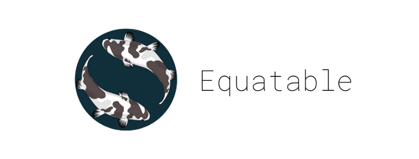

원문: [Dart Equatable Package: Simplify Equality Comparisons](https://medium.com/flutter-community/dart-equatable-package-simplify-equality-comparisons-1a96a3fc4864)

# Dart Equatable Package: Simplify Equality Comparisons

[](https://medium.com/@felangelov?source=post_page---------------------------)

[Felix Angelov](https://medium.com/@felangelov?source=post_page---------------------------)

[Jan 8](https://medium.com/flutter-community/dart-equatable-package-simplify-equality-comparisons-1a96a3fc4864?source=post_page---------------------------)



Dart를 작성했다면 같은 클래스의 다른 인스턴스를 비교하기 위해 `==`연산자와 `hashCode`를 오버라이드해야 할 가능성이 있습니다.

다음과 같이 보이는`Person` 클래스가 있다고 가정 해보십시오 :

```dart
class Person {
  final String name;
  final int age;
  
  const Person({this.name, this.age});
}
```

응용 프로그램을 빌드 할 때 `Person`의 다른 인스턴스를 테스트 기대와 같은 평등 또는'별개 '와 같은'스트림 '변환과 비교할 수있는 많은 시나리오가 있습니다.

```dart
void main() {
 final Person bob = Person(name: "Bob", age: 40);
 print(bob == Person(name: "Bob", age: 40)); // false
}
```

이것은 기본적으로 두 개체가 정확히 같은 개체 인 경우 두 개체가 동일하기 때문입니다 ([Dart Documentation](https://www.dartlang.org/guides/language/effective-dart/design?source=post_page---------------------------#equality)). 위의 발췌 문장에서 `bob`은 다른 hashCode와 identity를 가진 다른 객체입니다. 그래서 `bob`과 `Person`의 새로운 인스턴스를 비교할 때 다트는 그들을 같지 않은 것으로 취급 할 것입니다.

`Person`의 다른 인스턴스를 비교할 수 있으려면 `==`연산자 (따라서`hashCode`)를 오버라이드 해야 합니다. 결과적으로 우리의 `Person` 클래스는 다음과 같이 보일 것입니다:

```dart
class Person {
 final String name;
 final int age;
  
 const Person({this.name, this.age});
  
 @override
 bool operator ==(Object other) =>
  identical(this, other) ||
  other is Person &&
  runtimeType == other.runtimeType &&
  name == other.name &&
  age == other.age;

 @override
 int get hashCode => name.hashCode ^ age.hashCode;
}
```

이제 다음 코드를 다시 실행하면

```dart
print(bob == Person(name: “Bob”, age: 40)); // true
```

우리는`Person`의 다른 인스턴스를 비교할 수 있습니다.

복잡한 클래스를 다룰 때 이것이 얼마나 빨리 고통 스러울 지 이미 알 수 있습니다. 이것은 [Equatable](https://pub.dartlang.org/packages/equatable?source=post_page---------------------------)입니다. -) 들어 온다! 🎉

---

[Equatable](https://pub.dartlang.org/packages/equatable?source=post_page---------------------------) overrides `==` and `hashCode` for you so you don’t have to waste your time writing lots of boilerplate code.

There  are other packages that will actually generate the boilerplate for you;  however, you still have to run the code generation step which is not  ideal.

With [Equatable](https://pub.dartlang.org/packages/equatable?source=post_page---------------------------)  there are no extra steps needed so we can focus more on writing amazing  applications and save ourselves the headache of having to  generate/write a ton of boilerplate code.

------

To use [Equatable](https://pub.dartlang.org/packages/equatable?source=post_page---------------------------), we need to add it as a dependency to our `pubspec.yaml`

```dart
dependencies:
  equatable: ^0.1.5
```

Then install it

```
# Dart
pub get# Flutter
flutter packages get
```

and lastly extend `Equatable`

```dart
import "package:equatable/equatable.dart";

class Person extends Equatable {
 final String name;
 final int age;
  
 Person({this.name, this.age}) : super([name, age]);
}
```

We  went from 17 lines of code to 8 which is pretty awesome, and we didn’t  have to deal with the complex overrides or code generation.

To see [Equatable](https://pub.dartlang.org/packages/equatable?source=post_page---------------------------) in action, you can check out the [bloc package](https://github.com/felangel/bloc?source=post_page---------------------------) examples (flutter_login or flutter_infinite_list) or checkout the articles for more details ([flutter login](https://medium.com/flutter-community/flutter-login-tutorial-with-flutter-bloc-ea606ef701ad?source=post_page---------------------------), [flutter_infinite_list](https://medium.com/flutter-community/flutter-infinite-list-tutorial-with-flutter-bloc-2fc7a272ec67?source=post_page---------------------------)).

You can support me by ⭐️the [repository](https://github.com/felangel/equatable?source=post_page---------------------------), or 👏 for this story, thanks!