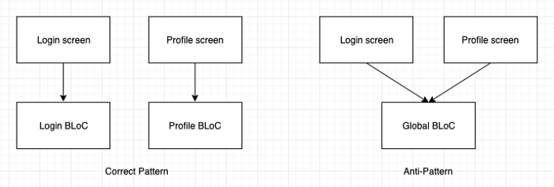

원문: [Effective BLoC pattern](https://medium.com/flutterpub/effective-bloc-pattern-45c36d76d5fe)

# Effective BLoC pattern

Hey Folks, Its been so long I have written anything about Flutter. After writing two articles on BLoC pattern I was spending time doing analysis on the usage of this pattern by the community and after answering some  questions on the implementation of BLoC pattern I saw that there was a lot of confusion among people. So I came up with a list of **“Rules of thumb”** that can be followed to properly implement the BLoC pattern which will help a developer to avoid making common mistakes while implementing it. So today I present to you a list of **8 golden points** that must be followed when working with BLoC.

안녕하세요. 여러분, 너무 오랫동안 나는 Flutter에 대해 아무것도 쓰지 않았습니다. BLoC 패턴에 대한 두 개의 기사를 작성한 후 커뮤니티에서이 패턴의 사용법을 분석하는 데 시간을 보냈으며 BLoC 패턴 구현에 대한 몇 가지 질문에 답한 후에 사람들 사이에 많은 혼란이 있음을 확인했습니다. 따라서 개발자가 일반적인 실수를 하지 않도록 BLoC 패턴을 올바르게 구현하려면 **"엄지 손가락 규칙"** 목록을 작성해야 합니다. 그래서 오늘 BLoC와 협력 할 때 따라야 할 **8가지 황금색 포인트** 목록을 드립니다.

# Prerequisites

The audience I expect should know what BLoC pattern is or have created an app using the pattern(at least did `CTRL + C` and `CTRL + V`). If this is the first time you heard the word “**BLoC”** then the below three articles would be the perfect place to start understanding this pattern:

내가 예상하는 잠재 고객은 BLoC 패턴이 무엇인지 알고 있거나 패턴을 사용하여 앱을 만들었습니다 (적어도 `CTRL + C`와 `CTRL + V`). "**BLoC"**라는 단어를 처음 들었을 경우 아래의 세 가지 기사가 이 패턴을 이해하기에 완벽한 장소가 될 것입니다.

1. Architect your Flutter project using BLoC pattern [**PART 1**](https://medium.com/flutterpub/architecting-your-flutter-project-bd04e144a8f1?source=post_page---------------------------) and [**PART 2**](https://medium.com/flutterpub/architect-your-flutter-project-using-bloc-pattern-part-2-d8dd1eca9ba5?source=post_page---------------------------)
2. [**When Firebase meets BLoC pattern**](https://medium.com/flutterpub/when-firebase-meets-bloc-pattern-fb5c405597e0?source=post_page---------------------------)

# Story of those who encountered BLoC

I know I know it is a tough pattern to understand and implement. I have seen many posts from developers asking “**Which is the best resource to learn BLoC pattern?**”  After going through all the different posts and comments I feel the  following points are the common hurdles every single person went through  when understanding this pattern.

이해하고 구현하는 것이 어려운 패턴이라는 것을 알고 있습니다. 나는 "BLoC 패턴을 배울 수있는 가장 좋은 자료는 어느것  인가?"라고 묻는 개발자들의 게시물을 많이 보았습니다. 모든 다른 게시물과 의견을 살펴본 후 다음 패턴이 이 패턴을 이해할 때마다 모든 사람이 겪었던 공통된 장애물이라고 생각합니다.

1. 반응 적으로 생각하기.
2. 생성해야하는 BLoC 파일의 수를 파악하는 데 어려움을 겪고 있습니다.
3. 이것이 규모에 관계없이 두려워합니다.
4. 스트림이 언제 폐기 될지 모릅니다.
5. What is the full form of BLoC? (It’s Business Logic Component 😅)
6. Many more….

그러나 오늘은 BLoC 패턴을 자신있게 그리고 효율적으로 구현하는 데 도움이되는 가장 중요한 몇 가지 사항을 나열 할 것입니다. 더 이상 지체하지 않고 놀라운 점들을 살펴 봅시다.

# Every screen has its own BLoC

이것은 기억해야 할 가장 중요한 요점입니다. 데이터 처리를 포함하는 로그인 화면, 등록 화면, 프로필 화면 등의 새 화면을 만들 때마다 새로운 BLoC를 만들어야 합니다. 앱의 모든 화면에 글로벌 BLoC를 사용하지 마세요. 일반적인 BLoC가 있다면 두 화면 사이의 데이터를 쉽게 사용할 수 있다고 생각해야합니다. 저장소가 BLoC에 그러한 공통 데이터를 제공해야하는 이유 때문에 좋지 않습니다. BLoC는 해당 데이터를 취하여 사용자에게 표시 할 수있는 방식으로 화면에 제공합니다.



왼쪽 다이어그램이 올바른 패턴입니다.

# Every BLoC must have a `dispose()` method

이것은 꽤 솔직합니다. 생성하는 모든 BLoC에는 `dispose()`메소드가 있어야합니다. 이 곳에서 청소를하거나 만든 모든 하천을 닫을 수 있습니다. `dispose ()`메소드의 간단한 예가 아래와 같습니다.

```dart
class MoviesBloc {
  final _repository = Repository();
  final _moviesFetcher = PublishSubject<ItemModel>();

  Observable<ItemModel> get allMovies => _moviesFetcher.stream;

  fetchAllMovies() async {
    ItemModel itemModel = await _repository.fetchAllMovies();
    _moviesFetcher.sink.add(itemModel);
  }

  dispose() {
    _moviesFetcher.close();
  }
}
```

# Don’t use StatelessWidget with BLoC

BLoC에 데이터를 전달하거나 BLoC에서 데이터를 가져 오는 화면을 만들 때마다 언제나 `StatefulWidget`을 사용하십시오. `StatelessWidget`을 통해 `StatefulWidget`을 사용하는 가장 큰 장점은 `StatefulWidget`에서 사용 가능한 라이프 사이클 메소드입니다. 나중에 BLoC 패턴으로 작업 할 때 무시할 수있는 가장 중요한 두 가지 방법에 대해 설명합니다. `StatelessWidgets`는 화면의 작은 정적 부분 (예 : 이미지 또는 하드 코딩 된 텍스트)을 만드는 것이 좋습니다. `StatelessWidget` PART1과 PART2에서 BLoC 패턴의 구현을보고 싶다면 `StatelessWidget`에서 `StatefulWidget`으로 변환 한 이유를 설명했습니다.

# Override `didChangeDependencies()` to initialise BLoC

이것은 BLoC 객체를 초기화하기 위해 처음에 `context`가 필요한 경우 `StatefulWidget`에서 오버 라이드하는 가장 중요한 메소드입니다. 초기화 방법으로 생각할 수 있습니다 (BLoC 초기화에만 권장). 우리는`initState()`를 가지고 있어서 왜 `didChangeDependencies()`를 사용하는지 논쟁 할 수도 있습니다. 문서에 따르면 `didChangeDependencies()`메소드에서 `BuildContext.inheritFromWidgetOfExactType`을 호출하는 것이 안전하다는 것을 분명히 언급했습니다. 이 방법을 사용하는 방법의 간단한 예가 아래에 나와 있습니다.

```dart
@override
  void didChangeDependencies() {
    bloc = MovieDetailBlocProvider.of(context);
    bloc.fetchTrailersById(movieId);
    super.didChangeDependencies();
  }
```

# Override dispose() method to dispose BLoC

초기화 메소드가 있는 것처럼 BLoC에서 작성한 연결을 처리 할 수있는 메소드가 제공되었습니다. `dispose()`메소드는 특정 스크린과 관련된 BLoC `dispose()`메소드를 호출하기에 완벽한 장소입니다. 이 메소드는 화면을 떠날 때 (기술적으로`StatefulWidget`이 처리 될 때) 항상 호출됩니다. 아래는 그 방법의 작은 예입니다 :

```dart
@override
  void dispose() {
    bloc.dispose();
    super.dispose();
  }
```

# Use RxDart only when dealing with complex logic

BLoC 패턴으로 일한 경험이 있다면 `RxDart` 라이브러리에 대해 들어 보셨을 것입니다. Google Dart의 반응 형 함수 프로그래밍 라이브러리입니다. 이 라이브러리는 Dart가 제공 한`Stream` API에 대한 래퍼 일뿐입니다. 여러 개의 네트워크 요청을 연결하는 것과 같은 복잡한 논리를 다루는 경우에만 이 라이브러리를 사용하는 것이 좋습니다. 그러나 간단한 구현의 경우 Dart 언어로 제공되는 `Stream` API를 사용하면 상당히 성숙합니다. 아래는 `RxDart` 라이브러리보다는 `Stream` API를 사용하는 BLoC를 추가 한 것입니다. 조작이 매우 간단하고 동일한 라이브러리를 추가로 할 필요가 없기 때문입니다.

```dart
import 'dart:async';

class Bloc {

  //Our pizza house
  final order = StreamController<String>();

  //Our order office
  Stream<String> get orderOffice => order.stream.transform(validateOrder);

  //Pizza house menu and quantity
  static final _pizzaList = {
    "Sushi": 2,
    "Neapolitan": 3,
    "California-style": 4,
    "Marinara": 2
  };

  //Different pizza images
  static final _pizzaImages = {
    "Sushi": "http://pngimg.com/uploads/pizza/pizza_PNG44077.png",
    "Neapolitan": "http://pngimg.com/uploads/pizza/pizza_PNG44078.png",
    "California-style": "http://pngimg.com/uploads/pizza/pizza_PNG44081.png",
    "Marinara": "http://pngimg.com/uploads/pizza/pizza_PNG44084.png"
  };


  //Validate if pizza can be baked or not. This is John
  final validateOrder =
      StreamTransformer<String, String>.fromHandlers(handleData: (order, sink) {
    if (_pizzaList[order] != null) {
      //pizza is available
      if (_pizzaList[order] != 0) {
        //pizza can be delivered
        sink.add(_pizzaImages[order]);
        final quantity = _pizzaList[order];
        _pizzaList[order] = quantity-1;
      } else {
        //out of stock
        sink.addError("Out of stock");
      }
    } else {
      //pizza is not in the menu
      sink.addError("Pizza not found");
    }
  });

  //This is Mia
  void orderItem(String pizza) {
    order.sink.add(pizza);
  }
}
```

# Use PublishSubject over BehaviorSubject

이 점은 Flutter 프로젝트에서 `RxDart` 라이브러리를 사용하는 사람들에게 더 구체적입니다. `BehaviorSubject`는 콘트롤러에 추가 된 최신 아이템을 캡쳐하고 새로운 리스너의 첫 번째 아이템으로 방출하는 특별한 `StreamController`입니다. `BehaviorSubject`에 `close()`또는 `drain()`을 호출하더라도, 마지막 항목을 유지하고 가입시 방출됩니다. 개발자가 이 기능을 인식하지 못하면 악몽이 될 수 있습니다. `PublishSubject`는 마지막 항목을 저장하지 않고 대부분의 경우에 가장 적합합니다. 이 [프로젝트](https://github.com/SAGARSURI/Goals?source=post_page---------------------------)를 확인하십시오. 행동에서`BehaviorSubject` 기능을 볼 수 있습니다. 앱을 실행하고 '목표 추가'화면으로 이동 한 후 양식에 세부 정보를 입력하고 뒤로 탐색하십시오. 다시 '목표 추가'화면을 방문하면 이전에 입력 한 데이터로 미리 채워진 양식을 찾을 수 있습니다. 당신이 나 같은 게으른 사람이라면 아래에 첨부 한 비디오를보십시오.

<iframe src="https://cdn.embedly.com/widgets/media.html?src=https%3A%2F%2Fwww.youtube.com%2Fembed%2FN7-C3o_O1jE%3Fstart%3D42%26feature%3Doembed%26start%3D42&amp;url=http%3A%2F%2Fwww.youtube.com%2Fwatch%3Fv%3DN7-C3o_O1jE&amp;image=https%3A%2F%2Fi.ytimg.com%2Fvi%2FN7-C3o_O1jE%2Fhqdefault.jpg&amp;key=a19fcc184b9711e1b4764040d3dc5c07&amp;type=text%2Fhtml&amp;schema=youtube" title="Goals App Demo" class="gd p q gc ac" width="640" height="480" frameborder="0"></iframe>

# Proper use of BLoC Providers

이 점에 대해 말하기 전에 아래 코드 스니펫 (9 행 및 10 행)을 확인하십시오.

```dart
import 'package:flutter/material.dart';
import 'ui/login.dart';
import 'blocs/goals_bloc_provider.dart';
import 'blocs/login_bloc_provider.dart';

class MyApp extends StatelessWidget {
  @override
  Widget build(BuildContext context) {
    return LoginBlocProvider(
      child: GoalsBlocProvider(
        child: MaterialApp(
          theme: ThemeData(
            accentColor: Colors.black,
            primaryColor: Colors.amber,
          ),
          home: Scaffold(
            appBar: AppBar(
              title: Text(
                "Goals",
                style: TextStyle(color: Colors.black),
              ),
              backgroundColor: Colors.amber,
              elevation: 0.0,
            ),
            body: LoginScreen(),
          ),
        ),
      ),
    );
  }
}
```

여러 BLoC provider가 중첩되어 있음을 명확하게 볼 수 있습니다. 이제는 같은 체인에 BLoC를 계속 추가하면 악몽이되고 BLoC 패턴을 확장 할 수 없다는 결론을 내릴 것이라는 점에 대해 걱정해야합니다. 그러나 위젯 네비게이션이 위젯 네비게이션의 어느 곳에서나 여러 개의 BLoC에 액세스해야 할 때 특별한 경우가 있을 수 있습니다 (앱 전체에 필요한 UI 구성 만 가지고있는 BLoC 만 가능). 그러나 대부분의 시간 중첩을 피하고 BLoC가 실제로 필요한 위치에서 제공하도록 권장합니다. 예를 들어 새로운 화면으로 이동할 때 다음과 같이 BLoC 공급자를 사용할 수 있습니다.

```dart
openDetailPage(ItemModel data, int index) {
    final page = MovieDetailBlocProvider(
      child: MovieDetail(
        title: data.results[index].title,
        posterUrl: data.results[index].backdrop_path,
        description: data.results[index].overview,
        releaseDate: data.results[index].release_date,
        voteAverage: data.results[index].vote_average.toString(),
        movieId: data.results[index].id,
      ),
    );
    Navigator.push(
      context,
      MaterialPageRoute(builder: (context) {
        return page;
      }),
    );
  }
```

이렇게하면 `MovieDetailBlocProvider`는 BLoC를 `MovieDetail` 화면에 제공하고 전체 위젯 트리에는 제공하지 않습니다. `MovieDetailScreen`에서 키보드를 열거 나 닫을 때마다 `MovieDetailScreen`을 새로운 `final vairable`에 저장하여 `MovieDetailScreen`을 다시 만들지 않는 것을 볼 수 있습니다.

# This is not the end

그래서 여기에 우리는이 기사의 끝으로갑니다. 그러나 이것이이 주제의 끝은 아닙니다. 패턴을 확장하고 구현하는 더 나은 방법을 배우면서 BLoC 패턴을 최적화하는 계속 증가하는 목록에 새로운 포인트를 계속 추가 할 것입니다. 이 점이 BLoC 패턴을보다 나은 방법으로 구현하는 데 도움이되기를 바랍니다. 계속 배우고 코딩하십시오. :) 만약 당신이 기사를 좋아한다면 **50 claps😄👏👏**를 치면 당신의 사랑을 보여주세요.

의심의 여지가 있으면 [LinkedIn **](https://www.linkedin.com/in/sagar-suri/?source=post_page- -------------) 또는 [Twitter](https://twitter.com/SagarSuri94?source=post_page---- ----------------). 나는 당신의 모든 질문을 해결하기 위해 최선을 다할 것입니다.

## 참조

- [Effective BLoC pattern](https://medium.com/flutterpub/effective-bloc-pattern-45c36d76d5fe)