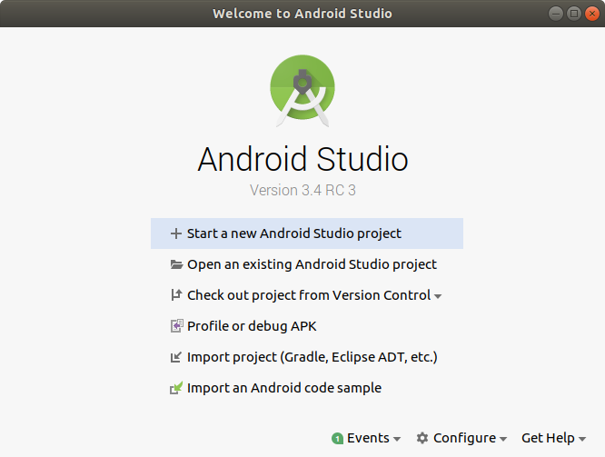
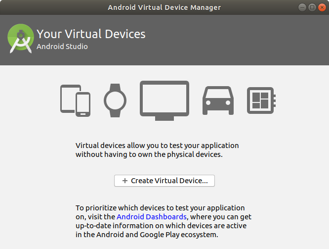
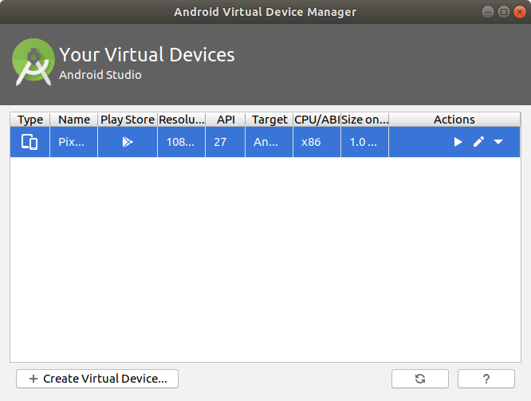

# Ubuntu에서 재빠르게 VSCode와 Flutter 개발 환경 구성하기

2019년 7월 12일

운영체제를 설치할때마다 개발환경을 구성하는 것은 피곤한 일입니다. 저는 스크립트 파일을 작성하여 깃헙에 올려두고 필요시 클론하여 스크립트로 설치합니다. 개인적으로 사용하는 설치 스크립트는 비밀번호등도 함께 있어 공개하지 못하고, Flutter, VSCode에 대한 설치 스크립트만 공유 합니다.

이 문서의 소스 파일은 [이곳](https://github.com/booiljung/ubuntu_flutter_vscode)에 있습니다.

### 준비

저는 `~/linspace`라는 linux workspace 폴더에서 개발 작업을 합니다. 별도의 폴더 이름을 사용하는 경우 아래 스크립트에서 `linspace`를 사용하시는 폴더 이름으로 변경 하시면 됩니다.

```sh
$ cd ~						# 홈디렉토리
$ mkdir linspace			# 개발 작업용 폴더 생성 유저마다 다를 것입니다.
$ cd linspace
$ sudo apt install git		# git 설치 및 스크립트 클론
$ git clone https://github.com/booiljung/ubuntu_flutter_vscode.git
$ cd ubuntu_flutter_vscode
$ sh install.sh				# 설치 스크립트 실행
```

이 설치 스크립트 파일 들의 내용은 아래와 같습니다.

### VSCode 설치 스크립트

```sh
# vscode
curl https://packages.microsoft.com/keys/microsoft.asc | gpg --dearmor > microsoft.gpg
sudo install -o root -g root -m 644 microsoft.gpg /etc/apt/trusted.gpg.d/
sudo sh -c 'echo "deb [arch=amd64] https://packages.microsoft.com/repos/vscode stable main" > /etc/apt/sources.list.d/vscode.list'
sudo apt-get install apt-transport-https
sudo apt-get update
sudo apt-get install code -y # or code-insiders

# plugins
code --install-extension aksharpatel47.vscode-flutter-helper
code --install-extension alexisvt.flutter-snippets
code --install-extension AzMoza.aqueduct-helper
code --install-extension Dart-Code.dart-code
code --install-extension Dart-Code.flutter
code --install-extension esskar.vscode-flutter-i18n-json
code --install-extension everettjf.pubspec-dependency-search
code --install-extension FelixAngelov.bloc
code --install-extension gmlewis-vscode.flutter-stylizer
code --install-extension gornivv.vscode-flutter-files
code --install-extension luanpotter.dart-import
code --install-extension oscarcs.dart-syntax-highlighting-only
code --install-extension pflannery.vscode-versionlens
```

### Dart 설치 스크립트

```sh
# dart
sudo apt update -y
sudo apt install -y curl
sudo sh -c 'curl https://dl-ssl.google.com/linux/linux_signing_key.pub | apt-key add -'
sudo sh -c 'curl https://storage.googleapis.com/download.dartlang.org/linux/debian/dart_stable.list > /etc/apt/sources.list.d/dart_stable.list'
sudo apt-get update -y
sudo apt-get install -y dart

cat dart_debian_profile.txt >> ~/.profile

# Aqueduct
/usr/lib/dart/bin/pub global activate aqueduct
```

아래는 `~/.profile` 구성 파일입니다.

```sh
# dart
export PATH="$PATH":"/usr/lib/dart/bin/"

# flutter
export PATH="$PATH":"$HOME/linspace/flutter/bin/"

# flutter webdev
export PATH="$PATH":"$HOME/.bin/cache/dart-sdk/bin"
export PATH="$PATH":"$HOME/.pub-cache/bin"
```

### Flutter 설치

플러터 최신 버전이 스크립트로 설치하는 방법을 모르겠습니다. 

[Get the Flutter SDK](https://flutter.dev/docs/get-started/install/linux)에서 `flutter_linux_vx.x.x+xxxxx-stable.tar.xz`를 다운로드 받고, 작업 폴더에 압축을 풉니다. 여기서 tar 파일 이름은 Flutter 버전에 따라 다릅니다.

```sh
cd ~/linspace
tar xf ~/Download/flutter_linux_vx.x.x+xxxxx-stable.tar.xz
```

`~/lispace/flutter/bin`을 `export` 경로에 설정해야 하는데 위 스크립트 파일에 이미 포함 되어 있습니다.

### VSCode 플러그인 설치

VSCode 설치시 아래 플러그인들을 설치하였습니다. 확인해 보실 수도 있습니다.

| 검색어   | 플러그인 이름           | 제작자                | 용도                                       |
| -------- | ----------------------- | --------------------- | ------------------------------------------ |
| dart     | Dart                    | Dart Code             | Dart 지원 플러그인                         |
| flutter  | Flutter                 | Dart Code             | Flutter 지원 플러그인                      |
| flutter  | Flutter Files           | Igor Kravchenko       | Flutter 코드 스니펫                        |
| flutter  | Flutter Widget Snippets | Alexis Villegas Tores | Flutter Widget 코드 스니펫                 |
| bloc     | bloc                    | Felix Angelov         | Dart Bloc, Flutter Bloc 패턴 지원 플러그인 |
| aqueduct | Aqueduct Helper         | AzMoza                | REST API 프레임워크 플러그인               |

### Andorid Studio 설치

```sh
# Android Studio

sudo apt install cpu-checker -y
sudo apt install qeum-kvm -y
sudo adduser $USER kvm

sudo add-apt-repository ppa:maarten-fonville/android-studio
sudo apt -y update
sudo apt install -y android-studio

cat android_studio_profile.txt >> ~/.profile
```

다음은 `~/.profile` 구성 파일입니다.

```
# android studio
export PATH="$PATH":"/opt/android-studio/bin/"
```

## 이곳부터 수작업 설치.

(스크립트 설치 하는 방법이 정리되면 수정해서 올리겠습니다.)

### AVD 설치 (안드로이드 개발)

Android Studio 를 설치하고 실행하면 Welcome 상자가 표시 됩니다.



대화상자 아래 Confgure에서 AVD Manager를 실행합니다.



Create Virtual Device..  버튼을 눌러서 디바이스를 생성합니다. 필요에 따라 운영체제를 다운로드 하고 계약에 서명해야 할 수도 있습니다. 디바이스를 생성하면 다음과 같습니다.



### Flutter 프로젝트 생성

터미널에서 Flutter 프로젝트를 생성하려면

```
flutter create 프로젝트 이름
```

을 해도 되고,

VSCode에서 `Ctrl+P`를 눌러서 명령 파레트를 표시하고, `>Flutter New Project`를 선택하고, 나타나는 팝업창에서 폴더를 지정하면 해당 폴더에 프로젝트를 생성합니다.

### VSCode에서 AVD 실행.

Ubuntu 의 파일 프로그램에서 Flutter 프로젝트 폴더를 선택하고 오른쪽 버튼을 눌러서 VSCode로 열면 VSCode로 프로젝트를 작업할 수 있습니다.

에제 VSCode에서 Device를 실행할 수 있습니다. 화면 아래에 보면 No Device가 보입니다. 


그것을 클릭하면, VSCode 상단의 명령 파레트에 디바이스 선택 메뉴가 표시 되며, 디바이스를 선택하면 됩니다. 디바이스가 없는 경우 플러터가 가상 디바이스를 자동으로 생성하기도 하지만, Android 운영체제를 다운로드 하지 않았다면, 자동 설치가 되지 않으며, 반드시 AVD Manager에서 운영체제를 다운로드 해야 할 수도 있습니다.

### VSCode에서 실행

`main.dart`를 편집 상태로 연 상태에서 `메인메뉴\Debug\Start Debugging`을 선택하거나, 좌측 패인에서 `벌레금지 아이콘`을 선택한 후 패인 위쪽 파란색 화살표를 누려면 AVD에서 디버깅을 할 수 있습니다.

### AVD 권한 오류 

위에 스크립트에서 QEMU도 설치합니다만, QEMU 를 설치하였더라도 권한때문에 `KVM is required to run this AVD` 오류를 표시하며, 실행이 되지 않는 경우가 있습니다. 반드시 `kvm` 그룹에 현재 사용자 이름을 추가해야 합니다.

```sh
sudo adduser 유저이름 kvm
```

유저가 그룹에 추가 되었다면

```
grep kvm /etc/group
```

을 하면

```
kvm:x:xxx:유저이름
```

을 볼 수 있습니다.

## 참조

- [KVM is required to run this AVD](https://askubuntu.com/questions/1050621/kvm-is-required-to-run-this-avd)

 