# TMAX OS 데스크탑 설치

TMAX  OS를 VBOX에 설치하기로 하였습니다. 램은 4G바이트, 스토리지는 34기가 바이트를 할당하였습니다.

주어진 iso 로 부팅하면 아래 화면을 볼 수 있습니다.

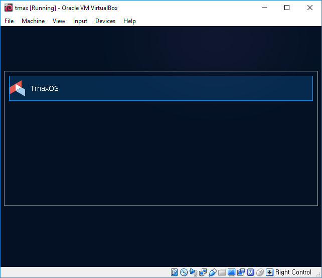

마우스로 클릭하면 진행되지 않습니다. 선택 후 반드시 엔터를 쳐야 합니다. SSD에서 30초쯤 기다리면 주어진 언어를 선택하게 하게 합니다. 한국어와 영어 둘중 하나를 선택할 수 있습니다.

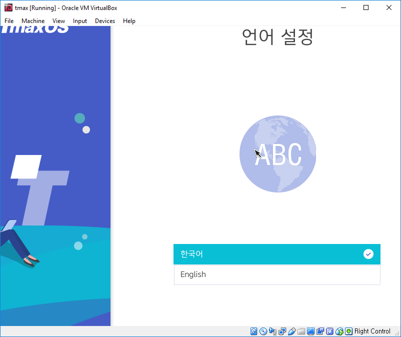

마우스로 언어를 선택했는데 진행되지 않습니다. 더블 클릭도 되지 않으며, 다른 버튼도 없습니다. 매뉴얼을 검색하여 읽었습니다. 투박해 보이는 매뉴얼은 개발자가 작성한 것 같습니다. 읽다보니 모든 옵션은 선택한 다음에 엔터를 누르라고 합니다. 엔터를 눌러도 되지 않습니다. 키보드를 마구 눌러 보았습니다. 어? 다음으로 진행되었습니다. 키보드가 장착되었는지 확인하려는 설치 프로그램인가 싶었습니다.

약관에 동의하는 화면입니다.

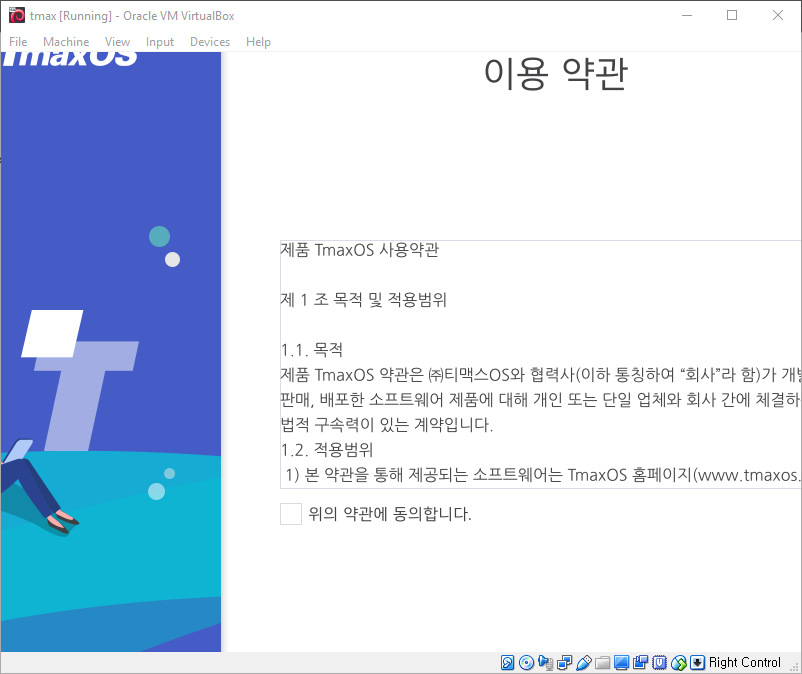

약관의 일부가 잘려져 보입니다. 스크롤할 방법도 없습니다. 어쩔 수 없이 읽지 않고 약관에 동의했습니다. 엔터를 눌렀더니 약관 선택이 토글 됩니다. 아! 화면이 잘렸나 봅니다. 설치 프로그램이 1024x768 기준으로 된것 같습니다. 640x480이 기본인 VBOX에서는 헤멜 수도 있습니다. 탭을 한번 누르고 엔터를 눌렀더니 언어 선택으로 되돌아 갑니다. 아! 탭을 두번 눌렀어야 했습니다.

추정하자며 아래에 `이전` `다음` 버튼이 있는것 같습니다. 이것은 개발자들이 자신들에게도 닥칠 수 있는 예외적인 두려운 상황입니다.

언어 선택은 첫 화면이라 이전 버튼이 없을 것입니다. 그래서 언어 선택은 탭을 한번누르고, 다른 선택은 탭을 두번 누르면 될거라고 생각이 들었습니다.

탭을 두번 눌러서 설치하기 까지 왔습니다.

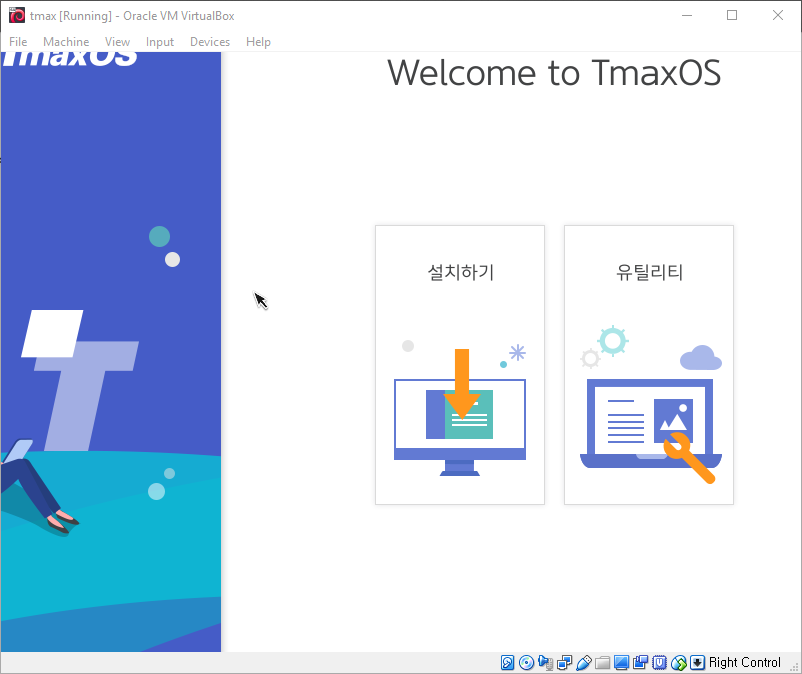

어? 이 옵션은 마우스로 버튼을 클릭하기만 해도 진행 됩니다. 

다음은 옵션인데 화면이 잘린 상태에서 옵션 선택은 두렵습니다.

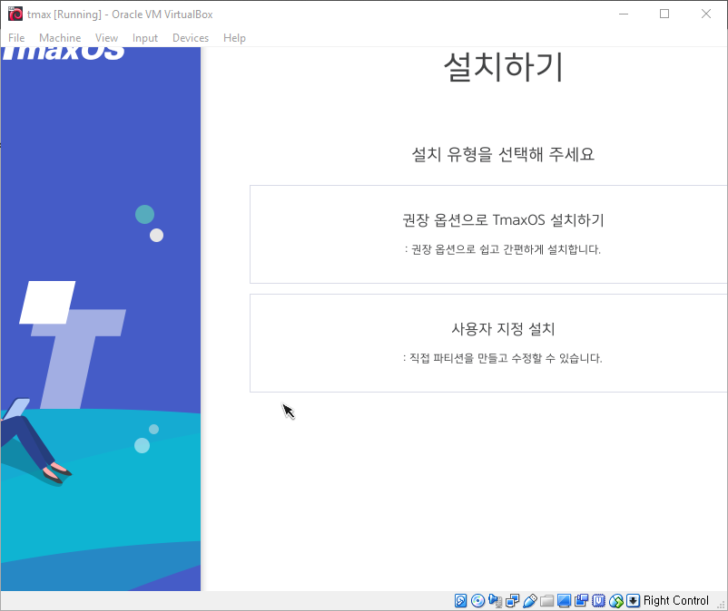

다행하게도 클릭만 해도 다음 단계로 진행 됩니다.

설치할 스토리지를 선택 합니다. 스토리지를 선택해도 넘어가지 않습니다.

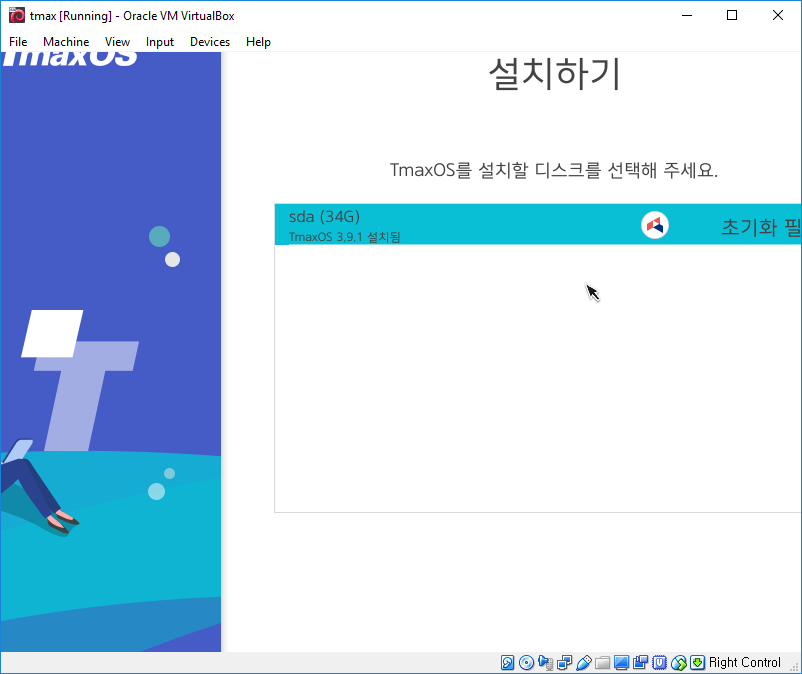

탭을 두번 누른후 엔터를 누릅니다.

디스크를 초기화 후 설치하라는 경고입니다.

탭을 두번 누른후 엔터를 치려고, 이 글을 입력하는 동안 5초만에  경고 창이 떴습니다. 따라서 엔터를 칠 필요가 없습니다.

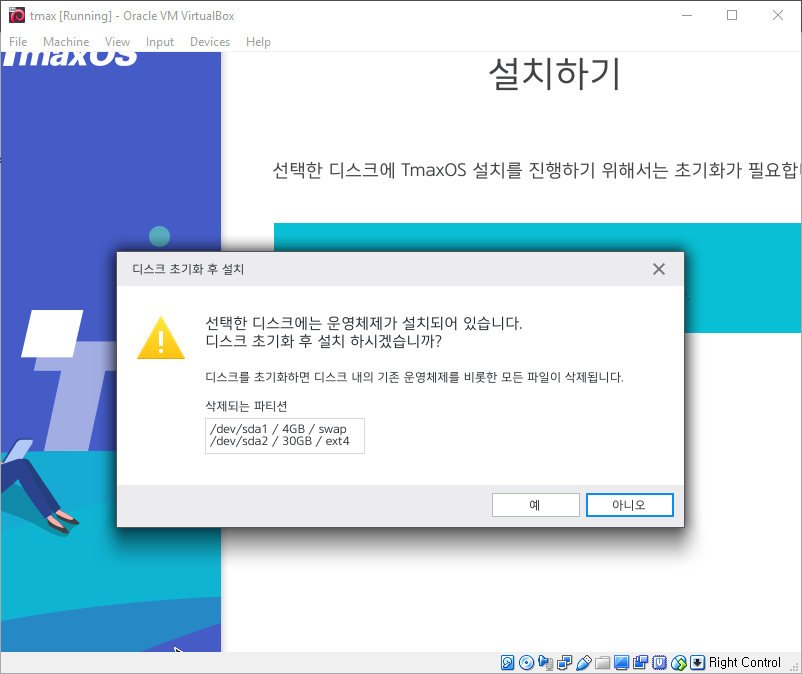

예를 눌러서 계속 진행합니다.

드디어 설치가 됩니다.

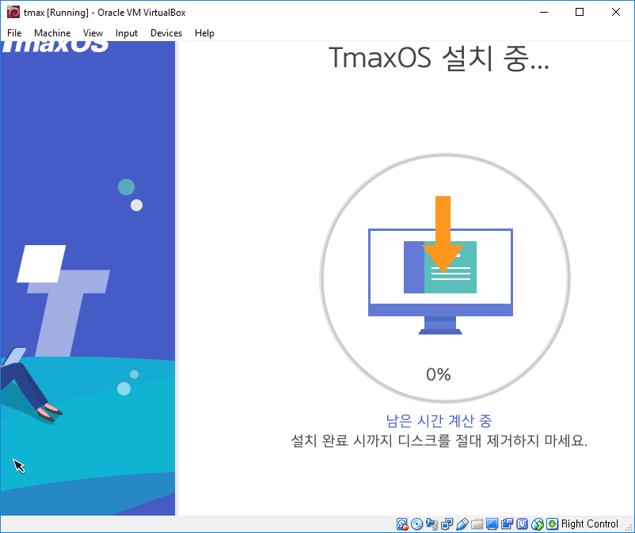

VBOX의 SSD에서 약 3분 걸린다고 합니다.

는 뻥이고 패키지를 설치한다고 합니다.

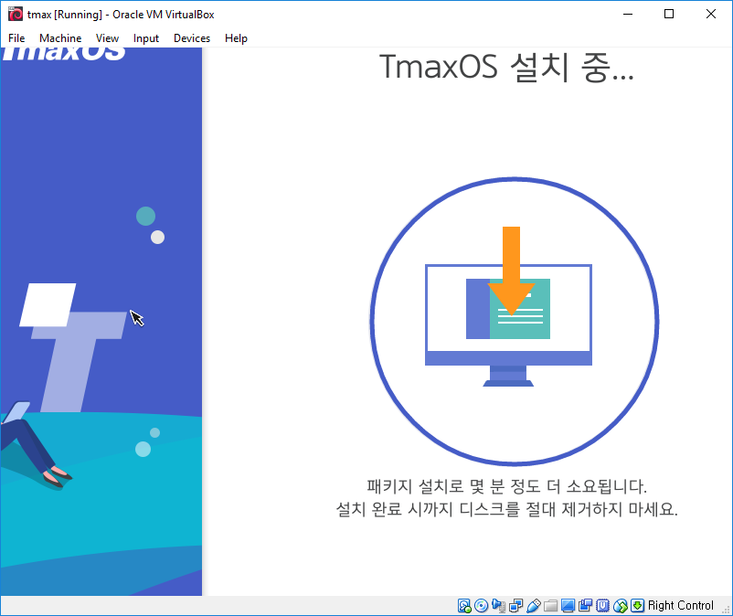

모두 설치되었다고 합니다. 재부팅을 합니다.

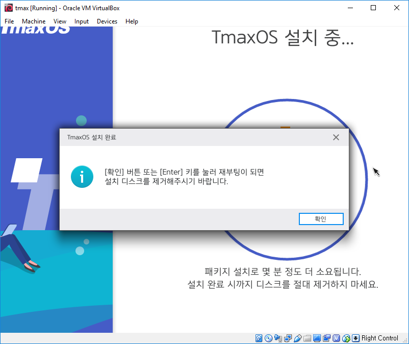

국가를 설정합니다.

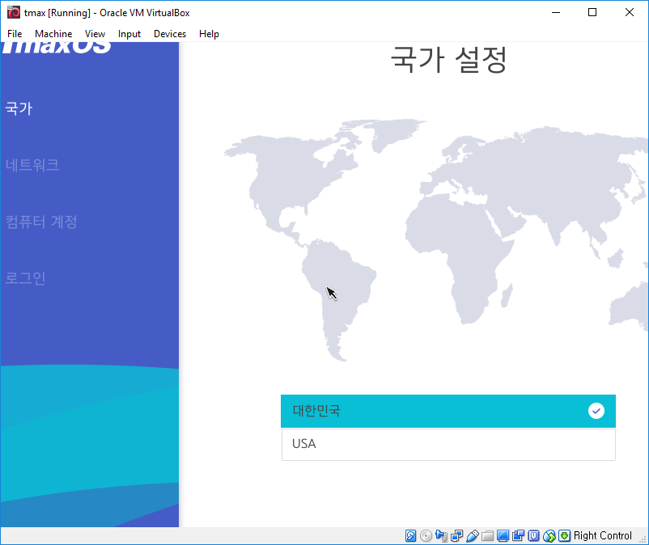

네트워크 설정

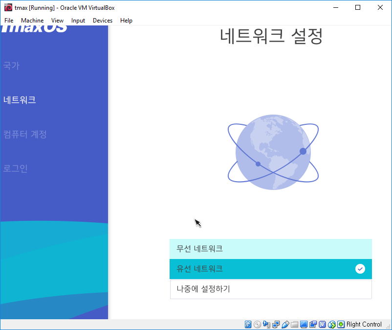

선택 후 탭을 두번누르면 이전 화면으로 갑니다. 이번에는 세번 눌러야 합니다.

유선 네트워크 설정입니다. 화면도 잘려서 보이지 않는데 왜 자꾸 이걸 시키는 걸까요?

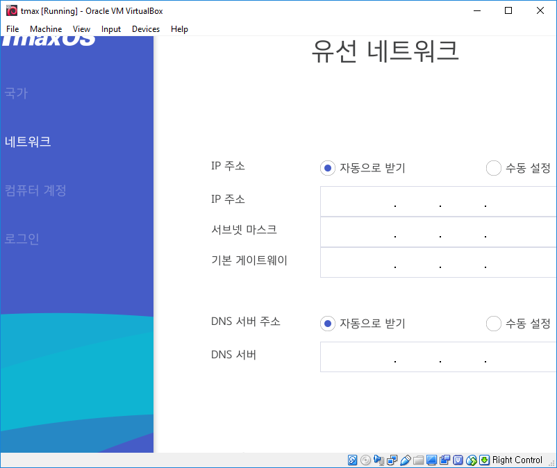

화면 해상도부터 세팅해야 하는데 말입니다. 탭을 3번 누르고 엔터를 누릅니다.

컴퓨터 계정 설정입니다. 우분투는 설치시 묻는데 TMAX는 설치 후 묻습니다.

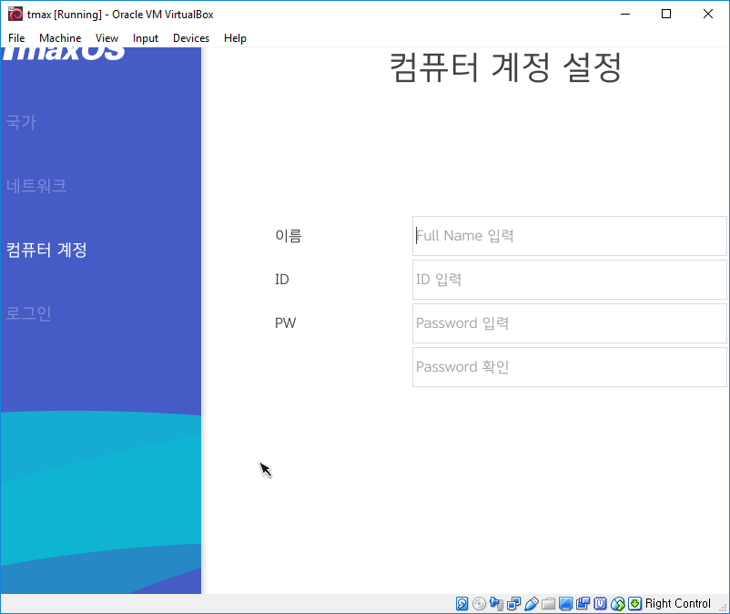

여기서는 탭을 두번 누르고 엔터를 눌러야 합니다.

계정을 연동하라고 합니다.

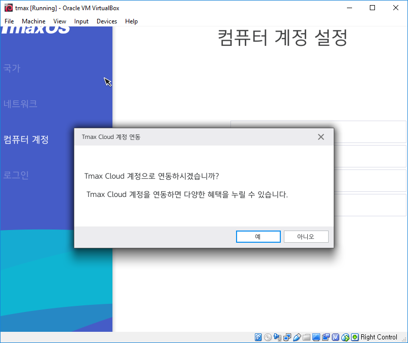

연동이 무엇인지도 모르는데 연동은 알고 난 다음에 하기로하고 아니오를 선택했습니다.

설정을 저장한다고 합니다. 아마 사용자 계정을 생성하는것 같습니다.

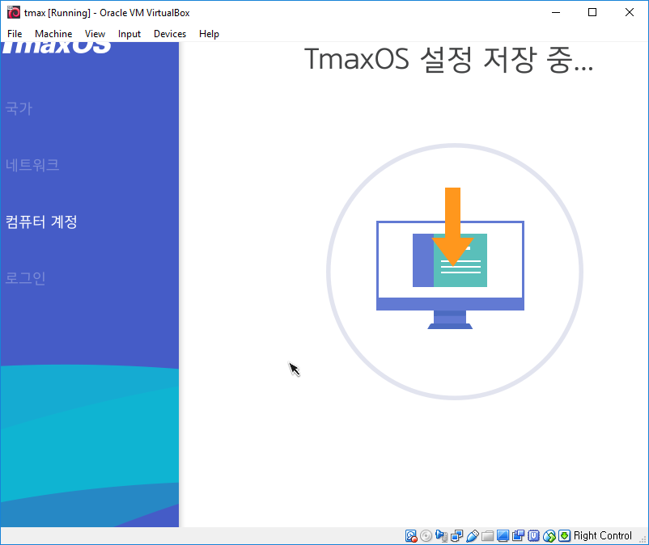

로그인 화면입니다.

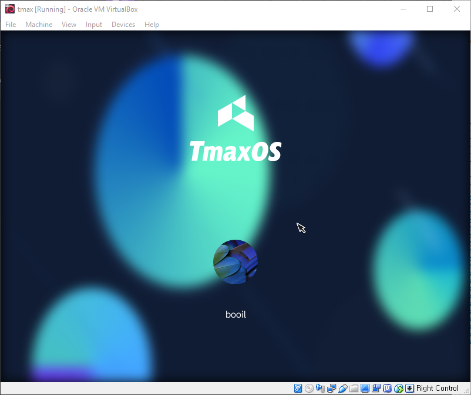

설마 여기서도 화면이 잘리지는 않겠죠? 비밀번호를 입력하는데 아이콘이 아름답습니다.

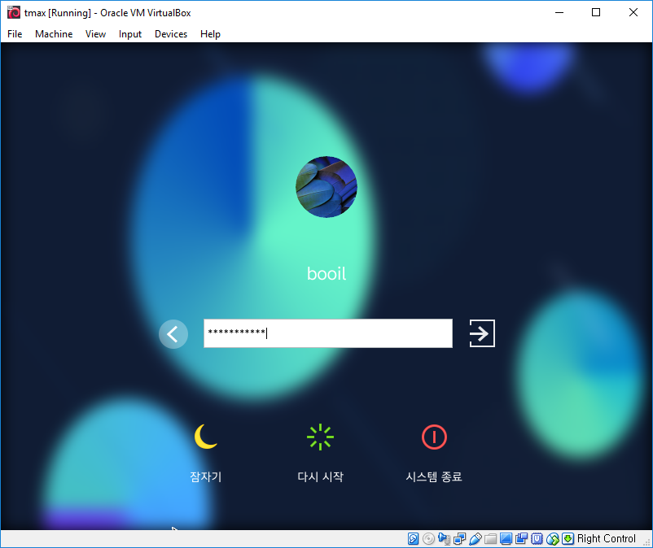

까만 화면을 한참 기다리면...

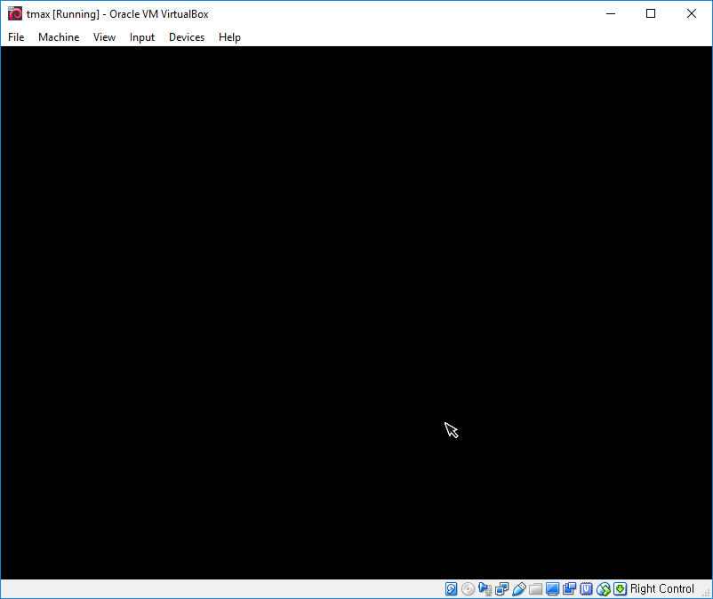

1분을 기다렸습니다. 메시지도 보이지 않는데 무엇을 하고 있는 걸까요?

2분을 기다렸습니다.

3분을 기다렸습니다.

4분을 기다렸습니다.

가상머신을 리셋 했습니다. 다시 로그인을 하겠습니다.

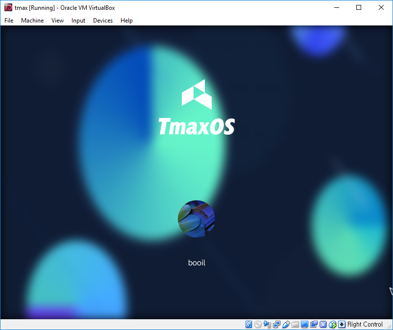

이번에는 까만 화면이 아닙니다.

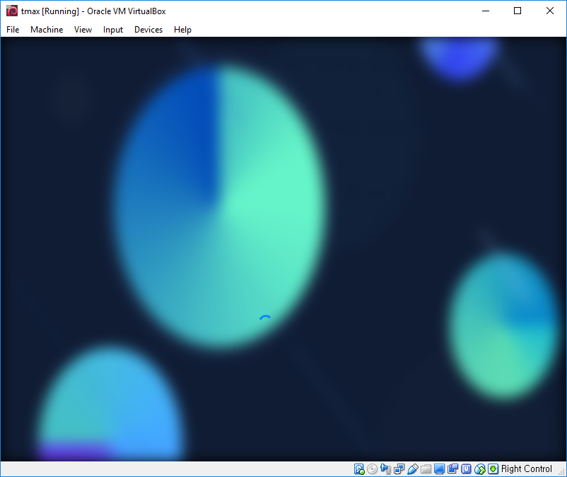

1분을 기다렸습니다.

2분을 기다렸습니다.

3분을 기다렸습니다.

음... VBOX에서 이미지를 삭제 했습니다. 제가 올해 한 일 중 가장 쓸데 없는 일을 한것 같습니다.

